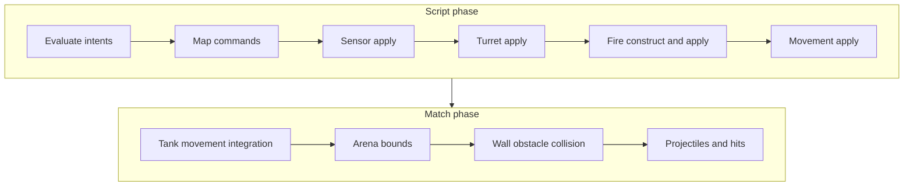

# ScriptTanks

[](https://github.com/chrismaghuhn/ScriptTanks/actions/workflows/dotnet.yml)

**A deterministic programming autobattler where tanks fight using player-authored routines—not direct control.**

---

## What is ScriptTanks?

ScriptTanks is a programming-game-style autobattler in active development. Each tank runs a script: prioritized routines with conditions and commands. The simulation core resolves sensing, turret aim, firing, movement, arena bounds, wall collision, and projectile combat on a fixed tick schedule.

The repository today is primarily a **heavily tested C#/.NET simulation and scripting runtime**, with a separate Godot client under [`script-tanks/`](script-tanks/) that is still evolving. The emphasis is on deterministic behavior, replayable matches, and explicit integration checkpoints—not a finished commercial release.

---

## Status

| Area | State |
|------|--------|
| Deterministic match simulation | Implemented in `ScriptTanks.Core` |
| Combined script runtime (sensor, turret, fire, movement) | Integrated; see [docs/SCRIPT_RUNTIME_INTEGRATION_CHECKPOINT.md](docs/SCRIPT_RUNTIME_INTEGRATION_CHECKPOINT.md) |
| Runner / replay recording | Implemented |
| Godot client | Experimental; not the main focus of this repo |
| Public playable build | Not yet |

---

## Features (core)

- **Deterministic match simulation** — fixed tick stepping suitable for replays and regression tests
- **Player-authored tank routines** — script programs with routine priority and command selection
- **Script command / routine selection** — condition evaluation and first-match routine selection per tick
- **Projectile combat** — spawn, movement, hit resolution, muzzle geometry policies
- **Turret aim** — full-angle aiming, gradual turn-rate rotation, script-visible alignment status (`TurretAligned`, `TurretTurning`, etc.)
- **Combined runtime runner and replay** — deterministic multi-tick execution with optional logging
- **Extensive automated tests** — **3231** xUnit tests (`dotnet test ScriptTanks.sln`)
- **Docs-first integration checkpoints** — authoritative records of completed system tracks under [`docs/`](docs/)

---

## Why this is interesting

- **Deterministic simulation** — same inputs and script should yield the same tick outcomes; designed for debugging and competitive fairness later
- **AI via scripting, not hand-authored BTs** — tanks behave through programs the player composes
- **Replay and inspectability** — combined runner/replay and logging checkpoints support post-hoc analysis
- **Programming-game trajectory** — core-first architecture leaves room for richer language/UX, UI visualization, and PvP without rewriting combat fundamentals

This project demonstrates simulation architecture, C#/.NET engineering discipline, test-driven development, gameplay systems design (combat, aim, movement), scripting runtime design, and replay-oriented thinking—not a shipped storefront title.

---

## Repository structure

| Path | Role |
|------|------|
| [`src/ScriptTanks.Core`](src/ScriptTanks.Core) | Deterministic simulation, scripting, match tick pipelines, replay |
| [`tests/ScriptTanks.Core.Tests`](tests/ScriptTanks.Core.Tests) | xUnit tests for the core |
| [`docs/`](docs/) | Integration checkpoints, plans, and navigation hub |
| [`script-tanks/`](script-tanks/) | Godot 4 client (current visual front-end) |
| [`ScriptTanks_Document_Package/`](ScriptTanks_Document_Package/) | Full game design and planning archive (German) |
| [`game/`](game/) | Reserved future client location; active Godot project is `script-tanks/` |

---

## Quick start

Requires [.NET SDK 10](https://dotnet.microsoft.com/download) (tests target `net10.0`; core also builds `net8.0`).

```bash
dotnet build ScriptTanks.sln -warnaserror
dotnet test ScriptTanks.sln
```

See [CONTRIBUTING.md](CONTRIBUTING.md) and [docs/DEVELOPMENT.md](docs/DEVELOPMENT.md) for workflow and philosophy.

---

## Architecture overview

### Per-tick script composition

One script pass per tank tick (simplified):

```text
MatchScriptIntentIntegration → ScriptTranslatedCommandDomainMapper
  → Sensor apply → Turret apply → Fire construct/apply → Movement apply
  → merged runtime (sensor loadouts reconciled)
```

Source: [`CombinedScriptRuntimeComposer`](src/ScriptTanks.Core/Scripting/CombinedScriptRuntimeComposer.cs).

### Combined match tick (post-integration)

After scripts, the combined tick pipeline runs movement, bounds, obstacles, then projectiles:

```text
CombinedScriptRuntimeComposer.Run
  → MatchStateTankMovementPipeline
  → MatchStateTankBoundsPipeline
  → MatchStateTankObstacleCollisionPipeline
  → MatchTickProjectilePipeline (hits, resolution)
  → advance tick
```

Authoritative ordering: [docs/WALL_OBSTACLE_COLLISION_INTEGRATION_CHECKPOINT.md](docs/WALL_OBSTACLE_COLLISION_INTEGRATION_CHECKPOINT.md) §3 (supersedes older bounds-only flow).



Long-running matches use [`CombinedRuntimeRunner`](src/ScriptTanks.Core/Scripting/CombinedRuntimeRunner.cs) and replay types under [`Replay/`](src/ScriptTanks.Core/Replay/).

---

## Development philosophy

- **Deterministic core** — behavior changes must preserve reproducibility; regressions are caught by tests
- **Pure pipelines where possible** — scripting and match steps composed as explicit pipelines with typed results
- **Test-driven development** — build with `-warnaserror`; new behavior ships with tests
- **Explicit integration checkpoints** — completed tracks documented under `docs/*_INTEGRATION_CHECKPOINT.md` before the next architectural jump

---

## Current limitations

- No polished public game build or Steam-ready loop
- Godot UI and client integration still evolving
- Networking / multiplayer not finalized
- Scripting language and player-facing UX still evolving
- **Single condition per routine today** — compound logic (e.g. `TurretAligned AND WeaponReady`) requires routine ordering workarounds; see [docs/MULTI_CONDITION_SCRIPT_ROUTINE_PLAN.md](docs/MULTI_CONDITION_SCRIPT_ROUTINE_PLAN.md)

---

## Roadmap (directional)

- Multi-condition script routines (AND semantics MVP)
- Richer scripting surface and translator
- UI / replay visualization
- Playable Godot loop wired to core runner
- Campaign and PvP modes (later)

---

## Documentation

**Start here:** [docs/README.md](docs/README.md) — topic map for checkpoints and plans.

**Integration checkpoints (implemented tracks):**

- [SCRIPT_RUNTIME_INTEGRATION_CHECKPOINT.md](docs/SCRIPT_RUNTIME_INTEGRATION_CHECKPOINT.md)
- [COMBINED_RUNTIME_LOGGING_CHECKPOINT.md](docs/COMBINED_RUNTIME_LOGGING_CHECKPOINT.md)
- [FULL_ANGLE_TURRET_AIM_INTEGRATION_CHECKPOINT.md](docs/FULL_ANGLE_TURRET_AIM_INTEGRATION_CHECKPOINT.md)
- [TURRET_TURN_RATE_INTEGRATION_CHECKPOINT.md](docs/TURRET_TURN_RATE_INTEGRATION_CHECKPOINT.md)
- [SCRIPT_VISIBLE_TURRET_ALIGNMENT_STATUS_INTEGRATION_CHECKPOINT.md](docs/SCRIPT_VISIBLE_TURRET_ALIGNMENT_STATUS_INTEGRATION_CHECKPOINT.md)
- [MUZZLE_RADIUS_TUNING_CHECKPOINT.md](docs/MUZZLE_RADIUS_TUNING_CHECKPOINT.md)
- [TANK_MOVEMENT_INTEGRATION_CHECKPOINT.md](docs/TANK_MOVEMENT_INTEGRATION_CHECKPOINT.md)
- [TANK_BOUNDS_INTEGRATION_CHECKPOINT.md](docs/TANK_BOUNDS_INTEGRATION_CHECKPOINT.md)
- [WALL_OBSTACLE_COLLISION_INTEGRATION_CHECKPOINT.md](docs/WALL_OBSTACLE_COLLISION_INTEGRATION_CHECKPOINT.md)
- [SCRIPT_RUNTIME_ROADMAP_CHECKPOINT.md](docs/SCRIPT_RUNTIME_ROADMAP_CHECKPOINT.md)

**Reference / inventory:** [PROJECTILE_SPAWN_TICK_INVENTORY.md](docs/PROJECTILE_SPAWN_TICK_INVENTORY.md)

**Design archive:** [ScriptTanks_Document_Package/README_INDEX.md](ScriptTanks_Document_Package/README_INDEX.md)

**Planned next:** [MULTI_CONDITION_SCRIPT_ROUTINE_PLAN.md](docs/MULTI_CONDITION_SCRIPT_ROUTINE_PLAN.md)

**GitHub presentation checklist:** [docs/GITHUB_PRESENTATION_TODO.md](docs/GITHUB_PRESENTATION_TODO.md)
