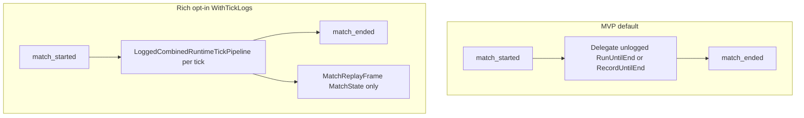

# Task 5.95 — Combined Runtime Logging Checkpoint

> **Nur Dokumentation.** Keine Implementierung, keine Tests, keine Änderungen an `src/`, `tests/`, Projekten, Solution oder `game/`.
>
> Sprache: Erklärungen überwiegend auf Deutsch; Typnamen und API-Namen wie im Code auf Englisch.

## 1. Purpose

Nach Tasks **5.80–5.94** ist der Combined-Runtime-Pfad für Simulation, Replay und Combat-Logging vollständig verdrahtet:

- **Ungeloggt:** Tick-Pipeline, Runner, Replay-Recorder
- **MVP logged (Default):** nur `match_started` + `match_ended`
- **Rich logged (Opt-in):** zusätzlich per-Tick `script_tick`, `fire_request_applied`, `fire_rejected`

Replay-Frames bleiben durchgehend **nur** [`MatchState`](../src/ScriptTanks.Core/Match/MatchState.cs) — Rich Events betreffen ausschließlich [`CombatLog`](../src/ScriptTanks.Core/Logging/CombatLog.cs).

Dieses Dokument ist die **kompakte Referenz** nach Abschluss von 5.94. Für Design-Historie siehe [COMBINED_RUNTIME_RUNNER_REPLAY_PLAN.md](COMBINED_RUNTIME_RUNNER_REPLAY_PLAN.md), [LOGGED_COMBINED_RUNTIME_RUNNER_REPLAY_PLAN.md](LOGGED_COMBINED_RUNTIME_RUNNER_REPLAY_PLAN.md) und [SCRIPT_TICK_COMBAT_EVENT_DESIGN_PLAN.md](SCRIPT_TICK_COMBAT_EVENT_DESIGN_PLAN.md).

**Test-Baseline (Repo):** 2662 Tests nach 5.94.

## 2. Task Timeline (5.80–5.94)

| Task | Deliverable | Key file(s) |
| ---- | ----------- | ----------- |
| **5.80** | Combined per-tick primitive | [`CombinedRuntimeTickPipeline.cs`](../src/ScriptTanks.Core/Scripting/CombinedRuntimeTickPipeline.cs) |
| **5.81** | Runner/Replay integration plan | [COMBINED_RUNTIME_RUNNER_REPLAY_PLAN.md](COMBINED_RUNTIME_RUNNER_REPLAY_PLAN.md) |
| **5.82** | Combined run result model | [`CombinedRuntimeRunResult.cs`](../src/ScriptTanks.Core/Scripting/CombinedRuntimeRunResult.cs) |
| **5.83** | Combined runner | [`CombinedRuntimeRunner.cs`](../src/ScriptTanks.Core/Scripting/CombinedRuntimeRunner.cs) |
| **5.84** | Combined replay recorder | [`CombinedRuntimeReplayRecorder.cs`](../src/ScriptTanks.Core/Replay/CombinedRuntimeReplayRecorder.cs) |
| **5.85** | Logged combined plan | [LOGGED_COMBINED_RUNTIME_RUNNER_REPLAY_PLAN.md](LOGGED_COMBINED_RUNTIME_RUNNER_REPLAY_PLAN.md) |
| **5.86** | Logged run result carrier | [`LoggedCombinedRuntimeRunResult.cs`](../src/ScriptTanks.Core/Scripting/LoggedCombinedRuntimeRunResult.cs) |
| **5.87** | MVP logged runner | [`LoggedCombinedRuntimeRunner.RecordUntilEnd`](../src/ScriptTanks.Core/Scripting/LoggedCombinedRuntimeRunner.cs) |
| **5.88** | MVP logged replay recorder | [`LoggedCombinedRuntimeReplayRecorder.RecordUntilEnd`](../src/ScriptTanks.Core/Replay/LoggedCombinedRuntimeReplayRecorder.cs), [`LoggedCombinedRuntimeRecordedRunResult.cs`](../src/ScriptTanks.Core/Replay/LoggedCombinedRuntimeRecordedRunResult.cs) |
| **5.89** | Script/tick combat event design | [SCRIPT_TICK_COMBAT_EVENT_DESIGN_PLAN.md](SCRIPT_TICK_COMBAT_EVENT_DESIGN_PLAN.md) |
| **5.90** | Tick log factory + event constants | [`CombinedRuntimeTickCombatLogFactory.cs`](../src/ScriptTanks.Core/Logging/CombinedRuntimeTickCombatLogFactory.cs), [`CombatLogEventTypes.cs`](../src/ScriptTanks.Core/Logging/CombatLogEventTypes.cs) |
| **5.91** | Logged tick result | [`LoggedCombinedRuntimeTickResult.cs`](../src/ScriptTanks.Core/Scripting/LoggedCombinedRuntimeTickResult.cs) |
| **5.92** | Logged tick pipeline | [`LoggedCombinedRuntimeTickPipeline.cs`](../src/ScriptTanks.Core/Scripting/LoggedCombinedRuntimeTickPipeline.cs) |
| **5.93** | Rich logged runner | [`LoggedCombinedRuntimeRunner.RunUntilEndWithTickLogs`](../src/ScriptTanks.Core/Scripting/LoggedCombinedRuntimeRunner.cs) |
| **5.94** | Rich logged replay recorder | [`LoggedCombinedRuntimeReplayRecorder.RecordUntilEndWithTickLogs`](../src/ScriptTanks.Core/Replay/LoggedCombinedRuntimeReplayRecorder.cs) |
| **5.95** | Dieser Checkpoint | [COMBINED_RUNTIME_LOGGING_CHECKPOINT.md](COMBINED_RUNTIME_LOGGING_CHECKPOINT.md) |

## 3. API Inventory

### Ungeloggt (Simulation / Replay)

| API | Returns | Notes |
| --- | ------- | ----- |
| [`CombinedRuntimeTickPipeline.Step`](../src/ScriptTanks.Core/Scripting/CombinedRuntimeTickPipeline.cs) | [`CombinedRuntimeTickResult`](../src/ScriptTanks.Core/Scripting/CombinedRuntimeTickResult.cs) | Einzige erlaubte Per-Tick-Primitive für Runner/Recorder |
| [`CombinedRuntimeRunner.RunUntilEnd`](../src/ScriptTanks.Core/Scripting/CombinedRuntimeRunner.cs) | [`CombinedRuntimeRunResult`](../src/ScriptTanks.Core/Scripting/CombinedRuntimeRunResult.cs) | Enthält `FinalProjectileIdSequence`, optional `LastTickResult` |
| [`CombinedRuntimeReplayRecorder.RecordUntilEnd`](../src/ScriptTanks.Core/Replay/CombinedRuntimeReplayRecorder.cs) | [`MatchRecordedRunResult`](../src/ScriptTanks.Core/Replay/MatchRecordedRunResult.cs) | `MatchRunResult` + [`MatchReplayRecording`](../src/ScriptTanks.Core/Replay/MatchReplayRecording.cs); **keine** Sequence auf dem Result-Typ |

### Logged — MVP (Default)

| API | Returns | Combat log |
| --- | ------- | ---------- |
| [`LoggedCombinedRuntimeRunner.RunUntilEnd`](../src/ScriptTanks.Core/Scripting/LoggedCombinedRuntimeRunner.cs) | [`LoggedCombinedRuntimeRunResult`](../src/ScriptTanks.Core/Scripting/LoggedCombinedRuntimeRunResult.cs) | Delegiert an ungeloggten Runner; **2** Einträge |
| [`LoggedCombinedRuntimeReplayRecorder.RecordUntilEnd`](../src/ScriptTanks.Core/Replay/LoggedCombinedRuntimeReplayRecorder.cs) | [`LoggedCombinedRuntimeRecordedRunResult`](../src/ScriptTanks.Core/Replay/LoggedCombinedRuntimeRecordedRunResult.cs) | Delegiert an ungeloggten Recorder; **2** Einträge |

### Logged — Rich (Opt-in)

| API | Returns | Combat log |
| --- | ------- | ---------- |
| [`LoggedCombinedRuntimeRunner.RunUntilEndWithTickLogs`](../src/ScriptTanks.Core/Scripting/LoggedCombinedRuntimeRunner.cs) | `LoggedCombinedRuntimeRunResult` | Inline-Loop wie [`CombinedRuntimeRunner`](../src/ScriptTanks.Core/Scripting/CombinedRuntimeRunner.cs); pro Tick [`LoggedCombinedRuntimeTickPipeline.Step`](../src/ScriptTanks.Core/Scripting/LoggedCombinedRuntimeTickPipeline.cs); Merge start + tick logs + end |
| [`LoggedCombinedRuntimeReplayRecorder.RecordUntilEndWithTickLogs`](../src/ScriptTanks.Core/Replay/LoggedCombinedRuntimeReplayRecorder.cs) | `LoggedCombinedRuntimeRecordedRunResult` | Inline-Loop wie [`CombinedRuntimeReplayRecorder`](../src/ScriptTanks.Core/Replay/CombinedRuntimeReplayRecorder.cs); gleiche Frame-Policy; `ProjectileIdSequence` nur **im Loop** weitergetragen |

### Per-Tick Logging Building Blocks

| Component | Role |
| --------- | ---- |
| [`CombinedRuntimeTickCombatLogFactory.CreateTickLog`](../src/ScriptTanks.Core/Logging/CombinedRuntimeTickCombatLogFactory.cs) | MVP-Subset aus [`CombinedRuntimeTickResult`](../src/ScriptTanks.Core/Scripting/CombinedRuntimeTickResult.cs) |
| [`LoggedCombinedRuntimeTickPipeline.Step`](../src/ScriptTanks.Core/Scripting/LoggedCombinedRuntimeTickPipeline.cs) | Wrap: ungeloggter Tick + Factory |
| [`LoggedCombinedRuntimeTickResult`](../src/ScriptTanks.Core/Scripting/LoggedCombinedRuntimeTickResult.cs) | `TickResult` + `Log` (reiner Daten-Träger) |
| [`CombatLogMerger.Merge`](../src/ScriptTanks.Core/Logging/CombatLogMerger.cs) | Globale Reihenfolge über mehrere [`CombatLog`](../src/ScriptTanks.Core/Logging/CombatLog.cs)-Snapshots |
| [`MatchCombatLogFactory`](../src/ScriptTanks.Core/Logging/MatchCombatLogFactory.cs) | `match_started` / `match_ended` |

### Test References

| Area | Tests |
| ---- | ----- |
| Runner MVP + rich | [`LoggedCombinedRuntimeRunnerTests.cs`](../tests/ScriptTanks.Core.Tests/Scripting/LoggedCombinedRuntimeRunnerTests.cs) |
| Replay MVP + rich | [`LoggedCombinedRuntimeReplayRecorderTests.cs`](../tests/ScriptTanks.Core.Tests/Replay/LoggedCombinedRuntimeReplayRecorderTests.cs) |
| Logged tick | [`LoggedCombinedRuntimeTickPipelineTests.cs`](../tests/ScriptTanks.Core.Tests/Scripting/LoggedCombinedRuntimeTickPipelineTests.cs) |
| Tick log factory | [`CombinedRuntimeTickCombatLogFactoryTests.cs`](../tests/ScriptTanks.Core.Tests/Logging/CombinedRuntimeTickCombatLogFactoryTests.cs) |

## 4. Behavior Matrix (MVP vs Rich)

| Aspect | MVP (`RunUntilEnd` / `RecordUntilEnd`) | Rich (`*WithTickLogs`) |
| ------ | -------------------------------------- | ---------------------- |
| Simulation | Delegiert an ungeloggten Runner/Recorder | Inline-Loop identisch zum ungeloggten Pfad; **kein** Delegate im Rich-Replay-Pfad |
| Combat log | `match_started`, `match_ended` | + `script_tick`, `fire_request_applied`, `fire_rejected` pro ausgeführtem Tick |
| Scan-only, `maxTicks: 2` | 2 Log-Einträge | 4 Einträge: start, 2× script_tick, end |
| Fire `[Scan, Fire]`, `maxTicks: 1` | 2 Log-Einträge (MVP) | 4 Einträge: start, script_tick, fire_request_applied, end |
| Replay frames | MatchState-only | **Gleiche** Frame-Policy wie ungeloggter Recorder |
| `ProjectileIdSequence` | Vom ungeloggten Pfad geführt | Rich-Replay: `sequence = loggedTick.TickResult.FinalProjectileIdSequence` **pro Tick** (nicht auf `MatchRecordedRunResult` gespeichert) |
| `programs`-Validation | Delegiert; bei `maxTicks == 0` oft kein Step | Gleich: erst beim ersten `LoggedCombinedRuntimeTickPipeline.Step` |



## 5. Replay Frame Policy (Locked)

Entspricht [`CombinedRuntimeReplayRecorder`](../src/ScriptTanks.Core/Replay/CombinedRuntimeReplayRecorder.cs) und [COMBINED_RUNTIME_RUNNER_REPLAY_PLAN.md](COMBINED_RUNTIME_RUNNER_REPLAY_PLAN.md) §8:

| Frame | Content |
| ----- | ------- |
| Frame 0 | Initial [`MatchState`](../src/ScriptTanks.Core/Match/MatchState.cs) **vor** dem ersten Combined-Tick |
| Frame k (k ≥ 1) | [`MatchState`](../src/ScriptTanks.Core/Match/MatchState.cs) **nach** k Combined-Ticks (`FrameIndex == ticksExecuted`) |

- `maxTicks: 0` → **1** Frame, `TicksExecuted == 0`, kein `script_tick` im Rich-Log
- `maxTicks: 2`, Scan-only → **3** Frames, **4** Rich-Log-Einträge

**Verboten in Frames:** neue Replay-Typen, [`CombinedRuntimeTickResult`](../src/ScriptTanks.Core/Scripting/CombinedRuntimeTickResult.cs), Sensor-Loadouts, Script-Diagnostics, Schema-Erweiterungen. Nur [`MatchReplayFrame`](../src/ScriptTanks.Core/Replay/MatchReplayFrame.cs) + `MatchState`.

Rich Logging ändert **nur** das Combat-Log, nicht die Aufzeichnung.

## 6. Rich Log Ordering and MVP Scope

### Globale Reihenfolge (nach Merge)

```text
match_started
alle Per-Tick-Logs in Ausführungsreihenfolge
match_ended
```

Implementierung: `List<CombatLog> { startLog }; AddRange(tickLogs); Add(endLog);` → [`CombatLogMerger.Merge`](../src/ScriptTanks.Core/Logging/CombatLogMerger.cs).

### Pro Tick ([`CombinedRuntimeTickCombatLogFactory`](../src/ScriptTanks.Core/Logging/CombinedRuntimeTickCombatLogFactory.cs))

1. `script_tick` am **Pre-Step-Tick** (`InitialRuntime.State.CurrentTick`)
2. Fire-Events in **Record-Index-Reihenfolge** (`0 .. Count-1`): `fire_rejected` vor `fire_request_applied`, wenn Tank 0 bereits gefeuert hat und Tank 1 im selben Tick feuert

Details und Payload-Formate: [SCRIPT_TICK_COMBAT_EVENT_DESIGN_PLAN.md](SCRIPT_TICK_COMBAT_EVENT_DESIGN_PLAN.md) §5–7.

### Heute nicht im CombatLog

- Intent evaluation, domain mapping, sensor apply, construction-only
- Projectile lifecycle (`projectile_spawned`, `projectile_hit`, …) aus [`MatchTickPipeline`](../src/ScriptTanks.Core/Match/MatchTickPipeline.cs) — orthogonaler Scope
- Rohe Script-Quellen, volle Evaluation-Records, Bulk-JSON

## 7. Known Limitations and Risks

### Geometry / Self-Hit (kein Logging-Defekt)

Aus [COMBINED_RUNTIME_RUNNER_REPLAY_PLAN.md](COMBINED_RUNTIME_RUNNER_REPLAY_PLAN.md) §2 / §12:

- Script-Phase kann am **Mündungsort** spawnen; dieselbe Tick-Phase kann das Projektil per Hit-Detection sofort entfernen (Overlap).
- Betrifft Simulation/Combat-Geometrie, **nicht** die Logging-Pipeline.
- Follow-up: Spawn-Offset, Owner-/Self-Hit-Filter, Fixtures für überlebende Post-Tick-Projektile.

### Verbose Event Creep

[`CombinedRuntimeTickResult`](../src/ScriptTanks.Core/Scripting/CombinedRuntimeTickResult.cs) enthält bereits vollständige Script-/Fire-/Sensor-Diagnostics. Weitere [`CombatLogEventTypes`](../src/ScriptTanks.Core/Logging/CombatLogEventTypes.cs) ohne stabile Payload-Policy riskieren:

- Schema-Churn für Consumer
- schwer reproduzierbare Message-Strings
- Verwechslung mit Replay-Inhalten

Neue Events nur über explizite Design-Tasks (siehe [SCRIPT_TICK_COMBAT_EVENT_DESIGN_PLAN.md](SCRIPT_TICK_COMBAT_EVENT_DESIGN_PLAN.md) „deferred“).

### Stale Design Docs

[SCRIPT_TICK_COMBAT_EVENT_DESIGN_PLAN.md](SCRIPT_TICK_COMBAT_EVENT_DESIGN_PLAN.md) §2 „Current State“ beschreibt den Stand **vor** 5.90–5.94 (z. B. „LoggedCombinedRuntimeTickPipeline existiert nicht“). **Implementierungsstatus** ab 5.94: dieses Checkpoint-Dokument. Optional später: §2 in 5.89 aktualisieren (nicht Teil von 5.95).

## 8. Recommended Next Tasks (After 5.94)

| Priority | Task | Rationale |
| -------- | ---- | --------- |
| **High** | Geometry / spawn offset / owner-self-hit filter | Zuverlässige Multi-Tick-Fire-Simulation und Gameplay |
| **Medium** | Verbose combat events (intent, sensor, construction) | Nur mit stabilen Payloads; siehe 5.89 deferred list |
| **Medium** | Godot / UI: `CombatLog` + replay frames konsumieren | Bisher bewusst außerhalb Core |
| **Low** | Replay serialization / playback API | Frames bleiben MVP-`MatchState`-Liste |
| **Low** | Doc refresh 5.89 §2 | Reduziert Verwechslung mit diesem Checkpoint |

## 9. Out of Scope (Task 5.95)

- Code, Tests, neue APIs, neue Event-Typen, Replay-Schema
- Änderungen an [`CombinedRuntimeTickPipeline`](../src/ScriptTanks.Core/Scripting/CombinedRuntimeTickPipeline.cs), ungeloggten Runner/Recorder
- Godot, Netzwerk, globale Log-Sinks

## 10. Definition of Done (Task 5.95)

- [COMBINED_RUNTIME_LOGGING_CHECKPOINT.md](COMBINED_RUNTIME_LOGGING_CHECKPOINT.md) existiert mit Abschnitten 1–10
- Links: `../src/...`, `../tests/...`; Peer-`*.md` ohne `../`
- `dotnet build ScriptTanks.sln -warnaserror` und `dotnet test ScriptTanks.sln` unverändert grün (nur Markdown)
