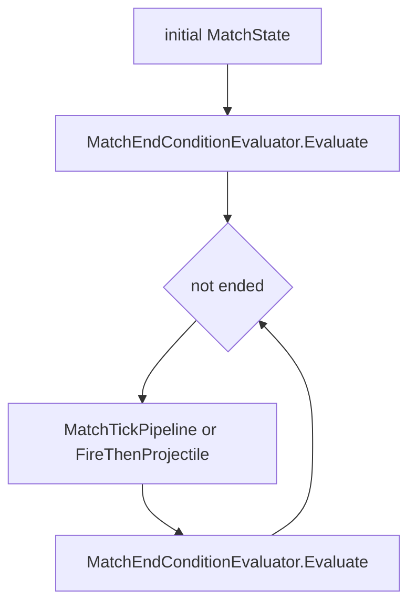
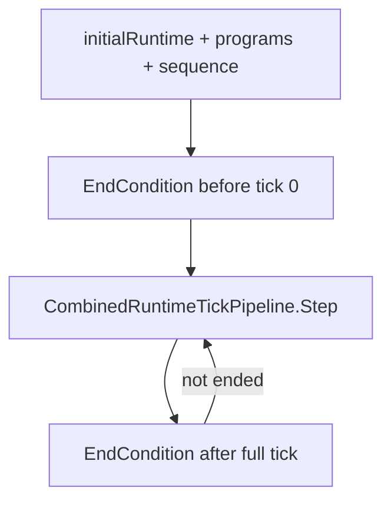

# Task 5.81 — Combined Runtime Runner / Replay Integration Plan

> **Nur Dokumentation.** Keine Implementierung, keine Tests, keine Änderungen an `src/`, `tests/`, Projekten, Solution oder `game/`.
>
> Sprache: Erklärungen überwiegend auf Deutsch; Typnamen und API-Skizzen wie im Code auf Englisch.

## 1. Purpose

Dieses Dokument definiert, wie der nach Task **5.80** implementierte [`CombinedRuntimeTickPipeline`](../src/ScriptTanks.Core/Scripting/CombinedRuntimeTickPipeline.cs) später in **Match-Loop**, **Replay-Aufzeichnung** und **Logging** eingebunden werden soll — ohne in Task 5.81 bereits Runner-Code, Replay-Schema oder CombatLog-Events zu ändern.

### Warum ein Runner-/Replay-Plan nach 5.80 nötig ist

Nach 5.80 existiert die reine **Per-Tick-Primitive**:

```text
runtime₀ + programs + ProjectileIdSequence
→ CombinedRuntimeTickPipeline.Step
→ CombinedRuntimeTickResult
```

Diese Primitive ist **noch nicht** in den äußeren Schleifen des Spiels:

- [`MatchRunner`](../src/ScriptTanks.Core/Match/MatchRunner.cs) — Schleife über `MatchTickPipeline` bzw. geplantes Fire, **ohne** `ScriptProgram`
- [`MatchReplayRecorder`](../src/ScriptTanks.Core/Replay/MatchReplayRecorder.cs) / [`LoggedMatchReplayRecorder`](../src/ScriptTanks.Core/Replay/LoggedMatchReplayRecorder.cs) — spiegeln dieselben Loops, **ohne** Combined-Tick-Pipeline
- [`LoggedMatchRunner`](../src/ScriptTanks.Core/Match/LoggedMatchRunner.cs) — `match_started` / `match_ended`, **ohne** Script-Tick-Integration

Ohne diesen Plan würden Implementierungen von 5.82+ die Tick-Semantik aus [`COMBINED_SCRIPT_RUNTIME_TICK_PLAN.md`](COMBINED_SCRIPT_RUNTIME_TICK_PLAN.md) (Option A) duplizieren oder von [`MatchRunner`](../src/ScriptTanks.Core/Match/MatchRunner.cs) abweichen.

**Autoritative Ergänzung:** Tick-Plan §10 verweist auf 5.81; **dieses Dokument** ist die Referenz für Runner-, Replay- und Logging-Grenzen.

## 2. Current State After 5.80

| Bereich | Status im Repo |
| ------- | -------------- |
| **Combined tick pipeline** | [`CombinedRuntimeTickPipeline.Step`](../src/ScriptTanks.Core/Scripting/CombinedRuntimeTickPipeline.cs) — Scripts vor [`MatchTickPipeline.Step`](../src/ScriptTanks.Core/Match/MatchTickPipeline.cs), Merge via `WithState` |
| **Tick result** | [`CombinedRuntimeTickResult`](../src/ScriptTanks.Core/Scripting/CombinedRuntimeTickResult.cs) — `InitialRuntime`, `ScriptResult`, `SteppedState`, `FinalRuntime`, `FinalProjectileIdSequence` |
| **Script composer** | [`CombinedScriptRuntimeComposer.Run`](../src/ScriptTanks.Core/Scripting/CombinedScriptRuntimeComposer.cs) — intern in `Step`, nicht vom Runner aufgerufen |
| **End condition** | [`MatchEndConditionEvaluator`](../src/ScriptTanks.Core/Match/MatchEndConditionEvaluator.cs) — **außerhalb** der Tick-Pipeline |
| **Match loop (heute)** | [`MatchRunner`](../src/ScriptTanks.Core/Match/MatchRunner.cs) — `MatchTickPipeline` oder [`MatchTickFireThenProjectilePipeline`](../src/ScriptTanks.Core/Match/MatchTickFireThenProjectilePipeline.cs) |
| **Replay (heute)** | [`MatchReplayRecorder`](../src/ScriptTanks.Core/Replay/MatchReplayRecorder.cs) — volle [`MatchReplayFrame`](../src/ScriptTanks.Core/Replay/MatchReplayFrame.cs) mit `MatchState` |
| **Logging (heute)** | [`LoggedMatchRunner`](../src/ScriptTanks.Core/Match/LoggedMatchRunner.cs), [`MatchCombatLogFactory`](../src/ScriptTanks.Core/Logging/MatchCombatLogFactory.cs) — ohne Combined-Tick |

```text
Heute möglich (5.80):
  CombinedRuntimeTickPipeline.Step(runtime, programs, sequence)  // isoliert, Tests

Noch nicht möglich:
  MatchRun mit programs + sequence über N Ticks
  Replay-Aufzeichnung der Combined-Tick-Schleife
  Logged Combined Runner / Replay
  Godot-Anbindung
```

**Nicht Teil dieses Plans:** Projektil-Spawn-Overlap / Self-Hit (5.80-Tests: Script-Phase spawnt am Mündungsort, Tick-Phase kann Projektil per Hit-Detection entfernen). Das ist **Geometry/Combat-Follow-up** (§12), kein Blocker für Runner/Replay-Design.

## 3. Existing Runner / Replay / Logging Inventory

| Component | Path | Role today |
| --------- | ---- | ---------- |
| Match runner | [`MatchRunner.cs`](../src/ScriptTanks.Core/Match/MatchRunner.cs) | End check → tick step → end check; optional scheduled fire |
| Run result | [`MatchRunResult.cs`](../src/ScriptTanks.Core/Match/MatchRunResult.cs) | `FinalState`, `EndCondition`, `TicksExecuted` |
| End condition | [`MatchEndConditionEvaluator.cs`](../src/ScriptTanks.Core/Match/MatchEndConditionEvaluator.cs) | Read-only query on `MatchState` + `maxTicks` |
| Tick (no script) | [`MatchTickPipeline.cs`](../src/ScriptTanks.Core/Match/MatchTickPipeline.cs) | Projectile pipeline → tick advance |
| Fire + tick (explicit) | [`MatchTickFireThenProjectilePipeline.cs`](../src/ScriptTanks.Core/Match/MatchTickFireThenProjectilePipeline.cs) | Optional `MatchFireRequest`, dann `MatchTickPipeline` |
| Combined tick | [`CombinedRuntimeTickPipeline.cs`](../src/ScriptTanks.Core/Scripting/CombinedRuntimeTickPipeline.cs) | Composer → tick → `WithState` |
| Combined tick result | [`CombinedRuntimeTickResult.cs`](../src/ScriptTanks.Core/Scripting/CombinedRuntimeTickResult.cs) | Bundelt Script- und Tick-Zwischenergebnisse |
| Script composer | [`CombinedScriptRuntimeComposer.cs`](../src/ScriptTanks.Core/Scripting/CombinedScriptRuntimeComposer.cs) | Nur innerhalb von `CombinedRuntimeTickPipeline` |
| Match replay recorder | [`MatchReplayRecorder.cs`](../src/ScriptTanks.Core/Replay/MatchReplayRecorder.cs) | Loop wie Runner, `MatchReplayFrame` pro Schritt |
| Replay frame | [`MatchReplayFrame.cs`](../src/ScriptTanks.Core/Replay/MatchReplayFrame.cs) | `FrameIndex` + `MatchState` (voller Snapshot) |
| Replay bundle | [`MatchReplayRecording.cs`](../src/ScriptTanks.Core/Replay/MatchReplayRecording.cs), [`MatchRecordedRunResult.cs`](../src/ScriptTanks.Core/Replay/MatchRecordedRunResult.cs) | Frames + `MatchRunResult` |
| Logged runner | [`LoggedMatchRunner.cs`](../src/ScriptTanks.Core/Match/LoggedMatchRunner.cs) | Wie Runner + [`CombatLog`](../src/ScriptTanks.Core/Logging/CombatLog.cs) |
| Logged run result | [`LoggedMatchRunResult.cs`](../src/ScriptTanks.Core/Match/LoggedMatchRunResult.cs) | `MatchRunResult` + merged log |
| Logged replay | [`LoggedMatchReplayRecorder.cs`](../src/ScriptTanks.Core/Replay/LoggedMatchReplayRecorder.cs) | Wie Recorder + start/end logs |
| Combat log | [`CombatLog.cs`](../src/ScriptTanks.Core/Logging/CombatLog.cs), [`CombatLogBuilder.cs`](../src/ScriptTanks.Core/Logging/CombatLogBuilder.cs), [`CombatLogMerger.cs`](../src/ScriptTanks.Core/Logging/CombatLogMerger.cs), [`CombatLogEntry.cs`](../src/ScriptTanks.Core/Logging/CombatLogEntry.cs), [`CombatLogEventTypes.cs`](../src/ScriptTanks.Core/Logging/CombatLogEventTypes.cs) | Immutable log carrier |
| Match log factory | [`MatchCombatLogFactory.cs`](../src/ScriptTanks.Core/Logging/MatchCombatLogFactory.cs) | `match_started`, `match_ended`, Fire-Hilfen |

**Separates Schema (nicht conflaten):** Sensor-Runtime-Replay [`MatchSensorRuntimeReplayRecorder.cs`](../src/ScriptTanks.Core/Sensors/MatchSensorRuntimeReplayRecorder.cs), [`MatchSensorRuntimeReplayFrame.cs`](../src/ScriptTanks.Core/Sensors/MatchSensorRuntimeReplayFrame.cs) — geplanter Scan + Tick auf `MatchSensorRuntimeState`, **ohne** Combined Script+Fire. Combined-Integration nutzt **`MatchReplayFrame` / `MatchState`**, nicht das Sensor-Replay-Format, bis eine explizite Schema-Erweiterung kommt.

### Heutige Loop-Form (MatchRunner / MatchReplayRecorder)



Replay: Frame 0 = initial `MatchState`; nach Tick *k* → `new MatchReplayFrame(k, currentState)` (gleiche `ticksExecuted`-Semantik wie Runner).

## 4. Proposed Script-Aware Runner Loop

Geplante **äußere** Schleife auf [`MatchSensorRuntimeState`](../src/ScriptTanks.Core/Sensors/MatchSensorRuntimeState.cs) (nicht nur `MatchState`):

```text
runtime = initialRuntime
projectileSequence = initialSequence
frames.Add(MatchReplayFrame(0, runtime.State))   // wenn Recorder aktiv
endCondition = MatchEndConditionEvaluator.Evaluate(runtime.State, maxTicks)

while !endCondition.IsEnded:
    tickResult = CombinedRuntimeTickPipeline.Step(runtime, programs, projectileSequence)
    runtime = tickResult.FinalRuntime
    projectileSequence = tickResult.FinalProjectileIdSequence
    ticksExecuted++
    frames.Add(MatchReplayFrame(ticksExecuted, runtime.State))   // optional
    endCondition = MatchEndConditionEvaluator.Evaluate(runtime.State, maxTicks)

return MatchRunResult(runtime.State, endCondition, ticksExecuted)
```



**Anti-Patterns (Runner):**

- `MatchTickPipeline.Step` oder `CombinedScriptRuntimeComposer.Run` **direkt** in der Schleife — nur `CombinedRuntimeTickPipeline.Step` pro Tick.
- End condition **innerhalb** von `CombinedRuntimeTickPipeline`.
- Globale / statische `ProjectileIdSequence`-Allokation.
- `programs` pro Tick neu laden oder Count-Regel lockern.

Konkrete Typnamen (z. B. `CombinedRuntimeRunner`) sind **Follow-up 5.83**, nicht Verpflichtung von 5.81.

## 5. End Condition Boundary

Gleiche Policy wie [`MatchRunner`](../src/ScriptTanks.Core/Match/MatchRunner.cs):

| Zeitpunkt | Aktion |
| --------- | ------ |
| Vor dem ersten Tick | `MatchEndConditionEvaluator.Evaluate(runtime.State, maxTicks)` — bei `maxTicks == 0` oder bereits entschiedenem State sofort return, `TicksExecuted == 0` |
| Nach jedem vollen `CombinedRuntimeTickPipeline.Step` | erneut `Evaluate` auf **`tickResult.FinalRuntime.State`** |

**Wichtig:** End condition arbeitet auf `MatchState`, nicht auf `ScriptResult.FinalRuntime.State`. Nach Script+Tick können Projektil-Liste und `CurrentTick` von der reinen Script-Phase abweichen (Hit/Cleanup in `MatchTickPipeline`).

`CombinedRuntimeTickPipeline` ruft `MatchEndConditionEvaluator` **nicht** auf.

## 6. ProjectileIdSequence Threading

Explizite Regel — **kein versteckter globaler Allocator:**

```text
sequenceIn für Tick N
  → CombinedRuntimeTickPipeline.Step(runtime, programs, sequenceIn)
  → sequenceOut = tickResult.FinalProjectileIdSequence
  → sequenceIn für Tick N+1 := sequenceOut
```

| Regel | Detail |
| ----- | ------ |
| Wer advance’t? | Nur Script-Fire-Construction/Application in [`CombinedScriptRuntimeComposer`](../src/ScriptTanks.Core/Scripting/CombinedScriptRuntimeComposer.cs) |
| Tick-Schritt | [`MatchTickPipeline`](../src/ScriptTanks.Core/Match/MatchTickPipeline.cs) ändert die Sequence **nicht** |
| Runner-Pflicht | `projectileSequence` als Schleifenvariable führen; nicht aus globalem Zähler ableiten |

## 7. Program Source Policy (locked MVP)

| Rule | MVP |
| ---- | --- |
| Program input | [`IReadOnlyList<ScriptProgram>`](../src/ScriptTanks.Core/Scripting/ScriptProgram.cs) `programs` ist **für den gesamten Run fix** (dieselbe Liste / Inhalte bei jedem `Step`) |
| Count invariant | `programs.Count == runtime.State.Tanks.Count` — durch Composer / [`MatchScriptIntentIntegrationComposer.EvaluateIntents`](../src/ScriptTanks.Core/Scripting/MatchScriptIntentIntegrationComposer.cs); Runner darf das **nicht** abschwächen |
| Pro Tick | **Kein** Program-Provider, kein Hot Reload, kein Austausch von Spieler-Skripten mid-run |

**Deutlich später (nur §12 / Out of Scope):**

- Per-tick script providers
- Dynamische Programm-Updates
- Player-submitted scripts
- Netzwerk-delivered scripts

## 8. Replay Frame Policy (locked conservative MVP)

**MVP-Entscheidung (nicht abschwächen):**

| Aspekt | Policy |
| ------ | ------ |
| Frame-Inhalt | Weiterhin nur [`MatchState`](../src/ScriptTanks.Core/Match/MatchState.cs) in [`MatchReplayFrame`](../src/ScriptTanks.Core/Replay/MatchReplayFrame.cs) |
| Zeitpunkt | Snapshot **nach** vollem `CombinedRuntimeTickPipeline.Step` → `tickResult.FinalRuntime.State` (post-script, post-tick, post-`WithState`) |
| Frame 0 | Initialzustand vor dem ersten Tick: `initialRuntime.State` |
| Frame *k* (*k* ≥ 1) | Zustand nach *k* ausgeführten Combined-Ticks (`ticksExecuted == k`) |

**Begründung:** Bestehendes Replay-Format, Playback und Tests bleiben kompatibel; Consumer erwarten `MatchState`-only Frames.

**Explizit zurückgestellt (Schema-Erweiterung später):**

- `SensorLoadouts` in Frames
- `CombinedRuntimeTickResult` / `ScriptResult`, Construction-/Application-Records
- Script-Diagnostics / Trace
- Optionales `CombinedRuntimeReplayFrame` oder Sidecar-Trace-Datei

Bis dahin: Sensor- und Script-Daten **nicht** still in `MatchReplayFrame` mischen.

## 9. Script Diagnostics / Trace Policy

[`CombinedRuntimeTickResult`](../src/ScriptTanks.Core/Scripting/CombinedRuntimeTickResult.cs) enthält reichhaltige Zwischendaten (`ScriptResult`, `SteppedState`, Fire-/Sensor-Pipelines).

| Bereich | MVP |
| ------- | --- |
| Replay | Persistiert **nicht** automatisch alle Script-Zwischenergebnisse |
| Runner result (5.82+) | Kann Tick-Result optional exponieren; Replay bleibt trotzdem `MatchState`-only bis Schema-Task |

**Optional später:** Script-Trace-Log, Construction-/Application-Records pro Tick, dedizierte Diagnostics-API — eigene Tasks, nicht 5.81.

## 10. Logged Runner / CombatLog Policy

**5.81 erfindet keine neuen Log-Events.**

| Bereich | MVP |
| ------- | --- |
| Logged combined runner (5.85+) | Gleiche **Semantik** wie [`LoggedMatchRunner`](../src/ScriptTanks.Core/Match/LoggedMatchRunner.cs): [`MatchCombatLogFactory.CreateMatchStartedLog`](../src/ScriptTanks.Core/Logging/MatchCombatLogFactory.cs) am Start-Tick, `CreateMatchEndedLog` am End-Tick, Merge via [`CombatLogMerger`](../src/ScriptTanks.Core/Logging/CombatLogMerger.cs) |
| Per-tick detail | **Nicht** in 5.81 — bestehende Fire-Logs in scheduled-fire-Pfaden bleiben dort |

**Später (nur als Beispiele, eigene Tasks):**

- `script_tick`, `fire_applied`, sensor apply
- Wahrscheinlich zukünftiges `LoggedCombinedRuntimeTickPipeline` — analog zu [`LoggedMatchTickFireThenProjectilePipeline`](../src/ScriptTanks.Core/Match/LoggedMatchTickFireThenProjectilePipeline.cs)

[`LoggedMatchReplayRecorder`](../src/ScriptTanks.Core/Replay/LoggedMatchReplayRecorder.cs): gleiche Frame-Policy wie [`MatchReplayRecorder`](../src/ScriptTanks.Core/Replay/MatchReplayRecorder.cs); Logs wie heute mergen.

## 11. Determinism Requirements

| Requirement | Mechanism |
| ----------- | --------- |
| Eingaben | `initialRuntime`, `programs`, `initial ProjectileIdSequence`, `maxTicks` |
| Keine Entropie | Kein `Random`, keine GUIDs, keine Systemuhr, keine statische Sequence |
| Wiederholbarkeit | Gleiche Eingaben → gleiche `FinalRuntime`-Kette, gleiche Replay-Frames (`MatchState`), gleiche End condition, gleicher `FinalProjectileIdSequence`-Verlauf |
| Ein Tick | Genau ein `CombinedRuntimeTickPipeline.Step` pro ausgeführten Tick |

Test-Präzedenz: [`CombinedRuntimeTickPipelineTests`](../tests/ScriptTanks.Core.Tests/Scripting/CombinedRuntimeTickPipelineTests.cs), [`MatchRunner`](../src/ScriptTanks.Core/Match/MatchRunner.cs)-Tests, [`MatchReplayRecorder`](../src/ScriptTanks.Core/Replay/MatchReplayRecorder.cs)-Tests.

## 12. Recommended Follow-Up Tasks

| Task | Content |
| ---- | ------- |
| **5.82** | Combined runtime runner result / adapter models (`MatchSensorRuntimeState` rein, `MatchRunResult`-kompatible Ausgabe, optional Halt von letztem `CombinedRuntimeTickResult`) |
| **5.83** | Erste Implementierung `CombinedRuntimeRunner` (oder gleichwertiger static runner) — Schleife aus §4 |
| **5.84** | `CombinedRuntimeReplayRecorder` — Plan oder Implementierung; Frame-Policy §8 |
| **5.85** | Logged combined runner / logged replay — §10 |
| **Geometry / combat** *(kein Runner-Blocker)* | Spawn-Offset / Mündung vs. Hitbox-Overlap, Owner-/Self-Hit-Filter, Test-Fixtures für überlebende Post-Tick-Projektile — **außerhalb** Runner/Replay/Logging; Bezug 5.80: Script-Phase spawnt am Mündungsort, Tick-Phase kann via Overlap + Hit-Detection leeren |

## 13. Out of Scope (Task 5.81)

- Keine Implementierung in `src/` oder `tests/`
- Keine Änderung an [`MatchRunner`](../src/ScriptTanks.Core/Match/MatchRunner.cs), Replay-Schema, [`CombatLog`](../src/ScriptTanks.Core/Logging/CombatLog.cs)-Event-Typen, Godot, Netzwerk
- Kein Scheduler / CPU-Budget, keine Movement-/Turret-Script-Commands in der Runner-Schleife
- Keine Bearbeitung anderer Plan-Dateien außer dieser neuen Datei
- Per-tick Program-Provider, Hot Reload, Player-scripts (nur als spätere Tasks erwähnt)

## 14. Definition of Done (Task 5.81)

- [`docs/COMBINED_RUNTIME_RUNNER_REPLAY_PLAN.md`](COMBINED_RUNTIME_RUNNER_REPLAY_PLAN.md) existiert mit Abschnitten Purpose, Ist-Zustand 5.80, Inventar, Script-Runner-Loop, End-Condition-Grenze, Sequence-Threading, Program-Policy, Replay-Policy, Diagnostics, Logging, Determinismus, Follow-ups, Out of Scope, DoD.
- Runner-Loop, End-Condition-Grenze, Sequence-Threading, Program-Source (statisch, Count == Tanks), Replay-Policy (`MatchState` nach vollem Tick), Logging-Grenzen dokumentiert.
- Replay-MVP und Program-Policy als **locked** festgehalten; Geometry/Self-Hit nur in Follow-ups.
- `dotnet build ScriptTanks.sln -warnaserror` und `dotnet test ScriptTanks.sln` unverändert grün (nur Markdown).
