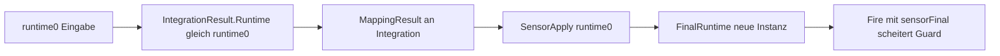
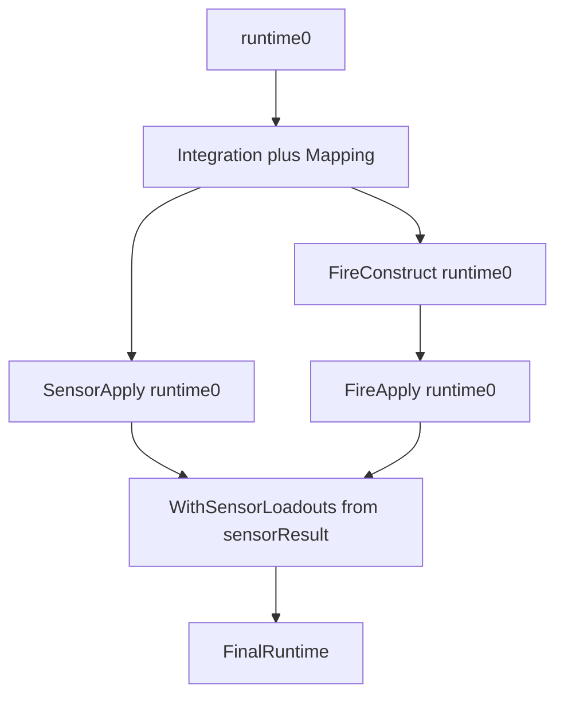

# Task 5.75 — Combined Script Runtime Composer Plan

> **Nur Dokumentation.** Keine Implementierung, keine Tests, keine Änderungen an `src/`, `tests/`, Projekten, Solution oder `game/`.
>
> Sprache: Erklärungen überwiegend auf Deutsch; Typnamen und API-Skizzen wie im Code auf Englisch.

## 1. Purpose

Dieses Dokument definiert den **geplanten kombinierten Script-Runtime-Composer** nach Task **5.74**. Ziel: Sensor-Anwendung und Fire-Konstruktion/-Anwendung in **einem** deterministischen Tick-Durchlauf orchestrieren — ohne die bestehenden `ReferenceEquals`-Laufzeit-Guards der Teil-Pipelines zu verletzen.

### Zielkette (End-to-End)

```text
script programs
→ intent integration
→ domain mapping
→ sensor application
→ fire request construction
→ fire request application
→ final MatchSensorRuntimeState
```

### Ist-Zustand nach 5.74

| Pfad | Heute im Repo |
| ---- | ------------- |
| **Sensor** | [`MatchScriptSensorRuntimeComposer.Run`](../src/ScriptTanks.Core/Scripting/MatchScriptSensorRuntimeComposer.cs): integration → mapping → sensor apply → `FinalRuntime` |
| **Fire** | [`ScriptMappedFireRequestConstructionPipeline`](../src/ScriptTanks.Core/Scripting/ScriptMappedFireRequestConstructionPipeline.cs) + [`ScriptMappedFireRequestApplicationPipeline`](../src/ScriptTanks.Core/Scripting/ScriptMappedFireRequestApplicationPipeline.cs) — isoliert, nur in Tests verdrahtet |
| **Kombiniert** | **Kein** einzelner Composer, der beide Pfade in einer `Run`-Methode ausführt |

### Kernproblem: naive Verkettung scheitert an Referenz-Guards

Wenn Sensor-Anwendung ein neues `MatchSensorRuntimeState` (`sensorFinalRuntime`) zurückgibt und Fire-Konstruktion/-Anwendung **dieses** Snapshot mit dem **alten** `MatchScriptDomainRequestMappingResult` aufruft, schlagen die Guards fehl:

```text
ReferenceEquals(runtime, mappingResult.IntegrationResult.Runtime) == false
```

[`MatchScriptIntentIntegrationComposer`](../src/ScriptTanks.Core/Scripting/MatchScriptIntentIntegrationComposer.cs) speichert in `IntegrationResult.Runtime` **dieselbe Referenz** wie der Eingabe-`runtime` (`runtime₀`). `mappingResult` hängt an diesem Integration-Snapshot. Fire-Pipelines erwarten weiterhin `runtime₀` — nicht `sensorFinalRuntime`.

**Task 5.75** spezifiziert eine sichere Orchestrierung **vor** Implementierung (5.77). **Task 5.75 implementiert keinen Composer.**

## 2. Existing Component Inventory

| Bereich | Typ / API | Pfad | Rolle (Kurz) |
| ------- | --------- | ---- | -------------- |
| Integration | `MatchScriptIntentIntegrationComposer` | [`MatchScriptIntentIntegrationComposer.cs`](../src/ScriptTanks.Core/Scripting/MatchScriptIntentIntegrationComposer.cs) | `programs.Count == runtime.State.Tanks.Count`; liefert `MatchScriptIntentIntegrationResult(runtime, records)` — **`Runtime`-Referenz = Eingabe** |
| Sensor-only Composer | `MatchScriptSensorRuntimeComposer` | [`MatchScriptSensorRuntimeComposer.cs`](../src/ScriptTanks.Core/Scripting/MatchScriptSensorRuntimeComposer.cs) | integration → mapping → sensor apply |
| Sensor Composer Result | `MatchScriptSensorRuntimeComposerResult` | [`MatchScriptSensorRuntimeComposerResult.cs`](../src/ScriptTanks.Core/Scripting/MatchScriptSensorRuntimeComposerResult.cs) | Bündelt Integration, Mapping, Sensor-Application |
| Mapping | `ScriptTranslatedCommandDomainMapper`, `MatchScriptDomainRequestMappingResult` | [`ScriptTranslatedCommandDomainMapper.cs`](../src/ScriptTanks.Core/Scripting/ScriptTranslatedCommandDomainMapper.cs), [`MatchScriptDomainRequestMappingResult.cs`](../src/ScriptTanks.Core/Scripting/MatchScriptDomainRequestMappingResult.cs) | Pro-Tank Domain-Records (Sensor, Weapon, …) |
| Sensor Apply | `ScriptMappedSensorRequestApplicationPipeline`, `ScriptMappedSensorRequestApplicationResult` | [`ScriptMappedSensorRequestApplicationPipeline.cs`](../src/ScriptTanks.Core/Scripting/ScriptMappedSensorRequestApplicationPipeline.cs), [`ScriptMappedSensorRequestApplicationResult.cs`](../src/ScriptTanks.Core/Scripting/ScriptMappedSensorRequestApplicationResult.cs) | Sequentielles Apply; `FinalRuntime` |
| Fire Construct | `ScriptMappedFireRequestConstructionPipeline`, `ScriptMappedFireRequestConstructionPipelineResult` | [`ScriptMappedFireRequestConstructionPipeline.cs`](../src/ScriptTanks.Core/Scripting/ScriptMappedFireRequestConstructionPipeline.cs), [`ScriptMappedFireRequestConstructionPipelineResult.cs`](../src/ScriptTanks.Core/Scripting/ScriptMappedFireRequestConstructionPipelineResult.cs) | Read-only auf `MatchState`; `ProjectileIdSequence` nur bei `Constructed` |
| Fire Apply | `ScriptMappedFireRequestApplicationPipeline`, `ScriptMappedFireRequestApplicationResult` | [`ScriptMappedFireRequestApplicationPipeline.cs`](../src/ScriptTanks.Core/Scripting/ScriptMappedFireRequestApplicationPipeline.cs), [`ScriptMappedFireRequestApplicationResult.cs`](../src/ScriptTanks.Core/Scripting/ScriptMappedFireRequestApplicationResult.cs) | `MatchStateFireSystem`; `UpdatedState` immer threaden |
| IDs | `ProjectileIdSequence` | [`ProjectileIdSequence.cs`](../src/ScriptTanks.Core/Ids/ProjectileIdSequence.cs) | Explizite Composer-Eingabe |
| Runtime | `MatchSensorRuntimeState` | [`MatchSensorRuntimeState.cs`](../src/ScriptTanks.Core/Sensors/MatchSensorRuntimeState.cs) | `State` + `SensorLoadouts`; [`WithState`](../src/ScriptTanks.Core/Sensors/MatchSensorRuntimeState.cs), [`WithSensorLoadouts`](../src/ScriptTanks.Core/Sensors/MatchSensorRuntimeState.cs) |

## 3. Runtime Reference Rules

Drei Teil-Pipelines prüfen **dieselbe Laufzeit-Referenz** wie der Integration-Snapshot:

| Pipeline | Guard (vereinfacht) | ParamName bei Fehler |
| -------- | -------------------- | -------------------- |
| [`ScriptMappedSensorRequestApplicationPipeline.Apply`](../src/ScriptTanks.Core/Scripting/ScriptMappedSensorRequestApplicationPipeline.cs) | `runtime == mappingResult.IntegrationResult.Runtime` | `mappingResult` |
| [`ScriptMappedFireRequestConstructionPipeline.Construct`](../src/ScriptTanks.Core/Scripting/ScriptMappedFireRequestConstructionPipeline.cs) | `runtime == mappingResult.IntegrationResult.Runtime` | `mappingResult` |
| [`ScriptMappedFireRequestApplicationPipeline.Apply`](../src/ScriptTanks.Core/Scripting/ScriptMappedFireRequestApplicationPipeline.cs) | `runtime == constructionPipelineResult.ConstructionResult.MappingResult.IntegrationResult.Runtime` | `constructionPipelineResult` |

### Warum das bei Sensor → Fire verkettet wichtig ist

1. [`EvaluateIntents`](../src/ScriptTanks.Core/Scripting/MatchScriptIntentIntegrationComposer.cs) setzt `IntegrationResult.Runtime` auf die **Eingabe-Referenz** `runtime₀` (kein Clone).
2. Sensor-Apply threadet intern `current = outcome.UpdatedRuntime` — `FinalRuntime` ist oft eine **neue** `MatchSensorRuntimeState`-Instanz (aktualisierte `SensorLoadouts`, ggf. gleiches oder ersetztes `State`).
3. Fire-Construct/Apply mit `sensorResult.FinalRuntime` + **unverändertem** `mapping` (gebunden an `runtime₀`) → `ArgumentException`.

[`MatchScriptSensorRuntimeComposer`](../src/ScriptTanks.Core/Scripting/MatchScriptSensorRuntimeComposer.cs) übergibt bewusst den **initialen** `runtime` an Sensor-Apply (nicht ein ersetztes Integration-Runtime-Objekt) — gleiches Muster wie die geplante Fire-Eingabe.



## 4. Ordering Options

### Option A — One-Pass auf `runtime₀` mit Merge

```text
runtime₀ → integration / mapping (einmal)
→ sensor apply(runtime₀)           → sensorResult
→ fire construct/apply(runtime₀)   → fireResult
→ merge
```

| Aspekt | Bewertung |
| ------ | --------- |
| Referenz-Guards | Erfüllt, wenn Fire **immer** `runtime₀` nutzt |
| Script-Auswertungen | **Eine** pro Composer-Aufruf |
| Nachteil | Fire-Geometrie aus `runtime₀.State` (vor Sensor-Overlay im Match-Kern) |

#### Option A — Runtime-Split (im Doc verbindlich)

| Teil-Ergebnis | Eingabe-Runtime für die Pipeline | Was der Composer daraus übernimmt |
| ------------- | -------------------------------- | --------------------------------- |
| `sensorResult` | **`runtime₀`** (Guard) | **Nur `SensorLoadouts`** — `sensorResult.FinalRuntime.SensorLoadouts` für den Merge |
| `fireResult` | **`runtime₀`** (Guard) | **`MatchState`** — `fireResult.FinalRuntime.State` (Tanks, Loadouts, Projectiles) |

- **Fire-Konstruktion und Fire-Anwendung verwenden `runtime₀`, nicht `sensorResult.FinalRuntime`.**
- **`sensorResult` liefert nur die finalen `SensorLoadouts` für den Merge** — nicht als Fire-Pipeline-Eingabe.
- **`fireResult` liefert den finalen `MatchState`** (über `FinalRuntime.State`).
- **Merge:** `fireResult.FinalRuntime.WithSensorLoadouts(sensorResult.FinalRuntime.SensorLoadouts)`.

Merge-API: [`MatchSensorRuntimeState.WithSensorLoadouts`](../src/ScriptTanks.Core/Sensors/MatchSensorRuntimeState.cs).

### Option B — Sensor zuerst, Re-Integration für Fire

```text
runtime₀ → integration/mapping → sensor apply → runtime₁
→ integration/mapping erneut auf runtime₁ → fire construct/apply → runtime₂
```

| Aspekt | Bewertung |
| ------ | --------- |
| Referenz-Guards | Erfüllt (jede Fire-Phase mit passendem Mapping) |
| Script-Auswertungen | **Zwei** pro Composer-Aufruf |
| Nutzen | Fire kann post-Scan-Kontext nutzen |
| Nachteil | Mehr CPU; anderes Verhalten als One-Pass |

### Option C — Fire zuerst, dann Sensor

Fire auf `runtime₀`, Sensor mit altem Mapping auf verändertem State — **verworfen** (gleiche Referenz-Probleme, falsche Reihenfolge für Scan-Overlay).

### Option D — Guards lockern / gemeinsamer Snapshot-Typ

Neue Validation-Annahmen in 5.71–5.74 — **nicht MVP**; eigener Designtask nötig.

## 5. Recommended MVP Policy

**Empfehlung für Task 5.77:** **Option A** mit explizitem Merge (eine Script-Auswertung pro Tick).

### Ablauf (authoritativ)

```text
runtime₀
→ integration = MatchScriptIntentIntegrationComposer.EvaluateIntents(runtime₀, programs)
→ mapping = ScriptTranslatedCommandDomainMapper.MapAll(integration)
→ sensorResult = ScriptMappedSensorRequestApplicationPipeline.Apply(runtime₀, mapping)
→ construction = ScriptMappedFireRequestConstructionPipeline.Construct(
       runtime₀, mapping, projectileIdSequence)
→ fireResult = ScriptMappedFireRequestApplicationPipeline.Apply(runtime₀, construction)
→ finalRuntime = fireResult.FinalRuntime.WithSensorLoadouts(
       sensorResult.FinalRuntime.SensorLoadouts)
→ finalProjectileIdSequence = construction.FinalProjectileIdSequence
```

### Option A — Runtime-Split (hervorgehoben)

> **Fire construction / application use `runtime₀`, not `sensorResult.FinalRuntime`.**
>
> - **`sensorResult`** contributes **`SensorLoadouts` only** (for merge).
> - **`fireResult`** contributes **`MatchState`** via `fireResult.FinalRuntime.State`.
>
> Anti-pattern: `FireConstruct(sensorResult.FinalRuntime, mapping, …)` — bricht `ReferenceEquals(runtime, mappingResult.IntegrationResult.Runtime)`.

| Regel | Detail |
| ----- | ------ |
| Sensor-Eingabe | Immer **`runtime₀`** |
| Fire-Eingabe (Construct + Apply) | Immer **`runtime₀`** + **dieselbe** `mapping`-Instanz — **nie** `sensorResult.FinalRuntime` |
| Sensor-Anteil am Final | **`sensorResult.FinalRuntime.SensorLoadouts` only** |
| Fire-Anteil am Final | **`fireResult.FinalRuntime.State`** |
| Merge | `fireResult.FinalRuntime.WithSensorLoadouts(sensorResult.FinalRuntime.SensorLoadouts)` |
| Reihenfolge | Sensor apply → fire construct → fire apply → merge |
| Integration | [`programs.Count`](../src/ScriptTanks.Core/Scripting/MatchScriptIntentIntegrationComposer.cs) muss `runtime₀.State.Tanks.Count` entsprechen |

### Dokumentierte Limitation (MVP)

Fire-Requests werden aus **`runtime₀.State`** abgeleitet (Muzzle/Velocity über Konstruktions-Pipeline) — **nicht** aus einem hypothetischen post-Sensor-`MatchState`. Scripts reagieren in **demselben** Composer-Aufruf **nicht** erneut auf Scan-Ergebnisse für Fire-Geometrie. Das ist für den deterministischen MVP akzeptabel; siehe auch [`SCRIPT_MAPPED_FIRE_REQUEST_APPLICATION_PLAN.md`](SCRIPT_MAPPED_FIRE_REQUEST_APPLICATION_PLAN.md).



## 6. Safer Upgrade Path and Task Split

| Task | Inhalt |
| ---- | ------ |
| **5.75** (dieses Dokument) | Nur Plan — `COMBINED_SCRIPT_RUNTIME_COMPOSER_PLAN.md` |
| **5.76** | Combined-Composer-**Modelle** (z. B. `CombinedScriptRuntimeComposerResult`) |
| **5.77** | `CombinedScriptRuntimeComposer.Run` — Option A Merge |
| **5.78+** (optional) | Option B — Re-Integration auf `sensorResult.FinalRuntime` |

**Option B** nur wenn Produkt „Scan, dann Fire mit aktualisiertem Bewusstsein“ im **selben** Tick verlangt — mit expliziten Tests für Doppel-Auswertung.

**Nicht** Option D ohne eigenen Plan.

Hinweis: [`SCRIPT_MAPPED_FIRE_REQUEST_APPLICATION_PLAN.md`](SCRIPT_MAPPED_FIRE_REQUEST_APPLICATION_PLAN.md) §14/§15 erwähnt Composer-Integration unter „5.75“ — **korrekte Aufteilung:** Plan **5.75**, Modelle **5.76**, Implementierung **5.77**.

## 7. Composer API Sketch (5.76 / 5.77)

```csharp
public static class CombinedScriptRuntimeComposer
{
    public static CombinedScriptRuntimeComposerResult Run(
        MatchSensorRuntimeState runtime,
        IReadOnlyList<ScriptProgram> programs,
        ProjectileIdSequence projectileIdSequence);
}
```

Typname `CombinedScriptRuntimeComposer` — finaler Name in 5.76/5.77 festlegen; hier als Skizze.

## 8. Composer Result Shape (5.76)

```text
CombinedScriptRuntimeComposerResult
├─ InitialRuntime                    // runtime₀
├─ MatchScriptIntentIntegrationResult IntegrationResult
├─ MatchScriptDomainRequestMappingResult MappingResult
├─ ScriptMappedSensorRequestApplicationResult SensorApplicationResult
├─ ScriptMappedFireRequestConstructionPipelineResult FireConstructionPipelineResult
├─ ScriptMappedFireRequestApplicationResult FireApplicationResult
├─ MatchSensorRuntimeState FinalRuntime
└─ ProjectileIdSequence FinalProjectileIdSequence
```

Invarianten analog [`MatchScriptSensorRuntimeComposerResult`](../src/ScriptTanks.Core/Scripting/MatchScriptSensorRuntimeComposerResult.cs):

- `MappingResult` referenziert dieselbe `IntegrationResult`-Instanz.
- `SensorApplicationResult.MappingResult` == `MappingResult`.
- `FireConstructionPipelineResult.ConstructionResult.MappingResult` == `MappingResult`.
- `FinalRuntime` == Merge aus §5 (nicht roh `sensorResult.FinalRuntime` allein).

## 9. ProjectileIdSequence Policy

- Composer nimmt explizite [`ProjectileIdSequence`](../src/ScriptTanks.Core/Ids/ProjectileIdSequence.cs) entgegen (kein versteckter globaler Zähler).
- Rückgabe: `FinalProjectileIdSequence` aus **Konstruktions**-Pipeline (Apply ändert die Sequence nicht).
- Tests: `new ProjectileIdSequence(0)` (oder anderer expliziter Startwert) — kein `default(ProjectileIdSequence)`.

## 10. Failure and Rejection Semantics

| Fall | Composer-Verhalten |
| ---- | ------------------ |
| Fire Cooldown / not ready | `FireRejected` auf Record; Composer läuft durch |
| Nicht konstruiert | `SkippedNotConstructed` |
| Unbekannte `ShooterTankId` | `InvalidOperationException` aus [`MatchStateFireSystem`](../src/ScriptTanks.Core/Match/MatchStateFireSystem.cs) — **nicht** abfangen |
| Null / Referenz-Mismatch | `ArgumentNullException` / `ArgumentException` in Teil-Pipeline |

Keine Exceptions für normales Gameplay-Rejection (Cooldown).

## 11. Out of Scope and Definition of Done

### Out of Scope (Task 5.75)

- Keine Implementierung in `src/` oder `tests/`
- Kein [`MatchScriptSensorRuntimeComposer`](../src/ScriptTanks.Core/Scripting/MatchScriptSensorRuntimeComposer.cs)-Rewrite in 5.75
- Kein MatchRunner, CombatLog, Replay, Godot
- Keine Movement-/Turm-Anwendung
- Kein Scheduler / CPU-Budget
- Keine Lockerung der `ReferenceEquals`-Guards
- Keine Bearbeitung anderer Plan-Dateien (außer dieser neuen Datei)

### Definition of Done (Task 5.75)

- [`docs/COMBINED_SCRIPT_RUNTIME_COMPOSER_PLAN.md`](COMBINED_SCRIPT_RUNTIME_COMPOSER_PLAN.md) existiert mit Abschnitten 1–11.
- Alle bestehenden Script-Runtime-Bausteine sind inventarisiert.
- Runtime-Referenz-Constraints und Naive-Fallen sind dokumentiert.
- Optionen A–D sind verglichen; **Option A Merge** ist für 5.77 festgelegt inkl. Runtime-Split (`runtime₀` für Fire; Sensor nur Loadouts; Fire liefert `MatchState`).
- Follow-ups **5.76 → 5.77 → 5.78+** sind benannt.
- `dotnet build ScriptTanks.sln -warnaserror` und `dotnet test ScriptTanks.sln` bleiben grün (nur Markdown).
