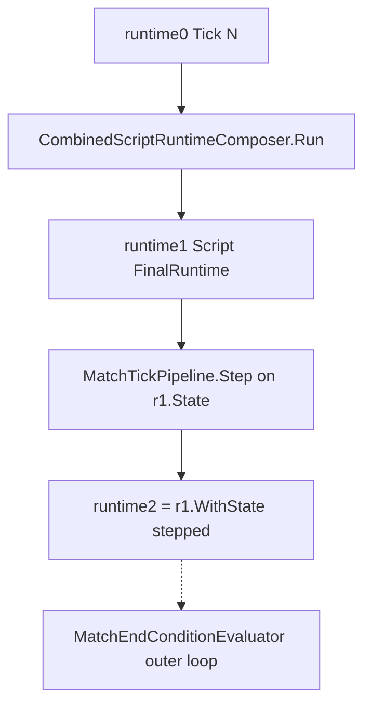

# Task 5.78 — Combined Runtime Tick Plan

> **Nur Dokumentation.** Keine Implementierung, keine Tests, keine Änderungen an `src/`, `tests/`, Projekten, Solution oder `game/`.
>
> Sprache: Erklärungen überwiegend auf Deutsch; Typnamen und API-Skizzen wie im Code auf Englisch.

## 1. Purpose

Dieses Dokument definiert, wie der nach Task **5.77** implementierte [`CombinedScriptRuntimeComposer`](../src/ScriptTanks.Core/Scripting/CombinedScriptRuntimeComposer.cs) in **einen** deterministischen Simulations-Tick eingebettet werden soll — inklusive Reihenfolge zu [`MatchTickPipeline`](../src/ScriptTanks.Core/Match/MatchTickPipeline.cs), State-Threading, Projektil-/Cooldown-Timing, Sensor-Overlay und End-Condition-Grenzen.

### Warum ein Tick-Plan nach 5.77 nötig ist

Nach 5.77 existiert ein reiner Script-Composer:

```text
runtime₀ + programs + ProjectileIdSequence
→ CombinedScriptRuntimeComposer.Run
→ FinalRuntime (MatchState aus Fire + SensorLoadouts aus Sensor, Option-A-Merge)
```

Dieser Pfad ist **noch nicht** mit dem Tick-System verbunden:

- [`MatchTickPipeline.Step`](../src/ScriptTanks.Core/Match/MatchTickPipeline.cs) (Projektil Step → Hit → Cleanup → Tick +1)
- [`MatchEndConditionEvaluator`](../src/ScriptTanks.Core/Match/MatchEndConditionEvaluator.cs)
- [`MatchRunner`](../src/ScriptTanks.Core/Match/MatchRunner.cs) / Replay / Logging

**Grenze Task 5.78:** Der **Composer** ist fertig; der **Tick-Composer** (Orchestrierung Script + Tick pro Tick) ist das nächste Design (Implementierung **5.79–5.80**).

### Zielkette (geplant, End-to-End pro Tick)

```text
runtime₀ (Tick N)
→ CombinedScriptRuntimeComposer.Run
→ runtime₁ (Script-FinalRuntime)
→ MatchTickPipeline.Step(runtime₁.State)
→ runtime₂ = runtime₁.WithState(steppedState)
→ (äußere Schleife) MatchEndConditionEvaluator
```

Voraussetzung: Option-A-Merge und Runtime-Split aus [`COMBINED_SCRIPT_RUNTIME_COMPOSER_PLAN.md`](COMBINED_SCRIPT_RUNTIME_COMPOSER_PLAN.md) §5 bleiben unverändert.

## 2. Current State After 5.77

| Bereich | Status im Repo |
| ------- | -------------- |
| **Combined Script Composer** | [`CombinedScriptRuntimeComposer.Run`](../src/ScriptTanks.Core/Scripting/CombinedScriptRuntimeComposer.cs) + [`CombinedScriptRuntimeComposerResult`](../src/ScriptTanks.Core/Scripting/CombinedScriptRuntimeComposerResult.cs) |
| **Tick-Schritt (MatchState)** | [`MatchTickPipeline`](../src/ScriptTanks.Core/Match/MatchTickPipeline.cs) — unabhängig vom Script-Composer |
| **Sensor-Tick (ein Scan)** | [`MatchSensorRuntimeTickPipeline`](../src/ScriptTanks.Core/Sensors/MatchSensorRuntimeTickPipeline.cs) — Scan, dann Tick; **ohne** Script/Fire |
| **Fire + Tick (ein Request)** | [`MatchTickFireThenProjectilePipeline`](../src/ScriptTanks.Core/Match/MatchTickFireThenProjectilePipeline.cs) — Fire, dann Tick; **ohne** Script-Integration |
| **Match-Loop** | [`MatchRunner`](../src/ScriptTanks.Core/Match/MatchRunner.cs) — **kein** Aufruf von `CombinedScriptRuntimeComposer` |
| **Kombinierter Script+Tick** | **Nicht implementiert** (dieses Dokument) |

```text
Heute möglich:
  CombinedScriptRuntimeComposer.Run(...)     // isoliert, Tests
  MatchTickPipeline.Step(state)              // isoliert, Runner
  MatchSensorRuntimeTickPipeline.Step(...)   // Sensor + Tick, kein Script-Fire

Noch nicht möglich:
  Ein Aufruf pro Tick: Script (Sensor+Fire) → Tick → FinalRuntime + Sequence für N+1
```

## 3. Existing Pipeline Inventory

| Component | Path | Role in one tick |
| --------- | ---- | ---------------- |
| Combined composer | [`CombinedScriptRuntimeComposer.cs`](../src/ScriptTanks.Core/Scripting/CombinedScriptRuntimeComposer.cs) | Integration → Mapping → Sensor apply → Fire construct/apply → Option-A-Merge auf `runtime₀` |
| Composer result | [`CombinedScriptRuntimeComposerResult.cs`](../src/ScriptTanks.Core/Scripting/CombinedScriptRuntimeComposerResult.cs) | Bündelt Script-Zwischenergebnisse + `FinalRuntime` + `FinalProjectileIdSequence` |
| Script fire apply | [`ScriptMappedFireRequestApplicationPipeline.cs`](../src/ScriptTanks.Core/Scripting/ScriptMappedFireRequestApplicationPipeline.cs) | `MatchStateFireSystem.ResolveFire(..., currentState.CurrentTick)` |
| Fire + tick (explicit request) | [`MatchTickFireThenProjectilePipeline.cs`](../src/ScriptTanks.Core/Match/MatchTickFireThenProjectilePipeline.cs) | Optional ein `MatchFireRequest`, dann [`MatchTickPipeline.Step`](../src/ScriptTanks.Core/Match/MatchTickPipeline.cs) |
| Tick step | [`MatchTickPipeline.cs`](../src/ScriptTanks.Core/Match/MatchTickPipeline.cs) | [`MatchTickProjectilePipeline`](../src/ScriptTanks.Core/Match/MatchTickProjectilePipeline.cs) (Step → Hit → Cleanup), dann [`MatchStateTickAdvanceSystem.AdvanceTick`](../src/ScriptTanks.Core/Match/MatchStateTickAdvanceSystem.cs) |
| Projectile sub-pipeline | [`MatchTickProjectilePipeline.cs`](../src/ScriptTanks.Core/Match/MatchTickProjectilePipeline.cs) | Bewegung vor Treffererkennung; Cleanup zuletzt (XML im Typ) |
| Fire system | [`MatchStateFireSystem.cs`](../src/ScriptTanks.Core/Match/MatchStateFireSystem.cs) | Projektil spawnen, Loadout-Cooldown über `LoadoutFireResolver` |
| Sensor-only tick | [`MatchSensorRuntimeTickPipeline.cs`](../src/ScriptTanks.Core/Sensors/MatchSensorRuntimeTickPipeline.cs) | Optional Scan → `MatchTickPipeline.Step` → `WithState(stepped)` |
| Scheduled sensor tick | [`MatchSensorRuntimeScheduledTickPipeline.cs`](../src/ScriptTanks.Core/Sensors/MatchSensorRuntimeScheduledTickPipeline.cs) | Geplanter Scan für aktuellen Tick, dann gleiches Tick-Muster |
| End condition | [`MatchEndConditionEvaluator.cs`](../src/ScriptTanks.Core/Match/MatchEndConditionEvaluator.cs) | Read-only Query; **außerhalb** des Tick-Composers |
| Match loop (no scripts) | [`MatchRunner.cs`](../src/ScriptTanks.Core/Match/MatchRunner.cs) | End check → `MatchTickPipeline.Step` → End check |
| Scheduled fire loop | [`MatchRunner.RunUntilEnd`](../src/ScriptTanks.Core/Match/MatchRunner.cs) (Overload mit `scheduledFireRequests`) | End check → `MatchTickFireThenProjectilePipeline.Step` → End check |

**Hinweis:** [`MatchRunner`](../src/ScriptTanks.Core/Match/MatchRunner.cs) hat heute **keinen** Pfad für `CombinedScriptRuntimeComposer` oder Script-`programs` pro Tick.

## 4. Ordering Options

### Option A — Scripts before tick step

```text
runtime₀
→ CombinedScriptRuntimeComposer.Run(runtime₀, programs, projectileIdSequence) → runtime₁
→ MatchTickPipeline.Step(runtime₁.State) → steppedState
→ runtime₂ = runtime₁.WithState(steppedState)
```

### Option B — Tick step before scripts

```text
runtime₀
→ MatchTickPipeline.Step(runtime₀.State) → steppedState₀
→ runtime₀' = runtime₀.WithState(steppedState₀)
→ CombinedScriptRuntimeComposer.Run(runtime₀', programs, sequence) → runtime₂
```

### Comparison

| Aspect | A (scripts first) | B (tick first) |
| ------ | ----------------- | -------------- |
| Aligns with [`MatchTickFireThenProjectilePipeline`](../src/ScriptTanks.Core/Match/MatchTickFireThenProjectilePipeline.cs) (fire before projectile step) | Yes | No — script fire would run on post-advance snapshot |
| Aligns with [`MatchSensorRuntimeTickPipeline`](../src/ScriptTanks.Core/Sensors/MatchSensorRuntimeTickPipeline.cs) (scan before step) | Yes | No |
| Same-tick projectile movement after script `fire()` | Yes (see test references below) | New projectiles spawn only after tick N→N+1 advance |
| `ResolveFire` cooldown reference tick | `CurrentTick` = N (pre-step) | `CurrentTick` = N+1 (already advanced) |
| Sensor overlay vs fire geometry | Known MVP limit ([composer plan](COMBINED_SCRIPT_RUNTIME_COMPOSER_PLAN.md) §5): fire uses `runtime₀.State` | Does not fix overlay; adds tick skew |

### Evidence from existing tests (reference by name/path)

Keine formalen Zitate — nur Verweise auf Repo-Artefakte:

| Reference | What it establishes |
| --------- | ------------------- |
| [`MatchTickFireThenProjectilePipeline.cs`](../src/ScriptTanks.Core/Match/MatchTickFireThenProjectilePipeline.cs) (XML remarks) | *"Fire happens before the projectile pipeline so a freshly spawned projectile can move, hit, and be cleaned up within the same tick."* |
| [`MatchTickFireThenProjectilePipelineTests.Step_WithFireRequest_PreservesFireOutcomeAsImmediatePostFireState`](../tests/ScriptTanks.Core.Tests/Match/MatchTickFireThenProjectilePipelineTests.cs) | Post-fire `FireOutcome.UpdatedState`: tick 5, projectile at muzzle. Final `UpdatedState`: tick 6, projectile at `(51, 50)` — one step in same tick pass. |
| [`MatchSensorRuntimeTickPipelineTests`](../tests/ScriptTanks.Core.Tests/Sensors/MatchSensorRuntimeTickPipelineTests.cs) | Sensor scan (optional) runs before `MatchTickPipeline.Step`; loadouts preserved via `WithState`. |

Für den kombinierten Pfad gilt analog: Script-`fire()` in der Composer-Phase (Tick **N**), dann `MatchTickPipeline.Step` für Bewegung/Treffer/Cleanup und Advance auf **N+1**.

## 5. Recommended MVP Ordering

**Empfehlung für Task 5.80:** **Option A — Scripts before `MatchTickPipeline.Step`.**



### Authoritative per-tick sequence (5.80)

1. `scriptResult = CombinedScriptRuntimeComposer.Run(runtime₀, programs, projectileIdSequence)`
2. `steppedState = MatchTickPipeline.Step(scriptResult.FinalRuntime.State)`
3. `finalRuntime = scriptResult.FinalRuntime.WithState(steppedState)`
4. `finalSequence = scriptResult.FinalProjectileIdSequence` (unchanged by tick step)
5. Return bundled tick result (see §8)

**Anti-patterns:**

- `MatchTickPipeline.Step` **before** composer on demselben Tick.
- `CombinedScriptRuntimeComposer.Run(sensorFinalRuntime, …)` — bricht Composer-Guards (bleibt verboten).
- Zweites `EvaluateIntents` pro Tick.
- Versteckter globaler `ProjectileIdSequence`-Zähler.

## 6. Timing Policies

### 6.1 Projectile timing

| Phase | Tick index | Behavior |
| ----- | ---------- | -------- |
| Composer (script fire) | N | `MatchStateFireSystem` hängt Projektil(e) an; `CurrentTick` bleibt N |
| `MatchTickPipeline.Step` | N → N+1 | Step → Hit → Cleanup auf Composer-`State`, dann `AdvanceTick` |

Damit können frisch gespawnte Script-Projektile **im selben** Tick noch einen Step (und ggf. Hit/Cleanup) durchlaufen — konsistent mit [`MatchTickFireThenProjectilePipeline`](../src/ScriptTanks.Core/Match/MatchTickFireThenProjectilePipeline.cs) und [`MatchRunner`](../src/ScriptTanks.Core/Match/MatchRunner.cs) (scheduled fire).

### 6.2 Cooldown timing

[`ScriptMappedFireRequestApplicationPipeline`](../src/ScriptTanks.Core/Scripting/ScriptMappedFireRequestApplicationPipeline.cs) ruft `ResolveFire(..., currentState.CurrentTick)` auf — zum Zeitpunkt der Composer-Phase ist das Tick **N**.

Cooldown-/Reject-Semantik entspricht dem expliziten Fire-Tick-Pfad (Referenz: [`MatchTickFireThenProjectilePipelineTests`](../tests/ScriptTanks.Core.Tests/Match/MatchTickFireThenProjectilePipelineTests.cs) für Not-Ready-Fire). Tiefe Cooldown-Matrix bleibt in 5.74-Tests; der Tick-Composer führt nicht neu aus.

### 6.3 Sensor overlay timing

| Quelle | Was übernimmt der Tick-Composer |
| ------ | ------------------------------- |
| Sensor apply (Composer) | `SensorLoadouts` → in `scriptResult.FinalRuntime`, überleben `WithState` |
| Fire apply (Composer) | `MatchState` (Tanks, Loadouts, Projectiles) → Input für `MatchTickPipeline.Step` |

**MVP-Limitation** (aus [Composer-Plan](COMBINED_SCRIPT_RUNTIME_COMPOSER_PLAN.md) §5): Fire-Geometrie (Muzzle/Velocity) aus `runtime₀.State`, nicht aus hypothetischem post-Scan-`MatchState`. Der Tick-Plan ändert das nicht.

Nach dem Tick-Schritt: `runtime₂` hat **gestepptes** `State` (inkl. Projektilschaden) und **unveränderte** Script-`SensorLoadouts` bis zum nächsten Composer-Aufruf.

### 6.4 End-condition boundary

| Rule | Detail |
| ---- | ------ |
| Placement | [`MatchEndConditionEvaluator.Evaluate`](../src/ScriptTanks.Core/Match/MatchEndConditionEvaluator.cs) bleibt in der **äußeren** Match-Schleife — nicht inside `CombinedRuntimeTickPipeline` (MVP) |
| When | Nach `runtime₂` (voller Tick inkl. Projektilschaden und Tick-Advance) |
| Initial check | Vor der ersten Tick-Iteration unverändert (wie `MatchRunner`) |
| Input state | `runtime₂.State` oder äquivalent `finalRuntime.State` |

Zerstörung/Timeout muss Projektil-Hits aus demselben Tick berücksichtigen können (Step/Hit laufen vor Advance).

## 7. State Threading and `ProjectileIdSequence`

```text
Tick N:
  Input:  runtime₀, programs, sequenceIn
  Composer output: runtime₁ = scriptResult.FinalRuntime
  Tick step: steppedState = Step(runtime₁.State)
  Output: runtime₂ = runtime₁.WithState(steppedState)
          sequenceOut = scriptResult.FinalProjectileIdSequence

Tick N+1:
  Input:  runtime₂, programs, sequenceOut
```

| Field | Threading rule |
| ----- | -------------- |
| `runtime₀` reference | Input-Referenz wird vom Composer **nicht** mutiert (siehe [`CombinedScriptRuntimeComposerTests.Run_does_not_mutate_original_runtime_reference`](../tests/ScriptTanks.Core.Tests/Scripting/CombinedScriptRuntimeComposerTests.cs)) |
| `SensorLoadouts` | Von Composer; durch `WithState` erhalten (wie [`MatchSensorRuntimeTickPipeline`](../src/ScriptTanks.Core/Sensors/MatchSensorRuntimeTickPipeline.cs)) |
| `State` | Nach Tick: `steppedState` mit `CurrentTick` = N+1 |
| `ProjectileIdSequence` | Nur Composer-Konstruktion advanced; `MatchTickPipeline` berührt die Sequence **nicht** |

## 8. Result Model Sketch (Task 5.79)

Geplanter reiner Bundle-Typ (noch nicht im Repo):

```text
CombinedRuntimeTickResult
├─ MatchSensorRuntimeState InitialRuntime              // runtime₀
├─ CombinedScriptRuntimeComposerResult ScriptResult    // voller Script-Zweig
├─ MatchState SteppedState                             // MatchTickPipeline.Step output
├─ MatchSensorRuntimeState FinalRuntime                // ScriptResult.FinalRuntime.WithState(SteppedState)
└─ ProjectileIdSequence FinalProjectileIdSequence      // = ScriptResult.FinalProjectileIdSequence; next tick input
```

**Invarianten (Entwurf):**

- `ReferenceEquals(InitialRuntime, ScriptResult.InitialRuntime)`
- `ReferenceEquals(ScriptResult, …)` — Child-Chain wie in `CombinedScriptRuntimeComposerResult` unverändert im verschachtelten `ScriptResult`
- `ReferenceEquals(FinalRuntime.State, SteppedState)`
- `ReferenceEquals(FinalRuntime.SensorLoadouts, ScriptResult.FinalRuntime.SensorLoadouts)`
- `FinalProjectileIdSequence == ScriptResult.FinalProjectileIdSequence` (Wertgleichheit struct)
- **Kein** `MatchEndConditionResult` im Tick-Result (End-Check nur in Runner-Schleife)

### Tick pipeline API sketch (Task 5.80)

```csharp
public static class CombinedRuntimeTickPipeline
{
    public static CombinedRuntimeTickResult Step(
        MatchSensorRuntimeState runtime,
        IReadOnlyList<ScriptProgram> programs,
        ProjectileIdSequence projectileIdSequence);
}
```

Reihenfolge exakt §5; Delegation an bestehende Typen ohne neue Gameplay-Regeln.

## 9. Determinism and Purity Requirements

| Requirement | Mechanism |
| ----------- | --------- |
| Fixed ordering | Composer → `MatchTickPipeline.Step` → `WithState` |
| Single script evaluation | One `CombinedScriptRuntimeComposer.Run` per tick |
| No input mutation | `runtime₀` reference and composer purity tests as precedent |
| Repeatability | Gleiche `(runtime₀, programs, sequenceIn)` → gleiche Script- und Tick-Ergebnisse |

**Test references (precedent, not formal citations):**

- [`CombinedScriptRuntimeComposerTests`](../tests/ScriptTanks.Core.Tests/Scripting/CombinedScriptRuntimeComposerTests.cs) — determinism, purity, Option-A-merge
- [`MatchSensorRuntimeTickPipelineTests`](../tests/ScriptTanks.Core.Tests/Sensors/MatchSensorRuntimeTickPipelineTests.cs) — scan + tick, `WithState` folding
- [`MatchTickFireThenProjectilePipelineTests`](../tests/ScriptTanks.Core.Tests/Match/MatchTickFireThenProjectilePipelineTests.cs) — fire-then-tick projectile semantics

## 10. Relationship to MatchRunner, Replay, and Logging

| System | Today | After 5.80 (MVP) | Task 5.81+ |
| ------ | ----- | ---------------- | ---------- |
| [`MatchRunner`](../src/ScriptTanks.Core/Match/MatchRunner.cs) | `MatchTickPipeline` or scheduled `MatchTickFireThenProjectilePipeline` | **Unchanged** — no script loop | Plan: loop `CombinedRuntimeTickPipeline.Step` + end check |
| [`LoggedMatchRunner`](../src/ScriptTanks.Core/Match/LoggedMatchRunner.cs) | Logged tick / fire-then-tick | No integration in 5.78–5.80 | Logged wrapper around combined tick pipeline |
| Replay recorders | [`MatchReplayRecorder`](../src/ScriptTanks.Core/Replay/MatchReplayRecorder.cs), [`LoggedMatchReplayRecorder`](../src/ScriptTanks.Core/Replay/LoggedMatchReplayRecorder.cs) | No integration | Separate integration plan |

Logged Varianten folgen dem Muster [`LoggedMatchTickFireThenProjectilePipeline`](../src/ScriptTanks.Core/Match/LoggedMatchTickFireThenProjectilePipeline.cs): gleiche Reihenfolge, zusätzliche Log-Einträge — **nicht** Teil von 5.78.

## 11. Recommended Follow-Up Tasks

| Task | Content |
| ---- | ------- |
| **5.79** | `CombinedRuntimeTickResult` models + ctor invariants (`ScriptResult` chain, `SteppedState`, `FinalRuntime`, `FinalProjectileIdSequence`) |
| **5.80** | `CombinedRuntimeTickPipeline.Step` — Option A sequence from §5 |
| **5.81** | Optional **plan** for `MatchRunner` / replay / logging integration (no Godot requirement in plan-only phase) |

**Nicht** in 5.79/5.80: Option B (Re-Integration nach Sensor), Scheduler/CPU, Movement/Turret-Script-Commands, Lockerung der `ReferenceEquals`-Guards.

## 12. Out of Scope (Task 5.78)

- Keine Implementierung in `src/` oder `tests/`
- Keine Änderung an [`MatchRunner`](../src/ScriptTanks.Core/Match/MatchRunner.cs), CombatLog, Replay, Godot
- Kein Scheduler / CPU-Budget
- Keine Bearbeitung anderer Plan-Dateien außer dieser neuen Datei
- Keine Ausführung von Option B (Tick vor Scripts) als MVP

## 13. Definition of Done (Task 5.78)

- [`docs/COMBINED_SCRIPT_RUNTIME_TICK_PLAN.md`](COMBINED_SCRIPT_RUNTIME_TICK_PLAN.md) existiert mit Abschnitten Purpose, Ist-Zustand, Inventar, Ordering, MVP-Policy, Timing, State/Sequence, Result-Sketch, Determinismus, MatchRunner-Bezug, Follow-ups, Out of Scope, DoD.
- Option A vs. B verglichen; **MVP Option A** mit Test-**Referenzen** (Markdown-Links auf Dateien/Tests, keine formalen Citations).
- Projektil-, Cooldown-, Sensor-Overlay- und End-Condition-Policies dokumentiert.
- `FinalProjectileIdSequence` im Tick-Result-Sketch und Sequence-Threading explizit.
- Follow-ups **5.79–5.81** benannt.
- `dotnet build ScriptTanks.sln -warnaserror` und `dotnet test ScriptTanks.sln` unverändert grün (nur Markdown).
