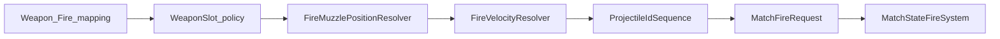

# Task 5.58 — Deterministic Fire Muzzle Resolver Plan

> **Nur Dokumentation.** Keine Implementierung, keine Tests, keine Änderungen an `src/`, `tests/`, Projekten, Solution oder `game/`.
>
> Sprache: Erklärungen überwiegend auf Deutsch; Typnamen und API-Skizzen wie im Code auf Englisch.

## 1. Purpose

Dieses Dokument definiert die **geplante deterministische Quelle** für `MatchFireRequest.MuzzlePosition` in der zukünftigen Script-Mapped-Fire-Konstruktion.

Die Muzzle-Ableitung ist eine **eigene Schicht** und bleibt getrennt von:

| Schicht | Verantwortung |
| ------- | ------------- |
| Script-Übersetzung / Intent-Integration | Kommando → `ScriptCommandTranslationOutput` |
| Domain-Mapping | Kategorie `Weapon` für `Fire` |
| `ProjectileIdSequence` | ID-Vergabe erst, wenn ein echter Request gebaut wird (siehe [§11](#11-relationship-to-fire-velocity-resolver)) |
| Fire-Velocity-Ableitung | Eigener Resolver (geplant ab Task 5.61+) |
| Fire-Request-Konstruktion | Zusammenbau `MatchFireRequest` |
| Fire-Ausführung | `[MatchStateFireSystem](../src/ScriptTanks.Core/Match/MatchStateFireSystem.cs)` / `[LoadoutFireResolver](../src/ScriptTanks.Core/Combat/LoadoutFireResolver.cs)` |
| Projektil-Spawning | `[ProjectileSpawnFactory](../src/ScriptTanks.Core/Projectiles/ProjectileSpawnFactory.cs)` bei Ausführung |

**Kernfrage der zukünftigen Muzzle-Schicht:**

Gegeben Tank-Position, Turm-/Zielrichtung und Waffen-Geometrie — wo liegt der deterministische Spawn-Punkt (`FixedVec2`) für das Projektil?

- **Keine** Zufalls-IDs, GUIDs oder Wall-Clock.
- **Keine** Godot-/Render-Transforms als Simulations-Wahrheit.
- **Keine** erfundenen Koordinaten nur damit `MissingMuzzleResolver` verschwindet.

## 2. Current State After Task 5.57

Aktuelle Kette (reine Komponenten, Stand nach Task 5.57):

```text
ScriptProgram[]
→ MatchScriptIntentIntegrationComposer.EvaluateIntents(MatchSensorRuntimeState, programs)
→ MatchScriptIntentIntegrationResult
→ ScriptTranslatedCommandDomainMapper.MapAll(...)
→ MatchScriptDomainRequestMappingResult
→ ScriptMappedFireRequestConstructionPipeline.Construct(runtime, mapping, ProjectileIdSequence)
```

**Fire-Klassifikation heute (Skeleton):**

```text
Weapon + Fire → ScriptMappedFireRequestConstructionStatus.MissingMuzzleResolver
                MatchFireRequest? = null
                FinalProjectileIdSequence = Eingabe-Sequence (unverändert)
```

[`ScriptMappedFireRequestConstructionPipeline`](../src/ScriptTanks.Core/Scripting/ScriptMappedFireRequestConstructionPipeline.cs) ruft **nicht** `ProjectileIdSequence.AllocateNext()` auf und baut **keinen** `MatchFireRequest`.

[`MatchScriptSensorRuntimeComposer`](../src/ScriptTanks.Core/Scripting/MatchScriptSensorRuntimeComposer.cs) orchestriert weiterhin nur Sensor-Anwendung; Fire-Konstruktion ist **nicht** End-to-End eingebunden.

[`ProjectileIdSequence`](../src/ScriptTanks.Core/Ids/ProjectileIdSequence.cs) (Task 5.56) existiert; die Sequence wird bewusst **nicht verbraucht**, solange Muzzle (und später Velocity) fehlen — konsistent mit [`SCRIPT_MAPPED_FIRE_REQUEST_CONSTRUCTION_PLAN.md`](SCRIPT_MAPPED_FIRE_REQUEST_CONSTRUCTION_PLAN.md).

**Nächste Lücke:** deterministische `MuzzlePosition` aus vorhandenem Tank-/Turm-Zustand — genau dieses Dokument.

## 3. Existing Type Inventory

Aus dem Ist-Stand des Kerns (keine erfundenen Typen):


| Bereich | Typ / API | Rolle (Kurz) |
| ------- | --------- | ------------ |
| Fire-Request | [`MatchFireRequest`](../src/ScriptTanks.Core/Match/MatchFireRequest.cs) | `MuzzlePosition` ist `FixedVec2`; heute vom Aufrufer übergeben, nicht abgeleitet |
| Tank-Laufzeit | [`TankState`](../src/ScriptTanks.Core/Tanks/TankState.cs), [`MovementState`](../src/ScriptTanks.Core/Movement/MovementState.cs) | `Movement.Position`; `BodyRotation`, `TurretRotation` als `Fixed` — **keine feste Winkel-Einheit im Code dokumentiert** |
| Tank-Archetyp | [`TankDefinition`](../src/ScriptTanks.Core/Tanks/TankDefinition.cs), [`BasicTankStats`](../src/ScriptTanks.Core/Tanks/BasicTankStats.cs) | Metadaten/Stats; **keine Mündungs-Offsets** |
| Waffen-Loadout | [`MatchState.Loadouts`](../src/ScriptTanks.Core/Match/MatchState.cs), [`TankWeaponLoadout`](../src/ScriptTanks.Core/Weapons/TankWeaponLoadout.cs), [`WeaponState`](../src/ScriptTanks.Core/Weapons/WeaponState.cs), [`WeaponSlot`](../src/ScriptTanks.Core/Weapons/WeaponSlot.cs) | Loadout-Kommentar: **keine Hardpoint-Geometrie**; Zugriff `runtime.State.Loadouts[tankIndex]` |
| Waffen-Definition | [`WeaponDefinition`](../src/ScriptTanks.Core/Weapons/WeaponDefinition.cs), [`WeaponCatalog`](../src/ScriptTanks.Core/Weapons/WeaponCatalog.cs) | Projektil-Stats (`ProjectileSpeedPerTick`, `ProjectileRange`, `ProjectileRadius`); **kein Muzzle-Offset** |
| Projektil | [`ProjectileDefinition`](../src/ScriptTanks.Core/Projectiles/ProjectileDefinition.cs), [`ProjectileState`](../src/ScriptTanks.Core/Projectiles/ProjectileState.cs) | Laufzeit mit expliziter `Position` / `VelocityPerTick` |
| Spawn-Helfer | [`ProjectileSpawnFactory.Create`](../src/ScriptTanks.Core/Projectiles/ProjectileSpawnFactory.cs) | Übernimmt `position` unverändert; **leitet Spawn nicht aus Tank-Geometrie ab** |
| Fire-Ausführung | [`FireResolver`](../src/ScriptTanks.Core/Combat/FireResolver.cs), [`LoadoutFireResolver`](../src/ScriptTanks.Core/Combat/LoadoutFireResolver.cs), [`MatchStateFireSystem`](../src/ScriptTanks.Core/Match/MatchStateFireSystem.cs) | Kommentare: **berechnen weder Zielrichtung noch Muzzle**; Tests übergeben literale `FixedVec2` |
| Ergebnis Feuern | [`FireResolutionOutcome`](../src/ScriptTanks.Core/Combat/FireResolutionOutcome.cs), [`LoadoutFireResolutionOutcome`](../src/ScriptTanks.Core/Combat/LoadoutFireResolutionOutcome.cs) | Ausführungs-Ergebnisse, nicht Konstruktion |
| Math | [`Fixed`](../src/ScriptTanks.Core/Math/Fixed.cs), [`FixedVec2`](../src/ScriptTanks.Core/Math/FixedVec2.cs) | Fixed-Point-Kern; **kein `FixedAngle`**; **kein Rotation→Richtungs-Helfer** |
| Tick | [`SimTick`](../src/ScriptTanks.Core/Simulation/SimTick.cs) | Zeitbasis (Readiness in späteren Tasks, nicht Muzzle-Math in 5.58) |
| Scripting / Konstruktion | [`ScriptMappedFireRequestConstructionStatus`](../src/ScriptTanks.Core/Scripting/ScriptMappedFireRequestConstructionStatus.cs), Pipeline/Result-Typen | `MissingMuzzleResolver = 6` für Weapon+Fire |
| Sensor-Runtime | [`MatchSensorRuntimeState`](../src/ScriptTanks.Core/Sensors/MatchSensorRuntimeState.cs), [`MatchSensorLoadoutState`](../src/ScriptTanks.Core/Sensors/MatchSensorLoadoutState.cs) | Waffen über `State.Loadouts`; Sensoren über `SensorLoadouts.GetLoadoutAtIndex` — **getrennt** |

**Noch nicht im Repo (nur geplant):**

- `FireMuzzlePositionResolver`, `FireMuzzlePositionResult`, Status-Enum für Muzzle-Auflösung
- Deterministische `Fixed`-Rotation → `FixedVec2`-Forward-Hilfsfunktion
- Felder für Mündungs-Offset / Lauf-Länge an Waffe oder Tank

## 4. Required Inputs for Muzzle Position

Konzeptuelle Eingaben einer zukünftigen Muzzle-Auflösung:


| Input | Ist-Stand | Quelle im Repo |
| ----- | --------- | -------------- |
| Tank-Weltposition | **vorhanden** | `TankState.Movement.Position` (`FixedVec2`) |
| Aim-/Turmrichtung | **teilweise** | `TankState.TurretRotation` (`Fixed`); **keine** Richtungsvektor-Ableitung |
| Body-Richtung | **vorhanden, nicht MVP für Fire** | `TankState.BodyRotation` |
| `WeaponSlot` | **vorhanden** | Policy noch offen (MVP oft `WeaponSlot.Zero`, siehe 5.54-Plan) |
| Waffen-Definition | **vorhanden** | `runtime.State.Loadouts[tankIndex].GetWeapon(weaponSlot).Definition` |
| Mündungs-Offset / Laufgeometrie | **fehlt** | weder `WeaponDefinition` noch `TankDefinition` |
| Chassis-/Turm-Hardpoints | **fehlt** | `TankWeaponLoadout` dokumentiert explizit keine Geometrie |
| Normalisierte Winkel-Semantik | **fehlt** | `TankState`-Kommentar: Einheit durch künftiges Rotationssystem |
| Script-Aim-Alignment | **fehlt** | `AimAtEnemy` → Turret-Placeholder, keine ausführbare Turm-Pipeline |
| `SimTick` | **vorhanden** | `MatchState.CurrentTick` — für Readiness bei Ausführung, nicht für Muzzle-Position in 5.58 |

## 5. MVP Aim Direction Policy

**Empfohlene MVP-Policy:** `TankState.TurretRotation` ist die **autoritative** Aim-Scalar-Quelle für Fire-Konstruktion (nicht `BodyRotation`).

**Begründung aus dem Repo:**

1. [`ScriptTranslatedCommandDomainMapper`](../src/ScriptTanks.Core/Scripting/ScriptTranslatedCommandDomainMapper.cs) mappt `ScriptTranslatedCommandRequestKind.AimAtEnemy` auf [`ScriptDomainRequestCategory.Turret`](../src/ScriptTanks.Core/Scripting/ScriptDomainRequestCategory.cs) — semantisch gehört Zielen zum Turm, nicht zum Weapon-Mapping allein.
2. [`FireResolver`](../src/ScriptTanks.Core/Combat/FireResolver.cs) und [`LoadoutFireResolver`](../src/ScriptTanks.Core/Combat/LoadoutFireResolver.cs) nutzen **weder** Body- noch Turm-Rotation; alle Fire-Tests übergeben explizite `FixedVec2` für Muzzle und Velocity — **Body-only als Schussrichtung ist keine etablierte Konvention**.
3. **Keine erfundene Richtung:** Wenn aus `TurretRotation` kein deterministischer Einheitsvektor ableitbar ist, liefert der Resolver **`MissingAimDirection`** — kein Fallback auf Body, kein Default-Vektor.

**Nicht gewählt (explizit):** vorübergehend nur `BodyRotation` für Fire — widerspricht Turm-Semantik und ist im bestehenden Fire-Pfad nicht belegt.

**Blocker für erste Implementierung (5.60):** In `ScriptTanks.Core.Math` existiert noch kein Helfer `Fixed` → `FixedVec2` (Forward). Dieser gehört in einen **kleinen separaten Implementierungs-Task** (z. B. Teil von 5.60), nicht in 5.58.

## 6. MVP Muzzle Offset Policy

Reihenfolge für die **erste** Offset-Quelle (nur dokumentiert):

1. **Bestehende Geometrie** in Waffen-/Tank-Definitionen oder Spawn-Pipeline — **heute nicht vorhanden**.
2. **Zukünftige deterministische Konstante** (z. B. Feld an `WeaponDefinition` oder dediziertes Geometry-Record) — **erst in Task 5.60+**, nicht in 5.58.
3. **Bis Offset existiert:** Resolver-Status **`MissingWeaponGeometry`**; die Konstruktions-Pipeline mappt das weiterhin auf **`MissingMuzzleResolver`**, solange kein `Resolved`-Muzzle vorliegt (siehe [§12](#12-relationship-to-task-557)).

Formel (konzeptionell, sobald Helfer existieren):

```text
muzzlePosition = tankPosition + forward(TurretRotation) * barrelOffset(weaponDefinition)
```

`barrelOffset` ist heute **noch nicht modelliert**.

## 7. Fixed-Point Geometry Rule

Muzzle-Position ist **Simulations-Wahrheit** in Fixed-Point:

| Erlaubt | Verboten |
| ------- | -------- |
| [`Fixed`](../src/ScriptTanks.Core/Math/Fixed.cs), [`FixedVec2`](../src/ScriptTanks.Core/Math/FixedVec2.cs) | `float` / `double` als Sim-Wahrheit |
| Integer-/`Fixed`-Arithmetik, später deterministische Lookup-/Polynomial-Näherung für Trig | Godot `Vector2`, `Transform2D`, Kamera-Offsets |
| Explizite, getestete Forward-Konvention | Rendering-Mesh-Mündungspunkte |

Jede neue Richtungs-Normalisierung muss **reproduzierbar** und **unit-getestet** sein (gleiche Eingabe → gleicher `FixedVec2`).

## 8. Proposed Resolver API

**Einstiegspunkt:** [`MatchSensorRuntimeState`](../src/ScriptTanks.Core/Sensors/MatchSensorRuntimeState.cs) — analog [`ScriptMappedFireRequestConstructionPipeline`](../src/ScriptTanks.Core/Scripting/ScriptMappedFireRequestConstructionPipeline.cs).

Dokumentations-Skizze (noch nicht implementiert):

```csharp
public static class FireMuzzlePositionResolver
{
    public static FireMuzzlePositionResult Resolve(
        MatchSensorRuntimeState runtime,
        int tankIndex,
        WeaponSlot weaponSlot);
}
```

**Interner Zugriff (tatsächliche Property-Namen):**

- `runtime.State.Tanks[tankIndex]` → [`TankState`](../src/ScriptTanks.Core/Tanks/TankState.cs)
- `runtime.State.Loadouts[tankIndex]` → [`TankWeaponLoadout`](../src/ScriptTanks.Core/Weapons/TankWeaponLoadout.cs) — Property heißt **`Loadouts`**, nicht `WeaponLoadouts`

**Sensoren nicht mischen:**

- `runtime.SensorLoadouts.GetLoadoutAtIndex(tankIndex)` → nur Sensor-Scans ([`MatchSensorScanSystem`](../src/ScriptTanks.Core/Sensors/MatchSensorScanSystem.cs)), **nicht** für Muzzle.

**Optionale spätere Überladung** auf `MatchState` + Indizes, falls Fire-Ausführung ohne Sensor-Wrapper benötigt wird — sekundär; Konstruktion bleibt am Script-Runtime-Paar.

## 9. Proposed Result Model

Dokumentations-Skizze:

```text
FireMuzzlePositionResult
├─ Status (enum)
├─ MuzzlePosition?   // FixedVec2, nur bei Resolved
└─ Reason            // optional, Diagnose-String (später)
```

**Vorgeschlagene Status-Werte:**

| Status | Bedeutung |
| ------ | --------- |
| `Resolved` | `MuzzlePosition` gesetzt |
| `TankIndexOutOfRange` | `tankIndex` außerhalb `Tanks`/`Loadouts` |
| `TankDestroyed` | `TankState.IsDestroyed` |
| `WeaponSlotMissing` | Slot außerhalb Loadout (analog `TankWeaponLoadout.GetWeapon`) |
| `MissingAimDirection` | Kein Forward aus `TurretRotation` ableitbar |
| `MissingWeaponGeometry` | Kein Mündungs-Offset modelliert |

Invariante: bei jedem Status außer `Resolved` bleibt `MuzzlePosition` **null** / nicht gesetzt.

## 10. Failure Semantics

**Geschäftsregeln → Status auf dem Result, keine Exceptions:**

- Zerstörter Tank → nicht `Resolved`
- Fehlender Waffen-Slot → nicht `Resolved`
- Fehlende Aim-Richtung → `MissingAimDirection`
- Fehlende Geometrie → `MissingWeaponGeometry`

**Exceptions nur bei Programmierfehlern:**

- `runtime == null`
- undefinierte Enum-Werte
- ungültige Vertragsverletzungen in zukünftigen Modellen

**Mapping zur Konstruktions-Pipeline (später):**

- Muzzle-Resolver ≠ `Resolved` → Konstruktions-Record bleibt / wird `MissingMuzzleResolver`
- Erst bei `Resolved` + Velocity-Resolver OK → weiter zu `AllocateNext()` und `Constructed`

## 11. Relationship to Fire Velocity Resolver

Muzzle-Position und `MatchFireRequest.FireVelocity` sind **zwei getrennte Resolver**.

**Geplante Konstruktions-Reihenfolge** (abgestimmt mit 5.56/5.57 — `ProjectileId` **erst** verbrauchen, wenn ein echter Request gebaut wird):

```text
WeaponSlot policy
→ Muzzle position resolver      (dieses Dokument)
→ Fire velocity resolver        (geplant 5.61–5.63)
→ ProjectileIdSequence.AllocateNext()   // nur wenn Slot + Muzzle + Velocity OK
→ MatchFireRequest assembly
→ (später) fire execution via MatchStateFireSystem
```

Bei `MissingMuzzleResolver` oder `MissingVelocityResolver`:

- **kein** `AllocateNext()`
- `FinalProjectileIdSequence` = Eingabe-Sequence (unverändert, wie in Task 5.57)

Velocity soll dieselbe Aim-Quelle nutzen wie Muzzle (`TurretRotation` → Forward), sobald die Math-Hilfsfunktion existiert.



## 12. Relationship to Task 5.57


| Phase | `ScriptMappedFireRequestConstructionStatus` | `ProjectileIdSequence` |
| ----- | ------------------------------------------- | ---------------------- |
| Heute (5.57 Skeleton) | Weapon + Fire → `MissingMuzzleResolver` | unverändert |
| Muzzle OK, Velocity fehlt | → `MissingVelocityResolver` | unverändert |
| Slot + Muzzle + Velocity OK | → `AllocateNext()`, dann `Constructed` | fortgeschrieben |

Die Pipeline wird **`FireMuzzlePositionResolver` aufrufen** statt für jeden Fire-Eintrag pauschal `MissingMuzzleResolver` zu setzen.

## 13. Determinism Requirements

- Kein Zufall, keine GUIDs, keine Wall-Clock, keine versteckten globalen Zähler
- Keine Dictionary-Iteration ohne feste Reihenfolge
- Keine Abhängigkeit von Godot-/Render-Transforms
- Gleicher [`MatchSensorRuntimeState`](../src/ScriptTanks.Core/Sensors/MatchSensorRuntimeState.cs)-Snapshot + gleiche Parameter (`tankIndex`, `WeaponSlot`) → gleiche `MuzzlePosition` (`FixedVec2`)

## 14. Purity Boundary

Die geplante Muzzle-Schicht darf **nicht**:

- [`MatchState`](../src/ScriptTanks.Core/Match/MatchState.cs) mutieren
- [`ProjectileSpawnFactory`](../src/ScriptTanks.Core/Projectiles/ProjectileSpawnFactory.cs) aufrufen oder Projektile anlegen
- Waffen-Cooldown / Munition ändern
- Treffer, Schaden, CombatLog, Replay schreiben
- Scheduler, MatchRunner oder Godot anfassen

Sie **darf** Match-/Tank-Daten **lesen** und immutable Result-Objekte erzeugen.

## 15. Recommended Follow-up Tasks

Nummerierung für die **nächsten Implementierungs-Schritte** (ersetzt die veralteten 5.58/5.59-Zeilen in [`SCRIPT_MAPPED_FIRE_REQUEST_CONSTRUCTION_PLAN.md`](SCRIPT_MAPPED_FIRE_REQUEST_CONSTRUCTION_PLAN.md) §17):


| Task | Inhalt |
| ---- | ------ |
| **5.59** | `FireMuzzlePositionResult`-Modelle + Status-Enum |
| **5.60** | `FireMuzzlePositionResolver` — erste Implementierung (+ minimaler `Fixed`→`FixedVec2`-Forward-Helfer falls nötig) |
| **5.61** | Fire-Velocity-Resolver — **Plan** (Dokumentation) |
| **5.62** | Fire-Velocity-Result-Modelle |
| **5.63** | Fire-Velocity-Resolver — erste Implementierung |
| **5.64** | `ScriptMappedFireRequestConstructionPipeline` — echter `Constructed`-Pfad (Slot, Muzzle, Velocity, dann `AllocateNext`) |

## 16. Out of Scope

Für Task 5.58 ausdrücklich **nicht** enthalten:

- Implementierung oder Tests im Repo
- Neue Konstanten oder Felder in `WeaponDefinition` / `TankDefinition`
- `MatchFireRequest`-Konstruktion oder -Ausführung
- Projektil-Spawning, Cooldown-/Ammo-Mutation
- `MatchRunner`-, CombatLog-, Replay-, Scheduler-, Godot-Integration

---

## Definition of Done (Task 5.58)

- [`docs/DETERMINISTIC_FIRE_MUZZLE_RESOLVER_PLAN.md`](DETERMINISTIC_FIRE_MUZZLE_RESOLVER_PLAN.md) existiert mit Abschnitten 1–16.
- Fehlende Abhängigkeit nach 5.57 (`MissingMuzzleResolver`) und Ist-Typen sind mit **echten** Repo-Namen dokumentiert.
- MVP-Policies: `TurretRotation`, `Loadouts[tankIndex]`, Fixed-Only, ProjectileId **nach** Muzzle+Velocity.
- `dotnet build ScriptTanks.sln -warnaserror` und `dotnet test ScriptTanks.sln` bleiben grün (nur Markdown).
