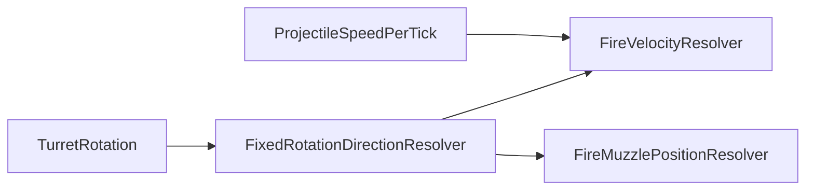
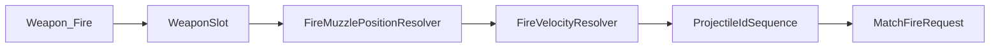

# Task 5.65 — Deterministic Fire Velocity Resolver Plan

> **Nur Dokumentation.** Keine Implementierung, keine Tests, keine Änderungen an `src/`, `tests/`, Projekten, Solution oder `game/`.
>
> Sprache: Erklärungen überwiegend auf Deutsch; Typnamen und API-Skizzen wie im Code auf Englisch.

## 1. Purpose

Dieses Dokument definiert die **geplante deterministische Quelle** für `MatchFireRequest.FireVelocity` in der zukünftigen Script-Mapped-Fire-Konstruktion.

Die Velocity-Ableitung ist eine **eigene Schicht** und bleibt getrennt von:

| Schicht | Verantwortung |
| ------- | ------------- |
| Script-Übersetzung / Intent-Integration | Kommando → `ScriptCommandTranslationOutput` |
| Domain-Mapping | Kategorie `Weapon` für `Fire` |
| Rotation → Forward | [`FixedRotationDirectionResolver`](../src/ScriptTanks.Core/Math/FixedRotationDirectionResolver.cs) (Task 5.63) |
| Muzzle-Ableitung | [`FireMuzzlePositionResolver`](../src/ScriptTanks.Core/Combat/FireMuzzlePositionResolver.cs) — Spawn-Punkt |
| **Fire-Velocity-Ableitung** | **dieses Dokument** — Bewegungsvektor pro Tick |
| `ProjectileIdSequence` | ID-Vergabe erst nach vollständiger Request-Vorbereitung |
| Fire-Request-Konstruktion | Zusammenbau `MatchFireRequest` |
| Fire-Ausführung | [`MatchStateFireSystem`](../src/ScriptTanks.Core/Match/MatchStateFireSystem.cs) / [`LoadoutFireResolver`](../src/ScriptTanks.Core/Combat/LoadoutFireResolver.cs) |
| Projektil-Spawning | [`ProjectileSpawnFactory`](../src/ScriptTanks.Core/Projectiles/ProjectileSpawnFactory.cs) bei Ausführung |

**Kernfrage der zukünftigen Velocity-Schicht:**

Gegeben `TankState.TurretRotation` und `WeaponDefinition.ProjectileSpeedPerTick` — welcher deterministische `FixedVec2` beschreibt die Projektil-Geschwindigkeit pro Tick (`FireVelocity`)?

**Geplante Kette (Turn-Fraction-Konvention aus [DETERMINISTIC_ROTATION_FORWARD_HELPER_PLAN.md](DETERMINISTIC_ROTATION_FORWARD_HELPER_PLAN.md)):**

```text
TankState.TurretRotation
→ FixedRotationDirectionResolver.ResolveForward(...)
→ forward FixedVec2
→ fireVelocity = forward * ProjectileSpeedPerTick
```

- **Keine** Zufalls-IDs, GUIDs oder Wall-Clock.
- **Keine** Godot-/Render-Transforms als Simulations-Wahrheit.
- **Keine** erfundene Velocity nur damit `MissingVelocityResolver` verschwindet.
- **Kein** Fallback auf `BodyRotation` für Schussrichtung (konsistent mit Muzzle-Plan).

## 2. Current State After Task 5.64

### Fire-Muzzle-Pfad (Stand 5.64)

[`FireMuzzlePositionResolver.Resolve`](../src/ScriptTanks.Core/Combat/FireMuzzlePositionResolver.cs) für gültigen lebenden Tank + gültigen `WeaponSlot`:

```text
→ FixedRotationDirectionResolver.ResolveForward(tank.TurretRotation)
→ forward resolved
→ FireMuzzlePositionStatus.MissingWeaponGeometry
   (MuzzlePosition? = null)
```

Die **Aim-Richtung** ist damit kein Blocker mehr; **Mündungs-/Lauf-Geometrie** fehlt noch.

### Velocity-Pfad

| Komponente | Ist-Stand |
| ---------- | --------- |
| [`FixedRotationDirectionResolver`](../src/ScriptTanks.Core/Math/FixedRotationDirectionResolver.cs) | **vorhanden** (5.63, Path B, committed Lookup) |
| `FireVelocityResolver` | **fehlt** |
| `FireVelocityResult` / `FireVelocityStatus` | **fehlen** (geplant 5.66) |
| [`ScriptMappedFireRequestConstructionPipeline`](../src/ScriptTanks.Core/Scripting/ScriptMappedFireRequestConstructionPipeline.cs) | Skeleton: Weapon+Fire → pauschal `MissingMuzzleResolver` (6); ruft **weder** Muzzle- noch Velocity-Resolver auf |
| [`ScriptMappedFireRequestConstructionStatus.MissingVelocityResolver`](../src/ScriptTanks.Core/Scripting/ScriptMappedFireRequestConstructionStatus.cs) | Enum-Wert **7** reserviert; kein Consumer |
| [`MatchFireRequest`](../src/ScriptTanks.Core/Match/MatchFireRequest.cs) | Value Object mit `FireVelocity`; wird von der Pipeline **nicht** gebaut |

### Ausführung (unverändert)

[`LoadoutFireResolver`](../src/ScriptTanks.Core/Combat/LoadoutFireResolver.cs) und [`FireResolver`](../src/ScriptTanks.Core/Combat/FireResolver.cs) erwarten `fireVelocity` als **Parameter**; Tests übergeben literale `FixedVec2` — keine Ableitung aus `TurretRotation` in der Ausführungsschicht.

## 3. Existing Type Inventory

Aus dem Ist-Stand des Kerns (keine erfundenen Typen):

| Bereich | Typ / API | Rolle (Kurz) |
| ------- | --------- | ------------ |
| Fire-Request | [`MatchFireRequest`](../src/ScriptTanks.Core/Match/MatchFireRequest.cs) | `FireVelocity` ist `FixedVec2`; vom künftigen Konstruktor gesetzt, nicht abgeleitet |
| Tank-Laufzeit | [`TankState`](../src/ScriptTanks.Core/Tanks/TankState.cs) | `TurretRotation` als `Fixed` — autoritative Aim-Quelle (Muzzle + Velocity) |
| Waffen-Loadout | [`MatchState.Loadouts`](../src/ScriptTanks.Core/Match/MatchState.cs), [`TankWeaponLoadout`](../src/ScriptTanks.Core/Weapons/TankWeaponLoadout.cs), [`WeaponState`](../src/ScriptTanks.Core/Weapons/WeaponState.cs), [`WeaponSlot`](../src/ScriptTanks.Core/Weapons/WeaponSlot.cs) | `runtime.State.Loadouts[tankIndex].GetWeapon(weaponSlot)` |
| Waffen-Definition | [`WeaponDefinition`](../src/ScriptTanks.Core/Weapons/WeaponDefinition.cs), [`WeaponCatalog`](../src/ScriptTanks.Core/Weapons/WeaponCatalog.cs) | **`ProjectileSpeedPerTick`** (`Fixed`); Konstruktor validiert `> Fixed.Zero` |
| Projektil | [`ProjectileDefinition`](../src/ScriptTanks.Core/Projectiles/ProjectileDefinition.cs), [`ProjectileState`](../src/ScriptTanks.Core/Projectiles/ProjectileState.cs), [`ProjectileSpawnFactory`](../src/ScriptTanks.Core/Projectiles/ProjectileSpawnFactory.cs) | Laufzeit-Position/Velocity; Spawn übernimmt Werte — **keine** Velocity-Ableitung aus Tank |
| Muzzle (5.64) | [`FireMuzzlePositionResolver`](../src/ScriptTanks.Core/Combat/FireMuzzlePositionResolver.cs), [`FireMuzzlePositionResult`](../src/ScriptTanks.Core/Combat/FireMuzzlePositionResult.cs), [`FireMuzzlePositionStatus`](../src/ScriptTanks.Core/Combat/FireMuzzlePositionStatus.cs) | Parallel zu Velocity; terminal `MissingWeaponGeometry` |
| Forward (5.63) | [`FixedRotationDirectionResolver`](../src/ScriptTanks.Core/Math/FixedRotationDirectionResolver.cs), [`FixedRotationDirectionResult`](../src/ScriptTanks.Core/Math/FixedRotationDirectionResult.cs) | Gemeinsame Richtungsquelle für Muzzle- und Velocity-Resolver |
| Math | [`Fixed`](../src/ScriptTanks.Core/Math/Fixed.cs), [`FixedVec2`](../src/ScriptTanks.Core/Math/FixedVec2.cs) | `FixedVec2 * Fixed` component-wise — Basis für Velocity-Skalierung |
| Fire-Ausführung | [`FireResolver`](../src/ScriptTanks.Core/Combat/FireResolver.cs), [`LoadoutFireResolver`](../src/ScriptTanks.Core/Combat/LoadoutFireResolver.cs), [`MatchStateFireSystem`](../src/ScriptTanks.Core/Match/MatchStateFireSystem.cs) | Nutzen `request.FireVelocity` bei Ausführung |
| Sensor-Runtime | [`MatchSensorRuntimeState`](../src/ScriptTanks.Core/Sensors/MatchSensorRuntimeState.cs) | Einstieg wie bei Muzzle-Resolver |
| Konstruktion | [`ScriptMappedFireRequestConstructionPipeline`](../src/ScriptTanks.Core/Scripting/ScriptMappedFireRequestConstructionPipeline.cs), Status/Record-Typen | Skeleton; `MissingVelocityResolver = 7` |

**Noch nicht im Repo (nur geplant):**

- `FireVelocityResolver`, `FireVelocityResult`, `FireVelocityStatus`

## 4. Required Inputs

Konzeptuelle Eingaben einer zukünftigen Velocity-Auflösung:

| Input | Ist-Stand | Quelle im Repo |
| ----- | --------- | -------------- |
| Laufzeit-Snapshot | **vorhanden** | `MatchSensorRuntimeState` (Parameter) |
| `tankIndex` | **vorhanden** | Parameter; Paarung mit `State.Tanks` / `State.Loadouts` |
| `WeaponSlot` | **vorhanden** | Parameter |
| Turm-Rotation | **vorhanden** | `runtime.State.Tanks[tankIndex].TurretRotation` |
| Waffen-Definition | **vorhanden** | `runtime.State.Loadouts[tankIndex].GetWeapon(weaponSlot).Definition` |
| Forward-Ableitung | **vorhanden** | Intern: `FixedRotationDirectionResolver.ResolveForward(TurretRotation)` |
| Projektil-Geschwindigkeit | **vorhanden** | `WeaponDefinition.ProjectileSpeedPerTick` |

**Nicht erforderlich für Velocity:**

| Nicht benötigt | Grund |
| -------------- | ----- |
| `MuzzlePosition` | Separate Muzzle-Schicht |
| `ProjectileId` | Erst nach vollständiger Konstruktionsentscheidung |
| `ProjectileRange` / `ProjectileRadius` | Kein Einfluss auf Velocity-Magnitude in diesem Plan |
| Cooldown / Munition | Ausführung, nicht Ableitung |
| `BodyRotation` | Explizit nicht autoritativ für Fire (Muzzle-/Rotation-Pläne) |

## 5. Proposed Velocity Formula

Nach erfolgreicher Tank-/Slot-Validierung und Forward-Auflösung:

```text
forwardResult = FixedRotationDirectionResolver.ResolveForward(tank.TurretRotation)

if !forwardResult.IsResolved:
    → MissingAimDirection (keine Velocity berechnen)

if weapon.Definition.ProjectileSpeedPerTick <= Fixed.Zero:
    → MissingWeaponSpeed (defensiv)

fireVelocity = forwardResult.Forward * weapon.Definition.ProjectileSpeedPerTick
→ Resolved(fireVelocity)
```

**Regeln:**

| Regel | Detail |
| ----- | ------ |
| Math-Typen | Nur `Fixed` / `FixedVec2` |
| Skalierung | [`FixedVec2` * `Fixed`](../src/ScriptTanks.Core/Math/FixedVec2.cs) — beide Komponenten × Speed |
| Richtung | Einheits-Forward aus Lookup (nicht normalisiert zur Laufzeit) × skalare Speed |
| Determinismus | Gleicher Snapshot + `tankIndex` + `WeaponSlot` → gleicher `FireVelocity` |
| Verboten | `float`/`double`, `System.Math` trig, Godot `Vector2` / `Transform2D` |
| Body-Fallback | **Nein** — nur `TurretRotation` |

**Beispiel (Standard Cannon):** `ProjectileSpeedPerTick = Fixed.FromInt(1)` ([`WeaponCatalog`](../src/ScriptTanks.Core/Weapons/WeaponCatalog.cs)); bei `TurretRotation = 0` → Forward `(+1, 0)` → Velocity `(+1, 0)` pro Tick in Fixed-Einheiten.

## 6. Proposed Resolver API

Signatur analog [`FireMuzzlePositionResolver.Resolve`](../src/ScriptTanks.Core/Combat/FireMuzzlePositionResolver.cs):

```csharp
public static class FireVelocityResolver
{
    public static FireVelocityResult Resolve(
        MatchSensorRuntimeState runtime,
        int tankIndex,
        WeaponSlot weaponSlot);
}
```

**Interner Zugriff (Skizze):**

```csharp
MatchState state = runtime.State;
TankState tank = state.Tanks[tankIndex];
TankWeaponLoadout loadout = state.Loadouts[tankIndex];
WeaponState weapon = loadout.GetWeapon(weaponSlot);
// forward from tank.TurretRotation; speed from weapon.Definition.ProjectileSpeedPerTick
```

- Namespace: `ScriptTanks.Core.Combat` (neben Muzzle-Resolver).
- **Ruft Muzzle-Resolver nicht auf** und umgekehrt.



## 7. Proposed Result Model (Task 5.66)

Spiegel [`FireMuzzlePositionResult`](../src/ScriptTanks.Core/Combat/FireMuzzlePositionResult.cs):

```csharp
public enum FireVelocityStatus
{
    Resolved = 0,
    TankIndexOutOfRange = 1,
    TankDestroyed = 2,
    WeaponSlotMissing = 3,
    MissingAimDirection = 4,
    MissingWeaponSpeed = 5,
}

public sealed class FireVelocityResult
{
    public FireVelocityStatus Status { get; }
    public FixedVec2? FireVelocity { get; }

    public bool IsResolved =>
        Status == FireVelocityStatus.Resolved && FireVelocity.HasValue;

    // Factories + ctor invariants (Resolved ⇔ non-null FireVelocity)
}
```

**Bewusst kein `MissingWeaponGeometry`:** Geometrie gehört ausschließlich zum Muzzle-Resolver.

## 8. Failure Semantics

### Status-Ergebnisse (Business) — Priorität wie Muzzle

| Priorität | Bedingung | Status |
| --------- | --------- | ------ |
| — | `runtime == null` | `ArgumentNullException`, `ParamName = "runtime"` |
| 1 | `tankIndex` ungültig | `TankIndexOutOfRange` |
| 2 | Tank zerstört | `TankDestroyed` |
| 3 | Slot fehlt | `WeaponSlotMissing` |
| 4 | `!forwardResult.IsResolved` | `MissingAimDirection` |
| 5 | `ProjectileSpeedPerTick <= Fixed.Zero` | `MissingWeaponSpeed` |
| 6 | Forward + Speed OK | `Resolved` + non-null `FireVelocity` |

**Exceptions** nur bei Programmer-Fehlern (null runtime, undefiniertes Enum im Result-Konstruktor).

### Pipeline-Mapping (zukünftig)

| Resolver-Ergebnis | Konstruktions-Status (Skizze) |
| ----------------- | ----------------------------- |
| Nicht `Resolved` | Weiterhin kein `MatchFireRequest`; spezifisches Velocity-Label oder aggregiertes Failure |
| `Resolved` | Velocity-Seite OK; **Muzzle** kann trotzdem `MissingWeaponGeometry` liefern |

Heute setzt das Skeleton bei Weapon+Fire nur `MissingMuzzleResolver` — Integration in 5.68.

### `MissingAimDirection` mit Path B

[`FixedRotationDirectionResolver`](../src/ScriptTanks.Core/Math/FixedRotationDirectionResolver.cs) (Path B) liefert für normale `Fixed`-Eingaben `Resolved`. Der Zweig `MissingAimDirection` bleibt **defensiv** für künftige `UnsupportedRotationConvention` / `InvalidRotationValue`.

## 9. Weapon Speed Policy

**Autoritative Quelle:** [`WeaponDefinition.ProjectileSpeedPerTick`](../src/ScriptTanks.Core/Weapons/WeaponDefinition.cs) (`Fixed`).

**Konstruktionszeit (heute):**

```csharp
if (projectileSpeedPerTick <= Fixed.Zero)
    throw new ArgumentOutOfRangeException(..., "ProjectileSpeedPerTick must be positive.");
```

Alle [`WeaponCatalog`](../src/ScriptTanks.Core/Weapons/WeaponCatalog.cs)-Definitionen erfüllen das (z. B. Standard Cannon: `Fixed.FromInt(1)`).

**Resolver-Zeit (geplant):**

- Erneute Prüfung `speed <= Fixed.Zero` → `MissingWeaponSpeed`
- **Nicht** `ProjectileRange` oder `ProjectileRadius` für Speed verwenden
- **Keine** erfundene Default-Speed

### `MissingWeaponSpeed` — defensiv behalten

Auf dem **normalen Catalog-Pfad** wird dieser Status vermutlich **nie** zurückgegeben, weil der Konstruktor positive Speed erzwingt. Trotzdem im Enum und in der Dokumentation **behalten** für:

- Künftige Custom-/Modded-`WeaponDefinition`-Instanzen ohne Konstruktor-Validierung
- Defensive Resolver-Logik (Belt-and-Suspenders)
- Klare Semantik statt stiller Null-Velocity

## 10. Relationship to Muzzle Resolver

| Aspekt | Muzzle | Velocity |
| ------ | ------ | -------- |
| Frage | **Wo** startet das Projektil? | **Wie** bewegt es sich pro Tick? |
| Output | `MuzzlePosition` (`FixedVec2`) | `FireVelocity` (`FixedVec2`) |
| Shared input | `TurretRotation` → Forward-Helfer | gleich |
| Terminal heute (5.64) | `MissingWeaponGeometry` | (noch kein Resolver) |
| Ruft den anderen auf? | **Nein** | **Nein** |

Beide Resolver können unabhängig voneinander getestet und implementiert werden (5.64 / 5.67).

## 11. Relationship to MatchFireRequest Construction

Geplante Reihenfolge (konsistent mit [DETERMINISTIC_ROTATION_FORWARD_HELPER_PLAN.md](DETERMINISTIC_ROTATION_FORWARD_HELPER_PLAN.md) §14):

```text
WeaponSlot-Policy
→ FireMuzzlePositionResolver
→ FireVelocityResolver
→ ProjectileIdSequence.AllocateNext()   // nur wenn beide Resolver Resolved
→ MatchFireRequest(..., muzzlePosition, fireVelocity, ...)
→ (später) MatchStateFireSystem / LoadoutFireResolver
```



### Wichtig: velocity-ready ≠ request-ready (5.68)

| Nach Task | Velocity | Muzzle | Vollständiger `MatchFireRequest` |
| --------- | -------- | ------ | -------------------------------- |
| **5.67** (Velocity-Resolver) | Kann **`Resolved`** werden | Weiterhin **`MissingWeaponGeometry`** (5.64) | **Nein** — `MuzzlePosition` fehlt |
| **5.68** (Pipeline `Constructed`) | Muss Resolved sein | Muss Resolved sein (Geometrie nötig) | **Ja** — dann `AllocateNext()` |

- **`Constructed` in 5.68** ist nur möglich, wenn **auch Muzzle-Geometrie** gelöst (oder ein minimales Geometrie-Modell eingeführt) ist — **nicht** allein durch Velocity.
- Bei `MissingMuzzleResolver` / `MissingVelocityResolver` / nicht-`Resolved`-Muzzle: **kein** `AllocateNext()`, Sequence unverändert (wie Task 5.57).

## 12. Determinism Requirements

- Kein Zufall, keine GUIDs, keine Wall-Clock, keine versteckten globalen Zähler
- Keine Dictionary-Iteration ohne feste Reihenfolge in der Velocity-Schicht
- Keine Abhängigkeit von Godot-/Render-Transforms
- Gleicher [`MatchSensorRuntimeState`](../src/ScriptTanks.Core/Sensors/MatchSensorRuntimeState.cs)-Snapshot + gleiche Parameter (`tankIndex`, `WeaponSlot`) → gleicher `FireVelocity` (`FixedVec2`)
- Forward und Speed ausschließlich über committed `Fixed`-Pfade (Lookup + `WeaponDefinition`)

## 13. Purity Boundary

Die geplante Velocity-Schicht darf **nicht**:

- [`MatchState`](../src/ScriptTanks.Core/Match/MatchState.cs) mutieren
- [`WeaponState`](../src/ScriptTanks.Core/Weapons/WeaponState.cs)-Cooldown oder Munition ändern
- [`ProjectileSpawnFactory`](../src/ScriptTanks.Core/Projectiles/ProjectileSpawnFactory.cs) aufrufen oder Projektile anlegen
- `ProjectileIdSequence.AllocateNext()` aufrufen
- `MatchFireRequest` konstruieren oder in Listen einreihen
- Treffer, Schaden, [`CombatLog`](../src/ScriptTanks.Core/Combat/), Replay schreiben
- Scheduler, MatchRunner oder Godot anfassen

Sie **darf** Match-/Tank-/Loadout-Daten **lesen**, `FixedRotationDirectionResolver` aufrufen und immutable `FireVelocityResult`-Objekte erzeugen.

## 14. Recommended Follow-up Tasks

Nummerierung nach [DETERMINISTIC_ROTATION_FORWARD_HELPER_PLAN.md](DETERMINISTIC_ROTATION_FORWARD_HELPER_PLAN.md) §14 (5.65 = dieses Dokument):

| Task | Inhalt |
| ---- | ------ |
| **5.66** | `FireVelocityStatus` + `FireVelocityResult` — Modelle (Invarianten wie Muzzle) |
| **5.67** | `FireVelocityResolver` — erste Implementierung (Formel §5, Status §8) |
| **5.68** | `ScriptMappedFireRequestConstructionPipeline` — echter `Constructed`-Pfad — **blockiert durch Muzzle-Geometrie**; Velocity (5.67) nötig, aber **nicht hinreichend** |

**Hinweis zu älteren Plänen:** [`DETERMINISTIC_FIRE_MUZZLE_RESOLVER_PLAN.md`](DETERMINISTIC_FIRE_MUZZLE_RESOLVER_PLAN.md) §15 und [`SCRIPT_MAPPED_FIRE_REQUEST_CONSTRUCTION_PLAN.md`](SCRIPT_MAPPED_FIRE_REQUEST_CONSTRUCTION_PLAN.md) listen teils **veraltete** Task-Nummern — in Task 5.65 **nicht** geändert; maßgeblich ist die Reihenfolge in diesem Dokument und im Rotation-Forward-Plan §14.

**Nächste inhaltliche Lücke nach Velocity (5.67):** Muzzle-Geometrie (Offset/Länge), nicht erneut Aim-Richtung.

## 15. Out of Scope and Definition of Done

### Out of Scope (Task 5.65)

- Implementierung oder Tests im Repo
- `FireVelocityResolver` / Result-Modelle
- Änderungen an [`FireMuzzlePositionResolver`](../src/ScriptTanks.Core/Combat/FireMuzzlePositionResolver.cs)
- `ScriptMappedFireRequestConstructionPipeline`-Wiring
- `MatchFireRequest`-Konstruktion oder -Ausführung
- Projektil-Spawning, Cooldown-/Ammo-Mutation
- Neue Felder in `WeaponDefinition` / `TankDefinition` für Geometrie
- Hardcoded Muzzle-/Velocity-Konstanten als Workaround
- Bearbeitung anderer Plan-Dateien (außer diesem neuen File)
- Godot-Integration

### Definition of Done (Task 5.65)

- [`docs/DETERMINISTIC_FIRE_VELOCITY_RESOLVER_PLAN.md`](DETERMINISTIC_FIRE_VELOCITY_RESOLVER_PLAN.md) existiert mit Abschnitten 1–15.
- Post-5.64-Zustand, Ist-Typen und Velocity-Formel mit `FixedRotationDirectionResolver` sind dokumentiert.
- API-, Result- und Failure-Semantik (inkl. defensivem `MissingWeaponSpeed`) sind definiert.
- Trennung Muzzle / Velocity, Konstruktionsreihenfolge und **5.68-Geometrie-Blocker** sind dokumentiert.
- `dotnet build ScriptTanks.sln -warnaserror` und `dotnet test ScriptTanks.sln` bleiben grün (nur Markdown).
