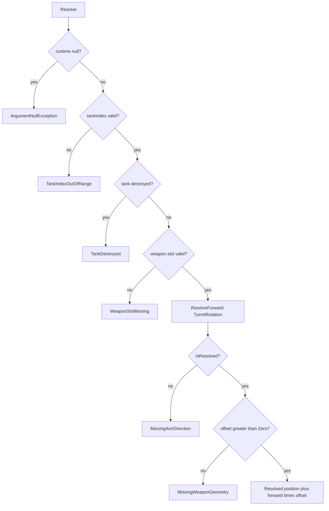
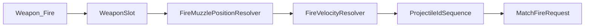

# Task 5.68 — Deterministic Muzzle Geometry Plan

> **Nur Dokumentation.** Keine Implementierung, keine Tests, keine Änderungen an `src/`, `tests/`, Projekten, Solution oder `game/`.
>
> Sprache: Erklärungen überwiegend auf Deutsch; Typnamen und API-Skizzen wie im Code auf Englisch.

## 1. Purpose

Dieses Dokument definiert die **geplante deterministische Waffen-Geometrie** (Mündungs-Offset), die [`FireMuzzlePositionResolver`](../src/ScriptTanks.Core/Combat/FireMuzzlePositionResolver.cs) von `MissingWeaponGeometry` auf `Resolved` bringen soll — und damit den letzten inhaltlichen Blocker vor einem vollständigen `MatchFireRequest` in der Script-Mapped-Fire-Konstruktion beseitigt.

Die Geometrie-Schicht ist **Daten + Formel** und bleibt getrennt von:

| Schicht | Verantwortung |
| ------- | ------------- |
| Script-Übersetzung / Intent-Integration | Kommando → `ScriptCommandTranslationOutput` |
| Domain-Mapping | Kategorie `Weapon` für `Fire` |
| Rotation → Forward | [`FixedRotationDirectionResolver`](../src/ScriptTanks.Core/Math/FixedRotationDirectionResolver.cs) (Task 5.63) |
| **Mündungs-Geometrie** | **dieses Dokument** — skalarer Offset entlang Forward |
| Muzzle-Ableitung | [`FireMuzzlePositionResolver`](../src/ScriptTanks.Core/Combat/FireMuzzlePositionResolver.cs) — wendet Geometrie an |
| Fire-Velocity-Ableitung | [`FireVelocityResolver`](../src/ScriptTanks.Core/Combat/FireVelocityResolver.cs) (Task 5.67) |
| `ProjectileIdSequence` | ID-Vergabe erst nach vollständiger Request-Vorbereitung |
| Fire-Request-Konstruktion | Zusammenbau `MatchFireRequest` |
| Fire-Ausführung | [`MatchStateFireSystem`](../src/ScriptTanks.Core/Match/MatchStateFireSystem.cs) / [`LoadoutFireResolver`](../src/ScriptTanks.Core/Combat/LoadoutFireResolver.cs) |
| Projektil-Spawning | [`ProjectileSpawnFactory`](../src/ScriptTanks.Core/Projectiles/ProjectileSpawnFactory.cs) bei Ausführung |

**Kernfrage der Geometrie-Schicht:**

Gegeben Tank-Zentrum (`Movement.Position`), Turm-Richtung (`TurretRotation`) und Waffen-Offset — wo liegt der deterministische Spawn-Punkt (`FixedVec2`) für `MatchFireRequest.MuzzlePosition`?

**Geplante Kette (nach Einführung des Offset-Felds in 5.69–5.70):**

```text
TankState.Movement.Position
+ FixedRotationDirectionResolver.ResolveForward(TurretRotation).Forward
  * WeaponDefinition.MuzzleOffsetFromCenter
→ muzzlePosition
```

- **Keine** Zufalls-IDs, GUIDs oder Wall-Clock.
- **Keine** Godot-/Render-Transforms oder Mesh-Mündungspunkte als Simulations-Wahrheit.
- **Keine** erfundenen Koordinaten nur damit `MissingMuzzleResolver` verschwindet.
- **Kein** Fallback auf `BodyRotation` für Schussrichtung (siehe [DETERMINISTIC_FIRE_MUZZLE_RESOLVER_PLAN.md](DETERMINISTIC_FIRE_MUZZLE_RESOLVER_PLAN.md) §5).

### Warum `Constructed` nach Task 5.67 noch blockiert ist

| Nach Task | Muzzle-Resolver | Velocity-Resolver | Vollständiger `MatchFireRequest` |
| --------- | --------------- | ----------------- | -------------------------------- |
| **5.64** | Forward OK, **`MissingWeaponGeometry`** | — | **Nein** |
| **5.67** | Weiterhin **`MissingWeaponGeometry`** | Kann **`Resolved`** werden | **Nein** — `MuzzlePosition` fehlt |
| **5.69–5.70** (geplant) | Kann **`Resolved`** werden | **`Resolved`** (bereits möglich) | Daten vorhanden, Pipeline noch Skeleton |
| **5.71** (geplant) | Muss Resolved sein | Muss Resolved sein | **Ja** — `AllocateNext()` + `MatchFireRequest` |

[`ScriptMappedFireRequestConstructionPipeline`](../src/ScriptTanks.Core/Scripting/ScriptMappedFireRequestConstructionPipeline.cs) liefert bei Weapon+Fire weiterhin pauschal `MissingMuzzleResolver` und ruft **keine** Resolver auf. Velocity allein reicht nicht: [`MatchFireRequest`](../src/ScriptTanks.Core/Match/MatchFireRequest.cs) verlangt **beide** `MuzzlePosition` und `FireVelocity`.

**Task 5.68** plant nur die Geometrie; der echte Pipeline-`Constructed`-Pfad ist **5.71** (nach Geometrie-Daten 5.69 und Resolver-Update 5.70).

## 2. Current State After Task 5.67

### Fire-Muzzle-Pfad (Stand 5.64, unverändert durch 5.67)

[`FireMuzzlePositionResolver.Resolve`](../src/ScriptTanks.Core/Combat/FireMuzzlePositionResolver.cs) für gültigen lebenden Tank + gültigen `WeaponSlot`:

```text
→ loadout.GetWeapon(weaponSlot)  // implizit nach Slot-Check in 5.70
→ FixedRotationDirectionResolver.ResolveForward(tank.TurretRotation)
→ forward resolved
→ FireMuzzlePositionStatus.MissingWeaponGeometry
   (MuzzlePosition? = null)
```

Die **Aim-Richtung** ist kein Blocker mehr (Path B). **Mündungs-Offset-Daten** fehlen in [`WeaponDefinition`](../src/ScriptTanks.Core/Weapons/WeaponDefinition.cs).

### Fire-Velocity-Pfad (Stand 5.67)

| Komponente | Ist-Stand |
| ---------- | --------- |
| [`FireVelocityResolver`](../src/ScriptTanks.Core/Combat/FireVelocityResolver.cs) | **vorhanden** — `forward * ProjectileSpeedPerTick` |
| [`FireVelocityResult`](../src/ScriptTanks.Core/Combat/FireVelocityResult.cs) / [`FireVelocityStatus`](../src/ScriptTanks.Core/Combat/FireVelocityStatus.cs) | **vorhanden** (5.66) |
| Katalog-Waffen | Speed > 0; Velocity kann `Resolved` liefern |

Velocity und Muzzle teilen `TurretRotation` → Forward, sind aber **unabhängige** Resolver (siehe [DETERMINISTIC_FIRE_VELOCITY_RESOLVER_PLAN.md](DETERMINISTIC_FIRE_VELOCITY_RESOLVER_PLAN.md) §10).

### Konstruktions-Pipeline (Skeleton)

```text
Weapon + Fire
→ ScriptMappedFireRequestConstructionStatus.MissingMuzzleResolver
→ MatchFireRequest? = null
→ ProjectileIdSequence unverändert
```

Kein `ProjectileIdSequence.AllocateNext()` solange kein echter Request gebaut werden kann ([`SCRIPT_MAPPED_FIRE_REQUEST_CONSTRUCTION_PLAN.md`](SCRIPT_MAPPED_FIRE_REQUEST_CONSTRUCTION_PLAN.md)).

### Ausführung (unverändert)

[`FireResolver`](../src/ScriptTanks.Core/Combat/FireResolver.cs), [`LoadoutFireResolver`](../src/ScriptTanks.Core/Combat/LoadoutFireResolver.cs) und [`ProjectileSpawnFactory`](../src/ScriptTanks.Core/Projectiles/ProjectileSpawnFactory.cs) übernehmen `muzzlePosition` als **Parameter** — sie leiten den Punkt **nicht** aus Tank-Geometrie ab. Fire-Tests nutzen literale `FixedVec2`.

## 3. Existing Type Inventory

Aus dem Ist-Stand des Kerns (keine erfundenen Typen):

| Bereich | Typ / API | Geometrie heute | Rolle (Kurz) |
| ------- | --------- | ---------------- | ------------ |
| Fire-Request | [`MatchFireRequest`](../src/ScriptTanks.Core/Match/MatchFireRequest.cs) | — | `MuzzlePosition` + `FireVelocity`; beide vom künftigen Konstruktor |
| Tank-Laufzeit | [`TankState`](../src/ScriptTanks.Core/Tanks/TankState.cs), [`MovementState`](../src/ScriptTanks.Core/Movement/MovementState.cs) | Position, Rotationen | `Movement.Position` = Anker; `TurretRotation` = Aim |
| Tank-Archetyp | [`TankDefinition`](../src/ScriptTanks.Core/Tanks/TankDefinition.cs), [`BasicTankStats`](../src/ScriptTanks.Core/Tanks/BasicTankStats.cs) | Keine Hardpoints | Stats/Metadaten nur |
| Waffen-Loadout | [`MatchState.Loadouts`](../src/ScriptTanks.Core/Match/MatchState.cs), [`TankWeaponLoadout`](../src/ScriptTanks.Core/Weapons/TankWeaponLoadout.cs) | Kommentar: keine Hardpoint-Geometrie | `runtime.State.Loadouts[tankIndex]` |
| Waffen-Definition | [`WeaponDefinition`](../src/ScriptTanks.Core/Weapons/WeaponDefinition.cs), [`WeaponCatalog`](../src/ScriptTanks.Core/Weapons/WeaponCatalog.cs) | Speed, Range, Radius; **kein Offset** | Geplantes Feld `MuzzleOffsetFromCenter` (5.69) |
| Forward | [`FixedRotationDirectionResolver`](../src/ScriptTanks.Core/Math/FixedRotationDirectionResolver.cs) | — | Gemeinsame Richtung für Muzzle + Velocity |
| Muzzle-Resolver | [`FireMuzzlePositionResolver`](../src/ScriptTanks.Core/Combat/FireMuzzlePositionResolver.cs), Result/Status | Terminal `MissingWeaponGeometry` | Ziel von 5.70 |
| Velocity-Resolver | [`FireVelocityResolver`](../src/ScriptTanks.Core/Combat/FireVelocityResolver.cs) | — | Parallel; bereits `Resolved`-fähig |
| Projektil-Spawn | [`ProjectileSpawnFactory`](../src/ScriptTanks.Core/Projectiles/ProjectileSpawnFactory.cs) | Pass-through `position` | Ausführung, nicht Konstruktion |
| Sensor-Runtime | [`MatchSensorRuntimeState`](../src/ScriptTanks.Core/Sensors/MatchSensorRuntimeState.cs) | — | Einstieg für beide Resolver |
| Konstruktion | [`ScriptMappedFireRequestConstructionPipeline`](../src/ScriptTanks.Core/Scripting/ScriptMappedFireRequestConstructionPipeline.cs) | — | Skeleton; `MissingMuzzleResolver = 6` |

**Noch nicht im Repo (geplant 5.69+):**

- `WeaponDefinition.MuzzleOffsetFromCenter` (`Fixed`)
- Aktualisierter terminaler Pfad in `FireMuzzlePositionResolver` → `Resolved(muzzlePosition)`
- Pipeline-Wiring → Task **5.71**

Vollständige Resolver-API und Result-Modelle: [DETERMINISTIC_FIRE_MUZZLE_RESOLVER_PLAN.md](DETERMINISTIC_FIRE_MUZZLE_RESOLVER_PLAN.md) §8–9 (hier nicht dupliziert).

## 4. Required Inputs for Muzzle Position

Konzeptuelle Eingaben nach Einführung der Geometrie:

| Input | Ist-Stand | Quelle im Repo |
| ----- | --------- | -------------- |
| Tank-Weltposition (Anker) | **vorhanden** | `TankState.Movement.Position` (`FixedVec2`) — **Tank-Zentrum** |
| Aim-/Turmrichtung | **vorhanden** | `TankState.TurretRotation` → `FixedRotationDirectionResolver` |
| `WeaponSlot` | **vorhanden** | Parameter; Loadout `GetWeapon(weaponSlot)` nach Slot-Validierung |
| Waffen-Definition | **vorhanden** | `weapon.Definition` |
| Mündungs-Offset | **fehlt** | Geplant: `WeaponDefinition.MuzzleOffsetFromCenter` |
| Chassis-/Turm-Hardpoints | **fehlt** | Bewusst MVP-out-of-scope |
| `BodyRotation` | **vorhanden, nicht autoritativ** | Kein Fire-Fallback |

**Nicht erforderlich für Muzzle-Geometrie-MVP:**

| Nicht benötigt | Grund |
| -------------- | ----- |
| `ProjectileSpeedPerTick` | Velocity-Schicht |
| `ProjectileId` | Erst nach Konstruktionsentscheidung |
| Sensor-Scans | `SensorLoadouts` nicht für Muzzle |
| Godot-Mesh / Render-Transforms | Verboten als Sim-Wahrheit |

## 5. Geometry Storage Options

| Option | Beschreibung | MVP? |
| ------ | ------------ | ---- |
| **A: `WeaponDefinition.MuzzleOffsetFromCenter`** | Skalarer `Fixed`-Abstand vom Tank-Zentrum entlang Turm-Forward | **Ja (empfohlen)** |
| **B: `WeaponGeometryDefinition`** | Separates Record, optional mehrere Offsets | Nein (später) |
| **C: Tank-/Chassis-Hardpoints** | Offset pro Tank-Typ oder Slot in `TankWeaponLoadout` | Nein — Engineering/Grid später |

### Entscheidung MVP: Option A

**Begründung:**

1. Spiegelt die Velocity-Policy: waffenspezifische Konstante auf [`WeaponDefinition`](../src/ScriptTanks.Core/Weapons/WeaponDefinition.cs) neben `ProjectileSpeedPerTick`.
2. [`TankWeaponLoadout`](../src/ScriptTanks.Core/Weapons/TankWeaponLoadout.cs) bleibt ohne Geometrie — kein Hardpoint-Modell nötig.
3. [`WeaponCatalog`](../src/ScriptTanks.Core/Weapons/WeaponCatalog.cs) kann pro Archetyp einen positiven Offset setzen (z. B. Standard Cannon).
4. Einfache Formel: skalare Distanz × Einheits-Forward (aus Lookup), kein lateraler `FixedVec2`-Offset im MVP.

**Explizit nicht MVP:** Render-Mesh-Mündung, Godot `Transform2D`, hardcodierte Konstanten im Resolver (würden Tests/Modding umgehen).

## 6. MVP Muzzle Offset Policy

### Semantik

| Konzept | Policy |
| ------- | ------ |
| Anker | `tank.Movement.Position` = **Tank-Zentrum** (konsistent mit bestehenden Fire-Tests, die literale Weltkoordinaten übergeben) |
| Richtung | `forward` aus `TurretRotation` only — siehe [DETERMINISTIC_FIRE_MUZZLE_RESOLVER_PLAN.md](DETERMINISTIC_FIRE_MUZZLE_RESOLVER_PLAN.md) §5 |
| Offset | **Strikt positive** skalare Distanz entlang `forward`, nicht entlang Body |
| Ergebnis | `muzzlePosition = position + forward * MuzzleOffsetFromCenter` |

### Validierung `MuzzleOffsetFromCenter` (Task 5.69)

**Policy:** `muzzleOffsetFromCenter > Fixed.Zero` — **nicht** `>= Fixed.Zero`.

| Wert | Bedeutung |
| ---- | --------- |
| `> Fixed.Zero` | Projektil spawnt **vor** dem Tank-Zentrum in Schussrichtung — gewünscht für Tests und Gameplay |
| `== Fixed.Zero` | Spawn exakt im Tank-Zentrum — **verboten** im MVP (verwechselbar mit Kollisions-/Hitbox-Zentrum) |
| `<= Fixed.Zero` | Konstruktor lehnt ab (5.69); Resolver defensiv `MissingWeaponGeometry` (5.70) |

**Konstruktor (5.69), analog `ProjectileSpeedPerTick`:**

```csharp
if (muzzleOffsetFromCenter <= Fixed.Zero)
    throw new ArgumentOutOfRangeException(
        nameof(muzzleOffsetFromCenter),
        muzzleOffsetFromCenter,
        "MuzzleOffsetFromCenter must be positive.");
```

**Resolver (5.70), defensiv:**

```csharp
Fixed offset = weapon.Definition.MuzzleOffsetFromCenter;
if (offset <= Fixed.Zero)
    return FireMuzzlePositionResult.MissingWeaponGeometry();
```

Auf dem **normalen Catalog-Pfad** nach 5.69 wird `MissingWeaponGeometry` wegen non-positivem Offset vermutlich **nie** zurückgegeben — der Zweig bleibt für Custom-/Modded-Definitionen ohne Konstruktor-Garantie (wie `MissingWeaponSpeed` bei Velocity).

### Katalog-Startwerte (5.69, Vorschlag zur Implementierung)

Konkrete Zahlen sind **Implementierungsdetail** in 5.69; Anforderungen:

- Jede [`WeaponCatalog`](../src/ScriptTanks.Core/Weapons/WeaponCatalog.cs)-Waffe: `MuzzleOffsetFromCenter > Fixed.Zero`
- Einheitlich in denselben Fixed-Welt-Einheiten wie `Movement.Position` und `ProjectileRange`
- Standard Cannon: kleiner positiver Offset (z. B. `Fixed.FromInt(1)` oder `Fixed.FromRatio(1, 2)` — in 5.69 festlegen und in Tests verankern)

## 7. Fixed-Point Geometry Rule

Muzzle-Position bleibt **Simulations-Wahrheit** in Fixed-Point ([DETERMINISTIC_FIRE_MUZZLE_RESOLVER_PLAN.md](DETERMINISTIC_FIRE_MUZZLE_RESOLVER_PLAN.md) §7):

| Erlaubt | Verboten |
| ------- | -------- |
| `Fixed`, `FixedVec2`, `FixedVec2 + FixedVec2`, `FixedVec2 * Fixed` | `float` / `double` als Sim-Wahrheit |
| `FixedRotationDirectionResolver` (committed Lookup) | Godot `Vector2`, `Transform2D`, Kamera-Offsets |
| Explizite Katalog-Offsets | Resolver-Hardcodes, Mesh-Mündungspunkte |

Gleicher Snapshot + `tankIndex` + `WeaponSlot` → gleiche `MuzzlePosition`.

## 8. Proposed Muzzle Formula (Task 5.70)

Nach bestehender Prioritätskette (Index, destroyed, slot, forward):

```text
forwardResult = FixedRotationDirectionResolver.ResolveForward(tank.TurretRotation)

if !forwardResult.IsResolved:
    → MissingAimDirection

weapon = loadout.GetWeapon(weaponSlot)
offset = weapon.Definition.MuzzleOffsetFromCenter

if offset <= Fixed.Zero:
    → MissingWeaponGeometry   // defensiv

forward = forwardResult.Forward
muzzlePosition = tank.Movement.Position + forward * offset
→ Resolved(muzzlePosition)
```

**Skizze (C#):**

```csharp
WeaponState weapon = loadout.GetWeapon(weaponSlot);
FixedRotationDirectionResult forwardResult =
    FixedRotationDirectionResolver.ResolveForward(tank.TurretRotation);

if (!forwardResult.IsResolved)
    return FireMuzzlePositionResult.MissingAimDirection();

Fixed offset = weapon.Definition.MuzzleOffsetFromCenter;
if (offset <= Fixed.Zero)
    return FireMuzzlePositionResult.MissingWeaponGeometry();

FixedVec2 forward = forwardResult.Forward!.Value;
FixedVec2 muzzlePosition = tank.Movement.Position + forward * offset;
return FireMuzzlePositionResult.Resolved(muzzlePosition);
```



## 9. Failure Semantics

### Status-Ergebnisse — Priorität (unverändert bis Terminal)

| Priorität | Bedingung | Status |
| --------- | --------- | ------ |
| — | `runtime == null` | `ArgumentNullException`, `ParamName = "runtime"` |
| 1 | `tankIndex` ungültig | `TankIndexOutOfRange` |
| 2 | Tank zerstört | `TankDestroyed` |
| 3 | Slot fehlt | `WeaponSlotMissing` |
| 4 | `!forwardResult.IsResolved` | `MissingAimDirection` (defensiv mit Path B) |
| 5 | `MuzzleOffsetFromCenter <= Fixed.Zero` | `MissingWeaponGeometry` (defensiv nach 5.69) |
| 6 | Forward + positiver Offset | `Resolved` + non-null `MuzzlePosition` |

Invariante: bei jedem Status außer `Resolved` bleibt `MuzzlePosition` **null**.

**Kein neuer Status** für „Offset fehlt“ — `MissingWeaponGeometry` deckt fehlende oder ungültige Offset-Daten ab.

### Pipeline-Mapping (Task 5.71)

| Muzzle-Resolver | Velocity-Resolver | Konstruktion |
| --------------- | ----------------- | ------------ |
| Nicht `Resolved` | beliebig | `MissingMuzzleResolver` (oder spezifischeres Label); kein Request |
| `Resolved` | Nicht `Resolved` | `MissingVelocityResolver` (7); kein Request |
| `Resolved` | `Resolved` | `AllocateNext()` + `MatchFireRequest` → `Constructed` |

## 10. Relationship to Fire Velocity Resolver

| Aspekt | Muzzle (mit Geometrie) | Velocity (5.67) |
| ------ | ---------------------- | --------------- |
| Frage | **Wo** startet das Projektil? | **Wie** pro Tick? |
| Extra-Daten | `MuzzleOffsetFromCenter` | `ProjectileSpeedPerTick` |
| Formel | `position + forward * offset` | `forward * speed` |
| Shared | `TurretRotation` → Forward | gleich |
| Ruft den anderen auf? | **Nein** | **Nein** |

Beide können nach 5.70 unabhängig `Resolved` liefern; erst **5.71** kombiniert sie in `MatchFireRequest`.

## 11. Relationship to MatchFireRequest Construction

Geplante Reihenfolge (authoritativ für Geometrie-Follow-ups; ältere Pläne können andere Nummern für „5.68“ tragen — **dieses Dokument** definiert 5.68 = Geometrie-**Plan**, 5.71 = Pipeline):

```text
WeaponSlot-Policy
→ FireMuzzlePositionResolver     (braucht MuzzleOffsetFromCenter ab 5.69)
→ FireVelocityResolver           (bereits 5.67)
→ ProjectileIdSequence.AllocateNext()
→ MatchFireRequest(..., muzzlePosition, fireVelocity, ...)
→ (später) MatchStateFireSystem
```



**velocity-ready ≠ request-ready:** Nach 5.67 kann Velocity `Resolved` sein, während Muzzle weiterhin `MissingWeaponGeometry` liefert — bis 5.69–5.70 die Geometrie liefern.

## 12. Determinism Requirements

- Kein Zufall, keine GUIDs, keine Wall-Clock
- Keine Godot-/Render-Transforms
- Offset nur aus `WeaponDefinition` (oder defensiv abgelehnt) — keine Resolver-Magic-Numbers
- Gleicher `MatchSensorRuntimeState`-Snapshot + `tankIndex` + `WeaponSlot` → gleiche `MuzzlePosition`
- Forward ausschließlich über committed Lookup; Position aus `MovementState`

## 13. Purity Boundary

Die Geometrie-/Muzzle-Ableitung darf **nicht**:

- `MatchState` mutieren
- `WeaponState`-Cooldown oder Munition ändern
- `ProjectileSpawnFactory` aufrufen
- `ProjectileIdSequence.AllocateNext()` aufrufen
- `MatchFireRequest` bauen (das ist 5.71)
- Godot anfassen

Sie **darf** Match-/Tank-/Loadout-Daten lesen, `FixedRotationDirectionResolver` aufrufen und immutable `FireMuzzlePositionResult` erzeugen.

## 14. Recommended Follow-up Tasks

Nummerierung **authoritativ** für die Geometrie-Kette (Task **5.68** = dieses Dokument nur):

| Task | Inhalt |
| ---- | ------ |
| **5.69** | `WeaponDefinition.MuzzleOffsetFromCenter` + Konstruktor `> Fixed.Zero`; [`WeaponCatalog`](../src/ScriptTanks.Core/Weapons/WeaponCatalog.cs) und Tests mit positivem Offset |
| **5.70** | `FireMuzzlePositionResolver` — Terminal `Resolved(muzzlePosition)` (Formel §8); Tests: Kardinalrichtungen, Offset-Skalierung, `position + forward * offset`, Reinheit/Determinismus |
| **5.71** | `ScriptMappedFireRequestConstructionPipeline` — echter `Constructed`-Pfad (beide Resolver, dann `AllocateNext()`, `MatchFireRequest`) |

**Optional später (nicht eingeplant):** `WeaponGeometryDefinition`, Tank-Hardpoints, lateraler `FixedVec2`-Offset.

**Hinweis zu älteren Plänen:** [DETERMINISTIC_FIRE_VELOCITY_RESOLVER_PLAN.md](DETERMINISTIC_FIRE_VELOCITY_RESOLVER_PLAN.md) §14 nennt „5.68“ für Pipeline-`Constructed` — das war die Blocker-Beschreibung **vor** diesem Geometrie-Plan. Maßgeblich für Implementierung: **5.69 → 5.70 → 5.71** wie oben.

## 15. Out of Scope and Definition of Done

### Out of Scope (Task 5.68)

- Implementierung oder Tests im Repo
- Neue Felder in `WeaponDefinition` / Änderungen an `FireMuzzlePositionResolver` / Pipeline
- `MatchFireRequest`-Konstruktion, -Ausführung, Projektil-Spawning
- Hardcoded Muzzle-Konstanten im Resolver als Workaround
- Tank-/Chassis-Hardpoints, `WeaponGeometryDefinition`
- Bearbeitung anderer Plan-Dateien (außer diesem neuen File)
- Godot-Integration

### Definition of Done (Task 5.68)

- [`docs/DETERMINISTIC_MUZZLE_GEOMETRY_PLAN.md`](DETERMINISTIC_MUZZLE_GEOMETRY_PLAN.md) existiert mit Abschnitten 1–15.
- Post-5.67-Blocker (`Constructed` wartet auf Geometrie, nicht auf Velocity) ist dokumentiert.
- MVP **Option A** (`MuzzleOffsetFromCenter`, strikt `> Fixed.Zero`) und Resolver-Formel §8 sind definiert.
- Follow-ups **5.69–5.71** sind klar von diesem Docs-only-Task **5.68** getrennt.
- `dotnet build ScriptTanks.sln -warnaserror` und `dotnet test ScriptTanks.sln` bleiben grün (nur Markdown).
