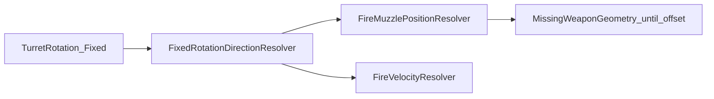

# Task 5.61 — Deterministic Rotation Forward Helper Plan

> **Nur Dokumentation.** Keine Implementierung, keine Tests, keine Änderungen an `src/`, `tests/`, Projekten, Solution oder `game/`.
>
> Sprache: Erklärungen überwiegend auf Deutsch; Typnamen und API-Skizzen wie im Code auf Englisch.

## 1. Purpose

Dieses Dokument definiert die **geplante deterministische Konvention** und Hilfsschicht, die `Fixed`-Rotation (insbesondere `TankState.TurretRotation`) in einen **Einheits-Forward-Vektor** (`FixedVec2`) übersetzt.

Die Forward-Ableitung ist Voraussetzung für:

| Abhängige Schicht | Nutzung |
| ----------------- | ------- |
| [`FireMuzzlePositionResolver`](../src/ScriptTanks.Core/Combat/FireMuzzlePositionResolver.cs) | Turmrichtung → später `MuzzlePosition` (Offset folgt in 5.64+) |
| Geplanter Fire-Velocity-Resolver | `FireVelocity = forward * ProjectileSpeedPerTick` |
| [`ScriptMappedFireRequestConstructionPipeline`](../src/ScriptTanks.Core/Scripting/ScriptMappedFireRequestConstructionPipeline.cs) | Echter `Constructed`-Pfad erst mit Muzzle + Velocity + `AllocateNext()` |

**Kernfrage der zukünftigen Math-Schicht:**

Gegeben `TurretRotation` als `Fixed` — welcher deterministische `FixedVec2` beschreibt die Schussrichtung?

- **Keine** `float`/`double`-Trigonometrie als Simulations-Wahrheit.
- **Keine** Godot-/Render-Transforms.
- **Keine** erfundenen Default-Vektoren, damit `MissingAimDirection` verschwindet.

Diese Schicht ist **getrennt** von Mündungs-Offset-Geometrie, Projektil-IDs, Script-Übersetzung und Fire-Ausführung.

## 2. Current Blocking State (After Task 5.60)

[`FireMuzzlePositionResolver.Resolve`](../src/ScriptTanks.Core/Combat/FireMuzzlePositionResolver.cs) prüft heute Tank-Index, Zerstörung und `WeaponSlot`. Für einen **gültigen lebenden Tank mit gültigem Slot** endet der Pfad bei:

```text
→ FireMuzzlePositionResult.MissingAimDirection()
```

Es gibt **keinen** Forward-Vektor und damit keine Muzzle- oder Velocity-Ableitung aus Rotation.

**Drei dokumentierte Lücken:**

1. **Keine feste Winkel-Einheit** — [`TankState`](../src/ScriptTanks.Core/Tanks/TankState.cs) verweist auf ein „upcoming rotation system“.
2. **Kein `FixedAngle`-Typ** im Math-Kern.
3. **Kein `Fixed` → `FixedVec2`-Helfer** — [`FixedVec2`](../src/ScriptTanks.Core/Math/FixedVec2.cs) bietet keine `Normalize`/`sqrt` und keine Rotation→Richtung.

Die Pipeline-Klassifikation `MissingMuzzleResolver` (5.57) ist durch 5.60 aufgelöst; der **nächste inhaltliche Blocker** für einen echten Fire-Request ist die fehlende Aim-Richtung (`MissingAimDirection`), nicht fehlende Geometrie (`MissingWeaponGeometry` kommt erst danach).

## 3. Existing Type Inventory

| Bereich | Typ / API | Rolle (Kurz) |
| ------- | --------- | ------------ |
| Fixed-Point | [`Fixed`](../src/ScriptTanks.Core/Math/Fixed.cs) (`Scale = 1000`, `Int128`-Arithmetik) | Rotationsscalar; `Fixed.One` = 1,0 Welt-Einheit |
| Vektoren | [`FixedVec2`](../src/ScriptTanks.Core/Math/FixedVec2.cs) | Position, Velocity, Test-Fire-Vektoren; **kein** Forward-Helfer |
| Tank | [`TankState`](../src/ScriptTanks.Core/Tanks/TankState.cs) | `BodyRotation`, `TurretRotation` als `Fixed` |
| Stats | [`BasicTankStats`](../src/ScriptTanks.Core/Tanks/BasicTankStats.cs) | `BodyTurnRatePerTick`, `TurretTurnRatePerTick` — Einheit deferred |
| Spawn | [`TankSpawnFactory`](../src/ScriptTanks.Core/Tanks/TankSpawnFactory.cs) | Standard `bodyRotation`/`turretRotation` = `Fixed.Zero` |
| Bewegung | [`MovementState`](../src/ScriptTanks.Core/Movement/MovementState.cs), [`MovementIntegrator`](../src/ScriptTanks.Core/Movement/MovementIntegrator.cs) | Integriert nur `Position + VelocityPerTick`; **liest Rotation nicht** |
| Muzzle (5.60) | [`FireMuzzlePositionResolver`](../src/ScriptTanks.Core/Combat/FireMuzzlePositionResolver.cs), [`FireMuzzlePositionResult`](../src/ScriptTanks.Core/Combat/FireMuzzlePositionResult.cs), [`FireMuzzlePositionStatus`](../src/ScriptTanks.Core/Combat/FireMuzzlePositionStatus.cs) | Terminal: `MissingAimDirection` (4); `MissingWeaponGeometry` (5) noch nicht erreicht |
| Fire-Ausführung | [`FireResolver`](../src/ScriptTanks.Core/Combat/FireResolver.cs), [`LoadoutFireResolver`](../src/ScriptTanks.Core/Combat/LoadoutFireResolver.cs) | Muzzle/Velocity als **Parameter**; Tests mit literal `FixedVec2.FromInts(1, 0)` |
| Konstruktion | [`ScriptMappedFireRequestConstructionPipeline`](../src/ScriptTanks.Core/Scripting/ScriptMappedFireRequestConstructionPipeline.cs) | Weapon+Fire → heute intern Muzzle-Auflösung mit `MissingAimDirection` |
| Scripting | [`ScriptDomainRequestCategory.Turret`](../src/ScriptTanks.Core/Scripting/ScriptDomainRequestCategory.cs) | Kategorie-Placeholder; **kein** `*Turret*.cs` Execution-System |

**Noch nicht im Repo (geplant ab 5.62):**

- `FixedRotationDirectionStatus`, `FixedRotationDirectionResult`
- `FixedRotationDirectionResolver` (und optional `FixedRotationDirection.Forward`)

## 4. Current Rotation Semantics

### Belegt im Repo

- `BodyRotation` und `TurretRotation` existieren als `Fixed`-Scalars auf [`TankState`](../src/ScriptTanks.Core/Tanks/TankState.cs).
- Spawn setzt beide auf `Fixed.Zero`.
- [`MovementIntegrator`](../src/ScriptTanks.Core/Movement/MovementIntegrator.cs) aktualisiert **nur** Position aus Geschwindigkeit.
- Fire-Tests und Resolver übergeben **literale** Richtungsvektoren (z. B. `(1, 0)` in [`LoadoutFireResolverTests`](../tests/ScriptTanks.Core.Tests/Combat/LoadoutFireResolverTests.cs)) — **nicht** abgeleitet aus `TurretRotation`.
- Turn-Rates in [`BasicTankStats`](../src/ScriptTanks.Core/Tanks/BasicTankStats.cs) haben **keinen Consumer**, der Rotation pro Tick anwendet.

### Nicht belegt (nicht behaupten)

- Grad, Radiant, Turn-Fraction als **bestehende** Repo-Konvention (Option D: leer).
- Uhrzeigersinn vs. gegen Uhrzeigersinn — muss neu dokumentiert werden.
- Ob +Y „oben“ oder „unten“ in der Welt ist — aus Fire-Test-Vektoren **ableitbar** als neue Simulationskonvention (siehe [§6](#6-recommended-convention-and-design-target)).

## 5. Rotation Convention Options

| Option | Beschreibung | Repo-Fit |
| ------ | ------------ | -------- |
| **A — Grad** | 0° = +X, 90° = +Y | Lesbar; braucht Trig oder Lookup; **heute nicht dokumentiert** |
| **B — Turn-Fraction** | Eine volle Umdrehung = `Fixed.One` (0…1) | Passt zu „TurnRatePerTick“-Benennung; **neu zu dokumentieren** — **empfohlen** |
| **C — Nur Cardinals forever** | Nur 0 / 0,25 / 0,5 / 0,75 | **Abgelehnt** als finales Gameplay-Ziel; Cardinals bleiben **Test-Anker** |
| **D — Bestehende Konvention** | — | **Keine gefunden** |

## 6. Recommended Convention and Design Target

Weil Option D leer ist, wird eine **neue, explizite Simulationskonvention** eingeführt. Drei Ebenen trennen:

1. **Design-Ziel** — voller Kreis (360° Turm).
2. **Test-Anker** — Cardinals (Pflicht-Regression).
3. **Erste Code-Slice** — Task 5.63 Pfad A oder B.

### 6a. Design target (not limited to four directions)

- **Gameplay-/Simulationsziel:** volle **360°**-Turmrichtung über **Turn-Fraction** auf [`TankState.TurretRotation`](../src/ScriptTanks.Core/Tanks/TankState.cs).
- Die Konvention darf den Turm **nicht** dauerhaft auf vier Richtungen begrenzen; Zwischenwinkel sind im Zielbild enthalten.
- **Autoritative Fire-Aim-Quelle:** `TurretRotation` allein — **kein** Fallback auf `BodyRotation` (konsistent mit [`DETERMINISTIC_FIRE_MUZZLE_RESOLVER_PLAN.md`](DETERMINISTIC_FIRE_MUZZLE_RESOLVER_PLAN.md) §5).

### 6b. Axes and turn-fraction encoding

| Regel | Wert |
| ----- | ---- |
| +X | Ost / rechts |
| +Y | Nord / oben (konsistent mit `FixedVec2.FromInts(1, 0)` in Fire-Tests) |
| Eine volle Umdrehung | `Fixed.One` (Raw = 1000) |
| Drehrichtung | **Gegen den Uhrzeigersinn** ausgehend von +X |
| `rotation = 0` | Forward `(+1, 0)` |
| `rotation = 0,25` (`Fixed.FromRatio(1, 4)`) | `(0, +1)` |
| `rotation = 0,5` | `(-1, 0)` |
| `rotation = 0,75` (`Fixed.FromRatio(3, 4)`) | `(0, -1)` |

Diese vier Werte sind **Referenz-Anker** für Tests; sie definieren den Kreis, begrenzen aber nicht das End-Gameplay.

### 6c. Deterministic implementation strategy

- **Lookup-Tabelle** mit `N` diskreten Schritten (Vorschlag: **256** oder **1024** — genaue Wahl in Task 5.63, dann in Tests festnageln).
- Indexierung (Skizze, exakte Formel in 5.63 implementieren):
  1. `rotation` deterministisch nach `[0, 1)` normalisieren (Integer-Modulo auf `Fixed.Raw`).
  2. `stepIndex = floor(normalizedTurn * N)` (nur Integer-Math).
  3. `forward = table[stepIndex]` als `FixedVec2`.
- **Kein** `System.Math.Sin` / `Cos` (oder anderes `double`-Trig) als authoritative Sim-Math.
- **Keine** Laufzeit-Float-Normalisierung.

**Table materialization policy (hart):**

- Tabellenwerte **dürfen offline** erzeugt werden (Generator-Skript, einmaliger Build-Schritt, Export).
- **Committed source of truth:** statische `Fixed` / `FixedVec2`-Konstanten im Repository.
- **Runtime-Code darf die Tabelle nicht erzeugen oder befüllen** — keine ctor-Loops mit Trig, kein lazy Init aus `double`. Der Resolver **liest nur** die committed Tabelle.

### 6d. Wrap and negative rotation

- Negative oder ≥1-Turn-Werte werden per deterministischem Modulo auf `[0, 1)` abgebildet (exakte Formel in 5.63; nur `long`/`Int128`, kein `double`).
- Werte, die sich nicht sicher normalisieren lassen → `FixedRotationDirectionStatus.InvalidRotationValue` (falls benötigt).
- Nach Normalisierung: Tabellen-Lookup (Pfad B) oder Cardinal-Match (Pfad A).

### 6e. Task 5.63 — two allowed first-implementation paths

| Pfad | Scope | Empfehlung |
| ---- | ----- | ---------- |
| **A — Conservative slice** | `Resolved` **nur** für exakte Cardinal-Turn-Fractions; sonst `UnsupportedRotationConvention` | Explizit **nicht finales Gameplay**; Fallback bei engem Scope |
| **B — Full 360° slice** | `N`-Schritt-Lookup wie in §6c; beliebige normalisierte Drehung → `Resolved` | **Standardempfehlung** — entspricht Design-Ziel |

**Für 5.63 dokumentiert:** Pfad **B** bevorzugen; Pfad **A** nur als interim mit XML-Remark „not final gameplay behavior“.

**5.62:** Result-Modell zuerst (`FixedRotationDirectionResult`) statt blindem `Forward(Fixed)` — Semantik war bisher undefiniert.

## 7. Proposed API — Result Models (Task 5.62)

```csharp
public enum FixedRotationDirectionStatus
{
    Resolved = 0,
    UnsupportedRotationConvention = 1,
    InvalidRotationValue = 2,
}

public sealed class FixedRotationDirectionResult
{
    public FixedRotationDirectionStatus Status { get; }
    public FixedVec2? Forward { get; }
    // Factories: Resolved(forward), UnsupportedRotationConvention(), InvalidRotationValue()
    // Invariant: Resolved ⇔ non-null Forward; Enum.IsDefined checks
}
```

- Namespace: `ScriptTanks.Core.Math` (neue Dateien).
- Keine Gleichheits-Overrides nötig, wenn Referenzgleichheit der Factories reicht (analog [`FireMuzzlePositionResult`](../src/ScriptTanks.Core/Combat/FireMuzzlePositionResult.cs)).
- **XML-Docs:** keine Links auf `docs/*.md` in C#-Kommentaren (Projektregel aus 5.59).

## 8. Proposed API — Resolver (Task 5.63)

```csharp
public static class FixedRotationDirectionResolver
{
    public static FixedRotationDirectionResult ResolveForward(Fixed rotation);
}
```

Optional später:

```csharp
public static class FixedRotationDirection
{
    public static FixedVec2 Forward(Fixed rotation);
}
```

- **Pfad B:** statisches readonly-Array / verschachtelte Konstanten mit `N` Einträgen; nur Lookup + Normalisierung.
- **Pfad A:** vier explizite Cardinal-Vergleiche (`Raw`-Gleichheit oder `Fixed`-Equality nach `FromRatio`); alles andere → `UnsupportedRotationConvention`.

## 9. Deterministic Math Policy

| Erlaubt | Verboten |
| ------- | -------- |
| `Fixed`, `FixedVec2`, `Int128`-Arithmetik | `float`/`double` als Sim-Wahrheit |
| Committed Lookup-Konstanten | Runtime-Tabellengenerierung |
| Offline-Generator **außerhalb** der Sim-Hot-Path | `System.Math.Sin/Cos` im Resolver |
| Gleiche Eingabe → gleicher Forward | Godot-Transforms, Render-Matrizen |
| Plattform-identische Integer-Pfade | Dictionary ohne feste Reihenfolge (nicht relevant für Lookup) |

**256 vs 1024:** in 5.63 dokumentieren (Präzision vs. Speicher); nach Wahl in Unit-Tests die Schrittgröße und Index-Formel festhalten.

## 10. Required Future Tests (Not in 5.61)

### Phase 1 — mandatory cardinal anchors (Pfad A und B)

| Turn fraction | Expected forward |
| ------------- | ---------------- |
| `Fixed.Zero` | `(+1, 0)` |
| `Fixed.FromRatio(1, 4)` | `(0, +1)` |
| `Fixed.FromRatio(1, 2)` | `(-1, 0)` |
| `Fixed.FromRatio(3, 4)` | `(0, -1)` |

Diese Tests **begrenzen nicht** Gameplay auf vier Richtungen — sie verankern die Konvention.

### Phase 2 — path-dependent (Task 5.63)

**Pfad A:**

- `Fixed.FromRatio(1, 8)` (45°) → `UnsupportedRotationConvention`, **kein** geratenes Diagonal-Vektor.

**Pfad B (zusätzlich empfohlen):**

- 45° (`0,125`), weitere Diagonalen, Wrap (`1,0` turn ≡ `0`), negative Eingabe nach Normalize, wiederholter Aufruf → identischer Forward, stabile Schrittgrenzen.

**Immer:** kein Mutieren von `MatchState`; Resolver bleibt rein lesend.

## 11. Relationship to FireMuzzlePositionResolver

```text
Heute (5.60):
  valid tank + valid WeaponSlot → MissingAimDirection

Nach Forward-Helfer (5.64):
  valid tank + valid slot + forward Resolved → MissingWeaponGeometry
  (Mündungs-Offset fehlt noch)

Später:
  offset + velocity + slot → Constructed MatchFireRequest
```



[`FireMuzzlePositionResolver`](../src/ScriptTanks.Core/Combat/FireMuzzlePositionResolver.cs) ruft in 5.64 **`FixedRotationDirectionResolver.ResolveForward(tank.TurretRotation)`** auf; bei `Resolved` mit Forward → `MissingWeaponGeometry()` statt `MissingAimDirection()`.

## 12. Relationship to FireVelocityResolver

- **Gleiche** Forward-Ableitung: `ResolveForward(TurretRotation)` — keine separate Winkel-Semantik für Velocity.
- Skizze: `fireVelocity = forward * weaponDefinition.ProjectileSpeedPerTick` (skalare `Fixed`-Magnitude pro Tick).
- Details in geplantem Fire-Velocity-Plan (Task 5.65).

## 13. Purity Boundary

Die Forward-Schicht darf **nicht**:

- [`MatchState`](../src/ScriptTanks.Core/Match/MatchState.cs) oder Tank-Listen mutieren
- Rotation pro Tick integrieren oder Turn-Rates anwenden
- Fire ausführen, Projektile spawnen, IDs allozieren
- CombatLog, Replay, Scheduler, Godot anfassen

Sie **darf** nur `Fixed`/`FixedVec2` lesen und immutable Results erzeugen.

## 14. Recommended Follow-up Tasks

Nummerierung nach User-Vorgabe (5.61 = dieses Dokument). Ältere Pläne ([`DETERMINISTIC_FIRE_MUZZLE_RESOLVER_PLAN.md`](DETERMINISTIC_FIRE_MUZZLE_RESOLVER_PLAN.md) §15, [`SCRIPT_MAPPED_FIRE_REQUEST_CONSTRUCTION_PLAN.md`](SCRIPT_MAPPED_FIRE_REQUEST_CONSTRUCTION_PLAN.md)) listen noch **veraltete** Task-Nummern — **nicht** in 5.61 geändert; hier gilt die neue Reihenfolge:


| Task | Inhalt |
| ---- | ------ |
| **5.62** | `FixedRotationDirectionStatus` + `FixedRotationDirectionResult` |
| **5.63** | `FixedRotationDirectionResolver` — **Pfad B empfohlen** (N-Schritt-Lookup, 256/1024); Pfad A als dokumentierter Interim-Fallback; Cardinal-Tests Pflicht |
| **5.64** | `FireMuzzlePositionResolver` nutzt Forward-Helfer → `MissingWeaponGeometry` auf gültigem Fire-Pfad |
| **5.65** | Fire-Velocity-Resolver — **Plan** (Dokumentation) |
| **5.66** | Fire-Velocity-Result-Modelle |
| **5.67** | Fire-Velocity-Resolver — erste Implementierung |
| **5.68** | `ScriptMappedFireRequestConstructionPipeline` — echter `Constructed`-Pfad |

### Open decisions (bei Implementierung)

| Entscheidung | Empfehlung |
| ------------ | ---------- |
| Result-Modell vs. direktes `Forward(Fixed)` | Result-Modell zuerst (5.62) |
| 5.63 Pfad A vs. B | **Pfad B** |
| Tabellengröße 256 vs. 1024 | In 5.63 wählen und testen |

## 15. Out of Scope and Definition of Done

**Nicht in Task 5.61:**

- `src/`, `tests/`, `game/`-Änderungen
- Implementierung von `FixedRotationDirectionResolver` oder Muzzle-Offset
- Turm-Execution-System, Rotation-Integration pro Tick
- Offline-Generator-Skript im Repo (optional später; nicht Voraussetzung für 5.61)
- Bearbeitung anderer Plan-Dateien

**Definition of Done (Task 5.61):**

- [`docs/DETERMINISTIC_ROTATION_FORWARD_HELPER_PLAN.md`](DETERMINISTIC_ROTATION_FORWARD_HELPER_PLAN.md) existiert mit Abschnitten 1–15.
- Design-Ziel 360° Turn-Fraction, Cardinal-Test-Anker, Lookup-Policy (offline OK, runtime read-only), 5.63-Pfade A/B mit Empfehlung B sind dokumentiert.
- `dotnet build ScriptTanks.sln -warnaserror` und `dotnet test ScriptTanks.sln` bleiben grün (nur Markdown).
