# First Pure Script Intent Integration Composer Plan

## 1. Purpose

Dieses Dokument legt fest, wie der **erste reine Integrations-Composer** Scripts gegen einen Match-/Sensor-Snapshot auswerten und **übersetzte Kommandointents / Requests** zurückgeben soll — **ohne** Ausführung im Spiel.

Explizit:

- **Nur Dokumentation**, **keine Implementierung** in diesem Task.
- **Keine** MatchState-Mutation, **keine** Kommando-Ausführung, **kein** Request-Dispatch.
- **Kein** Scheduler, **keine** Godot-Integration.

## 2. Current Building Blocks

### Kontext- und Pairing-Pläne

- `[SCRIPT_RUNTIME_CONTEXT_BUILDER_PLAN.md](C:/ScriptTranks/docs/SCRIPT_RUNTIME_CONTEXT_BUILDER_PLAN.md)`
- `[MATCH_SCRIPT_RUNTIME_STATE_PAIRING_PLAN.md](C:/ScriptTranks/docs/MATCH_SCRIPT_RUNTIME_STATE_PAIRING_PLAN.md)`

### Bestehende reine Evaluation-Typen

- `ScriptEvaluationContext`
- `ScriptRuntimeEvaluationRequest`
- `MatchScriptRuntimeState`
- `ScriptRuntimeEvaluationPipeline`
- `ScriptRuntimeEvaluationBatchPipeline`
- `MatchScriptRuntimeEvaluationPipeline`

### Bestehende v2-Übersetzungstypen

- `ScriptTranslatedCommandRequestKind`
- `ScriptTranslatedCommandRequest`
- `ScriptCommandTranslationOutput`
- `ScriptCommandTranslatorV2`

### Recording / Debug (optional für erste Composer-Ausgabe)

- `ScriptRuntimeEvaluationRecord`
- `ScriptRuntimeEvaluationTrace`
- `MatchScriptRuntimeEvaluationFrame`
- `MatchScriptRuntimeEvaluationRecording`

## 3. Target Composer Responsibility

Der Composer ist **reine Orchestrierung**:

Für **jeden Tank** (in fester Reihenfolge):

1. `ScriptEvaluationContext` aufbauen (über zukünftigen Context Builder).
2. Tank mit `ScriptProgram` paaren (über Pairing-Regeln / Builder).
3. Script auswerten (Decision-Pipeline / bestehende Evaluationspfade).
4. Gewähltes Kommando mit `ScriptCommandTranslatorV2` übersetzen.

**Ergebnis:** Alle `ScriptCommandTranslationOutput`-Werte in **deterministischer** Reihenfolge zurückgeben.

Der Composer:

- **führt** übersetzte Requests **nicht** aus,
- **mutiert** `MatchState` **nicht**,
- **ruft** Waffen-, Sensor- oder Movement-Systeme **nicht** auf,
- **plant** keine späteren Jobs,
- **schreibt** nicht selbst Logs oder Diagnostics.

## 4. Proposed Input and Output

**Mögliche Eingabe-Signatur** (nur Konzept — **nicht** implementieren):

```csharp
public static MatchScriptRuntimeIntentIntegrationResult EvaluateIntents(
    MatchSensorRuntimeState sensorRuntime,
    IReadOnlyList<ScriptProgram> programs);
```

`MatchSensorRuntimeState` ist bevorzugt, weil es bereits `**MatchState**` und `**MatchSensorLoadoutState**` konsistent paart (gleiche Tank-Anzahl).

**Mögliches Ergebnismodell** (ebenfalls nur Konzept):

```text
MatchScriptRuntimeIntentIntegrationResult
├─ EvaluationTrace        (z. B. ScriptRuntimeEvaluationTrace)
└─ TranslationOutputs     (IReadOnlyList<ScriptCommandTranslationOutput>)
```

- Die Reihenfolge von `TranslationOutputs` **entspricht** der Tank-/Request-Reihenfolge (ein Eintrag pro Tank mit Intent-Pfad).
- **Kein** automatisches Dispatching aus der Rückgabe.

## 5. End-to-End Flow

```text
MatchSensorRuntimeState
+ IReadOnlyList<ScriptProgram>
  → ScriptRuntimeContextBuilder.Build pro TankIndex
  → ScriptRuntimeEvaluationRequest pro Tank
  → MatchScriptRuntimeState
  → MatchScriptRuntimeEvaluationPipeline.Evaluate(tick, runtime)
  → ScriptRuntimeEvaluationTrace
  → pro Tank/Record: Decision → Intent → ScriptCommandTranslatorV2.Translate
  → TranslationOutputs
  → IntegrationResult (Trace + Outputs)
```

Die Übersetzungsschicht sitzt **logisch nach** der Evaluation, nutzt aber die **pro Tank** ermittelten Decisions/Intents (nicht nur den Roh-Trace ohne Intent).

```mermaid
flowchart LR
    SensorRuntime[MatchSensorRuntimeState]
    Programs[IReadOnlyList_ScriptProgram]
    ContextBuilder[Future ScriptRuntimeContextBuilder]
    RequestBuilder[Future MatchScriptRuntimeStateBuilder]
    Runtime[MatchScriptRuntimeState]
    Evaluation[MatchScriptRuntimeEvaluationPipeline]
    Trace[ScriptRuntimeEvaluationTrace]
    Translator[ScriptCommandTranslatorV2]
    Outputs[ScriptCommandTranslationOutput list]
    Result[Future Integration Result]

    SensorRuntime --> ContextBuilder
    Programs --> RequestBuilder
    ContextBuilder --> RequestBuilder
    RequestBuilder --> Runtime
    Runtime --> Evaluation
    Evaluation --> Trace
    Trace --> Translator
    Translator --> Outputs
    Trace --> Result
    Outputs --> Result
```




## 6. Context Building Step

- Kontext **pro Tank** zum **aktuellen** `SimTick` und dem **aktuellen** Sensor-/Match-Snapshot.
- Zerstörte Tanks: **sicherer** Kontext (siehe Kontext-Plan).
- Ungültiger Tank-Index oder fehlende strukturelle Daten → **werfen** (kein stiller Fallback).
- **Kein** Sensor-Scan, **keine** Cooldown-Mutation an Waffen hier.

Details und Fallbacks: `[SCRIPT_RUNTIME_CONTEXT_BUILDER_PLAN.md](C:/ScriptTranks/docs/SCRIPT_RUNTIME_CONTEXT_BUILDER_PLAN.md)`.

## 7. Runtime State Pairing Step

- MVP: `programs.Count == sensorRuntime.State.Tanks.Count`.
- Request-Reihenfolge = `MatchState.Tanks`-Reihenfolge; `TankIndex == Listenposition`.
- **Keine** Sortierung, **kein** TankId-Pairing im MVP.
- Count-Mismatch → **werfen**.

Details: `[MATCH_SCRIPT_RUNTIME_STATE_PAIRING_PLAN.md](C:/ScriptTranks/docs/MATCH_SCRIPT_RUNTIME_STATE_PAIRING_PLAN.md)`.

## 8. Evaluation and Translation Step

Die **status-only** Kette `ScriptCommandTranslator` allein liefert **keine** `ScriptTranslatedCommandRequest`-Nutzlast — für Intent-Integration ist die **v2**-Kette nötig.

Geplanter Pfad pro ausgewerteter Entscheidung:

```text
ScriptRuntimeDecisionPipeline.Evaluate(program, context)
  → ScriptCommandIntent.FromDecision(...)
  → ScriptCommandTranslatorV2.Translate(...)
  → ScriptCommandTranslationOutput
```

Regeln:

- Keine Routine / kein Intent → `NoIntent` + `ScriptTranslatedCommandRequest.None()` im Output-Wrapper.
- Erfolgreich übersetzt → konkreter Request mit `HasRequest == true`.
- `UnsupportedCommand` / andere Fehlerstatus laut v2 → typischerweise `Request.None()` mit passendem `ScriptCommandTranslationResult`.

Optional später: **parallele** `ScriptRuntimeV2EvaluationRecord`-Struktur für Debug — nicht Voraussetzung für Schritt eins.

## 9. Output Shape Options

### Option A — Trace und TranslationOutputs getrennt

```text
MatchScriptRuntimeIntentIntegrationResult
├─ EvaluationTrace
└─ TranslationOutputs
```

**Pros:** nutzt bestehende `ScriptRuntimeEvaluationTrace`, einfach.

**Cons:** Zuordnung Trace-Eintrag ↔ Output nur **positional**.

### Option B — Pro-Tank-V2-Record

```text
ScriptRuntimeV2EvaluationRecord
├─ TankIndex
├─ Program
├─ Context
├─ DecisionResult
└─ TranslationOutput
```

**Pros:** starke Gruppierung, bessere Lesbarkeit für Tools.

**Cons:** zusätzliche Modelle.

**Empfehlung:** Mit **Option A** starten; Option B nur nach konkretem Debug-/Tooling-Bedarf.

## 10. Deterministic Ordering Rules

- Reihenfolge der Auswertung = `**MatchState.Tanks`** Collection-Index (0 … n-1).
- `TranslationOutputs` in **derselben** Reihenfolge.
- **Keine** `Dictionary`-Enumeration für die Hauptschleife.
- **Keine** Sortierung nach `TankId` oder `PlayerSlot`.
- **Keine** Randomisierung; **keine** parallele Evaluation im MVP.
- „Gleichzeitige“ Outputs sind durch die feste Tank-Reihenfolge serialisiert; Konfliktlösung bei Ausführung ist **nicht** Teil dieses Composers.

## 11. Validation Rules

Der Composer soll (zukünftig) prüfen:

- `sensorRuntime` / `programs` nicht null.
- Kein null-Element in `programs` (wenn als Liste durchiteriert wird).
- Programmzahl gleich Tankzahl (MVP).
- Konsistenz Tank-/Sensor-Loadout-Counts ist durch `MatchSensorRuntimeState` bereits abgesichert — Composer verlässt sich darauf oder prüft defensiv.

**Noch nicht** prüfen im ersten Composer:

- Hardware-Verfügbarkeit für übersetzte Kommandos,
- Pathing-Tauglichkeit,
- Zielverfügbarkeit über den bereits gebauten Kontext hinaus.

## 12. Failure and Missing Data Policy


| Situation                           | Behandlung                                                                                             |
| ----------------------------------- | ------------------------------------------------------------------------------------------------------ |
| Kein Script / keine Routine gewählt | `NoIntent`, Request `None()`                                                                           |
| Ungültiges Condition-Argument       | Bestehende Evaluator-Exception **propagieren**, **nicht** in Translation-Status übersetzen             |
| Unsupported command (v2)            | `UnsupportedCommand` + `Request.None()`                                                                |
| Missing hardware                    | Hier **nicht** entscheiden (ohne Hardware-Kontext); spätere Schicht kann `MissingHardware` setzen      |
| Zerstörter Tank                     | Context Builder liefert sicheren Kontext; Entscheidung kann `NoIntent` sein; Ausführung später filtert |


## 13. Purity and Mutation Boundaries

Strikt:

- Keine Mutation von `MatchState`, keine Projektile, keine Cooldown-/Sensor-State-Mutation, keine Anwendung von Bewegungsintents.
- Kein Logging/Diagnostics/Replay/Godot vom Composer selbst.
- Keine Wall-Clock-Zeit, kein Zufall; **kein IEEE-Floating-Point** in der Composer-Logik (Kontext nutzt weiterhin `Fixed` wo definiert).

## 14. Test Strategy

Geplante Tests nach Implementierung:

**Validierung:** Null-Inputs, Count-Mismatch, null Programm-Einträge.

**Reihenfolge:** Outputs parallel zu Tank-Reihenfolge; Indizes 0..n-1; keine Id-Sortierung.

**Kontext:** HP, zerstörter Tank, Sensor/Waffe bereit, kein sichtbarer Gegner — gemäß Builder-Plan.

**Übersetzung:** Alle v2-Kommandotypen / Payloads; `NoIntent`; `Unsupported` wo erreichbar.

**Reinheit:** Keine Mutation von Match-, Sensor-Runtime oder Programmlisten; deterministische Wiederholbarkeit.

## 15. Out of Scope

- Keine Implementierung in Task 5.46.
- Keine neuen Modelle/C#-Dateien in diesem Task.
- Kein `ScriptRuntimeContextBuilder`, kein `MatchScriptRuntimeStateBuilder`, kein Composer-Code.
- Keine Ausführung übersetzter Requests, kein Fire/Scan/Move-Dispatch.
- Kein Scheduler, kein CPU-Budget, keine Replay-/Logging-/Godot-Anbindung.

## 16. Recommended Next Tasks

1. **Task 5.47 — ScriptRuntimeContextBuilder First Implementation** — reiner Builder `MatchSensorRuntimeState` + `tankIndex` → `ScriptEvaluationContext`.
2. **Task 5.48 — MatchScriptRuntimeStateBuilder** — `MatchScriptRuntimeState` aus Sensor-Runtime + Programmliste.
3. **Task 5.49 — MatchScriptRuntimeIntentIntegrationResult Model** — reines Ergebnismodell mit Evaluation-Trace + Translation-Outputs.
4. **Task 5.50 — First Pure Script Intent Integration Composer** — Orchestrierung Builder + Evaluation + `ScriptCommandTranslatorV2` ohne Ausführung.

---

*Plan-Dokument Task 5.46. Keine ausführbare Implementierung; Typnamen und Flüsse beziehen sich auf die bestehende Codebasis und die genannten Plan-Dokumente.*