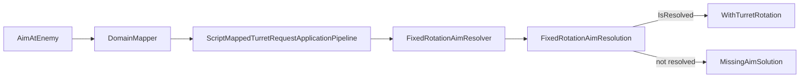

# Task 5.133 — FixedRotationAimResolution / API Compatibility Audit

> **Nur Dokumentation.** Keine Implementierung, keine Tests, keine Änderungen an `src/`, `tests/`, Projekten, Solution oder `game/`.
>
> Sprache: Erklärungen überwiegend auf Deutsch; Typnamen und API-Namen wie im Code auf Englisch.

## 1. Purpose

Task **5.132** ([FULL_ANGLE_TURRET_AIM_RESOLVER_PLAN.md](FULL_ANGLE_TURRET_AIM_RESOLVER_PLAN.md)) hat die Full-Angle-Aim-Architektur geplant: inverse Lookup-Richtung, Snap-Semantik, Tie-break, Fire-Kompatibilität. **Vor** Lookup-Kern (5.134) und Resolver-Verhalten (5.135) muss feststehen, ob der MVP die **bestehende** öffentliche Result-API behält oder neue Typen einführt.

**Ziel von 5.133:** Audit und **bindende API-Entscheidung** für 5.134–5.136 — ohne Runtime-Änderung.

| Entscheidung | Kurz |
| ------------ | ---- |
| **Option A** | `FixedRotationAimResolution` + `FixedRotationAimResolver.ResolveFromDirection` beibehalten; Resolver-Verhalten später full-angle-fähig |
| **Option B** | Neuer `FullAngleTurretAimResult` / Status-Enum — **nicht** für MVP |

**Test-Baseline (nach 5.132):** **3061** Tests, **0** Warnungen.

### Querverweise

- [FULL_ANGLE_TURRET_AIM_RESOLVER_PLAN.md](FULL_ANGLE_TURRET_AIM_RESOLVER_PLAN.md) — Architektur, Lookup, Follow-ups 5.134–5.139
- [WALL_OBSTACLE_COLLISION_INTEGRATION_CHECKPOINT.md](WALL_OBSTACLE_COLLISION_INTEGRATION_CHECKPOINT.md) — Combined-Tick-Kontext; 5.132 als nächster Track

**Hinweis Task-ID:** Im Full-Angle-Plan §15 stand **5.133** ursprünglich als „Result-Modelle“. **Dieses Audit** definiert 5.133 als API-Compatibility-Audit; Implementierung bleibt **5.134–5.139**.

## 2. Current State After 5.132

| Thema | Stand |
| ----- | ----- |
| Forward | [`FixedRotationDirectionResolver`](../src/ScriptTanks.Core/Math/FixedRotationDirectionResolver.cs) + 1000-Schritt-Lookup — **full-angle** |
| Inverse Aim | [`FixedRotationAimResolver`](../src/ScriptTanks.Core/Math/FixedRotationAimResolver.cs) — **nur Kardinal** |
| `TurretRotation` | `Fixed` Turn-Fraction auf [`TankState`](../src/ScriptTanks.Core/Tanks/TankState.cs) — **kein** `FixedRotation`-Typ |
| Result-API | [`FixedRotationAimResolution`](../src/ScriptTanks.Core/Math/FixedRotationAimResolution.cs) — `IsResolved` + `Rotation` |
| Script-Apply | [`ScriptMappedTurretRequestApplicationPipeline`](../src/ScriptTanks.Core/Scripting/ScriptMappedTurretRequestApplicationPipeline.cs) ruft Resolver auf |
| Fire/Muzzle | Lesen **bereits angewendete** `TurretRotation` über Forward-Resolver — kein Aim-Resolver-Aufruf |
| 5.133 | **Audit only** — keine Produktionsdateien |

## 3. Current API Inventory

*Nur reale Typen aus dem Repo.*

| API | Current role | Notes |
| --- | ------------ | ----- |
| [`FixedRotationAimResolution`](../src/ScriptTanks.Core/Math/FixedRotationAimResolution.cs) | Aim result | `IsResolved`, `Rotation`; `Resolved()` / `Unresolved()` |
| [`FixedRotationAimResolver`](../src/ScriptTanks.Core/Math/FixedRotationAimResolver.cs) | Direction → rotation | Cardinal-only; diagonal → `Unresolved` |
| [`FixedRotationDirectionResolver`](../src/ScriptTanks.Core/Math/FixedRotationDirectionResolver.cs) | Rotation → forward | Full-angle via lookup |
| [`FixedRotationDirectionLookup`](../src/ScriptTanks.Core/Math/FixedRotationDirectionLookup.cs) | 1000-step table | `StepCount = 1000`; offline forwards |
| [`ScriptMappedTurretRequestApplicationPipeline`](../src/ScriptTanks.Core/Scripting/ScriptMappedTurretRequestApplicationPipeline.cs) | Applies `AimAtEnemy` | `Unresolved` → `MissingAimSolution` |
| [`ScriptMappedTurretRequestApplicationStatus`](../src/ScriptTanks.Core/Scripting/ScriptMappedTurretRequestApplicationStatus.cs) | Apply status | `Applied`, `NoTarget`, `MissingAimSolution`, … |
| [`CombinedScriptRuntimeComposer`](../src/ScriptTanks.Core/Scripting/CombinedScriptRuntimeComposer.cs) | Composer order | Turret **before** fire construct/apply |
| [`FireMuzzlePositionResolver`](../src/ScriptTanks.Core/Combat/FireMuzzlePositionResolver.cs) | Consumes `TurretRotation` | **No** API blocker for full-angle |
| [`FireVelocityResolver`](../src/ScriptTanks.Core/Combat/FireVelocityResolver.cs) | Consumes `TurretRotation` | **No** API blocker for full-angle |

## 4. Current Call-Site Map

### Production: ein einziger Aim-Resolver-Aufruf

Grep über `src/` findet **nur** [`ScriptMappedTurretRequestApplicationPipeline`](../src/ScriptTanks.Core/Scripting/ScriptMappedTurretRequestApplicationPipeline.cs):

```text
ScriptCommandType.AimAtEnemy
  → MatchScriptIntentIntegrationComposer / ScriptTranslatedCommandDomainMapper
       (Turret-Kategorie, ScriptTranslatedCommandRequestKind.AimAtEnemy)
  → ScriptMappedTurretRequestApplicationPipeline.Apply
       TrySelectNearestAliveEnemy (Tank-Positionen, nicht SensorScanResult)
       delta = target.Movement.Position - source.Movement.Position
       resolution = FixedRotationAimResolver.ResolveFromDirection(delta)
       if resolution.IsResolved
            tank.WithTurretRotation(resolution.Rotation)  → Applied
       else
            MissingAimSolution
```



### Fire-Pfad (separat)

```text
TankState.TurretRotation
  → FixedRotationDirectionResolver.ResolveForward
  → FireMuzzlePositionResolver / FireVelocityResolver
```

**Fire ruft `FixedRotationAimResolver` nicht auf.** Full-Angle-Aim ändert Fire-**Signaturen** nicht — nur den Wert von `TurretRotation`, den Scripts vorher setzen.

### Composer-Kontext

[`CombinedScriptRuntimeComposer`](../src/ScriptTanks.Core/Scripting/CombinedScriptRuntimeComposer.cs): Sensor + Turret auf `runtime₀`; Fire auf `turretApplicationResult.FinalRuntime`. Aim-Ergebnis ist beim Fire-Construct bereits im State.

## 5. Current Test Expectations

*Tests werden in 5.133 **nicht** geändert. Diese Tabelle listet Erwartungen, die **spätere Tasks** anpassen müssen.*

### [`FixedRotationAimResolverTests`](../tests/ScriptTanks.Core.Tests/Math/FixedRotationAimResolverTests.cs)

| Test | Heute | Später (5.135) |
| ---- | ----- | -------------- |
| `ResolveFromDirection_PositiveX_ReturnsZeroRotation` | `IsResolved`, `Fixed.Zero` | **Unverändert** |
| `ResolveFromDirection_PositiveY_ReturnsQuarterRotation` | `1/4` | **Unverändert** |
| `ResolveFromDirection_NegativeX_ReturnsHalfRotation` | `1/2` | **Unverändert** |
| `ResolveFromDirection_NegativeY_ReturnsThreeQuarterRotation` | `3/4` | **Unverändert** |
| `ResolveFromDirection_ZeroVector_ReturnsUnresolved` | `false` | **Unverändert** |
| `ResolveFromDirection_DiagonalVector_ReturnsUnresolved` | `false` | → **`IsResolved`** + erwartete Lookup-Rotation |

### [`ScriptMappedTurretRequestApplicationPipelineTests`](../tests/ScriptTanks.Core.Tests/Scripting/ScriptMappedTurretRequestApplicationPipelineTests.cs)

| Test | Heute | Später |
| ---- | ----- | ------ |
| `Apply_AimAtEnemy_East/North/West/SouthTarget_*` | `Applied`, exakte Rotation | **Unverändert** |
| `Apply_AimAtEnemy_NoAliveEnemy_ReturnsNoTarget` | `NoTarget` | **Unverändert** (Pipeline, nicht Resolver) |
| `Apply_AimAtEnemy_DiagonalEnemy_ReturnsMissingAimSolution` | `MissingAimSolution` | → **`Applied`** (5.136/5.137) |
| Nearest-enemy / tie-break / destroyed | diverse | **Unverändert** |

### [`CombinedScriptRuntimeComposerTests`](../tests/ScriptTanks.Core.Tests/Scripting/CombinedScriptRuntimeComposerTests.cs)

| Test | Heute | Später |
| ---- | ----- | ------ |
| `Run_AimAtEnemy_AppliesTurretRotation` | `Applied`, Kardinal | **Unverändert** |
| `Run_AimAtEnemy_DiagonalEnemy_ReturnsMissingAimSolution` | `MissingAimSolution`, Rotation unverändert | → **`Applied`**, neue `TurretRotation` (5.137) |

### Weitere `AimAtEnemy`-Tests

[`CombinedRuntimeTickPipelineTests`](../tests/ScriptTanks.Core.Tests/Scripting/CombinedRuntimeTickPipelineTests.cs) — Kardinal-Setups (`Step_AimAtEnemy_*`): voraussichtlich **wenig Änderung**, sofern Fixtures nicht diagonal werden.

## 6. Compatibility Requirements

Bindende Anforderungen für 5.134–5.138:

| # | Requirement |
| - | ------------- |
| 1 | Kardinal-Anker **exakt**: +X → `Fixed.Zero`; +Y → `Fixed.FromRatio(1, 4)`; −X → `1/2`; −Y → `3/4` |
| 2 | `delta == FixedVec2.Zero` bleibt **`Unresolved`** |
| 3 | **`NoTarget`** bleibt in [`ScriptMappedTurretRequestApplicationPipeline`](../src/ScriptTanks.Core/Scripting/ScriptMappedTurretRequestApplicationPipeline.cs), **nicht** im Math-Resolver |
| 4 | Fire/Muzzle/Velocity-**APIs** unverändert |
| 5 | `TankState.TurretRotation` bleibt **`Fixed`** |
| 6 | [`CombinedRuntimeTickPipeline`](../src/ScriptTanks.Core/Scripting/CombinedRuntimeTickPipeline.cs)-Reihenfolge unverändert |
| 7 | **Kein** `float`/`double`/Runtime-Trig im Kernpfad |
| 8 | `FixedRotationAimResolution.Unresolved` = „keine gültige Richtung“ (inkl. MVP: Ziel = Quelle) |
| 9 | **Minimale** Call-Site-Änderungen — idealerweise **null** in der Turret-Pipeline |
| 10 | Index→`Fixed`-Skalierung und Tie-break per [FULL_ANGLE_TURRET_AIM_RESOLVER_PLAN.md](FULL_ANGLE_TURRET_AIM_RESOLVER_PLAN.md) §8 — Audit in **5.134** |

## 7. Option A — Extend Existing FixedRotationAimResolution

### Beschreibung

- **`FixedRotationAimResolution`** Struct und öffentliche Member **unverändert**.
- **`FixedRotationAimResolver.ResolveFromDirection`** erhält später:
  - Kardinal-Fast-Path (exakt wie heute)
  - `Zero` → `Unresolved`
  - Sonst: inverse Lookup → `Resolved(rotation)`

### Verhalten (geplant)

| `delta` | Heute | Nach 5.135+ |
| ------- | ----- | ------------- |
| Kardinal | `Resolved` (exakt) | `Resolved` (exakt) |
| Diagonal / allgemein | `Unresolved` | `Resolved` (nächster Lookup-Schritt) |
| Zero | `Unresolved` | `Unresolved` |

### Pros

| Vorteil | Detail |
| ------- | ------ |
| Kleinste API-Änderung | Keine neuen öffentlichen Typen |
| Call-Sites | Eine Pipeline-Zeile bleibt semantisch identisch |
| `MissingAimSolution` | Mapping `!IsResolved` bleibt |
| Kein Status-Enum | Weniger Boilerplate in 5.133–5.136 |
| Script-Integration | Signatur von `Apply` unverändert |
| Fire/Muzzle | Unverändert |

### Cons

| Nachteil | Detail |
| -------- | ------ |
| Weniger explizit | `TargetAtSource` nicht als eigener Status (MVP: `Unresolved`) |
| Diagnostics | Weniger Telemetrie als separates Result |
| Turn-Rate später | Partielles Drehen evtl. neuer Typ oder Pipeline-Record |

## 8. Option B — Introduce FullAngleTurretAimResult

### Skizze (nicht implementieren)

```csharp
public enum FullAngleTurretAimStatus
{
    Resolved = 0,
    TargetAtSource = 1,
}

public sealed class FullAngleTurretAimResult
{
    public FullAngleTurretAimStatus Status { get; }
    public Fixed? Rotation { get; }
    public FixedVec2 Delta { get; }
}
```

Pipeline müsste `FullAngleTurretAimResult` → `ScriptMappedTurretRequestApplicationStatus` mappen.

### Pros

| Vorteil | Detail |
| ------- | ------ |
| Explizite Semantik | `TargetAtSource` vs `Unresolved` trennbar |
| Erweiterbar | Turn-Rate, LOS, Arc-Limits |
| Diagnostics | Klarere Logs/Replay-Metadaten später |

### Cons

| Nachteil | Detail |
| -------- | ------ |
| Mehr Dateien | Resolver + Result + Tests |
| Duplikation | Parallele zu `FixedRotationAimResolution` |
| Adapter-Schicht | Turret-Pipeline braucht Mapping |
| **Nicht nötig** für erstes Full-Angle-MVP | Overhead ohne Mehrwert für Diagonal-Fix |

## 9. Recommended MVP API Decision

### Entscheidung (bindend)

**MVP: Option A** — [`FixedRotationAimResolver`](../src/ScriptTanks.Core/Math/FixedRotationAimResolver.cs)-Verhalten erweitern; [`FixedRotationAimResolution`](../src/ScriptTanks.Core/Math/FixedRotationAimResolution.cs)-API **unverändert**.

**Nicht** `FullAngleTurretAimResult` in 5.134–5.136 einführen, es sei denn, der **5.134-Implementierungs-Audit** zeigt, dass `FixedRotationAimResolution` erforderliche Semantik nicht tragen kann.

### Warum Option A richtig ist

Die **API-Lücke ist nicht das Problem**. Das bestehende Modell drückt bereits alles aus, was der MVP braucht:

| Outcome | Representation |
| ------- | -------------- |
| Gültiges Zielen | `IsResolved` + `Rotation` (`Fixed`) |
| Ungültige Richtung | `Unresolved` |

Full-Angle Aim ändert zunächst **nur Verhalten**, nicht die Result-Form:

```text
Diagonal delta:
  vorher  → Unresolved
  nachher → Resolved(Fixed rotation)
```

Dafür ist **kein** neuer `FullAngleTurretAimResult` nötig. Option B lohnt sich erst bei **zusätzlichen Status**, z. B.:

- `TargetAtSource` (explizit, statt MVP-`Unresolved`)
- `TurnLimitedPartial`
- `OutOfTurnArc`
- `BlockedByLOS`

Für **5.134–5.136** ist Option A deutlich sauberer: ein Production-Call-Site, unveränderte `if (!resolution.IsResolved)`-Verzweigung, Fire/Muzzle unverändert.

### MVP-Mapping Sonderfälle

| Fall | Layer | MVP |
| ---- | ----- | --- |
| Kein Feind | Pipeline | `NoTarget` |
| `delta == Zero` | Resolver | `Unresolved` → `MissingAimSolution` |
| Diagonal | Resolver | `Resolved` (nach 5.135) |

### Optionale spätere Doc/Code-Hygiene (5.135, nicht 5.133)

XML-Kommentar von `FixedRotationAimResolution` („cardinal MVP“) → „direction → turn-fraction“ aktualisieren.

## 10. Follow-up Implementation Impact

| Task | Impact |
| ---- | ------ |
| **5.133** | **Dieses Audit** — keine Implementierung |
| **5.134** | Inverse-Lookup-Kern; liefert `Fixed` oder `FixedRotationAimResolution`; **Index→`Fixed`-Skalierung** und **Tie-break** auditieren |
| **5.135** | `FixedRotationAimResolver.ResolveFromDirection` — Kardinal/Zero-Fast-Path, dann Lookup; **Kardinal-Tests exakt** |
| **5.136** | [`ScriptMappedTurretRequestApplicationPipeline`](../src/ScriptTanks.Core/Scripting/ScriptMappedTurretRequestApplicationPipeline.cs) — **keine Signaturänderung** erwartet; Diagonal → `Applied` statt `MissingAimSolution` |
| **5.137** | Composer/Turret-Tests: `Run_AimAtEnemy_DiagonalEnemy_*`, Pipeline-Diagonal-Tests |
| **5.138** | Fire/Muzzle/Velocity Full-Angle-Regressionen |
| **5.139** | `FULL_ANGLE_TURRET_AIM_INTEGRATION_CHECKPOINT.md` |

**5.133 implementiert nichts** aus dieser Tabelle.

## 11. Risks / Non-Scope

### Risks

| Risk | Mitigation |
| ---- | ---------- |
| Kardinal-Anker versehentlich verschoben | Fast-Path + bestehende Tests in 5.135 |
| Zero-Vector wird `Resolved` | Expliziter Zero-Check vor Lookup |
| Duplikat-Result-Typ ohne Nutzen | Option A-Entscheidung |
| `NoTarget` in Resolver | Nur Pipeline |
| Turn-Rate zu früh | Eigener Track nach MVP |
| `float`/`double` in Inverse | Lookup + Integer-Dot; Audit 5.134 |
| Fire-API-Änderung „aus Bequemlichkeit“ | Verboten — nur `TurretRotation`-Wert |

### Non-scope (5.133)

- Production-Code, Tests, Lookup-, Resolver-, Pipeline-Implementierung
- Fire/Muzzle-Regression
- Änderungen an anderen Docs außer dieser neuen Audit-Datei
- Godot/UI, `CombinedRuntimeTickPipeline`-Reihenfolge
- `FullAngleTurretAimResult`-Dateien

## 12. Verification / Definition of Done

### Nach dem Schreiben dieses Dokuments (docs-only), vom **Repository-Root**:

```powershell
dotnet build ScriptTanks.sln -warnaserror
dotnet test ScriptTanks.sln
```

**Erwartung:** 0 Warnungen; **3061** Tests bestanden.

### Definition of Done

- [x] [`docs/FULL_ANGLE_AIM_API_COMPATIBILITY_AUDIT.md`](FULL_ANGLE_AIM_API_COMPATIBILITY_AUDIT.md) existiert mit Abschnitten **1–12**.
- [x] API-Inventar und Call-Site-Map sind repo-genau (ein Production-Call-Site).
- [x] Test-Erwartungen für spätere Tasks dokumentiert (§5).
- [x] Option A und B verglichen; **MVP = Option A** mit Begründung (§9).
- [x] Follow-up-Impact 5.134–5.139 (§10).
- [x] Keine Änderungen an `src/`, `tests/`, `game/`, Projekten, anderen Plan-/Checkpoint-Dateien.
- [x] Deliverable-Links: sibling / `../src/` / `../tests/` — keine absoluten Host-Pfade.
- [x] `dotnet build ScriptTanks.sln -warnaserror` grün (nach Verifikationslauf).
- [x] `dotnet test ScriptTanks.sln` bleibt bei **3061** Tests (nach Verifikationslauf).
