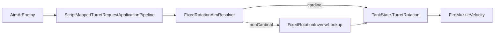

# Task 5.139 — Full-Angle Turret Aim Integration Checkpoint

> **Nur Dokumentation.** Keine Implementierung, keine Tests, keine Änderungen an `src/`, `tests/`, Projekten, Solution oder `game/`.
>
> Sprache: Erklärungen überwiegend auf Deutsch; Typnamen und API-Namen wie im Code auf Englisch.

## 1. Purpose

Nach Tasks **5.132–5.138** ist der **Full-Angle Turret Aim**-Track abgeschlossen. Script-`AimAtEnemy` kann deterministisch auf beliebige Feind-Positionen (nicht nur Kardinalachsen) zielen; Fire/Muzzle/Velocity nutzen die gesetzte `TurretRotation` über den bestehenden Forward-Lookup.

**Ziel von 5.139:** Autoritative Checkpoint-Referenz **nach** Abschluss von 5.132–5.138 — vor Turn-Rate, Sensor-Zielauswahl, LOS oder Godot. Dieses Dokument ändert **kein** Verhalten.

**Test-Baseline (bekannter Checkpoint nach 5.138):** **3108** Tests, **0** Warnungen.

### Supersedes cardinal-only aim narrative

[SCRIPT_RUNTIME_INTEGRATION_CHECKPOINT.md](SCRIPT_RUNTIME_INTEGRATION_CHECKPOINT.md) und ältere Plan-Texte können noch „Kardinal-MVP“ oder „Diagonal → MissingAimSolution“ implizieren. **Dieser Checkpoint** ist die **authoritative** Referenz für Aim/Fire nach 5.138. Ältere Checkpoint-Dateien werden **nicht** editiert.

| Thema | Authoritative Quelle |
| ----- | -------------------- |
| Full-Angle Aim + Fire-Geometrie | **Dieses Dokument** |
| Combined-Tick-Reihenfolge (Movement/Bounds/Obstacle) | [WALL_OBSTACLE_COLLISION_INTEGRATION_CHECKPOINT.md](WALL_OBSTACLE_COLLISION_INTEGRATION_CHECKPOINT.md) §3 |
| Script-Composer (Sensor/Turret/Fire/Movement) | [SCRIPT_RUNTIME_INTEGRATION_CHECKPOINT.md](SCRIPT_RUNTIME_INTEGRATION_CHECKPOINT.md) §3 (Reihenfolge unverändert) |

Querverweise: [FULL_ANGLE_TURRET_AIM_RESOLVER_PLAN.md](FULL_ANGLE_TURRET_AIM_RESOLVER_PLAN.md), [FULL_ANGLE_AIM_API_COMPATIBILITY_AUDIT.md](FULL_ANGLE_AIM_API_COMPATIBILITY_AUDIT.md), [WALL_OBSTACLE_COLLISION_INTEGRATION_CHECKPOINT.md](WALL_OBSTACLE_COLLISION_INTEGRATION_CHECKPOINT.md).

## 2. Completed Milestone Summary

| Task | Ergebnis |
| ---- | -------- |
| **5.132** | [FULL_ANGLE_TURRET_AIM_RESOLVER_PLAN.md](FULL_ANGLE_TURRET_AIM_RESOLVER_PLAN.md) — Architektur, Lookup-Optionen, Follow-ups 5.133–5.139 |
| **5.133** | [FULL_ANGLE_AIM_API_COMPATIBILITY_AUDIT.md](FULL_ANGLE_AIM_API_COMPATIBILITY_AUDIT.md) — MVP **Option A**: `FixedRotationAimResolution` API unverändert |
| **5.134** | [`FixedRotationInverseLookup`](../src/ScriptTanks.Core/Math/FixedRotationInverseLookup.cs) — inverse Lookup-Kern |
| **5.135** | [`FixedRotationAimResolver`](../src/ScriptTanks.Core/Math/FixedRotationAimResolver.cs) — Non-Cardinal über Inverse Lookup |
| **5.136** | [`ScriptMappedTurretRequestApplicationPipeline`](../src/ScriptTanks.Core/Scripting/ScriptMappedTurretRequestApplicationPipeline.cs) Full-Angle-Regressionen |
| **5.137** | [`CombinedScriptRuntimeComposer`](../src/ScriptTanks.Core/Scripting/CombinedScriptRuntimeComposer.cs) / [`CombinedRuntimeTickPipeline`](../src/ScriptTanks.Core/Scripting/CombinedRuntimeTickPipeline.cs) Full-Angle-Regressionen |
| **5.138** | [`FireMuzzlePositionResolver`](../src/ScriptTanks.Core/Combat/FireMuzzlePositionResolver.cs) / [`FireVelocityResolver`](../src/ScriptTanks.Core/Combat/FireVelocityResolver.cs) Full-Angle-Regressionen |

### Historische Test-Fortschrittsleiter (optional, aus prior checkpoints)

*Nicht aus dem Repo abgeleitet — nur als dokumentierte Checkpoint-Folge.*

| Meilenstein | Tests |
| ----------- | ----- |
| 5.132 / 5.133 (docs-only) | 3061 |
| 5.134 verified | 3084 |
| 5.135 verified | 3090 |
| 5.136 verified | 3098 |
| 5.137 verified | 3104 |
| 5.138 verified | **3108** |

## 3. Current Authoritative Aim Architecture

Full-Angle-Aim läuft in der **Script-Composer-Phase**, nicht in `CombinedRuntimeTickPipeline` (Movement/Bounds/Obstacle/Projektile).

### Kernpfad

```text
ScriptCommandType.AimAtEnemy
  → ScriptTranslatedCommandDomainMapper (Turret-Kategorie)
  → ScriptMappedTurretRequestApplicationPipeline.Apply
       TrySelectNearestAliveEnemy (Tank-Positionen)
       delta = target.Movement.Position - source.Movement.Position
       FixedRotationAimResolver.ResolveFromDirection(delta)
         → Zero: Unresolved → MissingAimSolution
         → Cardinal: exakte Anker (unverändert)
         → Non-cardinal: FixedRotationInverseLookup.ResolveFromDirection(delta)
       tank.WithTurretRotation(resolution.Rotation) → Applied
  → TankState.TurretRotation (Fixed turn-fraction)
```

| Eigenschaft | Semantik |
| ----------- | -------- |
| Rotation-Typ | `Fixed` Turn-Fraction auf [`TankState`](../src/ScriptTanks.Core/Tanks/TankState.cs) — **kein** separater `FixedRotation`-Typ |
| Öffentliche Result-API | [`FixedRotationAimResolution`](../src/ScriptTanks.Core/Math/FixedRotationAimResolution.cs) — `IsResolved` + `Rotation` |
| Öffentlicher Resolver | [`FixedRotationAimResolver.ResolveFromDirection`](../src/ScriptTanks.Core/Math/FixedRotationAimResolver.cs) — **nicht** mehr nur Kardinal |
| `NoTarget` | Pipeline ([`ScriptMappedTurretRequestApplicationPipeline`](../src/ScriptTanks.Core/Scripting/ScriptMappedTurretRequestApplicationPipeline.cs)), nicht Math-Resolver |
| Zero-Delta | Resolver `Unresolved` → `MissingAimSolution` |



## 4. API Inventory

| API | Rolle | Pfad |
| --- | ----- | ---- |
| `FixedRotationInverseLookup` | `direction` → nearest lookup index → `Fixed` rotation | [`FixedRotationInverseLookup.cs`](../src/ScriptTanks.Core/Math/FixedRotationInverseLookup.cs) |
| `FixedRotationAimResolver` | Öffentliche `ResolveFromDirection` — Kardinal + Delegation | [`FixedRotationAimResolver.cs`](../src/ScriptTanks.Core/Math/FixedRotationAimResolver.cs) |
| `FixedRotationAimResolution` | `IsResolved` + `Rotation`; API unverändert (5.133) | [`FixedRotationAimResolution.cs`](../src/ScriptTanks.Core/Math/FixedRotationAimResolution.cs) |
| `FixedRotationDirectionResolver` | `rotation` → `FixedRotationDirectionResult` mit Forward | [`FixedRotationDirectionResolver.cs`](../src/ScriptTanks.Core/Math/FixedRotationDirectionResolver.cs) |
| `FixedRotationDirectionLookup` | 1000-Schritt Forward-Tabelle (`StepCount = 1000`) | [`FixedRotationDirectionLookup.cs`](../src/ScriptTanks.Core/Math/FixedRotationDirectionLookup.cs) |
| `ScriptMappedTurretRequestApplicationPipeline` | Wendet `AimAtEnemy` an | [`ScriptMappedTurretRequestApplicationPipeline.cs`](../src/ScriptTanks.Core/Scripting/ScriptMappedTurretRequestApplicationPipeline.cs) |
| `CombinedScriptRuntimeComposer` | Turret **vor** Fire construct/apply | [`CombinedScriptRuntimeComposer.cs`](../src/ScriptTanks.Core/Scripting/CombinedScriptRuntimeComposer.cs) |
| `CombinedRuntimeTickPipeline` | Composer, dann Movement/Bounds/Obstacle/Projektile | [`CombinedRuntimeTickPipeline.cs`](../src/ScriptTanks.Core/Scripting/CombinedRuntimeTickPipeline.cs) |
| `FireMuzzlePositionResolver` | Muzzle aus `TurretRotation` × Offset | [`FireMuzzlePositionResolver.cs`](../src/ScriptTanks.Core/Combat/FireMuzzlePositionResolver.cs) |
| `FireVelocityResolver` | Velocity = Forward × `ProjectileSpeedPerTick` | [`FireVelocityResolver.cs`](../src/ScriptTanks.Core/Combat/FireVelocityResolver.cs) |
| `ScriptMappedFireRequestConstructionPipeline` | Ruft Muzzle- und Velocity-Resolver auf post-Turret-Runtime | [`ScriptMappedFireRequestConstructionPipeline.cs`](../src/ScriptTanks.Core/Scripting/ScriptMappedFireRequestConstructionPipeline.cs) |

## 5. Deterministic Inverse Lookup Semantics

Quelle: [`FixedRotationInverseLookup`](../src/ScriptTanks.Core/Math/FixedRotationInverseLookup.cs), Tests: [`FixedRotationInverseLookupTests.cs`](../tests/ScriptTanks.Core.Tests/Math/FixedRotationInverseLookupTests.cs).

| Regel | Semantik |
| ----- | -------- |
| `StepCount` | `FixedRotationDirectionLookup.StepCount` (= **1000**) |
| `RotationFromIndex(index)` | `Fixed.FromRaw(index)` für `index ∈ [0, StepCount)` |
| `FindNearestIndex(direction)` | `direction == Zero` → `null` |
| Kardinal-Fast-Path | +X → **0**; +Y → **250**; -X → **500**; -Y → **750** |
| Non-cardinal | `Int128` Dot-Scan über alle Forwards; **strict `>`** für besseres Score; bei Gleichstand **niedrigerer Index** |
| `ResolveFromDirection` | Zero → `FixedRotationAimResolution.Unresolved()`; sonst `Resolved(RotationFromIndex(index))` |

### Committed diagonal lookup indices

Diese Werte sind **lookup-nearest** (committed), nicht theoretische Achtel-Rohwerte 125/375/625/875:

| Delta (`FixedVec2`) | Index | `Fixed.FromRaw(index)` (Beispiel) |
| ------------------- | ----- | --------------------------------- |
| (1, 1) | **124** | `Fixed.FromRaw(124)` |
| (-1, 1) | **374** | `Fixed.FromRaw(374)` |
| (-1, -1) | **624** | `Fixed.FromRaw(624)` |
| (1, -1) | **874** | `Fixed.FromRaw(874)` |

Mathematik: **Fixed-only**, kein `float`/`double`, kein Runtime-`Atan2`.

## 6. FixedRotationAimResolver Semantics

Quelle: [`FixedRotationAimResolver`](../src/ScriptTanks.Core/Math/FixedRotationAimResolver.cs).

```text
ResolveFromDirection(direction):
  if direction == (0, 0)     → Unresolved
  if axis-aligned cardinal  → exakte Anker (siehe Tabelle)
  else                      → FixedRotationInverseLookup.ResolveFromDirection(direction)
```

### Kardinal-Anker (Pflicht-Stabilität — dürfen sich nicht verschieben)

| Delta | `Rotation` |
| ----- | ---------- |
| +X | `Fixed.Zero` |
| +Y | `Fixed.FromRatio(1, 4)` |
| -X | `Fixed.FromRatio(1, 2)` |
| -Y | `Fixed.FromRatio(3, 4)` |

Non-cardinal directions, die früher `Unresolved` lieferten, liefern nach 5.135 **`Resolved`** mit Inverse-Lookup-Rotation.

## 7. Script / Turret Application Policy

Quelle: [`ScriptMappedTurretRequestApplicationPipeline`](../src/ScriptTanks.Core/Scripting/ScriptMappedTurretRequestApplicationPipeline.cs).

| Situation | Status / Verhalten |
| --------- | ------------------ |
| Kein lebender Feind | `ScriptMappedTurretRequestApplicationStatus.NoTarget` |
| `delta == (0, 0)` (Ziel = Quelle) | `MissingAimSolution`; `TurretRotation` unverändert |
| Diagonal / Non-cardinal | `Applied`; Rotation via Resolver → Inverse Lookup |
| Kardinal | `Applied`; exakte Anker |
| Zerstörter Owner | `TankDestroyed` |
| Nicht-`AimAtEnemy` auf Turret-Kategorie | `RejectedInvalidTurretRequest` |

### Zielauswahl (MVP)

- **Nächster lebender Feind** nach quadrierter Distanz (`Movement.Position`).
- **Destroyed** Panzer werden übersprungen.
- **Tie-break:** niedrigerer `TankIndex` (bestehendes Verhalten).
- **Nicht** im Resolver: Sensor-Scan-Ergebnisse / `SensorScanResult` — optional späterer Track.

Nur der Owner-Tank erhält `WithTurretRotation`; andere Tanks und Nicht-Turret-Felder bleiben unverändert (5.136 State-Preservation-Tests).

## 8. Composer, Combined Tick, Fire / Muzzle / Velocity Flow

### CombinedScriptRuntimeComposer (authoritative `Run`-Reihenfolge)

Quelle: [`CombinedScriptRuntimeComposer.Run`](../src/ScriptTanks.Core/Scripting/CombinedScriptRuntimeComposer.cs).

```text
MatchScriptIntentIntegrationComposer.EvaluateIntents
→ ScriptTranslatedCommandDomainMapper.MapAll
→ ScriptMappedSensorRequestApplicationPipeline.Apply(runtime₀)
→ ScriptMappedTurretRequestApplicationPipeline.Apply(runtime₀)
→ ScriptMappedFireRequestConstructionPipeline.Construct(turret.FinalRuntime, …)
→ ScriptMappedFireRequestApplicationPipeline.Apply(turret.FinalRuntime, …)
→ ScriptMappedMovementRequestApplicationPipeline.Apply(fire.FinalRuntime, …)
→ finalRuntime = movement.FinalRuntime.WithSensorLoadouts(sensor.FinalRuntime.SensorLoadouts)
```

| Invariante | Detail |
| ---------- | ------ |
| Turret vor Fire | Fire construct/apply nutzt `turretApplicationResult.FinalRuntime` — aktualisierte `TurretRotation` im selben Composer-Pass |
| Aim feuert nicht | `Fire` bleibt separates Kommando |
| Fire auto-aimt nicht | Kein stilles Nachziehen der Rotation in Fire ohne `AimAtEnemy` |
| Combined tick unverändert | Aim-Track hat **keine** neue Phase in `CombinedRuntimeTickPipeline` |

### CombinedRuntimeTickPipeline (unverändert durch 5.132–5.138)

Authoritative Per-Tick-Flow: [WALL_OBSTACLE_COLLISION_INTEGRATION_CHECKPOINT.md](WALL_OBSTACLE_COLLISION_INTEGRATION_CHECKPOINT.md) §3.

```text
CombinedScriptRuntimeComposer.Run
→ MatchStateTankMovementPipeline.Step
→ MatchStateTankBoundsPipeline.Step
→ MatchStateTankObstacleCollisionPipeline.Step
→ MatchTickProjectilePipeline.StepProjectilesAndResolveHits
→ MatchStateTickAdvanceSystem.AdvanceTick
```

`FinalRuntime.State.Tanks[].TurretRotation` nach einem Combined-Tick spiegelt den Composer-Pass wider (5.137).

### Fire / Muzzle / Velocity (5.138)

```text
TankState.TurretRotation
  → FixedRotationDirectionResolver.ResolveForward
  → forward FixedVec2
  → FireMuzzlePositionResolver: center + forward × MuzzleOffsetFromCenter
  → FireVelocityResolver: forward × ProjectileSpeedPerTick
  → MatchFireRequest
  → ProjectileState (Position, VelocityPerTick)
```

Fire-Resolver lesen **nicht** Zielpositionen direkt — nur die bereits angewendete `TurretRotation`.

## 9. Verified Behavior

### 5.134 — Inverse lookup core

| Bereich | Datei | Beleg |
| ------- | ----- | ----- |
| Scaling `RotationFromIndex` | [`FixedRotationInverseLookupTests.cs`](../tests/ScriptTanks.Core.Tests/Math/FixedRotationInverseLookupTests.cs) | Index ↔ `Fixed.FromRaw` |
| Kardinal-Indizes 0/250/500/750 | dieselbe | Fast-Path |
| Diagonal-Indizes 124/374/624/874 | dieselbe | committed nearest |
| Dot-Scan / Tie-break / Determinismus | dieselbe | wiederholte Aufrufe, symmetrische Fälle |

### 5.135 — Resolver full-angle behavior

| Datei | Beleg |
| ----- | ----- |
| [`FixedRotationAimResolverTests.cs`](../tests/ScriptTanks.Core.Tests/Math/FixedRotationAimResolverTests.cs) | `ResolveFromDirection_DiagonalVector_ReturnsResolvedViaInverseLookup`; Kardinal-Anker unverändert |
| [`ScriptMappedTurretRequestApplicationPipelineTests.cs`](../tests/ScriptTanks.Core.Tests/Scripting/ScriptMappedTurretRequestApplicationPipelineTests.cs) | `Apply_AimAtEnemy_DiagonalEnemy_AppliesFullAngleTurretRotation` |
| [`CombinedScriptRuntimeComposerTests.cs`](../tests/ScriptTanks.Core.Tests/Scripting/CombinedScriptRuntimeComposerTests.cs) | `Run_AimAtEnemy_DiagonalEnemy_AppliesFullAngleTurretRotation` |

### 5.136 — Turret application regression

| Datei | Beleg |
| ----- | ----- |
| [`ScriptMappedTurretRequestApplicationPipelineTests.cs`](../tests/ScriptTanks.Core.Tests/Scripting/ScriptMappedTurretRequestApplicationPipelineTests.cs) | Region **5.136**: NW/SW/SE, non-cardinal, nearest, destroyed skip, tie-break, same-position → `MissingAimSolution` |

### 5.137 — Composer / combined tick regression

| Datei | Beleg |
| ----- | ----- |
| [`CombinedScriptRuntimeComposerTests.cs`](../tests/ScriptTanks.Core.Tests/Scripting/CombinedScriptRuntimeComposerTests.cs) | Region **5.137**: NW, non-cardinal, zero-delta, aim-before-fire smoke |
| [`CombinedRuntimeTickPipelineTests.cs`](../tests/ScriptTanks.Core.Tests/Scripting/CombinedRuntimeTickPipelineTests.cs) | `Step_AimAtEnemy_DiagonalEnemy_FinalRuntimeHasFullAngleTurretRotation`; zero-delta |

### 5.138 — Fire / muzzle / velocity regression

| Datei | Beleg |
| ----- | ----- |
| [`FireMuzzlePositionResolverTests.cs`](../tests/ScriptTanks.Core.Tests/Combat/FireMuzzlePositionResolverTests.cs) | `Resolve_DiagonalTurretRotation_UsesFullAngleForwardForMuzzleOffset`; `Resolve_NonCardinalTurretRotation_UsesFullAngleForwardForMuzzleOffset` |
| [`FireVelocityResolverTests.cs`](../tests/ScriptTanks.Core.Tests/Combat/FireVelocityResolverTests.cs) | `Resolve_DiagonalTurretRotation_UsesFullAngleForwardForVelocity`; `Resolve_NonCardinalTurretRotation_UsesFullAngleForwardForVelocity` |
| [`CombinedScriptRuntimeComposerTests.cs`](../tests/ScriptTanks.Core.Tests/Scripting/CombinedScriptRuntimeComposerTests.cs) | `Run_AimAtEnemyThenFire_DiagonalEnemy_ProjectileUsesFullAngleMuzzleAndVelocity` — MatchFireRequest + `ProjectileState` vs Inverse-Lookup-Kette |

Erwartungskette in 5.138-Tests: `FixedRotationInverseLookup` → `FixedRotationDirectionResolver` → exakte Muzzle/Velocity (kein `float`, keine Toleranz-Assertions).

## 10. Replay and Logging Policy

| Bereich | MVP-Policy |
| ------- | ---------- |
| Replay-Frames | Weiterhin nur [`MatchState`](../src/ScriptTanks.Core/Match/MatchState.cs) — kein neues Replay-Schema |
| Sichtbarkeit | `Tanks[].TurretRotation` in Frames zeigt Full-Angle-Rotation nach Apply |
| `CombatLogEventTypes` | **Keine** neuen Event-Typen für Aim/Resolver |
| Rich Combined-Logs | Unverändert — siehe [COMBINED_RUNTIME_LOGGING_CHECKPOINT.md](COMBINED_RUNTIME_LOGGING_CHECKPOINT.md) (`match_started`, `script_tick`, Fire-Subset, `match_ended`) |
| Resolver-Internals | Nicht geloggt |
| Zukünftige Aim-Diagnostics | Explizit out of scope für 5.132–5.139 |

## 11. Stable Invariants

| Invariante | Kurzbeschreibung |
| ---------- | ---------------- |
| `TurretRotation`-Typ | Bleibt `Fixed` Turn-Fraction |
| `FixedRotationAimResolution` API | Unverändert (5.133 Option A) |
| Zero vector | `Unresolved` → `MissingAimSolution` in Pipeline |
| `NoTarget` | Nur in Turret-Apply-Pipeline |
| Kardinal-Anker | +X/±Y exakt wie vor Full-Angle-Track |
| Non-cardinal | `Resolved` via Inverse Lookup |
| Determinismus | Kein `float`/`double`/Runtime-Trig im Kernpfad |
| Tie-break Lookup | Niedrigerer Index bei gleichem Dot-Score |
| Composer | Turret apply **vor** Fire construct/apply auf `turret.FinalRuntime` |
| Combined tick order | Unverändert (Wall-Checkpoint authoritative) |
| Fire-Geometrie | Liest `TurretRotation` über Forward-Resolver, nicht Ziel-`delta` |
| Aim ≠ Fire | `AimAtEnemy` setzt Rotation; `Fire` schießt separat |
| Replay / Logging | Kein Schema- oder Event-Typ-Creep in 5.132–5.139 |

## 12. Out of Scope / Remaining Gaps

5.132–5.138 haben **deterministisches Full-Angle Snap-Aim und Fire-Geometrie** gelöst — **nicht** vollständiges Turm-Combat-Feel.

| Lücke | Kurzbeschreibung |
| ----- | ---------------- |
| Turn-rate / gradual rotation | `BasicTankStats.TurretTurnRatePerTick` existiert, wird **nicht** angewendet |
| Aim alignment threshold | Kein „fast aligned“ — MVP = exakter Snap |
| Sensor-based target selection | Aim nutzt Tank-Positionen, nicht `SensorScanResult` |
| Wall line-of-sight | Keine Obstruction-Prüfung beim Zielen |
| Aim obstruction / leading | Keine Vorhalt-Ziele |
| Spread / accuracy model | Kein Streuungssystem |
| Godot aim visualization | `game/` nicht angebunden |
| Debug overlays / heatmaps | Keine dedizierte Viz-Schicht |
| Rich aim combat logs | Keine neuen Log-Events |
| Network reconciliation | Nicht im Scope |

**Gelöst (MVP):** Diagonal/non-cardinal `AimAtEnemy` → `Applied`; Fire/Muzzle/Velocity/Projectile spawnen mit konsistenter Full-Angle-Forward aus `TurretRotation`.

## 13. Recommended Roadmap After 5.139

| Track | Nutzen | Risiko | Empfehlung |
| ----- | ------ | ------ | ---------- |
| **A — Turret Turn-Rate** | Graduelle Drehung pro Tick | Pipeline + Fire-Timing-Policy | **Hoch — empfohlener Haupt-Track (5.140)** |
| **B — Sensor-Based Aim Targets** | Zielauswahl aus Scan statt nur Position | Sensor-API-Kopplung | **Medium — Alternative (5.140A)** |
| **C — Aim LOS / Wall Obstruction** | Kein Zielen durch Wände | LOS-Geometrie + Policy | Medium (5.140B) |
| **D — Godot Aim Visualization** | Sichtbares Feedback | UI-Adapter | Medium (5.140C) |

### Empfohlener nächster Haupt-Track

**5.140 — Turret Turn-Rate / Gradual Rotation Plan**

Full-Angle-Richtung steht; der nächste Feel-Hebel ist **begrenzte Drehgeschwindigkeit** statt instant Snap.

### Alternative

**5.140A — Sensor-Based Aim Target Selection Plan** — wenn Zielpriorität wichtiger ist als Turn-Rate.

### Hinweis

Nicht direkt in Godot-Visualization springen, bevor die nächste **Core**-Verhaltensentscheidung (Turn-Rate vs. Sensor-Ziele vs. LOS) feststeht.

## 14. Verification / Definition of Done

Nach dem Schreiben dieses Dokuments (docs-only), vom **Repository-Root**:

```powershell
dotnet build ScriptTanks.sln -warnaserror
dotnet test ScriptTanks.sln
```

**Erwartung:**

- 0 Warnungen
- **3108** Tests bestanden (unverändert gegenüber 5.138)

### Definition of Done

- [x] [`docs/FULL_ANGLE_TURRET_AIM_INTEGRATION_CHECKPOINT.md`](FULL_ANGLE_TURRET_AIM_INTEGRATION_CHECKPOINT.md) existiert mit Abschnitten **1–14**.
- [x] Tasks 5.132–5.138 sind zusammengefasst (§2).
- [x] Authoritative Aim-Architektur und API Inventory (§3–§4).
- [x] Inverse Lookup und `FixedRotationAimResolver`-Semantik (§5–§6).
- [x] Script/Composer/Fire-Flow dokumentiert (§7–§8).
- [x] Verifiziertes Verhalten 5.134–5.138 gemappt (§9).
- [x] Replay/Logging-Policy (§10).
- [x] Stable Invariants (§11).
- [x] Offene Lücken und Roadmap 5.140+ (§12–§13).
- [x] Deliverable enthält **keine** `C:/`, `C:\`, oder anderen lokalen Host-Pfade.
- [x] Keine Änderungen an `src/`, `tests/`, `game/`, `.csproj`, `.sln`, bestehenden Plan-/Checkpoint-Dateien.
- [x] `dotnet build ScriptTanks.sln -warnaserror` grün (nach Verifikationslauf).
- [x] `dotnet test ScriptTanks.sln` bleibt bei **3108** Tests (nach Verifikationslauf).

## Links

### Sibling documentation (`docs/`)

| Dokument | Beschreibung |
| -------- | ------------ |
| [FULL_ANGLE_TURRET_AIM_RESOLVER_PLAN.md](FULL_ANGLE_TURRET_AIM_RESOLVER_PLAN.md) | Plan 5.132 |
| [FULL_ANGLE_AIM_API_COMPATIBILITY_AUDIT.md](FULL_ANGLE_AIM_API_COMPATIBILITY_AUDIT.md) | API-Entscheidung 5.133 |
| [WALL_OBSTACLE_COLLISION_INTEGRATION_CHECKPOINT.md](WALL_OBSTACLE_COLLISION_INTEGRATION_CHECKPOINT.md) | Combined-Tick nach 5.129 |
| [SCRIPT_RUNTIME_INTEGRATION_CHECKPOINT.md](SCRIPT_RUNTIME_INTEGRATION_CHECKPOINT.md) | Script-Runtime-Gesamtcheckpoint |
| [COMBINED_RUNTIME_LOGGING_CHECKPOINT.md](COMBINED_RUNTIME_LOGGING_CHECKPOINT.md) | Logging-Policy |

### Production code (`../src/`)

| Bereich | Pfad |
| ------- | ---- |
| Inverse lookup | [`Math/FixedRotationInverseLookup.cs`](../src/ScriptTanks.Core/Math/FixedRotationInverseLookup.cs) |
| Aim resolver | [`Math/FixedRotationAimResolver.cs`](../src/ScriptTanks.Core/Math/FixedRotationAimResolver.cs) |
| Forward lookup | [`Math/FixedRotationDirectionResolver.cs`](../src/ScriptTanks.Core/Math/FixedRotationDirectionResolver.cs) |
| Turret apply | [`Scripting/ScriptMappedTurretRequestApplicationPipeline.cs`](../src/ScriptTanks.Core/Scripting/ScriptMappedTurretRequestApplicationPipeline.cs) |
| Composer | [`Scripting/CombinedScriptRuntimeComposer.cs`](../src/ScriptTanks.Core/Scripting/CombinedScriptRuntimeComposer.cs) |
| Combined tick | [`Scripting/CombinedRuntimeTickPipeline.cs`](../src/ScriptTanks.Core/Scripting/CombinedRuntimeTickPipeline.cs) |
| Fire resolvers | [`Combat/FireMuzzlePositionResolver.cs`](../src/ScriptTanks.Core/Combat/FireMuzzlePositionResolver.cs), [`Combat/FireVelocityResolver.cs`](../src/ScriptTanks.Core/Combat/FireVelocityResolver.cs) |

### Tests (`../tests/`)

| Bereich | Pfad |
| ------- | ---- |
| 5.134 | [`Math/FixedRotationInverseLookupTests.cs`](../tests/ScriptTanks.Core.Tests/Math/FixedRotationInverseLookupTests.cs) |
| 5.135 | [`Math/FixedRotationAimResolverTests.cs`](../tests/ScriptTanks.Core.Tests/Math/FixedRotationAimResolverTests.cs) |
| 5.136 | [`Scripting/ScriptMappedTurretRequestApplicationPipelineTests.cs`](../tests/ScriptTanks.Core.Tests/Scripting/ScriptMappedTurretRequestApplicationPipelineTests.cs) |
| 5.137 | [`Scripting/CombinedScriptRuntimeComposerTests.cs`](../tests/ScriptTanks.Core.Tests/Scripting/CombinedScriptRuntimeComposerTests.cs), [`Scripting/CombinedRuntimeTickPipelineTests.cs`](../tests/ScriptTanks.Core.Tests/Scripting/CombinedRuntimeTickPipelineTests.cs) |
| 5.138 | [`Combat/FireMuzzlePositionResolverTests.cs`](../tests/ScriptTanks.Core.Tests/Combat/FireMuzzlePositionResolverTests.cs), [`Combat/FireVelocityResolverTests.cs`](../tests/ScriptTanks.Core.Tests/Combat/FireVelocityResolverTests.cs) |
