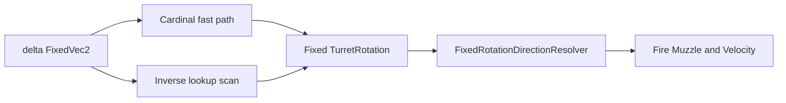

# Task 5.132 — Full-Angle Turret Aim Resolver Plan

> **Nur Dokumentation.** Keine Implementierung, keine Tests, keine Änderungen an `src/`, `tests/`, Projekten, Solution oder `game/`.
>
> Sprache: Erklärungen überwiegend auf Deutsch; Typnamen und API-Namen wie im Code auf Englisch.

## 1. Purpose

Nach Task **5.131** sind Movement, Arena-Bounds und Wall/Obstacle im Combined-Tick **stabil** dokumentiert ([WALL_OBSTACLE_COLLISION_INTEGRATION_CHECKPOINT.md](WALL_OBSTACLE_COLLISION_INTEGRATION_CHECKPOINT.md)). Der nächste empfohlene Combat-/Feel-Engpass ist **präzises Turm-Alignment** zu beliebigen Zielpositionen — nicht nur zu den vier Kardinalachsen.

**Ziel von 5.132:** Architektur-Plan für einen **deterministischen Full-Angle-Turret-Aim-Resolver** — Audit des Ist-Zustands, Semantik, deterministische Mathe-Optionen, API-Skizzen, Script-Integrationspolicy, Fire/Muzzle-Kompatibilität, Test-Leiter und Follow-ups **5.133–5.139**. Dieses Dokument ändert **kein** Runtime-Verhalten.

**Test-Baseline (Repo nach 5.131):** **3061** Tests, **0** Warnungen.

### Querverweise

| Dokument | Rolle |
| -------- | ----- |
| [WALL_OBSTACLE_COLLISION_INTEGRATION_CHECKPOINT.md](WALL_OBSTACLE_COLLISION_INTEGRATION_CHECKPOINT.md) | Empfiehlt **5.132** als nächsten Haupt-Track |
| [DETERMINISTIC_ROTATION_FORWARD_HELPER_PLAN.md](DETERMINISTIC_ROTATION_FORWARD_HELPER_PLAN.md) | Turn-Fraction, Achsen, CCW — **Forward**-Lookup |
| [DETERMINISTIC_MUZZLE_GEOMETRY_PLAN.md](DETERMINISTIC_MUZZLE_GEOMETRY_PLAN.md) | Muzzle entlang Forward |
| [DETERMINISTIC_FIRE_VELOCITY_RESOLVER_PLAN.md](DETERMINISTIC_FIRE_VELOCITY_RESOLVER_PLAN.md) | Velocity aus Forward × Speed |
| [SCRIPT_TURRET_APPLICATION_PLAN.md](SCRIPT_TURRET_APPLICATION_PLAN.md) | Historischer Turret-Track (5.107–5.110); Teile überholt |

## 2. Current State After 5.131

### Authoritative Combined Tick (unverändert durch Aim-Plan)

Quelle: [WALL_OBSTACLE_COLLISION_INTEGRATION_CHECKPOINT.md](WALL_OBSTACLE_COLLISION_INTEGRATION_CHECKPOINT.md) §3.

```text
CombinedScriptRuntimeComposer
→ MatchStateTankMovementPipeline
→ MatchStateTankBoundsPipeline
→ MatchStateTankObstacleCollisionPipeline
→ MatchTickProjectilePipeline.StepProjectilesAndResolveHits
→ MatchStateTickAdvanceSystem.AdvanceTick
```

**Aim gehört nicht in diesen Tick-Schritt.** `AimAtEnemy` läuft innerhalb der **Script-Composer-Phase** (`CombinedScriptRuntimeComposer`), die **vor** Movement/Bounds/Obstacle/Projectile ausgeführt wird.

### Script-Composer-Reihenfolge (heute)

Quelle: [`CombinedScriptRuntimeComposer`](../src/ScriptTanks.Core/Scripting/CombinedScriptRuntimeComposer.cs).

```text
integration → mapping
→ sensor apply(runtime₀)
→ turret apply(runtime₀)          ← AimAtEnemy setzt TurretRotation
→ fire construct(turret FinalRuntime)
→ fire apply(turret FinalRuntime)
→ movement apply(fire FinalRuntime)
→ final merge
```

Fire sieht damit **bereits aktualisierte** `TurretRotation` im selben Tick — Voraussetzung für Aim-then-Fire-Szenarien.

### Full-Angle Aim-Track

| Status | Detail |
| ------ | ------ |
| Forward (Rotation → Richtung) | **Implementiert** — voller Kreis über 1000 Lookup-Schritte |
| Inverse (Richtung → Rotation) | **Nur Kardinal-MVP** — Diagonalen schlagen fehl |
| 5.132 | **Plan only** — diese Datei |
| Implementierung | Follow-ups **5.133+** (§15) |

## 3. Current Aim / Rotation Architecture Audit

*Nur reale Typen aus dem Repo; keine `ScriptMappedAimRequest*`-Pipelines (existieren nicht).*

### Implementiert

| Bereich | Typ / API | Pfad | Rolle heute |
| ------- | --------- | ---- | ----------- |
| Turm-Rotation | `TankState.TurretRotation` (`Fixed`) | [`TankState.cs`](../src/ScriptTanks.Core/Tanks/TankState.cs) | Turn-Fraction; `Fixed.One` = volle Umdrehung |
| Forward-Resolver | `FixedRotationDirectionResolver.ResolveForward` | [`FixedRotationDirectionResolver.cs`](../src/ScriptTanks.Core/Math/FixedRotationDirectionResolver.cs) | `Fixed` → `FixedRotationDirectionResult` mit Forward-`FixedVec2` |
| Forward-Lookup | `FixedRotationDirectionLookup` (`StepCount = 1000`) | [`FixedRotationDirectionLookup.cs`](../src/ScriptTanks.Core/Math/FixedRotationDirectionLookup.cs) | Offline-Tabelle; **keine** Runtime-Trig |
| Inverse (Kardinal) | `FixedRotationAimResolver.ResolveFromDirection` | [`FixedRotationAimResolver.cs`](../src/ScriptTanks.Core/Math/FixedRotationAimResolver.cs) | Nur ±X/±Y; sonst `Unresolved` |
| Aim-Ergebnis | `FixedRotationAimResolution` | [`FixedRotationAimResolution.cs`](../src/ScriptTanks.Core/Math/FixedRotationAimResolution.cs) | `IsResolved` + `Rotation` (`Fixed`) |
| Script-Befehl | `ScriptCommandType.AimAtEnemy` | [`ScriptCommandType.cs`](../src/ScriptTanks.Core/Scripting/ScriptCommandType.cs) | Payload z. B. `"nearest_visible"` |
| Turret-Apply | `ScriptMappedTurretRequestApplicationPipeline.Apply` | [`ScriptMappedTurretRequestApplicationPipeline.cs`](../src/ScriptTanks.Core/Scripting/ScriptMappedTurretRequestApplicationPipeline.cs) | Ziel = nächster lebender Feind (Position); dann Aim-Resolver; snap `TurretRotation` |
| Apply-Status | `ScriptMappedTurretRequestApplicationStatus` | [`ScriptMappedTurretRequestApplicationStatus.cs`](../src/ScriptTanks.Core/Scripting/ScriptMappedTurretRequestApplicationStatus.cs) | `Applied`, `NoTarget`, `MissingAimSolution`, … |
| Composer | `CombinedScriptRuntimeComposer` | [`CombinedScriptRuntimeComposer.cs`](../src/ScriptTanks.Core/Scripting/CombinedScriptRuntimeComposer.cs) | Turret vor Fire |
| Muzzle | `FireMuzzlePositionResolver` | [`FireMuzzlePositionResolver.cs`](../src/ScriptTanks.Core/Combat/FireMuzzlePositionResolver.cs) | `ResolveForward(TurretRotation)` |
| Velocity | `FireVelocityResolver` | [`FireVelocityResolver.cs`](../src/ScriptTanks.Core/Combat/FireVelocityResolver.cs) | Forward × `ProjectileSpeedPerTick` |
| Turn-Rate (Daten) | `BasicTankStats.TurretTurnRatePerTick` | [`BasicTankStats.cs`](../src/ScriptTanks.Core/Tanks/BasicTankStats.cs) | **Kein Consumer** für graduelle Drehung |

### Geplant / historisch dokumentiert (nicht als „fehlend“ behaupten)

| Quelle | Inhalt | Ist-Stand |
| ------ | ------ | --------- |
| [SCRIPT_TURRET_APPLICATION_PLAN.md](SCRIPT_TURRET_APPLICATION_PLAN.md) | Turret-Apply „fehlt“ | **Überholt** — Pipeline existiert (5.109+) |
| [DETERMINISTIC_ROTATION_FORWARD_HELPER_PLAN.md](DETERMINISTIC_ROTATION_FORWARD_HELPER_PLAN.md) | Forward-Helfer geplant | **Umgesetzt** als Direction-Resolver + Lookup |
| Brief-Name `ScriptMappedAimRequestApplicationPipeline` | — | **N/A** — siehe `ScriptMappedTurretRequestApplicationPipeline` |
| Brief-Name `MatchSensorScanResult` | — | [`SensorScanResult`](../src/ScriptTanks.Core/Sensors/SensorScanResult.cs) — separater Sensor-Track; Aim nutzt heute **Tank-Positionen**, nicht Scan-Ergebnisse |

### Kern-Asymmetrie (Gap)

```text
Rotation ──FixedRotationDirectionResolver──► Forward   (1000 Schritte, voller Kreis)
Delta    ──FixedRotationAimResolver────────► Rotation  (nur 4 Kardinalrichtungen)
```

[`FixedRotationAimResolver`](../src/ScriptTanks.Core/Math/FixedRotationAimResolver.cs) ist explizit „cardinal axis-aligned directions only“; Diagonalen → [`FixedRotationAimResolution.Unresolved`](../src/ScriptTanks.Core/Math/FixedRotationAimResolution.cs).

**Beweis in Tests:**

- [`FixedRotationAimResolverTests`](../tests/ScriptTanks.Core.Tests/Math/FixedRotationAimResolverTests.cs) — `ResolveFromDirection_DiagonalVector_ReturnsUnresolved`
- [`CombinedScriptRuntimeComposerTests`](../tests/ScriptTanks.Core.Tests/Scripting/CombinedScriptRuntimeComposerTests.cs) — `Run_AimAtEnemy_DiagonalEnemy_ReturnsMissingAimSolution`

## 4. Problem Statement

Das Spiel braucht eine **deterministische** Methode, aus

- `sourcePosition` (Tank-Zentrum),
- optional `currentRotation` (für spätere Turn-Rate-Tracks),
- `targetPosition` (Feind / taktisches Ziel),

eine **`TurretRotation`** (`Fixed` Turn-Fraction) zu berechnen, die mit dem bestehenden Forward-Lookup **konsistent** ist.

| Frage | Antwort (Planungsstand) |
| ----- | ------------------------ |
| Wie wird Full-Angle-Rotation dargestellt? | **`Fixed` Turn-Fraction** — kein separater `FixedRotation`-Typ im Repo |
| Snap oder Drehung über Zeit? | **MVP: Snap** — `TurretTurnRatePerTick` ungenutzt; Turn-Rate später (§7) |
| Ziel = Quelle? | **Keine** erfundene Rotation — `Unresolved` → Pipeline `MissingAimSolution` |
| Kein Ziel? | Bestehendes **`NoTarget`** in Turret-Apply |
| Wer konsumiert das Ergebnis? | Nur **`TurretRotation`** auf `TankState`; Fire liest Rotation über Forward-Resolver |
| Determinismus? | **Kein** `float`/`double`/Runtime-`Atan2` im Kernpfad |
| Wie testen? | Kardinal-Anker unverändert; **neue** Diagonal-/Quadranten-Tests; Roundtrip-Richtung ↔ Rotation (5.134+) |

## 5. Scope and Non-Scope

### In scope (5.132 Plan)

- Full-Angle **Ziel → Turm-Rotation**-Design
- Deterministische Repräsentation (Turn-Fraction + Lookup)
- Resolver-/Result-/Status-**Skizzen** (keine Dateien)
- Script-`AimAtEnemy`-Integrationspolicy (bestehende Turret-Pipeline)
- Kompatibilität mit Muzzle, Velocity, Forward-Lookup
- Test-Strategie und Task-Roadmap **5.133–5.139**

### Out of scope

| Thema | Grund |
| ----- | ----- |
| Production-Code, neue Tests | Explizit ausgeschlossen |
| `CombinedRuntimeTickPipeline`-Reihenfolge | Aim bleibt in Composer |
| Godot / UI / Aim-Debug-Overlay | Später |
| Networking, AI-Verhalten, Sensor-Redesign | Eigene Tracks |
| Ballistik jenseits aktuellem Fire-Modell | Kein Homing / Steering |
| Wall-LOS, Pathfinding | Nicht im Aim-Track |
| Tank-vs-Tank-Kollision | Separater Track |
| Zufälliger Aim-Spread | Determinismus |
| `float`/`double`-Trig im Core-Runtime | Verboten |
| Implementierung in 5.132 | Nur dieses Plan-Dokument |

### Task-ID-Hinweis

[WALL_OBSTACLE_COLLISION_PLAN.md](WALL_OBSTACLE_COLLISION_PLAN.md) §15 nennt **5.132** optional als Projektil-Wall-Audit. [WALL_OBSTACLE_COLLISION_INTEGRATION_CHECKPOINT.md](WALL_OBSTACLE_COLLISION_INTEGRATION_CHECKPOINT.md) §12 reserviert **5.132** für Full-Angle Aim. **Dieses Dokument beansprucht 5.132 für den Aim-Plan.** Projektil-Wall-Audit bleibt optional / umnummerierbar (nicht Teil dieses Tracks).

## 6. Terminology and Coordinate Rules

| Begriff | Bedeutung |
| ------- | --------- |
| `sourcePosition` | Tank-Hitbox-Zentrum (`Movement.Position`) |
| `targetPosition` | Position des gewählten Ziels (heute: nächster lebender Feind) |
| `delta` | `targetPosition - sourcePosition` |
| `desiredRotation` | Turn-Fraction, die `delta` am besten approximiert |
| `currentRotation` | `TankState.TurretRotation` vor Apply |
| `turnStep` | Max. Drehänderung pro Tick — **später** via `TurretTurnRatePerTick` |
| `aligned` | Turm zeigt (innerhalb Toleranz) auf Ziel — **später**; MVP = exakter Snap |
| `forward` | Einheitsrichtung aus `ResolveForward(rotation)` |

### Koordinaten (aus Code-Kommentaren bestätigt)

Quelle: [`FixedRotationDirectionResolver`](../src/ScriptTanks.Core/Math/FixedRotationDirectionResolver.cs).

| Regel | Wert |
| ----- | ---- |
| +X | Ost / rechts |
| +Y | Nord / „oben“ in Weltkoordinaten |
| Volle Umdrehung | `Fixed.One` (`Fixed.Scale` = 1000 Raw-Einheiten) |
| Drehrichtung | **Gegen den Uhrzeigersinn** ab +X |
| Lookup-Schritte | `FixedRotationDirectionLookup.StepCount` = **1000** |

### Kardinal-Anker (Pflicht-Stabilität)

Bestehende [`FixedRotationAimResolverTests`](../tests/ScriptTanks.Core.Tests/Math/FixedRotationAimResolverTests.cs) fixieren:

| Richtung (`delta`) | `Rotation` |
| ------------------ | ---------- |
| +X | `Fixed.Zero` |
| +Y | `Fixed.FromRatio(1, 4)` |
| -X | `Fixed.FromRatio(1, 2)` |
| -Y | `Fixed.FromRatio(3, 4)` |

Full-Angle-Erweiterung **darf** diese Werte für axis-aligned `delta` **nicht** ändern.

### Degenerierte Fälle

| Fall | Semantik |
| ---- | -------- |
| `delta == (0, 0)` | Keine Richtung — `Unresolved` (heute bereits bei Zero-Vector) |
| Kein lebender Feind | `ScriptMappedTurretRequestApplicationStatus.NoTarget` — **nicht** im Resolver |

## 7. Full-Angle Aim Semantics

### Snap vs. Turn-Limited

| Option | Bedeutung | MVP |
| ------ | --------- | --- |
| **Snap aim** | `AimAtEnemy` setzt `TurretRotation` sofort auf `desiredRotation` | **Ja** |
| **Turn-limited** | Turm nähert sich pro Tick um `TurretTurnRatePerTick` | **Nein** (Follow-up 5.14x) |
| **Hybrid** | Snap zuerst, Turn-Rate später | Empfohlene Folge |

**Begründung Snap:** Entspricht [`ScriptMappedTurretRequestApplicationPipeline`](../src/ScriptTanks.Core/Scripting/ScriptMappedTurretRequestApplicationPipeline.cs); kleinster Diff; Fire-Richtung sofort nutzbar; Turn-Rate-Feld existiert, wird aber nirgends angewendet.

### Zielauswahl (unverändert im MVP)

- **Nächster lebender Feind** nach quadrierter Distanz.
- **Tie-break:** niedrigerer `TankIndex`.
- **Nicht** in den Resolver verlagern: [`SensorScanResult`](../src/ScriptTanks.Core/Sensors/SensorScanResult.cs) / Scan-Payload — optional spätere Erweiterung.

### Fehlende / ungültige Ziele

| Situation | Verhalten |
| --------- | --------- |
| Kein Feind | `NoTarget` — unverändert |
| `delta` nicht auflösbar | `MissingAimSolution` — unverändert |
| Diagonal heute | `MissingAimSolution` — **nach Implementierung:** `Applied` mit passender Rotation |

### Normalisierung

`delta` wird auf den **nächsten** der 1000 Forward-Lookup-Richtungen gemappt (gleiche Granularität wie [`FixedRotationDirectionLookup`](../src/ScriptTanks.Core/Math/FixedRotationDirectionLookup.cs)).

## 8. Deterministic Math Options

### Option A — Inverse über committed Lookup (empfohlen)

**Idee:** Für normiertes `delta` (oder Raw-`FixedVec2`) den Lookup-Index `i` wählen, der die Richtung am besten trifft (z. B. maximales skalarprodukt `dot(delta, Forwards[i])` in `Int128`/`Fixed`-Arithmetik). Gewinner-Index → `Fixed`-Rotation über dieselbe Skalierung wie [`FixedRotationDirectionResolver`](../src/ScriptTanks.Core/Math/FixedRotationDirectionResolver.cs) (`NormalizeRaw`).

| Pro | Contra |
| --- | ------ |
| Deterministisch, kein Runtime-Trig | Diskrete Approximation (~0,36° bei 1000 Schritten) |
| Konsistent mit Forward-Pfad | Index→Raw-Mapping muss **auditiert** werden (5.134) |
| Kardinal-Anker über Fast-Path oder exakte Indizes absicherbar | Scan O(1000) pro Aim — akzeptabel |

**Wichtig:** Dieser Plan **behauptet nicht**, dass `rotation = Fixed.FromRaw(index)` die finale API ist. Task **5.134** muss `Fixed.Scale`, `StepCount` und `NormalizeRaw` verifizieren und Roundtrip-Tests schreiben.

### Option B — Quadranten / Oktanten

| Pro | Contra |
| --- | ------ |
| Einfach, ohne Trig | **Kein** echtes Full-Angle; Treppen-Effekt |
| | Widerspricht 5.132-Ziel |

### Option C — Fixed-Point-`atan2`-Approximation

| Pro | Contra |
| --- | ------ |
| Feinere Winkel | Höheres Fehlerrisiko; schwerer reviewbar |
| | Verbot von verstecktem `double` in Generatoren/Runtime |

### Option D — Richtungsvektor statt Winkel speichern

| Pro | Contra |
| --- | ------ |
| Direkt für Muzzle | **`TurretRotation` ist `Fixed`** — Replay/Composer brechen |
| | Große Migration |

### Tie-break policy (bindend für Implementierung)

Wenn zwei oder mehr Lookup-Indizes **gleich gut** scoren (gleiches Dot-Produkt, symmetrische Ambiguität):

1. **Niedrigerer Lookup-Index** gewinnt (deterministische Scan-Reihenfolge `0 … StepCount-1`).
2. **Ausnahme Kardinal:** Axis-aligned `delta` wird **zuerst** über den bestehenden Kardinal-Pfad in [`FixedRotationAimResolver`](../src/ScriptTanks.Core/Math/FixedRotationAimResolver.cs) aufgelöst — exakt `0`, `1/4`, `1/2`, `3/4`; kein Tie-break darf das verändern.
3. **Tests (§14):** Symmetrische `delta`-Konstrukte, die zwei Indizes tie machen könnten → assert stabile `Rotation` über Wiederholaufrufe.

### Lookup index → `Fixed` rotation (nur Planung)

| Fakt | Quelle |
| ---- | ------ |
| `Fixed.Scale` | 1000 ([`Fixed.cs`](../src/ScriptTanks.Core/Math/Fixed.cs)) |
| `StepCount` | 1000 ([`FixedRotationDirectionLookup.cs`](../src/ScriptTanks.Core/Math/FixedRotationDirectionLookup.cs)) |
| Normalisierung Forward | `raw % Scale` in Direction-Resolver |

**Hypothese (zu verifizieren in 5.134):** Index `i` entspricht normalisiertem Raw `i` (oder äquivalentem skaliertem Wert). **Erst nach Audit** in Code festlegen — nicht in 5.132 hard-coden.

## 9. Recommended MVP Direction

1. **Behalten:** `Fixed` Turn-Fraction auf [`TankState.TurretRotation`](../src/ScriptTanks.Core/Tanks/TankState.cs).
2. **Erweitern oder ersetzen:** [`FixedRotationAimResolver`](../src/ScriptTanks.Core/Math/FixedRotationAimResolver.cs) **oder** neuer Typ `FullAngleTurretAimResolver` mit gemeinsamem Lookup-Kern — Entscheidung in **5.135**.
3. **Kardinal-Fast-Path** vor Lookup-Scan (oder exakte Index-Zuordnung) — Anker §6 unverändert.
4. **Tie-break:** §8 — lower index; Kardinal-Ausnahme.
5. **Skalierung:** §8 — Audit in **5.134**; keine `FromRaw(index)` ohne Verifikation.
6. **Integration:** nur [`ScriptMappedTurretRequestApplicationPipeline`](../src/ScriptTanks.Core/Scripting/ScriptMappedTurretRequestApplicationPipeline.cs) — eine Zeile ersetzt `FixedRotationAimResolver.ResolveFromDirection(delta)`.
7. **Kein** `CombinedRuntimeTickPipeline`-Eingriff.



## 10. Proposed API / Result Model Sketch

**Nicht implementieren in 5.132.** Namen anpassen an Repo (`Fixed`, nicht `FixedRotation`).

### Option 1 — `FixedRotationAimResolution` erweitern

Bestehendes Struct beibehalten; `ResolveFromDirection` löst alle nicht-null `delta` auf (außer Zero). Minimaler API-Bruch; Tests erweitern.

### Option 2 — Explizites Result (Skizze)

```csharp
public enum FullAngleTurretAimStatus
{
    Resolved = 0,
    TargetAtSource = 1,      // delta zero
    // MissingTarget bleibt in Script-Pipeline, nicht im Resolver
}

public sealed class FullAngleTurretAimResult
{
    public FullAngleTurretAimStatus Status { get; }
    public Fixed? DesiredRotation { get; }
    public FixedVec2 Delta { get; }
}
```

```csharp
public static class FullAngleTurretAimResolver
{
    public static FullAngleTurretAimResult ResolveFromDelta(FixedVec2 delta);
}
```

**Empfehlung:** Option 1, wenn nur Verhalten erweitert wird; Option 2, wenn Status/Telemetry für spätere Turn-Rate-Tracks nötig ist.

## 11. Script Integration Policy

### Ist-Flow (belegt)

```text
ScriptCommandType.AimAtEnemy
  → ScriptTranslatedCommandDomainMapper (Turret-Kategorie)
  → ScriptMappedTurretRequestApplicationPipeline.Apply
       TrySelectNearestAliveEnemy
       delta = target.Movement.Position - source.Movement.Position
       resolution = FixedRotationAimResolver.ResolveFromDirection(delta)
       tank.WithTurretRotation(resolution.Rotation)  // wenn IsResolved
```

Quellen: [`ScriptMappedTurretRequestApplicationPipeline.cs`](../src/ScriptTanks.Core/Scripting/ScriptMappedTurretRequestApplicationPipeline.cs), [`ScriptCommandType.cs`](../src/ScriptTanks.Core/Scripting/ScriptCommandType.cs).

### Policy (nach Implementierung)

| Regel | Detail |
| ----- | ------ |
| Aim feuert nicht | `Fire` bleibt separates Kommando |
| Fire zielt nicht still | Kein Auto-Aim in Fire-Construct |
| Fehlendes Ziel | `NoTarget` — unverändert |
| Ungültige Richtung | `MissingAimSolution` — unverändert |
| Rein / deterministisch | Resolver mutiert keinen `MatchState`; Pipeline kopiert Tanks |
| Sensor | Scan-Ausführung **nicht** in Aim-Resolver mischen |
| LOS / Walls | **Nicht** in 5.133–5.139 Aim-Track |

### Composer-Guards

Fire construct/apply nutzen [`turretApplicationResult.FinalRuntime`](../src/ScriptTanks.Core/Scripting/CombinedScriptRuntimeComposer.cs) — Full-Angle-Aim profitiert **ohne** Guard-Änderung, sobald `TurretRotation` gesetzt wird.

## 12. Fire / Muzzle / Velocity Compatibility

### Invariante (bereits implementiert)

```text
TurretRotation
  → FixedRotationDirectionResolver.ResolveForward
  → forward FixedVec2
  → MuzzlePosition = center + forward * MuzzleOffsetFromCenter
  → FireVelocity = forward * ProjectileSpeedPerTick
```

| Resolver | Pfad |
| -------- | ---- |
| Muzzle | [`FireMuzzlePositionResolver.cs`](../src/ScriptTanks.Core/Combat/FireMuzzlePositionResolver.cs) |
| Velocity | [`FireVelocityResolver.cs`](../src/ScriptTanks.Core/Combat/FireVelocityResolver.cs) |
| Forward | [`FixedRotationDirectionResolver.cs`](../src/ScriptTanks.Core/Math/FixedRotationDirectionResolver.cs) |

**Blocker für Diagonal-Fire:** **nicht** Muzzle/Velocity — nur fehlende **Inverse-Aim**-Rotation. Sobald `TurretRotation` einen Lookup-Index trifft, liefert Forward eine konsistente Diagonalrichtung.

### Geplante Regressions-Ideen (5.138)

| Szenario | Erwartung |
| -------- | --------- |
| Aim Ost → Fire | Velocity ≈ (+speed, 0) |
| Aim Diagonal → Fire | Velocity aligned mit Forward aus gesetzter Rotation |
| Aim dann Fire (ein Tick) | Muzzle-Offset in Turmrichtung |
| Kardinal-Regression | Bestehende Tests grün |

Kein neues Projektil-Wall-Feature in diesem Track.

## 13. Replay, Logging, and Combined Runtime Policy

| Thema | Policy |
| ----- | ------ |
| Combined tick | **Keine** Reihenfolgeänderung — Aim in Composer |
| Replay | Weiterhin nur [`MatchState`](../src/ScriptTanks.Core/Match/MatchState.cs)-Frames; `TurretRotation` im State sichtbar |
| Logging | **Keine** neuen [`CombatLogEventTypes`](../src/ScriptTanks.Core/Logging/CombatLogEventTypes.cs) für Resolver-Internals |
| Rich logs | Optional später Script-Ergebnis — nicht MVP |
| Determinismus Replay | Gespeicherte `TurretRotation` nach Apply ist authoritative |

## 14. Future Test Strategy

### Stufe 1 — Resolver / Lookup (5.134–5.135)

| Test | Datei |
| ---- | ----- |
| Kardinal-Anker unverändert | [`FixedRotationAimResolverTests`](../tests/ScriptTanks.Core.Tests/Math/FixedRotationAimResolverTests.cs) |
| Diagonal-Quadranten NE/NW/SE/SW | erweitern oder neue `FullAngle*` Tests |
| Negative `delta` | alle Quadranten |
| `delta == Zero` → unresolved | bestehend + Pipeline |
| Wiederholaufrufe identisch | Determinismus |
| Tie-break stabil | konstruierte Symmetrie |
| Index ↔ Raw ↔ Forward Roundtrip | 5.134 Audit |
| Kein `float` im Resolver-Pfad | Code-Review / Architektur-Assert |

### Stufe 2 — Result-Modelle (5.133)

Enum/Struct-Validierung falls neues Result eingeführt wird.

### Stufe 3 — Script-Integration (5.136–5.137)

| Test | Datei |
| ---- | ----- |
| `AimAtEnemy` + diagonal enemy → `Applied` | [`ScriptMappedTurretRequestApplicationPipelineTests`](../tests/ScriptTanks.Core.Tests/Scripting/ScriptMappedTurretRequestApplicationPipelineTests.cs) |
| Diagonal composer | [`CombinedScriptRuntimeComposerTests`](../tests/ScriptTanks.Core.Tests/Scripting/CombinedScriptRuntimeComposerTests.cs) — **ersetzt** `MissingAimSolution`-Erwartung |
| Aim ohne Fire | unverändert |
| Combined tick | [`CombinedRuntimeTickPipelineTests`](../tests/ScriptTanks.Core.Tests/Scripting/CombinedRuntimeTickPipelineTests.cs) — `TurretRotation` nach einem Tick |

### Stufe 4 — Fire-Kompatibilität (5.138)

Muzzle/Velocity/Construction-Pipeline: Diagonal-Aim + Fire; Kardinal-Smoke bleibt grün.

### Stufe 5 — Runner / Replay (optional in 5.137–5.138)

Ein Tick `AimAtEnemy` → Frame zeigt neue `TurretRotation`; kein neues Log-Schema.

## 15. Recommended Follow-up Tasks

**Keine** Implementierung ohne diese Reihenfolge. **Kein** Godot/UI vor verifiziertem Core.

| Task | Inhalt |
| ---- | ------ |
| **5.133** | Result/Status-Modelle (falls von `FixedRotationAimResolution` abgespalten) |
| **5.134** | Inverse-Lookup-Kern: Index-Scoring, Tie-break, **Index→`Fixed`-Skalierung auditieren** |
| **5.135** | `FullAngleTurretAimResolver` oder erweiterte `FixedRotationAimResolver` |
| **5.136** | Einbindung in [`ScriptMappedTurretRequestApplicationPipeline`](../src/ScriptTanks.Core/Scripting/ScriptMappedTurretRequestApplicationPipeline.cs) |
| **5.137** | Composer- und Turret-Apply-Regressionen |
| **5.138** | Fire/Muzzle/Velocity Full-Angle-Regressionen |
| **5.139** | `FULL_ANGLE_TURRET_AIM_INTEGRATION_CHECKPOINT.md` (docs) |

### Parallel-Track (nicht 5.132)

| ID | Inhalt |
| -- | ------ |
| **5.132A** | Axis-separated wall slide — [WALL_OBSTACLE_COLLISION_INTEGRATION_CHECKPOINT.md](WALL_OBSTACLE_COLLISION_INTEGRATION_CHECKPOINT.md) §12 |
| *(optional)* | Projektil-Wall Combined-Audit — war in Wall-Plan als „5.132“ gelistet; **nicht** dieser Aim-Track |

### Später (eigene Pläne)

Turn-rate pro Tick, Sensor-gestütztes Ziel, LOS, Full-Angle-Checkpoint nach 5.139.

## 16. Verification / Definition of Done

### Nach dem Schreiben dieses Dokuments (docs-only), vom **Repository-Root**:

```powershell
dotnet build ScriptTanks.sln -warnaserror
dotnet test ScriptTanks.sln
```

**Erwartung:**

- 0 Warnungen
- **3061** Tests bestanden (unverändert gegenüber 5.131)

### Definition of Done

- [x] [`docs/FULL_ANGLE_TURRET_AIM_RESOLVER_PLAN.md`](FULL_ANGLE_TURRET_AIM_RESOLVER_PLAN.md) existiert mit Abschnitten **1–16**.
- [x] Post-5.131 Combined-Flow und Composer-Reihenfolge dokumentiert (§2).
- [x] Aim/Rotation-Architektur auditiert — nur reale Typen (§3).
- [x] Problem, Scope, Terminologie, Semantik (§4–§7).
- [x] Mathe-Optionen verglichen; Tie-break und **kein** garantiertes `FromRaw(index)` (§8).
- [x] MVP-Richtung und API-Skizzen (§9–§10).
- [x] Script-, Fire-, Replay-Policy (§11–§13).
- [x] Test-Leiter und Follow-ups **5.133–5.139** (§14–§15).
- [x] Keine Änderungen an `src/`, `tests/`, `game/`, `.csproj`, `.sln`, anderen Plan-/Checkpoint-Dateien.
- [x] Deliverable-Links: nur sibling / `../src/` / `../tests/` — **keine** `C:\`-Pfade.
- [x] `dotnet build ScriptTanks.sln -warnaserror` grün (nach Verifikationslauf).
- [x] `dotnet test ScriptTanks.sln` bleibt bei **3061** Tests (nach Verifikationslauf).
