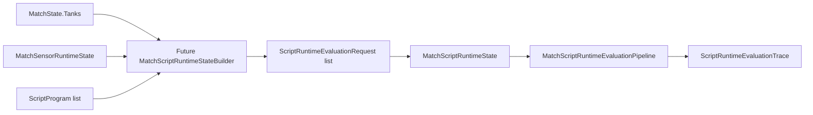

# MatchScriptRuntimeState Pairing Plan

## 1. Purpose

Dieses Dokument beschreibt, wie **zukünftig** Script-Laufzeitdaten (`MatchScriptRuntimeState`, `ScriptRuntimeEvaluationRequest`) mit **Match-Tanks** und weiterem Runtime-State **gekoppelt** werden sollen.

Explizit:

- **Nur Dokumentation**, **keine Implementierung** in diesem Task.
- **Keine** MatchState-Mutation, **keine** Kommando-Ausführung, **kein** Request-Dispatch.

## 2. Current State

Heutige reine Typen:

```text
MatchScriptRuntimeState
└─ Requests: IReadOnlyList<ScriptRuntimeEvaluationRequest>

ScriptRuntimeEvaluationRequest
├─ TankIndex
├─ ScriptProgram
└─ ScriptEvaluationContext
```

Eigenschaften:

- Die Request-Liste ist **geordnet** (defensive Kopie bei Konstruktion).
- `TankIndex` ist aktuell nur ein `**int`** ohne Validierung gegen `MatchState.Tanks.Count`.
- **Keine** Bindung an `TankId`, **keine** an `PlayerSlot`.
- `ScriptEvaluationContext` wird **von außen** geliefert — **keine** automatische Ableitung aus echtem Match-/Sensor-/Weapon-Zustand (siehe `[SCRIPT_RUNTIME_CONTEXT_BUILDER_PLAN.md](C:/ScriptTranks/docs/SCRIPT_RUNTIME_CONTEXT_BUILDER_PLAN.md)`).

## 3. Core Pairing Problem

Spätere Integration muss klären:

- Welches **ScriptProgram** gehört zu welchem **Tank**?
- Bedeutet `TankIndex` den **Listenindex** in `MatchState.Tanks`?
- Oder soll primär `**TankId`** gebunden werden?
- Was passiert bei **Umordnung** der Tank-Liste?
- Was passiert bei **zerstörtem** Tank?
- Was passiert bei einem Request für einen **nicht existierenden** Tank?
- Was passiert, wenn ein Tank **ohne** Script-Programm existiert?




## 4. Candidate Pairing Strategies

### Strategy A — Collection index pairing

`request.TankIndex ==` Index in `MatchState.Tanks` (gleiche Reihenfolge wie die Match-Tank-Liste).

**Pros:** einfach, deterministisch, passt zu vielen bestehenden Index-Zugriffen, gut testbar.

**Cons:** bricht leicht, wenn sich die Tank-Reihenfolge ändert; Requests müssten bei Listenänderung neu aufgebaut werden.

### Strategy B — TankId pairing

Request-Modell (oder Erweiterung) speichert `**TankId`**.

**Pros:** robust gegen Umordnung, klare Identität.

**Cons:** neues oder erweitertes Modell, Lookup-Regeln, Verhalten bei fehlender ID.

### Strategy C — Hybrid

Request trägt `**TankIndex` und `TankId`**.

**Pros:** schneller Index-Pfad plus Validierung gegen Identität.

**Cons:** mehr Invarianten, explizite Behandlung bei **Mismatch** zwischen Index und Id.

## 5. Recommended MVP Pairing Strategy

**Empfehlung MVP:** **Strategy A — Collection index pairing.**

**Begründung:** Viele Pfade nutzen bereits indexbasierte Zugriffe; deterministische Tank-Reihenfolge ist im Match-Modell etabliert; geringste Erweiterung vor erster echten Integration.

**Geplante Policy (Integration Composer, nicht dieses Dokument implementierend):**

- `request.TankIndex` entspricht der Position in `MatchState.Tanks` für denselben Snapshot.
- Runtime-Requests werden in **derselben Reihenfolge** wie `MatchState.Tanks` erzeugt.
- **Count-Mismatch** (`Requests.Count != Tanks.Count`) → **ablehnen** (Exception), kein stilles Kürzen.
- **Keine** automatische Sortierung der Requests.

**Migration später:** Übergang zu **Hybrid** (`TankIndex` + `TankId`), sobald Identität und Persistenz der Tankliste stärker formalisiert sind.

## 6. Validation Rules

Zielbild für einen **zukünftigen** Integration Composer:

- `null` bei `MatchState` / `MatchSensorRuntimeState` / Eingabe-Snapshots → **werfen**.
- `null` bei `MatchScriptRuntimeState` → **werfen**.
- **Strikte MVP-Integration:** `Requests.Count == MatchState.Tanks.Count`.
- Jeder Eintrag **i**: `requests[i].TankIndex == i` (Request-Index gleich Tank-Index).
- Ungültiger `TankIndex` außerhalb des Bereichs → **werfen**.
- **Doppelte** `TankIndex`-Werte in der Liste → **werfen**, wenn Gleichheit der Counts allein nicht ausreicht.

**Zerstörte Tanks:**

- Eintrag im Request-Array kann **weiter existieren**; der **Context Builder** soll einen **sicheren** Kontext liefern (HP 0, keine Bereitschaft, keine Sichtung) gemäß Kontext-Plan.
- Die **Ausführungs**schicht entscheidet später, ob Kommandos von zerstörten Tanks ignoriert oder abgelehnt werden — nicht der Pairing-Plan allein.

## 7. Deterministic Ordering Policy

- Script-Auswertung folgt `**MatchState.Tanks`-Reihenfolge** (Index 0, 1, 2, …).
- **Keine** Sortierung nach `TankId` oder `PlayerSlot` in der Evaluations-Reihenfolge.
- **Keine** Randomisierung.
- Gleichzeitig übersetzte Intents mehrerer Tanks behalten **Tank-Reihenfolge** in Spuren/Outputs.
- Spätere **Konflikt-/Prioritätsregeln** bei gleichzeitiger Ausführung gehören in eine **Execution-/Composer**-Schicht, nicht in die reine Evaluationsreihenfolge.

**Technisch:** keine Enumeration über unstabile `Dictionary`-Reihenfolge für tankspezifische Arbeit; stabile **Liste/Array** verwenden.

## 8. Handling Missing or Invalid Script Data

Mögliche Fälle:

- Tank ohne Script-Programm.
- Leeres oder ungültiges Programm (Parser fehlt noch).
- Ungültiger Tank-Index im Request.
- Count-Mismatch zwischen Requests und Tanks.
- Kontext „veraltet“ oder für anderen Tick gebaut (wird erst mit Context Builder relevant).
- Ungültiges Condition-Argument zur **Laufzeit der Evaluation** (bestehende Evaluator-Exceptions).

**MVP-Empfehlungen:**

- Fehlendes Programm: **explizit** — Default-`NoOp`-Programm **oder** Ablehnung **vor** Erzeugung von `MatchScriptRuntimeState` (Entscheidung beim Implementieren festlegen).
- Ungültiges strukturelles Pairing (Index, Count) → **werfen**, kein stiller Fallback.
- Condition-Argument-Fehler → **Propagieren** wie heute bei der Evaluation.
- „Stale context“ erst sinnvoll adressieren, wenn **ScriptRuntimeContextBuilder** und Tick-Kopplung existieren.

## 9. Interaction With Context Builder

Geplanter Ablauf (siehe Kontext-Plan):

```text
MatchSensorRuntimeState + tankIndex
  → ScriptRuntimeContextBuilder.Build(...)
  → ScriptEvaluationContext
  → ScriptRuntimeEvaluationRequest(TankIndex, Program, Context)
```

**Prinzipien:**

- Kontext **unmittelbar vor** der Evaluation aus dem **aktuellen** Snapshot und **aktuellen** `SimTick` ableiten.
- Kontext **nicht** über Ticks hinweg wiederverwenden, außer über eine später explizit definierte Cache-Policy mit Tick-/Validity-Regeln.

## 10. Interaction With Translator V2

Konzeptueller Pfad nach Übersetzung der Entscheidung:

```text
ScriptRuntimeEvaluationRequest
  → (bestehende) Evaluations-Pipeline pro Tank / Batch
  → … → ScriptCommandIntent
  → ScriptCommandTranslatorV2
  → ScriptCommandTranslationOutput
```

Die **bestehende** `ScriptRuntimeDecisionPipeline` / Status-only-`ScriptCommandTranslator`-Kette bleibt für aktuelle Debug-/Testpfade relevant.

**Offene Produktentscheidung:**

- Alte Pipeline ersetzen, **parallel** v2-Ergebnismodelle führen, oder **beide** temporär halten?

**Empfehlung:**

- Status-only-Pipeline **stabil** lassen.
- v2-Outputs (**z. B.** `ScriptCommandTranslationOutput`) über **parallele** oder additive Ergebnistypen einführen, **bevor** bestehende Formatter-/Pfad-Erwartungen gebrochen werden.

## 11. Future Integration API Sketch

**Option A — Strikter Builder aus `MatchSensorRuntimeState`**

```csharp
public static MatchScriptRuntimeState Build(
    MatchSensorRuntimeState sensorRuntime,
    IReadOnlyList<ScriptProgram> programs);
```

**Policy:** `programs.Count == sensorRuntime.State.Tanks.Count`; Request-Reihenfolge = Tank-Reihenfolge; Kontext pro Tank über Context Builder.

**Option B — `IScriptProgramProvider`**

```csharp
public interface IScriptProgramProvider
{
    ScriptProgram GetProgramForTankIndex(int tankIndex);
}
```

Für den Kern vermutlich **früh** — optional für Tools/Mods später.

**Option C — Explizite Zuweisungen**

```csharp
public sealed class TankScriptAssignment
{
    public int TankIndex { get; }
    public ScriptProgram Program { get; }
}
```

**Empfehlung:** Mit **Option A** starten, sobald `ScriptRuntimeContextBuilder` existiert — ein Composer, ein Snapshot, klare Count-Invarianten.

## 12. Test Strategy

Geplante Tests **nach** Implementierung der Builder/Composer:

**Validierung**

- Null-Eingaben; Count-Mismatch; ungültiger Index; Request-Index vs. `TankIndex`-Mismatch.

**Reihenfolge**

- Request-Reihenfolge entspricht `MatchState.Tanks`; `TankIndex == Collection-Position`; keine Sortierung nach Id/Slot.

**Kontext**

- Kontext je Tank aus dem passenden Snapshot; zerstörter Tank → sicherer Kontext (Policy aus Kontext-Plan).

**Reinheit**

- Keine Mutation von `MatchState` oder Sensor-Runtime beim Bauen; wiederholter Build mit gleichen Inputs → gleiche Request-Daten.

**Fehler**

- Strukturelle Pairing-Fehler beim Bauen; Evaluierungsfehler (z. B. Condition) bei der Pipeline wie heute.

## 13. Out of Scope

- Keine Implementierung in Task 5.45.
- Keine Änderungen an `MatchState`, `MatchScriptRuntimeState`, oder Request-Modellen.
- Kein Context Builder, kein Translator-v2-Pipeline-Umbau in diesem Task.
- Keine Kommando-Ausführung, kein Dispatch, kein Scheduler, kein CPU-Modell.
- Keine Replay-/Logging-/Diagnostics-/Godot-Integration.

## 14. Recommended Next Tasks

1. **Task 5.46 — First Pure Integration Composer Plan** — Dokumentation: Zusammenspiel Context Builder + Translator v2 + Pairing.
2. **Task 5.47 — ScriptRuntimeContextBuilder First Implementation** — reiner Context Builder aus `MatchSensorRuntimeState` und `tankIndex`.
3. **Task 5.48 — MatchScriptRuntimeStateBuilder** — `MatchScriptRuntimeState` aus Sensor-Runtime + Programmliste.
4. **Task 5.49 — ScriptRuntimeV2EvaluationResult Models** — Ergebnismodelle mit `ScriptCommandTranslationOutput`.
5. **Task 5.50 — First Pure Script Intent Integration Composer** — Scripts auswerten und übersetzte Requests zurückgeben, **ohne** Ausführung.

---

*Plan-Dokument Task 5.45. Verweise auf Code beschreiben den zum Zeitpunkt der Erstellung intendierten Stand; bei API-Änderungen dieses Dokument aktualisieren.*