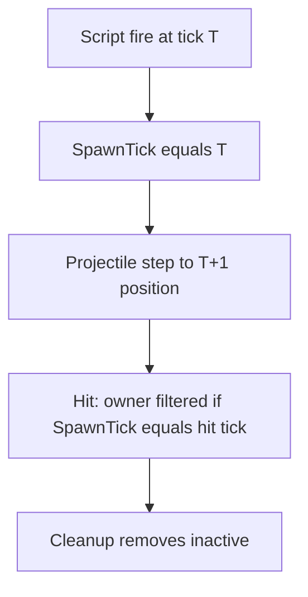

# Task 5.100 — Muzzle Radius Tuning Checkpoint

> **Nur Dokumentation.** Keine Implementierung, keine Tests, keine Änderungen an `src/`, `tests/`, Projekten, Solution oder `game/`.
>
> Sprache: Erklärungen überwiegend auf Deutsch; Typnamen und API-Namen wie im Code auf Englisch.

## 1. Purpose

Nach Tasks **5.98** und **5.99** ist die Owner-Self-Hit-Policy im Simulationskern gesetzt und end-to-end abgesichert:

- **5.98:** [`ProjectileState`](../src/ScriptTanks.Core/Projectiles/ProjectileState.cs) trägt `SpawnTick`; [`MatchStateProjectileHitSystem`](../src/ScriptTanks.Core/Match/MatchStateProjectileHitSystem.cs) filtert den Owner aus den Treffer-Kandidaten, wenn `projectile.SpawnTick == state.CurrentTick`.
- **5.99:** Combined-Runtime-Regression beweist Owner-Überleben und Gegner-Treffer in einem Tick ([`CombinedRuntimeTickPipelineTests.cs`](../tests/ScriptTanks.Core.Tests/Scripting/CombinedRuntimeTickPipelineTests.cs)).

**Frage dieses Checkpoints:** Sind die aktuellen Werte in [`WeaponCatalog`](../src/ScriptTanks.Core/Weapons/WeaponCatalog.cs) und [`TankCatalog`](../src/ScriptTanks.Core/Tanks/TankCatalog.cs) (`MuzzleOffsetFromCenter`, `ProjectileRadius`, `HitboxRadius`) weiterhin akzeptabel — oder soll Task **5.101** Katalog-Konstanten tunen?

Design-Historie: [PROJECTILE_SELF_HIT_MUZZLE_GEOMETRY_PLAN.md](PROJECTILE_SELF_HIT_MUZZLE_GEOMETRY_PLAN.md) (Option D), [PROJECTILE_SPAWN_TICK_INVENTORY.md](PROJECTILE_SPAWN_TICK_INVENTORY.md) (SpawnTick-Spezifikation).

**Test-Baseline (Repo):** 2669 Tests nach 5.99.

## 2. Current Geometry Inventory

Quelle: [`WeaponCatalog.cs`](../src/ScriptTanks.Core/Weapons/WeaponCatalog.cs), [`TankCatalog.cs`](../src/ScriptTanks.Core/Tanks/TankCatalog.cs).

### Waffen (`WeaponDefinition`)

| Weapon | `MuzzleOffsetFromCenter` | `ProjectileRadius` | Dezimal (Näherung) |
| ------ | ------------------------ | ------------------ | ------------------ |
| StandardCannon | `Fixed.FromInt(1)` | `Fixed.FromRatio(1, 4)` | 0.25 |
| ShotgunCannon | `Fixed.FromInt(1)` | `Fixed.FromRatio(35, 100)` | 0.35 |
| Railgun | `Fixed.FromInt(2)` | `Fixed.FromRatio(15, 100)` | 0.15 |

Weitere Felder (Schaden, Cooldown, Reichweite) sind für diesen Checkpoint nicht relevant; sie bleiben unverändert.

### Panzer (`TankDefinition.Stats.HitboxRadius`)

| Tank | `HitboxRadius` | Dezimal (Näherung) |
| ---- | -------------- | ------------------ |
| BasicTank | `Fixed.FromInt(2)` | 2.0 |
| LightTank | `Fixed.FromRatio(7, 4)` | 1.75 |
| HeavyTank | `Fixed.FromRatio(5, 2)` | 2.5 |

**Test-Default:** `TankCatalog.BasicTank` in Combined-, Fire- und Hit-Tests. **Waffen-Default:** `WeaponCatalog.StandardCannon`.

## 3. Collision Model and Test Inventory

### Kollisionsmodell

| Konzept | Quelle | Regel |
| ------- | ------ | ----- |
| Panzerzentrum | `TankState.MovementState.Position` | Hitbox-Kreis mit `TankDefinition.Stats.HitboxRadius` |
| Projektilzentrum | `ProjectileState.Position` | Treffer-Kreis mit `ProjectileDefinition.Radius` (aus Waffe) |
| Mündung | [`FireMuzzlePositionResolver`](../src/ScriptTanks.Core/Combat/FireMuzzlePositionResolver.cs) | `center + turretForward × MuzzleOffsetFromCenter` |
| Überlappung | [`ProjectileHitDetection`](../src/ScriptTanks.Core/Projectiles/ProjectileHitDetection.cs) | Kreis-Kreis: Abstand &lt; `hitboxRadius + projectileRadius` |

Spawn-Position kommt aus [`ProjectileSpawnFactory`](../src/ScriptTanks.Core/Projectiles/ProjectileSpawnFactory.cs) / [`FireResolver`](../src/ScriptTanks.Core/Combat/FireResolver.cs); `SpawnTick` wird beim Feuern auf `currentTick` gesetzt.

**Spawn-Tick-Policy (5.98):** Geometrische Überlappung mit dem Owner an der Mündung ist weiterhin möglich; auf dem Spawn-Tick wird der Owner nicht als Kandidat an [`ProjectileHitDetection.Detect`](../src/ScriptTanks.Core/Projectiles/ProjectileHitDetection.cs) übergeben ([`MatchStateProjectileHitSystem`](../src/ScriptTanks.Core/Match/MatchStateProjectileHitSystem.cs), Zeilen 35–38).

### Test-Inventar

| Datei | Rolle |
| ----- | ----- |
| [`FireMuzzlePositionResolverTests.cs`](../tests/ScriptTanks.Core.Tests/Combat/FireMuzzlePositionResolverTests.cs) | Muzzle-Offset pro Waffe |
| [`ProjectileHitDetectionTests.cs`](../tests/ScriptTanks.Core.Tests/Projectiles/ProjectileHitDetectionTests.cs) | Low-Level-Overlap; Owner in Kandidatenliste (`Detect_WhenOwnerInCandidateList_*`) |
| [`MatchStateProjectileHitSystemTests.cs`](../tests/ScriptTanks.Core.Tests/Match/MatchStateProjectileHitSystemTests.cs) | `ResolveProjectileHits_SkipsOwnerOnSpawnTick_WhenOverlapping`, `HitsEnemy_OnSpawnTick_WhenOwnerFiltered`, `HitsOwner_WhenSpawnTickBeforeCurrentTick` |
| [`MatchTickProjectilePipelineTests.cs`](../tests/ScriptTanks.Core.Tests/Match/MatchTickProjectilePipelineTests.cs) | Step → Hit → Cleanup in einem Tick |
| [`CombinedRuntimeTickPipelineTests.cs`](../tests/ScriptTanks.Core.Tests/Scripting/CombinedRuntimeTickPipelineTests.cs) | 5.99: Owner-Überleben + Gegner-Treffer end-to-end |
| [`LoggedCombinedRuntimeRunnerTests.cs`](../tests/ScriptTanks.Core.Tests/Scripting/LoggedCombinedRuntimeRunnerTests.cs) | Rich Logs; Owner-HP unter Spawn-Tick-Policy |
| [`LoggedCombinedRuntimeReplayRecorderTests.cs`](../tests/ScriptTanks.Core.Tests/Replay/LoggedCombinedRuntimeReplayRecorderTests.cs) | MatchState-only Frames + Fire-Zustand |

## 4. Post-5.99 Behavior Review

### Ablauf (ein Combined-Tick)



### Fixture-Konvention (5.99)

| Programm | Tank-Index | Rolle |
| -------- | ---------- | ----- |
| `ScanWhenAlways()` | 0 | Scan-Routine |
| `FireWhenAlways()` | 1 | Schütze / Owner |

`ScanThenFirePrograms()` in [`CombinedRuntimeTickPipelineTests.cs`](../tests/ScriptTanks.Core.Tests/Scripting/CombinedRuntimeTickPipelineTests.cs).

### Verifizierte Szenarien

| Szenario | Owner `Tanks[1]` | Enemy `Tanks[0]` | Projektil nach Pipeline |
| -------- | ---------------- | ---------------- | ----------------------- |
| Owner-Überleben (`CreateOwnerSurvivalTwoTankRuntime`) | HP unverändert (100) | — | **Aktiv** — [`Step_Fire_SpawnTickOwnerOverlap_OwnerHpUnchanged`](../tests/ScriptTanks.Core.Tests/Scripting/CombinedRuntimeTickPipelineTests.cs) |
| Gegner-Treffer (`CreateEnemyHitTwoTankRuntime`: Enemy `(13,20)`, Owner `(11,20)`) | HP 100 | HP 80 (25 Schaden, 20 % Armor) | **Leer** nach Cleanup — [`Step_Fire_SpawnTickOwnerFiltered_EnemyStillDamaged`](../tests/ScriptTanks.Core.Tests/Scripting/CombinedRuntimeTickPipelineTests.cs) |
| Späterer Tick | Owner kann getroffen werden | — | `ResolveProjectileHits_HitsOwner_WhenSpawnTickBeforeCurrentTick` |

### Semantik (explizit)

- **Geometrie vs. Policy:** Mündung kann die Owner-Hitbox noch überlappen; Korrektheit kommt von der Spawn-Tick-Filterung, nicht von größerem Muzzle-Offset.
- **`SpawnTick` vs. `CurrentTick`:** Feuer bei `startTick` T → `SpawnTick == T`. Nach [`MatchTickPipeline.Step`](../src/ScriptTanks.Core/Match/MatchTickPipeline.cs) innerhalb [`CombinedRuntimeTickPipeline.Step`](../src/ScriptTanks.Core/Scripting/CombinedRuntimeTickPipeline.cs) ist `CurrentTick == T+1`. Assertions auf `SpawnTick` beziehen sich auf den **Fire-Tick** (z. B. `result.ScriptResult.FinalRuntime` bzw. post-fire vor Cleanup), nicht auf den finalen `CurrentTick` nach dem gesamten Tick.
- **Logging / Replay:** Unverändert — `fire_request_applied`, Replay-Frames nur [`MatchState`](../src/ScriptTanks.Core/Match/MatchState.cs) ([COMBINED_RUNTIME_LOGGING_CHECKPOINT.md](COMBINED_RUNTIME_LOGGING_CHECKPOINT.md)).

## 5. Tuning Options

### Option A — Katalog-Geometrie beibehalten (empfohlen)

| Vorteile | Nachteile |
| -------- | --------- |
| 5.98/5.99 belegen Korrektheit mit aktuellen Konstanten | Mündung kann in Godot optisch noch in die Hull „schneiden“ (Rendering out of scope) |
| Kein Test-Churn, kein Gameplay-Überraschungs-Risiko | Spawn-Position liegt weiterhin sehr nah am Panzerzentrum |
| `MuzzleOffsetFromCenter` bleibt separater Hebel für spätere Visual-Passes | |

### Option B — `MuzzleOffsetFromCenter` / Radii in 5.101 ändern

| Kandidat | Motivation |
| -------- | ---------- |
| StandardCannon Muzzle 1 → 2 | Mehr Abstand an der Mündung; redundant zur Spawn-Tick-Policy für Korrektheit |
| Railgun Muzzle 2 → 3 | Präzisionswaffe hat bereits größeren Offset |
| `ProjectileRadius` verkleinern | Weniger Trefferfläche global — betrifft Wände, Gegner, Balance |

| Vorteile | Nachteile |
| -------- | --------- |
| „Sauberere“ Rohgeometrie | Muzzle-/Hit-Tests und Combined-Fixtures neu validieren |
| Kann Godot-Darstellung erleichtern | Ersetzt **nicht** die Spawn-Tick-Policy für Randfälle |

**Wichtig:** Nach Option D in [PROJECTILE_SELF_HIT_MUZZLE_GEOMETRY_PLAN.md](PROJECTILE_SELF_HIT_MUZZLE_GEOMETRY_PLAN.md) hängt Korrektheit **nicht** mehr vom Muzzle-Offset ab. Tuning ist **Presentation/Balance**, kein Self-Hit-Fix.

## 6. Decision for 5.101

| Punkt | Entscheidung |
| ----- | ------------ |
| **5.100** | Nur dieses Dokument; **keine** Änderungen an Katalog-Konstanten |
| **5.101** | **Katalog-Tuning zurückstellen** — keine Änderungen an `WeaponCatalog` / `TankCatalog`, außer ein separater Visual-/Gameplay-Task fordert sie explizit |
| **Falls 5.101 später geöffnet wird** | Nur Zahlen in Katalog + betroffene Tests; **Spawn-Tick-Filter nicht anfassen** |

Optionaler Hinweis (nicht Default): kleiner StandardCannon-Muzzle-Bump (1→2) ist möglich, aber für Korrektheit **nicht erforderlich**.

## 7. Verification

Nach dem Schreiben dieses Dokuments (docs-only):

```powershell
dotnet build ScriptTanks.sln -warnaserror
dotnet test ScriptTanks.sln --no-build
```

**Erwartung:** 2669 Tests bestanden, 0 Warnungen — bestätigt, dass 5.100 keine Code-Änderung eingeführt hat.

## 8. Follow-up Task Map

| Task | Inhalt |
| ---- | ------ |
| 5.96 | [PROJECTILE_SELF_HIT_MUZZLE_GEOMETRY_PLAN.md](PROJECTILE_SELF_HIT_MUZZLE_GEOMETRY_PLAN.md) — Geometrie-Problem, Option D |
| 5.97 | [PROJECTILE_SPAWN_TICK_INVENTORY.md](PROJECTILE_SPAWN_TICK_INVENTORY.md) — SpawnTick-Spezifikation |
| 5.98 | `SpawnTick` + Owner-Filter (shipped) |
| 5.99 | Combined-Runtime-Regression (shipped) |
| **5.100** | Dieser Checkpoint |
| **5.101** | Optionales Katalog-Tuning — **deferred** (siehe §6) |

## 9. Out of Scope

- Änderungen an [`WeaponCatalog.cs`](../src/ScriptTanks.Core/Weapons/WeaponCatalog.cs), [`TankCatalog.cs`](../src/ScriptTanks.Core/Tanks/TankCatalog.cs) oder Tests
- Godot / Render-Collision-Layer / Mesh-Offset
- Anpassung der Spawn-Tick-Policy, `SpawnTick`-Felder oder Hit-Filter-Logik
- Logging-, Replay- oder Combined-Runtime-API-Änderungen

## 10. Definition of Done

- [x] [`docs/MUZZLE_RADIUS_TUNING_CHECKPOINT.md`](MUZZLE_RADIUS_TUNING_CHECKPOINT.md) existiert mit **§1–§10** und den festen Abschnittstiteln aus dem Plan
- [x] Links: `../src/...`, `../tests/...`; Peer-Docs ohne `../`; **keine** absoluten Pfade (`C:\...`, `.cursor/plans/...`)
- [x] Geometrie-Inventar (§2), Kollisionsmodell + Test-Tabelle (§3), Post-5.99-Verhalten (§4) dokumentiert
- [x] Tuning-Optionen (§5) und Entscheidung **5.101 defer** (§6) festgehalten
- [x] `dotnet build ScriptTanks.sln -warnaserror` und vollständiger Testlauf: **2669** Tests, unverändert
