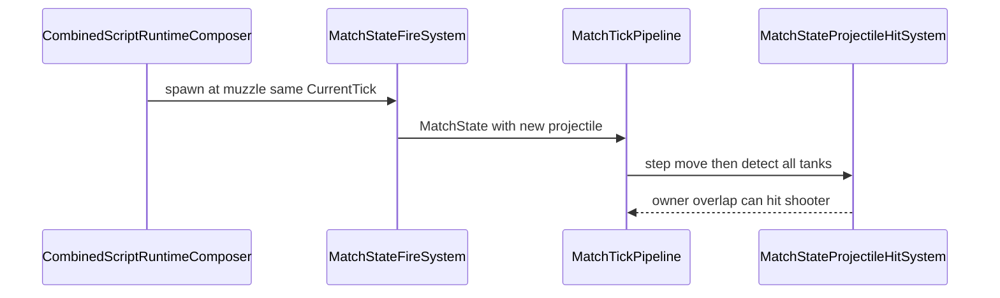

# Task 5.96 — Projectile Self-Hit / Muzzle Spawn Geometry Plan

> **Nur Dokumentation.** Keine Implementierung, keine Tests, keine Änderungen an `src/`, `tests/`, Projekten, Solution oder `game/`.
>
> Sprache: Erklärungen überwiegend auf Deutsch; Typnamen und API-Namen wie im Code auf Englisch.

## 1. Purpose

Nach Task **5.95** ([COMBINED_RUNTIME_LOGGING_CHECKPOINT.md](COMBINED_RUNTIME_LOGGING_CHECKPOINT.md)) ist der Combined-Runtime-Pfad für Runner, Replay und Combat-Logging stabil. Rich Logs zeigen die Event-Reihenfolge korrekt (`fire_request_applied`, `script_tick`, …).

Das verbleibende Problem ist **Simulations-/Kollisionsgeometrie**, nicht Logging:

> Ein script-gefeuertes Projektil kann an der Mündung spawnen, im **selben Tick** die Hitbox des Schützen überlappen und sofort per Hit-Detection deaktiviert oder „gecleared“ werden.

**Ziel dieses Plans:** Designfrage klären und eine **deterministische** Policy festlegen, bevor Projectile-/Hit-Code geändert wird:

- Kein unbeabsichtigter **Owner-Self-Hit** auf dem Spawn-Tick
- Treffer gegen **andere** Tanks bleiben erlaubt und testbar
- [`MuzzleOffsetFromCenter`](../src/ScriptTanks.Core/Weapons/WeaponDefinition.cs) bleibt Geometrie-Tuning, **kein** alleiniger Korrektheits-Mechanismus

**Test-Baseline (Repo):** 2662 Tests nach 5.95.

## 2. Current Known Symptom

Beobachteter Ablauf im Combined-Runtime-Pfad:

```text
script fire()
  → MatchFireRequest constructed/applied
  → projectile spawns at muzzle (FireMuzzlePositionResolver + ProjectileSpawnFactory)
  → CombinedRuntimeTickPipeline continues with MatchTickPipeline.Step in the SAME tick
  → MatchTickProjectilePipeline: step → hit → cleanup
  → projectile circle may overlap shooter hitbox at spawn
  → projectile deactivated / removed from MatchState.Projectiles
```

### Wichtige Unterscheidung

| Bereich | Status |
| ------- | ------ |
| **Logging** | Korrekt — [`CombinedRuntimeTickCombatLogFactory`](../src/ScriptTanks.Core/Logging/CombinedRuntimeTickCombatLogFactory.cs) / rich runner/recorder beschreiben `fire_request_applied` und Tick-Reihenfolge zuverlässig |
| **Replay** | Korrekt — Frames bleiben [`MatchState`](../src/ScriptTanks.Core/Match/MatchState.cs)-only ([`CombinedRuntimeReplayRecorder`](../src/ScriptTanks.Core/Replay/CombinedRuntimeReplayRecorder.cs)) |
| **Tick-Reihenfolge** | Korrekt — Script-Phase vor [`MatchTickPipeline`](../src/ScriptTanks.Core/Match/MatchTickPipeline.cs) ([`CombinedRuntimeTickPipeline`](../src/ScriptTanks.Core/Scripting/CombinedRuntimeTickPipeline.cs), Option A) |
| **Kollisions-Policy** | **Lücke** — Owner wird bei Overlap am Spawn nicht ausgeschlossen |

Bekannt aus [COMBINED_RUNTIME_RUNNER_REPLAY_PLAN.md](COMBINED_RUNTIME_RUNNER_REPLAY_PLAN.md) §2 / §12 und [COMBINED_RUNTIME_LOGGING_CHECKPOINT.md](COMBINED_RUNTIME_LOGGING_CHECKPOINT.md) §7.



## 3. Current Pipeline Inventory

| Area | Type / file | Role |
| ---- | ----------- | ---- |
| Combined tick | [`CombinedRuntimeTickPipeline.cs`](../src/ScriptTanks.Core/Scripting/CombinedRuntimeTickPipeline.cs) | Script compose → [`MatchTickPipeline.Step`](../src/ScriptTanks.Core/Match/MatchTickPipeline.cs) → runtime fold-back |
| Fire construction | [`ScriptMappedFireRequestConstructionPipeline.cs`](../src/ScriptTanks.Core/Scripting/ScriptMappedFireRequestConstructionPipeline.cs) | Baut [`MatchFireRequest`](../src/ScriptTanks.Core/Match/MatchFireRequest.cs) (Muzzle + Velocity + ProjectileId) |
| Muzzle resolver | [`FireMuzzlePositionResolver.cs`](../src/ScriptTanks.Core/Combat/FireMuzzlePositionResolver.cs) | `Movement.Position` + forward × `MuzzleOffsetFromCenter` |
| Velocity resolver | [`FireVelocityResolver.cs`](../src/ScriptTanks.Core/Combat/FireVelocityResolver.cs) | forward × `ProjectileSpeedPerTick` |
| Fire application | [`ScriptMappedFireRequestApplicationPipeline.cs`](../src/ScriptTanks.Core/Scripting/ScriptMappedFireRequestApplicationPipeline.cs) | Delegiert an [`MatchStateFireSystem`](../src/ScriptTanks.Core/Match/MatchStateFireSystem.cs) |
| Fire system | [`MatchStateFireSystem.cs`](../src/ScriptTanks.Core/Match/MatchStateFireSystem.cs) | [`LoadoutFireResolver`](../src/ScriptTanks.Core/Combat/LoadoutFireResolver.cs) → [`FireResolver`](../src/ScriptTanks.Core/Combat/FireResolver.cs) |
| Spawn factory | [`ProjectileSpawnFactory.cs`](../src/ScriptTanks.Core/Projectiles/ProjectileSpawnFactory.cs) | Erzeugt aktives [`ProjectileState`](../src/ScriptTanks.Core/Projectiles/ProjectileState.cs) |
| Projectile tick | [`MatchTickProjectilePipeline.cs`](../src/ScriptTanks.Core/Match/MatchTickProjectilePipeline.cs) | Step → Hit → Cleanup |
| Hit detection | [`ProjectileHitDetection.cs`](../src/ScriptTanks.Core/Projectiles/ProjectileHitDetection.cs) | Erstes Wall- oder Tank-Overlap (kein Owner-Filter) |
| Hit resolution | [`ProjectileHitResolution.cs`](../src/ScriptTanks.Core/Projectiles/ProjectileHitResolution.cs) | Schaden + Deaktivierung |
| Match hit system | [`MatchStateProjectileHitSystem.cs`](../src/ScriptTanks.Core/Match/MatchStateProjectileHitSystem.cs) | Ruft `Detect` mit **allen** Tanks auf |
| Weapon geometry | [`WeaponDefinition.cs`](../src/ScriptTanks.Core/Weapons/WeaponDefinition.cs), [`WeaponCatalog.cs`](../src/ScriptTanks.Core/Weapons/WeaponCatalog.cs) | `MuzzleOffsetFromCenter`, Radius, Reichweite |

### Relevante Tests (Ist-Verhalten)

| File | Role |
| ---- | ---- |
| [`ProjectileHitDetectionTests.cs`](../tests/ScriptTanks.Core.Tests/Projectiles/ProjectileHitDetectionTests.cs) | Low-level Hit-Query inkl. Owner-Policy |
| [`MatchStateProjectileHitSystemTests.cs`](../tests/ScriptTanks.Core.Tests/Match/MatchStateProjectileHitSystemTests.cs) | Match-State-Integration |
| [`MatchTickProjectilePipelineTests.cs`](../tests/ScriptTanks.Core.Tests/Match/MatchTickProjectilePipelineTests.cs) | Step + Hit + Cleanup in einem Pipeline-Aufruf |
| [`FireMuzzlePositionResolverTests.cs`](../tests/ScriptTanks.Core.Tests/Combat/FireMuzzlePositionResolverTests.cs) | Muzzle-Offset-Geometrie |
| [`ScriptMappedFireRequestApplicationPipelineTests.cs`](../tests/ScriptTanks.Core.Tests/Scripting/ScriptMappedFireRequestApplicationPipelineTests.cs) | Fire apply auf Runtime (ohne volle Combined-Tick-Kette in jedem Test) |

## 4. Current Geometry Assumptions

| Assumption | Detail |
| ---------- | ------ |
| Tank-Referenzpunkt | [`TankState.Movement`](../src/ScriptTanks.Core/Match/MatchState.cs).[`Position`](../src/ScriptTanks.Core/Movement/MovementState.cs) als Zentrum |
| Tank-Hitbox | Kreis mit `TankDefinition.Stats.HitboxRadius` |
| Projektil-Hitbox | Kreis: `ProjectileState.Position` + `ProjectileDefinition.Radius` |
| Mündung | [`FireMuzzlePositionResolver`](../src/ScriptTanks.Core/Combat/FireMuzzlePositionResolver.cs): Zentrum + Turm-Forward × [`WeaponDefinition.MuzzleOffsetFromCenter`](../src/ScriptTanks.Core/Weapons/WeaponDefinition.cs) (Katalog: StandardCannon/Shotgun = 1, Railgun = 2) |
| Spawn vs. Separation | Offset **reduziert** Overlap-Risiko, **garantiert** aber keine Trennung bei großem Projektilradius / kleinem Offset |
| Same-tick processing | Bewusst: neu gespawnte Projektile können in **demselben** [`MatchTickPipeline`](../src/ScriptTanks.Core/Match/MatchTickPipeline.cs)-Step bewegt und getroffen werden (Kommentar: Ereignisse dem aktuellen Tick zuordnen) |
| Owner am Spawn | [`ProjectileState.OwnerTankId`](../src/ScriptTanks.Core/Projectiles/ProjectileState.cs) wird beim Spawn gesetzt ([`FireResolver`](../src/ScriptTanks.Core/Combat/FireResolver.cs) → `shooter.Id`) |
| Spawn-Tick-Metadaten | **Nicht** auf `ProjectileState` — siehe §7–8 |

## 5. Design Options

### Option A — Owner self-hit filter (spawn / current tick)

Projektil kann den **eigenen Schützen** auf dem Spawn-Tick (oder während definierter Immunität) nicht treffen.

| Pros | Cons |
| ---- | ---- |
| Trifft die eigentliche Policy direkt | Braucht klare Spawn-Tick-Quelle (§8 — **5.97**) |
| Unabhängig von „magischem“ Muzzle-Abstand | Filter-Ort: Detection vs. Hit-System (§6) |
| Gegner-Treffer bleiben sinnvoll | Tests müssen Legacy-Verhalten ersetzen (§10) |

### Option B — Increase `MuzzleOffsetFromCenter` only

Nur größerer Abstand zur Tankmitte.

| Pros | Cons |
| ---- | ---- |
| Einfaches Weapon-Tuning | Fragil bei Radius/Hitbox-Kombinationen |
| Kann Visual/Gameplay verbessern | Keine explizite „kein Owner-Treffer“-Semantik |
| | Verschiedene Waffen/Tanks erfordern Dauer-Tuning |

### Option C — Projectile initial collision grace

Projektil ignoriert **alle** Kollisionen in der ersten Bewegungs-/Hit-Phase.

| Pros | Cons |
| ---- | ---- |
| Einfache Regel | Blockiert auch legitime Nah-Treffer auf Gegner |
| Verhindert Self-Hit | Reduziert taktische Korrektheit |

### Option D — Owner filter + explicit regression fixtures (recommended)

Option A + gezielte Tests: Self-Hit verhindert, Enemy-Hit erlaubt, deterministisch.

| Pros | Cons |
| ---- | ---- |
| Klare Simulations-Invariante | Etwas mehr Test-/Harness-Arbeit (5.98–5.99) |
| Kollision bleibt aussagekräftig | Implementierungsort + Spawn-Tick-Modell in 5.97–5.98 klären |

## 6. Recommended MVP Policy (locked)

**Empfehlung: Option D.**

| Policy | Detail |
| ------ | ------ |
| Owner self-hit | Schützer (`OwnerTankId`) wird auf dem **Spawn-Tick** nicht als Treffer-Kandidat gewertet (kein Schaden, Projektil **nicht** nur deshalb deaktivieren) |
| Enemy hit | Andere Tanks in deterministischer Reihenfolge weiter prüfen — erstes Overlap gewinnt ([`ProjectileHitDetection`](../src/ScriptTanks.Core/Projectiles/ProjectileHitDetection.cs)) |
| Dauer | **Nur** Spawn-Tick — **keine** permanente Owner-Immunität (Friendly-Fire/Ricochet später eigene Tasks) |
| Muzzle offset | Bleibt Tuning in [`WeaponCatalog`](../src/ScriptTanks.Core/Weapons/WeaponCatalog.cs) — **nicht** alleiniger Korrektheits-Garant |

### Implementierungsort (offen bis 5.97/5.98)

[`ProjectileHitDetection`](../src/ScriptTanks.Core/Projectiles/ProjectileHitDetection.cs) dokumentiert: **kein** eingebauter Owner-Filter — Caller liefert Kandidatenliste.

[`MatchStateProjectileHitSystem`](../src/ScriptTanks.Core/Match/MatchStateProjectileHitSystem.cs) übergibt heute **alle** `updatedTanks` inkl. Owner.

**5.97/5.98** entscheiden z. B.:

- Filter in `MatchStateProjectileHitSystem` vor `Detect`, oder
- erweiterte `Detect`-Signatur mit `MatchState`/Spawn-Tick-Kontext, oder
- gefilterte Kandidatenliste — unter Beibehaltung deterministischer Tank-Reihenfolge

## 7. Ownership Policy

### Bereits vorhanden

- [`ProjectileState.OwnerTankId`](../src/ScriptTanks.Core/Projectiles/ProjectileState.cs)
- Gesetzt über [`FireResolver.Resolve`](../src/ScriptTanks.Core/Combat/FireResolver.cs) mit `shooter.Id` aus [`MatchFireRequest.ShooterTankId`](../src/ScriptTanks.Core/Match/MatchFireRequest.cs)

### Noch nicht vorhanden (nur dokumentieren in 5.96)

- **`SpawnTick`** (oder äquivalent) auf `ProjectileState` — **fehlt**
- Task **5.96** fügt **kein** Feld hinzu und trifft **keine** Implementierungsentscheidung

### Verboten

- Globaler „current shooter“ ohne Projektil-Metadaten
- Runtime-only Side-Tables außerhalb `MatchState` / `ProjectileState`
- Nicht-deterministische Lookups
- Godot-/Render-Layer-Owner-Checks

## 8. Spawn Tick / Immunity Duration (policy intent only)

### MVP-Intent (in 5.96 festgehalten)

Projektil darf den **eigenen Schützen** auf dem **gleichen Simulations-Tick wie der Spawn** nicht beschädigen.

**Nicht** Teil von 5.96:

- `SpawnTick` auf [`ProjectileState`](../src/ScriptTanks.Core/Projectiles/ProjectileState.cs) implementieren
- Hit-Code ändern
- Entscheidung „Feld vs. ableiten“ treffen

### Entscheidung für Task 5.97 (offen)

| Option | Beschreibung | Tradeoffs (Kurz) |
| ------ | ------------ | ---------------- |
| **1 — `SpawnTick`-Feld** | Beim Spawn `MatchState.CurrentTick` auf Projektil speichern | Explizit, replay-freundlich, API-Erweiterung + Tests |
| **2 — Ableitung im Hit-System** | Spawn-Tick aus Match-Kontext beim Hit ableiten (z. B. `CurrentTick` wenn Projektil „neu“ in Liste) | Kein neues Feld; heikler bei Edge-Cases / Reihenfolge |

**5.96** listet beide Optionen; **5.97** wählt eine und dokumentiert Konsequenzen für 5.98.

### Verhalten beim Überspringen des Owners

- Projektil **nicht** deaktivieren, nur weil Owner-Kandidat übersprungen wurde
- Weitere Tanks in **derselben** deterministischen Reihenfolge weiter prüfen

## 9. Hit Filtering Policy (future — exact shape in 5.97/5.98)

Nur **Intent** — keine Implementierung in 5.96:

```csharp
// Pseudocode — NOT implementation in 5.96
foreach (TankState candidate in tanksInDeterministicOrder)
{
    if (projectile.OwnerTankId == candidate.Id
        && sameTickAsSpawn) // SpawnTick field OR CurrentTick derivation — 5.97 decides
    {
        continue; // skip owner on spawn tick only
    }

    if (CirclesOverlap(projectile, candidate))
    {
        return Hit(candidate);
    }
}
```

- `sameTickAsSpawn`: Quelle **TBD in 5.97**
- Reihenfolge: unverändert „first overlap wins“ wie heute

## 10. Test Strategy (implementation tasks)

### Legacy tests — old policy baseline (important)

Diese Tests dokumentieren den **bewussten Ist-Zustand** (kein automatischer Owner-Skip). Sie werden bei Policy-Umstellung zu **Breaking Changes**:

| Test | File | Bedeutung heute |
| ---- | ---- | -------------- |
| `Detect_DoesNotSkipOwnerTankAutomatically` | [`ProjectileHitDetectionTests.cs`](../tests/ScriptTanks.Core.Tests/Projectiles/ProjectileHitDetectionTests.cs) | Owner in Kandidatenliste → **Treffer** |
| `ResolveProjectileHits_DoesNotSkipOwnerTankAutomatically` | [`MatchStateProjectileHitSystemTests.cs`](../tests/ScriptTanks.Core.Tests/Match/MatchStateProjectileHitSystemTests.cs) | Owner an Spawn-Position → **Schaden** |

| Task | Aktion |
| ---- | ------ |
| **5.96** | Im Plan festhalten — Tests **nicht** ändern |
| **5.98** | Tests **gezielt anpassen oder ersetzen** + neue Positive Cases (Owner skip, Enemy hit) — Policy-Flip, kein Zufall |

### New tests (5.98 / 5.99)

| Layer | Inhalt |
| ----- | ------ |
| **Model** (nach 5.97) | `OwnerTankId` erhalten; Spawn-Tick-Metadaten je nach 5.97-Entscheidung |
| **Hit resolver** | Owner-Overlap auf Spawn-Tick → kein Schaden; Enemy-Overlap → Treffer; Verhalten ab Folgetick dokumentiert |
| **Combined runtime** | [`CombinedRuntimeTickPipelineTests`](../tests/ScriptTanks.Core.Tests/Scripting/CombinedRuntimeTickPipelineTests.cs): Fire-Fixture — Projektil überlebt Self-Overlap im selben Tick; Rich-Logs unverändert |
| **Logging / replay** | Keine Änderungen an Log-Factories/Runner/Recorder; Replay-Frames weiter nur `MatchState` |

## 11. Relationship to Logging

Logging **beobachtet** die Simulation; es **kompensiert** Self-Hit nicht.

**Nicht ändern** (5.96–5.99 unless explizit neuer Task):

- [`CombinedRuntimeTickCombatLogFactory.cs`](../src/ScriptTanks.Core/Logging/CombinedRuntimeTickCombatLogFactory.cs)
- [`LoggedCombinedRuntimeTickPipeline.cs`](../src/ScriptTanks.Core/Scripting/LoggedCombinedRuntimeTickPipeline.cs)
- [`LoggedCombinedRuntimeRunner.cs`](../src/ScriptTanks.Core/Scripting/LoggedCombinedRuntimeRunner.cs)
- [`LoggedCombinedRuntimeReplayRecorder.cs`](../src/ScriptTanks.Core/Replay/LoggedCombinedRuntimeReplayRecorder.cs)
- [`CombatLogEventTypes.cs`](../src/ScriptTanks.Core/Logging/CombatLogEventTypes.cs)

Nach Fix: `fire_request_applied` bleibt; Projektil kann in `MatchState` länger sichtbar sein — Logs spiegeln das wider, ohne Sonderfälle.

## 12. Relationship to Muzzle Geometry

[`MuzzleOffsetFromCenter`](../src/ScriptTanks.Core/Weapons/WeaponDefinition.cs) bleibt:

- waffenspezifisch und deterministisch
- über [`FireMuzzlePositionResolver`](../src/ScriptTanks.Core/Combat/FireMuzzlePositionResolver.cs) anwendbar
- sinnvoll für Gameplay/Visual-Tuning

**Nicht** als alleinige Korrektheits-Garantie behandeln.

Optional **5.100** nach stabiler Owner-Policy: Feintuning von Offset, `ProjectileRadius`, `HitboxRadius` — getrennt von Policy-Implementierung.

## 13. Recommended Follow-Up Tasks

| Task | Content |
| ---- | ------- |
| **5.97** | Spawn-Tick-Repräsentation **entscheiden**: `SpawnTick` auf `ProjectileState` vs. `CurrentTick`-Ableitung im Hit-System; Modell-/API-Inventar — **noch kein** Policy-Flip |
| **5.98** | Owner-Self-Hit-Filter implementieren; Legacy-Tests `Detect_DoesNotSkipOwnerTankAutomatically` und `ResolveProjectileHits_DoesNotSkipOwnerTankAutomatically` **ersetzen/anpassen**; neue Hit-Tests |
| **5.99** | Combined-Runtime-Regression: Fire-Projektil überlebt Spawn-Tick-Self-Overlap; Enemy-Hit weiterhin möglich |
| **5.100** | Optional: Muzzle-/Radius-Tuning nach stabiler Kollisions-Policy |

## 14. Out of Scope + Definition of Done

### Out of scope (Task 5.96)

- Kein Code in `src/` oder `tests/`
- Keine Änderung an `ProjectileState`, Hit-Resolvern, Logging, Replay-Schema, Godot
- Keine Entscheidung oder Implementierung von `SpawnTick` (→ 5.97)
- Keine Anpassung der Legacy-Owner-Tests (→ 5.98)

### Definition of Done (Task 5.96)

- [PROJECTILE_SELF_HIT_MUZZLE_GEOMETRY_PLAN.md](PROJECTILE_SELF_HIT_MUZZLE_GEOMETRY_PLAN.md) existiert mit Abschnitten 1–14
- Links: `../src/...`, `../tests/...`; Peer-`*.md` ohne `../`
- Self-Hit als Simulationsgeometrie (nicht Logging) dokumentiert
- Optionen A–D verglichen; **Option D** als MVP gesperrt
- `OwnerTankId` vorhanden, `SpawnTick` fehlt — Entscheidung explizit **5.97**
- Legacy-Tests als kommende Breaking-Policy in **5.98** markiert
- Follow-ups 5.97–5.100 gelistet
- `dotnet build ScriptTanks.sln -warnaserror` und `dotnet test ScriptTanks.sln` unverändert grün (**2662** Tests, nur Markdown)
