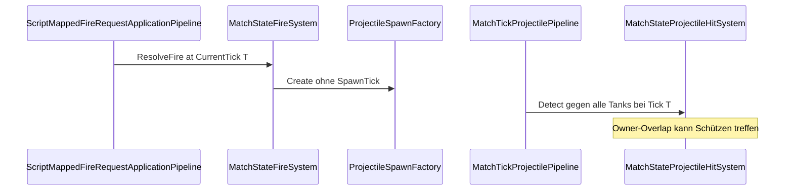

# Task 5.97 — Projectile SpawnTick Inventory

> **Nur Dokumentation.** Keine Implementierung, keine Tests, keine Änderungen an `src/`, `tests/`, Projekten, Solution oder `game/`.
>
> Task **5.97** legt Repräsentation und Integrationspunkt fest. **Kein** `ProjectileState`-Code, **kein** Hit-Filter — das ist bewusst **5.98**.
>
> Sprache: Erklärungen überwiegend auf Deutsch; Typnamen und API-Namen wie im Code auf Englisch.

## 1. Purpose

Task **5.96** ([PROJECTILE_SELF_HIT_MUZZLE_GEOMETRY_PLAN.md](PROJECTILE_SELF_HIT_MUZZLE_GEOMETRY_PLAN.md)) hat **Option D** gesperrt: Owner-Self-Hit auf dem **Spawn-Tick** verhindern, Gegner-Treffer unverändert, Muzzle-Offset nur Tuning.

Offene Frage aus 5.96 §8:

> `SpawnTick` auf [`ProjectileState`](../src/ScriptTanks.Core/Projectiles/ProjectileState.cs) hinzufügen — oder Spawn-Tick im Hit-System ableiten?

**Dieses Dokument (5.97)** liefert:

- Inventar des Ist-Zustands (Ownership, Spawn-Kette, Hit-Pfad, Tests)
- **Gesperrte Entscheidung:** `SpawnTick` auf `ProjectileState` (Ableitung-only verworfen)
- **Implementierungsreife Spezifikation für 5.98** (Filter-Regel, Integrationspunkt, Dateiliste, Test-Policy-Flip)

Logging und Replay bleiben unverändert ([COMBINED_RUNTIME_LOGGING_CHECKPOINT.md](COMBINED_RUNTIME_LOGGING_CHECKPOINT.md)).

**Test-Baseline (Repo):** 2662 Tests nach 5.95/5.96.

## 2. Inventory — Current Model and Spawn Chain

| Piece | File | Today |
| ----- | ---- | ----- |
| Projectile model | [`ProjectileState.cs`](../src/ScriptTanks.Core/Projectiles/ProjectileState.cs) | `OwnerTankId`, `OwnerWeaponSlot`; **kein** `SpawnTick`; alle `With*`-Helper propagieren Spawn-Metadaten nicht |
| Spawn factory | [`ProjectileSpawnFactory.cs`](../src/ScriptTanks.Core/Projectiles/ProjectileSpawnFactory.cs) | `Create(...)` ohne Tick-Parameter |
| Fire resolver | [`FireResolver.cs`](../src/ScriptTanks.Core/Combat/FireResolver.cs) | `SimTick currentTick` für `MarkFired`; Tick **nicht** an Factory |
| Loadout fire | [`LoadoutFireResolver.cs`](../src/ScriptTanks.Core/Combat/LoadoutFireResolver.cs) | Adapter um `FireResolver` |
| Match fire | [`MatchStateFireSystem.cs`](../src/ScriptTanks.Core/Match/MatchStateFireSystem.cs) | `ResolveFire(..., SimTick currentTick, ...)` |
| Script fire apply | [`ScriptMappedFireRequestApplicationPipeline.cs`](../src/ScriptTanks.Core/Scripting/ScriptMappedFireRequestApplicationPipeline.cs) | `ResolveFire(state, request, **state.CurrentTick**)` |
| Combined tick | [`CombinedRuntimeTickPipeline.cs`](../src/ScriptTanks.Core/Scripting/CombinedRuntimeTickPipeline.cs) | Script (Spawn bei Tick **T**) → [`MatchTickPipeline.Step`](../src/ScriptTanks.Core/Match/MatchTickPipeline.cs) (Projektil Step/Hit/Cleanup bei **T**, danach Tick **T+1**) |
| Projectile tick | [`MatchTickProjectilePipeline.cs`](../src/ScriptTanks.Core/Match/MatchTickProjectilePipeline.cs) | Step → Hit → Cleanup |
| Hit orchestration | [`MatchStateProjectileHitSystem.cs`](../src/ScriptTanks.Core/Match/MatchStateProjectileHitSystem.cs) | `Detect(projectile, arena, **alle** Tanks)` |
| Hit query | [`ProjectileHitDetection.cs`](../src/ScriptTanks.Core/Projectiles/ProjectileHitDetection.cs) | Nur Overlap gegen **übergebene** Kandidaten; kein Owner-Filter |
| Hit resolve | [`ProjectileHitResolution.cs`](../src/ScriptTanks.Core/Projectiles/ProjectileHitResolution.cs) | Schaden + Deaktivierung |
| Fire request | [`MatchFireRequest.cs`](../src/ScriptTanks.Core/Match/MatchFireRequest.cs) | `ShooterTankId`, Muzzle, Velocity, ProjectileId |

### Ownership today (sufficient for 5.98 filter)

[`ProjectileState.OwnerTankId`](../src/ScriptTanks.Core/Projectiles/ProjectileState.cs) wird beim Spawn gesetzt:

```text
MatchStateFireSystem.ResolveFire(..., currentTick, ...)
  → LoadoutFireResolver → FireResolver.Resolve(..., currentTick, ...)
    → ProjectileSpawnFactory.Create(..., shooter.Id, ...)
      → ProjectileState.OwnerTankId
```

### Spawn tick today (gap)

- `currentTick` / `state.CurrentTick` ist beim Fire-Aufruf verfügbar, wird aber **nicht** auf dem Projektil gespeichert.
- Nach [`MatchStateProjectileStepSystem`](../src/ScriptTanks.Core/Match/MatchStateProjectileStepSystem.cs) ändert sich `Position`; ohne `SpawnTick` ist das Spawn-Alter nicht am Projektil ablesbar.



## 3. Inventory — Tests (Baseline Behavior)

| Test | File | Documents |
| ---- | ---- | --------- |
| `Detect_DoesNotSkipOwnerTankAutomatically` | [`ProjectileHitDetectionTests.cs`](../tests/ScriptTanks.Core.Tests/Projectiles/ProjectileHitDetectionTests.cs) | Owner in Kandidatenliste → **Treffer** (bewusst, alt) |
| `ResolveProjectileHits_DoesNotSkipOwnerTankAutomatically` | [`MatchStateProjectileHitSystemTests.cs`](../tests/ScriptTanks.Core.Tests/Match/MatchStateProjectileHitSystemTests.cs) | Owner-Overlap → **Schaden** (bewusst, alt) |
| `ProjectileSpawnFactoryTests` | [`ProjectileSpawnFactoryTests.cs`](../tests/ScriptTanks.Core.Tests/Projectiles/ProjectileSpawnFactoryTests.cs) | Factory-Vertrag ohne `SpawnTick` (5.98 erweitern) |
| `FireResolverTests` / `MatchStateFireSystemTests` | [`FireResolverTests.cs`](../tests/ScriptTanks.Core.Tests/Combat/FireResolverTests.cs), [`MatchStateFireSystemTests.cs`](../tests/ScriptTanks.Core.Tests/Match/MatchStateFireSystemTests.cs) | Fire-Pfad; 5.98: `SpawnTick`-Assertions |
| `MatchTickProjectilePipelineTests` | [`MatchTickProjectilePipelineTests.cs`](../tests/ScriptTanks.Core.Tests/Match/MatchTickProjectilePipelineTests.cs) | Step + Hit in einem Pass (Tick unverändert während Pass) |

**5.97:** nur dokumentieren — **keine** Test-Änderungen.

## 4. Option Comparison (Decision)

### Option 1 — `SpawnTick` on `ProjectileState` (recommended, locked for 5.98)

`SimTick SpawnTick` beim Spawn setzen aus dem Tick, der bereits an `FireResolver` / `MatchStateFireSystem` übergeben wird.

| Pros | Cons |
| ---- | ---- |
| Korrekt bei **mehreren** Projektilen im selben Hit-Durchlauf | API-Erweiterung: State, Factory, `With*`, Equality, viele Test-Helper |
| Unabhängig von Positions-Update im Step | Bewusstes Code-Update in **5.98**, nicht 5.97 |
| Replay: `MatchState.Projectiles` enthält Feld automatisch | |
| Testbar: `SpawnTick == hitTick` ⇔ Spawn-Tick-Immunität | |

**Spawn-Wert-Regel (gesperrt):**

```text
SpawnTick = MatchState.CurrentTick
```

im Moment, in dem [`MatchStateFireSystem`](../src/ScriptTanks.Core/Match/MatchStateFireSystem.cs) das Projektil an `MatchState.Projectiles` anhängt (identisch zum heute übergebenen `currentTick` in [`ScriptMappedFireRequestApplicationPipeline`](../src/ScriptTanks.Core/Scripting/ScriptMappedFireRequestApplicationPipeline.cs)).

### Option 2 — Derive spawn tick only in hit system (rejected)

| Approach | Why reject |
| -------- | ----------- |
| Nur `state.CurrentTick` beim Hit | Alte Projektile werden **ebenfalls** bei `CurrentTick` verarbeitet — kein Spawn-Alter |
| „Implizit frisch gespawnt“ ohne Feld | Bricht bei Pipeline-/Reihenfolge-Änderungen; nicht replay-stabil |
| Projektillisten-Diff zum vorherigen Frame | In `ResolveProjectileHits` nicht vorhanden; aufwendig |
| Permanenter Owner-Skip | Verletzt 5.96 (nur Spawn-Tick) |

### Decision (5.97 locks, 5.98 implements)

**Option 1 — `SpawnTick` auf `ProjectileState`.**

- **5.97:** Entscheidung und 5.98-Spezifikation dokumentieren
- **5.98:** Code und Tests (bewusstes Update)

## 5. Policy Shape for 5.98 (Implementation-Ready)

### Filter rule (locked)

Für jedes Projektil in [`MatchStateProjectileHitSystem.ResolveProjectileHits`](../src/ScriptTanks.Core/Match/MatchStateProjectileHitSystem.cs) bei `SimTick hitTick = state.CurrentTick`:

```text
Für Tank-Kandidat T:
  WENN projectile.OwnerTankId == T.Id
     UND projectile.SpawnTick == hitTick
  DANN T überspringen (kein Treffer, kein Schaden über diesen Kandidaten)
  SONST normale Overlap-Prüfung (Wände unverändert zuerst)
```

| Rule | Detail |
| ---- | ------ |
| Projektil aktiv lassen | Owner überspringen **deaktiviert** das Projektil nicht |
| Nur Spawn-Tick | Bei `SpawnTick < hitTick` darf Owner wieder getroffen werden (keine Dauer-Immunität) |
| Wände | Unverändert in [`ProjectileHitDetection`](../src/ScriptTanks.Core/Projectiles/ProjectileHitDetection.cs) vor Tank-Iteration |

### Integration point (locked)

**[`MatchStateProjectileHitSystem`](../src/ScriptTanks.Core/Match/MatchStateProjectileHitSystem.cs)** filtert die **Kandidatenliste** vor [`ProjectileHitDetection.Detect`](../src/ScriptTanks.Core/Projectiles/ProjectileHitDetection.cs):

```text
candidates = tanks where NOT (tank.Id == projectile.OwnerTankId
                              AND projectile.SpawnTick == state.CurrentTick)
Detect(projectile, arena, candidates)
```

Warum diese Schicht:

| Reason | Detail |
| ------ | ------ |
| Bestehende Detection-Policy | [`ProjectileHitDetection`](../src/ScriptTanks.Core/Projectiles/ProjectileHitDetection.cs) prüft nur Overlap gegen **übergebene** Kandidaten; der **Caller** entscheidet die Tank-Liste |
| Kein Owner-Logik in `Detect` | Low-Level-Detection bleibt für Tests nutzbar, die explizite Kandidatenlisten übergeben |
| Kontext vorhanden | Hit-System hat `state.CurrentTick` und vollständiges `ProjectileState` |

**Nicht empfohlen für 5.98:** neuer `Detect`-Overload mit eingebautem Owner-Skip — verwischt „Caller shapes list“-Semantik.

### Threading `SpawnTick` (5.98 only — not 5.97)

| File | Change |
| ---- | ------ |
| [`ProjectileState.cs`](../src/ScriptTanks.Core/Projectiles/ProjectileState.cs) | `SpawnTick` Property; Ctor; alle `With*`; `Equals` / `GetHashCode` / `ToString` |
| [`ProjectileSpawnFactory.cs`](../src/ScriptTanks.Core/Projectiles/ProjectileSpawnFactory.cs) | Parameter `SimTick spawnTick` |
| [`FireResolver.cs`](../src/ScriptTanks.Core/Combat/FireResolver.cs) | `currentTick` an Factory |
| [`MatchStateProjectileHitSystem.cs`](../src/ScriptTanks.Core/Match/MatchStateProjectileHitSystem.cs) | Gefilterte Kandidaten vor `Detect` |
| Test-Helper | Explizites `SpawnTick` in allen direkten `ProjectileState`-/Factory-Konstruktionen |

**Out of scope für 5.98-Filter:** Logging, Replay-Schema, [`CombinedRuntimeTickPipeline`](../src/ScriptTanks.Core/Scripting/CombinedRuntimeTickPipeline.cs)-Reihenfolge, Muzzle-Tuning (→ 5.100).

## 6. Legacy Test Policy — Intentional Semantics Change (5.98)

Diese Tests dokumentieren den **alten, bewussten** Zustand (kein Owner-Skip). Bei neuer Spawn-Tick-Policy dürfen sie **nicht** „irgendwie gefixt“ werden — sie werden **gezielt ersetzt** als **intentionaler Semantikwechsel**, nicht als Test-Bugfix.

| Legacy test (remove/replace in 5.98) | File | Old semantics |
| ---------------------------------- | ---- | ------------- |
| `Detect_DoesNotSkipOwnerTankAutomatically` | [`ProjectileHitDetectionTests.cs`](../tests/ScriptTanks.Core.Tests/Projectiles/ProjectileHitDetectionTests.cs) | Owner in Kandidatenliste → **hit** |
| `ResolveProjectileHits_DoesNotSkipOwnerTankAutomatically` | [`MatchStateProjectileHitSystemTests.cs`](../tests/ScriptTanks.Core.Tests/Match/MatchStateProjectileHitSystemTests.cs) | Owner-Overlap → **damage** |

**5.97:** beide Tests als historische Baseline nennen — **keine** Änderung.

**5.98 replacement intents (examples):**

| New test intent |
| --------------- |
| Hit-System: gefilterte Kandidaten — Owner bei `SpawnTick == hitTick` ausgeschlossen → kein Owner-Treffer |
| Hit-System: **Enemy** im selben Tick weiter treffbar |
| Detection: mit ungefilterter Liste + älterem `SpawnTick` — Owner **kann** noch getroffen werden (Policy nicht permanent) |
| Optional Detection-Unit: explizite Kandidatenliste ohne Owner (bestehendes `Detect`-Verhalten bleibt testbar) |

PR/Commit für **5.98** sollte **policy flip** benennen, nicht „fix failing tests“.

## 7. New Tests Expected in 5.98 / 5.99

| Layer | Tests |
| ----- | ----- |
| **Model (5.98)** | `ProjectileSpawnFactory` / `FireResolver` setzen `SpawnTick` aus `currentTick` |
| **Hit system (5.98)** | Owner-Skip nur `SpawnTick == hitTick`; Enemy-Hit same tick; späterer Tick: Owner wieder Kandidat |
| **Detection (5.98)** | Gefilterte vs. ungefilterte Kandidaten (Detection selbst unverändert in Signatur) |
| **Combined (5.99)** | [`CombinedRuntimeTickPipelineTests`](../tests/ScriptTanks.Core.Tests/Scripting/CombinedRuntimeTickPipelineTests.cs): Fire-Fixture — Projektil überlebt Self-Overlap im selben Tick; Rich-Logs unverändert |

## 8. Follow-Up Task Map

| Task | Scope |
| ---- | ----- |
| **5.97** (this) | **Docs only** — `SpawnTick`-Repräsentation + Integrationspunkt + 5.98-Dateiliste; **null** Production/Test-Code |
| **5.98** | **Deliberate code/test update:** `SpawnTick` auf `ProjectileState`, gefilterte Kandidaten in `MatchStateProjectileHitSystem`, Legacy-Tests **ersetzen** (Policy-Flip) |
| **5.99** | Combined-Runtime-Regression (Projektil überlebt + Enemy-Hit) |
| **5.100** | Optional: `MuzzleOffsetFromCenter` / Radius-Tuning nach stabiler Kollisions-Policy |

Siehe auch [PROJECTILE_SELF_HIT_MUZZLE_GEOMETRY_PLAN.md](PROJECTILE_SELF_HIT_MUZZLE_GEOMETRY_PLAN.md) §13.

## 9. Out of Scope + Definition of Done

### Out of scope (Task 5.97)

- Jede Änderung an `ProjectileState`, Factory, Fire-Resolver, Hit-System
- Jede Test-Änderung
- Hit-Policy-Implementierung, Logging, Godot, Replay-Schema

Alles Obige → **5.98** (bzw. 5.99/5.100).

### Definition of Done (Task 5.97)

- [PROJECTILE_SPAWN_TICK_INVENTORY.md](PROJECTILE_SPAWN_TICK_INVENTORY.md) existiert mit Abschnitten 1–9
- `SpawnTick`-Feld-Entscheidung gesperrt; Ableitung-only verworfen
- 5.98 Filter-Regel, Integrationspunkt (`MatchStateProjectileHitSystem` + gefilterte Kandidaten), Dateiliste dokumentiert
- Legacy-Tests als 5.98 Policy-Flip benannt
- Links: `../src/...`, `../tests/...`; Peer-`*.md` ohne `../`
- `dotnet build ScriptTanks.sln -warnaserror` und `dotnet test ScriptTanks.sln` unverändert grün (**2662** Tests, nur Markdown)
