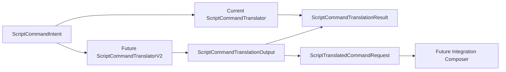

# ScriptCommandTranslator v2 Plan

## 1. Purpose

Dieses Dokument beschreibt, wie ein **zukünftiger** `ScriptCommandTranslator` v2 ein `ScriptCommandIntent` in **reine** Übersetzungsartefakte überführen soll — insbesondere in Kombination mit `ScriptTranslatedCommandRequest` (Task 5.43) und dem bestehenden `ScriptCommandTranslationResult`.

Explizit:

- **Nur Dokumentation**, **keine Implementierung** in diesem Task.
- **Keine** Kommando-Ausführung, **kein** Request-Dispatch, **keine** MatchState-Mutation.

## 2. Current Translator Limitation

Aktueller Einstieg:

`ScriptCommandTranslator.Translate(ScriptCommandIntent intent)`

Verhalten heute (siehe [`ScriptCommandTranslator.cs`](C:/ScriptTranks/src/ScriptTanks.Core/Scripting/ScriptCommandTranslator.cs)):

- `ArgumentNullException`, wenn `intent` null ist.
- `!intent.HasIntent` → `ScriptCommandTranslationResult.NoIntent()`.
- Bekannte `ScriptCommandType`-Werte → `ScriptCommandTranslationResult.Translated(...)`, mit festen **Message**-Strings („recognized“).
- Unbekannter `ScriptCommandType` → `UnsupportedCommand`.
- Es wird **kein** `ScriptTranslatedCommandRequest` erzeugt.
- **Kein** Payload-Parsing, **keine** Hardware-Prüfungen, **keine** Sensor-/Waffen-/Bewegungs-Requests.

**Kernaussage:** `ScriptCommandTranslationStatus.Translated` bedeutet derzeit **„vom Translator erkannt“**, nicht **„ausführbarer Kernel-Request erzeugt“**.

## 3. Target Translation Output

Zielbild für v2:

- Neben dem bestehenden Statusmodell soll eine **konkrete** Übersetzungsnutzlast entstehen: `ScriptTranslatedCommandRequest`.
- Konzeptueller Ablauf:

```text
ScriptCommandIntent
  → (v2 Translator)
  → ScriptTranslatedCommandRequest   // „was“ soll angefragt werden
  → ScriptCommandTranslationResult   // „ob / wie“ die Übersetzung ausging
```

Mögliche spätere Hülle (**nicht** Teil dieses Dokument-Tasks, **nicht** implementieren):

```text
ScriptCommandTranslationOutput
├─ Result   (ScriptCommandTranslationResult)
└─ Request  (ScriptTranslatedCommandRequest)
```

Semantik:

- `ScriptTranslatedCommandRequest` beschreibt die **gewünschte** Übersetzung (Kind, RoutineIndex, Command, Payload).
- `ScriptCommandTranslationResult` beschreibt **Erfolg oder Fehlerstatus** inkl. bestehender Felder (`RoutineIndex`, `Command`, `Message` wo sinnvoll).
- **Ausführung** bleibt in späteren Schichten.



## 4. Command Mapping Rules

Zuordnung je **aktueller** `ScriptCommandType` → `ScriptTranslatedCommandRequestKind` + MVP-Payload (Strings bleiben **opaque**).

### NoOp

- **Input:** `ScriptCommandType.NoOp`
- **Request:** `Kind = NoOp`, `Payload = string.Empty`
- **Verhalten:** immer als übersetzbar behandelbar; keine Spielwirkung im Translator.

### ScanEnemy

- **Request:** `Kind = ScanEnemy`
- **MVP-Payload-Empfehlung:** `"default"` (Platzhalter für späteren Sensor-Slot / Standard-Sensor)
- **Hinweise:** später Abbildung auf Sensor-Scan-Intent; **kein** Scan im Translator; Hardware-Verfügbarkeit später durch Integration.

### AimAtEnemy

- **Request:** `Kind = AimAtEnemy`
- **MVP-Payload-Empfehlung:** `"nearest_visible"`
- **Hinweise:** später Turmziel / Targeting; **keine** Turmdrehung im Translator.

### Fire

- **Request:** `Kind = Fire`
- **MVP-Payload-Empfehlung:** `"default"` (Platzhalter für Waffen-Slot / Standard-Waffe)
- **Hinweise:** später Fire-Intent; **kein** Projektil-Spawning im Translator.

### MoveToPatrolPoint

- **Request:** `Kind = MoveToPatrolPoint`
- **MVP-Payload-Empfehlung:**
  - Wenn `command.Argument` **leer:** `"next"`
  - Wenn **nicht leer:** `command.Argument` **verbatim**
- **Hinweise:** **kein** Pathfinding im Translator; Payload bleibt opaque bis Movement-Integration.

### Retreat

- **Request:** `Kind = Retreat`
- **MVP-Payload-Empfehlung:** `"away_from_nearest_visible"`
- **Hinweise:** **kein** Bewegungsvektor im Translator; finale Geometrie gehört Movement-/Kontext-Schicht.

`RoutineIndex` im Request entspricht **`intent.RoutineIndex`** bei gültigem Intent; `Command` entspricht dem `ScriptCommand` aus dem Intent.

## 5. Payload Policy

- Payload ist **bewusst ein opaker `string`** (kein eingebettetes Objekt, keine MatchState-Referenz).
- v2 darf **leere** Arguments **deterministisch** auf MVP-Defaults abbilden (siehe Abschnitt 4).
- Explizite Argumente werden **verbatim** übernommen, wo das Design es vorsieht (z. B. `MoveToPatrolPoint` mit nicht-leerem Argument).
- **Kein** Parsen komplexer Ausdrücke, **kein** JSON-Zwang in MVP.
- Empfohlene MVP-Zuordnung (Kurzüberblick):

| Command              | MVP-Payload                              |
|----------------------|------------------------------------------|
| NoOp                 | `""`                                     |
| ScanEnemy            | `"default"`                              |
| AimAtEnemy           | `"nearest_visible"`                      |
| Fire                 | `"default"`                              |
| MoveToPatrolPoint    | leeres Argument → `"next"`, sonst Arg. |
| Retreat              | `"away_from_nearest_visible"`            |

## 6. Validation Rules

**Eingabe**

- `intent == null` → `ArgumentNullException`, `ParamName` `"intent"`.

**Kein Intent**

- `!intent.HasIntent` → Ergebnis: `ScriptCommandTranslationResult.NoIntent()` (bestehendes Muster), Request: `ScriptTranslatedCommandRequest.None()` — sobald Output-Modell existiert.

**Kommando**

- `ScriptCommand` validiert bereits definierten `ScriptCommandType` im Konstruktor.
- `switch`/Äquivalent: für nicht unterstützte Typen → `UnsupportedCommand` (wie heute), Request → `None()` (Invariante mit Abschnitt 9 abstimmen).

**Argumente**

- Leerstring und Whitespace sind im MVP erlaubt; spätere Normalisierung nur bei **expliziter** Policy.
- „Ungültige“ Nutzerargumente **nicht** durch Exceptions im Translator, solange Basis-Invarianten (`ScriptCommand`) nicht verletzt sind → eher `InvalidCommandArgument`, wenn ein zukünftiger Parser/Validator greift.

**RoutineIndex**

- Bei `HasIntent == true` sollte `RoutineIndex >= 0` über `ScriptRoutineDecision`/`ScriptCommandIntent` bereits gelten.
- Falls defensiv negativ: vor Implementierung festlegen (harte Ausnahme vs. Fehlerresultat); nicht in diesem Dokument festlegen.

## 7. Translation Result Semantics

Anknüpfung an [`ScriptCommandTranslationStatus`](C:/ScriptTranks/src/ScriptTanks.Core/Scripting/ScriptCommandTranslationStatus.cs):

| Status | Bedeutung (v2-Zielbild) |
|--------|-------------------------|
| `NoIntent` | Keine Kommandowahl — kein Request. |
| `Translated` | `ScriptTranslatedCommandRequest` wurde erzeugt; **keine** Ausführung, **kein** Dispatch; Hardware kann später fehlschlagen. |
| `UnsupportedCommand` | Typ wird von v2 nicht unterstützt. |
| `InvalidCommandArgument` | Typ bekannt, Argument nicht übersetzbar (nach späteren Regeln). |
| `MissingHardware` | **Empfehlung:** im reinen Intent→Request-Translator **nicht** setzen ohne Hardware-/Loadout-Kontext; Verfügbarkeit später im Integration-Composer. |

## 8. Determinism and Purity Boundaries

Strikte Anforderungen für v2:

- Keine Wall-Clock-Zeit, kein Zufall.
- Kein Zugriff auf `MatchState`, Sensor-, Waffen- oder Movement-Laufzeitdaten im **Translator** selbst (reines Intent + `ScriptCommand`).
- Keine Mutation von Eingaben oder globalen Simulationsobjekten.
- Abbildung `(ScriptCommandType, Argument)` → `(Kind, Payload)` **deterministisch** (inkl. MVP-Defaults).
- Keine kulturabhängige Stringverarbeitung für Kernentscheidungen.
- Korrektheit der Tests unabhängig von Allokationsmustern.

## 9. Error and Missing Data Policy

- Kein Intent → kein übersetzter Request (`None`).
- Nicht unterstützter Befehl → Fehlerstatus (`UnsupportedCommand`), Request **`None()`** (empfohlen).
- Ungültiges Argument (sobald modelliert) → `InvalidCommandArgument`, Request **`None()`**.
- Fehlende Hardware: ohne zusätzliche Inputs **nicht** im Translator entscheiden; Integration später.

**Empfehlung für `ScriptCommandTranslationOutput`:**

- Bei `NoIntent` oder jedem **Fehlerstatus**: `Request` = `ScriptTranslatedCommandRequest.None()`.
- Nur wenn `Status == Translated`: konkreter `ScriptTranslatedCommandRequest` mit `HasRequest == true`.

Ob Fehlertexte in der Evaluation-Trace bestehen bleiben, entscheidet die Runtime-Pipeline — nicht der Translator allein.

## 10. Future Integration Path

**Phase A — Translator v2 reine Ausgabe**

- Einführen eines Wrapper-Modells `ScriptCommandTranslationOutput` (`Result` + `Request`) — siehe Task 5.44A.
- v2-API parallel zu bestehendem `ScriptCommandTranslator.Translate` (Task 5.44B), **ohne** das status-only Verhalten zu brechen.

**Phase B — Runtime-Pipeline v2**

- Optional parallele Kette:  
  `ScriptRuntimeDecisionPipeline` → `ScriptCommandIntent` → **TranslatorV2** → `ScriptCommandTranslationOutput`.

**Phase C — Integration Composer**

- Abbildung `ScriptTranslatedCommandRequest` → domänenspezifische **reine** Requests (z. B. `MatchSensorScanRequest`, `MatchFireRequest`, später Movement).

**Phase D — Execution**

- Erst nach stabilen reinen Modellen an Tick-Systeme koppeln.

## 11. Test Strategy

Geplante Tests **nach** Implementierung (nicht Gegenstand von Task 5.44):

**Translator v2**

- Null-Intent.
- No-Intent → `NoIntent` + `Request.None()`.
- Pro `ScriptCommandType`: erwarteter `Kind`, erwarteter MVP-Payload.
- `MoveToPatrolPoint`: leeres Argument → `"next"`; nicht-leer → verbatim.
- `Translated` nur wenn konkreter Request mit `HasRequest`.
- Unsupported → `UnsupportedCommand` + `None()` (sofern invariant).
- Invalid argument → `InvalidCommandArgument`, wenn Validator existiert.
- RoutineIndex durchgereicht.
- Mehrfachaufrufe gleicher Eingabe → gleiche Ausgabe; keine Mutation.

**Output-Wrapper**

- Null-`Result` / null-`Request` abweisen (sofern API das vorsieht).
- Bei `Translated`: Request muss vorhanden sein (`HasRequest`).
- Bei Fehler: kein ausführbarer Request (`None()`), falls so spezifiziert.

## 12. Out of Scope

- Keine Implementierung in Task 5.44.
- Keine Änderung am bestehenden `ScriptCommandTranslator`.
- Kein `ScriptCommandTranslationOutput`-Typ in diesem Task.
- Keine Ausführung (Sensor/Waffe/Movement), kein MatchState-Zugriff, keine Hardware-/Cooldown-Prüfung im Translator.
- Kein Scheduler, kein CPU-Budget, kein Logging/Diagnostics/Godot.

## 13. Recommended Next Tasks

1. **Task 5.44A — ScriptCommandTranslationOutput Model** — reiner Wrapper aus `ScriptCommandTranslationResult` + `ScriptTranslatedCommandRequest`.
2. **Task 5.44B — ScriptCommandTranslatorV2** — paralleler Translator mit `ScriptCommandTranslationOutput`, bestehenden Translator unverändert lassen.
3. **Task 5.45 — MatchScriptRuntimeState Pairing Plan** — Dokumentation: Paarung von Script-Requests mit Match-Tanks und Runtime-State.
4. **Task 5.46 — First Pure Integration Composer** — Abbildung übersetzter Script-Requests auf bestehende domänenreine Request-Modelle, weiterhin **ohne** MatchState-Mutation.

---

*Plan-Dokument Task 5.44. Verweise auf Code beschreiben den zum Dokumentationszeitpunkt bestehenden Stand; bei API-Änderungen Plan anpassen.*
