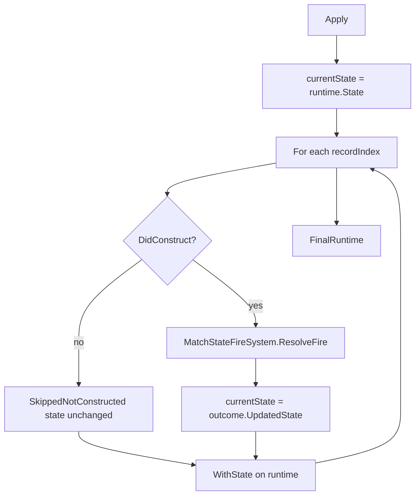

# Task 5.72 — Script-Mapped Fire Request Application Plan

> **Nur Dokumentation.** Keine Implementierung, keine Tests, keine Änderungen an `src/`, `tests/`, Projekten, Solution oder `game/`.
>
> Sprache: Erklärungen überwiegend auf Deutsch; Typnamen und API-Skizzen wie im Code auf Englisch.

## 1. Purpose

Dieses Dokument definiert die **geplante nächste Grenze** nach [`ScriptMappedFireRequestConstructionPipeline`](../src/ScriptTanks.Core/Scripting/ScriptMappedFireRequestConstructionPipeline.cs) (Task 5.71): wie bereits **konstruierte** [`MatchFireRequest`](../src/ScriptTanks.Core/Match/MatchFireRequest.cs)-Werte später auf [`MatchState`](../src/ScriptTanks.Core/Match/MatchState.cs) angewendet werden — über die **bestehenden** Fire-Ausführungssysteme, ohne neue Spawn- oder Cooldown-Logik in der Script-Schicht.

### Zwei getrennte Fragen

| Schicht | Frage | Status nach 5.71 |
| ------- | ----- | ----------------- |
| **Konstruktion** | Kann aus Script-Mapping ein gültiger `MatchFireRequest` gebaut werden? | **Ja** — `Constructed` + non-null Request |
| **Anwendung** | Soll der Request den `MatchState` ändern (Cooldown, Projektil)? | **Nein** — noch nicht implementiert |

**Konstruktion** entscheidet, ob ein Request **existieren darf**. **Anwendung** entscheidet, ob und wie dieser Request den Spielzustand **mutiert**.

Die geplante Anwendungsschicht konsumiert:

- [`MatchSensorRuntimeState`](../src/ScriptTanks.Core/Sensors/MatchSensorRuntimeState.cs) (Einstiegs-Snapshot)
- [`ScriptMappedFireRequestConstructionPipelineResult`](../src/ScriptTanks.Core/Scripting/ScriptMappedFireRequestConstructionPipelineResult.cs) (`ConstructionResult` + `FinalProjectileIdSequence`)

und liefert:

- aktualisiertes [`MatchSensorRuntimeState`](../src/ScriptTanks.Core/Sensors/MatchSensorRuntimeState.cs) (über [`WithState`](../src/ScriptTanks.Core/Sensors/MatchSensorRuntimeState.cs))
- ein Anwendungsergebnis **pro Konstruktions-Record** (gleiche Länge wie `ConstructionResult.Count`)

### Zielkette nach 5.71 (nur Konstruktion)

```text
script fire()
→ domain Weapon
→ muzzle Resolved
→ velocity Resolved
→ ProjectileId allocated
→ MatchFireRequest constructed
→ (stoppt hier heute)
```

### Zielkette nach 5.74 (geplant, Anwendung)

```text
… MatchFireRequest constructed
→ MatchStateFireSystem.ResolveFire (pro Constructed-Record)
→ weapon cooldown updated (bei Erfolg)
→ projectile appended (bei Erfolg)
→ MatchState changed
```

**Task 5.72 implementiert die Anwendung nicht** — nur diese Spezifikation.

## 2. Current State After Task 5.71

### Konstruktions-Pipeline (Ist)

[`ScriptMappedFireRequestConstructionPipeline.Construct`](../src/ScriptTanks.Core/Scripting/ScriptMappedFireRequestConstructionPipeline.cs):

- `Weapon` + `Fire` → [`ScriptMappedFireRequestConstructionStatus.Constructed`](../src/ScriptTanks.Core/Scripting/ScriptMappedFireRequestConstructionStatus.cs) mit non-null [`MatchFireRequest`](../src/ScriptTanks.Core/Match/MatchFireRequest.cs)
- Ruft [`FireMuzzlePositionResolver`](../src/ScriptTanks.Core/Combat/FireMuzzlePositionResolver.cs) und [`FireVelocityResolver`](../src/ScriptTanks.Core/Combat/FireVelocityResolver.cs) auf
- [`ProjectileIdSequence.AllocateNext()`](../src/ScriptTanks.Core/Ids/ProjectileIdSequence.cs) **nur** bei `Constructed`
- Keine Ausführung, kein Spawn, keine `MatchState`-Mutation

### Script-Runtime-Orchestrierung (Ist)

[`MatchScriptSensorRuntimeComposer.Run`](../src/ScriptTanks.Core/Scripting/MatchScriptSensorRuntimeComposer.cs):

```text
integration → domain mapping → sensor application
```

**Kein** Fire-Konstruktions- oder Fire-Anwendungs-Schritt im Composer.

### Fire-Ausführung (Ist)

[`MatchStateFireSystem.ResolveFire`](../src/ScriptTanks.Core/Match/MatchStateFireSystem.cs) existiert und wird in Tests/direkten Aufrufen genutzt — **nicht** aus der Script-Mapped-Fire-Pipeline heraus.

## 3. Existing Fire Execution Inventory

Aus dem Ist-Stand des Kerns (keine erfundenen Typen):

| Bereich | Typ / API | Rolle (Kurz) |
| ------- | --------- | -------------- |
| Fire-Request | [`MatchFireRequest`](../src/ScriptTanks.Core/Match/MatchFireRequest.cs) | `ShooterTankId`, `WeaponSlot`, `ProjectileId`, `MuzzlePosition`, `FireVelocity` — reiner Daten-Container |
| Match-Fire-Adapter | [`MatchStateFireSystem`](../src/ScriptTanks.Core/Match/MatchStateFireSystem.cs) | Tank per `TankId` suchen; [`LoadoutFireResolver`](../src/ScriptTanks.Core/Combat/LoadoutFireResolver.cs); Loadout ersetzen; bei Erfolg Projektil an `MatchState.Projectiles` anhängen |
| Match-Fire-Ergebnis | [`MatchStateFireOutcome`](../src/ScriptTanks.Core/Match/MatchStateFireOutcome.cs) | `DidFire`, `UpdatedState`, `SpawnedProjectile?`; Fabriken `Fired` / `NotReady` |
| Loadout-Fire | [`LoadoutFireResolver`](../src/ScriptTanks.Core/Combat/LoadoutFireResolver.cs) | Delegiert [`FireResolver`](../src/ScriptTanks.Core/Combat/FireResolver.cs); neues `TankWeaponLoadout` |
| Loadout-Ergebnis | [`LoadoutFireResolutionOutcome`](../src/ScriptTanks.Core/Combat/LoadoutFireResolutionOutcome.cs) | `DidFire`, `UpdatedLoadout`, `SpawnedProjectile?` |
| Waffen-Fire | [`FireResolver`](../src/ScriptTanks.Core/Combat/FireResolver.cs) | `WeaponState.IsReady(currentTick)`; [`ProjectileSpawnFactory.Create`](../src/ScriptTanks.Core/Projectiles/ProjectileSpawnFactory.cs); `MarkFired` |
| Waffen-Ergebnis | [`FireResolutionOutcome`](../src/ScriptTanks.Core/Combat/FireResolutionOutcome.cs) | `DidFire`, `UpdatedWeapon`, `SpawnedProjectile?` |
| Projektil-Spawn | [`ProjectileSpawnFactory`](../src/ScriptTanks.Core/Projectiles/ProjectileSpawnFactory.cs) | Baut [`ProjectileState`](../src/ScriptTanks.Core/Projectiles/ProjectileState.cs); keine Tank-Geometrie |
| Projektil-Laufzeit | [`ProjectileState`](../src/ScriptTanks.Core/Projectiles/ProjectileState.cs) | Position, `VelocityPerTick`, Range, Owner |
| Waffe | [`WeaponState`](../src/ScriptTanks.Core/Weapons/WeaponState.cs), [`WeaponSlot`](../src/ScriptTanks.Core/Weapons/WeaponSlot.cs), [`WeaponDefinition`](../src/ScriptTanks.Core/Weapons/WeaponDefinition.cs) | Cooldown: `IsReady` / `MarkFired` |
| Match / Runtime | [`MatchState`](../src/ScriptTanks.Core/Match/MatchState.cs), [`MatchSensorRuntimeState`](../src/ScriptTanks.Core/Sensors/MatchSensorRuntimeState.cs) | `CurrentTick`; Tanks/Loadouts/Projectiles |
| Konstruktion | `ScriptMappedFireRequestConstruction*` | Pipeline, Result, Record, Status (5.55–5.71) |
| Sensor-Spiegel | [`ScriptMappedSensorRequestApplicationPipeline`](../src/ScriptTanks.Core/Scripting/ScriptMappedSensorRequestApplicationPipeline.cs) | Sequentielles Apply; `current` Runtime-Threading |

**Empfohlener Delegat für 5.74:** `MatchStateFireSystem.ResolveFire(state, request, state.CurrentTick)` — **nicht** direkt `FireResolver` aus der Script-Schicht.

## 4. Application Input Shape

### Empfohlene API (Spiegel Sensor + Konstruktions-Wrapper)

```csharp
public static class ScriptMappedFireRequestApplicationPipeline
{
    public static ScriptMappedFireRequestApplicationResult Apply(
        MatchSensorRuntimeState runtime,
        ScriptMappedFireRequestConstructionPipelineResult constructionPipelineResult);
}
```

### Warum `MatchSensorRuntimeState` (nicht nur `MatchState`)

Die Script-Runtime-Pipeline ist um [`MatchSensorRuntimeState`](../src/ScriptTanks.Core/Sensors/MatchSensorRuntimeState.cs) aufgebaut ([`MatchScriptSensorRuntimeComposer`](../src/ScriptTanks.Core/Scripting/MatchScriptSensorRuntimeComposer.cs), Konstruktion mit gleicher Runtime-Referenz-Regel).

Die Anwendung **mutiert nur** `State` im zurückgegebenen Runtime:

```csharp
currentRuntime = currentRuntime.WithState(currentState);
```

[`SensorLoadouts`](../src/ScriptTanks.Core/Sensors/MatchSensorLoadoutState.cs) bleiben unverändert (Fire ändert keine Sensor-Scans in dieser Schicht).

### Validierung

Analog Konstruktion/Sensor:

- `runtime == null` → `ArgumentNullException`
- `constructionPipelineResult == null` → `ArgumentNullException`
- `runtime` muss **dieselbe Referenz** sein wie `constructionPipelineResult.ConstructionResult.MappingResult.IntegrationResult.Runtime`

### Input-Records

Iteration über **`constructionPipelineResult.ConstructionResult`** (`Count`, `GetRecordAtIndex`) — nicht nur rohes Domain-Mapping. Anwendung ist an **Konstruktions-Ergebnisse** gebunden (`DidConstruct`, `FireRequest`).

## 5. Application Record Model Sketch

Geplant in Task **5.73** (noch nicht im Repo):

```text
ScriptMappedFireRequestApplicationRecord
├─ RecordIndex
├─ ScriptMappedFireRequestConstructionRecord ConstructionRecord
├─ ScriptMappedFireRequestApplicationStatus Status
├─ bool DidApply
└─ MatchStateFireOutcome? FireOutcome    // nur wenn ResolveFire aufgerufen wurde
```

`MatchFireRequest` kommt über `ConstructionRecord.FireRequest` (nur bei `Constructed`).

### Geplante Application-Status (Enum, 5.73)

| Status | Bedeutung |
| ------ | --------- |
| `SkippedNotConstructed` | Konstruktion ≠ `Constructed` — kein `ResolveFire` |
| `Applied` | `MatchStateFireOutcome.DidFire == true` |
| `FireRejected` | Konstruiert, aber `DidFire == false` (z. B. Waffe nicht ready) |

### `DidApply`-Invariante (geplant)

| Status | `DidApply` |
| ------ | ---------- |
| `SkippedNotConstructed` | `false` |
| `Applied` | `true` |
| `FireRejected` | `false` |

Analog [`ScriptMappedSensorRequestApplicationRecord.DidApply`](../src/ScriptTanks.Core/Scripting/ScriptMappedSensorRequestApplicationRecord.cs): `DidApply` bedeutet „Schuss wurde angewendet“, nicht „Pipeline hat einen Record verarbeitet“.

## 6. Batch Result Model Sketch

```text
ScriptMappedFireRequestApplicationResult
├─ ScriptMappedFireRequestConstructionPipelineResult ConstructionPipelineResult
├─ MatchSensorRuntimeState FinalRuntime
├─ ScriptMappedFireRequestApplicationRecord[] Records
└─ Count (= Records.Length)
```

**Invariante:** `Records.Length == ConstructionPipelineResult.ConstructionResult.Count` (wie bei Sensor: Application-Count = Mapping/Construction-Count).

Optional später: separates Pipeline-Result-Wrapper — für 5.73/5.74 reicht ein Batch-Result analog [`ScriptMappedSensorRequestApplicationResult`](../src/ScriptTanks.Core/Scripting/ScriptMappedSensorRequestApplicationResult.cs).

## 7. Deterministic Ordering

Konstruierte Requests werden in **Konstruktions-Record-Reihenfolge** angewendet:

```text
recordIndex = 0 .. ConstructionResult.Count - 1
```

- **Keine** Sortierung nach `TankId`
- **Keine** Sortierung nach `ProjectileId`
- Reihenfolge = Reihenfolge aus Intent-Integration / Mapping / Konstruktions-Loop

Das ist konsistent mit [`ScriptMappedSensorRequestApplicationPipeline`](../src/ScriptTanks.Core/Scripting/ScriptMappedSensorRequestApplicationPipeline.cs) (Index-Reihenfolge).

## 8. State Threading Policy

Bei mehreren `Constructed`-Records in einem `Apply`-Aufruf:

```text
currentRuntime = input runtime
currentState = currentRuntime.State

for recordIndex in 0 .. Count-1:
  constructionRecord = ConstructionResult[recordIndex]

  if constructionRecord.DidConstruct:
    request = constructionRecord.FireRequest!.Value
    outcome = MatchStateFireSystem.ResolveFire(
        currentState,
        request,
        currentState.CurrentTick)
    currentState = outcome.UpdatedState    // immer, siehe §11 FireRejected
  // else: SkippedNotConstructed — currentState unverändert

  currentRuntime = currentRuntime.WithState(currentState)

return FinalRuntime = currentRuntime
```

**Wichtig:** Der zweite `Constructed`-Fire im selben Batch sieht Cooldown- und Projektil-Änderungen des ersten — **erforderlich** für deterministisches Verhalten.



## 9. Cooldown Policy

### Bestehendes Verhalten (nicht umgehen)

[`FireResolver.Resolve`](../src/ScriptTanks.Core/Combat/FireResolver.cs):

```text
if (!weapon.IsReady(currentTick))
    return FireResolutionOutcome.NotReady(weapon);
```

- Readiness über [`WeaponState.IsReady(SimTick)`](../src/ScriptTanks.Core/Weapons/WeaponState.cs)
- Bei Erfolg: [`MarkFired(currentTick)`](../src/ScriptTanks.Core/Weapons/WeaponState.cs)

Die Anwendungs-Pipeline **darf nicht**:

- Readiness umgehen
- `MarkFired` manuell aufrufen
- Cooldown außerhalb von `FireResolver` / `LoadoutFireResolver` setzen

### Tick-Quelle

`currentTick = currentState.CurrentTick` zum Zeitpunkt des `ResolveFire`-Aufrufs (nicht Wall-Clock, nicht versteckter globaler Zähler).

Konstruktion prüft Cooldown **nicht** — ein `Constructed`-Request kann trotzdem bei Anwendung `FireRejected` werden, wenn die Waffe zwischen Konstruktion und Apply nicht mehr ready ist (selten im selben synchronen `Apply`, aber korrekt modelliert).

## 10. Projectile Policy

Projektil-Erzeugung **ausschließlich** über die bestehende Kette:

```text
MatchStateFireSystem
→ LoadoutFireResolver
→ FireResolver
→ ProjectileSpawnFactory.Create
→ MatchStateFireSystem hängt ProjectileState an (nur bei DidFire)
```

Die Script-Anwendungs-Pipeline **darf nicht**:

- [`ProjectileSpawnFactory`](../src/ScriptTanks.Core/Projectiles/ProjectileSpawnFactory.cs) direkt aufrufen und Listen manuell patchen
- `MatchState.Projectiles` selbst mutieren
- Spawn-Logik duplizieren

[`MatchFireRequest`](../src/ScriptTanks.Core/Match/MatchFireRequest.cs) liefert bereits `MuzzlePosition` und `FireVelocity` — die werden an `ResolveFire` durchgereicht (keine erneute Ableitung in der Anwendungsschicht).

## 11. Failure Semantics

| Fall | Application-Status | `DidApply` | `currentState` nach Record |
| ---- | ------------------- | ---------- | ------------------------- |
| Konstruktion ≠ `Constructed` | `SkippedNotConstructed` | `false` | unverändert |
| Konstruiert + `DidFire == true` | `Applied` | `true` | `outcome.UpdatedState` (`Fired`) |
| Konstruiert + Waffe nicht ready | `FireRejected` | `false` | **`outcome.UpdatedState`** (`NotReady`) |
| `ShooterTankId` unbekannt in `MatchState` | — | — | **`InvalidOperationException`** |

### `FireRejected` — präzise Formulierung

- **`DidApply == false`** — kein Schuss wurde angewendet (kein Projektil gespawnt).
- **Threading:** `currentState = outcome.UpdatedState` **trotzdem** nach jedem `ResolveFire`, auch bei [`MatchStateFireOutcome.NotReady`](../src/ScriptTanks.Core/Match/MatchStateFireOutcome.cs).
- [`MatchStateFireSystem`](../src/ScriptTanks.Core/Match/MatchStateFireSystem.cs) liefert bei `NotReady` ein `UpdatedState` mit ersetztem Loadout (`afterLoadouts`), auch wenn `DidFire` false ist — die Anwendungs-Pipeline bleibt konsistent mit dem Fire-System-Outcome.
- Praktisch kann der Snapshot identisch wirken; trotzdem **immer** `UpdatedState` übernehmen, nicht den Eingabe-`currentState` bei `FireRejected` stehen lassen.

### Unknown shooter id — Programmer-/Invariant-Fehler

Wenn Konstruktion einen `MatchFireRequest` mit `ShooterTankId` erzeugt, der in `currentState.Tanks` **nicht** vorkommt:

- [`MatchStateFireSystem`](../src/ScriptTanks.Core/Match/MatchStateFireSystem.cs) wirft [`InvalidOperationException`](https://learn.microsoft.com/dotnet/api/system.invalidoperationexception)
- Das ist **kein** normaler Gameplay-Status und **kein** `ScriptMappedFireRequestApplicationStatus`
- Bedeutet Daten-/Invariant-Verletzung zwischen Konstruktion (`TankId` / `TankIndex`) und Application-Snapshot — nicht Cooldown
- **Nicht** als `FireRejected` modellieren

### Exceptions vs. Status

| Situation | Verhalten |
| --------- | --------- |
| Cooldown / not ready | Status `FireRejected`, keine Exception |
| Null runtime / ungültige Referenz | Exception (Programmierfehler) |
| Unbekannte Shooter-`TankId` | Exception (Invariant-/Datenfehler) |

## 12. Purity / Mutation Boundary

Die Fire-Anwendungsschicht ist die **erste beabsichtigte `MatchState`-Mutations-Schicht** für Script-Mapped-Fire.

| Erlaubt | Verboten |
| ------- | -------- |
| `MatchStateFireSystem.ResolveFire` aufrufen | Godot / Render |
| Neues `MatchSensorRuntimeState` mit `WithState` zurückgeben | CombatLog, Replay |
| `MatchStateFireOutcome` auf Records speichern | Sensor-Scans ausführen |
| | Movement / Turm ausführen |
| | MatchRunner, Scheduler, CPU-Budget |
| | Manuelles Einfügen in `Projectiles` ohne Fire-System |

Konstruktion bleibt **read-only** auf `MatchState`; Anwendung ist die Grenze zu **Zustandsübergang**.

## 13. Relationship to Sensor Application

Vergleich mit [`ScriptMappedSensorRequestApplicationPipeline`](../src/ScriptTanks.Core/Scripting/ScriptMappedSensorRequestApplicationPipeline.cs):

| Aspekt | Sensor | Fire (geplant) |
| ------ | ------ | -------------- |
| Einstieg | `MatchSensorRuntimeState` + `MatchScriptDomainRequestMappingResult` | `MatchSensorRuntimeState` + `ScriptMappedFireRequestConstructionPipelineResult` |
| Eligibility | `Category == Sensor` + `SensorRequest` | `ConstructionRecord.DidConstruct` |
| Delegate | [`MatchSensorRuntimeTickScanPipeline`](../src/ScriptTanks.Core/Sensors/MatchSensorRuntimeTickScanPipeline.cs) | [`MatchStateFireSystem`](../src/ScriptTanks.Core/Match/MatchStateFireSystem.cs) |
| Mutiert | Sensor-Runtime / Scan-Zustand | `MatchState` (Loadouts, Projectiles) |
| Skip-Record | `didApply: false`, kein Scan | `SkippedNotConstructed`, kein `ResolveFire` |
| Threading | `current = outcome.UpdatedRuntime` | `currentState = outcome.UpdatedState` |

Fire unterscheidet sich: **mutiert Match-Kern** (Projektile, Waffen-Cooldown), nicht nur Sensor-Overlay.

## 14. Relationship to Future Combined Composer

Geplante Gesamtkette (authoritativ für Follow-ups; **5.75** integriert, nicht 5.72):

```text
Script intent integration
→ domain mapping
→ sensor application                    (existiert: MatchScriptSensorRuntimeComposer)
→ fire request construction             (5.71)
→ fire request application              (5.74)
→ movement / turret                     (später)
```

[`MatchScriptSensorRuntimeComposer`](../src/ScriptTanks.Core/Scripting/MatchScriptSensorRuntimeComposer.cs) wird **erst in 5.75** erweitert — nicht in 5.72/5.73/5.74.

Mögliche 5.75-Reihenfolge innerhalb eines Ticks (Skizze):

```text
runtime₀
→ sensor Apply → runtime₁
→ fire Construct (auf runtime₁ oder mapping von runtime₁)
→ fire Apply → runtime₂ (Final)
```

Exakte Composer-Signatur und Zwischenresultate gehören in den **5.75**-Plan.

## 15. Recommended Follow-up Tasks

**Feste Reihenfolge — Schritte nicht überspringen, Composer nicht vorziehen:**

| Task | Inhalt |
| ---- | ------ |
| **5.73** | Application-**Modelle** nur: `ScriptMappedFireRequestApplicationStatus`, `ScriptMappedFireRequestApplicationRecord`, `ScriptMappedFireRequestApplicationResult` (+ Invarianten wie Sensor/Konstruktion) |
| **5.74** | [`ScriptMappedFireRequestApplicationPipeline`](../src/ScriptTanks.Core/Scripting/ScriptMappedFireRequestApplicationPipeline.cs) — erste Implementierung gemäß §4–11 |
| **5.75** | Kombinierter Script-Runtime-Composer: Sensor + Fire-Konstruktion + Fire-Anwendung |

| Regel | Detail |
| ----- | ------ |
| **Nicht in 5.73/5.74** | [`MatchScriptSensorRuntimeComposer`](../src/ScriptTanks.Core/Scripting/MatchScriptSensorRuntimeComposer.cs) nicht erweitern; kein End-to-End-Script-Fire bis **5.75** |
| **Nicht in 5.72** | Nur dieses Dokument |

**Begründung:** Modelle (5.73) → isolierte Anwendungs-Pipeline (5.74) → Composer-Integration (5.75). Vermeidet, Anwendungslogik direkt in bestehende Fire-System-Aufrufer zu schieben oder den Composer zu bauen, bevor Modelle und Pipeline existieren.

## 16. Out of Scope and Definition of Done

### Out of Scope (Task 5.72)

- Implementierung oder Tests im Repo
- `ScriptMappedFireRequestApplicationPipeline` / Application-Modelle
- [`MatchScriptSensorRuntimeComposer`](../src/ScriptTanks.Core/Scripting/MatchScriptSensorRuntimeComposer.cs)-Erweiterung
- [`MatchRunner`](../src/ScriptTanks.Core/Match/MatchRunner.cs), CombatLog, Replay, Godot
- Movement-/Turm-Anwendung
- Scheduler / CPU-Budget
- Bearbeitung anderer Plan-Dateien (außer dieser neuen Datei)

### Definition of Done (Task 5.72)

- [`docs/SCRIPT_MAPPED_FIRE_REQUEST_APPLICATION_PLAN.md`](SCRIPT_MAPPED_FIRE_REQUEST_APPLICATION_PLAN.md) existiert mit Abschnitten 1–16.
- Grenze **Konstruktion vs. Anwendung** nach Task 5.71 ist dokumentiert.
- Ist-Inventar der Fire-Ausführungstypen, API-Skizze, Record/Batch-Modelle, Ordering, State-Threading sind definiert.
- Cooldown-/Projektil-Delegation über `MatchStateFireSystem`; `FireRejected`-Threading (`UpdatedState` immer); unknown shooter als Invariant-Fehler.
- Sensor-Spiegel, Composer-Kette, Follow-ups **5.73 → 5.74 → 5.75** (Composer nicht vorziehen).
- `dotnet build ScriptTanks.sln -warnaserror` und `dotnet test ScriptTanks.sln` bleiben grün (nur Markdown).
