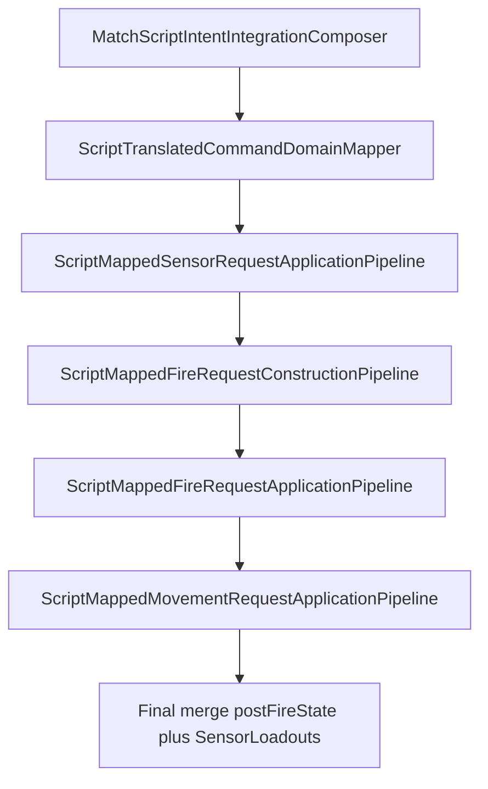

# Task 5.102 — Script Movement Application Plan

> **Nur Dokumentation.** Keine Implementierung, keine Tests, keine Änderungen an `src/`, `tests/`, Projekten, Solution oder `game/`.
>
> Sprache: Erklärungen überwiegend auf Deutsch; Typnamen und API-Namen wie im Code auf Englisch.

## 1. Purpose

[SCRIPT_RUNTIME_ROADMAP_CHECKPOINT.md](SCRIPT_RUNTIME_ROADMAP_CHECKPOINT.md) hat den nächsten Haupt-Track gesperrt: **Script Movement / Turret Command Application**, beginnend mit Movement (Tasks **5.102–5.106**).

**Ziel von 5.102:** Festlegen, wie Movement-Script-Befehle (`MoveToPatrolPoint`, `Retreat`) zu einer **deterministischen** Mutation von [`TankState.Movement`](../src/ScriptTanks.Core/Tanks/TankState.cs) werden — inklusive Request-/Status-Form, Application-Pipeline, Composer-Reihenfolge, State-Threading und Test-Policy für **5.103–5.106**.

Dieses Dokument ändert **kein** Verhalten. Es ist die Design-Referenz vor Code.

**Test-Baseline (Repo):** 2669 Tests nach 5.101.

## 2. Current State After 5.101

### Was Scripts heute können

| Pfad | Status |
| ---- | ------ |
| Sensor → Apply | **Implementiert** — [`ScriptMappedSensorRequestApplicationPipeline`](../src/ScriptTanks.Core/Scripting/ScriptMappedSensorRequestApplicationPipeline.cs) |
| Weapon/Fire → Construct → Apply | **Implementiert** — Fire-Pipelines im [`CombinedScriptRuntimeComposer`](../src/ScriptTanks.Core/Scripting/CombinedScriptRuntimeComposer.cs) |
| Tick → Runner / Replay / Logging | **Implementiert** — [`CombinedRuntimeTickPipeline`](../src/ScriptTanks.Core/Scripting/CombinedRuntimeTickPipeline.cs) und Logging-Checkpoint |

### Was als Nächstes fehlt

Die nächste echte Script-**State**-Mutation neben Fire:

```text
Movement Command
  → Domain Mapping (Movement)
  → Movement Application
  → MatchState / Tank MovementState ändern
  → CombinedScriptRuntimeComposer integrieren
  → CombinedRuntimeTickPipeline / Runner / Replay absichern (5.106)
```

Heute endet Movement bei [`MovementPlaceholder`](../src/ScriptTanks.Core/Scripting/ScriptDomainRequestMappingRecord.cs) — Kategorie [`ScriptDomainRequestCategory.Movement`](../src/ScriptTanks.Core/Scripting/ScriptDomainRequestCategory.cs), **kein** konkreter Request, **keine** Application-Pipeline.

## 3. Existing Type Inventory

### Scripting und Mapping

| Typ | Datei | Rolle heute |
| --- | ----- | ----------- |
| `ScriptCommandType` | [`ScriptCommandType.cs`](../src/ScriptTanks.Core/Scripting/ScriptCommandType.cs) | `MoveToPatrolPoint`, `Retreat` definiert |
| `ScriptCommandTranslatorV2` | [`ScriptCommandTranslatorV2.cs`](../src/ScriptTanks.Core/Scripting/ScriptCommandTranslatorV2.cs) | Übersetzt Movement-Befehle mit opaque Payloads (`"next"`, `"away_from_nearest_visible"`, …) |
| `ScriptTranslatedCommandRequestKind` | [`ScriptTranslatedCommandRequestKind.cs`](../src/ScriptTanks.Core/Scripting/ScriptTranslatedCommandRequestKind.cs) | `MoveToPatrolPoint`, `Retreat` |
| `ScriptTranslatedCommandDomainMapper` | [`ScriptTranslatedCommandDomainMapper.cs`](../src/ScriptTanks.Core/Scripting/ScriptTranslatedCommandDomainMapper.cs) | `MovementPlaceholder` — keine `MatchMovementRequest` |
| `ScriptDomainRequestMappingRecord` | [`ScriptDomainRequestMappingRecord.cs`](../src/ScriptTanks.Core/Scripting/ScriptDomainRequestMappingRecord.cs) | `MovementPlaceholder` / `TurretPlaceholder` Factory-Methoden |

### Combined runtime (Ist-Composer)

| Typ | Datei |
| --- | ----- |
| `CombinedScriptRuntimeComposer` | [`CombinedScriptRuntimeComposer.cs`](../src/ScriptTanks.Core/Scripting/CombinedScriptRuntimeComposer.cs) |
| `CombinedScriptRuntimeComposerResult` | [`CombinedScriptRuntimeComposerResult.cs`](../src/ScriptTanks.Core/Scripting/CombinedScriptRuntimeComposerResult.cs) |
| `CombinedRuntimeTickPipeline` | [`CombinedRuntimeTickPipeline.cs`](../src/ScriptTanks.Core/Scripting/CombinedRuntimeTickPipeline.cs) |

Fire/Sensor-Referenz (Pattern für 5.103–5.104):

| Typ | Datei |
| --- | ----- |
| `ScriptMappedSensorRequestApplicationPipeline` | [`ScriptMappedSensorRequestApplicationPipeline.cs`](../src/ScriptTanks.Core/Scripting/ScriptMappedSensorRequestApplicationPipeline.cs) |
| `ScriptMappedFireRequestConstructionPipeline` | [`ScriptMappedFireRequestConstructionPipeline.cs`](../src/ScriptTanks.Core/Scripting/ScriptMappedFireRequestConstructionPipeline.cs) |
| `ScriptMappedFireRequestApplicationPipeline` | [`ScriptMappedFireRequestApplicationPipeline.cs`](../src/ScriptTanks.Core/Scripting/ScriptMappedFireRequestApplicationPipeline.cs) |
| `ScriptMappedFireRequestApplicationStatus` | [`ScriptMappedFireRequestApplicationStatus.cs`](../src/ScriptTanks.Core/Scripting/ScriptMappedFireRequestApplicationStatus.cs) |

### Kinematik (Tank vs. Projektil — getrennt halten)

| Typ | Datei | Hinweis |
| --- | ----- | ------- |
| `MovementState` | [`MovementState.cs`](../src/ScriptTanks.Core/Movement/MovementState.cs) | `Position`, `VelocityPerTick` auf [`TankState.Movement`](../src/ScriptTanks.Core/Tanks/TankState.cs) |
| `MovementIntegrator` | [`MovementIntegrator.cs`](../src/ScriptTanks.Core/Movement/MovementIntegrator.cs) | `Step`: `Position += VelocityPerTick` |
| `ProjectileMovement` | [`ProjectileMovement.cs`](../src/ScriptTanks.Core/Projectiles/ProjectileMovement.cs) | Projektil-Bewegung — **nicht** Tank-Movement |
| `BasicTankStats.MaxVelocityPerTick` | [`BasicTankStats.cs`](../src/ScriptTanks.Core/Tanks/BasicTankStats.cs) | Obergrenze für abgeleitete Tank-Geschwindigkeit |

### Match tick

| Typ | Datei | Rolle |
| --- | ----- | ----- |
| `MatchTickPipeline` | [`MatchTickPipeline.cs`](../src/ScriptTanks.Core/Match/MatchTickPipeline.cs) | Projektil Step → Hit → Cleanup → Tick +1; **kein** Tank-Movement |

## 4. Current Movement / Tick Semantics

> **Movement-Scripts setzen in MVP nur `VelocityPerTick`. `Position` ändert sich dadurch noch nicht** — [`MatchTickPipeline`](../src/ScriptTanks.Core/Match/MatchTickPipeline.cs) führt keinen Tank-Movement-Step aus; [`MovementIntegrator`](../src/ScriptTanks.Core/Movement/MovementIntegrator.cs) wird dort nicht aufgerufen.

Ohne diesen Hinweis würde man fälschlich erwarten, dass `MoveToPatrolPoint` / `Retreat` in [`CombinedRuntimeTickPipeline.Step`](../src/ScriptTanks.Core/Scripting/CombinedRuntimeTickPipeline.cs) den Panzer sofort auf der Karte verschieben.

### Was pro Phase passiert

| Phase | Was sich ändert |
| ----- | ---------------- |
| Script movement apply (geplant 5.103–5.105) | `TankState.Movement.VelocityPerTick` (Bewegungs-**Intent** für den aktuellen Tick) |
| [`MatchTickPipeline`](../src/ScriptTanks.Core/Match/MatchTickPipeline.cs) heute | Nur Projektil-Pipeline, dann `CurrentTick += 1` — **keine** Tank-Positionsintegration |
| Zukünftige Tick-Integration | Separater Task: Tank-Step in `MatchTickPipeline`, der [`MovementIntegrator`](../src/ScriptTanks.Core/Movement/MovementIntegrator.cs) pro Tank aufruft (oder explizite Alternative) |

[`MovementIntegrator`](../src/ScriptTanks.Core/Movement/MovementIntegrator.cs) ist heute nur in [`MovementIntegratorTests.cs`](../tests/ScriptTanks.Core.Tests/Movement/MovementIntegratorTests.cs) abgesichert, nicht im Combined-Tick-Pfad.

### Combined tick heute (Option A)

```text
runtime₀ (Tick T)
  → CombinedScriptRuntimeComposer (Sensor + Fire)
  → MatchTickPipeline.Step (Projektile bei T, dann Tick T+1)
  → FinalRuntime
```

Tank-`Position` in `FinalRuntime.State` nach einem Movement-Script-Tick bleibt in MVP **gleich** wie vor dem Script-Lauf (nur `VelocityPerTick` kann sich ändern).

## 5. Movement Command Options

Drei Entscheidungsachsen — Vergleich und Empfehlung:

| Frage | Optionen | Empfehlung für MVP |
| ----- | -------- | ------------------ |
| **Effekt-Form** | `VelocityPerTick` setzen/ersetzen vs. Ein-Tick-Positionsdelta vs. Pathfinding-Ziel | **`VelocityPerTick` setzen/ersetzen** — Intent für den Tick |
| **Konstruktionsphase** | Fire-ähnlich Construct + Apply vs. direkte Apply aus Mapping | **Direkte Apply** — kein `ProjectileIdSequence`-ähnlicher Ressourcenbedarf |
| **Composer-Reihenfolge** | Sensor → Movement → Fire vs. Sensor → Fire → Movement | **Sensor → Fire → Movement** (§9) |
| **Position in Script-Phase** | Nur Velocity vs. auch `MovementIntegrator` in Apply | **Nur Velocity** — Position-Integration separater Tick-Task; One-Shot-Delta in Script-Phase verworfen |

**Verworfen für MVP:** Pathfinding, Patrol-Graphen, Steering-AI, Arena-Kollision in Apply, Godot-Anbindung, Positionsdelta in der Script-Phase (koppelt Domains und umgeht den Tick-Composer).

## 6. Recommended MVP Movement Policy

> **Movement-Scripts setzen in MVP nur `VelocityPerTick`. `Position` ändert sich dadurch noch nicht**, bis ein späterer `MatchTickPipeline`-Tank-Step [`MovementIntegrator`](../src/ScriptTanks.Core/Movement/MovementIntegrator.cs) aufruft (separater Task, nicht 5.103–5.106).

### Gesperrte MVP-Regeln

1. **Mutation:** Nur `TankState.Movement.VelocityPerTick` — **nicht** `MovementState.Position` in 5.103–5.105.
2. **Ableitung (deterministisch):** Aus [`ScriptTranslatedCommandRequest`](../src/ScriptTanks.Core/Scripting/ScriptTranslatedCommandRequest.cs)-Payload und Tank-Zustand:
   - **Richtung:** Einheitsvektor aus `BodyRotation` (body-forward); `MoveToPatrolPoint` mit Payload `"next"` oder leer → forward; `Retreat` → negierter forward (Payload `"away_from_nearest_visible"` dokumentiert Intent, MVP ohne Sensor-Zielpunkt).
   - **Betrag:** `direction * TankDefinition.Stats.MaxVelocityPerTick` (Fixed-Math, keine Floats).
3. **Zerstörte Panzer:** Record-Status `TankDestroyed` oder Skip — keine HP-Änderung.
4. **Kein** Pathfinding, Patrol-Graph, Kollisionsauflösung, Godot.
5. **Tick-Integration:** Explizit **außerhalb** 5.103–5.106, sofern nicht als neuer Task geöffnet.

### Was Nutzer in 5.106 sehen sollten

- Nach Movement-Script: **`VelocityPerTick` ≠ 0** (wenn Applied) auf post-script `MatchState`.
- **`Position` unverändert** gegenüber Pre-Script-Snapshot (bis Tank-Step existiert).

## 7. Request / Status Shape

Spiegelung des Fire-Application-Musters (Implementierung in **5.103**):

```csharp
public enum ScriptMappedMovementRequestApplicationStatus
{
    SkippedNotMovement = 0,
    Applied = 1,
    RejectedInvalidMovement = 2,
    TankIndexOutOfRange = 3,
    TankDestroyed = 4,
}
```

| Typ (neu in 5.103) | Rolle |
| ------------------ | ----- |
| `ScriptMappedMovementRequestApplicationRecord` | Pro Mapping-Index: Status, Mapping-Record, optional abgeleitete Velocity |
| `ScriptMappedMovementRequestApplicationResult` | `FinalRuntime`, Records-Array, Referenz auf Mapping |

**Kein** separates `MatchFireRequest`-Level-Request-Objekt in MVP — Intent wird aus `ScriptDomainRequestMappingRecord` + `TranslationOutput` in der Apply-Pipeline abgeleitet. Optional später: `MatchMovementIntent` struct (Tank-Index + `FixedVec2`), falls Mapping-Record erweitert wird.

**Keine** Construction-Pipeline in MVP (kein Analogon zu [`ScriptMappedFireRequestConstructionPipeline`](../src/ScriptTanks.Core/Scripting/ScriptMappedFireRequestConstructionPipeline.cs)).

## 8. Proposed Application Pipeline

Geplant in **5.104**:

```text
ScriptMappedMovementRequestApplicationPipeline.Apply(
    MatchSensorRuntimeState runtimeAfterFire,
    MatchScriptDomainRequestMappingResult mappingResult)
    → ScriptMappedMovementRequestApplicationResult
```

### Pro Record (Index-Reihenfolge)

| Schritt | Aktion |
| ------- | ------ |
| 1 | Skip, wenn `Category != Movement` oder kein übersetztes Movement-Kind → `SkippedNotMovement` |
| 2 | Tank per `TankIndex` / `TankId`; `TankIndexOutOfRange` wenn ungültig |
| 3 | `TankDestroyed`, wenn `CurrentHitPoints <= 0` |
| 4 | Velocity berechnen (§6); bei nicht auflösbarer Payload → `RejectedInvalidMovement` |
| 5 | `tank.WithMovement(movement.WithVelocityPerTick(velocity))`; `MatchState` immutabel falten (wie Fire-Apply-Schleife) |

Pure pipeline: keine Logs, kein Replay, kein Godot, kein `MatchRunner`.

## 9. CombinedRuntime Integration Order

**Gesperrte Kette:**

```text
integration → mapping → sensor apply → fire construct → fire apply → movement apply → final merge
```

Kurz: **Sensor → Fire → Movement → final merge** (Option-A-Sensor-Loadouts).



### Begründung

| Punkt | Detail |
| ----- | ------ |
| Fire bleibt stabil | Construct/Apply auf **`runtime₀`** ([`CombinedScriptRuntimeComposer`](../src/ScriptTanks.Core/Scripting/CombinedScriptRuntimeComposer.cs) Remarks) |
| Movement auf post-fire State | Input: `fireApplicationResult.FinalRuntime` — Fire-Ergebnisse (Projektile, HP) sichtbar; Movement schreibt nur Velocity-Intent |
| Sensor | Trägt weiterhin nur **Loadouts** in den Merge; **State** kommt von Fire + Movement |

### Final merge (5.105)

```text
finalRuntime = movementApplicationResult.FinalRuntime
    .WithSensorLoadouts(sensorApplicationResult.FinalRuntime.SensorLoadouts)
```

[`CombinedScriptRuntimeComposerResult`](../src/ScriptTanks.Core/Scripting/CombinedScriptRuntimeComposerResult.cs) erhält ein Feld `MovementApplicationResult` (oder äquivalent) — Implementierung 5.105, Spezifikation hier.

## 10. State Threading and Reference Guards

Parallel zu Sensor/Fire ([`ScriptMappedSensorRequestApplicationPipeline`](../src/ScriptTanks.Core/Scripting/ScriptMappedSensorRequestApplicationPipeline.cs), [`ScriptMappedFireRequestApplicationPipeline`](../src/ScriptTanks.Core/Scripting/ScriptMappedFireRequestApplicationPipeline.cs)):

| Pipeline | `ReferenceEquals`-Guard | Start-Runtime |
| -------- | ---------------------- | ------------- |
| Sensor apply | `runtime` == `mappingResult.IntegrationResult.Runtime` | **`runtime₀`** |
| Fire construct | `runtime` == `mappingResult.IntegrationResult.Runtime` | **`runtime₀`** |
| Fire apply | `runtime` == `constructionResult....IntegrationResult.Runtime` | **`runtime₀`** |
| **Movement apply (neu)** | `runtimeAfterFire` == `fireApplicationResult.FinalRuntime` | **Post-fire** |

Movement darf **nicht** nur `runtime₀` mutieren — sonst würden Fire-Schreibungen auf `MatchState` übersprungen.

Fire construct/apply lesen weiterhin den **initialen** Match-State-Snapshot für Muzzle/Velocity-Resolver; Sensor-`MatchState`-Nebenwirkungen fließen nicht in Fire ein (Option A: Sensor → Loadouts only im heutigen Merge; Movement ändert den Merge auf post-fire + loadouts).

## 11. Test Strategy

Zielgruppe **5.106** (keine Tests in 5.102):

| Ebene | Fokus |
| ----- | ----- |
| Unit | Apply: `Applied`, `SkippedNotMovement`, `RejectedInvalidMovement`, `TankIndexOutOfRange`, `TankDestroyed` |
| Composer | Movement-Record setzt `VelocityPerTick` auf dem richtigen Tank |
| Combined tick | [`CombinedRuntimeTickPipelineTests`](../tests/ScriptTanks.Core.Tests/Scripting/CombinedRuntimeTickPipelineTests.cs): Movement-Programm — **Velocity** auf post-script `State`; **Position** unverändert (bis Tank-Step existiert) |
| Runner / Replay | [`CombinedRuntimeRunner`](../src/ScriptTanks.Core/Scripting/CombinedRuntimeRunner.cs) / [`CombinedRuntimeReplayRecorder`](../src/ScriptTanks.Core/Replay/CombinedRuntimeReplayRecorder.cs) Smoke — Frames weiterhin nur `MatchState` |
| Logged | MVP [`LoggedCombinedRuntimeRunner`](../src/ScriptTanks.Core/Scripting/LoggedCombinedRuntimeRunner.cs) unverändert; **keine** neuen CombatLog-Events in 5.103–5.106 |

## 12. Determinism and Purity

- Alle Movement-Apply-Schritte: **pure** Funktionen auf immutable `MatchState` / `TankState` — gleiches Input → gleiches Output.
- Record-Reihenfolge: strikt Mapping-Index (wie Sensor/Fire).
- Fixed / `FixedVec2` nur — keine System.Random, keine Zeit, keine IO.
- Keine Abhängigkeit von Godot oder externen Config-Dateien.
- Velocity-Ableitung muss für gleiche `BodyRotation`, Payload und `MaxVelocityPerTick` reproduzierbar sein.

## 13. Relationship to Runner / Replay / Logging

| Bereich | Policy |
| ------- | ------ |
| **Replay** | Unverändert — nur [`MatchState`](../src/ScriptTanks.Core/Match/MatchState.cs) in Frames ([COMBINED_RUNTIME_LOGGING_CHECKPOINT.md](COMBINED_RUNTIME_LOGGING_CHECKPOINT.md) §5) |
| **MVP Logging** | Weiterhin `match_started` / `match_ended` über [`LoggedCombinedRuntimeRunner`](../src/ScriptTanks.Core/Scripting/LoggedCombinedRuntimeRunner.cs) |
| **Rich Logging** | **Keine** Movement-Events in 5.103–5.106; [`CombatLogEventTypes`](../src/ScriptTanks.Core/Logging/CombatLogEventTypes.cs) bleibt unerweitert, sofern nicht explizit neu geöffnet |
| **Runner** | [`CombinedRuntimeRunner.RunUntilEnd`](../src/ScriptTanks.Core/Scripting/CombinedRuntimeRunner.cs) nutzt weiter [`CombinedRuntimeTickPipeline.Step`](../src/ScriptTanks.Core/Scripting/CombinedRuntimeTickPipeline.cs) — Movement wirkt über erweiterten Composer |

## 14. Follow-up Tasks 5.103–5.106

| Task | Inhalt |
| ---- | ------ |
| **5.103** | `ScriptMappedMovementRequestApplicationStatus`, `Record`, `Result` |
| **5.104** | `ScriptMappedMovementRequestApplicationPipeline` + deterministischer Velocity-Resolver (Payload → `FixedVec2`) |
| **5.105** | [`CombinedScriptRuntimeComposer`](../src/ScriptTanks.Core/Scripting/CombinedScriptRuntimeComposer.cs) + `CombinedScriptRuntimeComposerResult`; Merge §9 |
| **5.106** | Tests: Pipeline, Composer, Combined tick, Runner/Replay; Velocity ja, Position nein (MVP) |

**Explizit nicht in 5.103–5.106** (neuer Task nötig):

- `MatchTickPipeline`-Tank-Movement-Step + `MovementIntegrator`-Integration
- Turret Application (5.107+)
- CombatLog Movement-Events
- Godot

**Optional später:** Task „Match tick tank movement“ zwischen 5.106 und Godot — macht `VelocityPerTick` in Position sichtbar.

## 15. Out of Scope + Definition of Done

### Out of Scope (5.102 und MVP-Track 5.103–5.106)

- Implementierung von Pipeline/Composer-Code (ab 5.103)
- Pathfinding, Patrol-Graphen, Kollisionsauflösung, AI-Steering
- Turret-Track (5.107+)
- Godot / `game/`
- Muzzle-/Radius-Tuning ([MUZZLE_RADIUS_TUNING_CHECKPOINT.md](MUZZLE_RADIUS_TUNING_CHECKPOINT.md))
- Replay-Schema- oder Frame-Typ-Änderungen
- Rich-CombatLog-Event-Erweiterung für Movement

### Definition of Done

- [x] [`docs/SCRIPT_MOVEMENT_APPLICATION_PLAN.md`](SCRIPT_MOVEMENT_APPLICATION_PLAN.md) existiert mit **§1–§15**
- [x] §4 und §6 enthalten den **Velocity-vs.-Position**-Callout deutlich sichtbar
- [x] Links: Peer-Docs ohne `../`; `../src/` / `../tests/`; [`MovementState.cs`](../src/ScriptTanks.Core/Movement/MovementState.cs) und [`ProjectileMovement.cs`](../src/ScriptTanks.Core/Projectiles/ProjectileMovement.cs) getrennt
- [x] Keine absoluten Pfade, keine Zeilennummern-Belege
- [x] Composer-Reihenfolge **Sensor → Fire → Movement → merge** gesperrt
- [x] Follow-ups 5.103–5.106 und Tick-Integration-Lücke dokumentiert
- [x] `dotnet build ScriptTanks.sln -warnaserror` + Testlauf: **2669** unverändert
