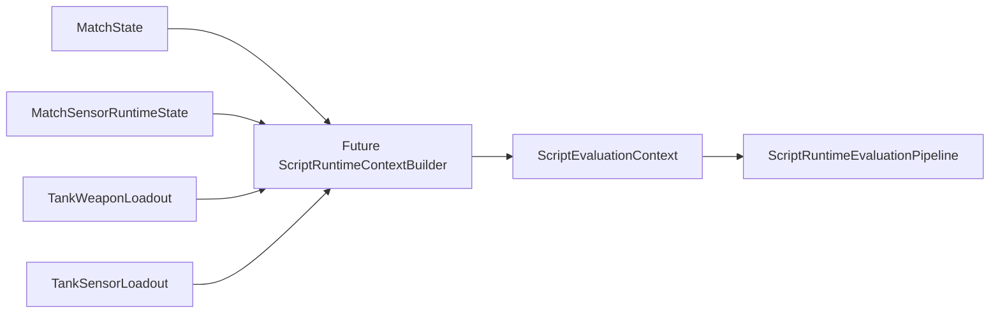

# Script Runtime Context Builder Plan

## 1. Purpose

Dieses Dokument beschreibt, wie ein **zukünftiger** `ScriptRuntimeContextBuilder` ein `ScriptEvaluationContext` **deterministisch** aus Match- und Sensor-/Weapon-Laufzeitdaten ableiten soll.

Explizit:

- **Nur Dokumentation** — es gibt **keine Implementierung** in diesem Task.
- **Keine** MatchState-Mutation, **keine** Kommando-Ausführung, **keine** Request-Erzeugung für Gameplay-Kernel.
- Ziel ist eine klare Grundlage für spätere Tasks (z. B. Task 5.46), ohne `ScriptEvaluationContext` oder Pipelines jetzt zu ändern.

## 2. Current Problem

Die bestehende Auswertung kann pro Tank bereits ausführen:

`ScriptRuntimeEvaluationPipeline.Evaluate(SimTick tick, int tankIndex, ScriptProgram program, ScriptEvaluationContext context)`

Siehe auch den Match-Pfad über `MatchScriptRuntimeEvaluationPipeline` / Requests — dort wird `ScriptEvaluationContext` je Request **mitgeliefert**.

**Problem:** `ScriptEvaluationContext` wird **manuell oder vorab berechnet** übergeben. Es gibt noch **keinen** fest definierten Weg, ihn aus **echtem** Match-/Sensor-/Weapon-Zustand abzuleiten.

Konsequenzen:

- Scripts können **noch nicht** zuverlässig aus **realen** Matchdaten evaluiert werden.
- **Sichtbarkeit** ist nicht an Sensor-/Scan-Ergebnisse gebunden.
- **WeaponReady** ist nicht an Cooldowns/Loadout gebunden.
- **EnemyDistance** kommt nicht aus tatsächlichen Gegnerpositionen.
- **MyHitPoints** wird nicht automatisch aus `TankState` gemappt.

## 3. Target Output: ScriptEvaluationContext

Zielobjekt bleibt das bestehende, bewusst schlanke Modell:

```text
ScriptEvaluationContext
├─ EnemyVisible   (bool)
├─ WeaponReady    (bool)
├─ MyHitPoints    (int)
├─ EnemyDistance  (Fixed)
└─ SensorReady    (bool)
```

Erwartete Bedeutung (für den späteren Builder):

| Feld | Bedeutung |
|------|-----------|
| `EnemyVisible` | Der evaluierende Panzer hat **mindestens einen gültigen**, aktuell **sichtbaren** Gegner gemäß Sensor-/Sichtbarkeitspolicy (nicht „irgendeine Distanz“ ohne Sensorlogik). |
| `WeaponReady` | **Mindestens eine** für die Policy relevante Waffe ist **feuerbereit** (kein Cooldown o. Ä. nach definierter Regel). |
| `MyHitPoints` | Aktuelle Trefferpunkte des **evaluierenden** Tanks. |
| `EnemyDistance` | Distanz zum gewählten Gegner nach Policy (z. B. nächster sichtbarer Gegner); siehe Abschnitt 5. |
| `SensorReady` | **Mindestens ein** relevanter Sensor kann **in diesem Tick** scannen (nach definierter Bereitschaftsregel). |

Die Form ist **absichtlich minimal**; spätere Erweiterungen (Target-Memory, Confidence) sind separate Designentscheidungen (Abschnitt 9).

## 4. Candidate Input Sources

Zukünftige Eingaben (konzeptionell; keine Implementierungspflicht in diesem Dokument):

- **`MatchState`** — u. a. `CurrentTick`, `Tanks`, Projektilien, Arena je nach Bedarf für Distanz/Existenz von Gegnern.
- **`TankState`** — z. B. `Id`, `PlayerSlot`, `Movement.Position`, `CurrentHitPoints`, `IsDestroyed`.
- **Waffen-Loadout / Laufzeit** — `TankWeaponLoadout`, Waffenzustände, Cooldown-Daten (sobald für „ready“ benötigt).
- **`MatchSensorRuntimeState`** — **bereits im Code** ein unveränderliches Paar aus `MatchState` und `MatchSensorLoadoutState`; sensorseitige Loadouts pro Tank-Index.
- **`MatchSensorLoadoutState` / `TankSensorLoadout`** — Sensor-Slots, Cooldowns, letzte Scan-Daten je nach vorhandener API.
- **Später:** Sensor-Gedächtnis / Last-known-Target-Cache, Hardware-/CPU-Laufzeit (beeinflusst eher **Ausführungsfrequenz**, nicht zwingend die fünf Kontextfelder).



*Hinweis:* `MatchSensorRuntimeState` enthält bereits `State` und `SensorLoadouts`; Waffen-Loadouts können über `MatchState` oder ergänzende Strukturen angebunden werden — siehe Implementierungs-Reihenfolge (Abschnitt 13).

## 5. Field Derivation Rules

### MyHitPoints

- **Quelle (Zielbild):** `MatchState.Tanks[tankIndex].CurrentHitPoints` (oder äquivalente API).
- **Policy:** `tankIndex` muss **strukturell gültig** sein; zerstörter Tank meldet **0** HP; keine zusätzliche Clamping-Policy über die bestehenden `TankState`-Invarianten hinaus, außer später explizit spezifiziert.

### WeaponReady

- **Startpolicy:** `true`, wenn **irgendeine** Waffe im zugehörigen `TankWeaponLoadout` nach definierter Regel „ready“ ist; `false`, wenn keine bereit ist oder kein Waffen-Loadout existiert (siehe Abschnitt 7).
- **Offene Fragen:** Soll ein `ScriptCommand`-Argument einen **Waffenslot** wählen? Zählt **nur Standard-/primäre** Waffe? **Zerstörte** Tanks immer `false`?

### SensorReady

- **Startpolicy:** `true`, wenn **mindestens ein** Sensor im `TankSensorLoadout` **an diesem Tick** scannen kann; `false`, wenn alle auf Cooldown oder nicht verfügbar.
- **Offene Fragen:** Nur „Default“-Sensor vs. beliebiger Slot? **Passive** Sensoren? **Zerstörte** Tanks immer `false`?

### EnemyVisible

- **Startpolicy:** `true`, wenn die kombinierte Sensor-/Laufzeit-Sicht **mindestens einen gültigen sichtbaren Gegner** liefert; sonst `false`.
- **Wichtig:** Sichtbarkeit **nicht** allein aus roher Distanz ohne explizites Design („Basis-Sicht“); **Scan-Ergebnisse / Sichtbarkeits-Policy** sind die intendierte Wahrheitsquelle.

### EnemyDistance

- **Option A — nächster sichtbarer Gegner:** Minimum der Distanzen zu allen **sichtbaren** Gegnern (in deterministischer Reihenfolge / Tie-Break).
- **Option B — selektiertes Ziel:** Distanz zum von einer Target-Selection-Policy gewählten Gegner.

**Empfehlung (MVP):** Option A — deterministisch, einfach, ohne separates Prioritätssystem.

**Fallback:** Kein sichtbarer Gegner → dokumentierter sicherer Wert; `ScriptEvaluationContext` verlangt aktuell `Fixed` und verbietet negative Distanzen — **`Fixed.Zero`** ist ein plausibler Sentinel, solange Bedingungen wie `EnemyDistanceBelow` das semantisch tolerieren; **vor Implementierung** explizit gegen Condition-Semantik prüfen oder alternatives Modell planen.

## 6. Determinism Requirements

Strikte Anforderungen an den späteren Builder:

- Keine Wall-Clock-Zeit; nur **SimTick** und Snapshot-Daten.
- Keine Zufallsquellen.
- Kein IEEE-**Floating-Point** in der Ableitung; **Fixed** und bestehende deterministische Geometrie nutzen.
- **Deterministische** Tank-Reihenfolge bei Iteration (Match-Tank-Liste).
- **Deterministische Tie-Breaks** bei gleicher Distanz zu Gegnern.
- **Deterministische** Waffen-/Sensor-„Ready“-Prüfungen (fest definierte Slot-Reihenfolge).
- Keine Mutation der Eingabe-Snapshots während des Builds — Builder soll **rein** sein (neues `ScriptEvaluationContext` pro Aufruf).

**Enemy Tie-Break:** Wenn zwei Gegner dieselbe Distanz haben — **eine** feste Regel wählen, z. B. **niedrigerer Index in der Match-Tank-Collection** gewinnt (viele Systeme erhalten Listenreihenfolge). Alternative **TankId**-Ordnung später dokumentieren, falls gewechselt wird.

*Hinweis:* LINQ o. Ä. ist aus Determinismus-Sicht unkritisch, solange Reihenfolge und Tie-Breaks fest sind; Hot-Path-Allokationen können später optimiert werden.

## 7. Missing Data and Fallback Policy

Fälle:

- Ungültiger **Tank-Index** (außerhalb des Arrays).
- Evaluierender Tank **zerstört**.
- **Keine** Gegner in der Partie / alle Gegner zerstört.
- **Keine sichtbaren** Gegner.
- Kein **Sensor-Loadout** / kein **Waffen-Loadout** verfügbar.
- **Count-Mismatch** zwischen Tanks und Sensor-/Weapon-Loadouts (struktureller Fehler).

**Empfohlene Policy:**

- **Ungültige strukturelle Daten** → **werfen** (`ArgumentOutOfRangeException` / `ArgumentException` nach bestehenden Konventionen), nicht „still falsches“ Kontextobjekt.
- **Gültige Spielsituation mit Abwesenheit** (kein sichtbarer Gegner, alles auf Cooldown) → **`false` / sichere Skalare** nach Tabelle unten.
- **Zerstörter Evaluator:**  
  `MyHitPoints = 0`, `WeaponReady = false`, `SensorReady = false`, `EnemyVisible = false`, `EnemyDistance = Fixed.Zero` (oder anderer **vorher dokumentierter** Fallback).

## 8. Hardware / Loadout Considerations

- Waffen-Bereitschaft hängt von **Slot**, **Cooldown** und Kern-Definitionen ab, nicht von UI/Godot.
- Sensor-Bereitschaft analog über **Sensor-Slots** und Cooldowns.
- Späteres **CPU-/Hardware-Modell** kann die **Häufigkeit** der Kontext-Erneuerung steuern, sollte aber die **Semantik** der fünf Felder nur ändern, wenn das **explizit** modelliert wird.
- Module (Panzerung, Motor, Funk) ändern den Script-Kontext **nicht still** — nur wenn als echte Simulationsparameter angebunden.

## 9. Sensor Memory and Visibility Policy

**Heute:** `ScriptEvaluationContext` kennt nur `EnemyVisible` und `EnemyDistance` — kein Gedächtnisfeld.

**MVP-Vorschlag:**

- `EnemyVisible` / `EnemyDistance` nur aus **aktuell gültigen, sichtbaren** Detektionen (Policy aus Abschnitt 5).

**Später (Erweiterung, nicht MVP):**

- Separate Felder oder ein reicheres Target-Modell, z. B. `HasLastKnownEnemy`, `LastKnownEnemyDistance`, `TicksSinceLastSeen`, `TargetConfidence`.

**Wichtig:** `EnemyVisible` **nicht** überladen mit „war kürzlich sichtbar“ — das wäre ein anderes Konzept.

## 10. Proposed Future API

Mögliche Signaturen (alle **rein**, **ohne** Mutation der Inputs):

**Option A — nur `MatchState`:**

```csharp
public static ScriptEvaluationContext Build(
    MatchState state,
    int tankIndex);
```

- Problem: Sensor-Laufzeit / Sichtbarkeit oft unzureichend.

**Option B — `MatchSensorRuntimeState`:**

```csharp
public static ScriptEvaluationContext Build(
    MatchSensorRuntimeState sensorRuntime,
    int tankIndex);
```

- Trägt bereits **`MatchState` + `MatchSensorLoadoutState`** (siehe aktuelle Core-Dokumentation zu `MatchSensorRuntimeState`).

**Option C — explizit getrennt:**

```csharp
public static ScriptEvaluationContext Build(
    MatchState state,
    MatchSensorLoadoutState sensorLoadouts,
    int tankIndex);
```

**Option D — späterer Sammeltyp:**

```csharp
public static ScriptEvaluationContext Build(
    MatchRuntimeScriptContextSource source,
    int tankIndex);
```

**Empfehlung für erste Implementierung:** Mit **Option B** starten — ein Snapshot, konsistente Tank-/Sensor-Counts, gute Basis für Sichtbarkeit und SensorReady; Waffen-Daten über `MatchState`/ergänzende Loadout-Strukturen anbinden, sobald klar definiert.

Jede API soll **Mismatch-Verhalten** dokumentieren und nur **deterministische** Ergebnisse liefern.

## 11. Test Strategy

Geplante Tests **nach** Implementierung (nicht Teil dieses Dokument-Tasks):

**Validierung**

- `null`-Inputs; ungültiger `tankIndex`; Count-Mismatch-Verhalten.

**HP**

- Aktuelle HP → `MyHitPoints`; zerstört → `0`.

**WeaponReady**

- Mindestens eine bereite Waffe → `true`; alle Cooldown → `false`; Randfall ohne Waffen.

**SensorReady**

- Analog Sensor „ready“ vs. alle Cooldown.

**EnemyVisible / EnemyDistance**

- Keine Gegner → `EnemyVisible == false`, dokumentierter Distanz-Fallback.
- Zerstörte Gegner werden von Sichtbarkeit/Distanz ausgeschlossen, sobald so spezifiziert.
- Sichtbar → `true`; nicht sichtbar → `false`.
- Nächster sichtbarer Gegner; **Tie-Break** deterministisch; kein sichtbarer Gegner → Fallback-Distanz.

**Reinheit**

- Keine Mutation von `MatchState` / Sensor-Loadouts; wiederholte Aufrufe mit gleichem Snapshot → gleiches `ScriptEvaluationContext`.

## 12. Out of Scope

- Keine Implementierung in Task 5.42A.
- Keine Änderung von `ScriptEvaluationContext`.
- Keine MatchState-Mutation, keine Sensor-Scan-Ausführung, keine Weapon-Cooldown-Mutation durch den Builder.
- Keine Änderungen an `ScriptCommandTranslator` / Kommando-Ausführung.
- Kein AI-/Scheduler-/CPU-Timing-Design hier.
- Kein Godot, kein Logging/Diagnostics-Integration, keine Replay-Anbindung.

## 13. Recommended Next Tasks

1. **Task 5.43 — ScriptCommandTranslationRequest Models** — reine Modelle für übersetzte Kommandorequests.
2. **Task 5.44 — ScriptCommandTranslator v2 Plan** — Dokumentation Mapping `ScriptCommandType` → zukünftige Request-Modelle.
3. **Task 5.45 — MatchScriptRuntimeState Pairing Plan** — wie Script-Requests mit Match-Tanks und Runtime-State verbunden werden.
4. **Task 5.46 — ScriptRuntimeContextBuilder First Implementation** — **erst nach** den obigen Plänen: kleiner **reiner** Builder z. B. von `MatchSensorRuntimeState` + `tankIndex` → `ScriptEvaluationContext`.

---

*Plan-Dokument Task 5.42A. Kein ausführbarer Code; Typnamen entsprechen der bestehenden Codebase soweit referenziert.*
