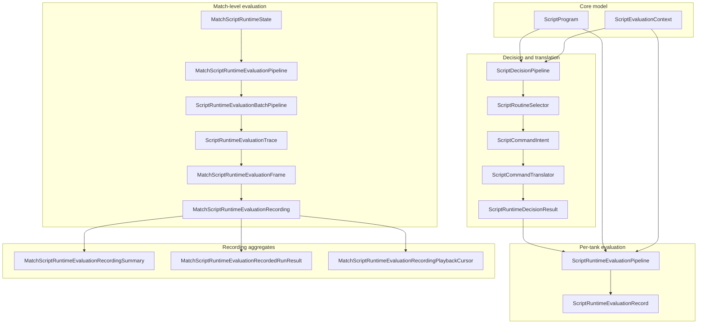

# Script Runtime Evaluation Debug Surface Review

## 1. Purpose

Die beschriebene Scripting-/Evaluation-Schicht ist **rein funktional**: Sie modelliert Programme, Kontext, deterministische Auswahl von Routinen, Kommando-Intents und statusorientierte Übersetzungsergebnisse — aber **keine Ausführung** von Gameplay.

Konkret gilt weiterhin:

- Keine **MatchState**-Mutation durch diese Pipelines.
- Kein tatsächliches **Waffen-Feuer**, kein Sensor-Lauf, keine Bewegungsausführung.
- Kein **Scheduler**, keine Tick-Budgetierung oder Prioritätszeit für KI.
- Keine **Godot**- oder UI-Anbindung in diesen Typen.
- Formatierung ist Debug-Text, kein Spiel- oder Replay-Kernel.

Ziel dieses Dokuments: vor weiterer Runtime-Integration die **bestehenden Grenzen** und **nächsten sinnvollen Schritte** festhalten.

## 2. Current Architecture Overview

Die Architektur lässt sich in drei Schichten denken: **Kernmodell** → **Decision/Translation** → **Evaluation & Aufzeichnung** (Match-Level) mit optionalen **Text-Formattern** parallel zur Datenflusskante.

Überblick entlang der Hauptdatenlinie (vereinfacht; `Record → Trace` ist die konzeptionelle Aggregation vieler Records zu einer Trace):

```mermaid
flowchart LR
    Program[ScriptProgram]
    Context[ScriptEvaluationContext]
    Decision[ScriptRuntimeDecisionPipeline]
    Result[ScriptRuntimeDecisionResult]
    Record[ScriptRuntimeEvaluationRecord]
    Trace[ScriptRuntimeEvaluationTrace]
    Frame[MatchScriptRuntimeEvaluationFrame]
    Recording[MatchScriptRuntimeEvaluationRecording]
    Summary[MatchScriptRuntimeEvaluationRecordingSummary]
    Cursor[MatchScriptRuntimeEvaluationRecordingPlaybackCursor]

    Program --> Decision
    Context --> Decision
    Decision --> Result
    Result --> Record
    Record --> Trace
    Trace --> Frame
    Frame --> Recording
    Recording --> Summary
    Recording --> Cursor
```

Detailliertere Sicht inkl. Match-Level-Pipeline, Batch und Aggregaten:

## 3. Existing Type Inventory

Typen sind nach Rolle gruppiert (Namen auf Englisch wie im Code).

### Core script model

- `ScriptCommandType`
- `ScriptCommand`
- `ScriptConditionType`
- `ScriptCondition`
- `ScriptRoutine`
- `ScriptProgram`
- `ScriptEvaluationContext`

### Selection / decision / translation

- `ScriptConditionEvaluator`
- `ScriptRoutineSelector`
- `ScriptRoutineSelectionResult`
- `ScriptRoutineDecision`
- `ScriptDecisionPipeline`
- `ScriptCommandIntent`
- `ScriptCommandTranslationStatus`
- `ScriptCommandTranslationResult`
- `ScriptCommandTranslator`
- `ScriptCommandPipeline`
- `ScriptRuntimeDecisionResult`
- `ScriptRuntimeDecisionPipeline`

### Evaluation records / traces

- `ScriptRuntimeDecisionSnapshot`
- `ScriptRuntimeDecisionTrace`
- `ScriptRuntimeEvaluationRecord`
- `ScriptRuntimeEvaluationRequest`
- `ScriptRuntimeEvaluationTrace`
- `ScriptRuntimeEvaluationPipeline`
- `ScriptRuntimeEvaluationBatchPipeline`

### Match-level script runtime state

- `MatchScriptRuntimeState`
- `MatchScriptRuntimeEvaluationPipeline`
- `MatchScriptRuntimeEvaluationFrame`
- `MatchScriptRuntimeEvaluationRecording`
- `MatchScriptRuntimeEvaluationRecordingSummary`
- `MatchScriptRuntimeEvaluationRecordingSummaryFactory`
- `MatchScriptRuntimeEvaluationRecordedRunResult`
- `MatchScriptRuntimeEvaluationRecorder`
- `MatchScriptRuntimeFixedTickRecorder`
- `MatchScriptRuntimeEvaluationRecordingPlaybackCursor`

### Formatters

Reine Text-Helfer (statische `Format`-APIs), ohne Seiteneffekte:

- `ScriptRuntimeDecisionTextFormatter` — decision result
- `ScriptRuntimeDecisionSnapshotTextFormatter` — decision snapshot
- `ScriptRuntimeDecisionTraceTextFormatter` — decision trace
- `ScriptRuntimeEvaluationRecordTextFormatter` — evaluation record
- `ScriptRuntimeEvaluationTraceTextFormatter` — evaluation trace
- `MatchScriptRuntimeEvaluationFrameTextFormatter` — match frame
- `MatchScriptRuntimeEvaluationRecordingTextFormatter` — recording
- `MatchScriptRuntimeEvaluationRecordedRunResultTextFormatter` — recorded run result
- `MatchScriptRuntimeEvaluationRecordingPlaybackCursorTextFormatter` — playback cursor

## 4. Evaluation Flow

### Pro Tank (ein Programm, ein Kontext)

`ScriptRuntimeEvaluationPipeline.Evaluate(SimTick tick, int tankIndex, ScriptProgram program, ScriptEvaluationContext context)`:

1. Ruft `ScriptRuntimeDecisionPipeline.Evaluate(program, context)` auf.
2. Dieses delegiert an `ScriptDecisionPipeline.Decide(program, context)`.
3. `Decide` nutzt `ScriptRoutineSelector.SelectFirstValid(program, context)` (über die dokumentierte Pipeline-Kette).
4. Ergebnis: `ScriptRoutineDecision` → `ScriptCommandIntent.FromDecision` → `ScriptCommandTranslator.Translate(intent)` → `ScriptRuntimeDecisionResult`.
5. Abschluss: neues `ScriptRuntimeEvaluationRecord` mit Tick, `tankIndex`, Programm, Kontext und `ScriptRuntimeDecisionResult`.

Eigenschaften:

- Bedingungen werden über `ScriptConditionEvaluator` gegen den **übergebenen** Kontext ausgewertet.
- Routinenwahl ist **deterministisch** und **listenordnungsbasiert**: erste passende Routine gewinnt.
- `ScriptCommandTranslationResult` ist **Status-only** (kein Kernel-Request).
- **Es wird kein Kommando ausgeführt.**

### Match-Level (mehrere Requests)

`MatchScriptRuntimeEvaluationPipeline.Evaluate(SimTick tick, MatchScriptRuntimeState runtime)` delegiert an `ScriptRuntimeEvaluationBatchPipeline.Evaluate(tick, runtime.Requests)` und liefert eine geordnete `ScriptRuntimeEvaluationTrace` (ein Record pro Request in Request-Reihenfolge).

## 5. Debug / Recording Flow

Pfad für Aufzeichnung/Debug ohne Playback-Loop im Produktiv-Sinne:

1. `MatchScriptRuntimeState` — unveränderliche Liste von `ScriptRuntimeEvaluationRequest`.
2. `MatchScriptRuntimeEvaluationPipeline.Evaluate` → `ScriptRuntimeEvaluationTrace`.
3. `MatchScriptRuntimeEvaluationRecorder.RecordFrame(frameIndex, tick, runtime)` kombiniert Pipeline-Ausgabe mit Index/Tick → `MatchScriptRuntimeEvaluationFrame`.
4. Mehrere Frames → `MatchScriptRuntimeEvaluationRecording` (defensive Kopie, mindestens ein Frame).
5. `MatchScriptRuntimeEvaluationRecordingSummaryFactory.Create(recording)` → Aggregat aus Recording-Reihenfolge (keine Tick-Normalisierung).
6. `MatchScriptRuntimeEvaluationRecordedRunResult` bündelt Recording + Summary (ohne Konsistenzprüfung zwischen beiden).

Zusätzlich:

- `MatchScriptRuntimeFixedTickRecorder.RecordForTicks(initialTick, tickCount, runtime)` erzeugt **genau einen Frame pro Tick** (`SimTick` = `initialTick.Value + i`), Frameindizes `0 .. tickCount-1`, unabhängig vom gespeicherten `MatchScriptRuntimeEvaluationFrame.FrameIndex`.
- **Playback:** `MatchScriptRuntimeEvaluationRecordingPlaybackCursor` navigiert nach **Collection-Index** (`GetFrameAtIndex`), nicht nach dem Feld `FrameIndex` des Frames.

## 6. Formatter Surface

- Formatters sind **reine** statische Textproduzenten.
- Sie **loggen nicht**, schreiben keine Diagnostics-Sinks, **serialisieren kein JSON**, **mutieren keinen Zustand**, **führen keine Kommandos aus**, **binden keine UI/Godot** ein.
- Ausgabe ist **best-effort Debug-Text** für Menschen und Tests — **kein stabiler Serialisierungsvertrag** für Netzwerk oder Persistenz.

## 7. Determinism and Purity Boundaries

- Keine Wall-Clock-Zeit in diesen Pipelines.
- Keine Zufallsquellen in der beschriebenen Evaluationskette.
- Keine IEEE-`float`/`double`-Semantik in den Evaluatoren; numerische Kontextfelder nutzen z. B. `Fixed` für Distanzen (fest definiert im Modell).
- Keine MatchState-Mutation; keine impliziten Sensor-/Feuer-/Bewegungseffekte.
- Auswertung hängt nur von übergebenem Programm, Kontext, Tick und Request-/Runtime-Daten ab.
- Container kopieren Eingaben wo dokumentiert (defensive Kopien).
- `MatchScriptRuntimeState`, Recordings, Traces und Cursor sind **immutable snapshots** im Sinne der öffentlichen API (Ersetzen statt Mutieren).

## 8. What Is Intentionally Not Implemented Yet

- Kein Parser, keine Script-Syntax, kein AST, kein Compiler für eine Sprache.
- Keine Kommando**ausführung** im Simulation-Kernel.
- Keine Erzeugung echter Fire-/Scan-/Movement-**Requests** für Weapons/Sensors/Match-Bewegung.
- Keine MatchState-Script-Integration; kein Tank-zu-Programm-Binding aus dem echten Match.
- Kein CPU-Budget-, Scheduler-, Prioritäts- oder Command-Queue-Modell.
- Keine Anbindung an Gameplay-**Replay** (Script-Recording ist ein separates Konzept).
- Kein Godot-Overlay / keine Produktions-Diagnostics-Schicht hier.

## 9. Risks and Architecture Notes

**Risk 1 — Too many formatter/model layers**  
Es gibt bereits viele kleine, reine Modelle und Formatters. Nächste Arbeit sollte **keine weiteren Wrapper** liefern, solange sie keinen **konkreten Integrationsschritt** (z. B. Request-Modell + Kontext-Builder-Schnittstelle) entsperren.

**Risk 2 — Command translation is status-only**  
„Translated“ bedeutet derzeit **erkannt/abgebildet im Übersetzungsstatus**, nicht „in einen ausführbaren Kernel-Request überführt“.

**Risk 3 — Context is precomputed**  
`ScriptEvaluationContext` wird **von außen** geliefert; er wird **nicht** aus MatchState/Sensor/Waffe abgeleitet.

**Risk 4 — MatchScriptRuntimeState is not paired with MatchState**  
Die Struktur hält nur Requests; sie validiert weder Tank-Anzahl noch konsistente Tank-IDs gegen den echten Match.

**Risk 5 — Recording is not gameplay replay**  
Match-Script-Evaluation-Recordings sind **nicht** dasselbe wie Match-/Gameplay-Replay-Frames; eine spätere Kopplung ist explizit zu planen.

## 10. Recommended Next Tasks

Reihenfolge für die nächsten Schritte (wie vom Team vorgesehen):

1. **Task 5.42A — ScriptRuntimeContextBuilder Plan**
  Nur Dokumentation: wie `ScriptEvaluationContext` langfristig aus Match-/Sensor-/Weapon-Zustand abgeleitet werden soll — **ohne** Implementierung.
2. **Task 5.43 — ScriptCommandTranslationRequest Models**
  Reine Modelle für zukünftige Übersetzungsoutputs (weiterhin keine Ausführung). Denkbar z. B. `ScriptTranslatedCommandRequest` mit Feldern wie RoutineIndex, Command, Kind, Payload — oder getrennte Scan/Fire/Movement-Intent-Modelle.
3. **Task 5.44 — ScriptCommandTranslator v2 Plan**
  Nur Dokumentation: Zuordnung jedes `ScriptCommandType` zu künftigen Kernel-Subsystemen.
4. **Task 5.45 — MatchScriptRuntimeState Pairing Plan**
  Nur Dokumentation: wie Requests mit `MatchState.Tanks` (oder äquivalent) verbunden werden, **ohne** MatchState-API jetzt zu ändern.
5. **Task 5.46 — First Real Integration Candidate**
  Erst nach den Plänen: ein **reiner** Integration-Composer, der Scripts auswertet und **Intents/Requests** zurückgibt — **ohne** MatchState zu mutieren.

## 11. Stop Conditions Before Match Integration

Bevor MatchState oder Gameplay-Kernel angebunden werden, sollten folgende Punkte **klar und abgedeckt** sein:

- Klares **Kommando-Request-Modell** (was verlässt die Script-Schicht Richtung Kernel?)
- Klares **Context-Builder-Design** (Quellen, Fehlerfälle, fehlende Daten)
- Klare Entscheidung **Tank-Index vs. TankId** (Binding und Stabilität über Ticks)
- Klare Policy bei **ungültiger/fehlender Hardware** (Sensor/Waffe/Bewegung nicht verfügbar)
- Deterministische **Reihenfolge mehrerer Tank-Skripte** pro Tick
- Policy bei **gleichzeitigen** Fire/Scan/Move-Intents (Priorität, Ablehnung, Queue)
- Tests für alle genannten **Invarianten** und Grenzfälle
- Nachweislich **kein versteckter Mutation-Pfad** durch Scripting in MatchState

---

*Review-Dokument für Task 5.42. Stand gemäß Codebase zum Zeitpunkt der Erstellung; bei API-Änderungen Inventar und Flüsse aktualisieren.*