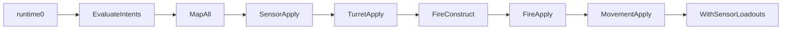

# Task 5.111 — Script Runtime Integration Checkpoint

> **Nur Dokumentation.** Keine Implementierung, keine Tests, keine Änderungen an `src/`, `tests/`, Projekten, Solution oder `game/`.
>
> Sprache: Erklärungen überwiegend auf Deutsch; Typnamen und API-Namen wie im Code auf Englisch.

## 1. Purpose

Nach Task **5.110** unterstützt der Core-Script-Runtime-Pfad alle vier Domänen-Anwendungen: **Sensor**, **Fire**, **Movement** und **Turret**. Der Combined-Composer wendet Turret-Rotation **vor** Fire-Konstruktion an; Fire liest den post-Turret-`MatchState`-Snapshot.

**Ziel von 5.111:** Eine autoritative Checkpoint-Referenz nach Abschluss des Turret-Application-Tracks (**5.107–5.110**). Sie fasst zusammen:

1. Was von **5.71–5.110** fertig ist
2. Wie der aktuelle Combined-Runtime-Flow aussieht
3. Welche APIs und Result-Typen existieren
4. Welche Invarianten gesperrt sind
5. Welche architektonischen Lücken offen bleiben
6. Welcher Track als Nächstes empfohlen wird

Dieses Dokument ändert **kein** Verhalten. Für die Flow-Darstellung nach Movement/Turret ersetzt es die veraltete Composer-Beschreibung in [SCRIPT_RUNTIME_ROADMAP_CHECKPOINT.md](SCRIPT_RUNTIME_ROADMAP_CHECKPOINT.md) §3–§4 (ohne die ältere Datei zu editieren).

Querverweise: [SCRIPT_MOVEMENT_APPLICATION_PLAN.md](SCRIPT_MOVEMENT_APPLICATION_PLAN.md), [SCRIPT_TURRET_APPLICATION_PLAN.md](SCRIPT_TURRET_APPLICATION_PLAN.md), [COMBINED_RUNTIME_LOGGING_CHECKPOINT.md](COMBINED_RUNTIME_LOGGING_CHECKPOINT.md), [PROJECTILE_SPAWN_TICK_INVENTORY.md](PROJECTILE_SPAWN_TICK_INVENTORY.md), [MUZZLE_RADIUS_TUNING_CHECKPOINT.md](MUZZLE_RADIUS_TUNING_CHECKPOINT.md).

**Test-Baseline (Repo):** 2840 Tests nach 5.110.

## 2. Completed Milestone Summary

| Bereich | Ergebnis | Notizen |
| ------- | -------- | ------- |
| **5.71–5.74** | Script-gemappte Fire-Request-Konstruktion und -Anwendung | [`ScriptMappedFireRequestConstructionPipeline`](../src/ScriptTanks.Core/Scripting/ScriptMappedFireRequestConstructionPipeline.cs), [`ScriptMappedFireRequestApplicationPipeline`](../src/ScriptTanks.Core/Scripting/ScriptMappedFireRequestApplicationPipeline.cs) |
| **5.75–5.80** | Combined Composer + Per-Tick-Pipeline | [`CombinedScriptRuntimeComposer`](../src/ScriptTanks.Core/Scripting/CombinedScriptRuntimeComposer.cs), [`CombinedRuntimeTickPipeline`](../src/ScriptTanks.Core/Scripting/CombinedRuntimeTickPipeline.cs) |
| **5.81–5.84** | Combined Runner + Replay Recorder | [`CombinedRuntimeRunner`](../src/ScriptTanks.Core/Scripting/CombinedRuntimeRunner.cs), [`CombinedRuntimeReplayRecorder`](../src/ScriptTanks.Core/Replay/CombinedRuntimeReplayRecorder.cs) |
| **5.85–5.95** | Logged Runner/Replay + Rich opt-in Tick-Logs | [COMBINED_RUNTIME_LOGGING_CHECKPOINT.md](COMBINED_RUNTIME_LOGGING_CHECKPOINT.md) |
| **5.96–5.100** | `SpawnTick` Owner-Self-Hit-Policy | [`ProjectileState.SpawnTick`](../src/ScriptTanks.Core/Projectiles/ProjectileState.cs), [PROJECTILE_SPAWN_TICK_INVENTORY.md](PROJECTILE_SPAWN_TICK_INVENTORY.md) |
| **5.101** | Roadmap-Checkpoint: Movement, dann Turret | [SCRIPT_RUNTIME_ROADMAP_CHECKPOINT.md](SCRIPT_RUNTIME_ROADMAP_CHECKPOINT.md) |
| **5.102–5.106** | Movement-Application-Track | Nur `VelocityPerTick`; keine Positionsintegration — [SCRIPT_MOVEMENT_APPLICATION_PLAN.md](SCRIPT_MOVEMENT_APPLICATION_PLAN.md) |
| **5.107–5.110** | Turret-Application-Track | `TurretRotation` vor Fire; Fire-Guards aktualisiert — [SCRIPT_TURRET_APPLICATION_PLAN.md](SCRIPT_TURRET_APPLICATION_PLAN.md) |

## 3. Current Combined Runtime Flow

### Composer (ein Script-Pass, Option A)

```text
runtime₀
  → MatchScriptIntentIntegrationComposer.EvaluateIntents
  → ScriptTranslatedCommandDomainMapper.MapAll
  → ScriptMappedSensorRequestApplicationPipeline.Apply(runtime₀, mapping)
  → ScriptMappedTurretRequestApplicationPipeline.Apply(runtime₀, mapping)
  → ScriptMappedFireRequestConstructionPipeline.Construct(turret.FinalRuntime, mapping, sequence)
  → ScriptMappedFireRequestApplicationPipeline.Apply(turret.FinalRuntime, fireConstruction)
  → ScriptMappedMovementRequestApplicationPipeline.Apply(fire.FinalRuntime, mapping)
  → finalRuntime = movement.FinalRuntime.WithSensorLoadouts(sensor.FinalRuntime.SensorLoadouts)
```

Quelle: [`CombinedScriptRuntimeComposer.Run`](../src/ScriptTanks.Core/Scripting/CombinedScriptRuntimeComposer.cs).



### Per-Tick-Wrapper

[`CombinedRuntimeTickPipeline.Step`](../src/ScriptTanks.Core/Scripting/CombinedRuntimeTickPipeline.cs) führt zuerst den Composer aus, dann [`MatchTickPipeline.Step`](../src/ScriptTanks.Core/Match/MatchTickPipeline.cs) auf `scriptResult.FinalRuntime.State`. Der Tick-Schritt bewegt **Projektile** und löst Treffer aus; er integriert **keine** Tank-`Position` aus `VelocityPerTick`.

### Finale Feldquellen (`CombinedScriptRuntimeComposerResult`)

| Feld | Quelle |
| ---- | ------ |
| `FinalRuntime.State` | `MovementApplicationResult.FinalRuntime.State` |
| `FinalRuntime.SensorLoadouts` | `SensorApplicationResult.FinalRuntime.SensorLoadouts` |
| `FinalProjectileIdSequence` | `FireConstructionPipelineResult.FinalProjectileIdSequence` |

Zwischenergebnis **neu in 5.110:** `TurretApplicationResult` (Referenzkette validiert gegen `MappingResult`).

**Post-Turret-Fire-Nachweis (Tests, keine Mapping-Hacks):** `TurretApply` → Re-Map auf post-Turret-Runtime → `FireConstruct` — siehe [`ScriptMappedFireRequestConstructionPipelineTests.cs`](../tests/ScriptTanks.Core.Tests/Scripting/ScriptMappedFireRequestConstructionPipelineTests.cs).

## 4. API Inventory

| Bereich | Typ / API | Pfad |
| ------- | --------- | ---- |
| Combined Composer | `CombinedScriptRuntimeComposer` | [`CombinedScriptRuntimeComposer.cs`](../src/ScriptTanks.Core/Scripting/CombinedScriptRuntimeComposer.cs) |
| Composer-Ergebnis | `CombinedScriptRuntimeComposerResult` | [`CombinedScriptRuntimeComposerResult.cs`](../src/ScriptTanks.Core/Scripting/CombinedScriptRuntimeComposerResult.cs) |
| Sensor Apply | `ScriptMappedSensorRequestApplicationPipeline` | [`ScriptMappedSensorRequestApplicationPipeline.cs`](../src/ScriptTanks.Core/Scripting/ScriptMappedSensorRequestApplicationPipeline.cs) |
| Turret Apply | `ScriptMappedTurretRequestApplicationPipeline` | [`ScriptMappedTurretRequestApplicationPipeline.cs`](../src/ScriptTanks.Core/Scripting/ScriptMappedTurretRequestApplicationPipeline.cs) |
| Fire Construct | `ScriptMappedFireRequestConstructionPipeline` | [`ScriptMappedFireRequestConstructionPipeline.cs`](../src/ScriptTanks.Core/Scripting/ScriptMappedFireRequestConstructionPipeline.cs) |
| Fire Apply | `ScriptMappedFireRequestApplicationPipeline` | [`ScriptMappedFireRequestApplicationPipeline.cs`](../src/ScriptTanks.Core/Scripting/ScriptMappedFireRequestApplicationPipeline.cs) |
| Movement Apply | `ScriptMappedMovementRequestApplicationPipeline` | [`ScriptMappedMovementRequestApplicationPipeline.cs`](../src/ScriptTanks.Core/Scripting/ScriptMappedMovementRequestApplicationPipeline.cs) |
| Combined Tick | `CombinedRuntimeTickPipeline` | [`CombinedRuntimeTickPipeline.cs`](../src/ScriptTanks.Core/Scripting/CombinedRuntimeTickPipeline.cs) |
| Tick-Ergebnis | `CombinedRuntimeTickResult` | [`CombinedRuntimeTickResult.cs`](../src/ScriptTanks.Core/Scripting/CombinedRuntimeTickResult.cs) |
| Runner | `CombinedRuntimeRunner` | [`CombinedRuntimeRunner.cs`](../src/ScriptTanks.Core/Scripting/CombinedRuntimeRunner.cs) |
| Run-Ergebnis | `CombinedRuntimeRunResult` | [`CombinedRuntimeRunResult.cs`](../src/ScriptTanks.Core/Scripting/CombinedRuntimeRunResult.cs) |
| Replay | `CombinedRuntimeReplayRecorder` | [`CombinedRuntimeReplayRecorder.cs`](../src/ScriptTanks.Core/Replay/CombinedRuntimeReplayRecorder.cs) |
| Logged Runner | `LoggedCombinedRuntimeRunner` | [`LoggedCombinedRuntimeRunner.cs`](../src/ScriptTanks.Core/Scripting/LoggedCombinedRuntimeRunner.cs) |
| Logged Replay | `LoggedCombinedRuntimeReplayRecorder` | [`LoggedCombinedRuntimeReplayRecorder.cs`](../src/ScriptTanks.Core/Replay/LoggedCombinedRuntimeReplayRecorder.cs) |
| Tick-Log-Factory | `CombinedRuntimeTickCombatLogFactory` | [`CombinedRuntimeTickCombatLogFactory.cs`](../src/ScriptTanks.Core/Logging/CombinedRuntimeTickCombatLogFactory.cs) |
| Spawn-Tick | `ProjectileState.SpawnTick` | [`ProjectileState.cs`](../src/ScriptTanks.Core/Projectiles/ProjectileState.cs) |

### Domain-Result-Typen (Auswahl)

| Domäne | Result / Record |
| ------ | ----------------- |
| Sensor | `ScriptMappedSensorRequestApplicationResult` |
| Turret | `ScriptMappedTurretRequestApplicationResult`, `ScriptMappedTurretRequestApplicationRecord` |
| Fire | `ScriptMappedFireRequestConstructionPipelineResult`, `ScriptMappedFireRequestApplicationResult` |
| Movement | `ScriptMappedMovementRequestApplicationResult` |
| Aim (MVP) | [`FixedRotationAimResolver`](../src/ScriptTanks.Core/Math/FixedRotationAimResolver.cs) — nur Kardinalrichtungen |

## 5. Stable Invariants

### Runtime-Reihenfolge (Composer)

```text
Sensor → Turret → Fire → Movement → final merge (Option A)
```

Sensor und Turret lesen `runtime₀`. Fire construct/apply lesen `turretApplicationResult.FinalRuntime`. Movement liest `fireApplicationResult.FinalRuntime`.

### Rotations-Semantik

| Concern | Quelle |
| ------- | ------ |
| Bewegungsrichtung (Velocity) | `BodyRotation` — [`ScriptMovementVelocityResolver`](../src/ScriptTanks.Core/Scripting/ScriptMovementVelocityResolver.cs) |
| Feuerrichtung (Muzzle, Velocity) | `TurretRotation` — [`FireMuzzlePositionResolver`](../src/ScriptTanks.Core/Combat/FireMuzzlePositionResolver.cs), [`FireVelocityResolver`](../src/ScriptTanks.Core/Combat/FireVelocityResolver.cs) |
| Turret-Befehl | mutiert nur `TurretRotation` |
| Movement-Befehl | mutiert nur `MovementState.VelocityPerTick` |

### Fire-Guard-Entscheidung (5.110)

Fire construction/application **erfordern nicht mehr** `runtime == mappingResult.IntegrationResult.Runtime`. Der übergebene Runtime-Snapshot ist die autoritative `MatchState`-Quelle für Resolver und `MatchStateFireSystem`.

**Grund:** Turret-Application erzeugt einen post-Turret-Snapshot, den Fire konsumieren muss. Die Mapping-Referenzkette bleibt über Result-Typen und [`CombinedScriptRuntimeComposerResult`](../src/ScriptTanks.Core/Scripting/CombinedScriptRuntimeComposerResult.cs) validiert.

### SpawnTick

Owner-Self-Hit wird nur gefiltert, wenn `projectile.SpawnTick == state.CurrentTick` ([`MatchStateProjectileHitSystem`](../src/ScriptTanks.Core/Match/MatchStateProjectileHitSystem.cs)).

### Replay

Replay-Frames bleiben **nur** [`MatchState`](../src/ScriptTanks.Core/Match/MatchState.cs). Kein `CombinedRuntimeTickResult`, keine `SensorLoadouts` im Frame-Schema — [COMBINED_RUNTIME_LOGGING_CHECKPOINT.md](COMBINED_RUNTIME_LOGGING_CHECKPOINT.md) §5.

### Logging

| Modus | Combat-Log |
| ----- | ---------- |
| MVP (Default) | `match_started`, `match_ended` |
| Rich (Opt-in) | + `script_tick`, `fire_request_applied`, `fire_rejected` |

**Noch nicht:** Movement- oder Turret-Event-Typen in [`CombatLogEventTypes`](../src/ScriptTanks.Core/Logging/CombatLogEventTypes.cs).

### Tick-Reihenfolge (Option A)

Scripts **vor** `MatchTickPipeline.Step` — unverändert seit 5.80.

## 6. Current Gameplay Capability

| Fähigkeit | Status |
| --------- | ------ |
| Sensor-Scan-Anwendung | **Implementiert** |
| Fire-Konstruktion + -Anwendung | **Implementiert** |
| Projektil Spawn / Tick / Hit / Cleanup | **Implementiert** (über `MatchTickPipeline` nach Script-Phase) |
| Movement-Velocity-Befehl | **Implementiert** (`VelocityPerTick` gesetzt) |
| Movement-Positionsintegration | **Fehlt** |
| Turret-Aim-Befehl | **Implementiert** (instant, Kardinal-MVP) |
| Aim-before-Fire State-Pfad | **Implementiert** (5.110) |
| Vollwinkel-Aim-Resolver | **Fehlt** |
| Turret Turn-Rate / schrittweise Rotation | **Fehlt** |
| Runner / Replay | **Implementiert** |
| Logged Runner / Replay | **Implementiert** |
| Rich Script-Tick-Logs | **Teilweise** (Fire-Subset) |
| Godot-Integration | **Fehlt** |

Der Runtime-Pfad kann Tank-**Intent** für Sensor, Fire, Movement und Turret ausdrücken. Panzer **bewegen sich physisch nicht** durch den Combined-Tick: `Position` bleibt unverändert, obwohl `VelocityPerTick` gesetzt werden kann.

## 7. Open Architecture Gaps

### 1. Tank Movement Integration

[`MovementIntegrator`](../src/ScriptTanks.Core/Movement/MovementIntegrator.cs) existiert, aber [`MatchTickPipeline`](../src/ScriptTanks.Core/Match/MatchTickPipeline.cs) und [`CombinedRuntimeTickPipeline`](../src/ScriptTanks.Core/Scripting/CombinedRuntimeTickPipeline.cs) integrieren keine Tank-Positions-Schritte.

**Heute:** `VelocityPerTick` wird gesetzt; `Position` bleibt gleich.

### 2. Full-Angle Turret Aiming

[`FixedRotationAimResolver`](../src/ScriptTanks.Core/Math/FixedRotationAimResolver.cs) löst nur Kardinalrichtungen (+X, +Y, −X, −Y). Diagonale oder nicht achsenparallele Zielrichtung → `MissingAimSolution`.

### 3. Turret Turn-Rate

Turret-Application ist **instant**. Keine maximale Drehgeschwindigkeit, kein schrittweises Drehen pro Tick.

### 4. Unified Public Runner API

`CombinedRuntime*` existiert parallel zu [`MatchRunner`](../src/ScriptTanks.Core/Match/MatchRunner.cs) / [`MatchReplayRecorder`](../src/ScriptTanks.Core/Replay/MatchReplayRecorder.cs). Keine produktweite „eine API für alle Aufrufer“-Fassade.

### 5. Rich Diagnostics

Keine Movement-/Turret-Combat-Log-Events. Kein verbose per-Domain-Trace im Replay.

### 6. Godot Boundary

Core-Systeme sind für Integration vorbereitet; `game/` ist nicht an den Combined-Runtime-Loop angebunden.

## 8. Next Track Options

| Track | Wert | Risiko | Empfehlung |
| ----- | ---- | ------ | ---------- |
| **A — Tank Movement Tick Integration** | Movement-Befehle werden sichtbar in `Position` | Viele Projectile-/Hit-/Positions-Tests betroffen | **Haupt-Track (§9)** |
| **B — Full-Angle Turret Resolver** | `AimAtEnemy` über Kardinal-Fixtures hinaus | Fixed-Point-Trig / Approximation-Design | Medium; nach A oder parallel Mini-Track |
| **C — Turret Turn-Rate** | Realistischeres Gefecht | Tick-Semantik für schrittweises Drehen | Medium; nach B oder A |
| **D — Godot Integration** | Sichtbarer Gameplay-Loop | Braucht stabile Produkt-API | Später |
| **E — Rich Movement/Turret Logs** | Besseres Debugging | Event-Schema-Creep | Später |
| **F — Public Combined-Runtime-Fassade** | Klarere API für externe Aufrufer | Überwiegend Architektur/Docs | Medium-hoch; optional 5.111A |

Der Turret-Track **5.107–5.110** ist abgeschlossen. Track B ist **kein** Ersatz für A, solange Positionen stillstehen.

## 9. Recommended Roadmap After 5.110

**Recommended next main track:** Tank Movement Tick Integration

Movement-Befehle setzen heute `VelocityPerTick`, aber [`CombinedRuntimeTickPipeline`](../src/ScriptTanks.Core/Scripting/CombinedRuntimeTickPipeline.cs) und [`MatchTickPipeline`](../src/ScriptTanks.Core/Match/MatchTickPipeline.cs) wenden diese Geschwindigkeit nicht auf Tank-`Position` an. Das ist die größte verbleibende Gameplay-Lücke nach Sensor-, Fire-, Movement- und Turret-**Application**.

**Nächster Haupt-Track ist Tank Movement Tick Integration**, sofern nicht ausdrücklich Godot/UI oder ein Mini-Track (5.111A/B) gewählt wird.

### Vorgeschlagene Tasks

| Task | Inhalt |
| ---- | ------ |
| **5.112** | Plan: Tank Movement Tick Integration |
| **5.113** | Tank-Movement-Result / Helper-Modelle (falls nötig) |
| **5.114** | `MatchStateTankMovementPipeline` oder äquivalente reine Tank-Step-Pipeline |
| **5.115** | Integration in `CombinedRuntimeTickPipeline` oder kombinierte Tick-Variante |
| **5.116** | Runner / Replay / Logged-Regression für bewegende Panzer |
| **5.117** | Projectile-/Tank-Kollisions-Regression nach bewegenden Panzer |

### Optionale Mini-Tracks (nur bei expliziter Wahl)

| Task | Inhalt |
| ---- | ------ |
| **5.111A** | Combined-Runtime Public-Fassade / API-Checkpoint |
| **5.111B** | Full-Angle-Aim-Resolver-Design |

Tracks B–F aus §8 bleiben vergleichend dokumentiert; sie sind **keine** gleichwertigen Haupt-Empfehlungen neben A.

## 10. What Not To Do Next

Explizit **nicht** als Nächstes:

- Movement-/Turret-Log-Events, bevor Kernverhalten (insbesondere Positionsintegration) stabil ist
- Godot-Integration, bevor Movement-Tick-Verhalten feststeht
- Vollwinkel-Aiming mit Floats / `Math.Atan2`
- Turret Turn-Rate, bevor Tick-Semantik für schrittweises Drehen definiert ist
- Ersetzen von [`MatchRunner`](../src/ScriptTanks.Core/Match/MatchRunner.cs) ohne Migrationsplan
- Casual Replay-Frame-Schema-Änderungen
- Muzzle-/Radius-Tuning in [`WeaponCatalog`](../src/ScriptTanks.Core/Weapons/WeaponCatalog.cs) — weiter [MUZZLE_RADIUS_TUNING_CHECKPOINT.md](MUZZLE_RADIUS_TUNING_CHECKPOINT.md) deferred

## 11. Verification

Nach dem Schreiben dieses Dokuments (docs-only):

```powershell
dotnet build ScriptTanks.sln -warnaserror
dotnet test ScriptTanks.sln
```

**Erwartung:**

- 0 Warnungen
- **2840** Tests bestanden (unverändert gegenüber 5.110)

## 12. Definition of Done

- [x] [`docs/SCRIPT_RUNTIME_INTEGRATION_CHECKPOINT.md`](SCRIPT_RUNTIME_INTEGRATION_CHECKPOINT.md) existiert
- [x] Abgeschlossene Meilensteine 5.71–5.110 sind zusammengefasst (§2)
- [x] Aktueller Combined-Runtime-Flow ist dokumentiert (§3)
- [x] API-Inventar nutzt repo-relative Links `../src/...` (§4)
- [x] Stabile Invarianten sind gelistet (§5)
- [x] Offene Lücken sind dokumentiert (§7)
- [x] Nächster Roadmap-Track ist eindeutig empfohlen: **Tank Movement Tick Integration** (§9)
- [x] Keine Änderungen an `src/`, `tests/`, `game/`, `.csproj` oder Plan-Dateien
- [x] `dotnet build ScriptTanks.sln -warnaserror` ist grün
- [x] `dotnet test ScriptTanks.sln` bleibt bei **2840** Tests
