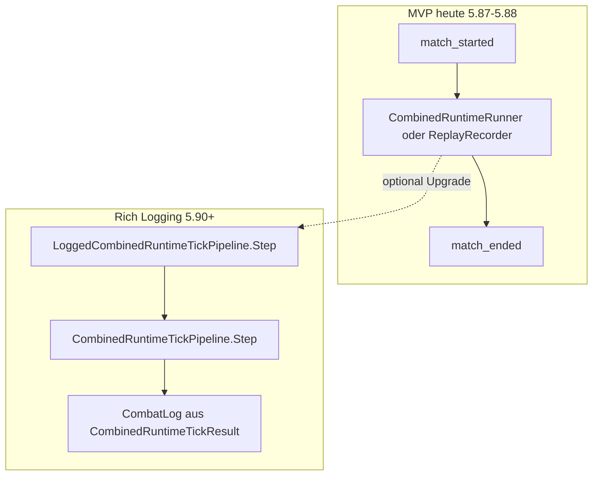
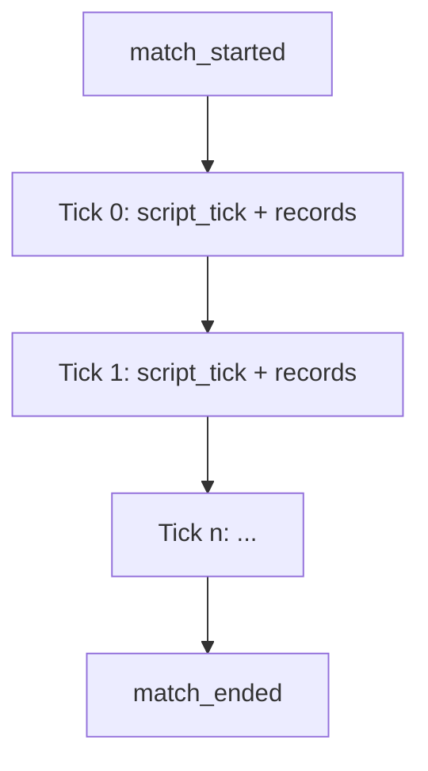

# Task 5.89 — Script/Tick Combat Event Design Plan

> **Nur Dokumentation.** Keine Implementierung, keine Tests, keine Änderungen an `src/`, `tests/`, Projekten, Solution oder `game/`.
>
> Sprache: Erklärungen überwiegend auf Deutsch; Typnamen und API-Skizzen wie im Code auf Englisch.

## 1. Purpose

Nach Tasks **5.87** und **5.88** ist die **Start/End-Logging**-Integration für den Combined-Runtime-Pfad stabil:

- [`LoggedCombinedRuntimeRunner.cs`](../src/ScriptTanks.Core/Scripting/LoggedCombinedRuntimeRunner.cs) — `match_started` → [`CombinedRuntimeRunner.RunUntilEnd`](../src/ScriptTanks.Core/Scripting/CombinedRuntimeRunner.cs) → `match_ended`
- [`LoggedCombinedRuntimeReplayRecorder.cs`](../src/ScriptTanks.Core/Replay/LoggedCombinedRuntimeReplayRecorder.cs) — Recorder zuerst, Logs aus `recorded.RunResult` (siehe [LOGGED_COMBINED_RUNTIME_RUNNER_REPLAY_PLAN.md](LOGGED_COMBINED_RUNTIME_RUNNER_REPLAY_PLAN.md) §6)

Beide liefern genau **zwei** CombatLog-Einträge (`match_started`, `match_ended`). Per-Tick-Script-, Fire- und Sensor-Events sind bewusst ausgeschlossen (deferred in [LOGGED_COMBINED_RUNTIME_RUNNER_REPLAY_PLAN.md](LOGGED_COMBINED_RUNTIME_RUNNER_REPLAY_PLAN.md) §7).

**Dieses Dokument** beantwortet die nächste Designfrage:

> Wenn wir später per-Tick-Script-Diagnostics im `CombatLog` wollen — welche Event-Typen, Payloads und Reihenfolge gelten — **ohne** Simulation, Replay-Schema oder bestehende MVP-Runner zu ändern?

Es definiert **keine** Konstanten, Factories oder Pipeline-Implementierung (Follow-ups 5.90–5.94).

## 2. Current State

| Bereich | Status im Repo |
| ------- | -------------- |
| **Combined tick pipeline** | [`CombinedRuntimeTickPipeline.Step`](../src/ScriptTanks.Core/Scripting/CombinedRuntimeTickPipeline.cs) — Script-Compose → [`MatchTickPipeline.Step`](../src/ScriptTanks.Core/Match/MatchTickPipeline.cs) → Runtime fold-back |
| **Combined tick result** | [`CombinedRuntimeTickResult.cs`](../src/ScriptTanks.Core/Scripting/CombinedRuntimeTickResult.cs) — `ScriptResult`, `SteppedState`, `FinalRuntime`, `FinalProjectileIdSequence` |
| **Logged combined runner** | [`LoggedCombinedRuntimeRunner.cs`](../src/ScriptTanks.Core/Scripting/LoggedCombinedRuntimeRunner.cs) — implementiert (5.87) |
| **Logged combined replay** | [`LoggedCombinedRuntimeReplayRecorder.cs`](../src/ScriptTanks.Core/Replay/LoggedCombinedRuntimeReplayRecorder.cs) — implementiert (5.88) |
| **Logged combined results** | [`LoggedCombinedRuntimeRunResult.cs`](../src/ScriptTanks.Core/Scripting/LoggedCombinedRuntimeRunResult.cs), [`LoggedCombinedRuntimeRecordedRunResult.cs`](../src/ScriptTanks.Core/Replay/LoggedCombinedRuntimeRecordedRunResult.cs) |
| **Script-specific combat events** | **Existieren nicht** in [`CombatLogEventTypes.cs`](../src/ScriptTanks.Core/Logging/CombatLogEventTypes.cs) |
| **Logged combined tick pipeline** | **Existiert nicht** (`LoggedCombinedRuntimeTickPipeline`) |

```text
Heute (5.87 / 5.88 MVP):
  LoggedCombinedRuntimeRunner / LoggedCombinedRuntimeReplayRecorder
  → nur match_started + match_ended

Noch nicht möglich:
  script_tick, fire_request_applied, fire_rejected, …
  LoggedCombinedRuntimeTickPipeline
```

**Replay-Policy unverändert:** [`MatchReplayFrame.cs`](../src/ScriptTanks.Core/Replay/MatchReplayFrame.cs) bleibt **nur** [`MatchState`](../src/ScriptTanks.Core/Match/MatchState.cs) ([`CombinedRuntimeReplayRecorder.cs`](../src/ScriptTanks.Core/Replay/CombinedRuntimeReplayRecorder.cs), [COMBINED_RUNTIME_RUNNER_REPLAY_PLAN.md](COMBINED_RUNTIME_RUNNER_REPLAY_PLAN.md) §8). Rich Events betreffen nur `CombatLog`, nicht Recording-Frames.



## 3. Existing Diagnostic Sources

Die Combined-Tick-Pipeline liefert bereits vollständige Script-/Sensor-/Fire-Diagnostics in [`CombinedRuntimeTickResult.ScriptResult`](../src/ScriptTanks.Core/Scripting/CombinedRuntimeTickResult.cs) ([`CombinedScriptRuntimeComposerResult.cs`](../src/ScriptTanks.Core/Scripting/CombinedScriptRuntimeComposerResult.cs)):

```text
CombinedRuntimeTickResult
└─ ScriptResult: CombinedScriptRuntimeComposerResult
   ├─ IntegrationResult: MatchScriptIntentIntegrationResult
   │  └─ Records[]: MatchScriptIntentIntegrationRecord
   │     (TankIndex, TankId, Context, EvaluationRecord, TranslationOutput)
   ├─ MappingResult: MatchScriptDomainRequestMappingResult
   │  └─ Records[]: ScriptDomainRequestMappingRecord (1:1 mit Integration)
   ├─ SensorApplicationResult: ScriptMappedSensorRequestApplicationResult
   │  └─ Records[]: ScriptMappedSensorRequestApplicationRecord
   │     (RecordIndex, DidApply, ScanResult?)
   ├─ FireConstructionPipelineResult: ScriptMappedFireRequestConstructionPipelineResult
   │  └─ ConstructionResult: ScriptMappedFireRequestConstructionResult
   │     └─ Records[]: ScriptMappedFireRequestConstructionRecord
   │        (RecordIndex, Status, FireRequest?)
   └─ FireApplicationResult: ScriptMappedFireRequestApplicationResult
      └─ Records[]: ScriptMappedFireRequestApplicationRecord
         (RecordIndex, Status, FireOutcome?)
```

| Result-Typ | Pfad | Rolle für Logging |
| ---------- | ---- | ----------------- |
| `MatchScriptIntentIntegrationResult` | [`MatchScriptIntentIntegrationResult.cs`](../src/ScriptTanks.Core/Scripting/MatchScriptIntentIntegrationResult.cs) | Pro-Tank Script-Evaluation |
| `MatchScriptDomainRequestMappingResult` | [`MatchScriptDomainRequestMappingResult.cs`](../src/ScriptTanks.Core/Scripting/MatchScriptDomainRequestMappingResult.cs) | Domain-Mapping pro Tank |
| `ScriptMappedSensorRequestApplicationResult` | [`ScriptMappedSensorRequestApplicationResult.cs`](../src/ScriptTanks.Core/Scripting/ScriptMappedSensorRequestApplicationResult.cs) | Sensor apply/skip pro Record |
| `ScriptMappedFireRequestConstructionPipelineResult` | [`ScriptMappedFireRequestConstructionPipelineResult.cs`](../src/ScriptTanks.Core/Scripting/ScriptMappedFireRequestConstructionPipelineResult.cs) | Fire-Request-Konstruktion |
| `ScriptMappedFireRequestApplicationResult` | [`ScriptMappedFireRequestApplicationResult.cs`](../src/ScriptTanks.Core/Scripting/ScriptMappedFireRequestApplicationResult.cs) | Fire apply/reject pro Record |

**Deterministische Iteration:** Alle Batch-Results exponieren `Count`, `GetRecordAtIndex(int recordIndex)` und feste Tank-Ausrichtung. Logging muss `for (i = 0; i < result.Count; i++)` verwenden — **keine** Dictionary-Iteration ohne Sortierung.

**Präzedenz (Match-Pfad):** [`LoggedMatchTickFireThenProjectilePipeline.cs`](../src/ScriptTanks.Core/Match/LoggedMatchTickFireThenProjectilePipeline.cs) wrappt einen ungeloggten Tick-Step und erzeugt `CombatLog` via [`FireCombatLogFactory.cs`](../src/ScriptTanks.Core/Logging/FireCombatLogFactory.cs). Der Combined-Pfad soll dasselbe Muster nutzen: **Wrapper**, Core-Pipeline unverändert.

## 4. Candidate Event Types

Design-only — Konstanten in [`CombatLogEventTypes.cs`](../src/ScriptTanks.Core/Logging/CombatLogEventTypes.cs) erst in Task **5.90**:

| Event (snake_case) | Primärquelle | Absicht |
| ------------------ | ------------ | ------- |
| `script_tick` | Aggregiert aus `CombinedRuntimeTickResult` / `ScriptResult` | Eine Summary-Zeile pro Simulations-Tick |
| `script_intent_evaluated` | [`MatchScriptIntentIntegrationRecord.cs`](../src/ScriptTanks.Core/Scripting/MatchScriptIntentIntegrationRecord.cs) | Pro-Tank Script-Evaluation (hohe Verbosity) |
| `script_domain_mapped` | `ScriptDomainRequestMappingRecord` | Pro-Tank Domain-Mapping |
| `sensor_request_applied` | [`ScriptMappedSensorRequestApplicationRecord.cs`](../src/ScriptTanks.Core/Scripting/ScriptMappedSensorRequestApplicationRecord.cs) | Sensor apply/skip pro Record |
| `fire_request_constructed` | [`ScriptMappedFireRequestConstructionRecord.cs`](../src/ScriptTanks.Core/Scripting/ScriptMappedFireRequestConstructionRecord.cs) | Konstruktion/skip pro Record |
| `fire_request_applied` | `ScriptMappedFireRequestApplicationRecord` mit `Applied` | Script-gemapptes Fire erfolgreich |
| `fire_rejected` | Gleiches Record mit `FireRejected` | Konstruiert, aber `DidFire == false` |

### Abgrenzung zu bestehenden Match-Fire-Events

[`CombatLogEventTypes.cs`](../src/ScriptTanks.Core/Logging/CombatLogEventTypes.cs) enthält bereits:

- `fire_requested`, `fire_succeeded`, `fire_not_ready`, `fire_failed` (scheduled-fire / [`FireCombatLogFactory.cs`](../src/ScriptTanks.Core/Logging/FireCombatLogFactory.cs))

Die neuen `fire_request_*`-Events sind ein **eigenes Namespace** für die Script-Composer-Pipeline — **kein** Rename der Scheduled-Fire-Logs aus dem Match-Tick-Pfad.

## 5. MVP Event Recommendation

**Erste Implementierung** (ab 5.92, wenn Rich Logging aktiviert wird) — minimal:

| Priorität | Event | Wann emitieren |
| --------- | ----- | -------------- |
| 1 | `script_tick` | Genau **ein** Eintrag pro Tick, wenn Rich Logging an |
| 2 | `fire_request_applied` | Nur `ScriptMappedFireRequestApplicationStatus.Applied` |
| 3 | `fire_rejected` | Nur `FireRejected`; grobe Reason: `not_ready` wenn `FireOutcome.DidFire == false` |

**Zurückstellen** (nur bei Debug-Bedarf):

- `script_intent_evaluated`, `script_domain_mapped`, `sensor_request_applied`, `fire_request_constructed`

**Nicht loggen in MVP:**

- `SkippedNotConstructed`
- Nicht-Fire-Construction-Statuses (`NotWeapon`, `NoFireCommand`, `Unsupported`, …)

**Später / orthogonal:** Projectile-/Damage-Logs aus [`MatchTickPipeline.cs`](../src/ScriptTanks.Core/Match/MatchTickPipeline.cs) — eigener Scope, nicht Teil von 5.89.

## 6. Event Payload Policy

### Allgemein

- Messages: **deterministische, lesbare Strings** (wie [`FireCombatLogFactory.cs`](../src/ScriptTanks.Core/Logging/FireCombatLogFactory.cs) — konkrete Interpolation, keine Template-Engine).
- Numerische IDs: **`CultureInfo.InvariantCulture`** in Factories (5.90).
- Kategorie: voraussichtlich `CombatLogCategory.Script` oder bestehende Kategorien — Entscheidung in 5.90.

### Tick-Zuordnung (festgelegt)

**Policy:** Log-Tick = `InitialRuntime.State.CurrentTick` **vor** dem Combined-Tick-Step (Pre-Step-Tick). Begründung: Alignment mit Frame 0 des Runners/Replays und `match_started`-Tick.

### MVP-Payloads (Message-Format)

**`script_tick`:**

```text
tick={tick} tanks={count} fires_constructed={n} fires_applied={n} fires_rejected={n}
```

Zähler aus `ScriptResult` (Construction-Records mit `DidConstruct`, Application `Applied` / `FireRejected`).

**`fire_request_applied`:**

```text
tick={tick} record_index={i} tank_id={id} projectile_id={pid} weapon_slot={slot}
```

Quellen: `ConstructionRecord.FireRequest` + `FireOutcome.SpawnedProjectile` (nur wenn `Applied`).

**`fire_rejected`:**

```text
tick={tick} record_index={i} tank_id={id} reason=not_ready
```

### Nicht in CombatLog

- Roher Script-Source-Text
- [`ScriptEvaluationContext`](../src/ScriptTanks.Core/Scripting/ScriptEvaluationContext.cs) / volle Evaluation-Records
- [`ScriptCommandTranslationOutput`](../src/ScriptTanks.Core/Scripting/ScriptCommandTranslationOutput.cs)
- Voller [`MatchState`](../src/ScriptTanks.Core/Match/MatchState.cs) oder Sensor-Scan-Payloads
- Arrays von Records als Bulk-JSON
- Replay-Frames

## 7. Ordering Rules

### Pro Tick (Rich Logging aktiv)

```text
script_tick
for recordIndex = 0 .. Count-1 (aufsteigend):
  [optional, wenn verbose:] script_intent_evaluated → script_domain_mapped
                        → sensor_request_applied → fire_request_constructed
  fire_request_applied / fire_rejected für diesen Index (falls zutreffend)
[später:] projectile events aus MatchTickPipeline
```

### Globales Log (nach [`CombatLogMerger.Merge`](../src/ScriptTanks.Core/Logging/CombatLogMerger.cs))

```text
match_started
alle Per-Tick-Einträge: aufsteigend SimTick, dann aufsteigend recordIndex innerhalb des Ticks
match_ended
```

[`CombatLog.cs`](../src/ScriptTanks.Core/Logging/CombatLog.cs) erzwingt **nicht absteigende** `SimTick` über die gesamte Liste. Mehrere Einträge pro Tick sind erlaubt; Reihenfolge **innerhalb** eines Ticks = **Einfügereihenfolge** beim Merge — Factories müssen die obige Reihenfolge **vor** `Merge` einhalten.



## 8. Determinism Requirements

| Verboten | Erlaubt / Pflicht |
| -------- | ----------------- |
| `Random`, GUIDs, Systemuhr | Gleiche `CombinedRuntimeTickResult`-Eingabe → identische Log-Einträge (Type, Tick, Message) |
| Dictionary-Iteration ohne Sortierung | `GetRecordAtIndex(i)` für `i = 0 .. Count-1` |
| Culture-sensitive Zahlenformatierung | `InvariantCulture` für alle numerischen Message-Teile |
| Mutation von Runtime/Tick-Result/Replay | Logging nur lesen, neue `CombatLog`-Snapshots bauen |

Simulation: Ungeloggter [`CombinedRuntimeRunner`](../src/ScriptTanks.Core/Scripting/CombinedRuntimeRunner.cs) / [`CombinedRuntimeReplayRecorder`](../src/ScriptTanks.Core/Replay/CombinedRuntimeReplayRecorder.cs) bleibt bit-identisch, wenn Rich Logging aus ist.

## 9. Privacy / Size Boundary

`CombatLog` bleibt **kompakt** und vom Replay getrennt ([`MatchRecording.cs`](../src/ScriptTanks.Core/Replay/MatchRecording.cs) = nur `MatchState`-Frames).

**Nicht loggen:**

| Kategorie | Beispiel |
| --------- | -------- |
| Script-Quelltext | Program/Routine-Source |
| Volle Diagnostics | `ScriptRuntimeEvaluationRecord`, Translation-Details |
| Kontext-Snapshots | Sensor-Kontext, kompletter Match-State |
| Replay-Daten | `MatchReplayFrame`, Sensor-Loadouts in Frames |
| Bulk-Strukturen | Gesamte Record-Arrays, große Listen |

Ziel: Replay-kompatibles, deterministisches Log für UI/Debug — nicht Ersatz für [`MatchScriptRuntimeEvaluationRecordedRunResult`](../src/ScriptTanks.Core/Scripting/MatchScriptRuntimeEvaluationRecordedRunResult.cs)-Text-Exporte.

## 10. Factory / Type Sketch

### Empfehlung: Option A (minimal, erste Implementierung)

| Zukünftige Datei | Rolle |
| ---------------- | ----- |
| `CombinedRuntimeTickCombatLogFactory.cs` | `CreateTickLog(CombinedRuntimeTickResult)` — MVP-Subset |
| `LoggedCombinedRuntimeTickResult.cs` | `CombinedRuntimeTickResult` + `CombatLog` |
| `LoggedCombinedRuntimeTickPipeline.cs` | Wrapper um [`CombinedRuntimeTickPipeline.Step`](../src/ScriptTanks.Core/Scripting/CombinedRuntimeTickPipeline.cs) |

### Option B (später, bei Verbose-Events)

- `ScriptCombatLogFactory` / `ScriptTickCombatLogFactory` — aufgeteilte Builder pro Event-Gruppe

**5.91** — `LoggedCombinedRuntimeTickResult` Ctor-Muster wie [`LoggedCombinedRuntimeRunResult.cs`](../src/ScriptTanks.Core/Scripting/LoggedCombinedRuntimeRunResult.cs): `ThrowIfNull` auf beiden Properties, keine Logik im Result-Typ.

## 11. Integration Policy

### Core-Pipeline unverändert

[`CombinedRuntimeTickPipeline.cs`](../src/ScriptTanks.Core/Scripting/CombinedRuntimeTickPipeline.cs) wird **nicht** modifiziert.

### Wrapper-Ablauf

```text
LoggedCombinedRuntimeTickPipeline.Step(runtime, programs, sequence)
  → tickResult = CombinedRuntimeTickPipeline.Step(...)
  → tickLog = CombinedRuntimeTickCombatLogFactory.CreateTickLog(tickResult)
  → return new LoggedCombinedRuntimeTickResult(tickResult, tickLog)
```

### Runner / Replay (5.93 / 5.94)

| Aspekt | Policy |
| ------ | ------ |
| Default | Bestehende [`LoggedCombinedRuntimeRunner.cs`](../src/ScriptTanks.Core/Scripting/LoggedCombinedRuntimeRunner.cs) / [`LoggedCombinedRuntimeReplayRecorder.cs`](../src/ScriptTanks.Core/Replay/LoggedCombinedRuntimeReplayRecorder.cs) bleiben Start/End-only |
| Rich Logging | Opt-in: neue API (`*WithTickLogs`) oder expliziter Parameter; Loop akkumuliert Tick-Logs und `CombatLogMerger.Merge(start, tickLogs..., end)` |
| Tests | Bestehende ~12 Logged-Combined-Tests unverändert grün ohne Opt-in |
| Replay-Frames | Weiterhin **nur** `MatchState` — Rich Events nur im `CombatLog` |

## 12. Follow-up Tasks

| Task | Inhalt |
| ---- | ------ |
| **5.90** | `CombatLogEventTypes`-Konstanten (`script_tick`, `fire_request_applied`, `fire_rejected`, …) + `CombinedRuntimeTickCombatLogFactory` + Unit-Tests für Message-Shape |
| **5.91** | `LoggedCombinedRuntimeTickResult` Modell + Ctor/Null-Tests |
| **5.92** | `LoggedCombinedRuntimeTickPipeline` — Wrapper, Parität mit ungeloggtem Tick, Log-Scope/Order-Tests |
| **5.93** | `LoggedCombinedRuntimeRunner` Rich-Events-Variante oder Upgrade mit Opt-in |
| **5.94** | `LoggedCombinedRuntimeReplayRecorder` Rich-Events-Variante; Replay-Frames weiter MatchState-only |

Voraussetzung für 5.93/5.94: 5.90–5.92 abgeschlossen; dieses Design-Dokument ist die Referenz für Event-Scope und Ordering.

## 13. Out of Scope

Für Task **5.89** explizit ausgeschlossen:

- Code, Tests, neue Konstanten, Factories, Pipelines
- Änderungen an [`CombinedRuntimeRunner`](../src/ScriptTanks.Core/Scripting/CombinedRuntimeRunner.cs), [`CombinedRuntimeReplayRecorder`](../src/ScriptTanks.Core/Replay/CombinedRuntimeReplayRecorder.cs), [`CombinedRuntimeTickPipeline`](../src/ScriptTanks.Core/Scripting/CombinedRuntimeTickPipeline.cs)
- Replay-Schema (`CombinedRuntimeReplayFrame`, Sensor-Loadouts in Frames, …)
- Godot, UI, Netzwerk, globale Log-Sinks

## 14. Definition of Done (Task 5.89)

- [`SCRIPT_TICK_COMBAT_EVENT_DESIGN_PLAN.md`](SCRIPT_TICK_COMBAT_EVENT_DESIGN_PLAN.md) existiert mit Abschnitten 1–13
- Alle Links: `../src/...`, `../tests/...` für Code; Peer-`*.md` ohne `../`
- Kandidaten-Events + MVP-Subset (`script_tick`, `fire_request_applied`, `fire_rejected`) dokumentiert
- Ordering-, Determinismus- und Payload-Grenzen explizit
- `dotnet build ScriptTanks.sln -warnaserror` und `dotnet test ScriptTanks.sln` unverändert grün (nur Markdown)
