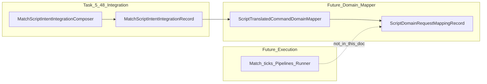

# Task 5.49 — Script Translated Command Domain Mapping Plan

> **Nur Dokumentation.** Keine Implementierung, keine Tests, keine Änderungen an `src/`, `tests/`, Projekten oder der Solution.
>
> Sprache: Erklärungen überwiegend auf Deutsch; Typnamen, API-Skizzen und Kernel-Begriffe wie im Code auf Englisch.

## 1. Purpose

Diese Schicht ist die **nächste Brücke** zwischen der Scripting-/Translation-Pipeline und dem **Gameplay-Kernel**.

Sie erhält **bereits übersetzte** Script-Requests (`ScriptTranslatedCommandRequest` innerhalb von `ScriptCommandTranslationOutput`) und ordnet sie **domänenspezifischen, reinen Kernel-Request-Kategorien** zu — analog zu „welches Subsystem soll diesen Wunsch später bearbeiten“, **nicht** „führe ihn jetzt aus“.

Explizit:

- **Keine** Ausführung von Sensoren, Waffen, Bewegung oder Turm-Logik.
- **Keine** Erzeugung von echten Match-Ticks, Scheduled Lists oder Dispatch in `MatchRunner` / Pipelines (das bleibt späteren Execution-Schichten vorbehalten).
- Ziel ist eine **stabile semantische Grenze**: *Translation sagt, was das Script will* → *Domain-Mapping sagt, welches Kernel-Subsystem zuständig ist* → *Execution entscheidet später, ob und wie es passiert*.

## 2. Current Input

### Upstream (bereits implementiert)

Nach **Task 5.48** (reine Integration pro Tank: Context Builder + Evaluation + Translator v2) liegt die Ausgabe in:

```text
MatchScriptIntentIntegrationComposer.EvaluateIntents(
    MatchSensorRuntimeState runtime,
    IReadOnlyList<ScriptProgram> programs)
→ MatchScriptIntentIntegrationResult
```

`MatchScriptIntentIntegrationResult` enthält:

- Referenz auf `runtime` (Sensor-/Match-Snapshot-Kontext).
- `Records`: eine `MatchScriptIntentIntegrationRecord` **pro Tank-Index** (Reihenfolge = `0 .. tankCount-1`).

Jedes [`MatchScriptIntentIntegrationRecord`](../src/ScriptTanks.Core/Scripting/MatchScriptIntentIntegrationRecord.cs) enthält u. a.:

| Feld | Rolle |
|------|--------|
| `TankIndex` | Index in `MatchState.Tanks` |
| `TankId` | Stabile Tank-ID |
| `Context` | `ScriptEvaluationContext` (für spätere Validierung / Hardware-Kontext, nicht Pflicht für reines Kategorie-Mapping) |
| `EvaluationRecord` | Vollständiges Evaluationsprotokoll inkl. `ScriptCommandIntent` |
| `TranslationOutput` | Bundle aus `ScriptCommandTranslationResult` + `ScriptTranslatedCommandRequest` |

Die Pipeline im Composer ist:

```text
ScriptRuntimeContextBuilder.Build(runtime, tankIndex)
→ ScriptRuntimeEvaluationPipeline.Evaluate(...)
→ ScriptCommandTranslatorV2.Translate(intent)
→ ScriptCommandTranslationOutput
```

**Domain-Mapping** konsumiert primär `TranslationOutput` (plus Metadaten aus dem Record wie `TankIndex` / `TankId` für künftige Request-Konstruktion).

## 3. Boundary Rule

Dreiteilung (verbindlich):

| Schicht | Frage | Dieses Dokument |
|---------|--------|-----------------|
| **Translation** (`ScriptCommandTranslatorV2`) | *Was will das Script als Kommando ausdrücken?* | nicht ändern |
| **Domain mapping** (zukünftiger Mapper) | *Welches Kernel-Subsystem (Sensor / Weapon / Turret / Movement / …) soll das später erhalten?* | **hier definiert** |
| **Execution** (Match-Tick, Scheduler, Runner, Godot) | *Passiert es wirklich — und unter welchen Spielregeln?* | **explizit out of scope** |

## 4. Current Translated Request Kinds

Die MVP-Klassifikation ist im Enum [`ScriptTranslatedCommandRequestKind`](../src/ScriptTanks.Core/Scripting/ScriptTranslatedCommandRequestKind.cs) festgelegt:

| Wert (Code) | Semantik (Kurz) |
|-------------|------------------|
| `None` | Kein übersetzter Kommando-Request (Payload bleibt leer / nicht zutreffend) |
| `NoOp` | Bewusst keine Spielwirkung |
| `ScanEnemy` | Sensor-Orientierung (später Sensor-Subsystem) |
| `AimAtEnemy` | Turm/Zielausrichtung (später Turret-Subsystem) |
| `Fire` | Waffen-Freigabe (später Weapon-Subsystem) |
| `MoveToPatrolPoint` | Bewegungsziel (später Movement-Subsystem) |
| `Retreat` | Bewegung / Taktik „zurück“ (später Movement-Subsystem) |

`ScriptTranslatedCommandRequest` trägt optional `Payload` (Whitespace-normalisiert); das Mapping entscheidet später, ob und wie Payload in Kernel-Felder übergeht.

**Hinweis:** Es gibt **keine** Enum-Variante `Unsupported` auf Request-Ebene — Fehler und „nicht übersetzt“ laufen über [`ScriptCommandTranslationStatus`](../src/ScriptTanks.Core/Scripting/ScriptCommandTranslationStatus.cs) (siehe Abschnitt 12).

## 5. Target Domain Categories

Ziel-Kategorien beschreiben **Subsystems**, nicht konkretes Tick-Verhalten:

| Domain-Kategorie | Bedeutung |
|------------------|-----------|
| `None` | Kein Kernel-Request aus Scripting für diese Entscheidung |
| `Sensor` | Später: Sensor-Scan / Wahrnehmung |
| `Weapon` | Später: Feuern / Waffenaktion |
| `Turret` | Später: Zielen / Ausrichtung |
| `Movement` | Später: Navigation, Patrol, Retreat |
| `Unsupported` | Übersetzung oder Intent führt nicht zu einem unterstützten Kernel-Mapping (Fehlerpfad) |

### Mapping-Tabelle: Script-Request-Kind → Domain-Kategorie

| `ScriptTranslatedCommandRequestKind` | Domain-Kategorie | Anmerkung |
|-------------------------------------|------------------|-----------|
| `None` | `None` | Kein Request verlässt die Scripting-Schicht als ausführbar |
| `NoOp` | `None` | Gültige Entscheidung, keine Gameplay-Wirkung |
| `ScanEnemy` | `Sensor` | Später z. B. Abbild auf `MatchSensorScanRequest`, sofern Slot/Policy geklärt |
| `AimAtEnemy` | `Turret` | Später z. B. `MatchTurretAimRequest` o. ä. (**noch nicht im Kern**) |
| `Fire` | `Weapon` | Später z. B. Abbild auf `MatchFireRequest` (existiert — siehe Abschnitt 6) |
| `MoveToPatrolPoint` | `Movement` | Später Bewegungs-Intent (**Request-Modell noch offen**) |
| `Retreat` | `Movement` | ebenfalls Movement-Subsystem |

## 6. Existing Kernel Request Inventory

Stand **konzeptionell** im Repo (nur zur Einordnung — dieses Dokument **legt keine neuen Typen an**):

| Subsystem | Existierender reiner Request-Typ? | Pfad / Hinweis |
|-----------|-----------------------------------|----------------|
| **Sensor** | Ja | [`MatchSensorScanRequest`](../src/ScriptTanks.Core/Sensors/MatchSensorScanRequest.cs) — `TankIndex` + `SensorSlot`. Ausführung erfolgt in dedizierten Sensor-Pipelines, nicht im Mapper. |
| **Weapon** | Ja | [`MatchFireRequest`](../src/ScriptTanks.Core/Match/MatchFireRequest.cs) — Shooter, `WeaponSlot`, `ProjectileId`, Muzzle, Geschwindigkeit. Für **MatchRunner**-Pfade oft eingebettet in [`MatchScheduledFireRequest`](../src/ScriptTanks.Core/Match/MatchScheduledFireRequest.cs) (Tick + Request). |
| **Turret** | Nein (dediziert) | Kein `*Turret*Request`-Typ im Kern gefunden; nur über dieses Plan-Dokument als **future placeholder** geführt. |
| **Movement** | Nein (dediziert) | Kein `*Movement*Request` / Patrol-Intent-Typ im Kern gefunden; **future placeholder**. |

**Folgerung für MVP:** Mapper dürfen **`MatchSensorScanRequest`** und **`MatchFireRequest`** als bekannte Zieltypen nennen, sobald die **Abbildungsregeln** (Slot, Geschwindigkeit, Muzzle, …) in Folge-Tasks spezifiziert sind. Für Turret/Movement **keine synthetischen** Request-Objekte erfinden — erst reine Modelle + Plan-Tasks (siehe Abschnitt 13).

## 7. Proposed Future Mapper API

Nur **Skizze**, keine Signatur-Verpflichtung gegenüber dem Compiler:

```csharp
public static class ScriptTranslatedCommandDomainMapper
{
    public static ScriptDomainRequestMappingResult Map(
        MatchScriptIntentIntegrationRecord record);

    public static MatchScriptDomainRequestMappingResult MapAll(
        MatchScriptIntentIntegrationResult integrationResult);
}
```

- `Map` verarbeitet **genau einen** Integration-Record (ein Tank).
- `MapAll` verarbeitet das **gesamte** `MatchScriptIntentIntegrationResult` und erzeugt **pro Record** ein Mapping-Ergebnis in **derselben Reihenfolge** wie `integrationResult.Records` (siehe Abschnitt 10).

Alternative Benennungen (`ScriptDomainRequestMappingResult` vs. `MatchScriptDomainRequestMappingResult`) sind Implementation-Detail; wichtig ist die **Trennung** Einzel vs. Batch.

## 8. Proposed Output Shape

Zukünftiges **reines** Ausgabeaggregat (Beispiel):

```text
ScriptDomainRequestMappingRecord
├─ TankIndex
├─ TankId
├─ TranslationOutput        // Referenz oder Kopie der relevanten Teile — Implementation-Detail
├─ DomainCategory             // None | Sensor | Weapon | Turret | Movement | Unsupported
├─ SensorRequest?             // z. B. MatchSensorScanRequest — wenn DomainCategory == Sensor und abbildbar
├─ WeaponRequest?             // z. B. MatchFireRequest — wenn Weapon und abbildbar
├─ TurretRequest?             // Platzhalter-Typ / future: MatchTurretAimRequest?
└─ MovementRequest?           // Platzhalter-Typ / future: MatchMovementIntentRequest?
```

**Regeln:**

- Wenn ein **konkreter** Kernel-Request-Typ für eine Kategorie **noch fehlt**, bleibt das entsprechende Feld **`null`**, aber `DomainCategory` kann trotzdem gesetzt sein (zeigt Intent ohne „Fake“-Objekt).
- Batch-Ergebnis (`MatchScriptDomainRequestMappingResult`) enthält typischerweise `IReadOnlyList<ScriptDomainRequestMappingRecord>` **parallel** zu `MatchScriptIntentIntegrationResult.Records`.

## 9. Validation Policy

Für eine **zukünftige** Implementierung des Mappers (nicht Teil von Task 5.49):

| Situation | Erwartetes Verhalten |
|-----------|------------------------|
| `integrationResult` oder `record` ist `null` | `ArgumentNullException` (oder dokumentiertes äquivalentes Fail-Fast) |
| `MatchScriptIntentIntegrationResult.Records` enthält Lücken | Entspricht nicht dem Composer-Vertrag — Mapper sollte nicht „raten“; strikt ablehnen oder als Policy festlegen (empfohlen: ablehnen) |
| Translation **nicht** `Translated` | Kein ausführbarer Domain-Request; sinnvolle `DomainCategory` laut Abschnitt 12 |
| `ScriptCommandTranslationOutput` verletzt die Invariante (Translated ⇔ `Request.HasRequest`) | Sollte **vor** dem Mapper nicht vorkommen; wenn doch: Mapper behandelt als fehlerhafte Eingabe / `Unsupported` |
| `Request` ist `None()` bei Status `Translated` | Widerspruch — nicht normalisieren; `Unsupported` oder harter Fehler (Policy in Implementierung festlegen) |

**Nicht** Aufgabe des Mappers (ohne zusätzlichen Kontext):

- **Hardware-Verfügbarkeit** (Sensor/Waffe vorhanden?) — nicht entscheiden, es sei denn, der Mapper erhält explizit Validierungsdaten aus Loadout/Match.
- **Cooldowns verbrauchen** oder prüfen.
- **SensorSlot** oder **WeaponSlot** aus „dem nichts“ wählen — wenn mehrdeutig, Folge-Task: Slot-Policy oder Kontext aus `ScriptEvaluationContext` / Loadout.

## 10. Deterministic Ordering

Bei `MapAll`:

- Die Ausgabe-Liste muss **dieselbe Reihenfolge** wie `MatchScriptIntentIntegrationResult.Records` haben (Index `i` → Record `i`).
- **Kein** Sortieren nach `TankId`.
- **Kein** Sortieren nach Spieler-Slot.
- **Keine** Zufallsanteile, **keine** Wall-Clock-Zeit.

## 11. Purity

Der zukünftige Mapper ist **rein** im Sinne der Scripting-Schicht:

- **Keine** `MatchState`-Mutation.
- **Kein** Projektile spawnen, **keine** Treffer auswerten.
- **Keine** Waffen-Cooldowns ändern.
- **Keine** Sensor-Cooldowns oder Scan-Ausführung.
- **Keine** Bewegungsanwendung auf `TankState`.
- **Keine** Combat-Log-Einträge.
- **Keine** Replay-Frames.
- **Kein** Scheduler, **kein** CPU-Budget, **keine** Tick-Pipeline.
- **Keine** Godot- oder Client-Integration.

Der Mapper **darf** reine Daten aus dem Record lesen und neue **immutable** Ausgabeobjekte erzeugen.

## 12. Error and Failure Semantics

### Matrix: Translation-Status → `DomainCategory`

Annahme: `Request` ist bei allen Status außer erfolgreicher `Translated`-Linie `ScriptTranslatedCommandRequest.None()` (Invariante von `ScriptCommandTranslationOutput`).

| `ScriptCommandTranslationStatus` | Typische `DomainCategory` | Anmerkung |
|----------------------------------|----------------------------|-----------|
| `NoIntent` | `None` | Script liefert keinen Kommando-Intent |
| `Translated` | Siehe Request-Kind (Abschnitt 5) | Nur hier sind nicht-`None` Requests erlaubt |
| `UnsupportedCommand` | `Unsupported` | Befehlstyp nicht übersetzbar |
| `InvalidCommandArgument` | `Unsupported` | MVP: wie Unsupported behandeln; langfristig optional eigene Kategorie `Invalid` möglich |
| `MissingHardware` | `Unsupported` | MVP: kein separates Mapping ohne Hardware-Kontext; Alternativpolicy: `None` wenn „absichtlich kein Effekt“ — **empfohlen bleibt `Unsupported`**, damit fehlende Hardware nicht wie NoOp aussieht |

### Matrix: Übersetztes Request-Kind (bei `Translated`)

| Kind | `DomainCategory` |
|------|------------------|
| `NoOp` | `None` |
| `ScanEnemy` | `Sensor` |
| `AimAtEnemy` | `Turret` |
| `Fire` | `Weapon` |
| `MoveToPatrolPoint`, `Retreat` | `Movement` |

### Empfohlene MVP-Policy bei fehlendem Ziel-Request-Typ

**Wenn die Domain-Kategorie steht, der konkrete Kernel-Request-Typ aber noch nicht existiert oder noch nicht aus dem Payload abgeleitet werden kann:**

- **`DomainCategory` setzen** (Sensor / Weapon / Turret / Movement).
- **Konkretes Request-Feld `null` lassen** — **kein** „Fake“-Objekt mit Default-Werten.
- **Separater Task**: reines Kernel-Modell + Abbildungsregeln hinzufügen (siehe Abschnitt 13).

Damit bleiben Debugging und spätere Execution-Schichten konsistent: man sieht **Intent-Kategorie**, ohne falsche Ausführungsdaten vorzutäuschen.

## 13. Recommended Implementation Sequence

Vorgeschlagene Folge-Tasks (Nummern anpassen, falls das Projekt bereits andere IDs verwendet — **Hinweis:** ältere Docs nennen „Task 5.50“ teils für den bereits existierenden `MatchScriptIntentIntegrationComposer`; die Liste unten bezieht sich auf die **Domain-Mapping**-Linie):

1. **Task 5.50 — `ScriptDomainRequestCategory` / Mapping-Result-Modelle** — Enums + immutable Records für `ScriptDomainRequestMappingRecord` und Batch-Ergebnis.
2. **Task 5.51 — `ScriptTranslatedCommandDomainMapper` erste Implementierung** — rein, nur Mapping von Status + Kind → Kategorie + optionale bekannte Requests.
3. **Task 5.52 — Sensor: `ScanEnemy` → `MatchSensorScanRequest`** — nur wenn Slot- und Kontext-Regeln festliegen (ggf. aus `ScriptEvaluationContext` / Loadout).
4. **Task 5.53 — Fire / Weapon** — falls `MatchFireRequest` nicht trivial aus Script-Payload befüllbar ist: eigenes Plan-Dokument für Muzzle/Geschwindigkeit/Projectile-Policy; dann Mapper-Erweiterung.
5. **Task 5.54 — Movement / Turret** — reine Request-Modelle **planen und einführen**, dann Mapper für `AimAtEnemy`, `MoveToPatrolPoint`, `Retreat`.

## 14. Out of Scope

Für Task 5.49 und den durch dieses Dokument beschriebenen **Planungs**-Rahmen ausdrücklich **nicht** enthalten:

- Implementierung des Mappers oder neuer Typen in `src/`.
- Unit- oder Integrationstests.
- Request-Dispatch oder Ausführung im Gameplay.
- Integration in `MatchTickPipeline`, `MatchRunner`, `CombatLog`, `Replay`.
- Godot- oder UI-Anbindung.
- CPU-/Scheduler-/Reaktionszeit-Systeme.

---

## Anhang: Datenfluss (Überblick)


