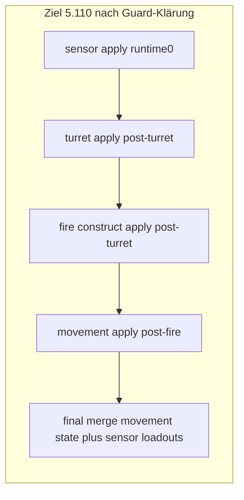

# Task 5.107 — Script Turret Application Plan

> **Nur Dokumentation.** Keine Implementierung, keine Tests, keine Änderungen an `src/`, `tests/`, Projekten, Solution oder `game/`.
>
> Sprache: Erklärungen überwiegend auf Deutsch; Typnamen und API-Namen wie im Code auf Englisch.

## 1. Purpose

Nach Abschluss des Movement-Tracks (**5.102–5.106**, siehe [SCRIPT_MOVEMENT_APPLICATION_PLAN.md](SCRIPT_MOVEMENT_APPLICATION_PLAN.md)) fehlt im Combined-Script-Runtime-Pfad noch die **Turret**-Domäne.

**Ziel von 5.107:** Festlegen, wie Turret-Script-Befehle — insbesondere `AimAtEnemy` — zu einer **deterministischen** Mutation von [`TankState.TurretRotation`](../src/ScriptTanks.Core/Tanks/TankState.cs) werden. Dazu gehören Request-/Status-Form, Application-Pipeline, **Composer-Reihenfolge** (kritisch: vor oder nach Fire), State-Threading, Reference-Guards und Test-Policy für **5.108–5.110**.

**Kernfakten:**

| Domäne | Rotation / Richtung |
| ------ | ----------------- |
| **Fire** | [`TankState.TurretRotation`](../src/ScriptTanks.Core/Tanks/TankState.cs) — [`FireMuzzlePositionResolver`](../src/ScriptTanks.Core/Combat/FireMuzzlePositionResolver.cs), [`FireVelocityResolver`](../src/ScriptTanks.Core/Combat/FireVelocityResolver.cs) |
| **Movement** (5.105) | [`TankState.BodyRotation`](../src/ScriptTanks.Core/Tanks/TankState.cs) — [`ScriptMovementVelocityResolver`](../src/ScriptTanks.Core/Scripting/ScriptMovementVelocityResolver.cs) |

Turret-Befehle existieren heute als Domain-Intent ([`TurretPlaceholder`](../src/ScriptTanks.Core/Scripting/ScriptDomainRequestMappingRecord.cs)), werden aber **nicht** auf `MatchState` angewendet.

**Grenze dieses Dokuments:** 5.107 plant nur Turret Application. Kein Turret-Code, keine Tests, keine Composer-Änderungen, keine stillen Fire-Guard-Lockerungen.

**Test-Baseline (Repo):** 2748 Tests nach 5.106.

## 2. Current State After 5.106

### Track-Übersicht

| Track | Status |
| ----- | ------ |
| Sensor | **Implementiert** — [`ScriptMappedSensorRequestApplicationPipeline`](../src/ScriptTanks.Core/Scripting/ScriptMappedSensorRequestApplicationPipeline.cs) |
| Fire | **Implementiert** — Construct + Apply im [`CombinedScriptRuntimeComposer`](../src/ScriptTanks.Core/Scripting/CombinedScriptRuntimeComposer.cs) |
| Movement | **Implementiert** — [`ScriptMappedMovementRequestApplicationPipeline`](../src/ScriptTanks.Core/Scripting/ScriptMappedMovementRequestApplicationPipeline.cs); setzt nur `VelocityPerTick` |
| **Turret** | **Fehlt** — `AimAtEnemy` → `TurretPlaceholder`, keine Apply-Pipeline |
| Tank-Positionsintegration | **Fehlt** — außerhalb Turret-Scope |
| Rich logs | **Keine** Turret-Events ([`CombatLogEventTypes`](../src/ScriptTanks.Core/Logging/CombatLogEventTypes.cs)) |

### Combined-Composer heute (5.106)

```text
integration
→ mapping
→ sensor apply(runtime₀)
→ fire construct(runtime₀)
→ fire apply(runtime₀)
→ movement apply(post-fire runtime)
→ final merge (movement state + sensor loadouts)
```

Quelle: [`CombinedScriptRuntimeComposer.cs`](../src/ScriptTanks.Core/Scripting/CombinedScriptRuntimeComposer.cs), [`CombinedScriptRuntimeComposerResult.cs`](../src/ScriptTanks.Core/Scripting/CombinedScriptRuntimeComposerResult.cs).

Movement-Regression: [SCRIPT_MOVEMENT_APPLICATION_PLAN.md](SCRIPT_MOVEMENT_APPLICATION_PLAN.md) §13, Tests in [`CombinedRuntimeTickPipelineTests`](../tests/ScriptTanks.Core.Tests/Scripting/CombinedRuntimeTickPipelineTests.cs) (Region 5.106).

### Nächster fehlender Schritt

```text
AimAtEnemy (Script)
  → Domain Mapping (Turret)
  → Turret Application (geplant 5.109)
  → TurretRotation mutieren
  → CombinedScriptRuntimeComposer integrieren (5.110, inkl. Guard-Entscheidung)
  → Runner / Replay / Logging sehen MatchState-Änderung automatisch
```

## 3. Existing Type Inventory

### Scripting und Mapping

| Typ | Datei | Rolle heute |
| --- | ----- | ----------- |
| `ScriptCommandType` | [`ScriptCommandType.cs`](../src/ScriptTanks.Core/Scripting/ScriptCommandType.cs) | `AimAtEnemy` definiert |
| `ScriptCommandTranslatorV2` | [`ScriptCommandTranslatorV2.cs`](../src/ScriptTanks.Core/Scripting/ScriptCommandTranslatorV2.cs) | `AimAtEnemy` → Payload `"nearest_visible"` |
| `ScriptTranslatedCommandRequestKind` | [`ScriptTranslatedCommandRequestKind.cs`](../src/ScriptTanks.Core/Scripting/ScriptTranslatedCommandRequestKind.cs) | `AimAtEnemy` |
| `ScriptTranslatedCommandDomainMapper` | [`ScriptTranslatedCommandDomainMapper.cs`](../src/ScriptTanks.Core/Scripting/ScriptTranslatedCommandDomainMapper.cs) | `AimAtEnemy` → `TurretPlaceholder` |
| `ScriptDomainRequestMappingRecord` | [`ScriptDomainRequestMappingRecord.cs`](../src/ScriptTanks.Core/Scripting/ScriptDomainRequestMappingRecord.cs) | `TurretPlaceholder(...)` Factory |
| `ScriptDomainRequestCategory` | [`ScriptDomainRequestCategory.cs`](../src/ScriptTanks.Core/Scripting/ScriptDomainRequestCategory.cs) | `Turret` |

### Combined runtime (Ist-Composer)

| Typ | Datei |
| --- | ----- |
| `CombinedScriptRuntimeComposer` | [`CombinedScriptRuntimeComposer.cs`](../src/ScriptTanks.Core/Scripting/CombinedScriptRuntimeComposer.cs) |
| `CombinedScriptRuntimeComposerResult` | [`CombinedScriptRuntimeComposerResult.cs`](../src/ScriptTanks.Core/Scripting/CombinedScriptRuntimeComposerResult.cs) |
| `CombinedRuntimeTickPipeline` | [`CombinedRuntimeTickPipeline.cs`](../src/ScriptTanks.Core/Scripting/CombinedRuntimeTickPipeline.cs) |

### Sensor / Fire / Movement (Referenz-Pattern)

| Typ | Datei |
| --- | ----- |
| `ScriptMappedSensorRequestApplicationPipeline` | [`ScriptMappedSensorRequestApplicationPipeline.cs`](../src/ScriptTanks.Core/Scripting/ScriptMappedSensorRequestApplicationPipeline.cs) |
| `ScriptMappedFireRequestConstructionPipeline` | [`ScriptMappedFireRequestConstructionPipeline.cs`](../src/ScriptTanks.Core/Scripting/ScriptMappedFireRequestConstructionPipeline.cs) |
| `ScriptMappedFireRequestApplicationPipeline` | [`ScriptMappedFireRequestApplicationPipeline.cs`](../src/ScriptTanks.Core/Scripting/ScriptMappedFireRequestApplicationPipeline.cs) |
| `ScriptMappedMovementRequestApplicationPipeline` | [`ScriptMappedMovementRequestApplicationPipeline.cs`](../src/ScriptTanks.Core/Scripting/ScriptMappedMovementRequestApplicationPipeline.cs) |
| `ScriptMappedMovementRequestApplicationResult` | [`ScriptMappedMovementRequestApplicationResult.cs`](../src/ScriptTanks.Core/Scripting/ScriptMappedMovementRequestApplicationResult.cs) |

### Rotation und Fire-Geometrie

| Typ | Datei | Hinweis |
| --- | ----- | ------- |
| `TankState` | [`TankState.cs`](../src/ScriptTanks.Core/Tanks/TankState.cs) | `BodyRotation`, `TurretRotation`, `Movement` |
| `FixedRotationDirectionResolver` | [`FixedRotationDirectionResolver.cs`](../src/ScriptTanks.Core/Math/FixedRotationDirectionResolver.cs) | Rotation → Vorwärtsvektor (deterministisch) |
| `FireMuzzlePositionResolver` | [`FireMuzzlePositionResolver.cs`](../src/ScriptTanks.Core/Combat/FireMuzzlePositionResolver.cs) | Nutzt `TurretRotation` |
| `FireVelocityResolver` | [`FireVelocityResolver.cs`](../src/ScriptTanks.Core/Combat/FireVelocityResolver.cs) | Nutzt `TurretRotation`, **nicht** `BodyRotation` |

**Hinweis:** Eine Fixed-Rotation-**from-direction**-Hilfe (Richtungsvektor → `Fixed`-Winkel) ist im Repo **noch nicht** vorhanden — geplant als `FixedRotationAimResolver` o. ä. in **5.109**, ohne `System.Math.Atan2` in MVP, sofern nicht über bestehende Fixed-Utilities abbildbar.

## 4. Current Turret / Fire / Rotation Semantics

### Gesperrte Fakten

| Thema | Verhalten heute |
| ----- | ---------------- |
| Fire-Richtung | Aus `TurretRotation` via `FixedRotationDirectionResolver.ResolveForward` |
| Movement-Richtung | Aus `BodyRotation` (5.105) |
| Turret-Anwendung | **Keine** — `TurretRotation` wird von Scripts nicht gesetzt |
| Payload `AimAtEnemy` | `"nearest_visible"` ([`ScriptCommandTranslatorV2`](../src/ScriptTanks.Core/Scripting/ScriptCommandTranslatorV2.cs)) |

### Zentrale Designfrage: Reihenfolge zu Fire

Wenn ein Tank im **selben Tick** sowohl `AimAtEnemy` als auch `Fire` ausführt (zukünftig oder über getrennte Programme pro Tank), entscheidet die **Composer-Reihenfolge**, ob Fire die **alte** oder **neue** `TurretRotation` sieht:

| Reihenfolge | Same-Tick-Fire-Verhalten |
| ----------- | ------------------------ |
| Turret **vor** Fire | Fire nutzt neu gezielte Turret-Rotation (gameplay-intuitiv) |
| Turret **nach** Fire | Fire nutzt Rotation **vor** dem Aim dieses Ticks |

Da [`FireVelocityResolver`](../src/ScriptTanks.Core/Combat/FireVelocityResolver.cs) und Muzzle explizit `TurretRotation` lesen, ist **Turret vor Fire** die architektonisch richtige Zielrichtung — Implementierung hängt an Fire-Guards (§9–§10).

## 5. Turret Command Options

Vier Optionen — Vergleich für MVP-Entscheidung:

### Option A — Turret vor Fire

```text
sensor → turret apply → fire construct/apply → movement apply → final merge
```

| Pro | Contra |
| --- | ------ |
| `AimAtEnemy` kann same-tick `Fire` beeinflussen (wenn beide Domains im selben Lauf wirken) | Fire construct/apply erwarten heute `runtime₀` — **post-turret-Runtime** bricht `ReferenceEquals`-Guards |
| Entspricht Spielererwartung „erst zielen, dann schießen“ | Mehr Integrationsarbeit in **5.110** |

### Option B — Turret nach Fire / Movement

```text
sensor → fire → movement → turret apply → final merge (turret state + sensor loadouts)
```

| Pro | Contra |
| --- | ------ |
| Minimale Störung der bestehenden Fire-`runtime₀`-Guards | Aim wirkt erst **nächsten** Tick auf Fire, nicht same-tick |
| Spiegelt Movement-Integration (nach Fire) | Final-Merge müsste ggf. Turret-State statt nur Movement-State tragen |

### Option C — Nur Turret-Intent, keine `TurretRotation`-Mutation

| Pro | Contra |
| --- | ------ |
| Spätere Turn-Rate-Policy einfacher einzuführen | Kein sichtbarer Gameplay-Effekt in 5.108–5.110 |
| | Zusätzliche Intent-Schicht ohne Fire-Nutzen |

### Option D — Direktes Setzen von `TurretRotation` (instant aim)

| Pro | Contra |
| --- | ------ |
| Deterministisch, gut testbar | Kein Turn-Rate / keine graduelle Drehung |
| Fire wird sinnvoll, sobald Reihenfolge stimmt | Zielableitung (nearest enemy) nötig |

### Empfehlung für das Dokument

**Ziel-Architektur: Option A + D** (Turret vor Fire, instant `TurretRotation`-Update). Option B nur als dokumentierter **Fallback**, wenn 5.110 die Fire-Guards nicht sauber lösen kann — **ohne** stille Guard-Lockerung.



## 6. Recommended MVP Turret Policy

### Gesperrte MVP-Entscheidung: Option A + D

1. **Reihenfolge (Ziel):** Turret **vor** Fire construct/apply (§5).
2. **Mutation:** Nur [`TankState.TurretRotation`](../src/ScriptTanks.Core/Tanks/TankState.cs) — **nicht** `BodyRotation`, **nicht** `Movement`, **nicht** HP, **nicht** Projektile, **nicht** `CurrentTick`.
3. **Kein Turn-Rate in MVP:** Sofortiges Setzen der Zielrotation (Option D). Graduelle Drehung → späterer Task (z. B. 5.112).
4. **Kein Turret-Intent-only** (Option C verworfen für MVP).

**Wichtig:** 5.107 **plant** Option A; **5.110** muss die Fire-`ReferenceEquals`-Problematik explizit lösen (§9). 5.107 behauptet nicht, dass Composer-Integration trivial ist.

### MVP-Zielregel für `AimAtEnemy` (normativ)

| Regel | Detail |
| ----- | ------ |
| Zielwahl | **Nächster lebender** Gegner anhand aktueller [`MatchState`](../src/ScriptTanks.Core/Match/MatchState.cs)-Tankpositionen (`CurrentHitPoints > 0`) |
| Ausschluss | Eigener `TankIndex` (shooter / record owner) |
| Tie-break | Bei gleicher `DistanceSquared`: **kleinerer** `TankIndex` gewinnt |
| Kein Sensor-Payload nötig | Policy nutzt nur `MatchState`-Geometrie; passt zu Translator-Payload `"nearest_visible"` |

### Rotationsableitung (5.109, nicht 5.107)

1. Richtungsvektor = normalisierte Differenz Zielposition − eigene `Movement.Position` (Fixed-Math).
2. Winkel/Rotation = **neue** deterministische Hilfsfunktion (z. B. `FixedRotationAimResolver.ResolveRotationFromDirection`) — Repo hat heute nur `ResolveForward(rotation)`.
3. Bei nicht auflösbarer Richtung → Status `MissingAimSolution`.
4. Keine lebenden Gegner → `NoTarget`.

**Verboten in MVP:** `float`/`double`-Trigonometrie, `System.Math.Atan2`, Zufall, Wall-Clock, Godot.

### Was Nutzer nach 5.110 erwarten sollten

- `TurretRotation` geändert, wenn `Applied`.
- `BodyRotation`, `Movement.Position`, `Movement.VelocityPerTick`, HP, Projektile, Tick unverändert durch Turret-Apply (analog Movement-Regel).

## 7. Request / Status Shape

Geplant für **5.108** (Spiegelung Movement/Fire-Muster):

```csharp
public enum ScriptMappedTurretRequestApplicationStatus
{
    SkippedNotTurret = 0,
    Applied = 1,
    RejectedInvalidTurretRequest = 2,
    TankIndexOutOfRange = 3,
    TankDestroyed = 4,
    NoTarget = 5,
    MissingAimSolution = 6,
}
```

### Record (5.108)

`ScriptMappedTurretRequestApplicationRecord`:

| Feld | Rolle |
| ---- | ----- |
| `RecordIndex` | Mapping-Reihenfolge |
| `MappingRecord` | Quell-`ScriptDomainRequestMappingRecord` |
| `Status` | Siehe Tabelle unten |
| `AppliedTurretRotation?` | Nur bei `Applied` gesetzt |
| `DidApply` | `Status == Applied` && Rotation gesetzt |

| Status | `AppliedTurretRotation` |
| ------ | ----------------------- |
| `Applied` | non-null (`Fixed`) |
| alle anderen | null |

Nicht-Skip-Status (`Applied`, `Rejected…`, `NoTarget`, …) erfordern `Category == Turret` (wie Movement-Record-Invarianten).

### Result (5.108)

`ScriptMappedTurretRequestApplicationResult`:

- `MappingResult`
- `FinalRuntime` (post-apply Snapshot)
- defensive copy von `Records[]`, `Count`, `GetRecordAtIndex`
- **keine** custom `Equals`/`GetHashCode` auf Result-Typen

## 8. Proposed Application Pipeline

Geplant in **5.109**:

```csharp
public static class ScriptMappedTurretRequestApplicationPipeline
{
    public static ScriptMappedTurretRequestApplicationResult Apply(
        MatchSensorRuntimeState runtime,
        MatchScriptDomainRequestMappingResult mappingResult);
}
```

### Pro Record (Index-Reihenfolge)

| Schritt | Ergebnis |
| ------- | -------- |
| 1 | `Category != Turret` → `SkippedNotTurret` |
| 2 | `TankIndex` ungültig → `TankIndexOutOfRange` |
| 3 | `CurrentHitPoints <= 0` → `TankDestroyed` |
| 4 | `Request.Kind` nicht `AimAtEnemy` (MVP) → `RejectedInvalidTurretRequest` |
| 5 | Kein lebender Gegner → `NoTarget` |
| 6 | Zielrichtung / Rotation nicht auflösbar → `MissingAimSolution` |
| 7 | `tank.WithTurretRotation(resolvedRotation)`; `MatchState` immutabel falten |
| 8 | `Applied` + `AppliedTurretRotation` |

**Mutation:** ausschließlich `TurretRotation`. `BodyRotation`, `Movement`, Sensor-Loadouts, Projektile, `CurrentTick` unverändert.

**Runtime-Guard (empfohlen):** wie [`ScriptMappedMovementRequestApplicationPipeline`](../src/ScriptTanks.Core/Scripting/ScriptMappedMovementRequestApplicationPipeline.cs) — **kein** striktes `ReferenceEquals(runtime, mappingResult.IntegrationResult.Runtime)`, damit der Composer flexibel post-sensor- oder post-turret-Runtimes threaden kann.

## 9. CombinedRuntime Integration Order

### Ziel-Flow (Option A — gameplay-korrekt)

```text
integration
→ mapping
→ sensor apply(runtime₀)
→ turret apply(inputRuntime) → postTurretRuntime
→ fire construct(postTurretRuntime, mapping, sequence)
→ fire apply(postTurretRuntime, fireConstruction)
→ movement apply(fireApplication.FinalRuntime, mapping)
→ finalRuntime = movement.FinalRuntime.WithSensorLoadouts(sensor.FinalRuntime.SensorLoadouts)
```

Skizze (5.110 — **nach** Guard-Entscheidung):

```csharp
var turretApplication = ScriptMappedTurretRequestApplicationPipeline.Apply(
    runtime, mappingResult);

var fireConstruction = ScriptMappedFireRequestConstructionPipeline.Construct(
    turretApplication.FinalRuntime,
    mappingResult,
    projectileIdSequence);

var fireApplication = ScriptMappedFireRequestApplicationPipeline.Apply(
    turretApplication.FinalRuntime,
    fireConstruction);

var movementApplication = ScriptMappedMovementRequestApplicationPipeline.Apply(
    fireApplication.FinalRuntime,
    mappingResult);

var finalRuntime = movementApplication.FinalRuntime.WithSensorLoadouts(
    sensorApplication.FinalRuntime.SensorLoadouts);
```

### Warum Fire heute nicht trivial auf post-turret-Runtime wechseln kann

[`ScriptMappedFireRequestConstructionPipeline.Construct`](../src/ScriptTanks.Core/Scripting/ScriptMappedFireRequestConstructionPipeline.cs) (Zeilen 38–42) und [`ScriptMappedFireRequestApplicationPipeline.Apply`](../src/ScriptTanks.Core/Scripting/ScriptMappedFireRequestApplicationPipeline.cs) verlangen:

```text
ReferenceEquals(runtime, mappingResult.IntegrationResult.Runtime)
```

Das ist **`runtime₀`**, nicht die Runtime **nach** Turret-Apply. Turret-Apply erzeugt neue `TankState`-Kopien in `State` → typischerweise **neue** `MatchSensorRuntimeState`-Referenz.

**5.110 ist expliziter Guard-/Integrations-Entscheidungspunkt.** Mögliche Lösungen (ohne Präferenz in 5.107 — Entscheidung in 5.110):

| Ansatz | Beschreibung |
| ------ | ------------ |
| Fire-Guards anpassen | Construct/Apply akzeptieren post-turret-Runtime, solange `MappingResult` unverändert bleibt |
| Integration-Referenz erweitern | `MatchScriptIntentIntegrationResult` oder Mapping an post-turret-State binden |
| **Option B Fallback** | Turret nach Fire/Movement; dokumentieren, dass Same-Tick-Aim+Fire nicht gilt |

**Verboten:** Stille Entfernung der Fire-`ReferenceEquals`-Checks ohne dokumentierte Ersatzregel.

### Option B Fallback (nur letzter Ausweg)

```text
sensor → fire → movement → turret → final merge (turret state + sensor loadouts)
```

- Fire-Guards bleiben auf `runtime₀`.
- Aim beeinflusst Fire erst im **folgenden** Tick.
- Testnamen und §6 müssen das explizit sagen, falls 5.110 Option B wählt.

### `CombinedScriptRuntimeComposerResult` (5.110)

Neues Feld geplant: `TurretApplicationResult` (Analogon `MovementApplicationResult`).

Final-State-Invariante (Ziel bei Option A):

- `FinalRuntime.State` kommt von **Movement** (wie 5.105).
- `FinalRuntime.SensorLoadouts` von **Sensor** (unverändert).
- `TurretRotation`-Änderungen stecken in `FinalRuntime.State` über Movement-Final-State, weil Turret vor Fire und Movement nach Fire läuft.

## 10. State Threading and Reference Guards

### Pipeline-Übersicht (Ist + Ziel)

| Pipeline | `ReferenceEquals` auf `runtime₀`? | Typische Input-Runtime |
| -------- | -------------------------------- | --------------------- |
| Sensor apply | **Ja** — `mappingResult.IntegrationResult.Runtime` | `runtime₀` |
| Fire construct | **Ja** — `mappingResult.IntegrationResult.Runtime` | `runtime₀` (Ist) / **post-turret** (Ziel A) |
| Fire apply | **Ja** — über Construction → Mapping → Integration | `runtime₀` (Ist) / **post-turret** (Ziel A) |
| Movement apply | **Nein** | `fireApplication.FinalRuntime` |
| **Turret apply (neu)** | **Nein** (empfohlen, wie Movement) | `runtime₀` oder post-sensor |

### Turret-Pipeline

Empfehlung: **nur** Null-Checks + Record-Count — **kein** `ReferenceEquals` zu `integration.Runtime`, damit 5.110 post-turret- oder post-sensor-Runtimes übergeben kann.

### Merge-Referenzen (5.110)

| Komponente | Quelle |
| -------- | ------ |
| `FinalRuntime.State` | `movementApplication.FinalRuntime.State` (5.105, unverändert bei Option A) |
| `FinalRuntime.SensorLoadouts` | `sensorApplication.FinalRuntime.SensorLoadouts` |
| `FinalProjectileIdSequence` | Fire construction (unverändert) |

Bei Option B Fallback: Final-State müsste aus **Turret**-Final kommen, nicht Movement — separates Merge-Design in 5.110.

## 11. Test Strategy

### 5.108 — Model tests

| Fokus | Beispiele |
| ----- | --------- |
| Enum | definierte Werte, keine Lücken |
| Record-Invarianten | `Applied` erfordert Rotation; andere Statuse verbieten Rotation |
| Result | defensive copy, `Count`, null records |
| Keine custom equality | Result-Typen ohne `Equals`-Override |

### 5.109 — Pipeline tests

| Fokus | Beispiele |
| ----- | --------- |
| Skip | non-turret mapping → `SkippedNotTurret` |
| OOR / destroyed | `TankIndexOutOfRange`, `TankDestroyed` |
| Apply | `AimAtEnemy` setzt `TurretRotation` |
| Unverändert | `BodyRotation`, `Movement`, HP, Tick |
| `NoTarget` | keine lebenden Gegner |
| `MissingAimSolution` | fehlende rotation-from-direction-Hilfe |
| Determinismus | repeated calls, tie-break bei gleicher Distanz |

### 5.110 — Composer / runtime regression

| Fokus | Beispiele |
| ----- | --------- |
| Composer | `TurretApplicationResult` verkettet; `TurretRotation` geändert |
| Option A | Zwei-Tank: Aim + Fire — Fire nutzt **aktualisierte** Turret (wenn Guards gelöst) |
| Option B | Tests benennen „aim affects **next** tick fire“ |
| Runner/Replay | [`CombinedRuntimeRunnerTests`](../tests/ScriptTanks.Core.Tests/Scripting/CombinedRuntimeRunnerTests.cs)-Pattern aus 5.106 |
| Logging | **Keine** neuen `CombatLogEventTypes` in 5.108–5.110 |

## 12. Determinism and Purity

- Alle Apply-Schritte: **pure** Funktionen auf immutable `MatchState` / `TankState`.
- Record-Reihenfolge: strikt Mapping-Index.
- Nearest-enemy: deterministische Distanz (`DistanceSquared`), Tie-break **TankIndex** aufsteigend.
- Nur `Fixed` / `FixedVec2` — keine `System.Random`, keine Zeit, keine IO.
- Keine Godot-, Logging- oder Replay-Schreibzugriffe in der Pipeline.
- Kein Tick-Advance, keine Projektil-IDs in Turret-Apply.

## 13. Relationship to Runner / Replay / Logging

| Bereich | Policy |
| ------- | ------ |
| **Runner** | [`CombinedRuntimeRunner.RunUntilEnd`](../src/ScriptTanks.Core/Scripting/CombinedRuntimeRunner.cs) nutzt [`CombinedRuntimeTickPipeline.Step`](../src/ScriptTanks.Core/Scripting/CombinedRuntimeTickPipeline.cs) — nach 5.110 sehen Frames/Finale `TurretRotation` aus Composer |
| **Replay** | Frames bleiben **nur** [`MatchState`](../src/ScriptTanks.Core/Match/MatchState.cs) — kein Sensor-Runtime-Frame-Typ |
| **MVP Logging** | Weiterhin `match_started` / `match_ended` — keine Turret-Events |
| **Rich Logging** | Weiterhin `script_tick` / `fire_*` wo zutreffend; **keine** `movement_*` / `turret_*` in 5.108–5.110 |

Turret-Änderungen propagieren automatisch, sobald der Composer integriert ist; separate Replay-Schema-Änderung nicht nötig.

## 14. Follow-up Tasks 5.108–5.110

| Task | Inhalt |
| ---- | ------ |
| **5.108** | `ScriptMappedTurretRequestApplicationStatus`, `Record`, `Result` |
| **5.109** | `ScriptMappedTurretRequestApplicationPipeline` + nearest-enemy-Auflösung + `FixedRotationAimResolver` (oder äquivalent) |
| **5.110** | `CombinedScriptRuntimeComposer` + `CombinedScriptRuntimeComposerResult` + **Guard-Entscheidung** (kritisch) + Regression-Tests |

### Optionale spätere Tasks

| Task | Inhalt |
| ---- | ------ |
| **5.111** | Same-tick Aim+Fire: Fire-Guard-Redesign / Integration-Referenz-Strategie (falls in 5.110 nicht vollständig) |
| **5.112** | Turret turn-rate / graduelle Rotation statt instant set |
| **5.113** | Rich Turret-Diagnostics (`CombatLogEventTypes` erweitern) |

Roadmap-Verweis: [SCRIPT_RUNTIME_ROADMAP_CHECKPOINT.md](SCRIPT_RUNTIME_ROADMAP_CHECKPOINT.md) §9.

## 15. Out of Scope + Definition of Done

### Out of scope (5.107 und 5.108–5.110 laut diesem Plan)

- Produktionscode in `src/` (5.107)
- Tests (5.107)
- Stille Fire-Guard-Lockerung ohne dokumentierte Alternative
- `MovementIntegrator` / Tank-Position in `MatchTickPipeline`
- Turn-rate / interpolierte Turret-Drehung (MVP = instant)
- Neue `CombatLogEventTypes` für Turret
- Godot / `game/`
- Sensor-Ziel-Objekte als Hard-Dependency für MVP-Nearest-Enemy (optional später)

### Definition of Done (5.107)

- [`docs/SCRIPT_TURRET_APPLICATION_PLAN.md`](SCRIPT_TURRET_APPLICATION_PLAN.md) existiert mit **15** Abschnitten (dieses Dokument).
- Turret/Fire/Rotation-Semantik und Composer-Reihenfolge sind inventarisiert.
- Optionen A–D sind verglichen; **Option A + D** als Ziel-Architektur dokumentiert.
- Fire-`ReferenceEquals`-Problem und **5.110** als expliziter Entscheidungspunkt sind dokumentiert.
- Nearest-alive-enemy-MVP und 5.108–5.110 sind abgebildet.
- `dotnet build ScriptTanks.sln -warnaserror` und `dotnet test ScriptTanks.sln` — **2748** Tests unverändert.
