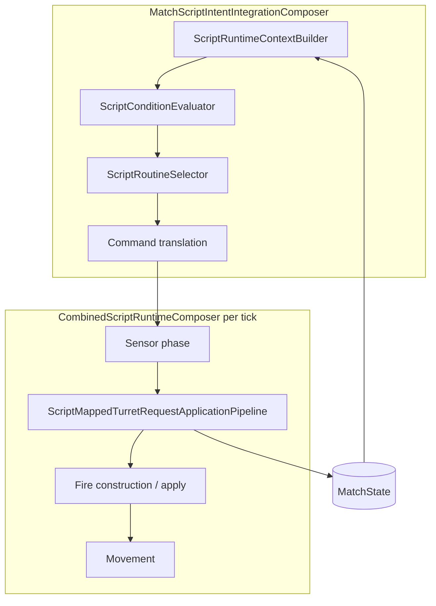
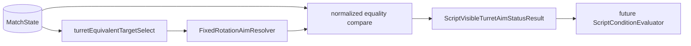

# Task 5.148 — Script-Visible Turret Alignment Status Plan

> **Nur Dokumentation.** Keine Implementierung, keine Tests, keine Änderungen an `src/`, `tests/`, Projekten, Solution oder `game/`.
>
> Sprache: Erklärungen überwiegend auf Deutsch; Typnamen und API-Namen wie im Code auf Englisch.

## 1. Purpose

Der **Turn-Rate-Track 5.140–5.147** ist abgeschlossen und in [TURRET_TURN_RATE_INTEGRATION_CHECKPOINT.md](TURRET_TURN_RATE_INTEGRATION_CHECKPOINT.md) dokumentiert. Script-`AimAtEnemy` dreht den Turm **graduell** (turn-rate-limitierter Schritt pro Tick) statt sofort zu snappen. **Fire while turning** ist erlaubt: Schussrichtung nutzt die **aktuelle** `TankState.TurretRotation`, ohne Alignment-Gate.

Scripts können heute **nicht** direkt fragen, ob der Turm auf das Ziel ausgerichtet ist, noch dreht, oder kein Ziel hat. Dieses Dokument plant die nächste Kernfunktion: **script-sichtbarer Turm-Aim-/Alignment-Status** — als Architektur- und Semantik-Plan, **ohne** Laufzeitänderung in Task 5.148.

**Baseline (nach 5.147):** **3148** Tests, **0** Warnungen (`dotnet build ScriptTanks.sln -warnaserror`).

**Querverweise:**

| Dokument | Rolle |
|----------|-------|
| [TURRET_TURN_RATE_INTEGRATION_CHECKPOINT.md](TURRET_TURN_RATE_INTEGRATION_CHECKPOINT.md) | Autoritativer Stand nach gradueller Rotation |
| [TURRET_TURN_RATE_GRADUAL_ROTATION_PLAN.md](TURRET_TURN_RATE_GRADUAL_ROTATION_PLAN.md) | Ursprünglicher Turn-Rate-Architekturplan |
| [FULL_ANGLE_TURRET_AIM_INTEGRATION_CHECKPOINT.md](FULL_ANGLE_TURRET_AIM_INTEGRATION_CHECKPOINT.md) | Full-Angle-Aim-Track (unverändert; nur Anwendung auf `TurretRotation` ist nicht mehr Snap) |

---

## 2. Current State After 5.147

### Autoritatives Verhalten (Turn-Rate-Kontext)

Nach [TURRET_TURN_RATE_INTEGRATION_CHECKPOINT.md](TURRET_TURN_RATE_INTEGRATION_CHECKPOINT.md) gilt:

```text
AimAtEnemy
  → wählt nearest alive target (positionsbasiert)
  → FixedRotationAimResolver: desiredRotation
  → FixedRotationTurnStepResolver: ein turn-rate-limitierter Schritt
  → TankState.TurretRotation = FinalRotation (gestufter Winkel)
  → AppliedTurretRotation = gestufte FinalRotation
Fire
  → nutzt ausschließlich aktuelle TurretRotation (kein Alignment-Gate)
Replay
  → MatchState.Tanks[].TurretRotation (aktueller Winkel only)
```

**Script-Nutzung heute:** Um weiter zu drehen, muss ein Script `AimAtEnemy` **über mehrere Ticks wiederholen**. Es gibt keine Bedingung vom Typ „wenn aligned, dann Fire“.

### Was heute nicht existiert

| Fehlend | Bedeutung |
|---------|-----------|
| `DesiredTurretRotation` auf `TankState` | Kein persistierter Soll-Winkel im Match-State |
| Persistierter Aim-Target-State | Kein gespeichertes Ziel-Tank-Id/Index |
| Script-sichtbares `IsAligned` | Keine Alignment-Info in `ScriptEvaluationContext` |
| Script-sichtbares desired/current-Delta | Kein Alignment-Fehler in Script-Kontext |
| Fire-Alignment-Condition | Kein `ScriptConditionType` für Turm-Ausrichtung |
| Aim-Status-Event/Log | Kein Combat-Log-/Replay-Feld für Alignment |

---

## 3. Current Script / Condition / Aim Architecture Audit

Audit basiert auf dem Repository-Stand nach 5.147. Es werden **keine** fiktiven APIs als „existierend“ dargestellt.

### Audit-Tabelle

| API | Current role | Alignment relevance |
|-----|--------------|---------------------|
| [`TankState.TurretRotation`](../src/ScriptTanks.Core/Tanks/TankState.cs) | Aktueller Turmwinkel | `currentRotation` |
| [`FixedRotationAimResolver`](../src/ScriptTanks.Core/Math/FixedRotationAimResolver.cs) | Richtung → `desiredRotation` | Berechnet Soll-Ausrichtung |
| [`FixedRotationTurnStepResolver`](../src/ScriptTanks.Core/Math/FixedRotationTurnStepResolver.cs) | `current` → `desired` in einem Schritt | `Aligned` iff normalisiertes `current == desired` |
| [`ScriptMappedTurretRequestApplicationPipeline`](../src/ScriptTanks.Core/Scripting/ScriptMappedTurretRequestApplicationPipeline.cs) | Wendet `AimAtEnemy` an | Positionsbasiertes `TrySelectNearestAliveEnemy` (kein Sensor-Scan) |
| [`ScriptMappedTurretRequestApplicationRecord`](../src/ScriptTanks.Core/Scripting/ScriptMappedTurretRequestApplicationRecord.cs) | Apply-Ergebnis | Nur `AppliedTurretRotation` — kein desired/delta |
| [`ScriptMappedTurretRequestApplicationStatus`](../src/ScriptTanks.Core/Scripting/ScriptMappedTurretRequestApplicationStatus.cs) | Apply-Status | u.a. `TankDestroyed` beim Apply — **kein** Read-Path-Äquivalent für Aim-Status |
| [`ScriptConditionType`](../src/ScriptTanks.Core/Scripting/ScriptConditionType.cs) | `Always`, `EnemyVisible`, `WeaponReady`, `MyHpBelow`, `EnemyDistanceBelow`, `SensorReady` | **Keine** Turm-Alignment-Typen |
| [`ScriptCondition`](../src/ScriptTanks.Core/Scripting/ScriptCondition.cs) / [`ScriptConditionEvaluator`](../src/ScriptTanks.Core/Scripting/ScriptConditionEvaluator.cs) | Bedingungsauswertung | Liest nur [`ScriptEvaluationContext`](../src/ScriptTanks.Core/Scripting/ScriptEvaluationContext.cs) |
| [`ScriptEvaluationContext`](../src/ScriptTanks.Core/Scripting/ScriptEvaluationContext.cs) | Vorberechneter Snapshot | HP, Weapon/Sensor ready, **sensor-basiertes** `EnemyVisible`/`EnemyDistance` — **keine** Turm-Felder |
| [`ScriptRuntimeContextBuilder`](../src/ScriptTanks.Core/Scripting/ScriptRuntimeContextBuilder.cs) | Baut Kontext aus Runtime | Sensor-Reichweiten-Sichtbarkeit — **weicht von AimAtEnemy-Zielwahl ab** |
| [`ScriptRoutine`](../src/ScriptTanks.Core/Scripting/ScriptRoutine.cs) / [`ScriptRoutineSelector`](../src/ScriptTanks.Core/Scripting/ScriptRoutineSelector.cs) | Erste passende Routine gewinnt | **Ein Befehl pro Tank pro Tick** |
| [`ScriptCommand`](../src/ScriptTanks.Core/Scripting/ScriptCommand.cs) / [`ScriptCommandType`](../src/ScriptTanks.Core/Scripting/ScriptCommandType.cs) | Befehlsmodell | `AimAtEnemy`, `Fire`, … — kein explizites Alignment-Query |
| [`MatchScriptIntentIntegrationComposer`](../src/ScriptTanks.Core/Scripting/MatchScriptIntentIntegrationComposer.cs) | Intent-Integration | Kontext → evaluieren → übersetzen |
| [`CombinedScriptRuntimeComposer`](../src/ScriptTanks.Core/Scripting/CombinedScriptRuntimeComposer.cs) | Sensor → Turret → Fire → Movement | Turm **vor** Fire |
| [`MatchState`](../src/ScriptTanks.Core/Match/MatchState.cs) | Replay-sichtbarer State | Enthält nur aktuelle `TurretRotation` |

### Kritische Divergenz: Script-Sichtbarkeit vs. AimAtEnemy-Ziel

| Pfad | Zielauswahl |
|------|-------------|
| `ScriptEvaluationContext.EnemyVisible` / [`ScriptRuntimeContextBuilder.FindNearestVisibleEnemy`](../src/ScriptTanks.Core/Scripting/ScriptRuntimeContextBuilder.cs) | **Sensor-Reichweite** — Feind muss im Sensor sichtbar sein |
| `AimAtEnemy` / `TrySelectNearestAliveEnemy` in Turret-Pipeline | **Positionsbasiert** — nächster lebender Feind ohne Sensor-Anforderung |

Ein Aim-Status-Resolver, der `EnemyVisible` als Zielquelle nutzt, würde **andere** Ziele und damit **andere** Alignment-Ergebnisse liefern als `AimAtEnemy`. Das wäre deterministisch inkonsistent und für Script-Autoren irreführend.

**Hard guardrail (wiederholt in §8 und §10):**

```text
Important:
The aim-status resolver must NOT reuse ScriptEvaluationContext.EnemyVisible
or ScriptRuntimeContextBuilder sensor visibility as its target source.
EnemyVisible is sensor-range-based; AimAtEnemy target selection is
position-based nearest alive enemy (TrySelectNearestAliveEnemy semantics).
Status computation must share the turret pipeline target policy exactly.
```

### Aktueller Composer- und Script-Evaluationsfluss



**Reihenfolge pro Combined-Tick:** Script-Intent (Kontext + Routine) → Sensor → **Turret** → Fire → Movement (Details siehe Turn-Rate-Checkpoint).

---

## 4. Problem Statement

Nach gradueller Rotation brauchen Scripts bessere Entscheidungsgrundlagen:

| Script-Ziel | Heutige Lücke |
|-------------|---------------|
| Erst zielen, dann schießen | Kein `TurretAligned`-Condition |
| Keine „verschwendeten“ Schüsse während Drehung | Fire erlaubt immer; Script kann Alignment nicht prüfen |
| Bewegung während Zielen | Kein Turning-Status |
| Unterscheidung NoTarget / MissingAimSolution / Turning / Aligned | Keine script-sichtbare Zusammenfassung |

### Offene Designfragen (für Follow-up-Tasks)

| Frage | Kurz |
|-------|------|
| Woher kommt `desiredRotation`? | On-demand aus Ziel + `FixedRotationAimResolver` vs. persistiert |
| Soll `desiredRotation` persistiert werden? | Option A vs. B/C in §8 |
| Alignment on-demand vs. gespeichert? | Recompute aus `MatchState` vs. `TankState`-Felder |
| Abhängigkeit von aktueller Zielwahl? | Nearest-enemy kann sich pro Tick ändern |
| Ziel verschwindet / stirbt | Status → `NoTarget`? |
| Was bedeutet „aligned“ exakt? | Normalisierte Fixed-Gleichheit vs. Toleranz |
| Alignment ohne `AimAtEnemy`-Befehl? | Read-only Resolver vs. nur nach Apply |
| Fire gating später? | Script-Entscheid vs. Engine-Gate |
| Determinismus | Gleiche Inputs → gleicher Status; keine Sensor/Script-Divergenz |

---

## 5. Scope and Non-Scope

### In Scope (5.148)

- Planung script-sichtbaren Aim-/Alignment-Status
- Semantik von Status-Ergebnissen
- Entscheidung computed vs. persistent `desiredRotation`
- API-Skizzen für Resolver und Conditions
- Kontext-/Evaluations-Policy
- Test-Strategie (Leiter)
- Follow-up-Roadmap 5.149–5.155

### Out of Scope (5.148)

| Ausgeschlossen | Grund |
|----------------|-------|
| Production-Implementierung | Plan-only Task |
| Test-Änderungen | Separater Track |
| Fire-Gating-Implementierung | Script-Entscheid in MVP |
| Neue `TankState`-Felder | MVP Option A |
| Sensor-LOS / Sichtlinie | Späterer Track |
| Target-Prediction | Späterer Track |
| Godot/UI-Visualisierung | Client-seitig |
| Network-Sync | Nicht Teil Core-MVP |
| Logging-Implementierung | Optional 5.154 |
| Neues Replay-Schema | MVP replay-neutral |

---

## 6. Terminology

| Term | Meaning |
|------|---------|
| `currentRotation` | `TankState.TurretRotation` zum Evaluationszeitpunkt |
| `desiredRotation` | Rotation, die erforderlich ist, um das **turret-pipeline-gleiche** ausgewälte Ziel anzuvisieren |
| `alignmentDelta` | Kürzester vorzeichenbehafteter Delta `currentRotation` → `desiredRotation` (Wrap-around) |
| `alignmentErrorMagnitude` | Betrag von `alignmentDelta` |
| `isAligned` | `currentRotation == desiredRotation` nach Normalisierung (MVP: exakt) |
| `isTurning` | Ziel existiert und `currentRotation != desiredRotation` |
| `hasAimTarget` | Zielauswahl (`TrySelectNearestAliveEnemy`) erfolgreich |
| `missingAimSolution` | Ziel existiert, Richtung nicht auflösbar (z.B. Null-Delta / gleiche Position) |
| `aimStatus` | Script-sichtbare Zusammenfassung aus Ziel + Alignment |
| `turnStep` | Ein Ergebnis von `FixedRotationTurnStepResolver.ResolveStep` |

### Fixed-Koordinaten (Erinnerung)

| Winkel | Richtung |
|--------|----------|
| `Fixed.Zero` (0) | +X |
| `Fixed.One / 4` | +Y |
| `Fixed.One / 2` | −X |
| `3 * Fixed.One / 4` | −Y |

`Fixed.One` = volle Umdrehung. Positives Delta = **CCW** (wie Turn-Rate-Track).

---

## 7. Alignment Semantics

### Kandidaten-Enum (Skizze — **noch nicht implementiert**)

```csharp
public enum ScriptVisibleTurretAimStatus
{
    NoTarget,
    MissingAimSolution,
    Aligned,
    Turning
}
```

**Optionale spätere Werte:** `OwnerDestroyed`, `Unknown`, `BlockedByLineOfSight`, `TargetDestroyed`, …

### MVP-Status-Tabelle

| Situation | Status |
|-----------|--------|
| Kein lebender Feind (turret-pipeline-Zielauswahl scheitert) | `NoTarget` |
| Ziel gewählt, aber Richtung nicht auflösbar (z.B. gleiche Position / Null-Delta) | `MissingAimSolution` |
| `currentRotation == desiredRotation` nach Normalisierung | `Aligned` |
| Ziel existiert, `currentRotation != desiredRotation` | `Turning` |

### Alignment-Schwelle

| Entscheidung | MVP |
|--------------|-----|
| Toleranz / Epsilon | **Nein** — exakte Fixed-Gleichheit nach Normalisierung |
| Begründung | Fixed-Math ist deterministisch; `FixedRotationTurnStepResolver` snappt exakt, wenn innerhalb Rate |

**Alignment-Status ist in MVP keine Fire-Sperre.** Es ist **Information** für Scripts; Fire-Policy bleibt „current `TurretRotation` only“ (5.147).

### OwnerDestroyed policy (offene Entscheidung — nicht finalisiert in 5.148)

Die MVP-Implementierung muss **explizit** entscheiden, was ein **zerstörter Owner-Tank** beim Read-Path liefert:

| Option | Verhalten |
|--------|-----------|
| A | `NoTarget` (oder analog „kein sinnvoller Aim-Status“) |
| B | Dedizierter Status `OwnerDestroyed` |
| C | Validation-Reject (`ArgumentOutOfRangeException` / früher Exit) |

**Heute:** Beim **Apply** liefert die Turret-Pipeline [`ScriptMappedTurretRequestApplicationStatus.TankDestroyed`](../src/ScriptTanks.Core/Scripting/ScriptMappedTurretRequestApplicationStatus.cs). Ein Aim-Status-**Read**-Path hat noch kein Äquivalent.

**Empfehlung dieses Plans:** OwnerDestroyed-Policy in **Task 5.149** festlegen — **bevor** Enum/Model eingefroren werden (nicht stillschweigend an 5.150 delegieren).

---

## 8. Target / Desired Rotation Policy

Kernentscheidung: Woher kommt `desiredRotation` für Alignment-Berechnung?

| Option | Bedeutung |
|--------|-----------|
| **A** | On-demand aus `MatchState`: gleiche nearest-alive-Zielwahl wie `AimAtEnemy` + `FixedRotationAimResolver` |
| **B** | Persistiertes `desiredRotation` / Ziel in Runtime-State |
| **C** | Nur aus letztem `ScriptMappedTurretRequestApplicationRecord` ableiten |
| **D** | Explizite Target-Id / zukünftiges Command-Modell |

### Tradeoffs (Kurz)

| Option | Pro | Contra |
|--------|-----|--------|
| A | Kein `TankState`-Wachstum; replay-neutral; deterministisch aus `MatchState`; kleinste Implementierung | Kein Target-Lock; nearest enemy kann wechseln |
| B | Persistenz, später Target-Lock möglich | State/Replay-Migration; mehr Invarianten |
| C | Nahe am Apply-Pfad | Nicht vor Script-Eval verfügbar; löst Condition-Input nicht sauber |
| D | Explizite Script-Kontrolle | Größerer Scope; neues Command-Modell |

### Empfohlenes MVP: Option A

Computed-on-demand Aim-Status mit **derselben** Zielauswahl und **demselben** Aim-Resolver wie `AimAtEnemy`.

**Hard guardrail:** Ziel **nicht** aus `ScriptEvaluationContext.EnemyVisible` oder Sensor-Visibility ableiten. Spiegeln von [`ScriptMappedTurretRequestApplicationPipeline`](../src/ScriptTanks.Core/Scripting/ScriptMappedTurretRequestApplicationPipeline.cs) — positionsbasiertes `TrySelectNearestAliveEnemy`:

- alive, nicht self
- kleinste quadrierte Distanz
- bei Gleichstand: **niedrigerer Tank-Index** (tie-break)

**Caveat:** Ohne Target-Lock kann sich der nearest enemy ändern, wenn Tanks sich bewegen oder sterben. Scripts, die ein fixes Ziel brauchen, benötigen einen späteren Track (vgl. §15, Option 5.149A).

---

## 9. Architecture Options

### Option A — Computed status helper, kein persistenter State

`ScriptVisibleTurretAimStatusResolver.Resolve(MatchState, tankIndex)`

| Pro | Contra |
|-----|--------|
| Kleinster Scope | Ziel kann wechseln |
| Pure Funktion / deterministisch | Kein expliziter Lock |
| Replay-Schema-neutral | |
| Passt zu stateless `AimAtEnemy` | |

### Option B — Turret-Application-Record erweitern

Desired/aligned/delta im [`ScriptMappedTurretRequestApplicationRecord`](../src/ScriptTanks.Core/Scripting/ScriptMappedTurretRequestApplicationRecord.cs).

| Pro | Contra |
|-----|--------|
| Einfach nach Apply inspizierbar | Nicht **vor** Command-Auswahl verfügbar |
| | Records sind kein persistenter Match-State |
| | Löst Script-Condition-Input nicht allein |

### Option C — `DesiredTurretRotation` / `AimTarget` auf `TankState`

| Pro | Contra |
|-----|--------|
| Langfristig ausdrucksstark | Replay-/State-Migration |
| Persistenter Target-Lock möglich | Mehr Invarianten |
| | Größerer Scope als MVP |

### Option D — Sensor-/Target-Memory-Subsystem

| Pro | Contra |
|-----|--------|
| Tiefe für spätere AI | Zu breit für 5.148 |
| | Würde Sensor/Position-Divergenz verstärken, wenn falsch gekoppelt |

---

## 10. Recommended MVP Direction

**MVP = Option A:** reiner computed `ScriptVisibleTurretAimStatusResolver` + spätere `ScriptConditionType`-Erweiterungen.

| MVP-Regel | Wert |
|-----------|------|
| `TankState`-Änderungen | **Nein** |
| `DesiredTurretRotation`-Feld | **Nein** |
| Neues Replay-Schema | **Nein** |
| Fire-Gating | **Nein** |
| Neue CombinedRuntimeTick-Phase | **Nein** |

**Target-selection guardrail (MVP rule):** Aim-Status wird aus aktuellem `MatchState`, `tankIndex` und **turret-pipeline-äquivalenter** nearest-alive-Zielpolicy berechnet — **niemals** aus Script-`EnemyVisible`.

**Zukünftige Condition-Beispiele (Namen TBD):**

- `WhenTurretAligned` / `TurretAligned`
- `WhenTurretTurning` / `TurretTurning`
- `WhenHasAimTarget` / `HasAimTarget`
- `WhenMissingAimSolution` / `MissingAimSolution`

Exakte Enum-Namen erst nach Audit des bestehenden [`ScriptConditionType`](../src/ScriptTanks.Core/Scripting/ScriptConditionType.cs)-Stils in 5.151.

### Vorgeschlagener Read-Path (MVP)



---

## 11. Proposed API / Model Sketch

**Keine Implementierung in 5.148.** Skizzen sind Vorschläge; exakte Typ-/Enum-Namen sind **Implementierungs-Entscheidungen** in 5.149–5.151.

### Mögliches Ergebnis-Modell

```csharp
public sealed class ScriptVisibleTurretAimStatusResult
{
    public ScriptVisibleTurretAimStatus Status { get; }
    public TankId TankId { get; }
    public int TankIndex { get; }
    public TankId? TargetTankId { get; }
    public int? TargetTankIndex { get; }
    public Fixed CurrentRotation { get; }
    public Fixed? DesiredRotation { get; }
    public Fixed? AlignmentDelta { get; }
    public Fixed? AlignmentErrorMagnitude { get; }
    public bool IsAligned { get; }
}
```

### Möglicher Resolver

```csharp
public static class ScriptVisibleTurretAimStatusResolver
{
    public static ScriptVisibleTurretAimStatusResult Resolve(
        MatchState state,
        int tankIndex);
}
```

### Mögliche Condition-Integration (später)

- `ScriptConditionType.TurretAligned`
- `ScriptConditionType.TurretTurning`
- `ScriptConditionType.HasAimTarget`
- `ScriptConditionType.MissingAimSolution`

Integration entweder über erweiterten `ScriptEvaluationContext` (vorberechneter Status pro Tank) oder direkten Resolver-Aufruf in `ScriptConditionEvaluator` — **Entscheidung in 5.151**.

### Validation-Policy (Skizze)

| Input | Verhalten |
|-------|-----------|
| `state == null` | `ArgumentNullException` |
| `tankIndex` out of range | `ArgumentOutOfRangeException` |
| Owner destroyed | **Offene Entscheidung** — siehe §7; **muss in 5.149** vor Enum/Model-Freeze gelöst werden (`NoTarget` vs. `OwnerDestroyed` vs. validation reject) |

---

## 12. Script Integration Policy

### Aktueller Script-Fluss

```text
ScriptRuntimeContextBuilder → ScriptConditionEvaluator → ScriptRoutineSelector → Command
```

[`ScriptRoutineSelector`](../src/ScriptTanks.Core/Scripting/ScriptRoutineSelector.cs): **erste passende Routine gewinnt**; **ein Befehl pro Tank pro Tick**.

### Problem

Eine Bedingung wie `TurretAligned` muss **vor** der Fire-Auswahl auswertbar sein — typischerweise in derselben Tick-Phase wie andere Conditions, **bevor** `ScriptRoutineSelector` läuft.

### Policy-Empfehlung

Aim-Status-Conditions werden aus **aktuellem Runtime-/Match-State** (via Resolver oder erweitertem Kontext) ausgewertet, **nicht** aus dem Ergebnis des gerade erst ausgeführten Turret-Apply desselben Ticks für die Routine-Wahl desselben Ticks (Timing in 5.152 präzisieren).

**Beispiel-Routinen (konzeptionell):**

| Routine | Condition | Command |
|---------|-----------|---------|
| A | `TurretAligned` (+ ggf. `WeaponReady`) | `Fire` |
| B | `Always` / `EnemyVisible` | `AimAtEnemy` |

Reihenfolge in der Script-Definition bestimmt, welche Routine bei mehreren passenden Conditions gewinnt.

### Multi-Tick-Muster (aim-until-fire)

Wegen **one command per tank per tick**:

```text
Tick 1: AimAtEnemy (Always)
Tick 2+: if TurretAligned then Fire else AimAtEnemy
```

Scripts strukturieren Verhalten über **mehrere Ticks**; 5.148 implementiert das nicht, dokumentiert aber die Erwartung für 5.152/5.153-Tests.

---

## 13. Replay and Logging Policy

### MVP

| Aspekt | Policy |
|--------|--------|
| Replay | Weiterhin **MatchState-only** |
| Aim-Status | **Berechnet**, nicht gespeichert |
| Replay-Frame-Typen | Keine neuen |
| Combat-Log | Keine neuen `CombatLogEventTypes` |

Determinismus: Gleicher `MatchState` + `tankIndex` → gleicher Resolver-Output (bei Option A).

### Future optional diagnostics (out of MVP)

- `aim_status_evaluated`
- `turret_aligned` / `turret_turning`
- `desiredRotation` / `alignmentError` in Debug-Logs

Geplant optional in **5.154**, nicht Teil MVP.

---

## 14. Future Test Strategy

Test-Leiter für Follow-up-Tasks (keine Tests in 5.148).

### Resolver / Model (5.150)

| Szenario | Erwartung |
|----------|-----------|
| Keine lebenden Feinde | `NoTarget` |
| Ziel gleiche Position / Null-Delta | `MissingAimSolution` |
| `current == desired` (normalisiert) | `Aligned` |
| `current != desired` | `Turning` |
| Full-Angle-Ziel | Korrektes `desiredRotation` |
| Wrap-around | Kürzestes `alignmentDelta` |
| Zerstörtes Ziel übersprungen | Nächstes Ziel / `NoTarget` |
| Tie-break nearest target | Stabil (lower index) |
| **Nicht** Sensor-`EnemyVisible` als Zielquelle | Regression gegen Divergenz |

### Condition (5.151)

- `TurretAligned` true/false
- `TurretTurning` true/false
- `HasAimTarget` true/false
- `MissingAimSolution` true/false

### Script evaluation (5.152)

- Aligned → Fire-Routine gewählt
- Turning → AimAtEnemy-Routine
- NoTarget-Fallback deterministisch
- One-command-per-tick unverändert

### Composer / Runner / Replay (5.153)

- Multi-Tick aim-until-aligned-then-fire
- Replay weiterhin MatchState-only
- Keine neuen Logging-Nebeneffekte

Referenz-Regression-Basis: [`CombinedScriptRuntimeComposerTests`](../tests/ScriptTanks.Core.Tests/Scripting/CombinedScriptRuntimeComposerTests.cs), [`CombinedRuntimeRunnerTests`](../tests/ScriptTanks.Core.Tests/Scripting/CombinedRuntimeRunnerTests.cs), [`CombinedRuntimeReplayRecorderTests`](../tests/ScriptTanks.Core.Tests/Scripting/CombinedRuntimeReplayRecorderTests.cs) (Turn-Rate-Track 5.144–5.146).

---

## 15. Recommended Follow-up Tasks

| Task | Scope |
|------|-------|
| **5.149** | Result-/Status-Model-Typen **`+ OwnerDestroyed policy decision`** |
| 5.150 | Resolver-Implementierung + Tests (turret-äquivalente Zielauswahl) |
| 5.151 | `ScriptConditionType`-Erweiterungen für Turm-Aim-Status |
| 5.152 | Script-Evaluation / Composer-Regressionen (aim-until-fire) |
| 5.153 | Runner/Replay-Tests für script-sichtbaren Alignment-Flow |
| 5.154 | Optionales Logging/Diagnostics-Plan |
| 5.155 | Alignment / Aim-Status Integration Checkpoint |

### Alternative: 5.149A — Persistent `DesiredTurretRotation` Plan

Nur wenn computed-on-demand (Option A) sich als unzureichend erweist (Target-Lock, Replay-Diagnose, stabilere Script-Semantik über Zielwechsel).

### Implementation note

| Phase | Task |
|-------|------|
| Plan only | **5.148** (dieses Dokument) |
| Model + OwnerDestroyed-Entscheidung | **5.149** |
| Resolver + Unit-Tests | **5.150** |
| Script-Conditions | **5.151** |
| Integration + Multi-Tick | **5.152–5.153** |
| Checkpoint | **5.155** |

---

## 16. Verification / Definition of Done

### Checklist

- [ ] [`docs/SCRIPT_VISIBLE_TURRET_ALIGNMENT_STATUS_PLAN.md`](SCRIPT_VISIBLE_TURRET_ALIGNMENT_STATUS_PLAN.md) existiert mit Abschnitten **1–16**
- [ ] Post-5.147-Zustand dokumentiert (§2)
- [ ] Script/Condition/Aim-Architektur auditiert — echte Typnamen (§3)
- [ ] Problemstellung und offene Fragen (§4)
- [ ] Scope / Non-Scope (§5)
- [ ] Terminologie inkl. Fixed-Koordinaten (§6)
- [ ] Alignment-Semantik inkl. OwnerDestroyed als offene Entscheidung (§7)
- [ ] Target/Desired-Policy Option A + Hard guardrail (§8)
- [ ] Architekturoptionen A–D verglichen (§9)
- [ ] MVP-Empfehlung dokumentiert (§10)
- [ ] API-Skizzen + Validation (§11)
- [ ] Script-Integration + Multi-Tick-Muster (§12)
- [ ] Replay/Logging-Policy (§13)
- [ ] Future-Test-Leiter (§14)
- [ ] Follow-ups 5.149–5.155 (§15)
- [ ] Keine `src/`- oder `tests/`-Änderungen in 5.148
- [ ] Deliverable ohne absolute Host-Pfade (`C:/`, `C:\`, Benutzerverzeichnisse)

### Build / Test

Vom Repository-Root ausführen:

```text
dotnet build ScriptTanks.sln -warnaserror
dotnet test ScriptTanks.sln
```

**Erwartet:** 0 Warnungen, **3148** Tests bestanden. `git diff --name-only` → **nur** diese neue Plan-Datei.

### Key links (Implementierung)

| Bereich | Pfad |
|---------|------|
| Turret apply | [`../src/ScriptTanks.Core/Scripting/ScriptMappedTurretRequestApplicationPipeline.cs`](../src/ScriptTanks.Core/Scripting/ScriptMappedTurretRequestApplicationPipeline.cs) |
| Turn step | [`../src/ScriptTanks.Core/Math/FixedRotationTurnStepResolver.cs`](../src/ScriptTanks.Core/Math/FixedRotationTurnStepResolver.cs) |
| Script conditions | [`../src/ScriptTanks.Core/Scripting/ScriptConditionType.cs`](../src/ScriptTanks.Core/Scripting/ScriptConditionType.cs) |
| Turn-rate checkpoint | [TURRET_TURN_RATE_INTEGRATION_CHECKPOINT.md](TURRET_TURN_RATE_INTEGRATION_CHECKPOINT.md) |
