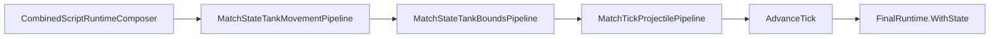

# Task 5.119 — Tank Bounds / Arena Collision Plan

> **Nur Dokumentation.** Keine Implementierung, keine Tests, keine Änderungen an `src/`, `tests`, Projekten, Solution oder `game/`.
>
> Sprache: Erklärungen überwiegend auf Deutsch; Typnamen und API-Namen wie im Code auf Englisch.

## 1. Purpose

Nach Tasks **5.112–5.117** und [TANK_MOVEMENT_INTEGRATION_CHECKPOINT.md](TANK_MOVEMENT_INTEGRATION_CHECKPOINT.md) (5.118) integriert der Combined-Runtime-Pfad Tank-`Position` pro Tick: [`CombinedRuntimeTickPipeline`](../src/ScriptTanks.Core/Scripting/CombinedRuntimeTickPipeline.cs) wendet [`MatchStateTankMovementPipeline`](../src/ScriptTanks.Core/Match/MatchStateTankMovementPipeline.cs) vor der Projektilphase an.

**Neue Lücke:** Panzer können die **legale Arena** verlassen. [`MovementIntegrator`](../src/ScriptTanks.Core/Movement/MovementIntegrator.cs) addiert `VelocityPerTick` ohne räumliche Grenzen; [`ArenaBounds`](../src/ScriptTanks.Core/Arena/ArenaBounds.cs) bietet nur `Contains` für einen Punkt — **kein** Laufzeit-Clamp während des Ticks.

**Ziel von 5.119:** Design-Plan für den Track **Tank Bounds / Arena Collision** — Policy-Vergleich, MVP-Festlegung, vorgeschlagene Pipeline, Combined-Tick-Reihenfolge und Follow-ups **5.120–5.123**. Dieses Dokument ändert **kein** Verhalten.

**Test-Baseline (Repo):** **2896** Tests nach 5.118.

Querverweise: [TANK_MOVEMENT_INTEGRATION_CHECKPOINT.md](TANK_MOVEMENT_INTEGRATION_CHECKPOINT.md), [TANK_MOVEMENT_TICK_INTEGRATION_PLAN.md](TANK_MOVEMENT_TICK_INTEGRATION_PLAN.md), [SCRIPT_RUNTIME_INTEGRATION_CHECKPOINT.md](SCRIPT_RUNTIME_INTEGRATION_CHECKPOINT.md), [COMBINED_RUNTIME_LOGGING_CHECKPOINT.md](COMBINED_RUNTIME_LOGGING_CHECKPOINT.md).

Dieser Plan setzt die in [TANK_MOVEMENT_INTEGRATION_CHECKPOINT.md](TANK_MOVEMENT_INTEGRATION_CHECKPOINT.md) §10 empfohlene Hauptspur **Tank Bounds / Arena Collision** konkret um (ohne den Checkpoint zu editieren).

## 2. Current State After 5.118

### Combined tick (authoritative nach 5.115)

Quelle: [TANK_MOVEMENT_INTEGRATION_CHECKPOINT.md](TANK_MOVEMENT_INTEGRATION_CHECKPOINT.md) §4, [`CombinedRuntimeTickPipeline`](../src/ScriptTanks.Core/Scripting/CombinedRuntimeTickPipeline.cs).

```text
CombinedScriptRuntimeComposer.Run
→ MatchStateTankMovementPipeline.Step
→ MatchTickProjectilePipeline.StepProjectilesAndResolveHits
→ MatchStateTickAdvanceSystem.AdvanceTick
→ finalRuntime = scriptResult.FinalRuntime.WithState(steppedState)
```

### Verhalten heute

| Concern | Status |
| ------- | ------ |
| Movement application (`VelocityPerTick`) | Implementiert — [`ScriptMappedMovementRequestApplicationPipeline`](../src/ScriptTanks.Core/Scripting/ScriptMappedMovementRequestApplicationPipeline.cs) |
| Movement integration (`Position += VelocityPerTick`) | Implementiert — [`MatchStateTankMovementPipeline`](../src/ScriptTanks.Core/Match/MatchStateTankMovementPipeline.cs) |
| Projectile collision after movement | Verifiziert (5.117) |
| SpawnTick owner filter + movement | Verifiziert (5.117) |
| Legacy [`MatchTickPipeline`](../src/ScriptTanks.Core/Match/MatchTickPipeline.cs) ohne Tank-Movement | Erhalten |
| **Arena outer bounds for tanks (runtime tick)** | **Fehlt** |
| Wall / obstacle collision for tanks | Fehlt |
| Tank-vs-tank collision | Fehlt |

Setup-Zeit: [`MatchSetupValidator`](../src/ScriptTanks.Core/Match/MatchSetupValidator.cs) meldet `TankPositionOutsideArenaBounds` und `TankHitboxOutsideArenaBounds` — das gilt **nur** für [`MatchInitialState`](../src/ScriptTanks.Core/Match/MatchInitialState.cs) vor dem Lauf, nicht für Positionen **nach** jedem Bewegungs-Tick.

## 3. Existing Type Inventory

| Bereich | Typ / API | Pfad |
| ------- | --------- | ---- |
| Movement state | `MovementState` | [`MovementState.cs`](../src/ScriptTanks.Core/Movement/MovementState.cs) |
| Movement integrator | `MovementIntegrator` | [`MovementIntegrator.cs`](../src/ScriptTanks.Core/Movement/MovementIntegrator.cs) |
| Tank movement pipeline | `MatchStateTankMovementPipeline` | [`MatchStateTankMovementPipeline.cs`](../src/ScriptTanks.Core/Match/MatchStateTankMovementPipeline.cs) |
| Tank movement status | `MatchStateTankMovementStatus` | [`MatchStateTankMovementStatus.cs`](../src/ScriptTanks.Core/Match/MatchStateTankMovementStatus.cs) |
| Tank movement record | `MatchStateTankMovementRecord` | [`MatchStateTankMovementRecord.cs`](../src/ScriptTanks.Core/Match/MatchStateTankMovementRecord.cs) |
| Tank movement result | `MatchStateTankMovementResult` | [`MatchStateTankMovementResult.cs`](../src/ScriptTanks.Core/Match/MatchStateTankMovementResult.cs) |
| Combined tick | `CombinedRuntimeTickPipeline` | [`CombinedRuntimeTickPipeline.cs`](../src/ScriptTanks.Core/Scripting/CombinedRuntimeTickPipeline.cs) |
| Combined tick result | `CombinedRuntimeTickResult` | [`CombinedRuntimeTickResult.cs`](../src/ScriptTanks.Core/Scripting/CombinedRuntimeTickResult.cs) |
| Match state | `MatchState` (`Arena`, `CurrentTick`, tanks, projectiles) | [`MatchState.cs`](../src/ScriptTanks.Core/Match/MatchState.cs) |
| Tank state | `TankState` | [`TankState.cs`](../src/ScriptTanks.Core/Tanks/TankState.cs) |
| Tank definition / stats | `TankDefinition`, `BasicTankStats.HitboxRadius` | [`TankDefinition.cs`](../src/ScriptTanks.Core/Tanks/TankDefinition.cs), [`TankCatalog.cs`](../src/ScriptTanks.Core/Tanks/TankCatalog.cs) |
| Arena definition | `ArenaDefinition` (`Bounds`, `WallBlocks`) | [`ArenaDefinition.cs`](../src/ScriptTanks.Core/Arena/ArenaDefinition.cs) |
| Arena bounds | `ArenaBounds` (`Width`, `Height`, `Min`, `Max`, `Contains`) | [`ArenaBounds.cs`](../src/ScriptTanks.Core/Arena/ArenaBounds.cs) |
| Arena catalog | `ArenaCatalog` (z. B. `OpenTestArena`) | [`ArenaCatalog.cs`](../src/ScriptTanks.Core/Arena/ArenaCatalog.cs) |
| Wall blocks | `WallBlock`, `FixedRect` | [`WallBlock.cs`](../src/ScriptTanks.Core/Arena/WallBlock.cs), [`FixedRect.cs`](../src/ScriptTanks.Core/Geometry/FixedRect.cs) |
| Geometry | `CircleShape`, `CollisionChecks` | [`CircleShape.cs`](../src/ScriptTanks.Core/Geometry/CircleShape.cs), [`CollisionChecks.cs`](../src/ScriptTanks.Core/Geometry/CollisionChecks.cs) |
| Setup validation (pre-run) | `MatchSetupValidator`, `MatchSetupValidationIssue` | [`MatchSetupValidator.cs`](../src/ScriptTanks.Core/Match/MatchSetupValidator.cs), [`MatchSetupValidationIssue.cs`](../src/ScriptTanks.Core/Match/MatchSetupValidationIssue.cs) |
| Projectile phase | `MatchTickProjectilePipeline` | [`MatchTickProjectilePipeline.cs`](../src/ScriptTanks.Core/Match/MatchTickProjectilePipeline.cs) |
| Tick advance | `MatchStateTickAdvanceSystem` | [`MatchStateTickAdvanceSystem.cs`](../src/ScriptTanks.Core/Match/MatchStateTickAdvanceSystem.cs) |
| Legacy tick | `MatchTickPipeline` | [`MatchTickPipeline.cs`](../src/ScriptTanks.Core/Match/MatchTickPipeline.cs) |
| Runner / replay | `CombinedRuntimeRunner`, `CombinedRuntimeReplayRecorder` | [`CombinedRuntimeRunner.cs`](../src/ScriptTanks.Core/Scripting/CombinedRuntimeRunner.cs), [`CombinedRuntimeReplayRecorder.cs`](../src/ScriptTanks.Core/Replay/CombinedRuntimeReplayRecorder.cs) |

**Geplant (noch nicht im Repo):** `MatchStateTankBoundsPipeline`, `MatchStateTankBoundsResult`, `MatchStateTankBoundsRecord`, `MatchStateTankBoundsStatus`.

## 4. Current Movement / Arena Semantics

### Movement integration (heute)

```text
MovementIntegrator.Step(MovementState)
  → Position = Position + VelocityPerTick
  → keine Arena-Grenzen
  → keine Wand-Kollision
  → keine Panzer-Panzer-Kollision
```

Quelle: [`MovementIntegrator`](../src/ScriptTanks.Core/Movement/MovementIntegrator.cs), [`MatchStateTankMovementPipeline`](../src/ScriptTanks.Core/Match/MatchStateTankMovementPipeline.cs).

### Arena (heute)

[`ArenaBounds`](../src/ScriptTanks.Core/Arena/ArenaBounds.cs) definiert ein achsenparalleles Rechteck von `(0, 0)` bis `(Width, Height)`. `Contains(position)` prüft nur den **Mittelpunkt**, nicht die volle Hitbox.

Für **vollständig legale Panzer** im Tick ist die Setup-Logik in [`MatchSetupValidator`](../src/ScriptTanks.Core/Match/MatchSetupValidator.cs) relevant (Hitbox-Kreis):

```text
center.X - HitboxRadius >= 0
center.Y - HitboxRadius >= 0
center.X + HitboxRadius <= Width
center.Y + HitboxRadius <= Height
```

MVP-Bounds-Clamp in 5.121 soll dieselbe **Kreis-in-Rechteck**-Semantik verwenden, nicht nur `ArenaBounds.Contains(center)`.

### Projektile vs Panzer-Bounds

Projektil-Grenzen, Reichweite, Wand-Treffer und Tank-Treffer liegen in der **Projektil-Pipeline** ([`MatchTickProjectilePipeline`](../src/ScriptTanks.Core/Match/MatchTickProjectilePipeline.cs), [`ProjectileHitDetection`](../src/ScriptTanks.Core/Projectiles/ProjectileHitDetection.cs)). **5.119** betrifft **Panzer** nach Movement, nicht Projektil-Out-of-Bounds-Verhalten.

## 5. Bounds Policy Options

### Option A — Clamp final position to arena bounds (empfohlen für MVP)

Nach Movement-Integration:

```text
desiredPosition = oldPosition + VelocityPerTick
clampedPosition = clamp so tank circle (center + HitboxRadius) stays inside arena bounds
```

| Vorteile | Nachteile |
| -------- | --------- |
| Deterministisch, einfach, testbar | Kann an Kanten „kleben“ wirken |
| Panzer bleiben in der Arena | Spätere Wand-Kollision braucht feinere Reaktion |
| Kein Rollback nötig | Nicht identisch mit „physikalischem“ Stoß |

### Option B — Reject movement if outside bounds

```text
if desired position invalid → keep old position
```

| Vorteile | Nachteile |
| -------- | --------- |
| Einfach | Harter Stopp an der Kante |
| Verhindert Arena-Exit | Diagonal-/Ecken-Verhalten später evtl. unbefriedigend |

### Option C — Zero velocity on bounds contact

Clamp oder reject **und** `VelocityPerTick = 0` setzen.

| Vorteile | Nachteile |
| -------- | --------- |
| Explizit „gestoppt“ | Vermischt Application/Integration |
| | Kämpft gegen Script-Intent (`VelocityPerTick` aus Composer) |
| | Bounds-Schritt mutiert mehr als nur Position |

### Option D — Full collision response

Wände, Hindernisse, Sliding, Tank-vs-Tank.

| Vorteile | Nachteile |
| -------- | --------- |
| Langfristig beste Simulation | Zu breit für MVP |
| | Mehr Geometrie und Randfälle |

## 6. Collision Scope Options

| Scope | MVP (5.120–5.123)? | Begründung |
| ----- | ------------------ | ---------- |
| Arena outer bounds (axis-aligned) | **Ja** | Natürlicher Schritt nach Positions-Integration |
| Static walls / `WallBlock` | Nein — defer | Eigene Geometrie- und Policy-Entscheidungen (vgl. [`MatchSetupValidator`](../src/ScriptTanks.Core/Match/MatchSetupValidator.cs) `TankHitboxIntersectsWall`) |
| Tank-vs-tank | Nein — defer | Auflösungs-Reihenfolge und Push-Policy offen |
| Projectile bounds / hits | Nein — bereits separat | Nicht mit Tank-Bounds mischen |
| Godot collision shapes | Nein | Core-Sim zuerst |

## 7. Recommended MVP Bounds Policy

**Gesperrt für Implementierung 5.120–5.123:**

```text
MVP = arena outer-bounds clamp only (Option A).
```

### Verhalten

```text
MatchStateTankBoundsPipeline.Step(state)
  → for each tank (ascending index)
  → destroyed → SkippedDestroyed, unchanged
  → alive, circle fully inside arena → InsideBounds, unchanged
  → alive, circle would leave arena → Clamped, position corrected
  → VelocityPerTick unchanged
  → no wall / obstacle / tank-vs-tank
  → no CurrentTick change
  → no projectile mutation
```

### Wichtige Policy

| Regel | MVP |
| ----- | --- |
| Korrigiert | `Movement.Position` (über `MovementState.WithPosition` o. ä.) |
| **Nicht** korrigiert | `Movement.VelocityPerTick` |
| Hitbox | `tank.Definition.Stats.HitboxRadius` |
| Arena | `state.Arena.Bounds` (`Width`, `Height`) |

**Begründung Velocity unverändert:** Script-`VelocityPerTick` bleibt beobachtbar; Trennung Application vs Integration vs räumliche Korrektur bleibt sauber; Bounds sind **post-integration constraint**, kein neuer Movement-Befehl.

## 8. Proposed Tank Bounds Pipeline

### Vorgeschlagener Typ

```text
MatchStateTankBoundsPipeline
```

### API (Vorschlag)

```csharp
public static MatchStateTankBoundsResult Step(MatchState state);
```

| | |
| --- | --- |
| **Input** | `MatchState` **nach** [`MatchStateTankMovementPipeline.Step`](../src/ScriptTanks.Core/Match/MatchStateTankMovementPipeline.cs) |
| **Output** | `MatchState` mit geklemmten Tank-Positionen innerhalb der Arena |

### Verarbeitungsreihenfolge

```text
for tankIndex from 0 to Count-1 (ascending):
  if tank destroyed → record SkippedDestroyed, skip position change
  else if hitbox circle inside arena bounds → InsideBounds
  else → compute clamped center, record Clamped, write new MovementState
```

Keine Wand- oder Panzer-Panzer-Prüfung in MVP.

### Clamp-Berechnung (konzeptionell)

Für lebendigen Panzer mit `center`, `radius`, `bounds (Width, Height)`:

```text
clampedX = clamp(center.X, radius, Width - radius)
clampedY = clamp(center.Y, radius, Height - radius)
```

Implementierung in 5.121 mit `Fixed` / `FixedVec2` — keine Floats. Exakte Clamp-Hilfsfunktion kann an [`CollisionChecks`](../src/ScriptTanks.Core/Geometry/CollisionChecks.cs) (`ClampLocal` ist privat) oder inline analog [`MatchSetupValidator`](../src/ScriptTanks.Core/Match/MatchSetupValidator.cs) erfolgen.

## 9. CombinedRuntime Integration Order

### Empfohlener Flow (ab 5.122)

```text
CombinedScriptRuntimeComposer.Run
→ MatchStateTankMovementPipeline.Step
→ MatchStateTankBoundsPipeline.Step
→ MatchTickProjectilePipeline.StepProjectilesAndResolveHits
→ MatchStateTickAdvanceSystem.AdvanceTick
→ finalRuntime = scriptResult.FinalRuntime.WithState(steppedState)
```



- `advance` = [`MatchStateTickAdvanceSystem.AdvanceTick`](../src/ScriptTanks.Core/Match/MatchStateTickAdvanceSystem.cs)
- `projectile` = [`MatchTickProjectilePipeline.StepProjectilesAndResolveHits`](../src/ScriptTanks.Core/Match/MatchTickProjectilePipeline.cs) (Step → Hit → Cleanup)

### Warum Bounds vor Projektilen

| Grund | Detail |
| ----- | ------ |
| Treffer-Geometrie | [`ProjectileHitDetection`](../src/ScriptTanks.Core/Projectiles/ProjectileHitDetection.cs) nutzt `tank.Movement.Position` und `HitboxRadius` |
| Kein „Geister“-Panzer außerhalb der Arena | Projektilphase sieht nur legale Positionen |
| Konsistenz mit 5.117 | Movement-vor-Hit-Ordering bleibt: erst legaler Panzer-Ort, dann Treffer |

### Legacy

[`MatchTickPipeline.Step`](../src/ScriptTanks.Core/Match/MatchTickPipeline.cs) bleibt unverändert bis expliziter Audit/Migrations-Task — **kein** globales Einfügen von Bounds in 5.120–5.123.

### `CombinedRuntimeTickResult` (5.122, optional)

Analog zu `TankMovementResult` (5.115): optionales Feld `TankBoundsResult` mit `InitialState` == post-movement / pre-bounds State-Referenz — Details in 5.120/5.122.

## 10. Result / Record Shape

Geplant in **5.120** (Modelle), analog zu Movement-Track 5.113.

### Status-Enum (Vorschlag)

```csharp
public enum MatchStateTankBoundsStatus
{
    SkippedDestroyed = 0,
    InsideBounds = 1,
    Clamped = 2,
}
```

### Record (Vorschlag)

```csharp
MatchStateTankBoundsRecord
  TankIndex, TankId
  Status
  InitialPosition, FinalPosition  // MovementState.Position vor/nach
  DidClamp
```

### Result (Vorschlag)

```csharp
MatchStateTankBoundsResult
  InitialState, FinalState
  Records (defensive copy)
  Count, GetRecordAtIndex(int)
```

### Invarianten (Records)

| Status | `InitialPosition` vs `FinalPosition` | `DidClamp` |
| ------ | ---------------------------------- | ---------- |
| `SkippedDestroyed` | gleich (`FixedVec2.Equals`) | false |
| `InsideBounds` | gleich | false |
| `Clamped` | ungleich | true |

Keine `ReferenceEquals` auf `MovementState` (struct) — gleiche Regel wie [`MatchStateTankMovementRecord`](../src/ScriptTanks.Core/Match/MatchStateTankMovementRecord.cs).

Kette (5.122):

```text
TankBoundsResult.InitialState == TankMovementResult.FinalState (same reference)
```

## 11. Test Strategy

### 5.120 — Model tests

- Enum-Werte stabil
- Record-Invarianten (`DidClamp`, Position-Gleichheit)
- Result: defensive copy, `GetRecordAtIndex`, Count == tanks, null/duplicate tank index rejected

### 5.121 — Pipeline unit tests

| Szenario | Erwartung |
| -------- | --------- |
| Panzer innerhalb Bounds | `InsideBounds`, Position unverändert |
| Links/rechts/oben/unten über Grenze | `Clamped`, Position an Kante |
| Ecke diagonal außerhalb | `Clamped` auf gültige Ecke |
| Zerstörter Panzer | `SkippedDestroyed` |
| `VelocityPerTick` nach Clamp | **unverändert** |
| `Arena`, `CurrentTick`, `Projectiles`, Loadouts | unverändert (Referenzen wo applicable) |
| Zweiter `Step` gleicher Input | deterministisch identisch |

Referenz-Geometrie: [`MatchSetupValidatorTests`](../tests/ScriptTanks.Core.Tests/Match/MatchSetupValidatorTests.cs), [`ArenaBoundsTests`](../tests/ScriptTanks.Core.Tests/Arena/ArenaBoundsTests.cs).

### 5.122 — Combined runtime integration

- Tank würde ohne Bounds aus Arena laufen → nach Bounds innerhalb
- `CombinedRuntimeTickPipeline` ruft Bounds zwischen Movement und Projektilen auf
- Optional `CombinedRuntimeTickResult.TankBoundsResult`
- Replay-Frames: geklemmte `MatchState`-Positionen
- Logs: unverändert (keine Bounds-Events)

### 5.123 — Regression

- Projektil-Treffer nutzt **geklemmte** Position (Erweiterung von 5.117-Fixtures)
- SpawnTick-Owner-Filter + Bounds kompatibel
- Legacy `MatchTickPipeline` ohne Bounds / ohne Movement — unverändert

## 12. Determinism and Purity

| Anforderung | MVP |
| ----------- | --- |
| Mathematik | Nur `Fixed` / `FixedVec2` |
| Zufall / Uhrzeit | Verboten |
| Tank-Reihenfolge | Streng aufsteigender Index |
| Input-`MatchState` | Nicht mutieren; neues `MatchState` zurückgeben |
| IO / Logging / Godot | Keine |
| Gleicher Input | Gleicher `FinalState` und gleiche Records |

## 13. Runner / Replay / Logging Relationship

### Runner / Replay

[`CombinedRuntimeRunner`](../src/ScriptTanks.Core/Scripting/CombinedRuntimeRunner.cs) und [`CombinedRuntimeReplayRecorder`](../src/ScriptTanks.Core/Replay/CombinedRuntimeReplayRecorder.cs) rufen [`CombinedRuntimeTickPipeline.Step`](../src/ScriptTanks.Core/Scripting/CombinedRuntimeTickPipeline.cs) auf — sobald Bounds in 5.122 integriert sind, **erben** Runner und Replay automatisch.

### Replay-Frames

Weiterhin nur [`MatchState`](../src/ScriptTanks.Core/Match/MatchState.cs) pro Frame — **kein** Replay-Schema-Update. Bounds sind sichtbar über korrigierte `TankState.Movement.Position`.

### Logging

| Modus | Policy |
| ----- | ------ |
| MVP | `match_started`, `match_ended` — unverändert |
| Rich | `script_tick`, Fire-Subset — unverändert |
| MVP Bounds | **Keine** neuen `CombatLogEventTypes` |

Siehe [COMBINED_RUNTIME_LOGGING_CHECKPOINT.md](COMBINED_RUNTIME_LOGGING_CHECKPOINT.md).

## 14. Follow-up Tasks 5.120–5.123

| Task | Scope |
| ---- | ----- |
| **5.120** | `MatchStateTankBoundsStatus`, `MatchStateTankBoundsRecord`, `MatchStateTankBoundsResult` + Tests |
| **5.121** | `MatchStateTankBoundsPipeline.Step` — Arena-Outer-Bounds-Clamp (Fixed-only) |
| **5.122** | Integration in [`CombinedRuntimeTickPipeline`](../src/ScriptTanks.Core/Scripting/CombinedRuntimeTickPipeline.cs); optional `CombinedRuntimeTickResult.TankBoundsResult` |
| **5.123** | Movement + Bounds + Projectile-Regression; Runner/Replay smoke; Legacy-Grenze unverändert |

### Optional später (nicht Teil von 5.119)

| Task | Scope |
| ---- | ----- |
| 5.124 | Wall / obstacle collision — Plan |
| 5.125 | Tank-vs-tank collision — Plan |
| 5.126 | Public Combined-Runtime-Fassade — Checkpoint |

## 15. Out of Scope + Definition of Done

### Out of scope für 5.119

- Kein Produktionscode
- Keine Tests
- Keine Implementierung von Bounds-Pipeline oder Combined-Integration
- Keine Wand-/Hindernis-Kollision
- Keine Tank-vs-Tank-Kollision
- Keine Änderung an Projektil-Systemen
- Keine Logging-/Replay-Schema-Erweiterung
- Keine Godot-Anbindung
- Keine Änderung an [TANK_MOVEMENT_INTEGRATION_CHECKPOINT.md](TANK_MOVEMENT_INTEGRATION_CHECKPOINT.md) oder anderen Plan-/Checkpoint-Dateien

### Definition of Done

- [x] [`docs/TANK_BOUNDS_ARENA_COLLISION_PLAN.md`](TANK_BOUNDS_ARENA_COLLISION_PLAN.md) existiert.
- [x] Aktueller Stand nach 5.118 ist zusammengefasst (§2).
- [x] Bestehende Arena-/Movement-/Tick-Typen sind inventarisiert (§3–§4).
- [x] Bounds-Policy-Optionen sind verglichen (§5).
- [x] MVP-Policy ist gesperrt: Arena-Outer-Bounds-Clamp only; `VelocityPerTick` unverändert (§7).
- [x] Pipeline und Combined-Tick-Reihenfolge sind dokumentiert (§8–§9).
- [x] Follow-up-Tasks 5.120–5.123 sind gelistet (§14).
- [x] Keine Änderungen an `src/`, `tests/`, `game/`, Projekten, Solution oder Plan-Dateien (außer dieser neuen Datei).
- [x] `dotnet build ScriptTanks.sln -warnaserror` ist grün (nach Verifikationslauf).
- [x] `dotnet test ScriptTanks.sln` bleibt bei **2896** Tests (nach Verifikationslauf).

## Verification

Nach dem Schreiben dieses Dokuments (docs-only):

```powershell
dotnet build ScriptTanks.sln -warnaserror
dotnet test ScriptTanks.sln
```

**Erwartung:**

- 0 Warnungen
- **2896** Tests bestanden (unverändert gegenüber 5.118)
