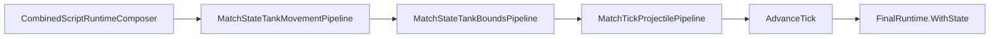

# Task 5.124 — Tank Bounds Integration Checkpoint

> **Nur Dokumentation.** Keine Implementierung, keine Tests, keine Änderungen an `src/`, `tests/`, Projekten, Solution oder `game/`.
>
> Sprache: Erklärungen überwiegend auf Deutsch; Typnamen und API-Namen wie im Code auf Englisch.

## 1. Purpose

Nach Tasks **5.119–5.123** ist der **Tank Bounds / Arena Collision MVP**-Track abgeschlossen. [`CombinedRuntimeTickPipeline`](../src/ScriptTanks.Core/Scripting/CombinedRuntimeTickPipeline.cs) integriert Arena-Outer-Bounds-Korrektur **nach** Tank-Movement und **vor** der Projektilphase.

**Ziel von 5.124:** Autoritative Checkpoint-Referenz **nach** Abschluss von 5.119–5.123 — vor Wall/Obstacle Collision, Tank-vs-Tank, Full-Angle-Aim oder Godot. Dieses Dokument ändert **kein** Verhalten.

**Test-Baseline (bekannter Checkpoint nach 5.123):** **2966** Tests, **0** Warnungen.

### Supersedes Bounds/Tick-Narrative

[TANK_MOVEMENT_INTEGRATION_CHECKPOINT.md](TANK_MOVEMENT_INTEGRATION_CHECKPOINT.md) bleibt **authoritative** für Movement Application vs Integration (5.112–5.117). Für den **Combined-Tick-Flow ab 5.122** ist dessen Per-Tick-Beschreibung ohne Bounds-Schritt (`movement → projectiles`) **überholt**.

**Dieser Checkpoint** ist die **authoritative** Referenz für Bounds/Tick nach 5.122. Der Movement-Checkpoint wird in 5.124 **nicht** editiert.

| Phase | Combined tick |
| ----- | ------------- |
| **Nach 5.117, vor 5.122** (Movement-Checkpoint §4) | `scripts → tank movement → projectiles → advance` |
| **Nach 5.122** (hier authoritative) | `scripts → tank movement → **tank bounds** → projectiles → advance` |

Querverweise: [TANK_BOUNDS_ARENA_COLLISION_PLAN.md](TANK_BOUNDS_ARENA_COLLISION_PLAN.md), [TANK_MOVEMENT_INTEGRATION_CHECKPOINT.md](TANK_MOVEMENT_INTEGRATION_CHECKPOINT.md), [COMBINED_RUNTIME_LOGGING_CHECKPOINT.md](COMBINED_RUNTIME_LOGGING_CHECKPOINT.md), [SCRIPT_RUNTIME_INTEGRATION_CHECKPOINT.md](SCRIPT_RUNTIME_INTEGRATION_CHECKPOINT.md).

## 2. Completed Milestone Summary

| Task | Ergebnis |
| ---- | -------- |
| **5.119** | [TANK_BOUNDS_ARENA_COLLISION_PLAN.md](TANK_BOUNDS_ARENA_COLLISION_PLAN.md) — Policy, MVP (arena outer clamp), Combined-Tick-Reihenfolge, Follow-ups |
| **5.120** | [`MatchStateTankBoundsStatus`](../src/ScriptTanks.Core/Match/MatchStateTankBoundsStatus.cs), [`MatchStateTankBoundsRecord`](../src/ScriptTanks.Core/Match/MatchStateTankBoundsRecord.cs), [`MatchStateTankBoundsResult`](../src/ScriptTanks.Core/Match/MatchStateTankBoundsResult.cs) |
| **5.121** | [`MatchStateTankBoundsPipeline.Step`](../src/ScriptTanks.Core/Match/MatchStateTankBoundsPipeline.cs) — radius-aware Arena-Outer-Clamp, Fixed-only |
| **5.122** | [`CombinedRuntimeTickPipeline`](../src/ScriptTanks.Core/Scripting/CombinedRuntimeTickPipeline.cs) orchestriert Bounds **vor** Projektilphase; [`CombinedRuntimeTickResult.TankBoundsResult`](../src/ScriptTanks.Core/Scripting/CombinedRuntimeTickResult.cs) |
| **5.123** | Movement + Bounds + Projectile Regression (Combined, Legacy-Grenze, Runner/Replay/Logged-Smoke) |

### Historische Test-Fortschrittsleiter (optional, aus prior checkpoints)

*Nicht aus dem Repo abgeleitet — nur als dokumentierte Checkpoint-Folge.*

| Meilenstein | Tests |
| ----------- | ----- |
| 5.118 (Movement-Checkpoint) | 2896 |
| 5.120 verified | 2928 |
| 5.121 verified | 2947 |
| 5.122 verified | 2959 |
| 5.123 verified | **2966** |

## 3. Current Bounds Architecture

### Domain models

| Typ | Rolle |
| --- | ----- |
| [`MatchStateTankBoundsStatus`](../src/ScriptTanks.Core/Match/MatchStateTankBoundsStatus.cs) | `SkippedDestroyed`, `InsideBounds`, `Clamped` |
| [`MatchStateTankBoundsRecord`](../src/ScriptTanks.Core/Match/MatchStateTankBoundsRecord.cs) | Pro Panzer: Index, `TankId`, Status, Initial-/Final-Position |
| [`MatchStateTankBoundsResult`](../src/ScriptTanks.Core/Match/MatchStateTankBoundsResult.cs) | `InitialState`, `FinalState`, Records; validiert Record-Positionen gegen Tank-Positionen in beiden States |

### Bounds integration (Match-Tick)

```text
MatchStateTankBoundsPipeline.Step(state)
  → pro Tank (Index-Reihenfolge):
       zerstört → SkippedDestroyed, Position unverändert
       lebend, bereits legal → InsideBounds
       lebend, außerhalb → Clamped (Position korrigiert)
  → MatchStateTankBoundsResult (Records + FinalState)
```

Quelle: [`MatchStateTankBoundsPipeline`](../src/ScriptTanks.Core/Match/MatchStateTankBoundsPipeline.cs).

| Eigenschaft | Semantik |
| ----------- | -------- |
| Policy | Arena **outer** bounds (Kreis mit `HitboxRadius` in [`ArenaBounds`](../src/ScriptTanks.Core/Arena/ArenaBounds.cs)) |
| Clamp-Achsen | `min = radius`, `max = Width/Height - radius` (pro Achse) |
| Mathematik | **Fixed-only** — keine Float-/Double-Pfade in Bounds-Regressionen |
| Position | Gibt `FinalState` zurück, in dem `MovementState.Position` ggf. geklemmt ist |
| Velocity | `MovementState.VelocityPerTick` bleibt **unverändert** |
| Zerstörte Panzer | Übersprungen; Position in `FinalState` unverändert |

**Nicht** in MVP: `WallBlocks`, Tank-vs-Tank, Velocity-Nullsetzung bei Kollision, Setup-Validator zur Laufzeit.

**Tests:** [`MatchStateTankBoundsPipelineTests`](../tests/ScriptTanks.Core.Tests/Match/MatchStateTankBoundsPipelineTests.cs), Model-Tests unter `tests/ScriptTanks.Core.Tests/Match/`.

### Combined vs Legacy

| Pfad | Bounds |
| ---- | ------ |
| `CombinedRuntimeTickPipeline.Step` / Runner / Replay / Logged | Bounds-Pipeline läuft |
| [`MatchTickPipeline.Step`](../src/ScriptTanks.Core/Match/MatchTickPipeline.cs) | **Kein** Bounds-Clamp (§8) |

## 4. Current Combined Tick Flow

[TANK_MOVEMENT_INTEGRATION_CHECKPOINT.md](TANK_MOVEMENT_INTEGRATION_CHECKPOINT.md) §4 beschreibt den Flow **ohne** Bounds (historisch bis 5.121). Ab **5.122** gilt ausschließlich der Flow unten.

### Post-5.122 Orchestrierung

Quelle: **`CombinedRuntimeTickPipeline.Step`** ([`CombinedRuntimeTickPipeline.cs`](../src/ScriptTanks.Core/Scripting/CombinedRuntimeTickPipeline.cs)).

```text
CombinedScriptRuntimeComposer.Run(runtime, programs, sequence)
  → scriptResult

MatchStateTankMovementPipeline.Step(scriptResult.FinalRuntime.State)
  → tankMovementResult
     (rohe neue Position nach Velocity-Integration)

MatchStateTankBoundsPipeline.Step(tankMovementResult.FinalState)
  → tankBoundsResult
     (legale Arena-Position; Velocity unverändert)

MatchTickProjectilePipeline.StepProjectilesAndResolveHits(tankBoundsResult.FinalState)
  → projectileResolvedState
     (projectile step → hit → cleanup; Treffer auf post-bounds Position)

MatchStateTickAdvanceSystem.AdvanceTick(projectileResolvedState)
  → steppedState

finalRuntime = scriptResult.FinalRuntime.WithState(steppedState)
```



- `advance` = [`MatchStateTickAdvanceSystem.AdvanceTick`](../src/ScriptTanks.Core/Match/MatchStateTickAdvanceSystem.cs)
- `projectile` = [`MatchTickProjectilePipeline.StepProjectilesAndResolveHits`](../src/ScriptTanks.Core/Match/MatchTickProjectilePipeline.cs)

### Semantik (5.123-verifiziert)

| Schritt | Position für nachfolgende Phasen |
| ------- | -------------------------------- |
| Movement | **Roh** — z. B. legal edge + `(1,0)` → `(99, 20)` bei OpenTestArena |
| Bounds | **Korrigiert** — gleiches Beispiel → `(98, 20)` (`maxX = Width - HitboxRadius`) |
| Projectile hits | Sieht **post-bounds** Zentren, nicht rohe Movement-Position |

### Explizite Kontraste

| Thema | Nach 5.122 |
| ----- | ---------- |
| **Nicht** | [`CombinedRuntimeTickPipeline`](../src/ScriptTanks.Core/Scripting/CombinedRuntimeTickPipeline.cs) ruft [`MatchTickPipeline.Step`](../src/ScriptTanks.Core/Match/MatchTickPipeline.cs) auf |
| **Stattdessen** | Dieselben Projectile-/Advance-Bausteine, aber **explizit** mit Movement **und** Bounds **davor** |
| **Legacy** | [`MatchTickPipeline.Step`](../src/ScriptTanks.Core/Match/MatchTickPipeline.cs) = projectiles → advance **ohne** Movement **ohne** Bounds (§8) |

## 5. API Inventory

| Bereich | Typ / API | Pfad |
| ------- | --------- | ---- |
| Bounds Status | `MatchStateTankBoundsStatus` | [`MatchStateTankBoundsStatus.cs`](../src/ScriptTanks.Core/Match/MatchStateTankBoundsStatus.cs) |
| Bounds Record | `MatchStateTankBoundsRecord` | [`MatchStateTankBoundsRecord.cs`](../src/ScriptTanks.Core/Match/MatchStateTankBoundsRecord.cs) |
| Bounds Result | `MatchStateTankBoundsResult` | [`MatchStateTankBoundsResult.cs`](../src/ScriptTanks.Core/Match/MatchStateTankBoundsResult.cs) |
| Bounds Pipeline | `MatchStateTankBoundsPipeline` | [`MatchStateTankBoundsPipeline.cs`](../src/ScriptTanks.Core/Match/MatchStateTankBoundsPipeline.cs) |
| Movement Pipeline | `MatchStateTankMovementPipeline` | [`MatchStateTankMovementPipeline.cs`](../src/ScriptTanks.Core/Match/MatchStateTankMovementPipeline.cs) |
| Combined Tick | `CombinedRuntimeTickPipeline` | [`CombinedRuntimeTickPipeline.cs`](../src/ScriptTanks.Core/Scripting/CombinedRuntimeTickPipeline.cs) |
| Combined Tick Result | `CombinedRuntimeTickResult` | [`CombinedRuntimeTickResult.cs`](../src/ScriptTanks.Core/Scripting/CombinedRuntimeTickResult.cs) |
| Script Composer | `CombinedScriptRuntimeComposer` | [`CombinedScriptRuntimeComposer.cs`](../src/ScriptTanks.Core/Scripting/CombinedScriptRuntimeComposer.cs) |
| Projectile Phase | `MatchTickProjectilePipeline` | [`MatchTickProjectilePipeline.cs`](../src/ScriptTanks.Core/Match/MatchTickProjectilePipeline.cs) |
| Hit System | `MatchStateProjectileHitSystem` | [`MatchStateProjectileHitSystem.cs`](../src/ScriptTanks.Core/Match/MatchStateProjectileHitSystem.cs) |
| Tick Advance | `MatchStateTickAdvanceSystem` | [`MatchStateTickAdvanceSystem.cs`](../src/ScriptTanks.Core/Match/MatchStateTickAdvanceSystem.cs) |
| Legacy Tick | `MatchTickPipeline` | [`MatchTickPipeline.cs`](../src/ScriptTanks.Core/Match/MatchTickPipeline.cs) |

### Runner / Replay / Logged (unveränderte APIs, Bounds-Verhalten über Tick-Pipeline)

| API | Pfad |
| --- | ---- |
| `CombinedRuntimeRunner` | [`CombinedRuntimeRunner.cs`](../src/ScriptTanks.Core/Scripting/CombinedRuntimeRunner.cs) |
| `CombinedRuntimeReplayRecorder` | [`CombinedRuntimeReplayRecorder.cs`](../src/ScriptTanks.Core/Replay/CombinedRuntimeReplayRecorder.cs) |
| `LoggedCombinedRuntimeRunner` | [`LoggedCombinedRuntimeRunner.cs`](../src/ScriptTanks.Core/Scripting/LoggedCombinedRuntimeRunner.cs) |
| `LoggedCombinedRuntimeReplayRecorder` | [`LoggedCombinedRuntimeReplayRecorder.cs`](../src/ScriptTanks.Core/Replay/LoggedCombinedRuntimeReplayRecorder.cs) |

## 6. Stable Invariants

### Combined Tick Order (5.122+)

```text
scripts → tank movement → tank bounds → projectile step / hit / cleanup → advance tick
```

### Bounds vs Movement vs Projectiles

- Bounds laufen **nach** [`MatchStateTankMovementPipeline`](../src/ScriptTanks.Core/Match/MatchStateTankMovementPipeline.cs) und **vor** [`MatchTickProjectilePipeline.StepProjectilesAndResolveHits`](../src/ScriptTanks.Core/Match/MatchTickProjectilePipeline.cs).
- Projektil-Treffer im Combined-Pfad nutzen Tank-`Position` aus **post-bounds** `MatchState`.
- Bounds **ändern** `MovementState.VelocityPerTick` **nicht** — nur die resultierende `MovementState.Position` wird ggf. geklemmt.

### Result Chain (`CombinedRuntimeTickResult`)

- `TankMovementResult.InitialState` = `ScriptResult.FinalRuntime.State` (Referenz-Kette).
- `TankBoundsResult.InitialState` = `TankMovementResult.FinalState`.
- `FinalRuntime.State` = `steppedState` (post-movement, post-bounds, post-projectile, post-advance).
- `FinalRuntime.SensorLoadouts` = `ScriptResult.FinalRuntime.SensorLoadouts`.

### Replay

- Frames bleiben **nur** [`MatchState`](../src/ScriptTanks.Core/Match/MatchState.cs) — kein neues Replay-Schema in 5.119–5.123.
- Clamp ist sichtbar über `MatchState.Tanks[].Movement.Position` (keine separaten Bounds-Frame-Typen).

### Logging

- **Keine** bounds-spezifischen Einträge in [`CombatLogEventTypes`](../src/ScriptTanks.Core/Logging/CombatLogEventTypes.cs).
- MVP/Rich-Policy unverändert — [COMBINED_RUNTIME_LOGGING_CHECKPOINT.md](COMBINED_RUNTIME_LOGGING_CHECKPOINT.md).
- Rich-Logs bleiben script-/fire-orientiert, nicht geometry-orientiert.

### SpawnTick Owner Filter

Unverändert: Owner wird bei `projectile.SpawnTick == state.CurrentTick` von Treffer-Kandidaten ausgeschlossen ([`MatchStateProjectileHitSystem`](../src/ScriptTanks.Core/Match/MatchStateProjectileHitSystem.cs)). Movement **und** Bounds **deaktivieren** diese Policy nicht (5.123).

### Legacy Tick Boundary

[`MatchTickPipeline.Step`](../src/ScriptTanks.Core/Match/MatchTickPipeline.cs) wird **nicht** implizit um Movement oder Bounds erweitert.

### Determinismus in Tests

- Bounds-Regressionen nutzen **Fixed**-Geometrie (z. B. `Fixed.FromRatio(479, 5)` für 95.8) — keine Float-/Double-Hilfsrechnung in Assertions.

## 7. Verified Behavior

Fixture-Basis (5.123): `ArenaCatalog.OpenTestArena` 100×60; `HitboxRadius` 2; Projektil-Radius `Fixed.FromRatio(1, 4)`; Overlap-Schwelle Zentrum-Distanz ≤ **2.25**; legal `maxX` = **98**; Edge-Start + `VelocityPerTick` `(1,0)` → Movement **(99, 20)** → Bounds **(98, 20)**; Schaden BasicTank → HP **80** nach 25 raw damage.

| Verhalten | Evidenz (Tests) |
| --------- | ---------------- |
| Bounds vor Projektil-Treffer (Clamp-only, 5.122) | `Step_BoundsRunBeforeProjectileHitDetection_ProjectileUsesClampedPosition` — [`CombinedRuntimeTickPipelineTests`](../tests/ScriptTanks.Core.Tests/Scripting/CombinedRuntimeTickPipelineTests.cs) |
| Clamped hit: Projektil (100, 20) trifft post-bounds (98, 20) | `Step_BoundsRunBeforeProjectileHitDetection_ProjectileHitsClampedTankPosition` — [`CombinedRuntimeTickPipelineTests`](../tests/ScriptTanks.Core.Tests/Scripting/CombinedRuntimeTickPipelineTests.cs) |
| Raw vs bounded: Projektil 95.8 trifft nur bounded, nicht raw (99, 20) | `Step_ProjectileHitDetection_UsesBoundedPosition_NotRawMovedPosition` — [`CombinedRuntimeTickPipelineTests`](../tests/ScriptTanks.Core.Tests/Scripting/CombinedRuntimeTickPipelineTests.cs) |
| SpawnTick-Owner-Filter mit Movement + Bounds + separatem Fire | `Step_FireMovementAndBounds_SpawnTickOwnerFilterStillPreventsOwnerSelfHit` — [`CombinedRuntimeTickPipelineTests`](../tests/ScriptTanks.Core.Tests/Scripting/CombinedRuntimeTickPipelineTests.cs) |
| Runner: 1 Tick, Clamp + Schaden | `RunUntilEnd_MovementBoundsProjectileHit_FinalRuntimeShowsDamageAndClamp` — [`CombinedRuntimeRunnerTests`](../tests/ScriptTanks.Core.Tests/Scripting/CombinedRuntimeRunnerTests.cs) |
| Replay: 2 Frames, letzter Frame Clamp + HP 80 | `RecordUntilEnd_MovementBoundsProjectileHit_FinalFrameShowsDamageAndClamp` — [`CombinedRuntimeReplayRecorderTests`](../tests/ScriptTanks.Core.Tests/Replay/CombinedRuntimeReplayRecorderTests.cs) |
| Logged: Rich-Sequenz unverändert, Final-State Clamp + Schaden | `RunUntilEndWithTickLogs_MovementBoundsProjectileHit_LogsUnchanged` — [`LoggedCombinedRuntimeRunnerTests`](../tests/ScriptTanks.Core.Tests/Scripting/LoggedCombinedRuntimeRunnerTests.cs) |
| Legacy: kein Bounds-Clamp | `Step_DoesNotApplyTankBoundsClamp` — [`MatchTickPipelineTests`](../tests/ScriptTanks.Core.Tests/Match/MatchTickPipelineTests.cs) |
| Legacy: unbounded Position, Projektil 95.8 → kein Treffer | `Step_ProjectilesUseUnboundedTankPosition_WhenLegacyTickDoesNotClampBounds` — [`MatchTickPipelineTests`](../tests/ScriptTanks.Core.Tests/Match/MatchTickPipelineTests.cs) |

### Smoke-Tests: Tick-Budget

Runner/Replay/Logged-Smoke nutzen **`maxTicks: 1`** mit **Start-Tick 0** ([`MatchEndConditionEvaluator`](../src/ScriptTanks.Core/Match/MatchEndConditionEvaluator.cs): Ende wenn `CurrentTick >= maxTicks`). Vorseeded Projektil: **SpawnTick 0** (nicht `tick - 1`, da ungültig bei Tick 0). Pipeline-Tests nutzen typisch `SimTick(10)` mit `SpawnTick = tick - 1`.

## 8. Legacy MatchTickPipeline Boundary

[`MatchTickPipeline`](../src/ScriptTanks.Core/Match/MatchTickPipeline.cs) wurde in 5.119–5.123 **bewusst nicht** geändert:

- **Geringerer Blast-Radius** — Match-only-Pfade bleiben stabil.
- **Kein** stillschweigendes Upgrade mit Movement oder Bounds.
- **Combined Runtime** ist der script-aware Pfad mit expliziter Orchestrierung.

| Komponente | Verantwortung |
| ---------- | ------------- |
| [`CombinedRuntimeTickPipeline`](../src/ScriptTanks.Core/Scripting/CombinedRuntimeTickPipeline.cs) | Composer + Tank-Movement + Tank-Bounds + Projektilphase + Advance |
| [`MatchTickPipeline`](../src/ScriptTanks.Core/Match/MatchTickPipeline.cs) | Projektil-Primitive + Advance (**ohne** Tank-Movement, **ohne** Bounds-Clamp) |

### Legacy-Semantik

- **Kein** Tank-Movement pro Tick.
- **Kein** Arena-Outer-Bounds-Clamp.
- Projektil-Treffer/Miss nutzen die **gespeicherte** Tank-`Position` unverändert.

### Kontrast (5.123)

| Pfad | Tank bei (99, 20) | Projektil bei 95.8 | Ergebnis |
| ---- | ------------------- | ------------------ | -------- |
| Combined (nach Move+Bounds von legal edge) | Bounds → **(98, 20)** | Treffer | HP **80** |
| Legacy `MatchTickPipeline.Step` | Bleibt **(99, 20)** | Kein Treffer (Distanz 3.2 > 2.25) | HP **100** |

Ein explizites Audit („soll `MatchTickPipeline` jemals Movement oder Bounds aufrufen?“) ist **nicht** Teil von 5.124.

## 9. Replay and Logging Policy

### Replay

- [`CombinedRuntimeReplayRecorder`](../src/ScriptTanks.Core/Replay/CombinedRuntimeReplayRecorder.cs) speichert weiterhin **nur** [`MatchState`](../src/ScriptTanks.Core/Match/MatchState.cs)-Snapshots pro Frame.
- **Keine** `TankBoundsResult`-Records, Runtime-Debug-Layer oder separaten Bounds-Frame-Typen.
- Clamp und Schaden sind über geänderte Tank-Felder in `MatchState` sichtbar.

### Logging

- **Keine** neuen Event-Typen für Bounds in [`CombatLogEventTypes`](../src/ScriptTanks.Core/Logging/CombatLogEventTypes.cs).
- Rich Combined-Logs: `match_started`, `script_tick`, ggf. Fire-Events, `match_ended` — siehe [COMBINED_RUNTIME_LOGGING_CHECKPOINT.md](COMBINED_RUNTIME_LOGGING_CHECKPOINT.md).
- Zukünftige Diagnostics, Heatmaps oder Geometry-Logs sind **out of scope** für den MVP-Track.

## 10. Open Architecture Gaps

5.119–5.123 haben **Arena-Outer-Bounds im Combined-Tick** gelöst — **nicht** vollständige Welt-Kollision.

| Lücke | Kurzbeschreibung |
| ----- | ---------------- |
| Wall / Obstacle Collision | Arena-`WallBlocks` vs Tank-Hitbox — Policy (Block vs Slide) offen |
| Tank-vs-Tank Collision | Keine Panzer-Panzer-Physik |
| Full-Angle Turret Aim | [`FixedRotationAimResolver`](../src/ScriptTanks.Core/Math/FixedRotationAimResolver.cs) nur Kardinal-MVP |
| Turret Turn-Rate | Instant `TurretRotation` in Application |
| Public Combined-Runtime-Façade | Parallel zu [`MatchRunner`](../src/ScriptTanks.Core/Match/MatchRunner.cs) / Legacy-Replay |
| Godot / Game Integration | `game/` nicht an Combined-Loop angebunden |
| Replay / UI Visualization | Keine dedizierte Bounds-Debug-Oberfläche |
| Bounds / Geometry CombatLog Events | Keine Diagnostics im Log-Schema |
| Acceleration / Friction | Instant `VelocityPerTick`-Sprünge (Movement-Track) |

**Gelöst (MVP):** Panzer verlassen die legale Arena im Combined-Pfad nicht mehr nach Movement-Integration (Clamp statt freier Position außerhalb).

## 11. Recommended Roadmap After 5.123

| Track | Nutzen | Risiko | Empfehlung |
| ----- | ------ | ------ | ---------- |
| **A — Wall / Obstacle Collision** | Arena-Wände spielbar; natürliche Folge nach Outer-Bounds | Geometrie, Block-vs-Slide-Policy | **Hoch — empfohlener Haupt-Track (5.125)** |
| **B — Full-Angle Turret Aim Resolver** | `AimAtEnemy` über Kardinal-Fixtures hinaus | Fixed-Point-Winkel-Design | **Medium — Alternative (5.125A)** |
| **C — Tank-vs-Tank Collision** | Panzer blockieren sich | Policy-Konflikt mit Walls | Erst nach Wall/Obstacle-Plan oder separater Plan-Task |
| **D — Godot Integration** | Sichtbarer Gameplay-Loop | Runtime-Adapter | Medium |
| **E — Public Combined-Runtime-Façade** | Klarere Produkt-API | Architektur/Docs | Medium |
| **F — Rich Diagnostics / Heatmaps** | Debugging | Event-/Schema-Creep | Niedrig |

### Empfohlener nächster Haupt-Track

**5.125 — Wall / Obstacle Collision Plan**

Outer-Bounds sind integriert; Wall/Obstacle ist die nächste natürliche Physik-Schicht im Arena-Raum.

### Alternative (Combat-Feel zuerst)

**5.125A — Full-Angle Turret Aim Resolver Plan** — wenn Zielrichtung wichtiger ist als Wand-Kollision.

### Vorgeschlagene Tasks (Wall-Track, Plan-only)

| Task | Inhalt |
| ---- | ------ |
| **5.125** | Wall / Obstacle Collision — Plan |
| *(Follow-ups)* | Models, Pipeline, Combined Integration, Regression — **ohne** Implementierung ohne Plan-Task |

### Vorgeschlagene Tasks (Aim-Track, Plan-only)

| Task | Inhalt |
| ---- | ------ |
| **5.125A** | Full-Angle Fixed-Rotation-Aim — Design Plan |

**Keine** Implementierung in 5.124 oder ohne expliziten Plan-Task.

## 12. Verification / Definition of Done

Nach dem Schreiben dieses Dokuments (docs-only), vom **Repository-Root**:

```powershell
dotnet build ScriptTanks.sln -warnaserror
dotnet test ScriptTanks.sln
```

**Erwartung:**

- 0 Warnungen
- **2966** Tests bestanden (unverändert gegenüber 5.123)

### Definition of Done

- [x] [`docs/TANK_BOUNDS_INTEGRATION_CHECKPOINT.md`](TANK_BOUNDS_INTEGRATION_CHECKPOINT.md) existiert.
- [x] Tasks 5.119–5.123 sind zusammengefasst (§2).
- [x] Bounds-Architektur und Combined-Tick-Flow sind dokumentiert (§3, §4); Supersedes-Hinweis zu Movement-Checkpoint (§1).
- [x] Stable Invariants und API Inventory (§5, §6).
- [x] Verifiziertes 5.123-Verhalten inkl. Raw-vs-Bounded und Legacy-Kontrast (§7, §8).
- [x] Replay/Logging-Policy (§9).
- [x] Offene Lücken und Roadmap **5.125 vs 5.125A** (§10, §11).
- [x] Keine Änderungen an `src/`, `tests/`, `game/`, `.csproj`, `.sln` oder Plan-Dateien.
- [x] `dotnet build ScriptTanks.sln -warnaserror` grün (nach Verifikationslauf).
- [x] `dotnet test ScriptTanks.sln` bleibt bei **2966** Tests (nach Verifikationslauf).
