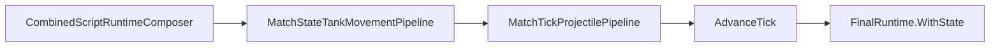

# Task 5.118 — Tank Movement Integration Checkpoint

> **Nur Dokumentation.** Keine Implementierung, keine Tests, keine Änderungen an `src/`, `tests/`, Projekten, Solution oder `game/`.
>
> Sprache: Erklärungen überwiegend auf Deutsch; Typnamen und API-Namen wie im Code auf Englisch.

## 1. Purpose

Nach Tasks **5.112–5.117** ist der **Tank Movement Tick Integration**-Track abgeschlossen. Movement-Befehle sind im Combined-Runtime-Pfad nicht mehr nur `VelocityPerTick`-Semantik: [`CombinedRuntimeTickPipeline`](../src/ScriptTanks.Core/Scripting/CombinedRuntimeTickPipeline.cs) integriert Tank-`Position` pro Tick **vor** der Projektilphase.

**Ziel von 5.118:** Autoritative Checkpoint-Referenz **nach** Abschluss von 5.112–5.117 — vor Bounds/Collision/Godot/Vollwinkel-Aim. Dieses Dokument ändert **kein** Verhalten.

**Test-Baseline (Repo):** **2896** Tests nach 5.117.

### Supersedes Movement/Tick-Narrative

[SCRIPT_RUNTIME_INTEGRATION_CHECKPOINT.md](SCRIPT_RUNTIME_INTEGRATION_CHECKPOINT.md) bleibt **historisch korrekt für 5.111** (Composer, Sensor/Fire/Movement/Turret-**Application**, Combined Runner/Replay, Logging, `SpawnTick`-Policy). Für den **Combined-Tick-Flow ab 5.115** ist dessen Per-Tick-Beschreibung (`scripts → MatchTickPipeline.Step → advance`, ohne Tank-Movement-Integration) **überholt**.

**Dieser Checkpoint** ist die **autoritative** Referenz für Movement/Tick nach 5.115. Der Script-Checkpoint wird in 5.118 **nicht** editiert.

| Phase | Combined tick |
| ----- | ------------- |
| **Vor 5.115** (SCRIPT_RUNTIME_INTEGRATION_CHECKPOINT §3) | `scripts → projectiles → advance` (via [`MatchTickPipeline.Step`](../src/ScriptTanks.Core/Match/MatchTickPipeline.cs), keine Positionsintegration) |
| **Nach 5.115** (hier authoritative) | `scripts → tank movement → projectiles → advance` (explizite Orchestrierung in [`CombinedRuntimeTickPipeline`](../src/ScriptTanks.Core/Scripting/CombinedRuntimeTickPipeline.cs)) |

Querverweise: [TANK_MOVEMENT_TICK_INTEGRATION_PLAN.md](TANK_MOVEMENT_TICK_INTEGRATION_PLAN.md), [SCRIPT_RUNTIME_INTEGRATION_CHECKPOINT.md](SCRIPT_RUNTIME_INTEGRATION_CHECKPOINT.md), [COMBINED_RUNTIME_LOGGING_CHECKPOINT.md](COMBINED_RUNTIME_LOGGING_CHECKPOINT.md), [PROJECTILE_SPAWN_TICK_INVENTORY.md](PROJECTILE_SPAWN_TICK_INVENTORY.md).

## 2. Completed Milestone Summary

| Task | Ergebnis |
| ---- | -------- |
| **5.112** | [TANK_MOVEMENT_TICK_INTEGRATION_PLAN.md](TANK_MOVEMENT_TICK_INTEGRATION_PLAN.md) — Application vs Integration, gesperrte Combined-Orchestrierung |
| **5.113** | [`MatchStateTankMovementStatus`](../src/ScriptTanks.Core/Match/MatchStateTankMovementStatus.cs), [`MatchStateTankMovementRecord`](../src/ScriptTanks.Core/Match/MatchStateTankMovementRecord.cs), [`MatchStateTankMovementResult`](../src/ScriptTanks.Core/Match/MatchStateTankMovementResult.cs) |
| **5.114** | [`MatchStateTankMovementPipeline.Step`](../src/ScriptTanks.Core/Match/MatchStateTankMovementPipeline.cs) mit [`MovementIntegrator`](../src/ScriptTanks.Core/Movement/MovementIntegrator.cs) |
| **5.115** | [`CombinedRuntimeTickPipeline`](../src/ScriptTanks.Core/Scripting/CombinedRuntimeTickPipeline.cs) orchestriert Tank-Movement **vor** Projektilphase; [`CombinedRuntimeTickResult.TankMovementResult`](../src/ScriptTanks.Core/Scripting/CombinedRuntimeTickResult.cs) |
| **5.116** | Runner / Replay / Logged-Regressions: Position-Integration über mehrere Ticks |
| **5.117** | Projektil-Treffer nach Movement; SpawnTick-Owner-Filter mit Movement; Legacy-Grenze |

### Test-Fortschritt (verifizierte Counts)

| Meilenstein | Tests |
| ----------- | ----- |
| 5.111 (Script-Integration-Checkpoint) | 2840 |
| 5.114 verified | 2884 |
| 5.115 verified | 2891 |
| 5.116 verified | 2893 |
| 5.117 verified | **2896** |

## 3. Current Movement Architecture

Zwei getrennte Phasen — **nicht** vermischen:

### Movement Application (Script-Composer)

```text
ScriptMappedMovementRequestApplicationPipeline.Apply(...)
  → setzt MovementState.VelocityPerTick
  → ändert Position nicht
```

Quelle: [`ScriptMappedMovementRequestApplicationPipeline`](../src/ScriptTanks.Core/Scripting/ScriptMappedMovementRequestApplicationPipeline.cs).

[`CombinedScriptRuntimeComposer.Run`](../src/ScriptTanks.Core/Scripting/CombinedScriptRuntimeComposer.cs) wendet Movement **nach** Fire an (Option A); `FinalRuntime.State` trägt die gesetzte Velocity, Position bleibt bis zur Tick-Integration unverändert.

**Tests:** Composer-only regressions erwarten geänderte **Velocity**, **unveränderte Position** (z. B. [`CombinedScriptRuntimeComposerTests`](../tests/ScriptTanks.Core.Tests/Scripting/CombinedScriptRuntimeComposerTests.cs)).

### Movement Integration (Match-Tick)

```text
MatchStateTankMovementPipeline.Step(state)
  → pro Tank: MovementIntegrator.Step(MovementState)
  → Position += VelocityPerTick
  → MatchStateTankMovementResult (Records + FinalState)
```

Quellen:

- [`MatchStateTankMovementPipeline`](../src/ScriptTanks.Core/Match/MatchStateTankMovementPipeline.cs)
- [`MovementIntegrator`](../src/ScriptTanks.Core/Movement/MovementIntegrator.cs)
- [`MovementState`](../src/ScriptTanks.Core/Movement/MovementState.cs)

| Status | Bedeutung |
| ------ | --------- |
| `SkippedDestroyed` | Zerstörter Panzer: keine Integration |
| `StayedStill` | Lebend, `VelocityPerTick == 0` |
| `Moved` | Lebend, Position geändert |

**Tests:** [`MatchStateTankMovementPipelineTests`](../tests/ScriptTanks.Core.Tests/Match/MatchStateTankMovementPipelineTests.cs).

### Combined vs Composer-only

| Pfad | Position |
| ---- | -------- |
| Nur `CombinedScriptRuntimeComposer.Run` | Unverändert |
| `CombinedRuntimeTickPipeline.Step` / Runner / Replay / Logged | Integriert pro ausgeführtem Tick |

## 4. Current Combined Tick Flow

[SCRIPT_RUNTIME_INTEGRATION_CHECKPOINT.md](SCRIPT_RUNTIME_INTEGRATION_CHECKPOINT.md) dokumentiert den Per-Tick-Wrapper noch als `Composer → MatchTickPipeline.Step`. Das war **vor 5.115** zutreffend. Ab **5.115** gilt ausschließlich der Flow unten; **dieser Abschnitt ersetzt** die Movement/Tick-Narrative aus dem Script-Checkpoint (ohne jene Datei zu ändern).

### Post-5.115 Orchestrierung

Quelle: [`CombinedRuntimeTickPipeline.Step`](../src/ScriptTanks.Core/Scripting/CombinedRuntimeTickPipeline.cs).

```text
CombinedScriptRuntimeComposer.Run(runtime, programs, sequence)
  → scriptResult

MatchStateTankMovementPipeline.Step(scriptResult.FinalRuntime.State)
  → tankMovementResult

MatchTickProjectilePipeline.StepProjectilesAndResolveHits(tankMovementResult.FinalState)
  → projectileResolvedState
     (projectile step → hit → cleanup)

MatchStateTickAdvanceSystem.AdvanceTick(projectileResolvedState)
  → steppedState

finalRuntime = scriptResult.FinalRuntime.WithState(steppedState)
```



- `advance` = [`MatchStateTickAdvanceSystem.AdvanceTick`](../src/ScriptTanks.Core/Match/MatchStateTickAdvanceSystem.cs)
- `projectile` = [`MatchTickProjectilePipeline.StepProjectilesAndResolveHits`](../src/ScriptTanks.Core/Match/MatchTickProjectilePipeline.cs) (Step → Hit → Cleanup)

### Explizite Kontraste

| Thema | Nach 5.115 |
| ----- | ---------- |
| **Nicht mehr** | [`CombinedRuntimeTickPipeline`](../src/ScriptTanks.Core/Scripting/CombinedRuntimeTickPipeline.cs) ruft [`MatchTickPipeline.Step`](../src/ScriptTanks.Core/Match/MatchTickPipeline.cs) auf |
| **Stattdessen** | Dieselben Projectile-/Advance-Bausteine, aber **explizit** mit [`MatchStateTankMovementPipeline`](../src/ScriptTanks.Core/Match/MatchStateTankMovementPipeline.cs) **davor** |
| **Legacy** | [`MatchTickPipeline.Step`](../src/ScriptTanks.Core/Match/MatchTickPipeline.cs) bleibt `projectiles → advance` **ohne** Tank-Movement (§8) |

Treffererkennung im Combined-Pfad nutzt Tank-`Position` **nach** Movement-Integration (5.117).

## 5. API Inventory

| Bereich | Typ / API | Pfad |
| ------- | --------- | ---- |
| Movement Application | `ScriptMappedMovementRequestApplicationPipeline` | [`ScriptMappedMovementRequestApplicationPipeline.cs`](../src/ScriptTanks.Core/Scripting/ScriptMappedMovementRequestApplicationPipeline.cs) |
| Movement State | `MovementState` | [`MovementState.cs`](../src/ScriptTanks.Core/Movement/MovementState.cs) |
| Movement Integration | `MovementIntegrator` | [`MovementIntegrator.cs`](../src/ScriptTanks.Core/Movement/MovementIntegrator.cs) |
| Tank Movement Status | `MatchStateTankMovementStatus` | [`MatchStateTankMovementStatus.cs`](../src/ScriptTanks.Core/Match/MatchStateTankMovementStatus.cs) |
| Tank Movement Record | `MatchStateTankMovementRecord` | [`MatchStateTankMovementRecord.cs`](../src/ScriptTanks.Core/Match/MatchStateTankMovementRecord.cs) |
| Tank Movement Result | `MatchStateTankMovementResult` | [`MatchStateTankMovementResult.cs`](../src/ScriptTanks.Core/Match/MatchStateTankMovementResult.cs) |
| Tank Movement Pipeline | `MatchStateTankMovementPipeline` | [`MatchStateTankMovementPipeline.cs`](../src/ScriptTanks.Core/Match/MatchStateTankMovementPipeline.cs) |
| Combined Tick | `CombinedRuntimeTickPipeline` | [`CombinedRuntimeTickPipeline.cs`](../src/ScriptTanks.Core/Scripting/CombinedRuntimeTickPipeline.cs) |
| Combined Tick Result | `CombinedRuntimeTickResult` | [`CombinedRuntimeTickResult.cs`](../src/ScriptTanks.Core/Scripting/CombinedRuntimeTickResult.cs) |
| Projectile Phase | `MatchTickProjectilePipeline` | [`MatchTickProjectilePipeline.cs`](../src/ScriptTanks.Core/Match/MatchTickProjectilePipeline.cs) |
| Legacy Tick | `MatchTickPipeline` | [`MatchTickPipeline.cs`](../src/ScriptTanks.Core/Match/MatchTickPipeline.cs) |

### Runner / Replay (unveränderte APIs, neues Verhalten)

| API | Pfad |
| --- | ---- |
| `CombinedRuntimeRunner` | [`CombinedRuntimeRunner.cs`](../src/ScriptTanks.Core/Scripting/CombinedRuntimeRunner.cs) |
| `CombinedRuntimeReplayRecorder` | [`CombinedRuntimeReplayRecorder.cs`](../src/ScriptTanks.Core/Replay/CombinedRuntimeReplayRecorder.cs) |
| `LoggedCombinedRuntimeRunner` | [`LoggedCombinedRuntimeRunner.cs`](../src/ScriptTanks.Core/Scripting/LoggedCombinedRuntimeRunner.cs) |
| `LoggedCombinedRuntimeReplayRecorder` | [`LoggedCombinedRuntimeReplayRecorder.cs`](../src/ScriptTanks.Core/Replay/LoggedCombinedRuntimeReplayRecorder.cs) |

## 6. Stable Invariants

### Application vs Integration

- Script-Movement-Application mutiert **nur** `VelocityPerTick`.
- Tank-Movement-Integration mutiert **Position** über [`MovementIntegrator`](../src/ScriptTanks.Core/Movement/MovementIntegrator.cs).

### Combined Tick Order (5.115+)

```text
scripts → tank movement → projectile step / hit / cleanup → advance tick
```

### Legacy Tick Boundary

[`MatchTickPipeline.Step`](../src/ScriptTanks.Core/Match/MatchTickPipeline.cs) = [`MatchTickProjectilePipeline.StepProjectilesAndResolveHits`](../src/ScriptTanks.Core/Match/MatchTickProjectilePipeline.cs) + [`MatchStateTickAdvanceSystem.AdvanceTick`](../src/ScriptTanks.Core/Match/MatchStateTickAdvanceSystem.cs). **Keine** Tank-Movement-Integration.

### Result Chain (`CombinedRuntimeTickResult`)

- [`TankMovementResult.InitialState`](../src/ScriptTanks.Core/Scripting/CombinedRuntimeTickResult.cs) muss **dieselbe Referenz** sein wie `ScriptResult.FinalRuntime.State`.
- `FinalRuntime.State` = `steppedState` (post-movement, post-projectile, post-advance).
- `FinalRuntime.SensorLoadouts` = `ScriptResult.FinalRuntime.SensorLoadouts`.
- `FinalProjectileIdSequence` = aus `ScriptResult`.

### Replay

- Frames bleiben **nur** [`MatchState`](../src/ScriptTanks.Core/Match/MatchState.cs) — kein Schema-Update in 5.112–5.117.
- Bewegung ist sichtbar, weil sich `MatchState.Tanks[].Movement.Position` ändert.

### Logging

- **Keine** Movement-`CombatLog`-Event-Typen in [`CombatLogEventTypes`](../src/ScriptTanks.Core/Logging/CombatLogEventTypes.cs).
- MVP: `match_started` + `match_ended` — [COMBINED_RUNTIME_LOGGING_CHECKPOINT.md](COMBINED_RUNTIME_LOGGING_CHECKPOINT.md).
- Rich: `match_started` + `script_tick`(s) + `fire_request_applied` / `fire_rejected` (bei Fire) + `match_ended`.

### SpawnTick Owner Filter

Unverändert: Owner wird bei `projectile.SpawnTick == state.CurrentTick` von Treffer-Kandidaten ausgeschlossen ([`MatchStateProjectileHitSystem`](../src/ScriptTanks.Core/Match/MatchStateProjectileHitSystem.cs)). Tank-Movement **deaktiviert** diese Policy nicht (5.117).

## 7. Verified Behavior

| Verhalten | Evidenz (Tests) |
| --------- | ---------------- |
| Zerstörte Panzer bewegen sich nicht | [`MatchStateTankMovementPipelineTests`](../tests/ScriptTanks.Core.Tests/Match/MatchStateTankMovementPipelineTests.cs) |
| Lebend, Velocity 0 → `StayedStill` | [`MatchStateTankMovementPipelineTests`](../tests/ScriptTanks.Core.Tests/Match/MatchStateTankMovementPipelineTests.cs) |
| Lebend, Velocity ≠ 0 → `Moved`, Position += Velocity | [`MatchStateTankMovementPipelineTests`](../tests/ScriptTanks.Core.Tests/Match/MatchStateTankMovementPipelineTests.cs) |
| Combined Tick integriert Position | [`CombinedRuntimeTickPipelineTests`](../tests/ScriptTanks.Core.Tests/Scripting/CombinedRuntimeTickPipelineTests.cs) (Region 5.106 / 5.115) |
| Runner integriert Position über Ticks | [`CombinedRuntimeRunnerTests`](../tests/ScriptTanks.Core.Tests/Scripting/CombinedRuntimeRunnerTests.cs) |
| Replay-Frames zeigen Position pro Tick | [`CombinedRuntimeReplayRecorderTests`](../tests/ScriptTanks.Core.Tests/Replay/CombinedRuntimeReplayRecorderTests.cs) |
| Logged Runner/Replay: State bewegt sich, Logs unverändert | [`LoggedCombinedRuntimeRunnerTests`](../tests/ScriptTanks.Core.Tests/Scripting/LoggedCombinedRuntimeRunnerTests.cs), [`LoggedCombinedRuntimeReplayRecorderTests`](../tests/ScriptTanks.Core.Tests/Replay/LoggedCombinedRuntimeReplayRecorderTests.cs) |
| Projektil-Treffer nutzt Post-Movement-Position | `Step_MovementRunsBeforeProjectileHitDetection_MovedTargetCanBeHit` — [`CombinedRuntimeTickPipelineTests`](../tests/ScriptTanks.Core.Tests/Scripting/CombinedRuntimeTickPipelineTests.cs) |
| SpawnTick-Owner-Filter trotz Owner-Movement | `Step_FireAndMovement_SpawnTickOwnerFilterStillPreventsOwnerSelfHit` — [`CombinedRuntimeTickPipelineTests`](../tests/ScriptTanks.Core.Tests/Scripting/CombinedRuntimeTickPipelineTests.cs) |
| Legacy `MatchTickPipeline` bewegt Panzer nicht | `Step_DoesNotIntegrateTankMovement`, `Step_ProjectilesUsePreExistingTankPositions_WhenLegacyTickDoesNotMoveTanks` — [`MatchTickPipelineTests`](../tests/ScriptTanks.Core.Tests/Match/MatchTickPipelineTests.cs) |
| Composer-only: Velocity ja, Position nein | [`CombinedScriptRuntimeComposerTests`](../tests/ScriptTanks.Core.Tests/Scripting/CombinedScriptRuntimeComposerTests.cs) |

Bestehende 5.99-Owner-Filter-Tests (`Step_Fire_SpawnTickOwnerOverlap_OwnerHpUnchanged`, `Step_Fire_SpawnTickOwnerFiltered_EnemyStillDamaged`) bleiben gültig; 5.117 erweitert um Movement-Interaktion.

## 8. Legacy Boundary

[`MatchTickPipeline`](../src/ScriptTanks.Core/Match/MatchTickPipeline.cs) wurde in 5.112–5.117 **bewusst nicht** geändert:

- **Geringerer Blast-Radius** — bestehende Match-/Legacy-Pfade bleiben stabil.
- **Alte Match-Loops** werden nicht still mit Positionsintegration „upgraded“.
- **Combined Runtime** ist der script-aware Pfad mit expliziter Orchestrierung.

| Komponente | Verantwortung |
| ---------- | ------------- |
| [`CombinedRuntimeTickPipeline`](../src/ScriptTanks.Core/Scripting/CombinedRuntimeTickPipeline.cs) | Script-Composer + Tank-Movement + Projektilphase + Advance |
| [`MatchTickPipeline`](../src/ScriptTanks.Core/Match/MatchTickPipeline.cs) | Projektil-Primitive + Advance (ohne Tank-Movement), bis ein expliziter Audit/Migration-Track entscheidet |

Ein explizites Audit („soll `MatchTickPipeline` jemals Tank-Movement aufrufen?“) ist **nicht** Teil von 5.118.

## 9. Open Architecture Gaps

5.112–5.117 haben **deterministische Positionsintegration** gelöst — **nicht** physische Welt-Kollision.

| Lücke | Kurzbeschreibung |
| ----- | ---------------- |
| Tank Bounds / Arena-Kanten | Panzer können die Arena verlassen |
| Wall / Obstacle Collision | Arena-`WallBlocks` vs Tank-Hitbox |
| Tank-vs-Tank Collision | Keine Panzer-Panzer-Physik |
| Acceleration / Braking / Friction | Instant `VelocityPerTick`-Sprünge |
| Movement-Command-Richness | Über Body-Forward / Retreat hinaus |
| Full-Angle Turret Aim | [`FixedRotationAimResolver`](../src/ScriptTanks.Core/Math/FixedRotationAimResolver.cs) nur Kardinal-MVP |
| Turret Turn-Rate | Instant `TurretRotation` in Application |
| Godot / Game Integration | `game/` nicht an Combined-Loop angebunden |
| Movement CombatLog Events | Keine Diagnostics im Log-Schema |
| Public Combined-Runtime-Façade | Parallel zu [`MatchRunner`](../src/ScriptTanks.Core/Match/MatchRunner.cs) / Legacy-Replay |

## 10. Recommended Roadmap After 5.117

| Track | Nutzen | Risiko | Empfehlung |
| ----- | ------ | ------ | ---------- |
| **A — Tank Bounds / Arena Collision** | Panzer bleiben in der Arena; nächste natürliche Physik-Schicht | Kollisionspolicy (Clamp vs Block) | **Hoch — Haupt-Track** |
| **B — Wall / Obstacle Collision** | Arena-Wände werden spielbar | Mehr Geometrie/Testfläche | Hoch-Medium |
| **C — Full-Angle Turret Aim Resolver** | `AimAtEnemy` über Kardinal-Fixtures hinaus | Fixed-Point-Winkel-Design | Medium |
| **D — Godot Integration** | Sichtbarer Gameplay-Loop | Runtime-Adapter, Debug-UI | Medium |
| **E — Movement CombatLog Events** | Besseres Debugging | Event-Schema-Creep | Niedrig |
| **F — Public Combined-Runtime-Façade** | Klarere Produkt-API | Überwiegend Architektur/Docs | Medium |

### Empfohlener nächster Haupt-Track

**Tank Bounds / Arena Collision**

Movement-Tick-Integration ist abgeschlossen; ohne Bounds können Panzer trotz korrekter `Position`-Updates die Arena verlassen.

### Alternative (Combat-Feel zuerst)

**Full-Angle Turret Aim Resolver** — wenn Zielrichtung wichtiger ist als Arena-Grenzen.

### Vorgeschlagene Tasks (Bounds-Track)

| Task | Inhalt |
| ---- | ------ |
| **5.119** | Tank Bounds / Arena Collision — Plan |
| **5.120** | Tank Bounds Result Models |
| **5.121** | Bounds Clamp / Collision Pipeline |
| **5.122** | Combined Runtime Bounds Integration |
| **5.123** | Movement + Projectile Regression mit Arena Bounds |

### Alternative (Aim-Track)

| Task | Inhalt |
| ---- | ------ |
| **5.119A** | Full-Angle Fixed-Rotation-Aim — Design Plan |
| **5.120A** | Fixed-Angle Resolver Implementation |

## 11. Verification

Nach dem Schreiben dieses Dokuments (docs-only):

```powershell
dotnet build ScriptTanks.sln -warnaserror
dotnet test ScriptTanks.sln
```

**Erwartung:**

- 0 Warnungen
- **2896** Tests bestanden (unverändert gegenüber 5.117)

## 12. Definition of Done

- [x] [`docs/TANK_MOVEMENT_INTEGRATION_CHECKPOINT.md`](TANK_MOVEMENT_INTEGRATION_CHECKPOINT.md) existiert.
- [x] 5.112–5.117 sind zusammengefasst (§2).
- [x] Application vs Integration ist dokumentiert (§3).
- [x] Combined Tick Order ist dokumentiert; Supersedes-Hinweis zu SCRIPT_RUNTIME_INTEGRATION_CHECKPOINT (§1, §4).
- [x] Legacy `MatchTickPipeline`-Grenze ist dokumentiert (§8).
- [x] Runner / Replay / Logged-Verhalten ist zusammengefasst (§6, §7).
- [x] Projektil-Treffer nach Movement ist zusammengefasst (§4, §7).
- [x] Offene Lücken sind gelistet (§9).
- [x] Nächster Roadmap-Track ist explizit: **Tank Bounds / Arena Collision** (§10).
- [x] Keine Änderungen an `src/`, `tests/`, `game/`, `.csproj` oder Plan-Dateien.
- [x] `dotnet build ScriptTanks.sln -warnaserror` ist grün (nach Verifikationslauf).
- [x] `dotnet test ScriptTanks.sln` bleibt bei **2896** Tests (nach Verifikationslauf).
