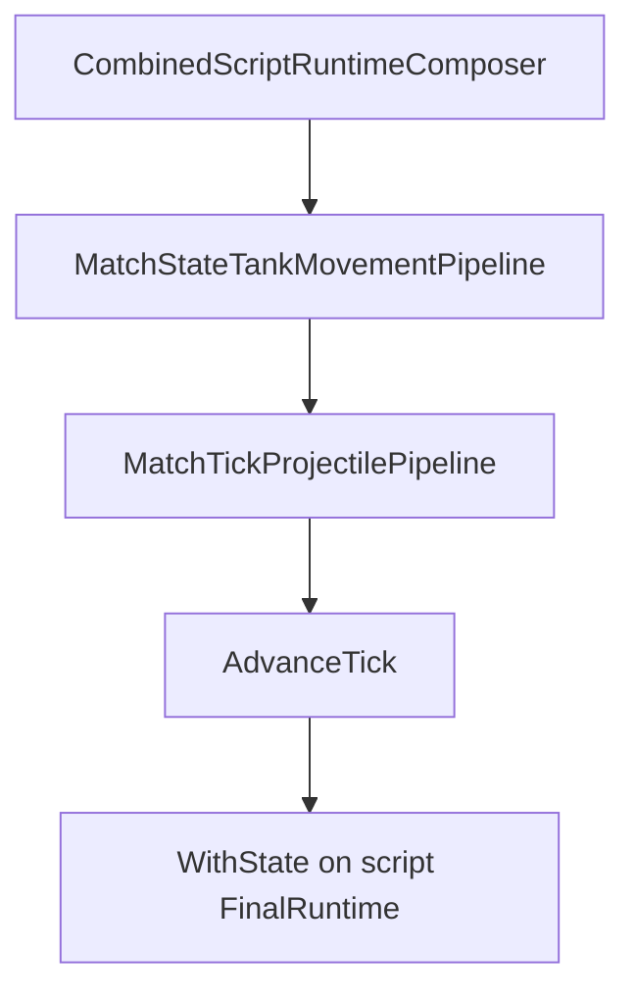

# Task 5.112 — Tank Movement Tick Integration Plan

> **Nur Dokumentation.** Keine Implementierung, keine Tests, keine Änderungen an `src/`, `tests/`, Projekten, Solution oder `game/`.
>
> In **5.112** ausdrücklich verboten (auch als Vorbereitung): keine Änderung an [`MatchTickPipeline`](../src/ScriptTanks.Core/Match/MatchTickPipeline.cs), keine Änderung an [`CombinedRuntimeTickPipeline`](../src/ScriptTanks.Core/Scripting/CombinedRuntimeTickPipeline.cs), keine `MovementIntegrator`-Integration im Code.
>
> Sprache: Erklärungen überwiegend auf Deutsch; Typnamen und API-Namen wie im Code auf Englisch.

## 1. Purpose

Nach [SCRIPT_RUNTIME_INTEGRATION_CHECKPOINT.md](SCRIPT_RUNTIME_INTEGRATION_CHECKPOINT.md) (5.111) ist der Script-Runtime-Pfad für Sensor, Fire, Movement-**Application** und Turret abgeschlossen. Movement-Scripts setzen [`MovementState.VelocityPerTick`](../src/ScriptTanks.Core/Movement/MovementState.cs); **Position** bleibt im Tick unverändert.

**Ziel von 5.112:** Festlegen, wie Tank-Bewegung in die **deterministische Tick-Phase** integriert wird — wo `VelocityPerTick` zu Positions-Updates wird, wie die Reihenfolge zu Projektilen/Treffern/Cleanup steht, und wie [`CombinedRuntimeTickPipeline`](../src/ScriptTanks.Core/Scripting/CombinedRuntimeTickPipeline.cs), Runner, Replay und Logging deterministisch bleiben.

**Kern-Trennung (gesperrt):**

| Phase | Verantwortung |
| ----- | ------------- |
| **Application** (heute) | [`ScriptMappedMovementRequestApplicationPipeline`](../src/ScriptTanks.Core/Scripting/ScriptMappedMovementRequestApplicationPipeline.cs) — setzt `VelocityPerTick` |
| **Integration** (geplant 5.114–5.115) | Neues `MatchStateTankMovementPipeline` — wendet [`MovementIntegrator`](../src/ScriptTanks.Core/Movement/MovementIntegrator.cs) auf `Position` an |

Dieses Dokument ändert **kein** Verhalten. Implementierung beginnt bei **5.113**.

**Test-Baseline (Repo):** 2840 Tests nach 5.111.

## 2. Current State After 5.111

### Script-Composer (unverändert seit 5.110)

```text
runtime₀
  → integration → mapping
  → sensor apply(runtime₀)
  → turret apply(runtime₀)
  → fire construct/apply(turret.FinalRuntime)
  → movement apply(fire.FinalRuntime)   // nur VelocityPerTick
  → final merge (movement state + sensor loadouts)
```

Quelle: [`CombinedScriptRuntimeComposer.Run`](../src/ScriptTanks.Core/Scripting/CombinedScriptRuntimeComposer.cs).

### Combined Tick (heute)

```text
CombinedScriptRuntimeComposer.Run(...)
  → scriptResult.FinalRuntime.State
  → MatchTickPipeline.Step(state)
       → MatchTickProjectilePipeline (step → hit → cleanup)
       → MatchStateTickAdvanceSystem.AdvanceTick
  → finalRuntime = scriptResult.FinalRuntime.WithState(steppedState)
```

Quelle: [`CombinedRuntimeTickPipeline.Step`](../src/ScriptTanks.Core/Scripting/CombinedRuntimeTickPipeline.cs), [`MatchTickPipeline.Step`](../src/ScriptTanks.Core/Match/MatchTickPipeline.cs).

**Fehlendes Verhalten:** Weder `MatchTickPipeline` noch `CombinedRuntimeTickPipeline` rufen [`MovementIntegrator`](../src/ScriptTanks.Core/Movement/MovementIntegrator.cs) auf. Regressionen in [`CombinedRuntimeTickPipelineTests`](../tests/ScriptTanks.Core.Tests/Scripting/CombinedRuntimeTickPipelineTests.cs) erwarten für Movement-Programme geänderte **Velocity**, aber **unveränderte Position**.

### Warum Tank-Movement-Tick als Nächstes

[SCRIPT_RUNTIME_INTEGRATION_CHECKPOINT.md](SCRIPT_RUNTIME_INTEGRATION_CHECKPOINT.md) §9 empfiehlt **Tank Movement Tick Integration** als Haupt-Track: `VelocityPerTick` ohne Positionsintegration ist die größte verbleibende Gameplay-Lücke nach Application aller Script-Domänen.

## 3. Existing Type Inventory

### Movement und Tank

| Typ | Datei | Rolle |
| --- | ----- | ----- |
| `MovementState` | [`MovementState.cs`](../src/ScriptTanks.Core/Movement/MovementState.cs) | `Position`, `VelocityPerTick` (tick-nativ, nicht pro Sekunde) |
| `MovementIntegrator` | [`MovementIntegrator.cs`](../src/ScriptTanks.Core/Movement/MovementIntegrator.cs) | `Step`: `Position + VelocityPerTick`; optional `tickCount` |
| `TankState.Movement` | [`TankState.cs`](../src/ScriptTanks.Core/Tanks/TankState.cs) | Kinematik pro Panzer |
| `TankState.IsDestroyed` | [`TankState.cs`](../src/ScriptTanks.Core/Tanks/TankState.cs) | Zerstörte Panzer — Policy für Integration §6 |

### Script Movement Application (5.102–5.106)

| Typ | Datei |
| --- | ----- |
| `ScriptMappedMovementRequestApplicationPipeline` | [`ScriptMappedMovementRequestApplicationPipeline.cs`](../src/ScriptTanks.Core/Scripting/ScriptMappedMovementRequestApplicationPipeline.cs) |
| `ScriptMappedMovementRequestApplicationResult` | [`ScriptMappedMovementRequestApplicationResult.cs`](../src/ScriptTanks.Core/Scripting/ScriptMappedMovementRequestApplicationResult.cs) |
| `ScriptMappedMovementRequestApplicationRecord` | [`ScriptMappedMovementRequestApplicationRecord.cs`](../src/ScriptTanks.Core/Scripting/ScriptMappedMovementRequestApplicationRecord.cs) |
| `ScriptMappedMovementRequestApplicationStatus` | [`ScriptMappedMovementRequestApplicationStatus.cs`](../src/ScriptTanks.Core/Scripting/ScriptMappedMovementRequestApplicationStatus.cs) |
| `ScriptMovementVelocityResolver` | [`ScriptMovementVelocityResolver.cs`](../src/ScriptTanks.Core/Scripting/ScriptMovementVelocityResolver.cs) |

Remarks: ruft **nicht** `MovementIntegrator` / `MatchTickPipeline`-Tank-Movement auf.

### Match Tick (Projektile)

| Typ | Datei | Rolle |
| --- | ----- | ----- |
| `MatchTickPipeline` | [`MatchTickPipeline.cs`](../src/ScriptTanks.Core/Match/MatchTickPipeline.cs) | Projektile → `AdvanceTick` |
| `MatchTickProjectilePipeline` | [`MatchTickProjectilePipeline.cs`](../src/ScriptTanks.Core/Match/MatchTickProjectilePipeline.cs) | Step → Hit → Cleanup |
| `MatchStateProjectileStepSystem` | [`MatchStateProjectileStepSystem.cs`](../src/ScriptTanks.Core/Match/MatchStateProjectileStepSystem.cs) | Projektil-Position |
| `MatchStateProjectileHitSystem` | [`MatchStateProjectileHitSystem.cs`](../src/ScriptTanks.Core/Match/MatchStateProjectileHitSystem.cs) | Treffer inkl. `SpawnTick`-Owner-Filter |
| `MatchStateTickAdvanceSystem` | [`MatchStateTickAdvanceSystem.cs`](../src/ScriptTanks.Core/Match/MatchStateTickAdvanceSystem.cs) | `CurrentTick += 1` |

### Combined Runtime

| Typ | Datei |
| --- | ----- |
| `CombinedScriptRuntimeComposer` / `CombinedScriptRuntimeComposerResult` | [`CombinedScriptRuntimeComposer.cs`](../src/ScriptTanks.Core/Scripting/CombinedScriptRuntimeComposer.cs), [`CombinedScriptRuntimeComposerResult.cs`](../src/ScriptTanks.Core/Scripting/CombinedScriptRuntimeComposerResult.cs) |
| `CombinedRuntimeTickPipeline` | [`CombinedRuntimeTickPipeline.cs`](../src/ScriptTanks.Core/Scripting/CombinedRuntimeTickPipeline.cs) |
| `CombinedRuntimeTickResult` | [`CombinedRuntimeTickResult.cs`](../src/ScriptTanks.Core/Scripting/CombinedRuntimeTickResult.cs) |
| `CombinedRuntimeRunner` | [`CombinedRuntimeRunner.cs`](../src/ScriptTanks.Core/Scripting/CombinedRuntimeRunner.cs) |
| `CombinedRuntimeReplayRecorder` | [`CombinedRuntimeReplayRecorder.cs`](../src/ScriptTanks.Core/Replay/CombinedRuntimeReplayRecorder.cs) |

### Arena (Referenz, nicht MVP-Integration)

| Typ | Datei |
| --- | ----- |
| `ArenaCatalog` / `ArenaDefinition` | [`ArenaCatalog.cs`](../src/ScriptTanks.Core/Arena/ArenaCatalog.cs) |

## 4. Current Tick Semantics

| Regel | Detail |
| ----- | ------ |
| **Script vor Tick** | Option A: [`CombinedRuntimeTickPipeline`](../src/ScriptTanks.Core/Scripting/CombinedRuntimeTickPipeline.cs) führt Composer zuerst aus |
| **Projektil-Pipeline** | Auf Snapshot mit **aktueller** `CurrentTick` — Step, dann Hit, dann Cleanup |
| **Tick-Advance** | Immer **nach** Projektil-Pipeline in [`MatchTickPipeline.Step`](../src/ScriptTanks.Core/Match/MatchTickPipeline.cs) |
| **SpawnTick** | Owner-Self-Hit nur wenn `projectile.SpawnTick == state.CurrentTick` — [PROJECTILE_SPAWN_TICK_INVENTORY.md](PROJECTILE_SPAWN_TICK_INVENTORY.md) |
| **Replay-Frames** | Nur [`MatchState`](../src/ScriptTanks.Core/Match/MatchState.cs) — [COMBINED_RUNTIME_LOGGING_CHECKPOINT.md](COMBINED_RUNTIME_LOGGING_CHECKPOINT.md) §5 |
| **Tank-Position** | Wird im Tick **nicht** integriert (Stand 5.111) |

Ereignisse in Logs/Replay bleiben dem **aktuellen** Tick zugeordnet, solange Advance am Ende des Tick-Schritts bleibt.

## 5. Tank Movement Ordering Options

### Reihenfolge innerhalb eines Ticks

| Option | Ablauf | Bewertung |
| ------ | ------ | --------- |
| **A (empfohlen)** | Scripts → **Tank-Movement** → Projektile/Hit/Cleanup → Advance | Treffer gegen **bewegte** Panzerpositionen; `VelocityPerTick` wirkt im selben Tick |
| **B** | Scripts → Projektile/Hit/Cleanup → **Tank-Movement** → Advance | Einfacher zu denken, aber Treffer gegen **alte** Panzerpositionen — weniger intuitiv |
| **C (Orchestrierung)** | Wo der Tank-Step eingehängt wird | Siehe §9 — MVP **nur** über `CombinedRuntimeTickPipeline`, **nicht** global in `MatchTickPipeline` |

### Option C — Blast Radius

| Variante | Beschreibung | MVP-Track |
| -------- | ------------ | --------- |
| **C1 — Combined explicit** | `CombinedRuntimeTickPipeline` ruft Tank-Pipeline + `MatchTickProjectilePipeline` + `AdvanceTick` selbst auf | **Gesperrt für 5.115** |
| **C2 — MatchTickPipeline global** | `MatchTickPipeline.Step` = Tanks → Projektile → Advance | **Nicht MVP** — ändert alle direkten `MatchTickPipeline`-Caller; separates Audit nötig |

Zwei Tick-Formen temporär akzeptabel, um Legacy-Pfade stabil zu halten.

## 6. Collision / Bounds Policy Options

| Option | MVP (5.113–5.115) | Später |
| ------ | ----------------- | ------ |
| **Keine Kollision / keine Bounds** | `Position += VelocityPerTick` pur über `MovementIntegrator` | — |
| **Arena-Clamping** | Nicht MVP | Erfordert Arena-Geometrie-Policy |
| **Wand-/Hindernis-Auflösung** | Nicht MVP | [`ArenaCatalog.ObstacleTestArena`](../src/ScriptTanks.Core/Arena/ArenaCatalog.cs) existiert, aber keine Tank-Wall-Integration |
| **Zerstörte Panzer** | **Empfehlung:** Integration **überspringen** (`IsDestroyed` → `Movement` unverändert) | Alternativ: Velocity auf Null setzen — explizit in 5.114 festlegen |
| **Beschleunigung / Steering** | Out of scope | Pathfinding, Patrol-Graphen |

## 7. Recommended MVP Policy

**Recommended MVP ordering:**

```text
scripts
  → tank movement step
  → projectile step / hit / cleanup
  → advance tick
```

| Policy | Entscheidung |
| ------ | ------------ |
| Reihenfolge | **Option A** (§5) |
| Application vs. Integration | Getrennt — Composer setzt Velocity; Tick-Pipeline integriert Position |
| Bounds / Kollision | **Keine** in 5.113–5.115 |
| Zerstörte Panzer | Integration überspringen (empfohlen) |
| Orchestrierung | **Nur** [`CombinedRuntimeTickPipeline`](../src/ScriptTanks.Core/Scripting/CombinedRuntimeTickPipeline.cs) in **5.115** — siehe §9 |
| `MatchTickPipeline` global | **Unverändert** im MVP-Track |

**Begründung (Kurz):** Movement-Befehle werden im selben Tick in `Position` sichtbar; Projektil-Treffer nutzen bewegte Panzer; Script-Intent liegt vor der Physik-Auflösung im Tick.

## 8. Proposed Tank Movement Pipeline

**Neuer Typ (geplant 5.114):** `MatchStateTankMovementPipeline` (Name gesperrt, sofern 5.113 nicht abweicht).

```text
MatchStateTankMovementPipeline.Step(MatchState state) → MatchState
```

| Regel | Detail |
| ----- | ------ |
| Pure | Kein IO, kein Random, immutable `MatchState` / `TankState` |
| Pro Tank | Index `0 .. Tanks.Length-1` in fester Reihenfolge |
| Integration | `tank.Movement = MovementIntegrator.Step(tank.Movement)` für lebende Panzer |
| Zerstört | `IsDestroyed` → Tank unverändert lassen |
| Velocity | **Nicht** zurücksetzen in MVP — `VelocityPerTick` bleibt für den nächsten Tick (wie heute nach Application) |

Kein Aufruf von Fire, Sensor, Scripting, Logging oder Godot.

## 9. CombinedRuntimeTickPipeline Integration

### Heute (5.112 — unverändert)

[`CombinedRuntimeTickPipeline.Step`](../src/ScriptTanks.Core/Scripting/CombinedRuntimeTickPipeline.cs) delegiert an [`MatchTickPipeline.Step`](../src/ScriptTanks.Core/Match/MatchTickPipeline.cs). **5.112 ändert diesen Code nicht.**

### Geplant (5.115 — gesperrte Empfehlung, kleiner Blast Radius)

**Nur** explizite Orchestrierung in `CombinedRuntimeTickPipeline` — **keine** globale Erweiterung von [`MatchTickPipeline.Step`](../src/ScriptTanks.Core/Match/MatchTickPipeline.cs).

```text
runtime₀
  → CombinedScriptRuntimeComposer.Run → scriptResult
  → scriptState = scriptResult.FinalRuntime.State
  → movedState = MatchStateTankMovementPipeline.Step(scriptState)
  → projectileState = MatchTickProjectilePipeline.StepProjectilesAndResolveHits(movedState)
  → advancedState = MatchStateTickAdvanceSystem.AdvanceTick(projectileState)
  → finalRuntime = scriptResult.FinalRuntime.WithState(advancedState)
```



| Komponente | In 5.115 |
| ---------- | -------- |
| `MatchStateTankMovementPipeline` | **Neu** (5.114) |
| `MatchTickProjectilePipeline` | Bestehend — direkt aufrufen statt vollem `MatchTickPipeline` |
| `MatchStateTickAdvanceSystem` | Bestehend — direkt aufrufen |
| `MatchTickPipeline.Step` | **Unverändert** für Legacy-Caller |

**Warum vorsichtig:** Runner, Replay und Logged-Pfade nutzen `CombinedRuntimeTickPipeline`. Direkte `MatchTickPipeline`-Tests und evtl. Legacy-Match-Pfade behalten die alte Semantik (nur Projektile), bis ein Audit/Migrations-Task `MatchTickPipeline` erweitert.

**Fußnote (keine Task-Nummer in 5.112):** Später optional „fold tank step into `MatchTickPipeline`“ — nur nach Caller-Inventar.

## 10. State Threading and Result Shape

### Runtime-Träger

| Feld | Quelle nach MVP |
| ---- | ---------------- |
| `FinalRuntime.State` | Post-Advance-`MatchState` (inkl. bewegter Panzer + Projektil-Tick) |
| `FinalRuntime.SensorLoadouts` | Weiter von `scriptResult.FinalRuntime` (Composer-Merge) |
| `FinalProjectileIdSequence` | Weiter von `scriptResult` |

### `CombinedRuntimeTickResult` (5.113)

| Feld | Semantik (Vorschlag) |
| ---- | -------------------- |
| `ScriptResult` | Unverändert — enthält `MovementApplicationResult` |
| `SteppedState` | **Post-Advance**-State (wie heute — Referenz = `FinalRuntime.State`) |
| Optional neu | `TankMovementResult` oder Zwischen-`MatchState` nur wenn Tests/Debug es brauchen — Entscheidung in **5.113** |

Validierung in [`CombinedRuntimeTickResult`](../src/ScriptTanks.Core/Scripting/CombinedRuntimeTickResult.cs): `FinalRuntime.State` == `SteppedState`; SensorLoadouts == Script-Final-Loadouts.

## 11. Test Strategy

Zielgruppe **5.113–5.117** (keine Tests in 5.112):

| Ebene | Fokus | Task |
| ----- | ----- | ---- |
| Unit | `MovementIntegrator` + `MatchStateTankMovementPipeline` — Position-Delta, `tickCount`, zerstörte Panzer | 5.114 |
| Combined tick | [`CombinedRuntimeTickPipelineTests`](../tests/ScriptTanks.Core.Tests/Scripting/CombinedRuntimeTickPipelineTests.cs): Retreat/Move — **Position** ändert sich nach einem `Step` | 5.115–5.116 |
| Runner / Replay | [`CombinedRuntimeRunnerTests`](../tests/ScriptTanks.Core.Tests/Scripting/CombinedRuntimeRunnerTests.cs), Replay-Frames — `MatchState` zeigt neue Position | 5.116 |
| Logged | MVP/Rich unverändert — **keine** neuen Movement-CombatLog-Events | 5.116 |
| Projectile / Hit | Treffer gegen bewegte Panzer; SpawnTick-Regression | 5.117 |

**5.112:** Keine Test-Datei-Änderungen.

## 12. Determinism and Purity

- Tank-Schritt: pure Funktion `MatchState → MatchState`.
- Tank-Reihenfolge: strikt aufsteigender Tank-Index.
- Nur `Fixed` / `FixedVec2` — keine Floats, kein `Atan2`, kein `System.Random`.
- Gleicher Input-State + gleiche Script-Programs → gleiche Positionen nach dem Tick.
- `MovementIntegrator` ist bereits tick-nativ (kein `SimConstants.FixedDeltaTime` in einem Tick-Step).

## 13. Runner / Replay / Logging Relationship

| Bereich | Policy |
| ------- | ------ |
| **Runner** | [`CombinedRuntimeRunner.RunUntilEnd`](../src/ScriptTanks.Core/Scripting/CombinedRuntimeRunner.cs) bleibt bei `CombinedRuntimeTickPipeline.Step` — Verhalten ändert sich **erst in 5.115** |
| **Replay** | Frames weiterhin nur `MatchState` — bewegte Panzer erscheinen automatisch in Frame-Deltas; **kein** Schema-Change |
| **Logged MVP** | `match_started` / `match_ended` unverändert |
| **Rich Logging** | Keine Movement-/Tank-Tick-Events in MVP-Track |
| **MatchTickPipeline direkt** | Tests/Caller ohne Combined-Pfad — **unveränderte** Semantik bis optionaler Migration |

## 14. Follow-up Tasks 5.113–5.117

| Task | Inhalt |
| ---- | ------ |
| **5.113** | Tank-Movement-Tick-Result / Record-Modelle (falls nötig); `CombinedRuntimeTickResult`-Erweiterung spezifizieren |
| **5.114** | [`MatchStateTankMovementPipeline`](../src/ScriptTanks.Core/Match/) — `MovementIntegrator` pro lebendem Tank |
| **5.115** | Integration **nur** in [`CombinedRuntimeTickPipeline.Step`](../src/ScriptTanks.Core/Scripting/CombinedRuntimeTickPipeline.cs) — explizit: Tank → `MatchTickProjectilePipeline` → `AdvanceTick` |
| **5.116** | Runner / Replay / Logged-Regression für bewegende Panzer |
| **5.117** | Projectile- / Tank-Kollisions-Regression nach bewegenden Panzern |

**Erster Implementierungs-Schritt nach 5.112:** **5.113 — Tank Movement Tick Result / Pipeline Models**.

**Explizit nicht in 5.113–5.115 MVP:**

- Globale Änderung an [`MatchTickPipeline.Step`](../src/ScriptTanks.Core/Match/MatchTickPipeline.cs)
- Script-Movement-Application-Semantik ändern
- CombatLog Movement-Events
- Godot

## 15. Out of Scope + Definition of Done

### Out of Scope (5.112 und dokumentierter MVP-Track)

- Jede Änderung an `src/`, `tests/`, `game/`, `.csproj` in **5.112**
- Änderung an [`MatchTickPipeline`](../src/ScriptTanks.Core/Match/MatchTickPipeline.cs) in **5.112**
- Änderung an [`CombinedRuntimeTickPipeline`](../src/ScriptTanks.Core/Scripting/CombinedRuntimeTickPipeline.cs) in **5.112**
- `MovementIntegrator`-Wiring in **5.112**
- Script-Movement-Application-Semantik (5.102–5.106 abgeschlossen)
- Beschleunigung, Pathfinding, Steering
- Arena-Kollisionsauflösung (außer explizit späterer Task)
- Godot-Integration
- Replay-Frame-Schema-Änderungen
- Neue `CombatLog`-Movement-Events
- Turret Turn-Rate
- Full-Angle-Aiming
- Muzzle-/Radius-Tuning — [MUZZLE_RADIUS_TUNING_CHECKPOINT.md](MUZZLE_RADIUS_TUNING_CHECKPOINT.md) deferred

### Verification (5.112)

```powershell
dotnet build ScriptTanks.sln -warnaserror
dotnet test ScriptTanks.sln
```

**Erwartung:** 0 Warnungen; **2840** Tests bestanden (unverändert).

### Definition of Done

- [x] [`docs/TANK_MOVEMENT_TICK_INTEGRATION_PLAN.md`](TANK_MOVEMENT_TICK_INTEGRATION_PLAN.md) existiert mit **§1–§15**
- [x] Application vs. Integration und fehlende Positionsintegration klar (§1–§2, §7–§8)
- [x] MVP-Reihenfolge **scripts → tanks → projectiles → advance** gesperrt (§7)
- [x] §9: **CombinedRuntimeTickPipeline-only** für 5.115; **keine** globale `MatchTickPipeline`-Änderung im MVP-Track
- [x] 5.112 docs-only: keine Pipeline-/Integrator-Code-Änderung
- [x] Follow-ups 5.113–5.117; erster Code-Task **5.113**
- [x] API-Inventar mit `../src/...`; Peer-Docs ohne `../`
- [x] `dotnet build` + Testlauf: **2840** unverändert
