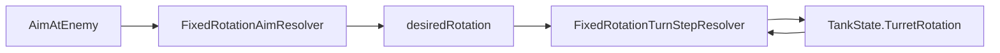

# Task 5.140 — Turret Turn-Rate / Gradual Rotation Plan

> **Nur Dokumentation.** Keine Implementierung, keine Tests, keine Änderungen an `src/`, `tests/`, Projekten, Solution oder `game/`.
>
> Sprache: Erklärungen überwiegend auf Deutsch; Typnamen und API-Namen wie im Code auf Englisch.

## 1. Purpose

Nach Task **5.139** ist der **Full-Angle Turret Aim**-Track (5.132–5.138) abgeschlossen und in [FULL_ANGLE_TURRET_AIM_INTEGRATION_CHECKPOINT.md](FULL_ANGLE_TURRET_AIM_INTEGRATION_CHECKPOINT.md) dokumentiert. Script-`AimAtEnemy` löst beliebige Feind-Richtungen deterministisch auf und setzt `TankState.TurretRotation` per **Snap** (sofort auf `desiredRotation`).

**Ziel von 5.140:** Architektur-Plan für **graduelle Turmdrehung** pro Tick unter Nutzung von [`BasicTankStats.TurretTurnRatePerTick`](../src/ScriptTanks.Core/Tanks/BasicTankStats.cs) — Audit des Ist-Zustands, Turn-Rate-Semantik, Fire-Policy, Integrationsoptionen, API-Skizzen, Script-/Composer-Policy, Replay-Policy, Test-Leiter und Follow-ups **5.141–5.147**. Dieses Dokument ändert **kein** Runtime-Verhalten.

**Test-Baseline (Repo nach 5.139):** **3108** Tests, **0** Warnungen.

### Querverweise

| Dokument | Rolle |
| -------- | ----- |
| [FULL_ANGLE_TURRET_AIM_INTEGRATION_CHECKPOINT.md](FULL_ANGLE_TURRET_AIM_INTEGRATION_CHECKPOINT.md) | Authoritative Full-Angle Snap-Aim nach 5.138; listet Turn-Rate als offene Lücke |
| [FULL_ANGLE_TURRET_AIM_RESOLVER_PLAN.md](FULL_ANGLE_TURRET_AIM_RESOLVER_PLAN.md) | Historischer Full-Angle-Plan (5.132) |
| [WALL_OBSTACLE_COLLISION_INTEGRATION_CHECKPOINT.md](WALL_OBSTACLE_COLLISION_INTEGRATION_CHECKPOINT.md) | Combined-Tick-Reihenfolge (unverändert durch Turn-Rate) |
| [SCRIPT_RUNTIME_INTEGRATION_CHECKPOINT.md](SCRIPT_RUNTIME_INTEGRATION_CHECKPOINT.md) | Script-Composer-Gesamtcheckpoint |

## 2. Current State After 5.139

### Authoritative Snap-Aim (heute)

```text
ScriptCommandType.AimAtEnemy
  → ScriptTranslatedCommandDomainMapper (Turret-Kategorie)
  → ScriptMappedTurretRequestApplicationPipeline.Apply
       TrySelectNearestAliveEnemy (Tank-Positionen)
       delta = target.Movement.Position - source.Movement.Position
       FixedRotationAimResolver.ResolveFromDirection(delta)
         → Zero: Unresolved → MissingAimSolution
         → Cardinal: exakte Anker
         → Non-cardinal: FixedRotationInverseLookup
       tank.WithTurretRotation(resolution.Rotation)   // SNAP — sofort desired
  → TankState.TurretRotation
```

Quelle: [`ScriptMappedTurretRequestApplicationPipeline.cs`](../src/ScriptTanks.Core/Scripting/ScriptMappedTurretRequestApplicationPipeline.cs) Zeile `WithTurretRotation(resolution.Rotation)`.

### Script-Composer-Reihenfolge (unverändert)

Quelle: [`CombinedScriptRuntimeComposer.cs`](../src/ScriptTanks.Core/Scripting/CombinedScriptRuntimeComposer.cs).

```text
integration → mapping
→ sensor apply(runtime₀)
→ turret apply(runtime₀)          ← AimAtEnemy (Snap heute)
→ fire construct(turret FinalRuntime)
→ fire apply(turret FinalRuntime)
→ movement apply(fire FinalRuntime)
→ final merge (movement state + sensor loadouts)
```

Fire construct/apply nutzen `turretApplicationResult.FinalRuntime` — Muzzle und Velocity sehen **bereits** die `TurretRotation` nach Turret-Apply im selben Tick.

### Combined tick (unverändert)

Quelle: [WALL_OBSTACLE_COLLISION_INTEGRATION_CHECKPOINT.md](WALL_OBSTACLE_COLLISION_INTEGRATION_CHECKPOINT.md) §3.

```text
CombinedScriptRuntimeComposer
→ MatchStateTankMovementPipeline
→ MatchStateTankBoundsPipeline
→ MatchStateTankObstacleCollisionPipeline
→ MatchTickProjectilePipeline.StepProjectilesAndResolveHits
→ MatchStateTickAdvanceSystem.AdvanceTick
```

**Graduelle Drehung gehört nicht in den Combined Tick.** Turn-Rate wird in der **Turret-Apply-Phase** des Composers modelliert (MVP Option A).

### Turn-Rate-Daten vs. Runtime

| Aspekt | Ist-Stand |
| ------ | --------- |
| Feld | `BasicTankStats.TurretTurnRatePerTick` (`Fixed`, ≥ 0) |
| Validierung | Konstruktor + [`BasicTankStatsTests`](../tests/ScriptTanks.Core.Tests/Tanks/BasicTankStatsTests.cs) (`Constructor_AcceptsZeroTurretTurnRatePerTick`) |
| Runtime-Consumer | **Keiner** — Snap ignoriert Turn-Rate |
| XML auf Stats | „upcoming rotation system“ — Einheit im Code noch nicht final dokumentiert; **dieser Plan** legt Turn-Fraction pro Tick fest |

## 3. Architecture Audit

*Nur reale Typen aus dem Repo.*

### Implementiert (relevant für Turn-Rate)

| Bereich | Typ / API | Pfad | Rolle heute |
| ------- | --------- | ---- | ----------- |
| Turm-Rotation | `TankState.TurretRotation` (`Fixed`) | [`TankState.cs`](../src/ScriptTanks.Core/Tanks/TankState.cs) | Turn-Fraction; `Fixed.One` = volle Umdrehung |
| Turn-Rate (Daten) | `BasicTankStats.TurretTurnRatePerTick` | [`BasicTankStats.cs`](../src/ScriptTanks.Core/Tanks/BasicTankStats.cs) | Katalogisiert, **nicht angewendet** |
| Katalog-Werte | `TankCatalog` | [`TankCatalog.cs`](../src/ScriptTanks.Core/Tanks/TankCatalog.cs) | Siehe Tabelle unten |
| Desired-Rotation | `FixedRotationAimResolver.ResolveFromDirection` | [`FixedRotationAimResolver.cs`](../src/ScriptTanks.Core/Math/FixedRotationAimResolver.cs) | Liefert Ziel-Rotation (Full-Angle) |
| Inverse Lookup | `FixedRotationInverseLookup` | [`FixedRotationInverseLookup.cs`](../src/ScriptTanks.Core/Math/FixedRotationInverseLookup.cs) | Non-cardinal desired |
| Forward | `FixedRotationDirectionResolver.ResolveForward` | [`FixedRotationDirectionResolver.cs`](../src/ScriptTanks.Core/Math/FixedRotationDirectionResolver.cs) | CCW-Konvention, 1000 Schritte |
| Turret-Apply | `ScriptMappedTurretRequestApplicationPipeline.Apply` | [`ScriptMappedTurretRequestApplicationPipeline.cs`](../src/ScriptTanks.Core/Scripting/ScriptMappedTurretRequestApplicationPipeline.cs) | Snap `TurretRotation` |
| Apply-Record | `AppliedTurretRotation` | [`ScriptMappedTurretRequestApplicationRecord.cs`](../src/ScriptTanks.Core/Scripting/ScriptMappedTurretRequestApplicationRecord.cs) | Gesetzte Rotation nach Apply |
| Composer | `CombinedScriptRuntimeComposer` | [`CombinedScriptRuntimeComposer.cs`](../src/ScriptTanks.Core/Scripting/CombinedScriptRuntimeComposer.cs) | Turret vor Fire |
| Fire-Geometrie | `FireMuzzlePositionResolver`, `FireVelocityResolver` | [`FireMuzzlePositionResolver.cs`](../src/ScriptTanks.Core/Combat/FireMuzzlePositionResolver.cs), [`FireVelocityResolver.cs`](../src/ScriptTanks.Core/Combat/FireVelocityResolver.cs) | Lesen `TurretRotation` über Forward |

### `TankCatalog` — `TurretTurnRatePerTick` (Ist-Stand)

| Tank | `TurretTurnRatePerTick` | Bedeutung (Turn-Fraction / Tick) |
| ---- | ----------------------- | -------------------------------- |
| `basic_tank` | `Fixed.FromRatio(1, 10)` | 10 % volle Umdrehung pro Tick |
| `light_tank` | `Fixed.FromRatio(12, 100)` | 12 % pro Tick |
| `heavy_tank` | `Fixed.FromRatio(7, 100)` | 7 % pro Tick |
| Statischer Turm (Tests) | `Fixed.Zero` | Erlaubt — siehe `BasicTankStatsTests` |

### Nicht implementiert (explizit)

| Feature | Status |
| ------- | ------ |
| `DesiredTurretRotation` auf `TankState` | **Fehlt** |
| Alignment-Status / „fast aligned“ | **Fehlt** |
| `FixedRotationTurnStepResolver` (o. ä.) | **Fehlt** — geplant 5.142 |
| Shortest-path / Wrap-Hilfe für Drehschritt | **Fehlt** — in 5.142 zu definieren |
| Turn-Rate in Pipeline | **Fehlt** — geplant 5.143 |
| Neue `CombatLogEventTypes` für Drehung | **Fehlt** — nicht MVP |

### Veraltete Dokumentation (nicht editieren in 5.140)

[`ScriptMappedTurretRequestApplicationPipeline`](../src/ScriptTanks.Core/Scripting/ScriptMappedTurretRequestApplicationPipeline.cs) XML erwähnt noch „Cardinal MVP“ und „diagonal → MissingAimSolution“. **Tatsächliches Verhalten** seit 5.135+: Full-Angle `Applied`. Turn-Rate-Plan referenziert den **Code**, nicht das veraltete XML.

## 4. Problem Statement

Full-Angle-Aim berechnet korrekt `desiredRotation`, wendet sie aber **sofort** an:

```text
currentRotation ──(ein Tick, ein AimAtEnemy)──► desiredRotation   (Snap)
```

Das widerspricht dem Datenmodell: Archetypen haben unterschiedliche `TurretTurnRatePerTick`, die Spieler erwarten als **Drehgeschwindigkeit**, nicht als Deko-Feld.

| Frage | Antwort (Planungsstand) |
| ----- | ------------------------ |
| Was soll sich ändern? | Pro `AimAtEnemy`-Apply höchstens `turnRate` Rotation in Richtung `desiredRotation` (CCW-Policy, §7) |
| Wo speichern wir `desired`? | **MVP:** nicht persistent — jedes Mal aus `delta` neu berechnet (Option A, §9) |
| Fire während Drehung? | **MVP Option A:** Fire nutzt **aktuelle** `TurretRotation` (§8) |
| Ziel verloren / zerstört? | Bestehendes `NoTarget` / kein Apply — unverändert |
| Target bewegt sich? | Nächstes `AimAtEnemy` liefert neues `desired` aus neuer `delta` |
| Replay? | `MatchState.TurretRotation` pro Frame — gradual sichtbar ohne neues Schema |
| Determinismus? | Kein `float`/`double`/Runtime-Trig im Turn-Step-Kern |
| Was blockiert Feel? | Snap + ungenutzte Turn-Rate |

## 5. Scope and Non-Scope

### In scope (5.140 Plan)

- Graduelle Turmdrehung: Semantik, Einheit, Clamp-Policy
- Integration in bestehende Turret-Pipeline (Optionen + MVP)
- Fire-while-turning Policies
- API-Skizzen (`FixedRotationTurnStepResolver`)
- Script-/Composer-/Replay-Policy
- Test-Leiter und Task-Roadmap **5.141–5.147**
- Abgrenzung zu Full-Angle-Checkpoint (Snap bleibt historisch; Turn-Rate ersetzt Snap-Verhalten ab 5.143)

### Out of scope

| Thema | Grund |
| ----- | ----- |
| Production-Code, neue Tests in 5.140 | Explizit ausgeschlossen |
| `CombinedRuntimeTickPipeline`-Reihenfolge | Turn-Rate bleibt in Composer-Turret-Phase |
| `DesiredTurretRotation` persistent auf `TankState` | MVP Nein — Follow-up möglich |
| Sensor-gestützte Zielauswahl | Eigener Track (5.140A im Checkpoint) |
| Wall LOS / Obstruction beim Zielen | Eigener Track |
| Godot / UI / Aim-Debug | Später |
| Spread / accuracy / leading | Nicht im Turn-Rate-Track |
| Body-Turn (`BodyTurnRatePerTick`) | Separates Feature — nicht Teil dieses Plans |
| Networking | Nicht im Scope |
| `float`-Trig im Core | Verboten |
| Edit an bestehenden Checkpoints/Plänen | Nur **neue** Datei 5.140 |

## 6. Terminology and Coordinate Rules

| Begriff | Bedeutung |
| ------- | --------- |
| `currentRotation` | `TankState.TurretRotation` **vor** diesem Turret-Apply |
| `desiredRotation` | Ergebnis von `FixedRotationAimResolver.ResolveFromDirection(delta)` wenn `IsResolved` |
| `turnRate` | `BasicTankStats.TurretTurnRatePerTick` des schießenden Tanks (aus Definition/Spawn-Kontext — in Pipeline aus Tank-Stats zu laden) |
| `turnStep` | Effektive Drehänderung dieses Ticks: `min(|deltaAngle|, turnRate)` in Turn-Fraction-Raum |
| `aligned` | `currentRotation == desiredRotation` nach Normalisierung (MVP exakt, kein Epsilon) |
| `forward` | `FixedRotationDirectionResolver.ResolveForward(rotation)` |
| `delta` | `targetPosition - sourcePosition` |

### Koordinaten (unverändert gegenüber Full-Angle)

Quelle: [`FixedRotationDirectionResolver`](../src/ScriptTanks.Core/Math/FixedRotationDirectionResolver.cs).

| Regel | Wert |
| ----- | ---- |
| +X | Ost |
| +Y | Nord |
| Volle Umdrehung | `Fixed.One` (`Fixed.Scale` = 1000 Raw-Einheiten) |
| Drehrichtung | **Gegen den Uhrzeigersinn** ab +X |
| Lookup-Schritte | `FixedRotationDirectionLookup.StepCount` = **1000** |

### Turn-Rate-Einheit (Planungsentscheidung 5.140)

**`TurretTurnRatePerTick` = maximale Turn-Fraction pro Tick**, konsistent mit `Fixed.One` = eine volle Umdrehung.

- Beispiel: `Fixed.FromRatio(1, 10)` → höchstens 0,1 Umdrehung (36°) pro Tick, nicht Grad/Rad.
- `Fixed.Zero` → statischer Turm (kein Rotationsschritt).

## 7. Turn-Rate Semantics

### Snap vs. Turn-Limited (heute vs. Ziel)

| Option | Bedeutung | Heute (5.139) | Ziel nach 5.143 |
| ------ | --------- | ------------- | ---------------- |
| **Snap** | Sofort `desiredRotation` | **Ja** | **Nein** (ersetzt durch clamp) |
| **Turn-limited** | Schrittweise Annäherung | **Nein** | **Ja** (MVP) |
| **Hybrid** | Snap + später Turn | — | **Nein** — direkt Turn-limited |

### Integrations-Optionen für den Drehschritt

| Option | Beschreibung | MVP |
| ------ | ------------ | --- |
| **A — Stateless clamp in Apply** | Pro `AimAtEnemy`: `desired` aus Resolver; `newRotation = TurnStep(current, desired, turnRate)`; sofort `WithTurretRotation(newRotation)` | **Empfohlen** |
| **B — Persistent desired auf State** | `DesiredTurretRotation` überlebt Ticks ohne erneutes Aim | Nein (Follow-up) |
| **C — Separate Combined-Tick-Phase** | Rotation nach Composer | Nein — bricht Script-Reihenfolge |

**MVP: Option A** — kleinster Diff; `AimAtEnemy` jeden Tick erneut ausführen, um weiterzudrehen (§12).

### Clamp-Policy (bindend für 5.142/5.143)

1. Wenn `currentRotation` und `desiredRotation` normalisiert gleich → **kein Schritt** (bereits aligned); Status weiterhin `Applied` mit unveränderter Rotation (oder explizit gleiche Rotation — Implementierung in 5.143 festlegen).
2. Sonst: kürzester Weg in Turn-Fraction-Raum mit **CCW-Präferenz** bei 180°-Ambiguität (gleiche Konvention wie Forward-Resolver).
3. Schrittgröße: höchstens `turnRate`; nie über `desired` hinaus (kein Overshoot).
4. Ergebnis normalisieren wie Forward-Pfad (`raw % Fixed.Scale`).

### 180°-Tie-break

Wenn `current` und `desired` genau gegenüberliegen (halbe Umdrehung): **counter-clockwise** drehen (positive Änderung in Turn-Fraction-Raum). Passt zu [`FixedRotationDirectionResolver`](../src/ScriptTanks.Core/Math/FixedRotationDirectionResolver.cs) CCW-Konvention.

### `turnRate == 0` (präzise Semantik)

| Regel | Semantik |
| ----- | -------- |
| Rotationsschritt | **Keiner** — `finalRotation` bleibt `currentRotation` |
| Wiederholtes `AimAtEnemy` | **Bewegt den Turm nicht**, außer er ist **bereits aligned** (`current == desired`) oder sich **Stats/Konfiguration** später ändern |
| Weit entferntes Ziel | Turm bleibt auf alter Rotation — **kein** schrittweises Annähern durch wiederholtes Zielen allein |
| Statischer Turm | Validiert durch `Constructor_AcceptsZeroTurretTurnRatePerTick` |

**Nicht behaupten:** „erneutes Zielen hilft irgendwann“ bei `turnRate == 0` — es hilft nur, wenn das Ziel zufällig schon aligned ist oder sich Turn-Rate/Stats ändern.



## 8. Fire While Turning

| Policy | Verhalten | Pros | Cons | MVP |
| ------ | --------- | ---- | ---- | --- |
| **A — Fire uses current rotation** | `Fire` im selben Tick nutzt `TurretRotation` **nach** Turret-Apply (teilweise gedreht) | Einfach; Composer unverändert; taktisch (vorzeitiges Feuer) | Schuss nicht zwingend auf Zielachse | **Ja** |
| **B — Fire gated on alignment** | `Fire` nur wenn `current == desired` | Realistischer | Bricht bestehende Scripts; neuer Status | Nein |
| **C — Fire uses desired rotation** | Konstruktion ignoriert Zwischenrotation | Scheinbar präziser | Inkonsistent mit sichtbarem Turm/Replay | Nein |
| **D — Split tick (aim then fire next tick)** | Erzwingt Warten | Deterministisch langsam | Script-API-Änderung | Nein |

**MVP: Option A** — [`CombinedScriptRuntimeComposer`](../src/ScriptTanks.Core/Scripting/CombinedScriptRuntimeComposer.cs) bleibt: Turret → Fire construct → Fire apply. Nach gradual Turn kann ein Script `AimAtEnemy` + `Fire` im **selben** Tick abgeben; Projektil folgt **aktueller** Forward-Richtung, nicht dem noch nicht erreichten Ziel.

### Erwartetes Spielgefühl (Beispiel)

- `BasicTank` (`turnRate = 1/10`): große Winkeldifferenz → mehrere Ticks `AimAtEnemy` nötig; ein Tick `Fire` schießt in Zwischenrichtung.
- Regression in **5.146** dokumentiert dies explizit gegenüber Snap-Baseline.

## 9. Implementation Options

### Option A — Clamp in `ScriptMappedTurretRequestApplicationPipeline` (empfohlen)

```text
resolution = FixedRotationAimResolver.ResolveFromDirection(delta)
turnRate = tankStats.TurretTurnRatePerTick   // aus Tank-Definition / Spawn-Kontext
step = FixedRotationTurnStepResolver.ResolveStep(current, resolution.Rotation, turnRate)
tank.WithTurretRotation(step.FinalRotation)
```

| Pro | Contra |
| --- | ------ |
| Eine Integrationsstelle | Pipeline muss Stats kennen (heute nur Positionen) |
| Composer/Fire unverändert | Stats-Lookup-Design in 5.143 |
| Deterministisch, testbar | — |

### Option B — Persistent `DesiredTurretRotation` on `TankState`

| Pro | Contra |
| --- | ------ |
| Turm dreht weiter ohne erneutes Aim | `TankState`-Migration, Replay-Kompatibilität |
| | Zielwechsel-/Verlust-Semantik komplex |

**Verwerfen für MVP.**

### Option C — Rotation subsystem in `CombinedRuntimeTickPipeline`

| Pro | Contra |
| --- | ------ |
| Zentrale Phase | Aim/Fire im selben Composer-Tick verlieren Kopplung |
| | Reihenfolge-Konflikt mit Wall-Checkpoint |

**Verwerfen.**

### Option D — Godot-only interpolation

| Pro | Contra |
| --- | ------ |
| Schnelles UI-Feedback | **Nicht** replay-deterministisch |
| | Core/Replay divergieren |

**Verwerfen.**

## 10. Recommended MVP

Gesperrte Entscheidungen für Implementierung **5.142–5.143**:

| Entscheidung | Wahl |
| ------------ | ---- |
| Integration | **Option A** — clamp in [`ScriptMappedTurretRequestApplicationPipeline`](../src/ScriptTanks.Core/Scripting/ScriptMappedTurretRequestApplicationPipeline.cs) |
| Persistent `DesiredTurretRotation` | **Nein** in MVP |
| Fire | **Option A** — current rotation, kein Align-Gate |
| 180° tie | **Counter-clockwise** |
| Alignment | **Exact match** `finalRotation == desiredRotation` nach Normalisierung |
| `turnRate == 0` | Kein Rotationsschritt. Turm bleibt bei `currentRotation`. Wiederholtes `AimAtEnemy` dreht nicht weiter, außer bereits aligned oder spätere Stats/Konfig-Änderung |
| `TankState`-Erweiterung | **Keine** in MVP |
| Combined-Tick-Phase | **Keine** neue Phase |
| `FixedRotationAimResolution` API | **Unverändert** — nur Apply-Verhalten ändert sich |
| Kardinal-Anker | Unverändert — Resolver liefert dieselben `desired`-Werte |

### Stats-Zugriff (offen für 5.143)

Pipeline hat heute `TankState` ohne eingebettete `BasicTankStats`. Implementierung muss definieren, wie `turnRate` pro TankIndex geladen wird (z. B. über Match-Setup, `TankDefinition` am Spawn, oder ergänzende Match-Metadaten). **5.140** fordert nur: Turn-Rate kommt aus demselben Katalog-Wert wie [`TankCatalog`](../src/ScriptTanks.Core/Tanks/TankCatalog.cs), nicht hardcoded.

## 11. API Sketches

**Nicht implementieren in 5.140.**

### `FixedRotationTurnStepResolver` (neu, 5.142)

```csharp
public readonly struct FixedRotationTurnStepResult
{
    public Fixed FinalRotation { get; }
    public bool IsAligned { get; }          // FinalRotation == desired (normalized)
    public Fixed AppliedTurnMagnitude { get; }  // optional telemetry / tests
}

public static class FixedRotationTurnStepResolver
{
    public static FixedRotationTurnStepResult ResolveStep(
        Fixed currentRotation,
        Fixed desiredRotation,
        Fixed maxTurnPerTick);
}
```

| Regel | Semantik |
| ----- | -------- |
| `maxTurnPerTick < 0` | ArgumentException (oder Fixed-Guard) |
| `maxTurnPerTick == 0` | `FinalRotation = currentRotation`; `IsAligned` nur wenn schon gleich |
| Normalisierung | Wie `FixedRotationDirectionResolver` (`NormalizeRaw`) |
| Shortest path + CCW tie | §7 |

### Record-Erweiterung (optional, deferred)

[`ScriptMappedTurretRequestApplicationRecord`](../src/ScriptTanks.Core/Scripting/ScriptMappedTurretRequestApplicationRecord.cs) könnte später `DesiredRotation` / `WasAligned` tragen — **nicht** MVP. `AppliedTurretRotation` bleibt authoritative für gesetzte Rotation.

## 12. Script / Composer Policy

| Regel | Detail |
| ----- | ------ |
| Pipeline first | Turn-Rate nur in Turret-Apply, nicht in Aim-Resolver |
| `AimAtEnemy` pro Tick | Script soll `AimAtEnemy` wiederholen, um weiterzudrehen (kein persistent desired in MVP) |
| Zielauswahl | Unverändert: nächster lebender Feind, Distanz², `TankIndex`-Tie-break |
| `NoTarget` / `MissingAimSolution` | Unverändert |
| Composer-Reihenfolge | **Unverändert** — sensor → turret → fire → movement |
| Fire | Separates Kommando; kein Auto-Aim in Fire-Construct |
| Sensor / LOS | Nicht in Turn-Rate-Track |

### Multi-Tick-Aim (Skizze)

```text
Tick 1: AimAtEnemy → dreht um turnRate Richtung desired
Tick 2: AimAtEnemy → desired neu berechnet (bewegtes Ziel) → weiterer Schritt
Tick N: current == desired → aligned; Fire optional mit Option A
```

## 13. Replay and Logging Policy

| Thema | Policy |
| ----- | ------ |
| Replay-Frames | Weiterhin nur [`MatchState`](../src/ScriptTanks.Core/Match/MatchState.cs) |
| Sichtbarkeit | `Tanks[].TurretRotation` ändert sich **graduell** über Frames nach 5.143 |
| `CombatLogEventTypes` | **Keine** neuen Event-Typen in erster Implementierung |
| Rich Combined-Logs | Unverändert — [COMBINED_RUNTIME_LOGGING_CHECKPOINT.md](COMBINED_RUNTIME_LOGGING_CHECKPOINT.md) |
| Resolver-Internals | Nicht geloggt |
| Determinismus Replay | Gespeicherte `TurretRotation` pro Frame ist authoritative |

## 14. Future Test Strategy

**Keine Tests in 5.140.** Leiter für Follow-ups:

### Stufe 1 — Math (5.142)

| Test | Fokus |
| ---- | ----- |
| `FixedRotationTurnStepResolverTests` (neu) | Zero rate, aligned, partial step, overshoot forbidden |
| 180° tie | CCW-Schritt |
| Normalisierung | Negative Raw, Wrap |
| Kardinal desired | Schritt von Anker zu Anker |
| Determinismus | Wiederholaufrufe identisch |

### Stufe 2 — Pipeline (5.143)

| Test | Fokus |
| ---- | ----- |
| [`ScriptMappedTurretRequestApplicationPipelineTests`](../tests/ScriptTanks.Core.Tests/Scripting/ScriptMappedTurretRequestApplicationPipelineTests.cs) | Ein Tick: nicht sofort `desired`; mehrere Applies: Annäherung |
| `turnRate == 0` | Rotation unverändert trotz wiederholten Aim |
| Stats aus Katalog | Basic vs Heavy unterschiedliche Schrittweite |

### Stufe 3 — Composer (5.144)

| Test | Fokus |
| ---- | ----- |
| [`CombinedScriptRuntimeComposerTests`](../tests/ScriptTanks.Core.Tests/Scripting/CombinedScriptRuntimeComposerTests.cs) | Aim-before-fire mit Zwischenrotation |
| Multi-command same tick | Fire sieht post-turret rotation |

### Stufe 4 — Runner / Replay (5.145)

Multi-Tick-Match: Frame-Sequenz `TurretRotation` monoton annähernd (nicht Sprung auf `desired` außer aligned).

### Stufe 5 — Fire while turning (5.146)

Diagonal-Ziel: `AimAtEnemy` + `Fire` ein Tick — Projektil-Richtung ≠ `desired`-Forward, == `current`-Forward nach Apply.

### Stufe 6 — Checkpoint (5.147)

`TURRET_TURN_RATE_INTEGRATION_CHECKPOINT.md` — authoritative nach Implementierung.

## 15. Recommended Follow-up Tasks

**Keine** Implementierung ohne diese Reihenfolge. **Kein** Godot/UI vor verifiziertem Core.

### Implementation note

| Phase | Task | Inhalt |
| ----- | ---- | ------ |
| Plan only | **5.140** | Dieses Dokument — **kein** Runtime-Verhalten |
| Optional docs | **5.141** | Fokussierter API/Model-Plan für `FixedRotationTurnStepResolver` — **überspringbar**, wenn §11 ausreicht |
| Erste Production-Code | **5.142** | `FixedRotationTurnStepResolver` + Unit-Tests (**Math**, kein Pipeline-Verhalten) |
| Erstes gameplay-sichtbares Verhalten | **5.143** | [`ScriptMappedTurretRequestApplicationPipeline`](../src/ScriptTanks.Core/Scripting/ScriptMappedTurretRequestApplicationPipeline.cs) gradual rotation — **nicht vor** 5.142 |
| Regressionen | **5.144–5.146** | Composer, Runner/Replay, Fire-while-turning |
| Checkpoint | **5.147** | `TURRET_TURN_RATE_INTEGRATION_CHECKPOINT.md` (docs) |

```text
5.141 (optional docs) → 5.142 math impl → 5.143 pipeline behavior → 5.144+ regressions → 5.147 checkpoint
```

| Task | Scope |
| ---- | ----- |
| **5.141** | Optional: dedizierter Turn-Step-API-Plan — skip if 5.140 §11 reicht |
| **5.142** | `FixedRotationTurnStepResolver` implementation + unit tests |
| **5.143** | `ScriptMappedTurretRequestApplicationPipeline` gradual rotation (**first gameplay-visible change**) |
| **5.144** | Composer aim-before-fire gradual regression |
| **5.145** | Multi-tick runner/replay gradual `TurretRotation` frames |
| **5.146** | Fire-while-turning regression (current rotation policy) |
| **5.147** | Integration checkpoint (docs) |

### Parallel-Tracks (nicht 5.140)

| ID | Inhalt |
| -- | ------ |
| **5.140A** | Sensor-based aim target selection — [FULL_ANGLE_TURRET_AIM_INTEGRATION_CHECKPOINT.md](FULL_ANGLE_TURRET_AIM_INTEGRATION_CHECKPOINT.md) §13 |
| **5.140B** | Aim LOS / wall obstruction |
| **5.140C** | Godot aim visualization |

## 16. Verification / Definition of Done

### Nach dem Schreiben dieses Dokuments (docs-only), vom **Repository-Root**:

```powershell
dotnet build ScriptTanks.sln -warnaserror
dotnet test ScriptTanks.sln
```

**Erwartung:**

- 0 Warnungen
- **3108** Tests bestanden (unverändert gegenüber 5.139)

### Definition of Done

- [x] [`docs/TURRET_TURN_RATE_GRADUAL_ROTATION_PLAN.md`](TURRET_TURN_RATE_GRADUAL_ROTATION_PLAN.md) existiert mit Abschnitten **1–16**.
- [x] Post-5.139 Snap-Aim und Composer/Combined-Tick dokumentiert (§2).
- [x] Architektur auditiert — `TurretTurnRatePerTick`, Katalog-Werte, fehlende Typen (§3).
- [x] Problem, Scope, Terminologie, Turn-Rate-Semantik inkl. `turnRate == 0` und 180° CCW (§4–§7).
- [x] Fire-while-turning Policies A–D; MVP Option A (§8).
- [x] Implementierungsoptionen; MVP Option A locked (§9–§10).
- [x] API-Skizzen `FixedRotationTurnStepResolver` (§11).
- [x] Script-/Composer-/Replay-Policy (§12–§13).
- [x] Test-Leiter 5.141–5.147 und Implementation note (§14–§15).
- [x] Deliverable enthält **keine** `C:/`, `C:\`, oder anderen lokalen Host-Pfade in Links (DoD-Erwähnung von Host-Pfaden nur in dieser Checkliste erlaubt).
- [x] Keine Änderungen an `src/`, `tests/`, `game/`, `.csproj`, `.sln`, bestehenden Plan-/Checkpoint-Dateien.
- [x] `dotnet build ScriptTanks.sln -warnaserror` grün (nach Verifikationslauf).
- [x] `dotnet test ScriptTanks.sln` bleibt bei **3108** Tests (nach Verifikationslauf).

## Links

### Sibling documentation (`docs/`)

| Dokument | Beschreibung |
| -------- | ------------ |
| [FULL_ANGLE_TURRET_AIM_INTEGRATION_CHECKPOINT.md](FULL_ANGLE_TURRET_AIM_INTEGRATION_CHECKPOINT.md) | Snap-Aim authoritative nach 5.139 |
| [FULL_ANGLE_TURRET_AIM_RESOLVER_PLAN.md](FULL_ANGLE_TURRET_AIM_RESOLVER_PLAN.md) | Full-Angle-Plan 5.132 |
| [WALL_OBSTACLE_COLLISION_INTEGRATION_CHECKPOINT.md](WALL_OBSTACLE_COLLISION_INTEGRATION_CHECKPOINT.md) | Combined tick order |
| [SCRIPT_RUNTIME_INTEGRATION_CHECKPOINT.md](SCRIPT_RUNTIME_INTEGRATION_CHECKPOINT.md) | Script runtime checkpoint |
| [COMBINED_RUNTIME_LOGGING_CHECKPOINT.md](COMBINED_RUNTIME_LOGGING_CHECKPOINT.md) | Logging policy |

### Production code (`../src/`)

| Bereich | Pfad |
| ------- | ---- |
| Turn-rate stats | [`Tanks/BasicTankStats.cs`](../src/ScriptTanks.Core/Tanks/BasicTankStats.cs) |
| Tank catalog | [`Tanks/TankCatalog.cs`](../src/ScriptTanks.Core/Tanks/TankCatalog.cs) |
| Aim resolver | [`Math/FixedRotationAimResolver.cs`](../src/ScriptTanks.Core/Math/FixedRotationAimResolver.cs) |
| Forward / CCW | [`Math/FixedRotationDirectionResolver.cs`](../src/ScriptTanks.Core/Math/FixedRotationDirectionResolver.cs) |
| Turret apply | [`Scripting/ScriptMappedTurretRequestApplicationPipeline.cs`](../src/ScriptTanks.Core/Scripting/ScriptMappedTurretRequestApplicationPipeline.cs) |
| Composer | [`Scripting/CombinedScriptRuntimeComposer.cs`](../src/ScriptTanks.Core/Scripting/CombinedScriptRuntimeComposer.cs) |
| Fire | [`Combat/FireMuzzlePositionResolver.cs`](../src/ScriptTanks.Core/Combat/FireMuzzlePositionResolver.cs), [`Combat/FireVelocityResolver.cs`](../src/ScriptTanks.Core/Combat/FireVelocityResolver.cs) |

### Tests (`../tests/`) — Referenz für Follow-ups

| Bereich | Pfad |
| ------- | ---- |
| Stats | [`Tanks/BasicTankStatsTests.cs`](../tests/ScriptTanks.Core.Tests/Tanks/BasicTankStatsTests.cs) |
| Catalog | [`Tanks/TankCatalogTests.cs`](../tests/ScriptTanks.Core.Tests/Tanks/TankCatalogTests.cs) |
| Turret pipeline | [`Scripting/ScriptMappedTurretRequestApplicationPipelineTests.cs`](../tests/ScriptTanks.Core.Tests/Scripting/ScriptMappedTurretRequestApplicationPipelineTests.cs) |
| Composer | [`Scripting/CombinedScriptRuntimeComposerTests.cs`](../tests/ScriptTanks.Core.Tests/Scripting/CombinedScriptRuntimeComposerTests.cs) |
