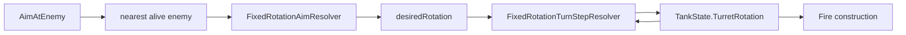

# Task 5.147 — Turret Turn-Rate Integration Checkpoint

> **Nur Dokumentation.** Keine Implementierung, keine Tests, keine Änderungen an `src/`, `tests/`, Projekten, Solution oder `game/`.
>
> Sprache: Erklärungen überwiegend auf Deutsch; Typnamen und API-Namen wie im Code auf Englisch.

## 1. Purpose

Der **Turn-Rate-Track 5.140–5.146** ist abgeschlossen. Im **Turn-Rate-Kontext** wurde das frühere Snap-Verhalten von `AimAtEnemy` (sofortiges Setzen von `TankState.TurretRotation` auf `desiredRotation`) durch einen **turn-rate-limitierten Schritt** in [`ScriptMappedTurretRequestApplicationPipeline`](../src/ScriptTanks.Core/Scripting/ScriptMappedTurretRequestApplicationPipeline.cs) ersetzt (Task **5.143**).

**Full-Angle Aim** (`FixedRotationAimResolver`, Non-Cardinal über `FixedRotationInverseLookup`) bleibt unverändert; geändert ist nur die **Anwendung** auf `TankState.TurretRotation`: pro Tick maximal ein Schritt toward `desiredRotation` via [`FixedRotationTurnStepResolver`](../src/ScriptTanks.Core/Math/FixedRotationTurnStepResolver.cs).

**Fire-while-turning (5.146):** [`ScriptMappedFireRequestConstructionPipeline`](../src/ScriptTanks.Core/Scripting/ScriptMappedFireRequestConstructionPipeline.cs) nutzt die **aktuelle** `TurretRotation` aus dem Runtime-Snapshot — nicht `desiredRotation`, nicht Turn-Rate, keine Alignment-Prüfung.

Dieses Dokument ist die **authoritative Checkpoint-Referenz** für gradual turret rotation nach 5.146. Es ändert **kein** Runtime-Verhalten.

**Test-Baseline (nach 5.146):** **3148** Tests, **0** Warnungen.

### Supersedes snap-aim narrative (Turn-Rate-Kontext)

[`FULL_ANGLE_TURRET_AIM_INTEGRATION_CHECKPOINT.md`](FULL_ANGLE_TURRET_AIM_INTEGRATION_CHECKPOINT.md) beschreibt Full-Angle Aim nach 5.138 (Snap auf `desiredRotation`). **Dieser Checkpoint** ersetzt die Snap-Erwartung **nur im Turn-Rate-Kontext**. Die Full-Angle-Checkpoint-Datei wird **nicht** editiert.

| Thema | Authoritative Quelle |
| ----- | -------------------- |
| Gradual rotation + Fire-while-turning | **Dieses Dokument** |
| Full-Angle Aim / Inverse Lookup | [FULL_ANGLE_TURRET_AIM_INTEGRATION_CHECKPOINT.md](FULL_ANGLE_TURRET_AIM_INTEGRATION_CHECKPOINT.md) |
| Turn-Rate-Plan (5.140) | [TURRET_TURN_RATE_GRADUAL_ROTATION_PLAN.md](TURRET_TURN_RATE_GRADUAL_ROTATION_PLAN.md) |
| Combined-Tick-Reihenfolge | [WALL_OBSTACLE_COLLISION_INTEGRATION_CHECKPOINT.md](WALL_OBSTACLE_COLLISION_INTEGRATION_CHECKPOINT.md) §3 |

## 2. Completed Milestone Summary

| Task | Ergebnis |
| ---- | -------- |
| **5.140** | [TURRET_TURN_RATE_GRADUAL_ROTATION_PLAN.md](TURRET_TURN_RATE_GRADUAL_ROTATION_PLAN.md) — Architektur-Plan gradual rotation |
| **5.142** | [`FixedRotationTurnStepResolver`](../src/ScriptTanks.Core/Math/FixedRotationTurnStepResolver.cs) + [`FixedRotationTurnStepResult`](../src/ScriptTanks.Core/Math/FixedRotationTurnStepResult.cs) + Unit-Tests |
| **5.143** | [`ScriptMappedTurretRequestApplicationPipeline`](../src/ScriptTanks.Core/Scripting/ScriptMappedTurretRequestApplicationPipeline.cs) — gradual `AimAtEnemy` Integration |
| **5.144** | [`CombinedScriptRuntimeComposerTests`](../tests/ScriptTanks.Core.Tests/Scripting/CombinedScriptRuntimeComposerTests.cs) — Aim-before-fire gradual regression |
| **5.145** | [`CombinedRuntimeRunnerTests`](../tests/ScriptTanks.Core.Tests/Scripting/CombinedRuntimeRunnerTests.cs) / [`CombinedRuntimeReplayRecorderTests`](../tests/ScriptTanks.Core.Tests/Replay/CombinedRuntimeReplayRecorderTests.cs) — Multi-Tick gradual frames |
| **5.146** | [`ScriptMappedFireRequestConstructionPipelineTests`](../tests/ScriptTanks.Core.Tests/Scripting/ScriptMappedFireRequestConstructionPipelineTests.cs) — Fire-while-turning policy |

### Test-Fortschrittsleiter (5.140–5.146)

```text
3108 → 3132 → 3137 → 3139 → 3144 → 3148
```

| Meilenstein | Tests |
| ----------- | ----- |
| 5.140 docs-only | 3108 |
| 5.142 math helper | 3132 |
| 5.143 pipeline integration | 3137 |
| 5.144 composer regression | 3139 |
| 5.145 runner/replay regression | 3144 |
| 5.146 fire policy regression | 3148 |

## 3. Current Authoritative Gradual Turret Architecture

Gradual rotation läuft in der **Turret-Application-Phase** des Script-Composers — nicht als eigene Phase in `CombinedRuntimeTickPipeline`.

### Kernpfad

```text
ScriptCommandType.AimAtEnemy
  → ScriptTranslatedCommandDomainMapper (Turret-Kategorie)
  → ScriptMappedTurretRequestApplicationPipeline.Apply
       TrySelectNearestAliveEnemy (Tank-Positionen)
       delta = target.Movement.Position - owner.Movement.Position
       FixedRotationAimResolver.ResolveFromDirection(delta)
         → desiredRotation
       FixedRotationTurnStepResolver.ResolveStep(
           current TurretRotation,
           desiredRotation,
           TankDefinition.Stats.TurretTurnRatePerTick)
         → FinalRotation
       tank.WithTurretRotation(FinalRotation)
       AppliedTurretRotation = FinalRotation
  → TankState.TurretRotation (Fixed turn-fraction)
  → FireMuzzlePositionResolver / FireVelocityResolver (current TurretRotation)
```

| Eigenschaft | Semantik |
| ----------- | -------- |
| `desiredRotation` | Nur transient im Turret-Pipeline-Schritt — **kein** Feld auf `TankState` |
| Turn-Rate-Quelle | [`BasicTankStats.TurretTurnRatePerTick`](../src/ScriptTanks.Core/Tanks/BasicTankStats.cs) pro Tank-Definition |
| `AppliedTurretRotation` | Finaler **gestufter** Wert nach einem Tick — nicht mehr synonym mit vollem `desired` |
| Fire | Liest **nur** `TankState.TurretRotation` aus dem übergebenen Runtime-Snapshot |



**Wichtig:**

- Kein `DesiredTurretRotation` auf `TankState` (MVP).
- Keine neue `CombinedRuntimeTickPipeline`-Phase.
- Turn-Rate-Logik liegt **in** der Turret-Application.
- Fire liest ausschließlich die **aktuelle** `TurretRotation`.

## 4. API Inventory

| API | Rolle | Pfad |
| --- | ----- | ---- |
| `FixedRotationTurnStepResult` | Ergebnis eines Turn-Schritts (`FinalRotation`, `AppliedTurnDelta`, `IsAligned`) | [`FixedRotationTurnStepResult.cs`](../src/ScriptTanks.Core/Math/FixedRotationTurnStepResult.cs) |
| `FixedRotationTurnStepResolver` | Normalisieren + kürzester Delta + Clamp/Snap | [`FixedRotationTurnStepResolver.cs`](../src/ScriptTanks.Core/Math/FixedRotationTurnStepResolver.cs) |
| `ScriptMappedTurretRequestApplicationPipeline` | Wendet gradual `AimAtEnemy` an | [`ScriptMappedTurretRequestApplicationPipeline.cs`](../src/ScriptTanks.Core/Scripting/ScriptMappedTurretRequestApplicationPipeline.cs) |
| `ScriptMappedTurretRequestApplicationRecord.AppliedTurretRotation` | Gestufte finale Rotation im Apply-Record | [`ScriptMappedTurretRequestApplicationRecord.cs`](../src/ScriptTanks.Core/Scripting/ScriptMappedTurretRequestApplicationRecord.cs) |
| `BasicTankStats.TurretTurnRatePerTick` | Max. Turn-Fraction pro Tick | [`BasicTankStats.cs`](../src/ScriptTanks.Core/Tanks/BasicTankStats.cs) |
| `TankCatalog` | Deterministische Tank-Definitionen inkl. Turn-Rates | [`TankCatalog.cs`](../src/ScriptTanks.Core/Tanks/TankCatalog.cs) |
| `FixedRotationAimResolver` | Richtung → `desiredRotation` (Full-Angle) | [`FixedRotationAimResolver.cs`](../src/ScriptTanks.Core/Math/FixedRotationAimResolver.cs) |
| `FixedRotationInverseLookup` | Non-cardinal desired rotation | [`FixedRotationInverseLookup.cs`](../src/ScriptTanks.Core/Math/FixedRotationInverseLookup.cs) |
| `FixedRotationDirectionResolver` | Rotation → Forward | [`FixedRotationDirectionResolver.cs`](../src/ScriptTanks.Core/Math/FixedRotationDirectionResolver.cs) |
| `CombinedScriptRuntimeComposer` | Turret vor Fire construct/apply | [`CombinedScriptRuntimeComposer.cs`](../src/ScriptTanks.Core/Scripting/CombinedScriptRuntimeComposer.cs) |
| `ScriptMappedFireRequestConstructionPipeline` | Fire aus current turret | [`ScriptMappedFireRequestConstructionPipeline.cs`](../src/ScriptTanks.Core/Scripting/ScriptMappedFireRequestConstructionPipeline.cs) |
| `FireMuzzlePositionResolver` | Muzzle aus current `TurretRotation` | [`FireMuzzlePositionResolver.cs`](../src/ScriptTanks.Core/Combat/FireMuzzlePositionResolver.cs) |
| `FireVelocityResolver` | Velocity aus current `TurretRotation` | [`FireVelocityResolver.cs`](../src/ScriptTanks.Core/Combat/FireVelocityResolver.cs) |

### Katalog-Turn-Rates (Referenz)

| Tank | `TurretTurnRatePerTick` |
| ---- | ----------------------- |
| `basic_tank` | `Fixed.FromRatio(1, 10)` (raw **100**) |
| `light_tank` | `Fixed.FromRatio(12, 100)` |
| `heavy_tank` | `Fixed.FromRatio(7, 100)` |

## 5. FixedRotationTurnStep Semantics

Quelle: [`FixedRotationTurnStepResolver`](../src/ScriptTanks.Core/Math/FixedRotationTurnStepResolver.cs), Tests: [`FixedRotationTurnStepResolverTests.cs`](../tests/ScriptTanks.Core.Tests/Math/FixedRotationTurnStepResolverTests.cs).

### Normalisierung

```text
NormalizeRotation: 0 <= raw < Fixed.Scale
```

### Kürzester signed Delta

| Regel | Semantik |
| ----- | -------- |
| Vorzeichen | Positiv = CCW, negativ = clockwise |
| 180°-Tie | CCW (+) |
| Bereits aligned | `FinalRotation == desired`, `IsAligned == true` |

### ResolveStep

| Bedingung | Verhalten |
| --------- | --------- |
| Bereits aligned | `FinalRotation = desired` |
| `maxTurnPerTick < 0` | `ArgumentOutOfRangeException` |
| `maxTurnPerTick == 0` | Keine Bewegung, außer bereits aligned |
| `abs(shortestDelta) <= maxTurnPerTick` | Snap zu `desired` |
| Sonst | Clamp um ±`maxTurnPerTick` entlang kürzestem Weg |

### Beispiele (verifiziert in 5.142)

| Fall | Ergebnis |
| ---- | -------- |
| `950 → 50`, rate **100** | Snap mit `AppliedTurnDelta = +100`, nicht `-900` |
| `20 → 900`, rate **50** | Clamp mit `AppliedTurnDelta = -50` |
| `0 → 500`, rate **100** | 180°-Tie CCW, final raw **100** |
| `100 → 700`, rate **`Fixed.One`** | Snap über kürzesten Weg: Delta **-400** (CW) |

Mathematik: **Fixed-only** — kein `float`, kein `double`, keine Trigonometrie, keine Grad/Radian-Konvertierung.

## 6. Script / Turret Application Policy

Quelle: [`ScriptMappedTurretRequestApplicationPipeline`](../src/ScriptTanks.Core/Scripting/ScriptMappedTurretRequestApplicationPipeline.cs) (5.143).

| Situation | Status / Verhalten |
| --------- | ------------------ |
| Kein lebender Feind | `NoTarget` (unverändert) |
| `delta == (0, 0)` | `MissingAimSolution`; Rotation unverändert |
| Ziel aufgelöst, Turn-Rate > 0, nicht aligned | `Applied`; **partielle** Rotation |
| Ziel aufgelöst, Schritt erreicht desired | `Applied`; Rotation == desired |
| `TurretTurnRatePerTick == 0`, nicht aligned | `Applied`; Rotation **unverändert** |
| Zerstörter Owner | `TankDestroyed` |
| Zerstörte Ziele | Übersprungen |
| Gleichdistanz-Tie | Niedrigerer `TankIndex` (unverändert) |

**Semantik `AppliedTurretRotation`:** Finaler **gestufter** Wert nach `ResolveStep` — **nicht** mehr automatisch volles `desiredRotation`.

**Multi-Tick:** Scripts müssen `AimAtEnemy` über mehrere Ticks wiederholen, um weiter toward desired zu drehen (5.145 Runner/Replay).

## 7. Composer and Combined Tick Flow

### CombinedScriptRuntimeComposer (authoritative `Run`-Reihenfolge)

Quelle: [`CombinedScriptRuntimeComposer.Run`](../src/ScriptTanks.Core/Scripting/CombinedScriptRuntimeComposer.cs).

```text
MatchScriptIntentIntegrationComposer.EvaluateIntents
→ ScriptTranslatedCommandDomainMapper.MapAll
→ ScriptMappedSensorRequestApplicationPipeline.Apply(runtime₀)
→ ScriptMappedTurretRequestApplicationPipeline.Apply(runtime₀)
→ ScriptMappedFireRequestConstructionPipeline.Construct(turret.FinalRuntime, …)
→ ScriptMappedFireRequestApplicationPipeline.Apply(turret.FinalRuntime, …)
→ ScriptMappedMovementRequestApplicationPipeline.Apply(fire.FinalRuntime, …)
→ finalRuntime = movement.FinalRuntime.WithSensorLoadouts(sensor.FinalRuntime.SensorLoadouts)
```

| Invariante | Detail |
| ---------- | ------ |
| Turret vor Fire | Fire construct/apply nutzt `turretApplicationResult.FinalRuntime` |
| Keine neue Combined-Tick-Phase | Turn-Rate ist **in** Turret-Apply, nicht in `CombinedRuntimeTickPipeline` |
| Movement im selben Pass | Beeinflusst **nicht** das Aim-Delta innerhalb desselben Composer-Passes |

### CombinedRuntimeTickPipeline (unverändert)

Authoritative Per-Tick-Flow: [WALL_OBSTACLE_COLLISION_INTEGRATION_CHECKPOINT.md](WALL_OBSTACLE_COLLISION_INTEGRATION_CHECKPOINT.md) §3.

```text
CombinedScriptRuntimeComposer.Run
→ MatchStateTankMovementPipeline.Step
→ MatchStateTankBoundsPipeline.Step
→ MatchStateTankObstacleCollisionPipeline.Step
→ MatchTickProjectilePipeline.StepProjectilesAndResolveHits
→ MatchStateTickAdvanceSystem.AdvanceTick
```

## 8. Fire-While-Turning Policy

Quelle: [`ScriptMappedFireRequestConstructionPipeline`](../src/ScriptTanks.Core/Scripting/ScriptMappedFireRequestConstructionPipeline.cs) (5.146).

```text
Fire construction reads TankState.TurretRotation from runtime snapshot only.
Fire does NOT inspect desiredRotation.
Fire does NOT inspect TurretTurnRatePerTick.
Fire does NOT require alignment.
MVP pipeline does NOT return TurretNotAligned (enum exists, pipeline never emits it).
```

| Situation | Fire-Geometrie |
| --------- | -------------- |
| Partieller Turn (current ≠ desired) | Muzzle/Velocity aus **gestufter** current rotation |
| Schritt erreicht desired | Wie desired, weil current == desired |
| Unveränderte Turret (z. B. preset rotation, fire-only) | Muzzle/Velocity aus **runtime** current rotation |
| Fire-only mapping (kein Aim in selbem Pass) | Nur `runtime.State.Tanks[].TurretRotation` |

Resolver-Kette (unverändert seit Full-Angle):

```text
TankState.TurretRotation
  → FixedRotationDirectionResolver.ResolveForward
  → FireMuzzlePositionResolver / FireVelocityResolver
  → MatchFireRequest
```

**Apply-Smoke (5.146, optional):** Nach construct+apply gilt `ProjectileState.Position == MatchFireRequest.MuzzlePosition` und `ProjectileState.VelocityPerTick == MatchFireRequest.FireVelocity`.

## 9. Verified Behavior

### 5.142 — Math

| Datei | Belegt |
| ----- | ------ |
| [`FixedRotationTurnStepResolverTests.cs`](../tests/ScriptTanks.Core.Tests/Math/FixedRotationTurnStepResolverTests.cs) | Normalisierung, kürzester Delta, CCW-180°-Tie, zero-rate, clamp, snap, Determinismus |

### 5.143 — Pipeline Integration

| Datei | Belegt |
| ----- | ------ |
| [`ScriptMappedTurretRequestApplicationPipelineTests.cs`](../tests/ScriptTanks.Core.Tests/Scripting/ScriptMappedTurretRequestApplicationPipelineTests.cs) | `#region Gradual turret rotation integration (5.143)` — gestufte `AppliedTurretRotation` |
| [`CombinedScriptRuntimeComposerTests.cs`](../tests/ScriptTanks.Core.Tests/Scripting/CombinedScriptRuntimeComposerTests.cs) | Aktualisierte gradual expectations |
| [`CombinedRuntimeTickPipelineTests.cs`](../tests/ScriptTanks.Core.Tests/Scripting/CombinedRuntimeTickPipelineTests.cs) | Diagonal gradual final runtime |
| [`ScriptMappedFireRequestConstructionPipelineTests.cs`](../tests/ScriptTanks.Core.Tests/Scripting/ScriptMappedFireRequestConstructionPipelineTests.cs) | `Construct_AfterTurretApply_UsesPostTurretRotation_ForFireVelocity` |

### 5.144 — Composer Aim-Before-Fire

| Datei | Belegt |
| ----- | ------ |
| [`CombinedScriptRuntimeComposerTests.cs`](../tests/ScriptTanks.Core.Tests/Scripting/CombinedScriptRuntimeComposerTests.cs) | `#region Gradual aim-before-fire composer regression (5.144)` — Fire nutzt stepped rotation; aligned case; preset current bei zero-rate composer fixture |

Representative tests:

- `Run_AimAtEnemyThenFire_DiagonalEnemy_FireUsesSteppedRotation_NotDesiredRotation`
- `Run_AimAtEnemyThenFire_WhenTurnStepReachesDesired_FireUsesDesiredRotation`
- `Run_AimAtEnemyThenFire_ZeroTurnRate_FireUsesUnchangedCurrentRotation`

### 5.145 — Runner / Replay Multi-Tick

| Datei | Belegt |
| ----- | ------ |
| [`CombinedRuntimeRunnerTests.cs`](../tests/ScriptTanks.Core.Tests/Scripting/CombinedRuntimeRunnerTests.cs) | `#region Gradual turret rotation runner regression (5.145)` |
| [`CombinedRuntimeReplayRecorderTests.cs`](../tests/ScriptTanks.Core.Tests/Replay/CombinedRuntimeReplayRecorderTests.cs) | `#region Gradual turret rotation replay regression (5.145)` |

Representative tests:

- `RunUntilEnd_RepeatedAimAtEnemy_ConvergesToDesiredRotation`
- `RunUntilEnd_OneTickAimAtEnemy_StopsAtFirstTurnStep`
- `RecordUntilEnd_RepeatedAimAtEnemy_FramesShowGradualTurretRotation` — Frames `0 → raw 100 → raw 124` für `(10,10)→(20,20)` + `basic_tank`

### 5.146 — Fire Construction Policy

| Datei | Belegt |
| ----- | ------ |
| [`ScriptMappedFireRequestConstructionPipelineTests.cs`](../tests/ScriptTanks.Core.Tests/Scripting/ScriptMappedFireRequestConstructionPipelineTests.cs) | `#region Fire construction uses current turret rotation (5.146)` |

Representative tests:

- `Construct_AfterPartialTurretTurn_UsesSteppedRotation_NotDesiredRotation`
- `Construct_WhenTurnStepReachesDesired_UsesDesiredRotationForFireGeometry`
- `Construct_WithUnchangedCurrentRotation_FireUsesRuntimeTurretOnly`
- `Apply_ConstructedFireRequestWhileTurning_CreatesProjectileWithCurrentRotationVelocity`

## 10. Replay and Logging Policy

| Bereich | Policy |
| ------- | ------ |
| Replay-Schema | **Unverändert** — Frames bleiben [`MatchState`](../src/ScriptTanks.Core/Match/MatchState.cs) |
| Gradual rotation sichtbar | Über `Frames[].State.Tanks[].TurretRotation` (5.145) |
| Neue Frame-Typen | **Keine** |
| Combat-Log-Events | **Keine** neuen Event-Typen für Turn-Rate |
| Desired/current/alignment in Logs | **Noch nicht** exponiert |
| Zukunft | Rich aim diagnostics optional (Roadmap §13) |

Logging-Grundlage: [COMBINED_RUNTIME_LOGGING_CHECKPOINT.md](COMBINED_RUNTIME_LOGGING_CHECKPOINT.md).

## 11. Stable Invariants

- `TankState.TurretRotation` bleibt `Fixed` Turn-Fraction.
- Kein `DesiredTurretRotation` auf `TankState` (MVP).
- Turn-Rate ist `Fixed` Turn-Fraction pro Tick (`TurretTurnRatePerTick`).
- `FixedRotationAimResolver` berechnet weiterhin `desiredRotation`.
- `FixedRotationTurnStepResolver` berechnet current → desired Schritt.
- `AppliedTurretRotation` ist gestufte finale Rotation — nicht pauschal desired.
- Partieller Turn liefert weiterhin `Applied`.
- `TurretTurnRatePerTick == 0`: bei aufgelöstem Ziel `Applied`, aber keine Bewegung wenn nicht aligned.
- `NoTarget` unverändert.
- `MissingAimSolution` bei Zero-Delta unverändert.
- Fire liest **nur** current `TurretRotation`.
- Kein Alignment-Gate in Fire construction (MVP).
- Kein neuer Fire-Construction-Status für Misalignment.
- Composer-Reihenfolge unverändert (Sensor → Turret → Fire → Movement).
- Combined-Tick-Reihenfolge unverändert.
- Replay-/Logging-Schema unverändert.
- Kein `float`/`double`/Trig im Core-Turn-Pfad.

## 12. Out of Scope / Remaining Gaps

Nicht Teil von 5.140–5.146 (MVP):

- Persistentes `DesiredTurretRotation` auf `TankState`
- Script-sichtbare Alignment-Condition / `IsAligned`
- Fire-Gating bei nicht aligned
- Sensor-basierte Aim-Zielauswahl (Track 5.140A im Full-Angle-Plan)
- Line-of-sight / Wall obstruction für Aim
- Target prediction / leading shots
- Accuracy/spread abhängig von Misalignment
- Godot-Turret-Interpolation / Visualisierung
- Rich aim diagnostics in Combat-Logs
- Network reconciliation für Turret-Winkel

## 13. Recommended Roadmap After 5.147

| Task | Scope |
| ---- | ----- |
| **5.148** | Alignment state / script condition plan |
| **5.149** | Sensor-based aim target selection |
| **5.150** | LOS / aim obstruction plan |
| **5.151** | Godot turret visualization |
| **5.152** | Rich aim diagnostics / logging |

**Empfehlung:** Primärer nächster Core-Track — **script-visible alignment / aim status** (5.148). Nicht zu Godot-Visualisierung springen, bevor Core-Gameplay-Feedback feststeht.

**Alternative (Feel-first):** `5.148A` — Godot-only visualization spike; als **non-authoritative** markieren, solange Core-State Source of Truth bleibt.

## 14. Verification / Definition of Done

Vom Repository-Root ausführen:

```powershell
dotnet build ScriptTanks.sln -warnaserror
dotnet test ScriptTanks.sln
```

**Erwartung:**

- 0 Warnungen
- **3148** Tests bestanden

### Definition of Done

- [x] [`docs/TURRET_TURN_RATE_INTEGRATION_CHECKPOINT.md`](TURRET_TURN_RATE_INTEGRATION_CHECKPOINT.md) existiert mit Abschnitten **1–15**.
- [x] Tasks 5.140–5.146 sind zusammengefasst (§2).
- [x] Authoritative gradual architecture + API inventory (§3–§4).
- [x] `FixedRotationTurnStep`-Semantik dokumentiert (§5).
- [x] Script/Composer/Fire-Policy dokumentiert (§6–§8).
- [x] Verifiziertes Verhalten 5.142–5.146 gemappt (§9).
- [x] Replay/Logging-Policy (§10).
- [x] Stable Invariants (§11).
- [x] Offene Lücken und Roadmap (§12–§13).
- [x] Deliverable enthält **keine** `C:/`, `C:\`, oder anderen lokalen Host-Pfade.
- [x] Keine Änderungen an `src/`, `tests/`, `game/`, `.csproj`, `.sln`, bestehenden Plan-/Checkpoint-Dateien.

## 15. Links Appendix

### Sibling documentation (`docs/`)

| Dokument | Beschreibung |
| -------- | ------------ |
| [TURRET_TURN_RATE_GRADUAL_ROTATION_PLAN.md](TURRET_TURN_RATE_GRADUAL_ROTATION_PLAN.md) | Plan 5.140 |
| [FULL_ANGLE_TURRET_AIM_INTEGRATION_CHECKPOINT.md](FULL_ANGLE_TURRET_AIM_INTEGRATION_CHECKPOINT.md) | Full-Angle Aim nach 5.138 |
| [COMBINED_RUNTIME_LOGGING_CHECKPOINT.md](COMBINED_RUNTIME_LOGGING_CHECKPOINT.md) | Logging-Policy |
| [WALL_OBSTACLE_COLLISION_INTEGRATION_CHECKPOINT.md](WALL_OBSTACLE_COLLISION_INTEGRATION_CHECKPOINT.md) | Combined-Tick |
| [SCRIPT_RUNTIME_INTEGRATION_CHECKPOINT.md](SCRIPT_RUNTIME_INTEGRATION_CHECKPOINT.md) | Script-Runtime-Gesamtcheckpoint |

### Production code (`../src/`)

| Bereich | Pfad |
| ------- | ---- |
| Turn step | [`Math/FixedRotationTurnStepResolver.cs`](../src/ScriptTanks.Core/Math/FixedRotationTurnStepResolver.cs), [`Math/FixedRotationTurnStepResult.cs`](../src/ScriptTanks.Core/Math/FixedRotationTurnStepResult.cs) |
| Turret apply | [`Scripting/ScriptMappedTurretRequestApplicationPipeline.cs`](../src/ScriptTanks.Core/Scripting/ScriptMappedTurretRequestApplicationPipeline.cs) |
| Fire construct | [`Scripting/ScriptMappedFireRequestConstructionPipeline.cs`](../src/ScriptTanks.Core/Scripting/ScriptMappedFireRequestConstructionPipeline.cs) |
| Composer | [`Scripting/CombinedScriptRuntimeComposer.cs`](../src/ScriptTanks.Core/Scripting/CombinedScriptRuntimeComposer.cs) |
| Tank stats | [`Tanks/BasicTankStats.cs`](../src/ScriptTanks.Core/Tanks/BasicTankStats.cs), [`Tanks/TankCatalog.cs`](../src/ScriptTanks.Core/Tanks/TankCatalog.cs) |

### Tests (`../tests/`)

| Bereich | Pfad |
| ------- | ---- |
| 5.142 | [`Math/FixedRotationTurnStepResolverTests.cs`](../tests/ScriptTanks.Core.Tests/Math/FixedRotationTurnStepResolverTests.cs) |
| 5.143 | [`Scripting/ScriptMappedTurretRequestApplicationPipelineTests.cs`](../tests/ScriptTanks.Core.Tests/Scripting/ScriptMappedTurretRequestApplicationPipelineTests.cs) |
| 5.144 / 5.143 | [`Scripting/CombinedScriptRuntimeComposerTests.cs`](../tests/ScriptTanks.Core.Tests/Scripting/CombinedScriptRuntimeComposerTests.cs) |
| 5.145 | [`Scripting/CombinedRuntimeRunnerTests.cs`](../tests/ScriptTanks.Core.Tests/Scripting/CombinedRuntimeRunnerTests.cs), [`Replay/CombinedRuntimeReplayRecorderTests.cs`](../tests/ScriptTanks.Core.Tests/Replay/CombinedRuntimeReplayRecorderTests.cs) |
| 5.146 | [`Scripting/ScriptMappedFireRequestConstructionPipelineTests.cs`](../tests/ScriptTanks.Core.Tests/Scripting/ScriptMappedFireRequestConstructionPipelineTests.cs) |
