# Task 5.131 — Wall / Obstacle Collision Integration Checkpoint

> **Nur Dokumentation.** Keine Implementierung, keine Tests, keine Änderungen an `src/`, `tests/`, Projekten, Solution oder `game/`.
>
> Sprache: Erklärungen überwiegend auf Deutsch; Typnamen und API-Namen wie im Code auf Englisch.

## 1. Purpose

Nach Tasks **5.125–5.130** ist der **Wall / Obstacle Collision MVP**-Track abgeschlossen. [`CombinedRuntimeTickPipeline`](../src/ScriptTanks.Core/Scripting/CombinedRuntimeTickPipeline.cs) integriert statische **Tank-vs-`WallBlock`**-Occupancy **nach** Arena-Outer-Bounds und **vor** der Projektilphase.

**Ziel von 5.131:** Autoritative Checkpoint-Referenz **nach** Abschluss von 5.125–5.130 — vor Full-Angle-Aim, Wall-Slide, Tank-vs-Tank, LOS oder Godot. Dieses Dokument ändert **kein** Verhalten.

**Test-Baseline (bekannter Checkpoint nach 5.130):** **3061** Tests, **0** Warnungen.

### Supersedes Combined-Tick-Narrative (Obstacle)

[TANK_BOUNDS_INTEGRATION_CHECKPOINT.md](TANK_BOUNDS_INTEGRATION_CHECKPOINT.md) bleibt **authoritative** für den Bounds-Track (5.119–5.124). Dessen §4 beschreibt den Combined-Flow **ohne** Obstacle-Schritt (`movement → bounds → projectiles`) — Stand **vor 5.129**.

**Dieser Checkpoint** ist die **authoritative** Referenz für **Tank-Obstacle im Combined-Tick ab 5.129**. Der Bounds-Checkpoint wird in 5.131 **nicht** editiert.

| Phase | Combined tick |
| ----- | ------------- |
| **Nach 5.124, vor 5.129** (Bounds-Checkpoint §4) | `scripts → tank movement → tank bounds → projectiles → advance` |
| **Nach 5.129** (hier authoritative) | `scripts → tank movement → tank bounds → **tank obstacle** → projectiles → advance` |

Querverweise: [WALL_OBSTACLE_COLLISION_PLAN.md](WALL_OBSTACLE_COLLISION_PLAN.md), [TANK_BOUNDS_INTEGRATION_CHECKPOINT.md](TANK_BOUNDS_INTEGRATION_CHECKPOINT.md), [TANK_MOVEMENT_INTEGRATION_CHECKPOINT.md](TANK_MOVEMENT_INTEGRATION_CHECKPOINT.md), [COMBINED_RUNTIME_LOGGING_CHECKPOINT.md](COMBINED_RUNTIME_LOGGING_CHECKPOINT.md), [SCRIPT_RUNTIME_INTEGRATION_CHECKPOINT.md](SCRIPT_RUNTIME_INTEGRATION_CHECKPOINT.md).

## 2. Completed Milestone Summary

| Task | Ergebnis |
| ---- | -------- |
| **5.125** | [WALL_OBSTACLE_COLLISION_PLAN.md](WALL_OBSTACLE_COLLISION_PLAN.md) — Policy, MVP (blocked-move / rollback), Combined-Tick-Reihenfolge, Follow-ups 5.126–5.131 |
| **5.126** | [`MatchStateTankObstacleCollisionStatus`](../src/ScriptTanks.Core/Match/MatchStateTankObstacleCollisionStatus.cs), [`MatchStateTankObstacleCollisionRecord`](../src/ScriptTanks.Core/Match/MatchStateTankObstacleCollisionRecord.cs), [`MatchStateTankObstacleCollisionResult`](../src/ScriptTanks.Core/Match/MatchStateTankObstacleCollisionResult.cs) |
| **5.127** | [`TankWallOccupancyHelper`](../src/ScriptTanks.Core/Match/TankWallOccupancyHelper.cs) — `FindFirstBlockingWallBlockId`, `IsBlocked`, `hitboxRadius`-Validierung |
| **5.128** | [`MatchStateTankObstacleCollisionPipeline.Step`](../src/ScriptTanks.Core/Match/MatchStateTankObstacleCollisionPipeline.cs) — Pre-Move vs Candidate, MVP-Rollback-Policy |
| **5.129** | [`CombinedRuntimeTickPipeline`](../src/ScriptTanks.Core/Scripting/CombinedRuntimeTickPipeline.cs) orchestriert Obstacle **vor** Projektilen; [`CombinedRuntimeTickResult.TankObstacleCollisionResult`](../src/ScriptTanks.Core/Scripting/CombinedRuntimeTickResult.cs) |
| **5.130** | Movement + Bounds + Wall + Projectile Regression (Combined, Legacy-Grenze, Runner/Replay/Logged-Smoke) |

### Historische Test-Fortschrittsleiter (optional, aus prior checkpoints)

*Nicht aus dem Repo abgeleitet — nur als dokumentierte Checkpoint-Folge.*

| Meilenstein | Tests |
| ----------- | ----- |
| 5.124 (Bounds-Checkpoint) | 2966 |
| 5.126 verified | 3009 |
| 5.127 verified | 3028 |
| 5.128 verified | 3048 |
| 5.129 verified | 3054 |
| 5.130 verified | **3061** |

## 3. Current Authoritative Combined Tick Flow

[TANK_BOUNDS_INTEGRATION_CHECKPOINT.md](TANK_BOUNDS_INTEGRATION_CHECKPOINT.md) §4 beschreibt den Flow **ohne** Obstacle (historisch bis 5.128). Ab **5.129** gilt ausschließlich der Flow unten.

### Post-5.129 Orchestrierung

Quelle: **`CombinedRuntimeTickPipeline.Step`** ([`CombinedRuntimeTickPipeline.cs`](../src/ScriptTanks.Core/Scripting/CombinedRuntimeTickPipeline.cs)).

```text
CombinedScriptRuntimeComposer.Run(runtime, programs, sequence)
  → scriptResult

MatchStateTankMovementPipeline.Step(scriptResult.FinalRuntime.State)
  → tankMovementResult
     (InitialState = pre-move; FinalState = nach Velocity-Integration)

MatchStateTankBoundsPipeline.Step(tankMovementResult.FinalState)
  → tankBoundsResult
     (Arena-Outer-Clamp; Velocity unverändert)

MatchStateTankObstacleCollisionPipeline.Step(
    tankMovementResult.InitialState,
    tankBoundsResult.FinalState)
  → tankObstacleCollisionResult
     (PreMovementState + CandidateState; FinalState = post-wall Positionen)

MatchTickProjectilePipeline.StepProjectilesAndResolveHits(
    tankObstacleCollisionResult.FinalState)
  → projectileResolvedState

MatchStateTickAdvanceSystem.AdvanceTick(projectileResolvedState)
  → steppedState

finalRuntime = scriptResult.FinalRuntime.WithState(steppedState)
```



```mermaid
flowchart LR
  composer[CombinedScriptRuntimeComposer]
  move[MatchStateTankMovementPipeline]
  bounds[MatchStateTankBoundsPipeline]
  obstacle[MatchStateTankObstacleCollisionPipeline]
  projectile[MatchTickProjectilePipeline]
  advance[AdvanceTick]
  final[FinalRuntime.WithState]
  composer --> move --> bounds --> obstacle --> projectile --> advance --> final
```

| Schritt | Eingabe für Obstacle / Projektile |
| ------- | --------------------------------- |
| Movement | `InitialState` = Script-End-State; `FinalState` = integrierte Position |
| Bounds | Input = Movement-`FinalState`; Output = legaler Arena-Rand |
| Obstacle | `preMovementState` = Movement-`InitialState`; `candidateState` = Bounds-`FinalState` |
| Projectile | Sieht **post-wall** Tank-Zentren aus `tankObstacleCollisionResult.FinalState` |

- `advance` = [`MatchStateTickAdvanceSystem.AdvanceTick`](../src/ScriptTanks.Core/Match/MatchStateTickAdvanceSystem.cs)
- `projectile` = [`MatchTickProjectilePipeline.StepProjectilesAndResolveHits`](../src/ScriptTanks.Core/Match/MatchTickProjectilePipeline.cs)

### Explizite Kontraste

| Thema | Nach 5.129 |
| ----- | ---------- |
| **Nicht** | `composer → movement → bounds → projectiles` (5.122–5.128) |
| **Nicht** | [`CombinedRuntimeTickPipeline`](../src/ScriptTanks.Core/Scripting/CombinedRuntimeTickPipeline.cs) ruft [`MatchTickPipeline.Step`](../src/ScriptTanks.Core/Match/MatchTickPipeline.cs) auf |
| **Stattdessen** | Explizite Orchestrierung mit Obstacle **zwischen** Bounds und Projektilen |
| **Legacy** | [`MatchTickPipeline.Step`](../src/ScriptTanks.Core/Match/MatchTickPipeline.cs) = projectiles → advance **ohne** Movement, Bounds **oder** Tank-Obstacle (§9) |

## 4. API Inventory

| Bereich | Typ / API | Pfad |
| ------- | --------- | ---- |
| Obstacle Status | `MatchStateTankObstacleCollisionStatus` | [`MatchStateTankObstacleCollisionStatus.cs`](../src/ScriptTanks.Core/Match/MatchStateTankObstacleCollisionStatus.cs) |
| Obstacle Record | `MatchStateTankObstacleCollisionRecord` | [`MatchStateTankObstacleCollisionRecord.cs`](../src/ScriptTanks.Core/Match/MatchStateTankObstacleCollisionRecord.cs) |
| Obstacle Result | `MatchStateTankObstacleCollisionResult` | [`MatchStateTankObstacleCollisionResult.cs`](../src/ScriptTanks.Core/Match/MatchStateTankObstacleCollisionResult.cs) |
| Wall Occupancy | `TankWallOccupancyHelper` | [`TankWallOccupancyHelper.cs`](../src/ScriptTanks.Core/Match/TankWallOccupancyHelper.cs) |
| Obstacle Pipeline | `MatchStateTankObstacleCollisionPipeline` | [`MatchStateTankObstacleCollisionPipeline.cs`](../src/ScriptTanks.Core/Match/MatchStateTankObstacleCollisionPipeline.cs) |
| Bounds Pipeline | `MatchStateTankBoundsPipeline` | [`MatchStateTankBoundsPipeline.cs`](../src/ScriptTanks.Core/Match/MatchStateTankBoundsPipeline.cs) |
| Movement Pipeline | `MatchStateTankMovementPipeline` | [`MatchStateTankMovementPipeline.cs`](../src/ScriptTanks.Core/Match/MatchStateTankMovementPipeline.cs) |
| Combined Tick | `CombinedRuntimeTickPipeline` | [`CombinedRuntimeTickPipeline.cs`](../src/ScriptTanks.Core/Scripting/CombinedRuntimeTickPipeline.cs) |
| Combined Tick Result | `CombinedRuntimeTickResult` | [`CombinedRuntimeTickResult.cs`](../src/ScriptTanks.Core/Scripting/CombinedRuntimeTickResult.cs) |
| Script Composer | `CombinedScriptRuntimeComposer` | [`CombinedScriptRuntimeComposer.cs`](../src/ScriptTanks.Core/Scripting/CombinedScriptRuntimeComposer.cs) |
| Projectile Phase | `MatchTickProjectilePipeline` | [`MatchTickProjectilePipeline.cs`](../src/ScriptTanks.Core/Match/MatchTickProjectilePipeline.cs) |
| Hit System | `MatchStateProjectileHitSystem` | [`MatchStateProjectileHitSystem.cs`](../src/ScriptTanks.Core/Match/MatchStateProjectileHitSystem.cs) |
| Circle vs Rect | `CollisionChecks.CircleIntersectsRect` | [`CollisionChecks.cs`](../src/ScriptTanks.Core/Geometry/CollisionChecks.cs) |
| Arena Walls | `ArenaDefinition.WallBlocks`, `WallBlock` | [`ArenaDefinition.cs`](../src/ScriptTanks.Core/Arena/ArenaDefinition.cs), [`WallBlock.cs`](../src/ScriptTanks.Core/Arena/WallBlock.cs) |
| Tick Advance | `MatchStateTickAdvanceSystem` | [`MatchStateTickAdvanceSystem.cs`](../src/ScriptTanks.Core/Match/MatchStateTickAdvanceSystem.cs) |
| Legacy Tick | `MatchTickPipeline` | [`MatchTickPipeline.cs`](../src/ScriptTanks.Core/Match/MatchTickPipeline.cs) |

### Runner / Replay / Logged (unveränderte APIs, Obstacle über Tick-Pipeline)

| API | Pfad |
| --- | ---- |
| `CombinedRuntimeRunner` | [`CombinedRuntimeRunner.cs`](../src/ScriptTanks.Core/Scripting/CombinedRuntimeRunner.cs) |
| `CombinedRuntimeReplayRecorder` | [`CombinedRuntimeReplayRecorder.cs`](../src/ScriptTanks.Core/Replay/CombinedRuntimeReplayRecorder.cs) |
| `LoggedCombinedRuntimeRunner` | [`LoggedCombinedRuntimeRunner.cs`](../src/ScriptTanks.Core/Scripting/LoggedCombinedRuntimeRunner.cs) |
| `LoggedCombinedRuntimeReplayRecorder` | [`LoggedCombinedRuntimeReplayRecorder.cs`](../src/ScriptTanks.Core/Replay/LoggedCombinedRuntimeReplayRecorder.cs) |

## 5. Tank Obstacle Collision Semantics

Quelle: [`MatchStateTankObstacleCollisionPipeline`](../src/ScriptTanks.Core/Match/MatchStateTankObstacleCollisionPipeline.cs), Occupancy: [`TankWallOccupancyHelper`](../src/ScriptTanks.Core/Match/TankWallOccupancyHelper.cs).

### Pipeline-Eingaben

| Parameter | Semantik |
| --------- | -------- |
| `preMovementState` | Zustand **vor** Movement-Integration; Quelle der Rollback-Position (`InitialPosition` pro Record) |
| `candidateState` | Zustand **nach** Movement **und** Bounds; Kandidaten-Position und `Arena.WallBlocks` |

**Validierung:** Nur Tank-Anzahl und `TankId`-Parität pro Index — **keine** Definition-/Loadout-Gleichheit zwischen Pre- und Candidate-State.

### Pro-Tank-Policy (Index-Reihenfolge)

```text
MatchStateTankObstacleCollisionPipeline.Step(preMovement, candidate)
  → pro Tank (Index-Reihenfolge):
       zerstört → SkippedDestroyed (Kandidaten-Position unverändert)
       pre-movement überlappt Wand → StartedInsideObstacle, Rollback auf pre-move
       candidate überlappt Wand → BlockedByObstacle, Rollback auf pre-move
       sonst → Unchanged (Final = Candidate)
  → MatchStateTankObstacleCollisionResult
```

| Status | Final-Position | `BlockingWallBlockId` |
| ------ | -------------- | --------------------- |
| `Unchanged` | `CandidatePosition` | `null` |
| `BlockedByObstacle` | `InitialPosition` (pre-move) | erste blockierende Wand in `WallBlocks`-Order |
| `StartedInsideObstacle` | `InitialPosition` (pre-move) | Wand bei **pre-move** (Vorrang vor Candidate-Check) |
| `SkippedDestroyed` | `CandidatePosition` | `null` |

### Rollback-Mechanik

- **Final-State** ist **candidate-owned** (`candidateState.WithTanks(...)`).
- Rollback ändert nur `MovementState.Position` auf dem **Kandidaten-Tank** via `candidateTank.WithMovement(candidateTank.Movement.WithPosition(preMovementPosition))`.
- **`VelocityPerTick` bleibt unverändert** (auch bei Block/StartedInside).
- **Nicht** im MVP: Slide entlang Wand, Swept Collision, Velocity-Nullsetzung, Tank-vs-Tank.

### Occupancy-Geometrie

- Kreis (`HitboxRadius` aus `TankDefinition.Stats`) vs `WallBlock.Bounds` (AABB).
- Primitiv: [`CollisionChecks.CircleIntersectsRect`](../src/ScriptTanks.Core/Geometry/CollisionChecks.cs).
- **Erste** blockierende `WallBlock.Id` in deterministischer `ArenaDefinition.WallBlocks`-Array-Reihenfolge.
- `hitboxRadius` muss strikt positiv sein (`ArgumentOutOfRangeException`, Parametername `hitboxRadius`).

**Tests:** [`MatchStateTankObstacleCollisionPipelineTests`](../tests/ScriptTanks.Core.Tests/Match/MatchStateTankObstacleCollisionPipelineTests.cs), [`TankWallOccupancyHelperTests`](../tests/ScriptTanks.Core.Tests/Match/TankWallOccupancyHelperTests.cs), Model-Tests unter `tests/ScriptTanks.Core.Tests/Match/`.

## 6. Projectile Interaction Policy

### Bestehendes Projektil-vs-Wall (unverändert im Wall-Track)

Tank-Wall-MVP **implementiert kein** neues Projektil-Wall-Feature. Projektil-Wand-Treffer existieren bereits über [`ProjectileHitDetection`](../src/ScriptTanks.Core/Projectiles/ProjectileHitDetection.cs) / [`MatchStateProjectileHitSystem`](../src/ScriptTanks.Core/Match/MatchStateProjectileHitSystem.cs): Wände vor Panzern, deterministische `WallBlocks`-Order.

### Combined-Tick: Tank-Position für Treffer

| Phase | Tank-Zentrum für Hit-Detection |
| ----- | ------------------------------ |
| Nach Movement | Roh integriert |
| Nach Bounds | Arena-geklemmt |
| **Nach Obstacle (5.129+)** | **Post-wall** — Rollback wenn blockiert |
| Projectile step | Bewegt Projektile, dann Hit-Resolution auf diesem State |

**Wichtig:** [`CombinedRuntimeTickResult`](../src/ScriptTanks.Core/Scripting/CombinedRuntimeTickResult.cs) validiert **nicht** `obstacle.FinalState == steppedState`. `SteppedState` ist post-projectile **und** post-advance; die Projektil-Zwischenphase ist kein persistiertes Feld auf dem Result.

### 5.130 Regression: Candidate-only Hit

Fixture (5.130): Panzer pre **(5, 15)**, `VelocityPerTick` **(3, 0)** → Bounds-Candidate **(8, 15)**; Wand **(10,10)–(20,20)** (10×10 ab (10,10)); Projektil bei **(8, 15)** mit **`FixedVec2.Zero`** Velocity nach Step; Owner **TankId 1**, `SpawnTick = tick - 1` (bei `SimTick(10)` → SpawnTick 9).

| Pfad | Erwartung |
| ---- | --------- |
| Combined | Obstacle rollback → Panzer bleibt **(5, 15)**; **kein** HP-Verlust trotz Projektil auf Candidate-Position |
| Legacy | Tank bleibt auf gespeicherter **(8, 15)** — **kein** Obstacle-Rollback (§9) |

## 7. Stable Invariants

### Combined Tick Order (5.129+)

```text
scripts → tank movement → tank bounds → tank obstacle → projectile step / hit / cleanup → advance tick
```

### Obstacle vs Movement vs Bounds vs Projectiles

- Obstacle läuft **nach** [`MatchStateTankBoundsPipeline`](../src/ScriptTanks.Core/Match/MatchStateTankBoundsPipeline.cs) und **vor** [`MatchTickProjectilePipeline.StepProjectilesAndResolveHits`](../src/ScriptTanks.Core/Match/MatchTickProjectilePipeline.cs).
- `PreMovementState` = Movement-`InitialState` (Referenz-Kette).
- `CandidateState` = Bounds-`FinalState` (Referenz-Kette).
- Projektil-Treffer im Combined-Pfad nutzen Tank-`Position` aus **post-wall** `MatchState`.
- Obstacle **ändert** `VelocityPerTick` **nicht**.

### Result Chain (`CombinedRuntimeTickResult`)

- `TankMovementResult.InitialState` = `ScriptResult.FinalRuntime.State`.
- `TankBoundsResult.InitialState` = `TankMovementResult.FinalState`.
- `TankObstacleCollisionResult.PreMovementState` = `TankMovementResult.InitialState`.
- `TankObstacleCollisionResult.CandidateState` = `TankBoundsResult.FinalState`.
- `FinalRuntime.State` = `steppedState` (post-movement, post-bounds, post-obstacle, post-projectile, post-advance).
- `FinalRuntime.SensorLoadouts` = `ScriptResult.FinalRuntime.SensorLoadouts`.
- **Kein** Pflicht-Feld `ProjectileResult` auf `CombinedRuntimeTickResult`.

### Replay

- Frames bleiben **nur** [`MatchState`](../src/ScriptTanks.Core/Match/MatchState.cs) — kein neues Replay-Schema in 5.125–5.130.
- Wall-Rollback ist sichtbar über `MatchState.Tanks[].Movement.Position` (keine separaten Obstacle-Frame-Typen).

### Logging

- **Keine** obstacle-spezifischen Einträge in [`CombatLogEventTypes`](../src/ScriptTanks.Core/Logging/CombatLogEventTypes.cs).
- MVP/Rich-Policy unverändert — [COMBINED_RUNTIME_LOGGING_CHECKPOINT.md](COMBINED_RUNTIME_LOGGING_CHECKPOINT.md).
- 5.130 Logged-Smoke: Rich-Sequenz unverändert bei Wall-Block.

### SpawnTick Owner Filter

Unverändert: Owner wird bei `projectile.SpawnTick == state.CurrentTick` von Treffer-Kandidaten ausgeschlossen ([`MatchStateProjectileHitSystem`](../src/ScriptTanks.Core/Match/MatchStateProjectileHitSystem.cs)). Movement, Bounds **und** Obstacle deaktivieren diese Policy nicht.

### Legacy Tick Boundary

[`MatchTickPipeline.Step`](../src/ScriptTanks.Core/Match/MatchTickPipeline.cs) wird **nicht** implizit um Movement, Bounds oder Obstacle erweitert.

### Determinismus in Tests

- Wall-/Obstacle-Regressionen nutzen **Fixed**-Geometrie (`FixedVec2.FromInts`, `Fixed.FromInt`) — keine Float-/Double-Hilfsrechnung in Assertions.

### Input-State-Purity (Pipeline)

- `MatchStateTankObstacleCollisionPipeline` mutiert nicht `preMovementState` oder `candidateState` als Ganzes; baut `FinalState` aus candidate mit kopiertem Tank-Array.

## 8. Verified Behavior

### 5.129 Combined integration

| Verhalten | Evidenz (Tests) |
| --------- | ---------------- |
| Result-Kette Obstacle nach Bounds | `Step_ResultChainsTankObstacleAfterBounds` — [`CombinedRuntimeTickPipelineTests`](../tests/ScriptTanks.Core.Tests/Scripting/CombinedRuntimeTickPipelineTests.cs) |
| Wall-Block vor Projektilphase, Velocity erhalten | `Step_WallBlockedCandidate_RollsBackBeforeProjectilePhase` — [`CombinedRuntimeTickPipelineTests`](../tests/ScriptTanks.Core.Tests/Scripting/CombinedRuntimeTickPipelineTests.cs) |
| `CombinedRuntimeTickResult` Referenz-Validierung | [`CombinedRuntimeTickResultTests`](../tests/ScriptTanks.Core.Tests/Scripting/CombinedRuntimeTickResultTests.cs) |

### 5.130 Regression (Wall + Projectile)

Fixture-Basis: pre **(5, 15)**, velocity **(3, 0)**, candidate **(8, 15)**, Wand `wall_a` Rect min **(10, 10)** size **10×10**, Projektil-Zentrum **(8, 15)**, `VelocityPerTick` **Zero**, Owner Tank **1**, `SpawnTick = tick - 1`, `SimTick(10)` in Pipeline-Tests.

| Verhalten | Evidenz (Tests) |
| --------- | ---------------- |
| Rollback verhindert Candidate-only-Treffer | `Step_WallRollbackPreventsProjectileHitThatCandidatePositionWouldHaveAllowed` — [`CombinedRuntimeTickPipelineTests`](../tests/ScriptTanks.Core.Tests/Scripting/CombinedRuntimeTickPipelineTests.cs) |
| Hit-Detection nutzt post-wall Position | `Step_ProjectileHitDetectionUsesPostWallTankPosition` — [`CombinedRuntimeTickPipelineTests`](../tests/ScriptTanks.Core.Tests/Scripting/CombinedRuntimeTickPipelineTests.cs) |
| Projektilphase + Advance nach Rollback | `Step_WallRollbackPreservesProjectilePhaseAndAdvance` — [`CombinedRuntimeTickPipelineTests`](../tests/ScriptTanks.Core.Tests/Scripting/CombinedRuntimeTickPipelineTests.cs) |
| Runner: 1 Tick, Final = pre-Position | `RunUntilEnd_WallBlockedMovement_FinalRuntimeShowsRollback` — [`CombinedRuntimeRunnerTests`](../tests/ScriptTanks.Core.Tests/Scripting/CombinedRuntimeRunnerTests.cs) |
| Replay: 2 Frames, letzter Frame = pre | `RecordUntilEnd_WallBlockedMovement_FinalFrameShowsRollback` — [`CombinedRuntimeReplayRecorderTests`](../tests/ScriptTanks.Core.Tests/Replay/CombinedRuntimeReplayRecorderTests.cs) |
| Logged: Rich unverändert, Final = pre | `RunUntilEndWithTickLogs_WallBlockedMovement_LogsUnchanged` — [`LoggedCombinedRuntimeRunnerTests`](../tests/ScriptTanks.Core.Tests/Scripting/LoggedCombinedRuntimeRunnerTests.cs) |
| Legacy: kein Obstacle-Rollback | `Step_DoesNotApplyTankObstacleCollision_WhenLegacyTickRuns` — [`MatchTickPipelineTests`](../tests/ScriptTanks.Core.Tests/Match/MatchTickPipelineTests.cs) |

### Pipeline / Geometry (5.127–5.128)

| Verhalten | Evidenz |
| --------- | ------- |
| Occupancy, Tie-Break, Radius-Validierung | [`TankWallOccupancyHelperTests`](../tests/ScriptTanks.Core.Tests/Match/TankWallOccupancyHelperTests.cs) |
| No walls, blocked, started-inside, destroyed, multi-wall order | [`MatchStateTankObstacleCollisionPipelineTests`](../tests/ScriptTanks.Core.Tests/Match/MatchStateTankObstacleCollisionPipelineTests.cs) |

### Smoke-Tests: Tick-Budget

Runner/Replay/Logged-Wall-Smokes nutzen **`maxTicks: 1`** mit **Start-Tick 0** ([`MatchEndConditionEvaluator`](../src/ScriptTanks.Core/Match/MatchEndConditionEvaluator.cs)). Pipeline-Regressionen nutzen **`SimTick(10)`** mit `SpawnTick = tick - 1`.

## 9. Legacy MatchTickPipeline Boundary

[`MatchTickPipeline`](../src/ScriptTanks.Core/Match/MatchTickPipeline.cs) wurde in 5.125–5.130 **bewusst nicht** um Tank-Obstacle erweitert:

| Komponente | Verantwortung |
| ---------- | ------------- |
| [`CombinedRuntimeTickPipeline`](../src/ScriptTanks.Core/Scripting/CombinedRuntimeTickPipeline.cs) | Composer + Movement + Bounds + **Obstacle** + Projektilphase + Advance |
| [`MatchTickPipeline`](../src/ScriptTanks.Core/Match/MatchTickPipeline.cs) | Projektil-Primitive + Advance (**ohne** Movement, Bounds, Obstacle) |

### Legacy-Semantik

- **Kein** Tank-Movement pro Tick.
- **Kein** Arena-Outer-Bounds-Clamp.
- **Kein** Tank-vs-`WallBlock`-Rollback.
- Gespeicherte `Movement.Position` bleibt für Projektil-Treffer unverändert.

### Kontrast (5.130)

| Pfad | Tank bei Start **(8, 15)** in Wall-Arena | Obstacle |
| ---- | ---------------------------------------- | -------- |
| Combined (mit Movement+Bounds+Obstacle) | Rollback auf pre-move **(5, 15)** wenn aus Bewegung blockiert | Ja |
| Legacy `MatchTickPipeline.Step` | Bleibt **(8, 15)**, Velocity **(3, 0)** | Nein |

Test: `Step_DoesNotApplyTankObstacleCollision_WhenLegacyTickRuns` — [`MatchTickPipelineTests`](../tests/ScriptTanks.Core.Tests/Match/MatchTickPipelineTests.cs).

## 10. Replay and Logging Policy

### Replay

- [`CombinedRuntimeReplayRecorder`](../src/ScriptTanks.Core/Replay/CombinedRuntimeReplayRecorder.cs) speichert weiterhin **nur** [`MatchState`](../src/ScriptTanks.Core/Match/MatchState.cs)-Snapshots pro Frame.
- **Keine** `TankObstacleCollisionResult`-Records, Runtime-Debug-Layer oder separaten Obstacle-Frame-Typen.
- Wall-Rollback und verbleibende HP sind über geänderte Tank-Felder in `MatchState` sichtbar.

### Logging

- **Keine** neuen Event-Typen für Obstacle in [`CombatLogEventTypes`](../src/ScriptTanks.Core/Logging/CombatLogEventTypes.cs).
- Rich Combined-Logs: `match_started`, `script_tick`, ggf. Fire-Events, `match_ended` — siehe [COMBINED_RUNTIME_LOGGING_CHECKPOINT.md](COMBINED_RUNTIME_LOGGING_CHECKPOINT.md).
- Zukünftige Geometry-/Obstacle-Diagnostics sind **out of scope** für den MVP-Track.

## 11. Out of Scope / Remaining Gaps

5.125–5.130 haben **statische Tank-vs-`WallBlock`-Occupancy mit Rollback** im Combined-Tick gelöst — **nicht** vollständige Welt-Physik.

| Lücke | Kurzbeschreibung |
| ----- | ---------------- |
| Axis-separated wall slide | Kein Gleiten entlang Wandkanten (Plan: 5.132A) |
| Swept / continuous collision | Nur diskrete Tick-Snapshots, kein Swept MVP |
| Tank-vs-Tank Collision | Keine Panzer-Panzer-Physik |
| Line of sight through walls | Sensor-LOS nicht integriert |
| Pathfinding / navigation | Kein Umweg um Hindernisse |
| Destructible / dynamic walls | Nur statische `WallBlock`-Definition |
| Godot / Game Integration | `game/` nicht an Combined-Loop angebunden |
| Replay / UI Visualization | Keine dedizierte Obstacle-Debug-Oberfläche |
| Obstacle CombatLog Events | Keine Diagnostics im Log-Schema |
| Dedicated projectile-wall Combined audit | Bestehende Projektil-Wall-Tests; optional 5.132 Audit |

**Gelöst (MVP):** Combined-Pfad blockiert Bewegung in statische Innenwände per Rollback auf pre-move; Projektil-Treffer sehen post-wall Positionen.

## 12. Recommended Roadmap After 5.131

| Track | Nutzen | Risiko | Empfehlung |
| ----- | ------ | ------ | ---------- |
| **A — Full-Angle Turret Aim** | `AimAtEnemy` über Kardinal-Fixtures hinaus | Fixed-Point-Winkel-Design | **Hoch — empfohlener Haupt-Track (5.132)** |
| **B — Axis-separated wall slide** | Spielbareres Angleiten an Wänden | Policy + Geometrie | **Medium — Alternative (5.132A)** |
| **C — Tank-vs-Tank Collision** | Panzer blockieren sich | Policy-Konflikt mit Walls | Nach Slide oder separater Plan-Task |
| **D — Godot Integration** | Sichtbarer Gameplay-Loop | Runtime-Adapter | Medium |
| **E — LOS / Pathfinding** | Sensor/AI-Tiefe | Scope | Später (5.134+) |

### Empfohlener nächster Haupt-Track

**5.132 — Full-Angle Turret Aim Resolver**

Wall-Obstacle-MVP ist integriert; der nächste große Combat-/Feel-Hebel ist Zielrichtung jenseits Kardinal-MVP ([`FixedRotationAimResolver`](../src/ScriptTanks.Core/Math/FixedRotationAimResolver.cs)).

### Alternative (Physik zuerst)

**5.132A — Axis-separated wall slide** — wenn Wand-Angleiten wichtiger ist als Full-Angle-Aim.

### Vorgeschlagene Tasks (Plan-only, keine Implementierung in 5.131)

| Task | Inhalt |
| ---- | ------ |
| **5.132** | Full-Angle Fixed-Rotation-Aim — Design + Implementierung |
| **5.132A** | Wall slide — Plan + Implementierung |
| **5.133+** | Tank-vs-tank, LOS, pathfinding, replay viz — siehe [WALL_OBSTACLE_COLLISION_PLAN.md](WALL_OBSTACLE_COLLISION_PLAN.md) §15 |

## 13. Verification / Definition of Done

Nach dem Schreiben dieses Dokuments (docs-only), vom **Repository-Root**:

```powershell
dotnet build ScriptTanks.sln -warnaserror
dotnet test ScriptTanks.sln
```

**Erwartung:**

- 0 Warnungen
- **3061** Tests bestanden (unverändert gegenüber 5.130)

### Definition of Done

- [x] [`docs/WALL_OBSTACLE_COLLISION_INTEGRATION_CHECKPOINT.md`](WALL_OBSTACLE_COLLISION_INTEGRATION_CHECKPOINT.md) existiert.
- [x] Tasks 5.125–5.130 sind zusammengefasst (§2).
- [x] Authoritative Combined-Tick-Flow **mit** Obstacle ist dokumentiert (§3); Supersedes-Hinweis zu Bounds-Checkpoint (§1).
- [x] API Inventory, Semantik, Projektil-Policy, Stable Invariants (§4–§7).
- [x] Verifiziertes 5.130-Verhalten inkl. Regression-Geometrie und Legacy-Kontrast (§8, §9).
- [x] Replay/Logging-Policy (§10).
- [x] Offene Lücken und Roadmap **5.132 vs 5.132A** (§11, §12).
- [x] Keine Änderungen an `src/`, `tests/`, `game/`, `.csproj`, `.sln` oder anderen Plan-/Checkpoint-Dateien.
- [x] `dotnet build ScriptTanks.sln -warnaserror` grün (nach Verifikationslauf).
- [x] `dotnet test ScriptTanks.sln` bleibt bei **3061** Tests (nach Verifikationslauf).

## 14. Links

### Sibling documentation (`docs/`)

| Dokument | Beschreibung |
| -------- | ------------ |
| [WALL_OBSTACLE_COLLISION_PLAN.md](WALL_OBSTACLE_COLLISION_PLAN.md) | Plan 5.125, Follow-up-Tabelle 5.126–5.131 |
| [TANK_BOUNDS_INTEGRATION_CHECKPOINT.md](TANK_BOUNDS_INTEGRATION_CHECKPOINT.md) | Bounds-Track; Combined-Flow ohne Obstacle in §4 |
| [TANK_MOVEMENT_INTEGRATION_CHECKPOINT.md](TANK_MOVEMENT_INTEGRATION_CHECKPOINT.md) | Movement Application vs Integration |
| [TANK_BOUNDS_ARENA_COLLISION_PLAN.md](TANK_BOUNDS_ARENA_COLLISION_PLAN.md) | Outer-Bounds-Plan |
| [COMBINED_RUNTIME_LOGGING_CHECKPOINT.md](COMBINED_RUNTIME_LOGGING_CHECKPOINT.md) | Logging-Policy |
| [SCRIPT_RUNTIME_INTEGRATION_CHECKPOINT.md](SCRIPT_RUNTIME_INTEGRATION_CHECKPOINT.md) | Script-Runtime-Gesamtcheckpoint |

### Production code (`../src/`)

| Bereich | Pfad |
| ------- | ---- |
| Combined orchestration | [`Scripting/CombinedRuntimeTickPipeline.cs`](../src/ScriptTanks.Core/Scripting/CombinedRuntimeTickPipeline.cs) |
| Combined result | [`Scripting/CombinedRuntimeTickResult.cs`](../src/ScriptTanks.Core/Scripting/CombinedRuntimeTickResult.cs) |
| Obstacle pipeline | [`Match/MatchStateTankObstacleCollisionPipeline.cs`](../src/ScriptTanks.Core/Match/MatchStateTankObstacleCollisionPipeline.cs) |
| Wall helper | [`Match/TankWallOccupancyHelper.cs`](../src/ScriptTanks.Core/Match/TankWallOccupancyHelper.cs) |
| Obstacle models | [`Match/MatchStateTankObstacleCollisionStatus.cs`](../src/ScriptTanks.Core/Match/MatchStateTankObstacleCollisionStatus.cs), [`Record`](../src/ScriptTanks.Core/Match/MatchStateTankObstacleCollisionRecord.cs), [`Result`](../src/ScriptTanks.Core/Match/MatchStateTankObstacleCollisionResult.cs) |
| Legacy tick | [`Match/MatchTickPipeline.cs`](../src/ScriptTanks.Core/Match/MatchTickPipeline.cs) |

### Tests (`../tests/`)

| Bereich | Pfad |
| ------- | ---- |
| Combined 5.129–5.130 | [`Scripting/CombinedRuntimeTickPipelineTests.cs`](../tests/ScriptTanks.Core.Tests/Scripting/CombinedRuntimeTickPipelineTests.cs) |
| Combined result | [`Scripting/CombinedRuntimeTickResultTests.cs`](../tests/ScriptTanks.Core.Tests/Scripting/CombinedRuntimeTickResultTests.cs) |
| Runner / Replay / Logged smoke | [`Scripting/CombinedRuntimeRunnerTests.cs`](../tests/ScriptTanks.Core.Tests/Scripting/CombinedRuntimeRunnerTests.cs), [`Replay/CombinedRuntimeReplayRecorderTests.cs`](../tests/ScriptTanks.Core.Tests/Replay/CombinedRuntimeReplayRecorderTests.cs), [`Scripting/LoggedCombinedRuntimeRunnerTests.cs`](../tests/ScriptTanks.Core.Tests/Scripting/LoggedCombinedRuntimeRunnerTests.cs) |
| Legacy contrast | [`Match/MatchTickPipelineTests.cs`](../tests/ScriptTanks.Core.Tests/Match/MatchTickPipelineTests.cs) |
| Pipeline / helper unit | [`Match/MatchStateTankObstacleCollisionPipelineTests.cs`](../tests/ScriptTanks.Core.Tests/Match/MatchStateTankObstacleCollisionPipelineTests.cs), [`Match/TankWallOccupancyHelperTests.cs`](../tests/ScriptTanks.Core.Tests/Match/TankWallOccupancyHelperTests.cs) |
