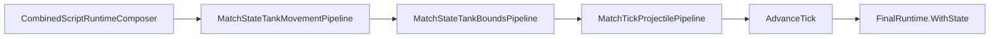

# Task 5.125 — Wall / Obstacle Collision Plan

> **Nur Dokumentation.** Keine Implementierung, keine Tests, keine Änderungen an `src/`, `tests/`, Projekten, Solution oder `game/`.
>
> Sprache: Erklärungen überwiegend auf Deutsch; Typnamen und API-Namen wie im Code auf Englisch.

## 1. Purpose

Nach Tasks **5.119–5.124** und [TANK_BOUNDS_INTEGRATION_CHECKPOINT.md](TANK_BOUNDS_INTEGRATION_CHECKPOINT.md) ist der **Arena-Outer-Bounds**-MVP im Combined-Runtime-Pfad abgeschlossen: [`CombinedRuntimeTickPipeline`](../src/ScriptTanks.Core/Scripting/CombinedRuntimeTickPipeline.cs) wendet [`MatchStateTankBoundsPipeline`](../src/ScriptTanks.Core/Match/MatchStateTankBoundsPipeline.cs) nach Movement und vor der Projektilphase an.

**Neue Lücke:** Statische **innere** Wände und Hindernisse ([`WallBlock`](../src/ScriptTanks.Core/Arena/WallBlock.cs) auf [`ArenaDefinition`](../src/ScriptTanks.Core/Arena/ArenaDefinition.cs)) werden für **Panzer** pro Tick noch nicht als Occupancy-Kollision behandelt. Panzer können sich nach Movement + Bounds in Wand-Footprints bewegen.

**Ziel von 5.125:** Design-Plan für **Wall / Obstacle Collision** — Kategorien trennen, MVP-Policy für Tank-vs-Wall, bestehendes Projektil-vs-Wall dokumentieren, vorgeschlagene Combined-Tick-Reihenfolge, reine Modell-Skizzen und Follow-ups **5.126–5.131**. Dieses Dokument ändert **kein** Verhalten.

**Test-Baseline (bekannter Checkpoint nach 5.124):** **2966** Tests, **0** Warnungen.

Querverweise: [TANK_BOUNDS_INTEGRATION_CHECKPOINT.md](TANK_BOUNDS_INTEGRATION_CHECKPOINT.md), [TANK_BOUNDS_ARENA_COLLISION_PLAN.md](TANK_BOUNDS_ARENA_COLLISION_PLAN.md), [TANK_MOVEMENT_INTEGRATION_CHECKPOINT.md](TANK_MOVEMENT_INTEGRATION_CHECKPOINT.md), [COMBINED_RUNTIME_LOGGING_CHECKPOINT.md](COMBINED_RUNTIME_LOGGING_CHECKPOINT.md).

Dieser Plan setzt die in [TANK_BOUNDS_INTEGRATION_CHECKPOINT.md](TANK_BOUNDS_INTEGRATION_CHECKPOINT.md) §11 empfohlene Hauptspur **Wall / Obstacle Collision** konkret um.

## 2. Current State After 5.124

### Combined tick (authoritative nach 5.122–5.124)

Quelle: [TANK_BOUNDS_INTEGRATION_CHECKPOINT.md](TANK_BOUNDS_INTEGRATION_CHECKPOINT.md) §4, [`CombinedRuntimeTickPipeline.Step`](../src/ScriptTanks.Core/Scripting/CombinedRuntimeTickPipeline.cs).

```text
CombinedScriptRuntimeComposer.Run
→ MatchStateTankMovementPipeline.Step
→ MatchStateTankBoundsPipeline.Step
→ MatchTickProjectilePipeline.StepProjectilesAndResolveHits
→ MatchStateTickAdvanceSystem.AdvanceTick
→ finalRuntime = scriptResult.FinalRuntime.WithState(steppedState)
```



### Verhalten heute

| Concern | Status |
| ------- | ------ |
| Movement application (`VelocityPerTick`) | Implementiert — [`ScriptMappedMovementRequestApplicationPipeline`](../src/ScriptTanks.Core/Scripting/ScriptMappedMovementRequestApplicationPipeline.cs) |
| Movement integration (`Position += VelocityPerTick`) | Implementiert — [`MatchStateTankMovementPipeline`](../src/ScriptTanks.Core/Match/MatchStateTankMovementPipeline.cs) |
| Arena outer bounds (runtime tick) | Implementiert — [`MatchStateTankBoundsPipeline`](../src/ScriptTanks.Core/Match/MatchStateTankBoundsPipeline.cs) |
| **Tank vs static wall / obstacle** | **Fehlt** — Movement und Bounds ignorieren `Arena.WallBlocks` |
| **Projectile vs wall** | **Bereits in Treffererkennung** — [`ProjectileHitDetection.Detect`](../src/ScriptTanks.Core/Projectiles/ProjectileHitDetection.cs) prüft `arena.WallBlocks` **vor** Tanks, [`CollisionChecks.CircleIntersectsRect`](../src/ScriptTanks.Core/Geometry/CollisionChecks.cs) |
| Projektil-Treffer vs Tanks (combined) | Nutzt **post-bounds** `tank.Movement.Position` (5.123) |
| SpawnTick owner filter + movement + bounds | Verifiziert (5.123) |
| Legacy [`MatchTickPipeline`](../src/ScriptTanks.Core/Match/MatchTickPipeline.cs) | Kein Movement, kein Bounds, kein Tank-Wall |

Setup-Zeit: [`MatchSetupValidator`](../src/ScriptTanks.Core/Match/MatchSetupValidator.cs) meldet `TankHitboxIntersectsWall` für [`MatchInitialState`](../src/ScriptTanks.Core/Match/MatchInitialState.cs) — **nur** vor dem Lauf, nicht pro Tick.

### Nächste Geometrie-Schicht

**Tank-vs-Wall** als expliziter Combined-Tick-Schritt. **Projektil-vs-Wall** primär dokumentieren und in 5.130 ggf. regressionshärten — kein zweites Greenfield-„Implement projectile-wall“-Track, sofern das bestehende Hit-System ausreicht.

## 3. Problem Statement

Die Simulation braucht eine **deterministische** Behandlung statischer Hindernisse:

- Wände, Blöcke, Cover, Barrieren, Säulen, zukünftige Map-Geometrie

### Fragen, die dieser Plan beantwortet

| Frage | Kurzantwort (MVP-Richtung) |
| ----- | -------------------------- |
| Können Panzer durch Hindernisse fahren? | **Nein** — Tank-Wall-Pipeline blockiert Occupancy (MVP: Rollback) |
| Treffen Projektile Hindernisse? | **Ja** — bereits in [`ProjectileHitDetection`](../src/ScriptTanks.Core/Projectiles/ProjectileHitDetection.cs) |
| Läuft Hindernis-Kollision vor Projektil-Tank-Treffern? | Tank-Wall **vor** Projektilphase; innerhalb Projektilphase: Wand **vor** Tank (bereits so) |
| Entstehen neue Combat-Logs? | **Nein** im ersten Tank-Wall-Implementierungstrack |
| Neue Replay-Frame-Typen? | **Nein** — weiter [`MatchState`](../src/ScriptTanks.Core/Match/MatchState.cs) only |
| Welche Kollisionsform zuerst? | Kreis (Hitbox/Projektil-Radius) vs **AABB** [`FixedRect`](../src/ScriptTanks.Core/Geometry/FixedRect.cs) |
| Was bleibt bewusst zurück? | Slide, Sweep, Tank-Tank, LOS, Pathfinding, zerstörbare Wände, Godot |

## 4. Scope and Non-Scope

### In scope (dieser Plan)

| Thema | Inhalt |
| ----- | ------ |
| Statische achsenparallele Rechtecke | [`WallBlock`](../src/ScriptTanks.Core/Arena/WallBlock.cs) / `FixedRect` |
| Tank-Kollision gegen Hindernisse | Neuer Pipeline-Schritt + Combined-Integration (Follow-ups) |
| Projektil-vs-Wall | Policy-Dokumentation + Test-Strategie (bestehendes Verhalten) |
| Reine Domain-/Result-Skizzen | Keine Implementierung in 5.125 |
| Combined-Tick-Reihenfolge | Wall **nach** Bounds, **vor** Projektilen |
| Follow-up-Tasks | 5.126–5.131 |

### Out of scope

| Thema | Grund |
| ----- | ----- |
| Dynamische / bewegliche Hindernisse | Eigener Track |
| Zerstörbare Wände | Health/Damage-Modell fehlt |
| Tank-vs-Tank | Separate Policy und Reihenfolge |
| Pathfinding / Navigation | Nicht in Movement-Collision mischen |
| Sensor line-of-sight | Separater Sensor-Track |
| Godot-Rendering, UI-Overlays, Heatmaps | `game/` / Viz später |
| Replay-Format-Änderung | MVP: Positionen in `MatchState` |
| Neue `CombatLogEventTypes` (MVP) | Wie Bounds-Track |
| Live PvP / Networking | — |
| Performance-Tuning über deterministische Struktur hinaus | Erst Korrektheit |

## 5. Collision Categories

| Kategorie | Status | Verantwortung / Notizen |
| --------- | ------ | ------------------------ |
| Arena outer bounds | **Gelöst** | [`MatchStateTankBoundsPipeline`](../src/ScriptTanks.Core/Match/MatchStateTankBoundsPipeline.cs) — äußeres Rechteck |
| **Tank vs static wall** | **Geplant (dieser Track)** | Occupancy nach Movement + Bounds |
| **Projectile vs static wall** | **Teilweise gelöst** | [`ProjectileHitDetection`](../src/ScriptTanks.Core/Projectiles/ProjectileHitDetection.cs) + [`MatchStateProjectileHitSystem`](../src/ScriptTanks.Core/Match/MatchStateProjectileHitSystem.cs); Combined-Ordering mit post-wall Tank-Positionen prüfen |
| Tank vs tank | Später | Eigener Plan (z. B. 5.136) |
| Sensor LOS vs wall | Später | Nicht in Tank-Movement-Collision |
| Navigation um Hindernisse | Später | Planner separat |
| Zerstörbare Wand | Später | Damage-Modell |

**Wichtig:** Wall-Collision ist **nicht** Pathfinding, **nicht** Sensor-LOS, **nicht** Zerstörbarkeit und **nicht** Godot-Visualisierung. Diese Concerns teilen nur die gleiche Arena-Geometrie.

## 6. Static Obstacle Representation

### Bestehende Typen (wiederverwenden)

| Typ | Rolle |
| --- | ----- |
| [`WallBlock`](../src/ScriptTanks.Core/Arena/WallBlock.cs) | Stabile `Id` + [`FixedRect`](../src/ScriptTanks.Core/Geometry/FixedRect.cs) `Bounds` — **rein Daten**, keine Kollisionsantwort im Struct |
| [`ArenaDefinition.WallBlocks`](../src/ScriptTanks.Core/Arena/ArenaDefinition.cs) | Geordnete, validierte Liste (eindeutige IDs, innerhalb Arena-Bounds) |
| [`ArenaCatalog`](../src/ScriptTanks.Core/Arena/ArenaCatalog.cs) | Fixtures mit/ohne Wände (z. B. `OpenTestArena` leer; andere Arenen mit Blöcken) |

**MVP-Empfehlung:** Kein neues `ArenaObstacle`-Pflichtmodell in 5.126 — zuerst **`WallBlock`** + Tank-Obstacle-**Status/Record/Result**-Typen. Aliase (`ObstacleId`, `ArenaObstacle`) können in 5.126 bei Bedarf als Skizze diskutiert werden.

### Geometrie-Policy

| Regel | MVP |
| ----- | --- |
| Hindernisse | Statisch |
| Form | Achsenparalleles Rechteck (AABB) |
| Koordinaten | Arena-/Welt-Fixed |
| Mathematik | **Fixed-only** — kein `float`/`double` in Core-Collision |
| Tank-Test | Kreis (`HitboxRadius`) vs Rechteck |
| Projektil-Test | Kreis (`ProjectileDefinition.Radius`) vs Rechteck — **bereits** [`CollisionChecks.CircleIntersectsRect`](../src/ScriptTanks.Core/Geometry/CollisionChecks.cs) |
| Reihenfolge | Stabile `WallBlocks`-Array-Reihenfolge; erste blockierende Wand gewinnt (Tank-MVP analog zu Projektilen) |
| Randkontakt | Inklusiv wie bestehende Geometrie (Tangent = overlap) |

## 7. Tank-vs-Wall Collision Options

### Option A — Vollständiger Movement-Rollback / blockierte Bewegung

Wenn die **bounded candidate position** (nach Movement + Bounds) mit einem Hindernis überlappt, wird die Tank-`Position` auf die **legale Position vor Movement** zurückgesetzt.

| Vorteile | Nachteile |
| -------- | --------- |
| Sehr deterministisch | Weniger „smooth“ an Ecken |
| Einfach zu testen | Kein Gleiten entlang Wänden |
| Geringe Komplexität | Kann „steif“ wirken |
| Passt zu reinen Pipeline-Schritten | — |

### Option B — Achsengetrenntes Sliding

X und Y unabhängig auflösen, sodass Panzer an Wänden entlanggleiten.

| Vorteile | Nachteile |
| -------- | --------- |
| Bessere Top-Down-Game-Feel | Mehr Randfälle (Ecken, Diagonalen) |
| Üblich in Arcade-Tanks | Braucht klare Abhängigkeit von Pre-Move-Position |
| Noch deterministisch bei fester Achsen-Reihenfolge | Höherer Test- und Review-Aufwand |

### Option C — Push-out / minimale Penetration

Bei Overlap Panzer entlang der kleinsten Penetrationsachse herausdrücken.

| Vorteile | Nachteile |
| -------- | --------- |
| Kann leichte Overlaps korrigieren | Überraschende Bewegungsrichtung möglich |
| Nützlich für Spawn-Korrektur (später) | Multi-Wall-Kreuzungen komplex |
| | Stabile Tie-Breaks nötig |

### Option D — Swept circle vs rectangle

Bewegungssegment gegen erweiterte Hindernisse prüfen (Tunneling vermeiden).

| Vorteile | Nachteile |
| -------- | --------- |
| Beste physikalische Korrektheit | Höchste Komplexität |
| Verhindert „Durchtunneln“ bei hoher Geschwindigkeit | Für ersten MVP oft unnötig bei begrenzter `VelocityPerTick` |
| | Besser als späteres Hardening (5.133+) |

## 8. Recommended MVP Tank Collision Policy

**Gesperrt für Implementierung 5.126–5.130 (Tank-Track):**

```text
MVP = final-position circle-vs-AABB overlap test on bounded candidate;
      if overlap → blocked move → rollback to pre-movement legal position.
```

### Rollback-Ziel (unmissverständlich)

| Position | Rolle |
| -------- | ----- |
| **Pre-movement legal position** | `Movement.Position` **vor** [`MatchStateTankMovementPipeline`](../src/ScriptTanks.Core/Match/MatchStateTankMovementPipeline.cs) (Start-of-tick für diesen Panzer) — **das ist das Rollback-Ziel** |
| Raw moved position | Nach Movement, ggf. außerhalb Arena / in Wand |
| Bounded candidate | Nach Bounds auf raw moved position |
| **Nicht** Rollback-Ziel | Bounded candidate allein — das wäre „stehen bleiben in overlap nahe Wand“, nicht „Bewegung verwerfen“ |

Formulierung **„movement+bounds chain“** allein ist missverständlich; der Plan meint explizit: **zurück auf Pre-Move**, nicht „zurück auf post-bounds pre-wall“.

### Verarbeitungssemantik (konzeptionell)

```text
for each tank (ascending index):
  preMovePosition = position from state before movement step
  candidatePosition = position after movement + bounds (bounded candidate)
  if destroyed → SkippedDestroyed, position unchanged
  else if circle(preMove) already overlaps any wall → StartedInsideObstacle (policy: position unchanged in MVP; no silent multi-wall recovery)
  else if circle(candidate) overlaps any wall (stable WallBlocks order, first hit wins):
       FinalPosition = preMovePosition
       status = BlockedByObstacle
  else:
       FinalPosition = candidatePosition
       status = Unchanged (or equivalent)
  VelocityPerTick preserved (unless a later explicit task changes this)
```

### Warum Option A für MVP

| Grund | Detail |
| ----- | ------ |
| Determinismus | Klare Eingabe/Ausgabe pro Tank |
| Testbarkeit | „Move into wall → ends at pre-move“ |
| Pipeline-Stil | Analog zu Movement/Bounds-Records |
| Scope | Slide (B) und Sweep (D) bewusst später |
| Composition | Läuft auf bereits legaler Arena-Position (post-bounds) |

### StartedInsideObstacle

Wenn ein lebender Panzer **bereits** bei Tick-Start mit einer Wand überlappt: MVP-Status dokumentieren, Position **nicht** stillschweigend per Push-out retten. Explizite Recovery-Policy gehört in einen späteren Task.

### Spätere Upgrade-Option (nicht MVP)

**5.133+:** Achsengetrenntes Sliding für besseres Game-Feel — nur nach eigenem Plan-Task.

## 9. Projectile-vs-Wall Collision Policy

### Bestehendes Verhalten (Repo — nicht neu erfinden)

[`ProjectileHitDetection.Detect`](../src/ScriptTanks.Core/Projectiles/ProjectileHitDetection.cs):

```text
for each WallBlock in arena.WallBlocks (array order):
  if CircleIntersectsRect(projectile, wall.Bounds) → return Wall hit (first wins)
for each candidate tank in caller order:
  if CirclesOverlap(projectile, tank) → return Tank hit
```

[`MatchTickProjectilePipeline`](../src/ScriptTanks.Core/Match/MatchTickProjectilePipeline.cs):

```text
StepProjectiles
→ ResolveProjectileHits  (uses ProjectileHitDetection)
→ RemoveInactiveProjectiles
```

[`MatchStateProjectileHitSystem`](../src/ScriptTanks.Core/Match/MatchStateProjectileHitSystem.cs) deaktiviert Projektil bei Treffer; [`ProjectileHitKind.Wall`](../src/ScriptTanks.Core/Projectiles/ProjectileHitKind.cs). Tests existieren u. a. in [`ProjectileHitDetectionTests`](../tests/ScriptTanks.Core.Tests/Projectiles/ProjectileHitDetectionTests.cs), [`MatchStateProjectileHitSystemTests`](../tests/ScriptTanks.Core.Tests/Match/MatchStateProjectileHitSystemTests.cs).

### MVP-Policy (Dokumentation, nicht Re-Implementierung)

| Regel | MVP |
| ----- | --- |
| Projektil vs Wand | Radius vs `WallBlock.Bounds` — **bereits implementiert** |
| Reihenfolge innerhalb Hit | **Wand vor Tank** |
| Bei Wandtreffer | Projektil `IsActive = false`; **kein** Wandschaden |
| Ricochet / Splash / Explosion | **Nein** |
| Swept projectile-wall | **Nein** im ersten Track, außer Audit zeigt Lücke bei `StepProjectiles` |

### Trennung der Concerns

| Concern | Was es steuert |
| ------- | -------------- |
| **Tank-wall** | Legale **Tank-Positionen** (Occupancy) |
| **Projectile-wall** | Projektil-**Lebensdauer** / Linienblockierung |
| **Sensor LOS** | **Nicht** automatisch durch Projektil-wall gelöst |

### Combined-Tick-Anforderung

Nach Integration von Tank-Wall müssen Projektil-Tank-Treffer **post-wall** Tank-Zentren sehen — analog zu post-bounds (5.123). Projektil-Wand-Treffer nutzen weiterhin Projektil-`Position` nach `StepProjectiles` (bestehend).

**Follow-up 5.132 (optional):** Nur wenn Audit Lücken findet (z. B. Tunneling, Ordering mit post-wall Tanks) — **kein** paralleles „implement wall hits from scratch“.

## 10. Proposed Combined Tick Flow

### Empfohlener Flow (ab 5.129)

```text
CombinedScriptRuntimeComposer.Run
→ MatchStateTankMovementPipeline.Step
→ MatchStateTankBoundsPipeline.Step
→ MatchStateTankObstacleCollisionPipeline.Step
→ MatchTickProjectilePipeline.StepProjectilesAndResolveHits
→ MatchStateTickAdvanceSystem.AdvanceTick
→ finalRuntime = scriptResult.FinalRuntime.WithState(steppedState)
```

**Namensalias:** `MatchStateTankWallCollisionPipeline` — gleiche Semantik; Implementierung wählt einen Namen in 5.128.

```mermaid
flowchart LR
  composer[CombinedScriptRuntimeComposer]
  move[MatchStateTankMovementPipeline]
  bounds[MatchStateTankBoundsPipeline]
  wall[MatchStateTankObstacleCollisionPipeline]
  projectile[MatchTickProjectilePipeline]
  advance[AdvanceTick]
  final[FinalRuntime.WithState]
  composer --> move --> bounds --> wall --> projectile --> advance --> final
```



### Semantik pro Schritt

| Schritt | Position für Folgeschritte |
| ------- | --------------------------- |
| Movement | Rohe integrierte Position |
| Bounds | Arena-legale **candidate** Position |
| Wall | **Finale** Tank-Position (candidate oder Pre-Move-Rollback) |
| Projectile hits (tanks) | **Post-wall** Zentren |
| Advance | `CurrentTick + 1` |

### Legacy

[`MatchTickPipeline.Step`](../src/ScriptTanks.Core/Match/MatchTickPipeline.cs) bleibt unverändert bis expliziter Migration/Audit — **kein** Tank-Wall, kein Bounds in Legacy.

### `CombinedRuntimeTickResult` (5.129, geplant)

Optionales Feld `TankObstacleCollisionResult` (Name in 5.126 festlegen) mit Referenz-Kette analog Movement/Bounds — Details in 5.126/5.129.

## 11. Proposed Pure API / Result Model Sketch

**Nur Skizzen — nicht implementieren in 5.125.**

### State-chain requirement (Rollback)

Tank-Wall-**BlockedMove** braucht pro Panzer:

| Feld | Bedeutung |
| ---- | --------- |
| `InitialPosition` | Pre-movement legal position (Rollback-Ziel) |
| `CandidatePosition` | Post-movement, post-bounds position (wird gegen Wände geprüft) |
| `FinalPosition` | Entweder `CandidatePosition` oder `InitialPosition` |

Die Pipeline muss **beide** Positionen kennen. Ein alleiniges `Step(stateAfterBounds)` reicht **nur**, wenn Records die Pre-Move-Position explizit tragen (z. B. aus [`MatchStateTankMovementRecord.InitialMovement`](../src/ScriptTanks.Core/Match/MatchStateTankMovementRecord.cs)) oder ein zweites State-Snapshot übergeben wird.

**Exakte `Step(...)`-Signatur:** Entscheidung in **5.128**, nicht in diesem Plan.

### Bevorzugte API-Richtungen (ohne Festlegung)

```csharp
// Richtung 1: zwei State-Snapshots
public static MatchStateTankObstacleCollisionResult Step(
    MatchState preMovementState,
    MatchState boundedCandidateState);

// Richtung 2: ein Kandidat + Movement-Result für Pre-Move-Records
public static MatchStateTankObstacleCollisionResult Step(
    MatchState boundedCandidateState,
    MatchStateTankMovementResult movementResult);
```

Beide Richtungen müssen dieselbe deterministische Semantik liefern; 5.128 wählt eine.

### Status-Enum (Skizze)

```csharp
public enum MatchStateTankObstacleCollisionStatus
{
    Unchanged = 0,
    BlockedByObstacle = 1,
    SkippedDestroyed = 2,
    StartedInsideObstacle = 3,
}
```

### Record (Skizze)

```csharp
public sealed class MatchStateTankObstacleCollisionRecord
{
    public int TankIndex { get; }
    public TankId TankId { get; }
    public FixedVec2 InitialPosition { get; }      // pre-movement
    public FixedVec2 CandidatePosition { get; }    // post-move + post-bounds
    public FixedVec2 FinalPosition { get; }
    public MatchStateTankObstacleCollisionStatus Status { get; }
    public string? BlockingWallBlockId { get; }   // WallBlock.Id, first stable hit
}
```

### Result (Skizze)

```csharp
public sealed class MatchStateTankObstacleCollisionResult
{
    public MatchState InitialState { get; }   // typically == boundedCandidateState input ref
    public MatchState FinalState { get; }
    public IReadOnlyList<MatchStateTankObstacleCollisionRecord> Records { get; }
}
```

### Pipeline (Skizze)

```csharp
public static class MatchStateTankObstacleCollisionPipeline
{
    // Signature decided in 5.128 — must supply pre-move vs candidate per tank
    public static MatchStateTankObstacleCollisionResult Step(/* ... */);
}
```

### Combined result chain (5.129)

```text
TankMovementResult.FinalState  → input to bounds
TankBoundsResult.FinalState    → bounded candidate input to wall
TankObstacleCollisionResult.InitialState == TankBoundsResult.FinalState (reference)
TankObstacleCollisionResult.FinalState   → input to projectile phase
```

Validierung analog [`CombinedRuntimeTickResult`](../src/ScriptTanks.Core/Scripting/CombinedRuntimeTickResult.cs).

### Projektil-Wall-Records (optional, wahrscheinlich unnötig)

Separate `ProjectileObstacleCollisionRecord`-Typen nur wenn das Hit-System refaktoriert wird. MVP: bestehendes [`ProjectileHitResult`](../src/ScriptTanks.Core/Projectiles/ProjectileHitResult.cs) / [`ProjectileHitKind.Wall`](../src/ScriptTanks.Core/Projectiles/ProjectileHitKind.cs) beibehalten.

## 12. Determinism and Geometry Rules

| Regel | Anforderung |
| ----- | ------------ |
| Zahlenart | `Fixed` / `FixedVec2` only in Core-Collision |
| Hindernis-Reihenfolge | `Arena.WallBlocks` Index-Reihenfolge; erste Überlappung gewinnt |
| Tank-Reihenfolge | Aufsteigender Tank-Index (wie Movement/Bounds) |
| Tie-breaks | Explizit dokumentieren in 5.128 (z. B. erste `WallBlock.Id` in Array-Order) |
| Kollisionsprimitive | Kreis vs AABB: closest point on rect to circle center; `distanceSquared <= radiusSquared` — wie [`CollisionChecks.CircleIntersectsRect`](../src/ScriptTanks.Core/Geometry/CollisionChecks.cs) |
| Sqrt | Vermeiden (konsistent mit bestehender Geometrie) |
| Rand | Inklusiv (Tangent = Treffer) — konsistent mit `CollisionChecks`-Dokumentation |
| Input | Keine Mutation des Eingabe-`MatchState`; neuer `FinalState` konstruieren |
| Zeit / Zufall | Keine |
| Godot-Physik | Nicht in Core |

Tank-Radius: `tank.Definition.Stats.HitboxRadius`. Projektil-Radius: `projectile.Definition.Radius`.

## 13. Replay and Logging Policy

Spiegelt [TANK_BOUNDS_INTEGRATION_CHECKPOINT.md](TANK_BOUNDS_INTEGRATION_CHECKPOINT.md) §9 und [COMBINED_RUNTIME_LOGGING_CHECKPOINT.md](COMBINED_RUNTIME_LOGGING_CHECKPOINT.md).

| Bereich | MVP-Policy |
| ------- | ---------- |
| Replay-Frames | Weiterhin nur [`MatchState`](../src/ScriptTanks.Core/Match/MatchState.cs) |
| Wall-Debug-Frames | **Keine** separaten Frame-Typen |
| Sichtbarkeit | Blockierte Positionen über `Tanks[].Movement.Position` in Frames |
| `CombatLogEventTypes` | **Keine** neuen Event-Typen im ersten Tank-Wall-Task |
| Rich Combined-Logs | Unverändert (`match_started`, `script_tick`, Fire-Subset, `match_ended`) |
| Diagnostics / Heatmaps | Später, expliziter Task |

[`CombinedRuntimeReplayRecorder`](../src/ScriptTanks.Core/Replay/CombinedRuntimeReplayRecorder.cs) und [`LoggedCombinedRuntimeRunner`](../src/ScriptTanks.Core/Scripting/LoggedCombinedRuntimeRunner.cs) erben Verhalten über [`CombinedRuntimeTickPipeline`](../src/ScriptTanks.Core/Scripting/CombinedRuntimeTickPipeline.cs) nach 5.129 — ohne Log-Schema-Änderung im MVP.

## 14. Future Test Strategy

### Empfohlene Test-Leiter

| Stufe | Inhalt |
| ----- | ------ |
| **5.126** Domain models | Null-Validierung, defensive Kopien, read-only Records, Status-Stabilität, Result-Chain-Validierung |
| **5.127** Geometry | `CircleIntersectsRect` / Tank-Helfer: outside, edge touch, corner touch, overlap, deterministischer Tie-Break; ggf. Erweiterung von [`CollisionChecksTests`](../tests/ScriptTanks.Core.Tests/Geometry/) falls vorhanden |
| **5.128** Tank wall pipeline | Keine Hindernisse → unchanged; Move in Wand → **FinalPosition = pre-move**; nah an Wand ohne Overlap → unchanged; destroyed skipped; mehrere Wände → erste stabile `WallBlock.Id`; StartedInsideObstacle; `VelocityPerTick` erhalten; Input-State-Purity |
| **5.129–5.130** Combined | `movement → bounds → wall → projectiles`; Projektil-Treffer nutzt post-wall Position; Wand-Block verhindert Treffer, den raw/bounded candidate erlaubt hätte; Bounds vor Wall; Legacy `MatchTickPipeline` ohne Tank-Wall |
| **Runner / Replay / Logged** | Final runtime / letzter Frame = wall-blocked Position; Logs unverändert ohne neue Event-Typen |
| **Projektil-Wall (Audit)** | Bestehende Tests erweitern — [`ProjectileHitDetectionTests`](../tests/ScriptTanks.Core.Tests/Projectiles/ProjectileHitDetectionTests.cs), [`MatchStateProjectileHitSystemTests`](../tests/ScriptTanks.Core.Tests/Match/MatchStateProjectileHitSystemTests.cs) |

### Wichtige Regression (Combined)

Analog 5.123 raw-vs-bounded: Ein Panzer bewegt sich in Richtung Wand; **candidate** überlappt Wand; **final** = pre-move; Projektil, das nur candidate trifft, darf **nicht** schaden — erst nach Slide-Upgrade ggf. andere Semantik.

## 15. Recommended Follow-up Tasks

| Task | Inhalt |
| ---- | ------ |
| **5.126** | Tank-Obstacle-Domain-Modelle (`Status`, `Record`, `Result`) — `WallBlock` wiederverwenden |
| **5.127** | Radius-vs-Rechteck-Helfer dokumentieren/implementieren (Reuse [`CollisionChecks`](../src/ScriptTanks.Core/Geometry/CollisionChecks.cs)) |
| **5.128** | [`MatchStateTankObstacleCollisionPipeline`](../src/ScriptTanks.Core/Match/) — Signatur mit Pre-Move vs Candidate; reine `Step` |
| **5.129** | [`CombinedRuntimeTickPipeline`](../src/ScriptTanks.Core/Scripting/CombinedRuntimeTickPipeline.cs) + `CombinedRuntimeTickResult` |
| **5.130** | Regression: Movement + Bounds + Wall + Projectile; Legacy-Grenze; Runner/Replay/Logged-Smoke |
| **5.131** | `WALL_OBSTACLE_COLLISION_INTEGRATION_CHECKPOINT.md` (docs) |

### Regeln für Follow-ups

- Keine Implementierung ohne Modelle → Helfer → Pipeline → Combined-Integration
- Kein Godot/UI vor deterministischem Core-Verhalten
- Kein Pathfinding im ersten Tank-Wall-MVP

### Optional später

| Task | Inhalt |
| ---- | ------ |
| **5.132** | Projektil-vs-Wall Combined-Regression / Audit (nur bei Lücke) |
| **5.133** | Axis-separated wall slide — Plan + Implementierung |
| **5.134** | Sensor line-of-sight through obstacles — Plan |
| **5.135** | Pathfinding / navigation around obstacles — Plan |
| **5.136** | Tank-vs-tank collision — Plan |

Nummerierung darf bei Bedarf angepasst werden; Reihenfolge der **Hauptspur 5.126–5.131** ist bindend.

## 16. Verification / Definition of Done

### Out of scope für 5.125

- Kein Produktionscode, keine Tests, keine Pipeline-Implementierung
- Keine Änderung an [`CombinedRuntimeTickPipeline`](../src/ScriptTanks.Core/Scripting/CombinedRuntimeTickPipeline.cs)
- Keine neuen `WallBlock`-Runtime-Regeln außerhalb der Planungsdokumentation
- Keine Änderung an bestehenden Checkpoint-/Plan-Dateien (außer dieser neuen Datei)

### Definition of Done

- [x] [`docs/WALL_OBSTACLE_COLLISION_PLAN.md`](WALL_OBSTACLE_COLLISION_PLAN.md) existiert mit Abschnitten **1–16**.
- [x] Post-5.124 Combined-Flow ist korrekt dokumentiert (§2).
- [x] Tank-vs-Wall und Projektil-vs-Wall sind getrennt; Projektil-Wall als **bestehend** markiert (§5, §9).
- [x] MVP-Optionen verglichen; **Rollback auf Pre-Move** empfohlen (§7–§8).
- [x] State-Chain Pre-Move vs Candidate für API dokumentiert (§11).
- [x] Zukünftige Pipeline-Reihenfolge und Replay/Logging-Policy klar (§10, §13).
- [x] Test-Leiter und Follow-ups 5.126–5.131 gelistet (§14–§15).
- [x] Keine Änderungen an `src/`, `tests/`, `game/`, `.csproj`, `.sln`.
- [x] `dotnet build ScriptTanks.sln -warnaserror` grün (nach Verifikationslauf).
- [x] `dotnet test ScriptTanks.sln` bleibt bei **2966** Tests (nach Verifikationslauf).

## Verification

Nach dem Schreiben dieses Dokuments (docs-only), vom **Repository-Root**:

```powershell
dotnet build ScriptTanks.sln -warnaserror
dotnet test ScriptTanks.sln
```

**Erwartung:**

- 0 Warnungen
- **2966** Tests bestanden (unverändert gegenüber 5.124)
